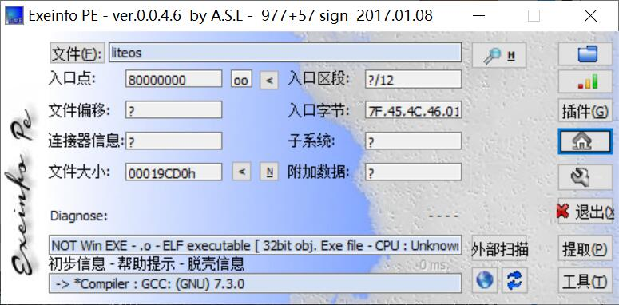
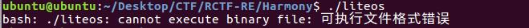
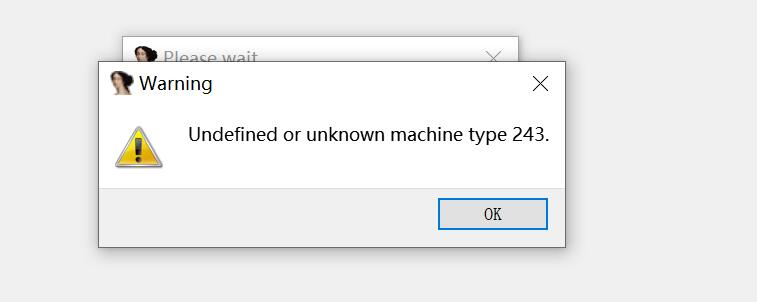
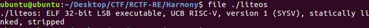
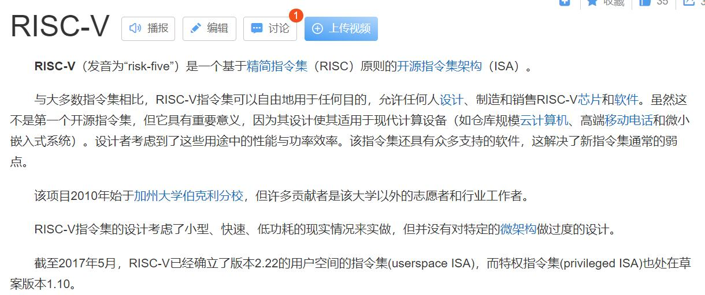
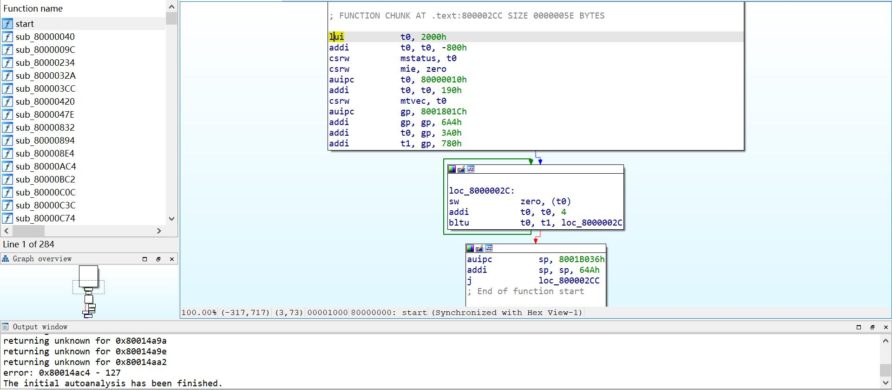
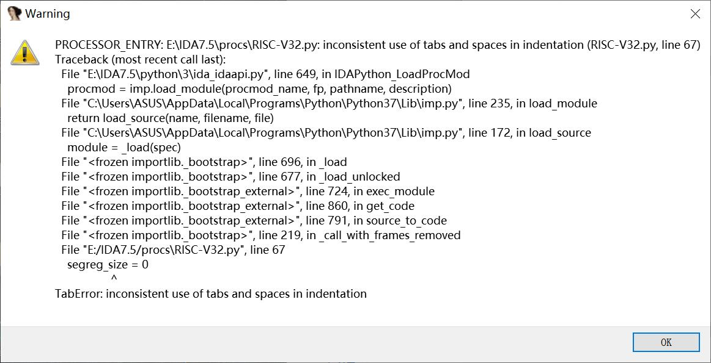
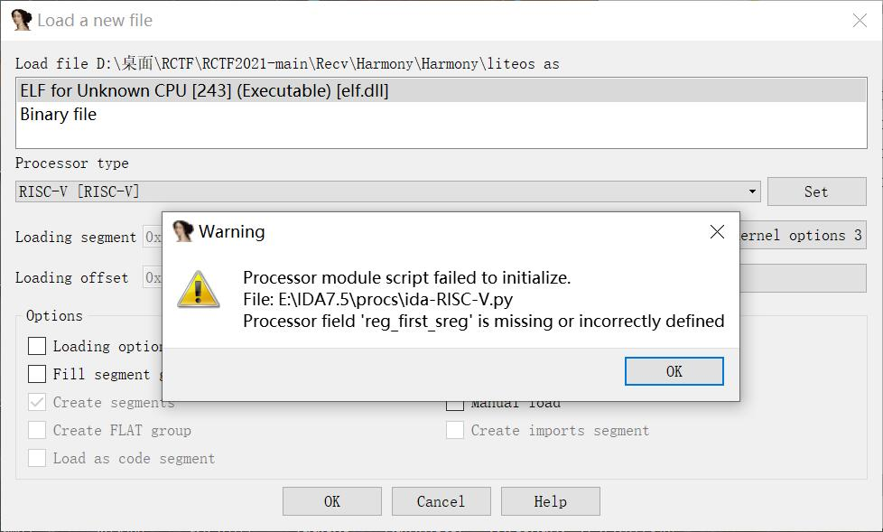
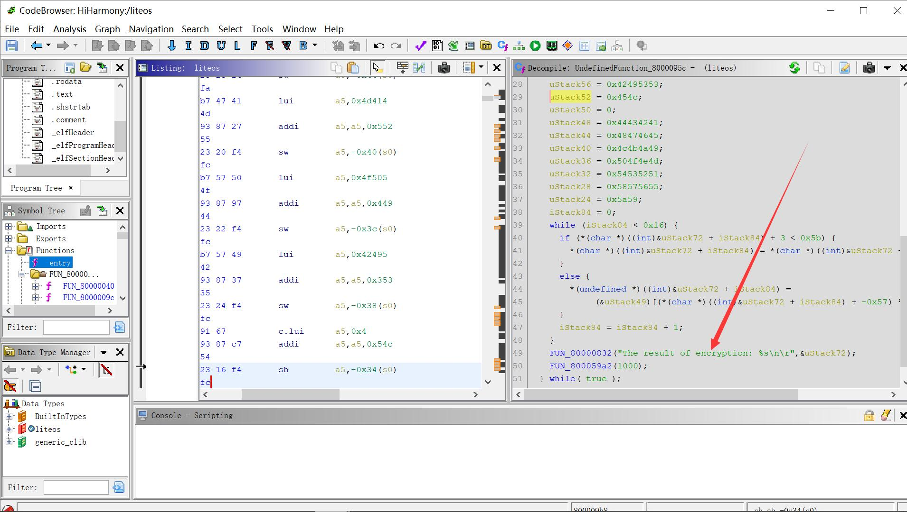

Hi!Harmony!-复现

一看题目是鸿蒙联想到鸿蒙操作系统

不过之前没做过这一方面的题目

<!--more-->

# Hi!Harmony!-复现

一看题目是鸿蒙联想到鸿蒙操作系统

不过之前没做过这一方面的题目

文件丢进EXEinfos里面看看文件信息



用Ubuntu打开看看,发现也不太行



准备用IDA静态分析 发现IDA打不开



用file命令查看下文件信息



看到了一个信息RISC-V 百度搜索下



一个指令集  怪不得IDA打开 搜下有没有关于IDA的RISC-V的插件https://github.com/shuffle2/riscv-ida

经过一大堆艰难的操作发现 不能F5。。。。。。。



总不能硬读汇编把 没学过这个架构 搜索其他脚本也报错 这也是为啥我再比赛过程中没做出该题的原因






后面想想用新学习到的Ghidra试试 发现还真的可以  不得不说这个反编译工具还是强啊



反编译伪代码  ---解密模块

```C

void UndefinedFunction_8000095c(void)

{
  int iStack84;
  undefined4 uStack72;
  undefined4 uStack68;
  undefined4 uStack64;
  undefined4 uStack60;
  undefined4 uStack56;
  undefined2 uStack52;
  undefined uStack50;
  undefined uStack49;
  undefined4 uStack48;
  undefined4 uStack44;
  undefined4 uStack40;
  undefined4 uStack36;
  undefined4 uStack32;
  undefined4 uStack28;
  undefined2 uStack24;
  
  do {
    FUN_80000832("Welcome to RCTF 2021...\n\r");
    uStack72 = 0x4d524148;
    uStack68 = 0x44594e4f;
    uStack64 = 0x4d414552;
    uStack60 = 0x4f505449;
    uStack56 = 0x42495353;
    uStack52 = 0x454c;
    uStack50 = 0;
    uStack48 = 0x44434241;
    uStack44 = 0x48474645;
    uStack40 = 0x4c4b4a49;
    uStack36 = 0x504f4e4d;
    uStack32 = 0x54535251;
    uStack28 = 0x58575655;
    uStack24 = 0x5a59;
    iStack84 = 0;
    while (iStack84 < 0x16) {
      if (*(char *)((int)&uStack72 + iStack84) + 3 < 0x5b) {
        *(char *)((int)&uStack72 + iStack84) = *(char *)((int)&uStack72 + iStack84) + '\x03';
      }
      else {
        *(undefined *)((int)&uStack72 + iStack84) =
             (&uStack49)[(*(char *)((int)&uStack72 + iStack84) + -0x57) % 0x1a];
      }
      iStack84 = iStack84 + 1;
    }
    FUN_80000832("The result of encryption: %s\n\r",&uStack72);
    FUN_800059a2(1000);
  } while( true );
}
```

注意因为数据是小端存储 所以提取出来要稍加注意

EXP

```python
data1 = [0x48,0x41,0x52,0x4d,0x4f,0x4e,0x59,0x44,
0x52,0x45,0x41,0x4d,0x49,0x54,0x50,0x4f,0x53,0x53,0x49,0x42,0x4c,0x45]

data2 = [0,0x41,0x42,0x43,0x44,0x45,0x46,0x47,0x48,
0x49,0x4a,0x4b,0x4c,0x4d,0x4e,0x4f,0x50,0x51,0x52,0x53,0x54,0x55,0x56,
0x57,0x58,0x59,0x5a]

flag = 'RCTF{'
for i in range(len(data1)):
    if data1[i] + 3 < 0x5b:
        flag += chr(data1[i] +3)
    else:
        flag += chr(data2[(data1[i] - 0x57) % 0x1a])
flag += '}'
print(flag)
```

